# Prompt Cache 系列 01：两代缓存框架——GPT-5.6 前后的机制、计费与路由差异

> **系列导航**：**01 两代框架（本篇）** → [[Prompt Cache系列02：GPT-5.6显式断点与Cache Write计费——从断点槽位到诊断工具|02 GPT-5.6 新机制详解]] → [[Prompt Cache系列03：Luna图文实测——1899次请求的Benchmark与Chat API零读取异常|03 Luna 图文实测与异常分析]]
>
> 本系列依据 2026-09-13 直接抓取的 OpenAI 官方正文（[Prompt caching 指南](https://developers.openai.com/api/docs/guides/prompt-caching)、[Prompt cache diagnostics 说明](https://developers.openai.com/api/docs/guides/prompt-caching/diagnostics)）与 2026-09-09～13 在 Azure OpenAI gpt-5.6-luna 部署上的实测数据写成。日期均为查阅/实测日期，不是功能发布日期。

## 为什么值得重新理解一遍 Prompt Cache

GPT-5.6 把 prompt caching 从一个"透明的后台优化"变成了**可控制、可计量、单独计费的一等机制**。在 GPT-5.6 之前，缓存对开发者几乎是黑盒：服务自动决定在哪里断点、写入不收费、命中数字按 128 的倍数取整报告。GPT-5.6 之后，断点位置可以自己选、写入按 1.25× 单独计费、命中按精确边界报告——**旧的经验规律（比如"cached_tokens 一定是 128N"）在新框架下不再成立**，而新框架的成本模型（写入有溢价）也让"无脑开缓存"不再总是划算。

两代框架的规则差异足够大，混用两代的经验是实际排错中最常见的坑。这一篇先把两套框架各自讲清楚，再看它们共享的底层：缓存到底存了什么、存在哪里、怎么路由。

## 缓存的本质：KV 状态，不是 token

模型处理输入 token 时要计算中间状态（key-value states，即 KV 张量），供后续 token 的注意力计算引用。Prompt caching 保存的就是**可复用前缀（prefix）的 KV 张量**——不是 token 文本本身。后续请求如果有相同前缀并且找到匹配的缓存条目，模型就跳过这段前缀的重复计算，只处理新增输入。

官方明确缓存覆盖**完整渲染上下文（full rendered context）**：OpenAI 隐藏指令（hidden system content）、developer 消息、工具定义（tool definitions）、会话历史（含文本、图片、文档和受支持的音频）。复用要求**整个渲染前缀逐字节匹配**——断点之前任何内容或相关设置变化，都会使之后的前缀无法匹配既有条目。

这与推理引擎层的 prefix caching 是同一件事的服务化封装，概念背景见 [[prefix-caching]]；为什么 Hybrid 注意力架构做这件事更难，见[[线性注意力时代的推理架构之二——为什么Hybrid模型难做PrefixCaching|线性注意力时代的推理架构之二]]。

## 两代框架总对照

官方"Summary of model differences"的核心内容（2026-09-13 抓取）：

| 行为 | GPT-5.6 及以后 | GPT-5.5 / GPT-5.5 Pro | 更早模型 |
|---|---|---|---|
| 隐式断点 | 最新 eligible 消息末尾 | 固定 2,048-token 间隔 | 固定的模型相关间隔 |
| 显式断点 | **支持** | 不支持 | 不支持 |
| `prompt_cache_key` | 可选，仅用于**计量隔离** | 稳定 key 用于**优化路由** | 稳定 key 用于**优化路由** |
| 最低可缓存前缀 | **1,024 个可见输入 token** | 随请求设置变化 | 随请求设置变化 |
| cached_tokens 报告 | **精确 eligible 边界**（不含 hidden） | 不含 hidden，**向下取整到 128 的倍数** | 同左 |
| 缓存读取费率 | **0.1× 普通输入价** | 模型相关 cached-input 价 | 同左 |
| 缓存写入费率 | **1.25× 普通输入价** | **无额外写入费** | 同左 |
| 生命周期控制 | `prompt_cache_options.ttl` | `prompt_cache_retention` | 同左 |
| 支持的保留值 | 仅 `"30m"` | 仅 `"24h"` | `"in_memory"` 或 `"24h"` |
| 实际生命周期 | 最近一次写入/复用后至少 30 分钟 | 通常约 30 分钟，最长 24 小时 | in_memory 约 5～10 分钟空闲，24h 最长 24 小时 |

## 旧框架（GPT-5.6 之前）：全自动、免写入费、128 取整

旧模型只有隐式缓存。服务从 hidden system message 起点开始，按模型相关的固定间隔（GPT-5.5 是 2,048 tokens）自动放置断点；只有位于最低可缓存长度之上的断点才有资格参与匹配。三个关键特征：

1. **写入不单独收费**。第一次处理长前缀时服务自动保存 KV 状态，账单上只有普通输入费。注意：**不收费不等于没有写入动作**——`in_memory` 描述的是保留策略，不是"免写入就能读取"的模式。读取缓存的因果前提永远是此前有过一次实际的状态保存（这一点在[[Prompt Cache系列02：GPT-5.6显式断点与Cache Write计费——从断点槽位到诊断工具|系列02]]展开）。
2. **cached_tokens 按 128 向下取整报告**。报告值 = 最后匹配断点位置 − hidden system tokens，再向下取整到 128 的倍数。所以旧模型上看到 5,888（46×128）、6,144（48×128）这类数字是报告粒度造成的，**不能反推图片或文本的真实 token 数是 128 的倍数**。还要注意放置与报告是两回事：**固定间隔是断点放置规则，128N 是报告口径**。固定间隔数到哪就断到哪、完全不看消息结构——缓存边界可以落在一条消息的中间。
3. **`prompt_cache_key` 是路由提示**。共享前缀的请求用稳定 key 帮助路由到同一台机器；单个 key 的流量建议控制在约 15 requests/min，更高流量按确定性映射拆分到多个 key。key 影响路由，但不锁定机器、不保证命中。

保留策略上，同时支持 `in_memory` 和 `24h` 的模型，默认值取决于组织的数据保留策略：未开启 Zero Data Retention 的组织默认 `24h`，开启 ZDR 的组织默认 `in_memory`。

## 新框架（GPT-5.6+）：可控断点、写入计费、精确报告

GPT-5.6 及以后的变化可以概括为"三个换轨"：

- **控制权换轨**：从"服务按固定间隔放断点"变为"开发者可以用 `prompt_cache_breakpoint` 精确指定断点，或继续用 implicit 模式让服务在最新 eligible 消息末尾放断点"。每个请求最多 4 个 cache write 槽位。
- **计费换轨**：写入 1.25×、读取 0.1×、普通输入 1×，**三类互斥不叠加**（写入的 1.25× 是该部分 token 的总费率，不是在 1× 之上再加收）。写一次＋完整读一次 = 1.35×（对比不缓存处理两次的 2×）；写一次＋读九次 = 2.15×（对比 10×）。复用还会免费刷新缓存有效期。
- **报告换轨**：cached_tokens 按**精确 eligible 边界**报告，不再向下取整 128。门槛统一为 1,024 个**可见**输入 token——hidden system 内容不计入这个最低长度。

一个常见误读要在这里点破：**"128N 是否还成立"与隐式/显式无关**——GPT-5.6+ 上隐式缓存同样不是 128 的倍数。两代的本质差别是切分依据：**旧框架按 token 计数切**（固定间隔，结构无关，边界可落消息中间），**新框架按内容结构切**（eligible 消息末尾或显式标记的 content block 边界），报告则都是精确值。实测隐式/默认配置下读到的 5,677、5,678、4,797 没有一个是 128 的倍数。代价是新框架对消息结构敏感——把上一轮的消息原地扩写会让旧端点从"消息末尾"变成"消息中间"而失效（见系列02 Gotcha #3），这在按计数切分的旧框架里反而不是问题。

`prompt_cache_key` 的语义也随之改变：GPT-5.6+ 的缓存路由由服务自动处理，**key 不再是优化命中的手段**，其用途变为按客户/用户/workspace 维护独立的缓存计量（也能防止跨用户的 cache-hit probing——通过提交候选 prompt 观察命中来探测别人缓存过什么）。诊断文档还明确：**key 变化可能让 usage 报告 miss，而物理上并没有 cache miss**。因此旧时代"按流量拆 key"的最佳实践不能原样搬到新模型上。

断点语法、槽位规则、lookup 边界和计费公式的完整细节在[[Prompt Cache系列02：GPT-5.6显式断点与Cache Write计费——从断点槽位到诊断工具|系列02]]。

## 缓存位置与路由：为什么命中从来不是确定性的

官方正文对缓存位置的描述只有一段，但信息量很大：

> Cached states live on individual machines, where traffic above 15 requests per minute can lead to overflow routing. A request can reuse a cached prefix only if it reaches a machine holding a matching entry that has not expired.

即：**缓存状态存在单台机器上**；请求只有被路由到"恰好持有未过期匹配条目"的那台机器才能命中。路由由 OpenAI 自动处理，在组织和处理区域内取决于三个因素：当前机器负载与可用容量、hidden 内容之后起始 token（含工具定义）的 hash、以及旧模型上的 `prompt_cache_key`。缓存不跨组织共享，也不跨数据驻留（data residency）的区域边界复用。

这解释了实测中反复看到的现象：相同请求偶发 miss（被路由到没有缓存的机器/副本）、新副本首次 miss 后续命中（预热）。命中本质上是概率事件，任何"配置对了就保证命中"的说法都不成立。

### 为什么不用 Redis 那种分布式缓存？

这是一个官方文档没有正面回答的问题，以下是基于公开信息的工程分析（标注：**推断，非官方结论**）：

1. **数据形态和体积**。缓存的是 KV 张量不是文本。粗略量级：几千 token 的前缀在大模型上对应的 KV 状态可达 GB 级（每 token × 每层 × 2（K/V）× hidden 维度 × 精度字节数）。这不是 Redis 典型的 KB～MB 级对象。
2. **带宽和延迟**。KV 状态要在 prefill 阶段以显存带宽量级供给 GPU。官方明确存储介质是"encrypted key/value tensors in **GPU-local storage**"——本机存储还能接受，跨网络搬运 GB 级张量的时间很容易吃掉缓存节省的计算时间。所以工程上的选择是"把请求路由到数据所在的机器"，而不是"把数据搬到请求所在的机器"。
3. **不是做不到，是权衡**。业界确实存在分布式 KV cache 方案——NVIDIA Dynamo 的 KV-aware routing 和多级 KV offload（显存→内存→SSD→对象存储）就是代表，参见 [[Scaling-Agentic-AI-with-NVIDIA-Dynamo-on-Azure|Scaling Agentic AI with NVIDIA Dynamo on Azure]]。OpenAI 选择"单机缓存＋智能路由"更可能是规模化服务下的成本/复杂度权衡。
4. **隐私不是主要原因**。文档对隐私的处理是加密存储、组织隔离、区域边界这些策略层手段；没有证据表明"不用分布式缓存"是隐私驱动的决策。

### 15 requests/min 是硬性指标吗？

不是配额意义上的硬限制。官方措辞是 "traffic above 15 requests per minute **can lead to** overflow routing"——这是一个**溢出路由开始变得可能的经验阈值**：单台机器容量有限，同一前缀的流量超过它的承载能力后，多出的请求会被路由到其他机器，而那些机器上可能没有这份缓存。三点边界：

- 超过 15 RPM 不会报错、不会拒绝请求，代价是**命中率下降**；
- 该阈值与机器负载和可用容量相关（路由因素之一就是 "current machine load and available capacity"），推断也与模型大小、上下文长度（决定单条缓存占用的显存/存储）有关——但**官方没有给出随 GPU 型号、显存、模型、context 大小变化的参数化公式**，不要自行外推；
- 旧模型上这也是"每个 `prompt_cache_key` 的流量建议值"的来源；GPT-5.6+ 路由自动化后，文档不再要求用户为此拆 key。

## 从旧模型迁移到 GPT-5.6+ 的检查清单

官方迁移建议，逐条对应上面的换轨：

1. 保留既有的稳定前缀结构；
2. 如果在用 `prompt_cache_key`，保留现值（语义变为计量隔离）；
3. 把 `prompt_cache_retention` 换成 `prompt_cache_options.ttl`；
4. 确认可复用前缀达到 1,024 可见 token 门槛；
5. 如果默认断点会把"每次都变的内容"写进缓存，在稳定前缀末尾加显式断点；
6. 后缀内容不值得缓存时用 `prompt_cache_options.mode: "explicit"`；
7. 迁移前后对比 `cached_tokens`、`cache_write_tokens`、延迟和总成本。

其中第 5、6 条对应迁移中最典型的坑（"共享前缀 ≠ 缓存前缀"），在[[Prompt Cache系列02：GPT-5.6显式断点与Cache Write计费——从断点槽位到诊断工具|系列02]]的 Gotchas 一节详解；我们在 Azure gpt-5.6-luna 部署上对这些规则的实测验证（以及一个尚未定性的 Chat API 图文异常）见[[Prompt Cache系列03：Luna图文实测——1899次请求的Benchmark与Chat API零读取异常|系列03]]。

## 关联阅读

- [[Prompt Cache系列02：GPT-5.6显式断点与Cache Write计费——从断点槽位到诊断工具]] — 断点槽位、计费公式、prompt 渲染顺序与诊断工具
- [[Prompt Cache系列03：Luna图文实测——1899次请求的Benchmark与Chat API零读取异常]] — 实测方法学与异常分析
- [[prefix-caching]] — 推理引擎层的 prefix caching 概念
- [[线性注意力时代的推理架构之二——为什么Hybrid模型难做PrefixCaching]] — 架构层视角
- [[Scaling-Agentic-AI-with-NVIDIA-Dynamo-on-Azure]] — 分布式 KV cache 的业界方案对照
