# Prompt Cache 系列 02：GPT-5.6 显式断点与 Cache Write 计费——从断点槽位到诊断工具

> **系列导航**：[01 两代框架](Prompt%20Cache系列01：两代缓存框架——GPT-5.6前后的机制、计费与路由差异.md) → **02 GPT-5.6 新机制详解（本篇）** → [03 Luna 图文实测与异常分析](Prompt%20Cache系列03：Luna图文实测——1899次请求的Benchmark与Chat%20API零读取异常.md)
>
> 依据 2026-09-13 抓取的官方正文（[Prompt caching 指南](https://developers.openai.com/api/docs/guides/prompt-caching)、[诊断说明](https://developers.openai.com/api/docs/guides/prompt-caching/diagnostics)）；实测数字来自 Azure gpt-5.6-luna 部署（详见系列03），仅作机制示例，不代表账单核验。

系列01 讲了两代框架的分野，这一篇把 GPT-5.6+ 新框架的四块细节拆开：**cache write 的因果与计费**、**显式/隐式断点与槽位规则**、**prompt 的渲染组成与顺序**、**prompt_cache_diagnostics 诊断工具**。

## Cache Write：因果、计费与字段解读

### 写入是读取的因果前提，但不是每次命中的伴随动作

三个层次分清楚：

1. **系统机制**：读取既有缓存，必然以对应的可复用状态**此前已被建立/保存**为前提。没有建立过缓存状态，就不可能读取到它。这里的"写入"是系统中的实际保存行为——不需要客户端调用什么"写缓存 API"，它发生在正常请求的处理过程中。
2. **当前请求命中 ≠ 当前请求写入**。命中读取的是**此前**某次请求（不一定是你自己的上一条，可能是同一复用范围内更早的请求）保存的状态。一次命中不要求当前请求再发生一次写入。
3. **写入过也不保证以后命中**。后续还要满足前缀匹配、可查找断点、配置兼容、缓存未过期、路由到对的机器等条件。

旧模型的 `in_memory` 缓存同样遵守这个因果——它也需要实际写入，只是由服务自动完成、**不单独收费**。`in_memory` 是保留策略的名字，不是"免写入就能读取"的模式：

| 比较项 | 旧模型自动缓存（如 in_memory） | GPT-5.6+ |
|---|---|---|
| 读取前是否需要先保存状态 | **需要** | **需要** |
| 用户是否要额外调用写入 API | 不需要 | 不需要（按缓存模式和断点自动处理） |
| 是否有额外写入收费 | 无 | 写入 token 按 1.25× 计费 |
| 没看到写入字段 = 没发生实际写入？ | **不能这样判断** | **也不能这样判断** |

### 写入是增量（delta）的，不是整套重写

同一个请求可以**同时**出现 `cached_tokens > 0` 和 `cache_write_tokens > 0`：前面的部分读取旧缓存，后面新增的部分写入缓存。写入量是**新增段的 token 数**，不是把整个前缀重写一遍。

Azure 实测的两个直接证据（2026-09-10/13，gpt-5.6-luna）：

**证据一：固定长文字＋每次换新图（Responses API）**——首次为文字前缀写入，后续换图只读不写：

| 请求 | 总 input | cached_tokens（读） | cache_write_tokens（写） |
|---|---:|---:|---:|
| 长文字＋图片 A（首次） | 6,616 | 0 | **5,676** |
| 同样文字＋新图片 B | 6,616 | **5,676** | 0 |
| 同样文字＋新图片 C | 6,616 | **5,676** | 0 |

注意：B、C 两次命中的是**图片之前的稳定文字前缀**，不是"新图片被缓存了"；剩余约 940 个输入 token（含图片相关输入）走普通计量。

**证据二：纯文字两轮对话（Chat API，默认配置）**——第二轮读旧前缀 4,797 tokens 的同时，**只为新增内容写入 63～71 tokens**。这就是 delta 写入的直接观测。另外，explicit 模式下同样的第二轮写入为 0——因为动态尾部在最后一个显式断点之后，服务不为它产生写入（见下节）。

**"128 的倍数"为什么不成立了**：旧模型的 128N 是 cached_tokens 的**报告取整粒度**（报告值向下取整到 128 倍数），不是写入或图片计量的规则。GPT-5.6+ 改为按**精确 eligible 边界**报告，128N 规律随之消失。实测读取值 5,676、5,678、4,797 都不是 128 的倍数。图片 token 本身也从来不是 128 的倍数（Luna 按 32×32 像素 patch 计量，实测图片相关增量 Δ = 922～923）。

### 计费：三类互斥，写入不是附加费

官方明确 "Cache-write pricing is not an additive fee"——每个输入 token 按且仅按三类之一计费：

| 输入类别 | 相对普通输入单价 |
|---|---:|
| 普通（未缓存）输入 | 1× |
| 缓存写入输入 | **1.25×** |
| 缓存读取输入 | **0.1×** |

官方成本公式：

```text
普通输入 tokens = input_tokens − cached_tokens − cache_write_tokens

输入费用 = 普通输入 × 1×单价
        ＋ 缓存读取 × 0.1×单价
        ＋ 缓存写入 × 1.25×单价
```

经济性直觉：一段前缀**只用一次**，写入是净亏损（1.25× vs 1×）；**用两次**开始回本（1.35× vs 2×）；**用十次**只花 2.15×（vs 10×）。复用还免费刷新 TTL。所以 explicit 模式"避免为低复用内容写入"是真金白银的优化，不只是整洁癖。

官方还给了"最低可缓存长度成本陷阱"的量化：若共享前缀不足 1,024 门槛，可以考虑用有用的稳定材料把它**扩到门槛之上**。以 M=1,024、r=0.1、w=1.25 计，break-even 原始长度 = 102.4 + 1177.6/N（N 为总请求数）：10 次请求时，原前缀 ≥221 tokens 就值得扩到 1,024；复用越多，临界值逼近 102.4 tokens；≤102 tokens 的前缀在此假设下永远不值得扩。

### 字段缺失 ≠ 0：Chat API 有没有收写入费？

严格区分三种情况：

| usage 返回情况 | 能得出的结论 |
|---|---|
| `cache_write_tokens: 5676` | 本次报告有 5,676 tokens 写入，按写入费率计入 |
| `cache_write_tokens: 0` | 本次没有计量到新增写入；写入费用项为 0（普通输入、读取、输出照常计费） |
| **没有该字段** | 本次响应**没有提供写入计量**，不能据此认定写入量或写入费用为 0 |

所以"Chat API 没返回 cache write 字段，是否包含这部分费用"这个问题，**目前没有可以下断言的依据**：字段缺失只说明该服务路径没报告这个计量，需要检查原始回包（而不是 SDK 转换后的对象）、该服务版本的计量支持，最终**以实际账单核对为准**。官方指南的三类费率是按模型代际（GPT-5.6+）表述的，没有按 API 拆分说明；Azure 的实际费用还要以对应资源的定价页为准，OpenAI 平台的相对费率不能直接当作 Azure 账单结论。这是一个待厂商澄清的开放问题，不要用推测填补。

## 显式/隐式断点：槽位、语法与 lookup 规则



### 两种模式与 4 个写入槽位

**Explicit 模式**（`prompt_cache_options.mode: "explicit"`）：只使用开发者选定的断点。在输入消息的受支持 content block 上加 `prompt_cache_breakpoint: { "mode": "explicit" }` 标记。要点：

- 不放任何显式断点 = 该请求**不使用缓存、不产生写入**；
- 最后一个显式断点**之后**的内容按普通输入 1× 处理，**无写入费**——这是控制"哪些后缀不值得写"的开关；
- 多个显式断点可以保护**变化频率不同**的多段前缀；
- 每个请求最多 **4 次 cache write**；
- 顶层 `instructions` 参数不能打断点——要标记可复用的 developer 指令，把它放进 developer 消息的 `input_text` block；`additional_tools` 输入项目前也不接受断点。

**Implicit 模式**：服务在**最新 eligible 消息**末尾放断点。eligible 消息是：user 消息、连续 tool 响应组的最后一条、初始连续 developer 消息组的最后一条。注意 **assistant 消息的末尾不在 eligible 列表里**；图片也不是"消息"而是消息内的 content block，不单独构成断点位置。

**混搭**：加显式断点不需要关掉隐式断点——implicit 断点占用 4 个写入槽位中的 1 个，剩 3 个给显式断点。

**槽位是上限，不是会被填满的配额**——这是最容易理解反的一点。方向是"混搭时 implicit 占用你的槽位"，而不是"explicit-only 下剩余槽位会被 implicit 补上"。explicit-only 模式把隐式断点**整体关掉**（官方原文 "use **only** developer-selected breakpoints"）：你标 1 个就写 1 处，剩 3 个槽位空着就是空着；一个都不标，该请求干脆不使用缓存、不产生任何写入，绝不会自动补一个隐式断点进来。

这个方向性对"固定前缀＋每次都变的尾部"（如每次一张新图）场景是真金白银的差别：

| 模式 | 生效断点 | 每次请求的写入行为 |
|---|---|---|
| implicit / 混搭 | 你的显式断点＋**隐式断点（动态尾部之后的消息末尾）** | 固定前缀写一次之后，**每次仍为「新图片＋动态内容」段付 1.25× 写入费**——该段永不复用，写入是纯浪费 |
| explicit-only | 仅固定前缀末尾的显式断点 | 首次写前缀一次；之后写入 0，动态尾部按普通 1× 处理、无写入费 |

实测两处印证：Responses 换新图 B/C 时 `cache_write_tokens=0`；纯文字两轮里默认（隐式）配置第二轮写 63～71（隐式断点跟着新消息末尾走，为新增段写入），explicit 配置第二轮写 0。隐式兜底对多轮对话（历史增长、后缀会被复用）有价值，对"尾部永不复用"的负载则是反向优化。

**断点可以在任意 token 位置吗？** 报告粒度上是的（精确边界，无 128N 取整），但断点位置必须落在**content block 边界**上（以块为单位标记，不能标在一个块中间），且可复用前缀整体仍要 ≥1,024 可见 token 门槛。注意这意味着**显式断点可以落在一条消息的"中间"**——一条 developer 消息可以组织成「稳定文本块（带断点）＋动态文本块」，断点就在消息内部的块边界上；隐式断点才是严格的消息末尾粒度。官方示例中标断点的都是 `input_text` 块（含 tool 结果输出里的 input_text 块），其他块类型（如 image 块）是否受支持，指南未枚举、本系列实测也只标过文字块。

### Lookup 边界：能"回退查找"的位置是有限的

前缀匹配只发生在 **cache lookup boundaries** 上，从最长前缀向最短逐个回退：

- **Explicit-only 模式**：最早 2 个＋最近 50 个显式断点；
- **Implicit 模式**：上述显式断点＋implicit 断点＋最多 20 个更早 eligible 消息末尾＋初始连续 developer 块末尾。

（注：2026-09-13 存档的 Chat/Responses API reference 页仍写 latest 80，与指南正文的 50 存在表述差异，官方待澄清；常规应用的断点数远小于这个边界，实践上不受影响。）

### 四个官方 Gotchas，每个都对应真实翻车

1. **共享前缀 ≠ 缓存前缀**。静态 developer 消息＋动态 user 消息的结构，implicit 模式会把断点放在动态内容**之后**——写入的是"静态＋动态"的整体，下次动态内容一变就匹配不上，而静态段末尾没有独立断点可查。**解法：在静态内容末尾放显式断点**。这是从旧模型迁移时最典型的坑（旧模型固定间隔断点碰巧能覆盖静态段，新模型不会），也正是"固定文字＋每次新图"场景的理论病因。
2. **切到 explicit-only 会错过 implicit 写入的前缀**。请求 1 用 implicit 缓存了到 user 消息末尾的前缀，请求 2 切 explicit-only——它只查自己输入里的显式断点，除非恰好有一个落在请求 1 的缓存端点上，否则不会复用。
3. **延长一条消息会废掉它的缓存端点**。请求 1 的 user 消息内容 A 末尾是断点；请求 2 把同一条消息扩成 A+B，原端点变成了"消息中间"，不再是 lookup boundary。能追加新消息就不要改写旧消息；必须扩写时，把可复用文本放独立 content block 并在两个请求里都给它打显式断点。
4. **不是所有 developer 消息都是自动 lookup 边界**。只有**初始连续 developer 块**的末尾是；后插的 developer 消息要自己打显式断点。

## Prompt 的渲染组成与顺序

官方正文确认缓存覆盖的完整渲染上下文包括：**OpenAI 隐藏指令、developer 消息、工具定义、会话历史**（含 user/assistant 消息、tool call 与结果、文本和多模态内容）。关于顺序，正文明确给出的锚点有三个：

1. **hidden system 内容在最前**——它不计入 1,024 门槛（门槛是"可见输入 token"），旧模型的隐式断点间隔也是从它的起点开始数的；
2. **路由 hash 取"hidden 内容之后的起始 token（含工具定义，如存在）"**——说明工具定义在渲染序列中的位置足够靠前；
3. **"初始连续 developer 消息块"是一个特殊的 lookup 边界**——说明 developer 指令通常渲染在会话历史之前。

即大致是 `hidden system → 工具定义/developer 指令 → 会话历史（user/assistant/tool 交替，含多模态）→ 本次新输入`。但要诚实标注：**官方正文没有给出一张精确的渲染顺序表**（比如 system 与 tools 与 developer 的确切先后），上述顺序是从各锚点拼出的近似图景；确切顺序如影响你的断点设计，应以实测（改动某段看 cached_tokens 变化）验证，不要按想象硬编码。

顺序之外，**改写渲染内容的请求设置**同样破坏前缀匹配。官方列出的检查清单：`model`、`tools`（名称/描述/schema/排序/工具级指令）、`parallel_tool_calls`、`text.format`（Structured Outputs 会注入格式指令和 schema）、`reasoning.effort`、`text.verbosity`、`context_management`（compaction 会替换前缀）。工具管理的正确姿势是 **append-only**：用 `tool_choice: "none"` 禁用而不是移除定义，用 `allowed_tools` 收窄可调用范围而保持 `tools` 列表稳定。GPT-6 及以后还支持用 `configuration_update` 输入项中途改 reasoning effort 而不重写前缀（顶层 `reasoning.effort` 保持原值）。

## prompt_cache_diagnostics：命中率排查的官方工具

### 机制

在 Responses API（GPT-5.6 及以后支持的模型）上，把某个近期已完成响应的 `id` 传入 `prompt_cache_options.comparison_response_id`，当前响应就会带回 `prompt_cache_diagnostics`，解释"为什么没复用预期的前缀"。设置比较 ID **只请求诊断**——不加载旧对话、不改变缓存行为、不额外收费、不占额外 rate limit，且兼容 Zero Data Retention（诊断记录只含配置元数据、token 估算和内容 hash，短期过期、组织内可见）。真实命中量始终以 `usage.input_tokens_details.cached_tokens` 为准。

返回的 `type` 四种取值：

| type | 含义 | 处理 |
|---|---|---|
| `cache_hit` | 比较中未发现 cache miss | 看 usage 确认实际复用量（新增输入照常处理） |
| `cache_miss` | 有差异阻止了前缀复用 | 按 `reason` 修复（见下表） |
| `comparison_response_not_found` | 比较对象的诊断记录缺失或已过期 | 换一个近期完成的响应重试 |
| `unavailable` | 无法给出结论或模型不支持 | **不代表 hit 也不代表 miss** |

### 九种 miss 原因与修复方向

| reason | 变了什么 | 修复方向 |
|---|---|---|
| `model_changed` | 路由/AB 测试/fallback 换了模型 | 共享前缀的请求固定同一模型 |
| `prompt_cache_key_changed` | key 变了（**可能只是 usage 报 miss，物理上没 miss**） | 不需要计量隔离就别传 key；传就在组内保持稳定 |
| `service_tier_changed` | 服务层级变了 | 保持一致；注意返回的 `service_tier` 可能与请求值不同 |
| `tools_changed` | 工具增删/重排/schema 变化 | append-only 管理工具 |
| `text_format_changed` | 输出格式或 schema 变了 | 输出结构不变时保持 `text.format` 一致 |
| `reasoning_effort_changed` | 推理力度变了 | 保持一致，或用 `configuration_update` |
| `verbosity_changed` | 详细度变了 | 保持 `text.verbosity` 一致 |
| `context_compacted` | compaction 替换了前文 | 保留稳定指令；对比总输入成本（token 变少可能仍更省） |
| `input_changed` | 前面的输入变了（时间戳、请求 ID、改写/重排/删除历史消息） | 动态内容移到可复用前缀和断点之后；历史只追加 |

限制：诊断是 best effort，每次只报**第一个**归类到的原因（修完再比对看有没有下一个）；诊断记录短期过期；永远不会阻塞或改变请求本身。

对"固定长文字＋每次不同图片却一直不命中"这类场景，这套 reason 枚举正是设计给它的排查工具——理想情况下应该返回 `input_changed` 之类的明确原因。

### Azure OpenAI 上可用吗？

官方文档说明该功能属于 Responses API + GPT-5.6 及以后模型，**没有单独描述 Azure 的支持状态**。我们 2026-09-13 在一个 Azure gpt-5.6-luna 资源（`/openai/v1/responses`）上实测：10 次成功调用中 6 次明确携带 `comparison_response_id`，全部 HTTP 200、有正常 usage，但 **6/6 均未返回 `prompt_cache_diagnostics` 字段**——没有返回任何一种 type，是字段整体缺失。结论边界：该资源当前未验证诊断功能可用，属于**需要服务方确认的能力差异**；不能据此推广到所有 Azure 部署，也不能反过来说 OpenAI 文档有误。完整实测记录见[系列03](Prompt%20Cache系列03：Luna图文实测——1899次请求的Benchmark与Chat%20API零读取异常.md)。

## 两个官方参考架构

**单轮 LLM-as-a-Judge**：固定评分 rubric＋few-shot 例子放最前（长度刻意保持在 1,024 门槛之上），explicit-only＋rubric 末尾一个断点，被评估的对话放断点之后（不写入、无写入费）。官方引用的示例部署 token 级命中率约 70%。

**多轮 Agent**：长共享 developer 指令＋频繁工具调用，implicit 模式让最新 user/tool 消息提供断点，**每个 tool 结果后再加显式断点**（保护更早前缀、优化 fork 场景），可选 per-user 的 `prompt_cache_key` 做计量隔离。官方引用的示例部署 token 级命中率超过 90%。

两个数字都是"可能结果的示例"，实际上限取决于你的负载形态。监控口径：追踪 `cached_tokens`、`cache_write_tokens`、输入量、延迟和实际成本，token 级命中率 = Σcached / Σinput，配合 [Prompt Caching Dashboard](https://platform.openai.com/usage?usage_section=prompt-caching)。

## 关联阅读

- [Prompt Cache 系列 01：两代缓存框架——GPT-5.6 前后的机制、计费与路由差异](Prompt%20Cache系列01：两代缓存框架——GPT-5.6前后的机制、计费与路由差异.md) — 两代框架总对照与缓存位置/路由
- [Prompt Cache 系列 03：Luna 图文实测——1899 次请求的 Benchmark 与 Chat API 零读取异常](Prompt%20Cache系列03：Luna图文实测——1899次请求的Benchmark与Chat%20API零读取异常.md) — 本篇机制在 Azure Luna 部署上的实测验证与异常
- [prefix-caching](../../wiki/concepts/prefix-caching.md) — 概念页
