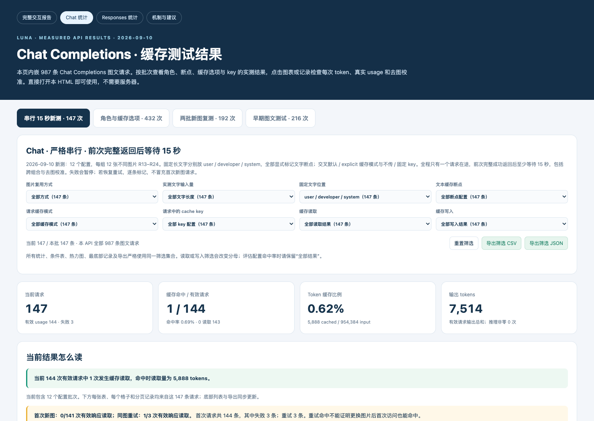
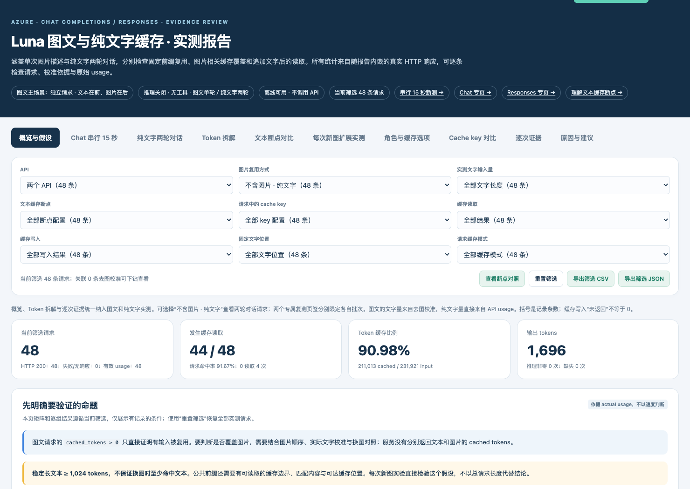

# Prompt Cache 系列 03：Luna 图文实测——1,899 次请求的 Benchmark 与 Chat API 零读取异常

> **系列导航**：[[Prompt Cache系列01：两代缓存框架——GPT-5.6前后的机制、计费与路由差异|01 两代框架]] → [[Prompt Cache系列02：GPT-5.6显式断点与Cache Write计费——从断点槽位到诊断工具|02 GPT-5.6 新机制详解]] → **03 Luna 图文实测与异常分析（本篇）**
>
> 实验发生于 2026-09-09～10，官方文档复查与诊断补测发生于 2026-09-13，对象为一个 Azure OpenAI 资源上的 gpt-5.6-luna 部署（Chat Completions 与 Responses 两个 API）。所有"命中"均指有效响应的 usage 返回 `cached_tokens > 0`——这是 API 报告的缓存读取，不是对物理执行路径的直接观测。

## 背景：一个客户投诉引出的完整测量

起因是一个真实的客户问题：怀疑 gpt-5.6-luna 在多模态（图片）场景下，用 Chat API 时 prompt cache 一直无法命中。客户的调用模式是**固定的长文字 prompt 在前＋每次一张不同的图片在后**，单次独立请求、无多轮历史。按[[Prompt Cache系列02：GPT-5.6显式断点与Cache Write计费——从断点槽位到诊断工具|系列02]]讲的机制，只要文字前缀超过 1,024 token 门槛且有合法断点可查，换图后文字部分应该可以复用。实测结果比预期复杂得多——最终演变成 2,000 多次调用的系统性 benchmark，和一个至今未定性的异常。

## 方法学：这些数字为什么可信

几条贯穿全部实验的纪律，也是读任何缓存 benchmark 时该检查的点：

- **只认 usage，不认延迟**。已命中的请求也可能耗时偏长，响应快慢不能作为命中依据；
- **失败不算 miss**。HTTP 超时/500/503 拿不到 usage 的请求单独分类，不进命中率分母；
- **图片 token 用"去图校准"测**。API 不单独返回 `image_tokens`，图片相关增量 Δ = 带图请求 input − 仅移除图片的校准请求 input（其余条件不变）。实测 Δ ≈ 922～923，**不是 128 的倍数**（Luna 按 32×32 像素 patch 计量图片）；
- **字段缺失记"未返回"，不补 0**；
- **不同配置用独立 namespace 前缀**，避免跨组污染；跨组差异不单独归因于某一个变量（部署/网络也可能变化）。

主报告总计 2,059 行 = **1,899 条实验请求（1,851 图文＋48 纯文字）＋160 条校准**。

## 结果分层：哪些场景能命中，哪个场景持续失败

### 总表

| 实验批次 | 请求尝试 | 有效响应 | 有缓存读取 | 解读 |
|---|---:|---:|---:|---|
| 历史固定长文＋**同图**，Chat 默认组 | 12 | 12 | 10 | 第 1、2 次无读取（写入/预热），正读取 5,888 |
| 历史固定长文＋**同图**，Responses 默认组 | 12 | 12 | 10 | 第 1、5 次无读取，正读取 6,604 |
| 9/9 v3 **每次新图**，Chat | 432 | 421 | **0** | 11 次无有效结果单列，不算 miss |
| 9/9 v3 **每次新图**，Responses | 432 | 420 | **276** | 按角色/断点/mode 继续拆分见下 |
| 9/10 Chat 串行 15 秒，首次新图 | 144 | 141 | **0** | 3 次 HTTP 500/503 单独保留 |
| 同批 Chat 失败后的**同图重试** | 3 | 3 | 1 | 读取 5,888；不归入"首次新图" |
| 9/10 Chat **纯文字两轮** | 48 | 48 | **44** | 第一轮 20/24；第二轮 24/24 |

模式已经很清晰：**同图重复、纯文字多轮，两个 API 都能命中；固定长文字＋每次新图，Responses 能命中而 Chat 在本资源上 0 命中**。

### 先分层：哪部分不命中是机制预期，哪部分才是异常

**第一层（机制预期，不是 bug）**：客户的朴素结构是一条 user 消息内「文字块＋图片块」。按 GPT-5.6+ 隐式规则，唯一的隐式断点在这条消息**末尾（图片之后）**，文字块与图片块的交界处没有任何 lookup 边界——请求 ① 写入的是「文字＋图片A」整体，请求 ② 在图片处分叉，而唯一可回退查找的位置在分叉点之后，查不到。**这个结构下零命中是官方 Gotcha #1 的多模态版本**，机制给出的修复是：在文字块上打显式断点，或把固定文字挪进 developer/初始消息（让其末尾成为天然边界）。

**第二层（真正的异常）**：实验对两个 API 施加了**同样的修复结构**，Responses 的行为与机制预测严丝合缝——没边界不命中（0/69），给了边界就命中（62/68、11/12）；而 **Chat 在全部修复配置下依然全零**。"异常"的准确定义不是"Chat 图文不命中"，而是"**按官方机制做了修复之后，Chat 仍然不命中**"。下面的矩阵就是这个分层的完整数据。

### v3 矩阵：72 组变量拆解（Responses 侧）

完整设计：API 2 × 文字位置 3（user/developer/system）× 断点 marker 2 × cache options 3（omitted/implicit/explicit）× key 2（不传/固定），共 72 组每组 12 次。explicit 模式不标 marker 的组合是刻意保留的**负对照**（按机制它就不该命中）。

| 结构/配置 | 命中/有效响应 | 说明 |
|---|---:|---|
| user 全部组合 | 62/137 | |
| user，**不标**文字断点 | **0/69** | 跨 key/mode 条件 |
| user，**标**文字断点 | **62/68** | 断点是 user 位置命中的分水岭 |
| developer 全部组合 | 109/142 | |
| system 全部组合 | 105/141 | |
| user＋marker＋explicit，无 key | 11/12 | 正读取 5,678 |
| user＋marker＋explicit，固定 key | 11/12 | key 不改变结果 |
| developer 默认（无 marker、无 key） | 11/12 | 正读取 5,678 |
| system 默认（无 marker、无 key） | 10/12 | 正读取 5,677 |

两个不能写成结论的表述要避免：不能说"只有 Responses＋显式断点才能命中"（developer/system 默认结构也观察到读取——对应官方 implicit 模式"初始连续 developer 块末尾是 lookup 边界"的规则）；也不能说"放到 developer/system 就保证命中"（10～11/12 不是 12/12，命中始终是概率事件，见[[Prompt Cache系列01：两代缓存框架——GPT-5.6前后的机制、计费与路由差异|系列01]]的路由一节）。

**对 user 位置的固定文字，显式断点把命中率从 0/69 拉到 62/68**——这是官方 Gotcha #1（"共享前缀 ≠ 缓存前缀"）在真实数据上的完美复刻。

### Chat 串行 15 秒复测：排除并发和节奏因素

为排除"请求太密/并发路由"的解释：12 组（user/developer/system × omitted/explicit-30m × key 有无），**全部标文字断点**，每组 12 张新图，并发 1，每次完整返回后等待 ≥15 秒（单调时钟核验 15.000～15.011 秒）。无推理、无工具、无多轮。

结果：147 次图文尝试中 144 次首次新图**读取全为 0**。更值得注意的是 explicit 子集的 72 次成功响应**读取 0、写入也是 0**，而同组的去图文字校准请求返回了正常的正写入（5,676～5,683）。这是一条重要线索——同样的文字前缀，纯文字请求能正常写入，带图请求连写入都没报告——但它只能作为排查方向，**不能仅凭它断言"断点被忽略"或"物理上完全没写"**。

### 纯文字两轮对照：证明 Chat 缓存本身没有坏

4 配置 × 6 组对话 × 2 轮 = 48 次调用全部成功。第二轮回放第一轮 user＋实际 assistant 输出，再追加新 user 文字：

| 配置 | 第一轮读取 | 第二轮读取 | 第二轮 cached | 第二轮写入 |
|---|---:|---:|---:|---:|
| 默认（无断点、无 key） | 5/6 | **6/6** | 4,797 | 63～71 |
| 只标文字断点 | 5/6 | **6/6** | 4,793 | 63～71 |
| 断点＋explicit | 5/6 | **6/6** | 4,798 | **0** |
| 断点＋explicit＋固定 key | 5/6 | **6/6** | 4,795 | **0** |

第一轮都是首组未命中（首次写入）、后续 5 组命中。三个机制级观察：**纯文字路径上 key 和断点都不是命中的必要条件**；默认配置第二轮的写入量 63～71 tokens 是**增量写入（delta）的直接证据**；explicit 模式第二轮写入 0 印证"最后一个显式断点之后的内容不产生写入"。但注意，该实验与图文实验的文本内容和消息结构不同，**不是只改"有无图片"的单变量对照**。

## 异常定性：措辞必须精确

推荐表述：**"在本次 Azure 资源/gpt-5.6-luna 部署中持续复现的 Chat 图文缓存异常；疑似实现或部署差异，尚未获得厂商根因确认。"** 如果写"已知问题"，必须限定为"本次实验已知"——目前没有 OpenAI/Azure 确认此缺陷的工单结论、issue 编号或修复公告。

**支持异常判断的事实**：长稳定文字＋新图＋合法文字断点的多组 Chat 请求报告零读取；降到并发 1、间隔 15 秒仍复现；同图和纯文字场景 Chat 能正常读取；Responses 在相同素材的部分新图配置下能读取。

**不能据此得出的结论**：Chat 一概不支持 marker/key/developer/system；所有 Chat 缓存不可用；所有 Azure 部署都有此问题。

**待查方向（不是已证实根因）**：具体部署/服务实现差异、图文请求的可查找边界处理、配置与计量路径、缓存可用性和路由。值得注意的是，官方 GPT-5.6+ 缓存文档（断点语法、`prompt_cache_options`、诊断工具）通篇围绕 Responses API 写；Chat Completions 对同一套断点语义——尤其是**含图片消息**的断点资格处理——是否完整实现，文档没有明说，能力差异是候选解释之一。

**一个 n=2 的旁证（纯推测，撑不起结论）**：Chat 图文场景观察到的命中值 5,888、6,144 恰好都是 128 的整数倍（46×128、48×128），而 Responses 的 6,604 和 Chat 纯文字的 4,793～4,798 都不是——方向上与"该部署上带图的 Chat 请求走了旧代际风格的缓存/计量路径"的猜想一致，仅记录待验证。

### 一个有趣的旁证：routing.serving_pipereplica

本次 Chat 响应 JSON 里额外返回了 `routing.serving_pipereplica` 字段（**110/110 返回**；Responses 为 **0/122 返回**——两个 API 的明确差异，但仅限本资源本批次，不是接口承诺）。同图组曾观察到：replica 标识从 r5 变为 r6 的首次请求 miss，随后同标识下恢复命中——与"新副本需要预热"的解释一致，与[[Prompt Cache系列01：两代缓存框架——GPT-5.6前后的机制、计费与路由差异|系列01]]"缓存在单台机器上"的模型吻合。但该字段属于未承诺的元数据：值变化不能直接确定物理拓扑，缺失也不能证明没有路由或没有缓存。排查时**命中判断永远用 usage 的 cached_tokens，replica 字段只作补充线索**，同时保留 `x-request-id`/`apim-request-id` 供服务方追踪。

## 2026-09-13 补测：诊断工具在本资源上字段缺失

按[[Prompt Cache系列02：GPT-5.6显式断点与Cache Write计费——从断点槽位到诊断工具|系列02]]的设想，`prompt_cache_diagnostics` 本该是给这个异常定性的官方工具。9/13 在同一 Azure 资源的 `/openai/v1/responses` 上实测（10 次成功调用，全部 HTTP 200、usage 正常，store=false、非流式、并发 1、间隔 ≥15 秒）：

| 配置/请求 | input | cached | write | 诊断字段 |
|---|---:|---:|---:|---|
| text_baseline | 4,813 | 0 | 4,795 | 未返回（基准未请求诊断） |
| text_identical_comparison | 4,813 | 4,795 | 0 | **未返回（携带比较 ID）** |
| text_prefix_changed_comparison | 4,815 | 0 | 4,797 | **未返回（携带比较 ID）** |
| image_A_baseline | 6,616 | 0 | 5,676 | 未返回（基准未请求诊断） |
| image_B_same_text_comparison | 6,616 | 5,676 | 0 | **未返回（携带比较 ID）** |
| image_C_same_text_comparison | 6,616 | 5,676 | 0 | **未返回（携带比较 ID）** |
| minimal_identical_comparison | 4,807 | 4,804 | 0 | **未返回（携带比较 ID）** |
| minimal_prefix_changed_comparison | 4,811 | 0 | 4,808 | **未返回（携带比较 ID）** |

6 次明确携带 `comparison_response_id`（均来自本批次真实完成的 baseline）的请求，**6/6 没有返回 `prompt_cache_diagnostics` 字段**——不是返回了 `unavailable`，是字段整体缺失。响应回显的 `prompt_cache_options` 保留了 mode/ttl 但不含 comparison_response_id。结论边界：该资源当前未验证诊断功能可用，无法定位是前端、网关、后端还是序列化层的问题，需服务方确认此资源/部署是否已开放该能力；未测 store=true、streaming、其他模型或资源。**这次尝试没有给原 Chat 图文异常提供根因，更没有证明异常已修复。**

顺带一提，这批测试的 usage 本身又一次干净地展示了写入→读取的因果链（image_A 写 5,676 → B/C 各读 5,676，命中的是文字前缀而非新图片）。

## 给同类场景客户的排查与改进清单

1. **确认共同前缀过门槛**：固定文字部分（不是总输入）≥1,024 可见 token。总输入超 1,024 不等于固定前缀超门槛；门槛以下的短文字＋图片组合（实测 985 total）两个 API 都不命中，属于预期行为；
2. **在固定前缀末尾放显式断点**：user 位置的固定文字尤其必要（0/69 → 62/68）；开 explicit-only 还能避免为每次都变的图片/问题付 1.25× 写入费；
3. **保持前缀结构逐字节稳定**：文字、图片顺序、模型、service tier、tools、text.format、reasoning.effort、verbosity 都别动（见系列02 的设置清单）；
4. **动态内容放在可复用前缀＋断点之后**；
5. **监控读、写、缺失三分**：分别统计 `cached_tokens`、`cache_write_tokens`、字段未返回；缺失不补 0，失败不算 miss；
6. **遇到疑似本文异常**：先验证 Responses 工作路径是否满足业务（本资源上可用；配 explicit-only 断点还能免掉每次新图的写入费，见系列02 的模式对照表），同时向服务方提交复现材料——最小复现脚本与参数、请求/响应 ID 和时间、完整 usage、内容/图片 hash、首次新图与重试的分类、串行间隔证据、成功对照组。**建议把诊断字段缺失的证据（下节 10 次调用记录）与图文零读取复现包放进同一张工单**——排查该异常最对口的官方工具在本资源上自身处于待确认状态，两件事很可能要一起答复。可以先用合成素材沟通，正式对外材料去除资源地址和服务标识。

## 未决问题清单

- Chat 图文新图零读取（且 explicit 组写入也为 0）的根因——待厂商确认；
- 本资源 `prompt_cache_diagnostics` 字段缺失是能力未开放还是链路问题——待厂商确认；
- Chat API 的 cache write 计费口径（字段缺失时费用如何计）——待账单核验与官方澄清（见系列02）；
- lookup 边界 latest 50 vs 80 的文档表述差异——待官方澄清；
- GPT-5.6+ key 语义（计量隔离、"usage 报 miss 而非物理 miss"）未做专门实验与账单验证。

> 原始素材（测试脚本、逐次请求/响应证据、静态 HTML 报告、官方文档快照及抓取凭据）存于本 vault 的 `inbox/codex/2026-09-13-luna-prompt-cache-materials/`（本地素材目录，不入 git）。主入口：`luna-cache-validation/index.html`（可离线交互筛选与下钻）、`report_data.json`（规范化全量数据）、`diagnostics-20260913/`（9/13 诊断补测）。

## 关联阅读

- [[Prompt Cache系列01：两代缓存框架——GPT-5.6前后的机制、计费与路由差异]] — 机制背景：缓存位置、路由与命中的概率本质
- [[Prompt Cache系列02：GPT-5.6显式断点与Cache Write计费——从断点槽位到诊断工具]] — 断点、计费与诊断工具的完整规则
- [[prefix-caching]] — 概念页
