# Voice Live 系列 03：数字人出场延迟优化——ICE 门控根因、实测分解与预热占位策略

> 本文源于 AI 面试项目 [AI-interview-vibe-coding](https://github.com/huqianghui/AI-interview-vibe-coding) 的一次真实性能排查。所有时间均为真实环境实测（本地前后端 + 真实 Azure Sweden Central Voice Live + 外部面试网关），非估算。
> 版本脉络：ICE 门控修复 v0.37.4.2（PR #95）、说明页预热 v0.37.4.0（PR #93）、人物形象秒出（截帧占位）v0.37.4.3。
> 系列前篇：[Voice Live系列01：Agent实现架构——从级联流水线到Azure Voice Live API](Voice%20Live系列01：Agent实现架构——从级联流水线到Azure%20Voice%20Live%20API.md) 讲了 WebSocket + WebRTC 双通道与 Avatar 连接时序；[Voice Live系列02：架构演进——与Agent Service解耦后的合作模式与组合选型](Voice%20Live系列02：架构演进——与Agent%20Service解耦后的合作模式与组合选型.md) 的开放问题里挂着"实测延迟数据"——本文用数字人出场链路补上了其中一块。

---

## 一、现象：数字人要十几秒才出现

进入面试页面后，数字人（人物形象）要十几秒才出现；在此之前页面只显示占位的音频光球。最坏情况（不停留、直接点过说明页）实测：**从点「开始面试」到数字人出画面共 ~16 秒**。

体验上还有一个连带缺陷：系统原本设计了「先见人再开口」的 6 秒等待门，但在延迟面前必然超时（日志：`avatar-ready gate elapsed; reading first question anyway`）——结果是**先闻其声、后见其人**，比单纯的慢更违和。

## 二、延迟测试：先分解，再定位

「数字人慢」的候选嫌疑有五六个：token 获取、后端处理、外部面试网关、Azure 会话建立、ICE 收集、数字人建流首帧。优化前**不猜**，先测。

测量方法：给页面 console 注入时间戳记录器，用最坏情况操作（页面加载后立即点「开始面试」，说明页出现后立即点「I'm ready」，不留任何阅读时间），把 16 秒切成可归因的段：

| 阶段 | 耗时（v0.37.4.1） | 归因 |
|---|---:|---|
| 点「开始面试」→ 面试创建完成、开始连语音 | 2.76s | 外部面试网关一次往返 |
| WS proxy → Azure Voice Live 会话建立（`proxy.connected`） | 2.52s | 后端 → Sweden Central 的网络往返 |
| `session.updated`（拿到数字人配置 + ICE server） | 0.30s | 协议交互 |
| **ICE 收集 → offer 发出** | **7.99s** | **卡满 8s 兜底超时——本文主角** |
| offer → SDP answer → ICE 连通 → 视频首帧 | 2.40s | Azure 侧建流 |
| **合计** | **15.98s** | |

一跑就清楚了：**一半时间（7.99s）花在 ICE candidate 收集上，而且精确等于代码里的 8 秒兜底值**——这不是「网络慢」，是某个等待信号从未到达，每次都硬等满超时。

> 判断自己是否命中同类问题：浏览器控制台里 `[avatar-stream] setLocalDescription done; gathering ICE for offer` 与 `offer ready` 两条日志之间相隔恰好 ≈8 秒（正好等于兜底值），即是。

## 三、根因：ICE gathering `complete` 在多网卡环境下永远不来

数字人的视频是一条独立的 WebRTC 连接（浏览器 ↔ Azure 数字人 TURN relay）。建立连接前，浏览器要做 **ICE candidate 收集**——枚举本机每个网络接口的候选地址，写进 SDP offer（双通道架构见[系列01](Voice%20Live系列01：Agent实现架构——从级联流水线到Azure%20Voice%20Live%20API.md)；WebSocket 与 WebRTC 的协议分工见 [WebSocket与WebRTC深度对比——从Azure Voice Live API看实时通信协议选型](../../Notes/AI/voice/WebSocket与WebRTC深度对比——从Azure%20Voice%20Live%20API看实时通信协议选型.md)）。

原实现发出 offer 前等待以下三个信号之一：

1. `onicecandidate` 收到 **null candidate**（收集结束的标准信号）；
2. `icegatheringstatechange` 变为 **`complete`**；
3. **8 秒兜底超时**。

问题在于：**多网络接口环境**下（VPN 虚拟网卡、mDNS 混淆地址、IPv6/公司代理等——开发者和企业办公电脑的常态），前两个信号经常**永远不触发**：某个接口的收集一直悬着，浏览器就一直不报 `complete`。于是**每一次**连接都硬等满 8 秒兜底才发 offer。

### 3.1 原实现为什么「需要」等收集完成？

这不是随手写的保守代码，而是本信令通道下的标准做法。WebRTC 传候选有两种模式：

- **Trickle ICE**（增量）：offer 先发出去，候选收集到一个就补发一个。要求信令通道支持双向、多次的候选交换。
- **Vanilla ICE**（一次性）：offer 作为**一个完整包**只发一次，里面必须已经带上所有要用的候选，之后没有补发机会。

Azure 数字人的信令就是一次性的：offer 以 base64 blob 的形式通过 `session.avatar.connect` 消息**只发送一次**，没有后续补发候选的通道。所以「发之前把候选收集齐」是必要的——如果 offer 里缺了最终连接要用的那个候选，连接就建不起来。在**不知道哪个候选会胜出**的通用场景下，「等全部收集完成」是唯一保证正确的等法。

### 3.2 为什么 VPN/企业网络环境必现？

`complete` 信号的语义是「**所有**网络接口的候选收集都结束了」——每个接口要么成功拿到候选、要么明确失败、要么走完浏览器内部的重试超时，一个都不能少。它被**最慢、最坏的那个接口**绑架：

- **VPN 虚拟网卡**（utun/tap 等）常常不路由发往 TURN/STUN 服务器的 UDP 包——请求发出去**石沉大海**：没有响应，也没有错误。浏览器无法区分「慢」和「死」，只能按内部重试节奏一遍遍等，直到自己的超时（往往比我们的 8 秒兜底还长）；
- **mDNS 候选**（Chrome 为隐私把局域网 IP 混淆成 `xxx.local`）增加一层解析等待；
- **IPv6 / 公司代理 / 防火墙**：路由黑洞或静默丢包，同样表现为「悬着不结束」。

普通家庭单网卡网络里，所有接口很快各自了结，`complete` 在几百毫秒内到达——这就是为什么这个 bug 在开发者/企业办公电脑上必现，而在「干净」网络里测不出来。

## 四、洞见：把等待目标从「全量集」改成「够用集」

修复的关键洞察是一个**场景特化知识**：**Azure 数字人只走它下发的 TURN relay**（`session.updated` 里 `ice_servers: 1`，一个带凭据的 relay，没有 STUN、没有 P2P 直连路径）。媒体流的最终路径一定是「浏览器 → 这个 relay → Azure」。

也就是说，SDP 里只要有**一个 relay 类型的 candidate**，最终会胜出的那一对候选就已经在包里了——后面再收集到的 host 候选（局域网地址）根本到不了 Azure 的 relay，**永远不会被选中**，等它们纯属浪费。

| | 修复前 | 修复后 |
|---|---|---|
| 等的目标 | **全量集**：所有接口的所有候选 | **够用集**：第一个 relay 候选（+300ms 同批） |
| 成立前提 | 通用场景——不知道哪个候选会胜出，只能全要 | 本场景特有——服务端 relay-only，胜出者已知 |
| 被谁拖慢 | 最慢/最坏的那个网络接口 | 只取决于到 relay 的一次 UDP 往返（快且必要） |
| 正确性 | 永远正确，但可能极慢 | 同样正确（胜出候选必在包内），且快 |

一句话：原来的等待在「不知道谁会赢」的通用假设下是必要的；一旦确认这条链路**只可能由 relay 候选获胜**（Azure 数字人服务的固定行为），「等全部」就退化成了「等无用的东西」——把等待目标从全量集改成够用集，正确性不损失，时间从 8 秒变 0.38 秒。

这个思路可以推广：**很多"标准做法"的等待，等的是通用假设下的最坏情况；当你对服务端行为有确定性知识时，等待条件就可以收窄**。前提是把兜底留住——本次修复中原有三个信号（null candidate / `complete` / 8s 兜底）全部保留，所以在 `complete` 来得快的正常网络上行为与之前完全一致。

## 五、优化：三层策略 + 部署位置

### 5.1 第一层：ICE 门控快路径（v0.37.4.2，消灭 7.6 秒）

修复位置 `frontend/src/hooks/useAvatarStream.ts`：

- 收到**第一个 relay（或 srflx）candidate** 后，开一个 **300ms 收敛窗**（让同批到达的候选一并写入 SDP），然后立即发 offer；
- `typ host` 候选**不**触发快路径（局域网地址到不了 Azure 的 relay，发了也没用）；
- 原有三个信号全部保留，作为不同网络环境下的兜底。

修复前后同环境实测对比：

| 阶段 | 修复前 v0.37.4.1 | 修复后 v0.37.4.2 |
|---|---:|---:|
| 面试创建（外部网关往返） | 2.76s | 4.00s（该次偏慢，波动区间 ~2.5-4s） |
| WS proxy → Azure 会话建立 | 2.52s | 2.67s |
| `session.updated` | 0.30s | 0.30s |
| **ICE 收集 → offer 发出** | **7.99s** | **0.38s（省 ~7.6s）** |
| offer → answer → ICE 连通 → 视频首帧 | 2.40s | 3.88s（含 1080p 首帧） |
| **合计：点「开始」→ 数字人出画面** | **15.98s** | **11.25s**（点「I'm ready」→ 出画面 7.2s） |

修复后日志出现 `avatar ready → releasing held first question read`——数字人**先出现、后开口**，「先见人再开口」的等待门恢复了设计意图。

**为什么总量只降了 4.73s，而不是 ICE 段省下的 7.6s？** 逐段相减即可对账：ICE 段 −7.61s，但面试创建 +1.24s、会话建立 +0.15s、首帧 +1.48s——三段增加合计 +2.87s，恰好补上缺口。这三段的变化与修复**无关**，因果上也不可能有关：链路严格串行，Azure 侧收到 offer 前不做任何工作，ICE 门控改的只是「何时发 offer」，不存在把成本挤到别段的通道。增加纯属单次采样的波动——面试创建的波动区间本就是 ~2.5-4s（修复前抓到快端、修复后抓到慢端）；首帧段的多轮实测分布为 2.1-3.9s（见 5.5 节），修复前后的 2.40s 与 3.88s 都落在正常区间内，单样本差异不构成趋势。方法论上：修复消灭的是一个**确定性常数**（8s 兜底每次必打满，方差为零），其余各段是**随机变量**，单次总量对比会把确定性收益和采样噪声混在一起——所以定位和验证都要看**分段数字**（ICE 段 7.99→0.38 两边都稳定，才是修复效果的干净证据）。按各段典型值折算，修复前后的期望总量约为 17s vs 10s，期望差正是 ~7.6s；若要发布统计口径的数字（P50/P95），需多次运行取分位数，见系列 02 开放问题。

### 5.2 第二层：说明页预热（v0.37.4.0，把等待藏进阅读时间）

上表是「秒点通过」的最坏情况。v0.37.4.0 起，语音 + 数字人连接在**说明页出现的瞬间**就开始预热（此时机 = 能拿到面试会话的最早时刻），候选人阅读说明的时间与连接过程重叠：

- 说明页阅读 **≥7 秒**（正常速度）：点「I'm ready」时数字人**已就绪，零等待**；
- 阅读 3-4 秒就点：还需等 ~3-4 秒（此时显示人物静态形象占位，见下）；
- 预热期间麦克风自动静音、不读题，进入答题阶段才解除并朗读第一题。

实现位置：`frontend/src/pages/InterviewPage.tsx`（说明页预热 + 读题阶段门 + 预热期静音）。

### 5.3 第三层：人物形象截帧占位（v0.37.4.3，体感归零）

上一次会话自动截取一帧人物画面缓存在浏览器（localStorage），下次进入时**人物形象立即显示**（略调暗 + 「连接中」提示），直播流一到无缝淡入替换。首次访问以外，「人物出现」的体感时间 ≈ 0。

实现位置：`frontend/src/components/AvatarView.tsx`。

### 5.4 部署位置：剩余 ~11 秒的三项构成逐一分析

剩余构成全部是**网络/服务往返**，但三项的可优化性各不相同。为验证部署位置的影响，用**部署在 Azure 上的生产环境**（后端 Container Apps 与 Voice Live 资源同在 `swedencentral`）跑了同一套计时脚本做对照（浏览器仍在同一台开发机上，公平对比）：

| 构成 | 本地开发环境 | Azure 生产环境（同区域） | 怎么优化 |
|---|---:|---:|---|
| 面试创建（含外部面试网关取第一题） | ~2.8-4.0s | ~4.4s | **客户自有环境部署可解**：这是到第三方面试服务的往返，客户把本系统部署进自己的网络（与面试服务同域/内网）后收敛到内网延迟。且此成本已被说明页预热完全重叠 |
| 后端 → Azure Voice Live 会话建立 | ~2.5-2.7s | **0.95s** | **同区域部署可解（已实测验证）**：生产 bicep 默认 `location=swedencentral`，后端↔Voice Live 变成区域内往返，实测省 ~1.6-1.7s。本地开发的 2.5s+ 是开发机跨洲连 Sweden 的放大值 |
| Azure 数字人建流到首帧（1080p） | ~3.9s | ~3.5s | **无法消除，可部分缓解**（见下） |
| **点「开始」→ 数字人出帧（合计）** | **11.25s** | **9.99s** | |

**关于首帧的 ~3.5s，为什么说「固有」但仍可部分缓解**——它由两部分组成：

1. **传输握手**（SDP answer、TURN 分配、ICE 连通性检查、DTLS）：与**浏览器↔Azure 区域**的 RTT 成正比。注意数字人媒体流是浏览器直连 Azure TURN relay，**不经过后端**——所以这部分取决于最终用户离区域多近，选一个离用户近且支持 Voice Live 数字人的区域是唯一手段；
2. **Azure 侧渲染管线冷启动**（数字人合成器启动 + H.264 编码器出第一个关键帧）：纯服务端成本，客户端与部署拓扑都无法改变。

不过它的实际影响比数字看起来小：**每场面试只付一次**（会话全程保持，换题不重连），且已被预热 + 截帧占位两层体验优化覆盖。

### 5.5 生产环境多轮实测（n=11，Playwright 自动化）

以上生产数字来自单次运行。为把"典型值"从单样本猜测变成统计事实，用 Playwright 无头浏览器对生产环境（同一 URL）自动化跑了 11 轮最坏情况流程：fake 麦克风授权 → 点「Start interview」→「I'm ready」出现的瞬间点掉（零阅读时间）→ 等待应用自身的首帧日志。阶段边界全部取自应用 console 日志（`opening WS proxy` / `proxy.connected` / `session.updated received` / `gathering ICE for offer` / `offer ready` / `video HAS frames: 1920x1080`），浏览器仍在开发机（跨洲连 Sweden）。9 轮完整成功，统计如下：

| 阶段 | min | 中位数 | max（除异常轮） |
|---|---:|---:|---:|
| 面试创建（外部网关） | 4.01s | 4.70s | 5.63s |
| WS proxy → Azure 会话建立 | 0.85s | 0.89s | 1.20s |
| `session.updated` | 0.04s | 0.06s | 0.22s（1 轮异常 17.25s，见下） |
| **ICE 收集 → offer** | **0.37s** | **0.54s** | **0.62s** |
| offer → 视频首帧（1080p） | 2.10s | 2.36s | 2.43s |
| **合计：点「开始」→ 出画面** | **7.93s** | **8.61s** | **9.78s**（异常轮 25.52s） |
| 点「I'm ready」→ 出画面 | 3.72s | 3.75s | 4.14s |

四个结论：

1. **ICE 修复在生产稳定成立**：9/9 轮全部走快路径（0.37~0.62s，中位 0.54s），无一轮打满 8s 兜底——修复效果不是单次运气。
2. **首帧段比单次样本显示的更快且极稳**（2.33~2.43s，中位 2.36s）。原因：该段中经过后端的只有 offer/answer 信令（媒体流直连，但 `session.avatar.connect` 信令走 WS proxy），生产后端与 Voice Live 同区域把信令腿压短了。此前 5.4 节单次测到的 ~3.5s 是偏慢样本——**生产首帧典型值应修正为 ≈2.4s**，"固有成本"的构成分析（握手 RTT + 渲染冷启动）不变。
3. **面试创建段是当前最大头且波动最大**（4.0~5.6s，占总时长一半以上）——印证 5.4 节的判断：客户自有环境部署（与面试服务同域）是剩余延迟的第一杠杆。
4. **长尾异常真实存在**：11 次尝试中，1 次 `session.updated` 等了 17.25s（该轮总时长 25.5s）、1 次页面加载直接 `ERR_CONNECTION_ABORTED`、1 次流程未走到建流。均为偶发不可复现。生产监控值得对「`proxy.connected` 后 N 秒未收到 `session.updated`」这类主信号缺席加超时重试与告警——与第六节经验 5（兜底打满即报警）同源。

**部署给客户时的检查项**（本次生产对照测试顺带发现并修复的坑）：`VOICE_LIVE_DEFAULT_MODEL`（bicep 参数 `voiceLiveDefaultModel`）必须是**语音专用**的原生模型（gpt-4o 系列 / realtime），**不要**跟着聊天模型一起改成 gpt-5.4-mini 之类——配错的症状是「永远停在 text、控制台报 Model X is not supported in this region」。原生 Realtime 与级联两类模型组合的选型逻辑见[系列02](Voice%20Live系列02：架构演进——与Agent%20Service解耦后的合作模式与组合选型.md)。

## 六、总结：五条可迁移的延迟工程经验

1. **不要死等 WebRTC gathering `complete`。** 多网卡/VPN 环境下它可能永远不来。正确姿势是「够用即走」：目标是 relay-only 服务时，等到第一个 relay candidate（+ 短收敛窗）即可，`complete` 与超时只做兜底。这是 WebRTC 集成的通用经验，不限于本项目。
2. **给每一段等待打上时间戳日志。** 本次能 10 分钟定位，靠的是握手代码原本就逐步打日志（`gathering ICE for offer` → `offer ready`），两条日志一减就看到 8 秒。新增等待逻辑时，入口/出口各打一条。
3. **优化前先实测分解，不要猜。** 「数字人慢」的候选嫌疑有五六个；console 注入计时器一跑，8/16 秒落在谁身上一目了然。修完再跑同一脚本对比，数字就是证据。
4. **固有 RTT 消不掉，就用「重叠」和「占位」。** 连接成本挪到用户阅读说明的时间里（预热）、人物形象用上一次的截帧秒出（占位）——用户感知的等待可以远小于技术上的等待。
5. **凡是「兜底超时」被打满的路径都值得报警。** 兜底是给罕见情况的；如果它每次都被打满，说明主信号失效了——本例即是。日志里给兜底触发加显式标记（`gate elapsed` 这类字样），巡检时 grep 即可发现。

## 七、相关代码位置

- ICE 门控（本次修复）：`frontend/src/hooks/useAvatarStream.ts`（`runHandshake` 内 `offerReadyPromise`；常量 `ICE_SETTLE_AFTER_CANDIDATE_MS = 300`）
- 说明页预热 + 读题阶段门 + 预热期静音：`frontend/src/pages/InterviewPage.tsx`（v0.37.4.0）
- 人物形象截帧占位：`frontend/src/components/AvatarView.tsx`（v0.37.4.3）
- 后端凭据预热（启动即预取 Entra token，首个连接不付 3-5s 凭据链成本）：`backend/app/main.py` `_prewarm_azure_credential`
- 生产静态资源缓存（immutable 哈希资源 + no-cache 入口页）：`frontend/nginx.conf`（v0.37.4.2）

## 参考

- 项目仓库：[AI-interview-vibe-coding](https://github.com/huqianghui/AI-interview-vibe-coding)（ICE 门控修复 PR #95、说明页预热 PR #93）
- 系列前篇：[Voice Live系列01：Agent实现架构——从级联流水线到Azure Voice Live API](Voice%20Live系列01：Agent实现架构——从级联流水线到Azure%20Voice%20Live%20API.md)、[Voice Live系列02：架构演进——与Agent Service解耦后的合作模式与组合选型](Voice%20Live系列02：架构演进——与Agent%20Service解耦后的合作模式与组合选型.md)
- 协议背景：[WebSocket与WebRTC深度对比——从Azure Voice Live API看实时通信协议选型](../../Notes/AI/voice/WebSocket与WebRTC深度对比——从Azure%20Voice%20Live%20API看实时通信协议选型.md)
- [Trickle ICE: Incremental Provisioning of Candidates for the Interactive Connectivity Establishment (ICE) Protocol — RFC 8838](https://datatracker.ietf.org/doc/html/rfc8838)
- [How to use the Voice Live API — Microsoft Learn](https://learn.microsoft.com/en-us/azure/ai-services/speech-service/voice-live-how-to)
