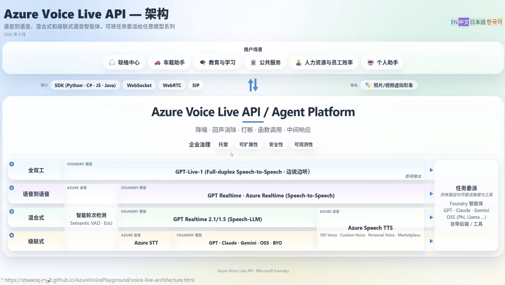
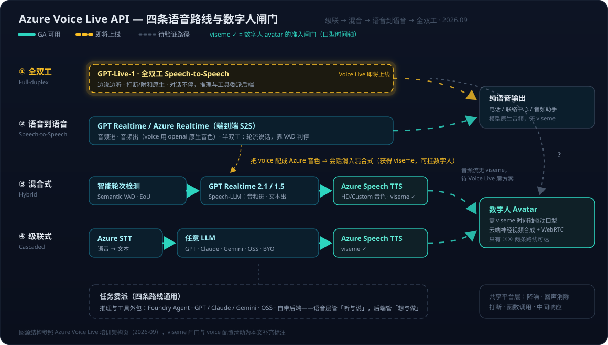

# Voice Live 系列 04：四条路线与全双工——GPT-Live-1 对数字人方案的影响评估

> 本文源于三件事的叠加：2026-09 一场 Azure Voice Live 产品培训（[Voice Live 架构总览页](https://shawnq-msft.github.io/AzureVoicePlayground/voice-live-architecture.html)给出的四路线架构图）、OpenAI 于 2026-09-10 发布全双工模型 [GPT-Live-1](https://openai.com/index/introducing-gpt-live-1-in-the-api)，以及培训后与 Speech 产品组的直接答疑（2026-09-18）。
> 系列前篇：[系列01](Voice%20Live系列01：Agent实现架构——从级联流水线到Azure%20Voice%20Live%20API.md) 讲两种架构路线与双通道实现；[系列02](Voice%20Live系列02：架构演进——与Agent%20Service解耦后的合作模式与组合选型.md) 讲与 Agent Service 解耦后的合作模式与选型光谱；[系列03](Voice%20Live系列03：数字人出场延迟优化——ICE门控根因、实测分解与预热占位策略.md) 讲数字人延迟工程的生产实测。本文把选型光谱扩展到**输出端**（谁来出声、谁能驱动数字人），并评估全双工带来的范式变化。

---

## 一、一张图四条路线：合并的组件越来越多

培训给出的架构总览把 Voice Live API 之下的语音智能体实现收敛为四条路线，上方是公共平台能力（降噪、回声消除、打断、函数调用、中间响应），右侧是"任务委派"——**四条路线都可以把推理与工具外包给后端**（Foundry 智能体、GPT/Claude/Gemini、OSS、自带后端）。这正是系列02 里"语音层与推理层分工"（模式三）结论的平台化呈现。

四条路线从下往上看，本质是一条"组件合并程度递增"的光谱：

| 路线 | 组成 | 本质 |
|------|------|------|
| ④ 级联式 | Azure STT → 任意 LLM（GPT/Claude/Gemini/OSS/BYO）→ Azure Speech TTS | 三段全拆开，每段可独立选型替换 |
| ③ 混合式 | 智能轮次检测（Semantic VAD · EoU）+ GPT Realtime 2.1/1.5（Speech-LLM）→ Azure Speech TTS | **听和想合并，说保持独立** |
| ② 语音到语音 | GPT Realtime / Azure Realtime（端到端 S2S） | 听想说合并成一个模型，但仍是**半双工**（轮流说话，靠 VAD 判停） |
| ① 全双工 | GPT-Live-1（Voice Live 即将上线） | 单模型且**边说边听**，"轮次"概念本身消失 |

从④到①，被合并进模型的东西依次是：转写（STT）、判停（VAD/EoU）、合成（TTS）、最后连"轮流说话"这个交互结构本身也被吃掉。合并越多，对话越自然；拆得越开，控制点越多——这条 trade-off 主线贯穿全文。

## 二、混合式：端到端的耳朵，级联式的嘴

四条路线里"混合式"最值得展开——它是级联与端到端之间的精确折中：**拿 Realtime 模型当 Speech-LLM 用（音频进、文本出），最后一段交给 Azure Speech TTS 合成**。

**相对级联式，它去掉了 STT 这一段**，好处有三：

- **没有转写错误级联**——级联式里 STT 转错一个词，后面 LLM 就在错误文本上推理；
- **保留副语言信息**——语气、犹豫、情绪这些转成文本就丢失的信号，Speech-LLM 直接从音频感知；
- **少一段串行延迟**。

**相对纯语音到语音，它保住了输出端的控制权**。声音由 Azure Speech TTS 出，意味着：

- 可用 HD Voice / Custom Voice / Personal Voice / Marketplace 音色（品牌音、定制音）；
- **有 viseme 时间轴输出**——数字人场景的决定性能力（下一节展开）；
- 中间有文本产物，可审计、可过滤、可落日志。

输入侧的"智能轮次检测（Semantic VAD · EoU，End-of-Utterance）"把判停从"声学静音够久"升级为"语义上话说完了没"——这是半双工路线下压掉判停等待的手段（[系列03](Voice%20Live系列03：数字人出场延迟优化——ICE门控根因、实测分解与预热占位策略.md) 实测里那 0.86s 的 VAD 判停就落在这一环）。

一句话：**混合式是"用端到端的耳朵和脑子，配级联式的嘴"**。

## 三、真开关是 voice 配置，不是模型选择——数字人的 viseme 闸门

一个自然的追问：在"语音到语音"路线里选了 gpt-realtime，是不是就接不了数字人、只能做纯语音？

**答案是否定的——决定能否驱动数字人的不是选哪个模型，而是会话的 `voice` 配置。**

### 先补一个概念：viseme 是什么

Viseme（视位素，visual + phoneme 的合成词）是 phoneme（音位素）的视觉对应物——发某个音时嘴部呈现的口型。很多听起来不同的音口型相同（/b/、/p/、/m/ 都是双唇闭合），所以几十个 phoneme 归并为约 22 个 viseme ID。TTS 合成音频时可以顺带输出一条 **viseme 时间轴**（一串"时间戳 + viseme ID"对），数字人的云端视频合成拿这条时间轴驱动口型，声音和嘴型才能对上。关键点：**只有"把文本念出来"的合成环节才知道每个音落在哪个毫秒上**——所以口型同步的控制面天然在 TTS（更精细的形态是 55 项 blendshape 面部系数按 60 FPS 输出，工程细节见 [Blender系列04](../../Notes/tool/3D-blender/Blender系列04：人物面试动画实战——47骨骼程序化表演、TTS配音与音量包络口型同步.md)）。

### 文档证据：gpt-realtime + Azure 音色 + avatar 三者共存

[Voice Live API reference](https://learn.microsoft.com/en-us/azure/ai-services/speech-service/voice-live-api-reference-2026-04-10) 里就有这样的 session 示例：`model: "gpt-realtime"` + `voice: { type: "azure-custom" }` + `avatar: { character: "lisa" }` 同时生效。而 [how-to 文档](https://learn.microsoft.com/en-us/azure/ai-services/speech-service/voice-live-how-to)写明：viseme 输出（`animation.outputs: ["viseme_id"]`）的前提是 **Azure standard voice 或 Azure custom voice**。

### 机制：voice 字段决定"嘴"是谁的

用 gpt-realtime 时，输出端有两种接线：

- **`voice.type: "openai"`**（alloy 等模型原生音色）→ 模型自己吐音频。这才是纯粹的"语音到语音"行：没有 viseme、没有 avatar，只能纯语音。
- **`voice.type: "azure-standard" / "azure-custom" / "azure-personal"`** → 服务端拿模型的**文本输出**交给 Azure TTS 合成。这一刻，会话实际上从"语音到语音"行**滑进了"混合式"行**——gpt-realtime 退化为 Speech-LLM（耳朵 + 脑子），嘴换成 Azure TTS，viseme 随之可用，avatar 就能驱动。

所以架构图里"混合式"行的 GPT Realtime 2.1/1.5 和"语音到语音"行的 GPT Realtime **是同一个模型的两种输出接线方式**。S2S 还是混合式不是选模型时定死的，而是逐会话的 `voice` 配置项——继系列02"级联 vs 端到端降级为配置项"（模型侧）、系列03"region 可用性才是真分水岭"（部署侧）之后，这是"架构决策降级为配置项"在**输出侧**的第三次上演。

代价也要说清：**挂 avatar 就必然落在混合式接线上**，放弃的是模型原生音频的副语言表现力（它自己的笑声、语气起伏、audio token 直出的韵律），输出表现力上限变成 Azure TTS 的能力（HD Voice / Custom Voice + SSML）。数字人场景下，gpt-realtime 的端到端优势只保留在**输入侧**（直接理解音频、无转写级联），输出侧被 TTS 接管。

## 四、全双工 GPT-Live-1：发布事实与它吃掉的"轮次机器"

### 发布事实（2026-09-10，OpenAI API）

- **边说边听**：说话的同时持续听，用户可随时插话、附和（"嗯"、"对"），模型自己决定何时开口、何时让步。官方口径：Full Duplex Bench 比 GPT-Realtime-2.1 **高 30 个百分点**，主要赢在 turn-taking 延迟与交互行为；
- **原生委派架构**：它只管对话，深度推理与工具调用委派给可配置的后端模型（官方演示搭配 GPT-6 Astra，medium reasoning 组合在 Tau3 语音智能体基准排第一）——**后端干活时对话不中断**；
- **计费**：语音会话 $0.05/分钟、按秒计，后端模型 token 另算；
- **边界**：只支持音频 + 文本（无图像/视频），只跑在专门的 Live sessions endpoint（不在 Chat Completions / Responses / Realtime 上），按**并发会话数**限流。

### 半双工 vs 全双工：同一个词，两层各判一次

一个容易混淆的点：底层传输（WebSocket、WebRTC，以及 SIP 呼叫协商出的 RTP 媒体流）**本来就是全双工的**——两个方向可以同时传字节。现在的 Voice Live 也确实在 TTS 播放的同时持续上行麦克风音频，否则 barge-in 打断根本无法检测。那"半双工模型"到底卡在哪？

先摆正术语（通信三档）：**单工**（只有一个方向，广播）、**半双工**（双向但不同时，对讲机）、**全双工**（双向同时，电话）。半双工也是"双工"——有意义的区分是"半"还是"全"，而且要**在两层各判一次**：

| 层 | gpt-realtime（半双工模型） | GPT-Live-1（全双工模型） |
|----|--------------------------|------------------------|
| 传输层（WebSocket / WebRTC / RTP） | 全双工——音频上行与 TTS 下行同时流动 | 全双工（不变） |
| 模型/对话层 | **半双工**——听/说两态轮替的轮次状态机 | **全双工**——两条音频流同时活着，连续决策 |

gpt-realtime 的处理循环是离散轮次：听（积累 `input_audio_buffer`）→ VAD 判定"说完了" → commit → 生成一段完整回复 → 播放 → 回到听。这台状态机直接暴露在 API 事件里（`input_audio_buffer.speech_started/stopped`、`response.create/cancel`）。所谓"打断"其实是**平台机制而非模型能力**——VAD 检测到用户开口就取消 response、截断播放，是"掐掉喇叭"，不是"模型边说边理解了你的话"。对讲机的类比在此很精确：**给对讲机换一根全双工电缆，"按下说话、松开收听"的使用协议不变，对话依然是半双工**——WebSocket 是那根电缆，对话的双工性由模型的处理循环决定。

全双工模型没有听/说两态：输入流持续进、输出流持续出，模型每个时刻都在连续决策"此刻我该不该出声、出什么声"。由此产生半双工结构上做不到的行为：

| 行为 | 半双工（gpt-realtime） | 全双工（GPT-Live-1） |
|------|----------------------|---------------------|
| 判停 | 必须 VAD/EoU 显式判定 + 静音等待（`silence_duration_ms` ~500ms 是结构性成本） | 不存在"判停"环节，感知语义收尾即可接话 |
| 打断 | 平台掐断播放，模型对被打断"无感" | 模型自己让步、收住半句话，知道说到哪被打断 |
| 附和 | "听"态不产生输出，无法"嗯嗯" | 边听边给 backchannel |
| 重叠说话 | 无法处理 | 原生场景 |
| 后端干活时 | 靠平台注入 `interim_response` 过渡语 | 自己继续闲聊，委派完成后接回 |

一句话：**传输层保证的是"字节能同时双向流"，全双工模型解决的是"智能能同时双向流"——前者一直有，后者才是 GPT-Live-1 的新东西**。整条链路的双工性由最窄的一层决定，而瓶颈从来不在协议，在模型层的轮次状态机。一个工程注脚：全双工下模型不能把自己的声音当成用户输入，回声消除（AEC）从"免提场景可选项"变成"必选项"——这也是平台层降噪/回声消除在全双工时代依然保值的原因之一。

### 对 Voice Live 平台意味着什么：一整层"轮次机器"被模型吃掉

Voice Live 现有的很多平台能力——semantic VAD / EoU 判停、打断处理、`interim_response`（TOOL/LATENCY 过渡语填补 Agent 推理延迟）——本质都是在**半双工模型之上模拟自然对话**。全双工模型把这些原生化了：

- 判停不需要了——没有"轮"了；
- 打断是模型固有行为，不再是平台特性；
- "后端干活时继续聊"就是它的设计——系列02 里服务端编排器推 `interim_response` 那套机制，变成模型自己会说"我看一下哈……"。

平台的价值相应**退守到模型做不了的层**：企业治理、安全、可观测性、SIP/电话接入、WebRTC 通道、数字人 avatar，以及把委派后端统一进 Foundry 生态。值得注意的是，GPT-Live-1 **不是**"一个大模型全包"的端到端胜利——它自己就是分层的（对话层 + 委派推理层），这恰好验证了系列02"分层用模型"的结论，只是分界线从"简单问答 vs 复杂推理"移到了"对话本身 vs 一切推理"。

## 五、数字人方案影响评估：与产品组答疑的五个落点

培训后与 Speech 产品组的直接交流（2026-09-18）给了几条一手信息，逐条对应到数字人方案：

**1. GPT-Live-1 × 数字人：OpenAI 侧没有视觉生成产品，整合要看 Voice Live/Speech 层。** 这印证了第三节的结构性难点：avatar 靠 TTS viseme 时间轴驱动，而 GPT-Live-1 输出自己的音频流、没有 viseme 控制面。更麻烦的是，**混合式那条退路对全双工不成立**——半双工模型"换嘴"无损（每轮先有文本，TTS 照念，时序不受影响），但全双工模型**说话的时机本身就是输出的一部分**（何时插话、何时附和、与用户重叠的那半秒都编码在音频流时序里），走"文本 → TTS 重合成"恰好毁掉全双工最值钱的东西。只能等平台层做音频流 → 面部系数的直接对齐——这是"即将上线"落地时第一个要查的点。

**2. gpt-live-1 尚未在 Voice Live 上线；数字人方案当前用 gpt-realtime 2.1/1.5 即可。** 即"混合式"行就是数字人场景当下的推荐位——与第三节的推导一致。

**3. "prompt agent + gpt-live-1"走 Voice Live 是可行方向。** 委派架构与 Voice Live 挂 Agent（系列02 模式三）同构，全双工上线后语音层换模型、推理层不动。

**4. 中文场景警示：gpt-live-1 的中文能力（含轮次判断）不见得强于 Voice Live 的 smart turn detection。** 全双工的 turn-taking 优势是英文基准上测出来的；中文的判停/打断表现，产品组自己都提示要打问号。**中文场景选型前必须实测对比**——这是行动清单里唯一的"测了才知道"项。

**5. 一个历史修正：此前"Agent 选不到 gpt-realtime"是 bug 且已修复**，并非解耦设计（详见系列02 的更新框）。对方案的含义：Agent 直接搭配 gpt-realtime 这条路没有被关闭，选型光谱左端多一个可用组合。

## 六、对现有方案的落地清单

结合 [AI 面试项目的生产实测](Voice%20Live系列03：数字人出场延迟优化——ICE门控根因、实测分解与预热占位策略.md)与 [级联 vs 端到端决策页](../../wiki/decisions/cascaded-vs-e2e-voice.md)，逐项落地：

1. **决策页的重评估条件已触发**。决策页前提假设写着"E2E 模型未来 1–2 年内无法达到企业级质量——出现突破性进展需重新评估"。GPT-Live-1 就是触发器，但重评估的方向不是"改选 E2E"，而是**坐标系更换**：对话层选半双工还是全双工、推理层委派给谁，成为两个独立配置维度。
2. **治体感升级，治本瓶颈不变**。系列03 实测：对话面每轮 ≈5.6s，外部面试网关 RTT 3.9s 占 70%。全双工不会缩短网关那 3.9s，但把"思考过渡语遮蔽"从自己搭的工程手段变成模型原生行为；每轮里 0.86s VAD 判停 + 0.19s 转写尾在全双工下结构性消失。
3. **新的成本与容量账**。对话层从 token 计费变成 $0.05/分钟按秒计（30 分钟面试对话层约 $1.5 固定成本），推理层按后端 token 另算；且按并发会话数限流——面试高峰期并发容量要提前核。
4. **region 老坑前置**：系列03 的教训是"同一模型在该 region 对 Voice Live 可不可用"才是真分水岭。gpt-live-1 上线 Voice Live 后，第一件事是确认目标 region（当前 Sweden Central）可用，再动 `VOICE_LIVE_DEFAULT_MODEL`。
5. **模态边界**：GPT-Live-1 只收发音频 + 文本——若面试/数字人场景后续要"看"（共享屏幕、表情），这条路线目前给不了。
6. **中文轮次检测对比实测**（承第五节第 4 条）：设计同一批中文对话样本，在 semantic VAD（混合式）与 gpt-live-1（上线后）两条路线上对比判停准确率、误打断率、抢话率。

## 七、小结

1. 四条路线是一条**组件合并程度递增**的光谱：级联式全拆开 → 混合式合并听与想 → 语音到语音合并听想说 → 全双工连"轮流说话"都合并掉。
2. **混合式 = Speech-LLM + Azure TTS**：端到端的耳朵（无转写级联、保留副语言信息）配级联式的嘴（custom voice、可审计、viseme）。
3. **S2S 与混合式的真开关是 `voice` 配置而非模型**：gpt-realtime 配 Azure 音色即滑入混合式、可挂数字人；配 openai 原生音色才是纯 S2S、只能纯语音。这是"架构决策降级为配置项"在输出侧的第三次上演。
4. **viseme 是数字人的准入闸门**：口型时间轴只能来自 TTS 合成环节，所以数字人场景必然落在混合式/级联式；全双工模型的时序编码在音频流里，"换嘴"退路不成立，avatar 整合只能等平台层方案。
5. **GPT-Live-1 吃掉了平台的"轮次机器"**（判停/打断/过渡语原生化），Voice Live 价值退守治理、接入、avatar 与委派编排；它的委派架构验证了"分层用模型"，分界线移到"对话 vs 推理"。
6. **"双工"要两层各判一次**：传输层（WebSocket/WebRTC/RTP）一直是全双工，半双工卡在模型层的轮次状态机——链路双工性由最窄一层决定，所以换协议不解决自然对话，换模型才解决。
7. 落地节奏：**当下数字人方案留在混合式（gpt-realtime 2.1/1.5 + Azure TTS）**；gpt-live-1 上线 Voice Live 后按清单逐项核（avatar 支持、region、并发、成本、中文轮次实测）。

## 八、开放问题

1. **全双工 × avatar 的平台方案**：Voice Live 层会不会做 GPT-Live-1 音频流 → viseme/面部系数的实时对齐？形态是什么（服务端强制对齐？专用 avatar 模型？）——决定数字人方案是大升级还是暂时无关。
2. **中文全双工实测**：判停准确率、误打断率、与 semantic VAD 的对照数据（第六节第 6 条的执行）。
3. **全双工的可观测性**：没有"轮"之后，对话日志、延迟指标、内容安全的计量单位怎么定义？
4. **成本精算**：$0.05/分钟 + 后端 token vs 混合式 audio-in token + TTS 字符计费，按"分钟通话成本"折算的真实差距。

## 参考

- [Build more natural voice experiences with GPT-Live-1 in the API — OpenAI](https://openai.com/index/introducing-gpt-live-1-in-the-api)（2026-09-10）
- [Azure Voice Live API 架构总览（培训页）](https://shawnq-msft.github.io/AzureVoicePlayground/voice-live-architecture.html)（2026-09）
- [How to use the Voice Live API — Microsoft Learn](https://learn.microsoft.com/en-us/azure/ai-services/speech-service/voice-live-how-to)（viseme 前提：Azure standard/custom voice）
- [Voice Live API Reference 2026-04-10 — Microsoft Learn](https://learn.microsoft.com/en-us/azure/ai-services/speech-service/voice-live-api-reference-2026-04-10)（gpt-realtime + azure-custom voice + avatar 共存示例）
- [GPT-Live-1 debuts at #1 on the Artificial Analysis Speech to Speech Index — Artificial Analysis](https://x.com/ArtificialAnlys/status/2099698254414029207)
- 与 Speech 产品组的培训答疑（2026-09-18，内部交流）
- 系列前篇：[Voice Live系列01：Agent实现架构——从级联流水线到Azure Voice Live API](Voice%20Live系列01：Agent实现架构——从级联流水线到Azure%20Voice%20Live%20API.md)、[Voice Live系列02：架构演进——与Agent Service解耦后的合作模式与组合选型](Voice%20Live系列02：架构演进——与Agent%20Service解耦后的合作模式与组合选型.md)、[Voice Live系列03：数字人出场延迟优化——ICE门控根因、实测分解与预热占位策略](Voice%20Live系列03：数字人出场延迟优化——ICE门控根因、实测分解与预热占位策略.md)
- 相关笔记：[Blender系列04：人物面试动画实战——47骨骼程序化表演、TTS配音与音量包络口型同步](../../Notes/tool/3D-blender/Blender系列04：人物面试动画实战——47骨骼程序化表演、TTS配音与音量包络口型同步.md)（viseme/面部系数工程细节）、[WebSocket与WebRTC深度对比——从Azure Voice Live API看实时通信协议选型](../../Notes/AI/voice/WebSocket与WebRTC深度对比——从Azure%20Voice%20Live%20API看实时通信协议选型.md)
