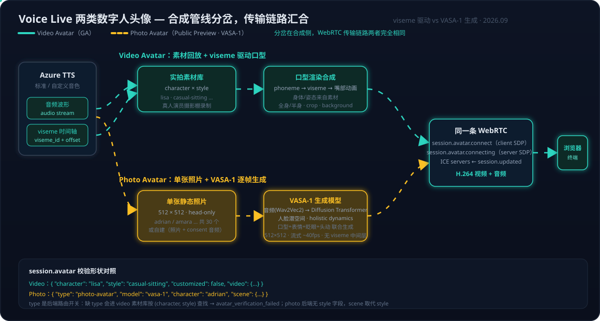

# Voice Live 系列 05：两类数字人头像——viseme 驱动的 Video Avatar 与 VASA-1 生成的 Photo Avatar

>数字人选 Adrian 时会话直接被 Azure 拒绝（`avatar_verification_failed`），排查后发现根因是**把 photo 头像按 video 头像的 schema 发送**。顺着这个错误往下挖，牵出两类头像在合成技术路线上的根本分岔——而分岔点恰好是之前讨论过的 viseme（[phoneme/viseme/grapheme/morpheme 词族讨论](https://chatgpt.com/share/6ab3379b-7020-83ec-bd26-9673b14441d9)）。
> 系列前篇：[系列01](Voice%20Live系列01：Agent实现架构——从级联流水线到Azure%20Voice%20Live%20API.md) 讲 WebSocket + WebRTC 双通道与 Avatar 连接时序；[系列03](Voice%20Live系列03：数字人出场延迟优化——ICE门控根因、实测分解与预热占位策略.md) 讲数字人出场延迟的生产实测；[系列04](Voice%20Live系列04：四条路线与全双工——GPT-Live-1对数字人方案的影响评估.md) 提出"viseme 是数字人的准入闸门"。本文把镜头从"谁能驱动数字人"转向**数字人本身**：两类头像各是怎么被合成出来的。

---

## 一、一次校验失败引出的分界线

现象：三处 session 构造器统一按 video 头像的形状发送 `session.avatar`（只有 `character` / `customized` / `video`），选 Adrian 时 Azure 把它当成叫 "adrian" 的 video 头像去素材库里找，找不到就拒绝会话；另外 agent metadata 还给 photo 头像默认塞了 video 的 style `casual-sitting`，Azure 同样拒绝。

真实 Azure 复现（agent 模式和 model 模式都测过）：

- 旧形状 → `avatar_verification_failed: Avatar with character [adrian] and style [None] not found`
- 新形状（带 `"type": "photo-avatar"` + `"model": "vasa-1"`）→ `session.updated`，返回 `type: photo-avatar` + ICE servers，数字人正常出场

这个诊断与官方文档完全吻合。Voice Live 的 `session.avatar` 实际上有两套校验规则：

- **Video 头像**（Lisa/Harry/Meg/Jeff/Lori/Max 等）：`character` + `style`（部分角色只有默认形态可省 style）
- **Photo 头像**（Adrian/Amara 等 30 个 Talking heads）：没有 style，必须带 `"type": "photo-avatar"` 和 `"model": "vasa-1"`

`type` 字段本质是**后端路由开关**：不带 `photo-avatar` 时请求进入 video 合成后端，按 `(character, style)` 二元组查实拍素材库——"adrian" 不在其中，报错信息里的 `style [None]` 正是这条查找路径的痕迹；反过来给 photo 后端塞 `casual-sitting` 也会被拒，因为 photo 的 schema 里根本没有 style 字段。

为什么是两套 schema？因为背后是**两条完全不同的合成技术路线**。

## 二、本质区分：素材回放 vs 单图生成，viseme 是分界线

先复习词族。这四个 `-eme` 后缀的词都表示"某领域的最小功能单位"：

| 单词 | 词根 | 关注什么 |
|------|------|---------|
| **phoneme**（音素） | phon- = sound | 耳朵听到的最小语音单位 |
| **viseme**（视觉音素/口型单位） | vis- = see | 眼睛看到的最小口型单位 |
| grapheme（字素） | graph- = write | 文字的最小书写单位 |
| morpheme（语素） | morph- = form | 意义的最小形式单位 |

关键关系：**多个 phoneme 映射到同一个 viseme**。/p/、/b/、/m/ 三个音听起来不同，但口型都是"双唇闭合→打开"，视觉上属于同一个 viseme——人眼能区分的口型数量远少于人耳能区分的音素数量。Azure 为 en-US 定义了 **22 个 viseme ID**（0–21），几十个英语音素收敛到这 22 个口型单位。所以 viseme 序列比音素序列更接近最终渲染层，这也是 Voice Live 把口型输出设计为 viseme 时间轴（`response.animation_viseme.delta`，`viseme_id` + `audio_offset_ms`）而非音素序列的原因。

一个容易形成的误解要先排掉：video 头像**不是**"预先录好 22 个口型的素材帧，播放时按 viseme ID 查表贴图"。如果真是查表贴图，口型会像早期游戏 NPC 一样机械——真实说话中相邻音素的口型会互相渗透（协同发音，coarticulation），/s/ 后面接 /u/ 和接 /i/ 时嘴形并不同。实际做法是**神经渲染**：一个深度视觉模型以音频/viseme 时间轴为条件，逐帧合成嘴部及周边区域，再无缝融合回实拍素材——viseme 是离散的**驱动信号**，渲染输出是连续的。"素材回放"的部分是身体、衣着、姿态；嘴是每次实时生成的。

有了这个铺垫，两类头像的分岔一句话就能说清：

- **Video 头像的嘴是 viseme 驱动"贴"上去的**。Lisa/Harry/Meg 这些角色源自**摄影棚实拍的真人演员视频**（官方文档明确说明"created based on real human actors"，有演员授权协议——Jeff 甚至因合约到期将于 2026 年 12 月退役）。说话时身体、衣着、姿态全部来自预录素材，需要实时合成的只有嘴部区域，驱动信号就是 TTS 输出的 viseme 时间轴。这是一条显式流水线：`audio → phoneme → viseme → mouth animation → 与素材合成`。
- **Photo 头像的整个头是生成模型"画"出来的**。Adrian/Amara 等角色只有**一张 512×512 的静态照片**，没有任何视频素材。口型、表情、眨眼、视线、头部运动全部由 VASA-1 从音频逐帧生成——中间**没有显式的 viseme 表示**，所有面部动力学被当作一个联合潜变量整体建模。

顺带修正一个容易形成的误解：[系列04](Voice%20Live系列04：四条路线与全双工——GPT-Live-1对数字人方案的影响评估.md) 说"viseme 是数字人的准入闸门"，指的是**驱动信号必须来自 TTS 合成环节**（所以数字人必然落在混合式/级联式路线）。这个结论对两类头像依然成立——photo 头像同样吃 Azure TTS 的音频输出——只是 video 头像消费的是"音频 + viseme 时间轴"，photo 头像消费的是"音频本身"（VASA-1 直接从音频波形提特征），viseme 闸门约束的是"谁来出声"，不约束"头怎么动"。

## 三、`model: vasa-1` 是什么：一个实时音频驱动的人脸生成模型

`session.avatar` 里的 `model` 字段，官方定义是"驱动 photo avatar 的**基础生成模型**（the base model that drives it，currently `vasa-1`）"。字段设计成可枚举值，为将来的 vasa-2 等版本留了空间——客户端显式声明用哪一代生成模型。

VASA-1 出自 Microsoft Research 的 NeurIPS 2024 Oral 论文 [VASA-1: Lifelike Audio-Driven Talking Faces Generated in Real Time](https://arxiv.org/abs/2404.10667)（2024-04 首发）。VASA = **Visual Affective Skills Animator**，"visual affective skills"指的是让人感到真实鲜活的那些面部微表情和自然头动。输入一张静态照片 + 一段语音，输出与音频精确同步的说话人脸视频。技术上是两部分：

**① 解耦人脸潜空间（约 200M 参数的编解码器）**。把一帧人脸分解为四个独立分量：3D appearance volume（外观细节的规范化 3D 体）、identity code（身份）、head pose（头部姿态）、facial dynamics（面部动态）。训练时用成对姿态/动态交换一致性损失和跨身份相似度损失强化解耦——**身份与外观来自那张照片，运动是独立生成后套上去的**，这正是"一张照片就能动起来"的原理。

**② 音频条件的 Diffusion Transformer（8 层、约 29M 参数）**。以 Wav2Vec2 提取的音频特征为条件，在潜空间里生成**整体面部动力学**（holistic facial dynamics）——口型、非口型表情、眼神、眨眼与头部姿态作为一个联合变量一次生成，而不是各搞一个子模型再拼接。滑动窗口方式流式生成，用前一窗口的音频/运动做衔接，支持视线方向、头距、情绪偏移等可选控制信号（对应 Voice Live 暴露的 `scene` 参数族）。

性能数字是它能进 Voice Live 的关键：512×512 分辨率下离线 45fps、**在线流式最高 40fps、起始延迟约 170ms，单张 RTX 4090 即可达成**。对照 [系列03](Voice%20Live系列03：数字人出场延迟优化——ICE门控根因、实测分解与预热占位策略.md) 的延迟工程视角：photo 头像的逐帧生成发生在 Azure 服务端 GPU 上，对客户端的连接时序没有引入新的结构性环节。

产品化落地：Ignite 2025 宣布 Photo Avatar（powered by VASA-1）进入 public preview，定位是 head-only、主打表情自然，与 video 头像"需要长时间视频拍摄"形成互补——单张照片即可创建自定义形象。

### 它是不是"Sora 在人脸场景的应用"？

一个自然的类比：VASA-1 也用 Diffusion Transformer、也输出视频，是不是 Sora 这类视频生成模型在人脸场景的特化？**类比不成立，而且差异点正是 VASA-1 能实时的原因**——两者扩散生成的对象不同：

- **Sora 类模型生成"内容"**：DiT 直接在视频的时空潜空间（spatiotemporal patches）上扩散，每一帧画面里有什么都是生成出来的。代价是巨大的算力和分钟级的生成时间，且身份一致性靠模型自觉——长视频里人脸会漂移。
- **VASA-1 生成"运动"**：那个仅约 29M 参数的 DiT 扩散的对象是**运动潜变量的轨迹**（头部姿态 + 面部动力学系数），维度极低；像素由确定性的解码器渲染——把照片编码出的 appearance volume 按生成的运动重新摆位、投影成帧。更贴切的比喻是**提线木偶**（face reenactment/puppeteering）：木偶（外观与身份）从照片来且固定不变，扩散模型只负责"拉线"。身份一致是架构保证的，不靠模型自觉；每帧只需生成一小串运动系数而非整幅画面，这才有单卡 40fps。

这里也回答"2D 转 3D"的直觉：确实存在——编码器把 2D 照片提升为一个**规范化的 3D appearance volume**（3D-aided 表示），头部转动时是对这个 3D 体做刚性/非刚性变形再投影渲染，所以侧脸、转头不会像 2D 贴图那样穿帮。但注意这个 3D 是**内部中间表示**，不是重建出可导出的 3D mesh。

真正算"Sora 路线在人脸场景"的是另一批工作：Alibaba 的 EMO（Emote Portrait Alive，2024）、ByteDance 的 OmniHuman-1（2025）这类**音频条件的视频扩散模型**——以参考图 + 音频为条件，直接在像素/视频潜空间扩散生成每一帧。这条路表现力上限更高（全身、手势、唱歌演戏都能生成），但离实时很远，适合离线内容生产；VASA-1 选运动潜空间这条"窄"路，换来的正是 Voice Live 需要的实时交互。两条路线是"表现力 vs 实时性"的经典 trade-off。

## 四、两套 schema 逐字段对照

| 字段 | Video 头像 | Photo 头像 | 差异根源 |
|------|-----------|-----------|---------|
| `type` | 缺省（即 video） | **必填** `photo-avatar` | 后端路由开关 |
| `model` | 无 | **必填** `vasa-1` | 声明驱动的生成模型（版本化） |
| `character` | lisa / harry / meg / jeff / lori / max 等 | adrian / amara / anika 等 **30 个** Talking heads | 一边是素材库索引，一边是照片索引 |
| `style` | 有（casual-sitting 等，= 某段实拍素材变体） | **没有** | photo 无素材库，style 无物可指 |
| `scene` | 无 | zoom / position / rotation / amplitude | 姿态是生成的，用连续参数控制，语义上取代 style |
| `video.crop` / `background` / `bitrate` | 支持（绿幕色/背景图替换、裁剪竖屏） | 文档示例仅 codec + resolution | 源素材 1080p 级 vs 源生成 512×512 |
| `customized` | true = 自定义 video 头像 | true = 自定义 photo 头像 | 自定义 photo 头像需一张照片 + 约 1 分钟 consent 音频 |

`style` 的本义值得强调：它不是"风格滤镜"，而是**同一演员不同着装/姿势的另一段实拍素材**——lisa 的 `casual-sitting` 和 `technical-standing` 是两次不同的录制。photo 头像只有一张照片，没有"另一段素材"可切换，所以没有 style；姿态由模型逐帧生成，于是控制方式从"离散地挑素材"变成"连续地调 `scene` 参数"。

工程上的直接推论：**session 构造器必须按头像类型分支**，不能用一个 video 形状打天下；agent metadata 里的头像默认值也要按类型给——给 photo 头像塞 `casual-sitting` 这类 video style 必然被校验拒绝。

### 真人还是虚拟形象：两类头像的素材边界

一个自然的追问：photo 里是真人还是虚拟形象？video 是否只能用真人？官方文档划了三条清楚的线：

**Photo 头像：真人照片与 AI 生成虚拟人都支持，运行时无区别，区别在创建流程。** 自定义 photo 头像有两条创建路径（[How to create a custom photo avatar](https://learn.microsoft.com/en-us/azure/ai-services/speech-service/text-to-speech-avatar/custom-photo-avatar-create)）：

- **真人照片**（Create with image）：上传照片 + 同一人的 consent 视频。微软会做双重核验——录音内容与预定义授权声明脚本比对、视频中的人脸与照片比对确认同一人。这是 Responsible AI 的身份闸门。
- **AI 生成虚拟人**（Create with AI）：描述想要的角色（年龄/性别/族裔/风格），由内嵌的 GenAI 图像模型生成形象再制成头像，**整个 consent 环节跳过**——没有真实身份就没有授权问题。

对 VASA-1 来说两者没有任何区别：它只需要一张"人脸"，身份分量从照片编码而来，是谁的脸、是不是真实存在的人，模型不关心。差别全在创建流程的合规侧。

**但"人脸"有硬边界：卡通/动漫形象不支持。** 文档原话："The face must look like a real or virtual human. **Cartoon-like characteristics, such as eyes that are larger than normal human proportions, are not supported.**" 眼睛大于真实人类比例这类卡通特征直接出局。原因不难理解：VASA-1 的解耦潜空间（appearance volume / identity / pose / dynamics）是在真实人脸视频上训练的，整套 3D 面部几何假设都是"人类脸型"；卡通脸的比例超出训练分布，解耦和重建都会失效。（研究论文里 VASA-1 展示过让蒙娜丽莎唱 rap 的分布外泛化——艺术画像仍是人类比例的人脸；产品把边界收得更紧。）

**Video 头像：标准角色里既有真人也有虚拟人，但自定义只能用真人。** 标准角色名单里，Harry/Jeff/Lisa/Lori/Max/Meg 明确标注"created based on real human actors"（真人演员授权，合约到期即下架）；而 Rowan/Celine/Nia/Malik 未列入真人演员名单（无 style、无手势，文档未说明来源，从上下文看是非实拍的虚拟形象）。**自定义 video 头像则只有真人一条路**：训练数据是至少 10 分钟的真人（avatar talent）实拍录像 + consent 视频——没有"喂动画素材"的入口，因为 video 头像的合成本质是"素材回放 + 嘴部渲染"，素材必须是真实视频。

**想要卡通数字人怎么办？两类头像都给不了，出路在客户端自渲染。** Voice Live 输出 viseme 时间轴（`viseme_id` + `audio_offset_ms`）正是为此留的接口：拿 Azure TTS 的音频 + viseme 序列，驱动自己的 2D/3D 卡通形象（Live2D、Blender 骨骼绑定等）——相当于把 video 头像服务端做的"viseme → 口型渲染"搬到客户端，渲染对象换成任意风格的角色。这条路的工程细节见 [Blender系列04：人物面试动画实战](../../Notes/tool/3D-blender/Blender系列04：人物面试动画实战——47骨骼程序化表演、TTS配音与音量包络口型同步.md)。

| 形象来源 | Video 头像 | Photo 头像 |
|---------|-----------|-----------|
| 真人（实拍/照片） | ✅ 标准角色（演员授权）+ 自定义（≥10min 录像 + consent） | ✅ 真人照片 + consent 视频（人脸比对核验） |
| 虚拟人（AI 生成，人类比例） | ✅ 部分标准角色；自定义**不支持** | ✅ Create with AI 路径，免 consent |
| 卡通/动漫（非人类比例） | ❌ | ❌（文档明确排除） |
| 卡通的替代方案 | 客户端拿 viseme 时间轴自渲染 | 同左 |

## 五、传输层核对：同一条 WebRTC，差异全在合成侧

数字人视频到终端的链路，两类头像**完全相同**：

1. `session.update` 携带 avatar 配置，`session.updated` 返回 ICE servers（不自带 `ice_servers` 时由服务端下发）；
2. 客户端收集 ICE candidates 后发 `session.avatar.connect`（client SDP）；
3. 服务端回 `session.avatar.connecting`（server SDP），WebRTC 连接建立；
4. H.264 编码的视频流 + 音频流经同一条 WebRTC 送达浏览器。

我们的复现也印证了这一点：photo 头像修正 schema 后返回的正是 ICE servers——连上之后走的就是系列01 画过的那条 WebRTC 通道。**[系列03](Voice%20Live系列03：数字人出场延迟优化——ICE门控根因、实测分解与预热占位策略.md) 的 ICE 门控根因与预热占位策略对两类头像同样适用**，不需要为 photo 头像另做一套延迟工程。

真正的差异在流的"内容"与可配置项：

- **画面构成**：video 头像全身/半身（部分 style 支持手势，仅限批量合成 API），photo 头像 head-only；
- **源分辨率**：video 源素材 1080p 级，支持 crop 裁竖屏、背景替换（绿幕色抠像）；photo 源生成分辨率固定 512×512（VASA-1 原生输出），放入输出画布（如 1920×1080）后靠 `scene.zoom/position` 控制构图；
- **服务端成本结构**：video 是"素材回放 + 嘴部渲染"，photo 是逐帧扩散生成——但这发生在 Azure 侧 GPU，对客户端只是同样的 H.264 包。

若把 standard photo 与 custom photo 也算进来（"三种"），后两者在流上完全一致，区别只在 character 来源：微软提供的 30 个，或用自己照片 + consent 音频创建的自定义形象（`customized: true`）。

## 六、微软还在投这条线吗：VASA-3D 与几股潮流的合流

一个自然的疑问：当业界注意力涌向泛化视频生成模型（Sora-2、Seedance 这类），VASA 这种领域专用小模型，微软还愿意投入吗？

**答案是在投，而且刚出了下一代。** 2025 年 12 月，Microsoft Research Asia 同一班人马（Sicheng Xu、Guojun Chen、Jiaolong Yang、Baining Guo 等）发布 [VASA-3D: Lifelike Audio-Driven Gaussian Head Avatars from a Single Image](https://arxiv.org/abs/2512.14677)：单张照片 → 可音频驱动的 **3D Gaussian splatting 头部**，自由视角渲染 512×512、在线最高 **75fps**。两个值得注意的设计：

- **motion latent 的资产复用**：VASA-3D 没有重起炉灶，而是把 VASA-1 的运动潜空间"翻译"到 3D——设计一个以该 motion latent 为条件的 3D 头模型。上一代最值钱的资产（在海量真实人脸视频上学到的面部动力学先验）直接搬进 3D 时代。
- **上一代模型成为下一代的数据引擎**：单人 3D 头像的定制，靠 VASA-1 从那张照片合成大量视频帧作为优化用训练数据——2D 生成模型给 3D 重建当数据放大器（与世界模型语境里 Cosmos"生成训练视频"的数据放大器角色同构）。

产品侧同样是持续投入的信号：Ignite 2025 photo avatar 进 public preview、`model` 字段版本化（`vasa-1` 显式命名意味着规划中有后继版本）——研究线和产品线咬合着往前走。

**为什么泛化视频模型碾不掉这条线（至少现在）**：企业数字人是**并发实时**生意，三个结构性约束都站在专用小模型一边——① 实时硬约束（170ms 起始延迟 vs 分钟级生成，交互场景没得选）；② 并发单位成本（一路会话一张消费级 GPU 跑 40fps vs 视频扩散的集群成本，客服/培训场景要按千路并发算账）；③ 身份锁定（架构保证同一张脸永不漂移，RAI 的 consent 核验也依赖确定的身份分量）。诚实的边界也要说：泛化视频模型正在向流式/因果化/蒸馏加速演进，如果实时视频扩散哪天变得便宜，运动潜空间路线的护城河会变窄——但"每路并发会话的 GPU 成本"这本账，专用模型的优势还会保持相当一段时间。

**更大的图景：VASA-3D 恰好站在几股潮流的合流点上。** 转向 3D Gaussian splatting，与神经 3D 生成的开源版图（见[空间智能系列04](../../Notes/Embodied%20AI/空间智能系列04：神经3D生成的开源版图——HY-World%202.0可探索世界、TRELLIS.2高保真资产与Marble对照.md)）用的是同一套表示；自由视角渲染意味着为 AR/VR/空间计算做好了准备。而从世界模型的视角看（[世界模型系列05](../../Notes/Embodied%20AI/世界模型系列05：像素路线与Cosmos——扩散与自回归双轨WFM、预训练到后训练的场景分工及全模态Cosmos%203.md)），VASA 线可以读成它的镜像：世界模型学的是**环境动力学先验**（物理、场景演化），VASA 学的是**人类面部动力学先验**（说话时脸怎么动）——具身智能的"对话面"两者都需要：机器人/数字助手既要理解世界怎么变，也要以人类自然的方式呈现自己。领域专用的动力学先验模型，在各自的实时交互场景里都是泛化生成模型替代不了的那一层。

## 七、功能与价格：该推荐哪一类

### 生动程度：脸和身体各赢一半

"photo 是否比 video 更生动"——要拆开看：

- **面部表现力 photo 赢**。VASA-1 的立身之本就是 VAS（visual affective skills）：微表情、自然头动、眨眼、眼神变化是整体生成的，官方定位也是"designed to convey expressive and natural facial emotions"。Video 头像的脸相对呆板——实时合成的只有嘴部区域，头部和身体动作来自素材循环，说话时"只有嘴在动"的感觉明显。
- **画面完整度 video 赢**。半身/全身出镜（有肩膀、着装、坐姿场景感，更像"新闻主播"）、源素材 1080p 级（还有 4K 档）、支持绿幕背景替换和竖屏裁剪、批量合成还有手势库。Photo 头像是 512×512 的 head-only——放进小头像框很精神，铺满大屏会发软。

所以推荐逻辑按**呈现窗口**分：数字人以头像框/小窗形式出现（客服助手、面试官、培训陪练）→ photo，脸的生动性正是这类场景的第一观感，且分辨率短板暴露不出来；需要半身出镜、大屏展示、品牌服装/场景、竖屏数字人立牌 → video。另有两个前置核查：photo avatar 目前是 **public preview**（video 头像 GA 更久），region 覆盖与 SLA 要先确认；512×512 在目标 UI 尺寸下的清晰度建议实测。

### 价格：会话计费同一个表，差异在自定义的成本结构

**会话（每分钟）计费两类走同一个计量项**：Voice Live 的 avatar 输出统一按 Text to Speech Avatar 的"interactive avatar (real-time) 每分钟"计费（[定价页](https://azure.microsoft.com/en-us/pricing/details/speech/)原文："Charged through Text to Speech Avatar 'interactive avatar (real-time)'"），叠加在 Voice Live 本身的 token/音频计费之上。2025-07 [官方定价公告](https://techcommunity.microsoft.com/blog/azure-ai-foundry-blog/azure-ai-voice-live-api-what%E2%80%99s-new-and-the-pricing-announcement/4428687)的锚点：标准头像 real-time **$0.50/分钟**、自定义头像 real-time **$0.60/分钟**（当前具体数字以 region 计价页/计算器为准）。

**真正的价差在自定义头像的成本结构**——定价页把两类分开列，结构完全不同：

| 成本项 | 自定义 Video 头像 | 自定义 Photo 头像 |
|--------|------------------|------------------|
| 制作 | 模型训练 $15/compute-hour，训练需 40–96 小时 → **$600–$1,440/个** | **一次性 creation 费（按个）** |
| 持有 | Endpoint hosting $0.60/模型/小时 → **≈$432/月/个**，不用也在烧 | **无 hosting 费** |
| 素材 | ≥10 分钟真人实拍 + limited access 申请 | 一张照片（或 AI 生成） |

自定义 video 头像是"重资产"：先付千元级训练费，再为每个模型每月付四百多美元的常驻 endpoint——这是给品牌级形象准备的。自定义 photo 头像没有训练计时、没有 endpoint 常驻费，只有一次性创建费——**换一个形象的边际成本几乎为零**，多角色、多语言市场各配一个形象这类玩法只在 photo 路线上成立。

一句话结论：**会话单价两类同表同量级；要自定义形象时，photo 便宜一个数量级以上**。如果场景是头像框呈现 + 需要自有形象，photo avatar 是明确推荐项——前提是 preview 状态和 region 可用性核过。

## 八、小结

1. **两类头像 = 两条合成技术路线**：Video 头像是真人实拍素材 + viseme 时间轴驱动口型（显式 `phoneme → viseme → 嘴部渲染` 流水线）；Photo 头像是单张 512×512 照片 + VASA-1 从音频逐帧生成整个头部（holistic facial dynamics，无 viseme 中间层）。
2. **`type: photo-avatar` 是后端路由开关**，`model: vasa-1` 声明驱动的基础生成模型（NeurIPS 2024：解耦人脸潜空间编解码器 + 音频条件 Diffusion Transformer，流式 40fps / 512×512 / 起始延迟约 170ms）。
3. **photo 头像没有 style 是结构性的**：style 的本义是"另一段实拍素材"，photo 没有素材库；`scene` 连续参数在语义上取代了 style 的离散选择。
4. **传输层两者完全相同**：同一套 ICE/SDP 握手、同一条 WebRTC、同样的 H.264——系列03 的延迟工程结论直接复用；差异全部在合成侧（head-only vs 全身、512×512 vs 1080p 源、scene vs crop/background）。
5. **素材来源三条线**：photo 头像支持真人照片（需 consent 视频 + 人脸比对核验）与 AI 生成虚拟人（免 consent），但必须是人类比例的脸——卡通/动漫明确不支持；自定义 video 头像只能用真人实拍（≥10min 录像）；想要卡通数字人只能客户端拿 viseme 时间轴自渲染。
6. 工程守则：**session 构造器与 agent metadata 必须按头像类型分支**；photo 头像必带 `type` + `model`，不得带 style。

## 参考

- [How to use the Voice Live API — Microsoft Learn](https://learn.microsoft.com/en-us/azure/ai-services/speech-service/voice-live-how-to)（video / photo avatar 的 session 配置与 SDP 握手流程）
- [Supported standard text to speech avatar — Microsoft Learn](https://learn.microsoft.com/en-us/azure/ai-services/speech-service/text-to-speech-avatar/standard-avatars)（Full body avatars 与 Talking heads 全名单；真人演员授权说明）
- [Text to speech avatar overview — Microsoft Learn](https://learn.microsoft.com/en-us/azure/ai-services/speech-service/text-to-speech-avatar/what-is-text-to-speech-avatar)（photo avatar 512×512 分辨率与两种变体）
- [How to create a custom photo avatar — Microsoft Learn](https://learn.microsoft.com/en-us/azure/ai-services/speech-service/text-to-speech-avatar/custom-photo-avatar-create)（真人照片 vs Create with AI 两条路径；"real or virtual human，卡通特征不支持"的原文边界）
- [What is custom text to speech avatar — Microsoft Learn](https://learn.microsoft.com/en-us/azure/ai-services/speech-service/text-to-speech-avatar/what-is-custom-text-to-speech-avatar)（自定义 video 头像需 ≥10 分钟真人录像 + consent）
- [VASA-1: Lifelike Audio-Driven Talking Faces Generated in Real Time — arXiv 2404.10667](https://arxiv.org/abs/2404.10667)（NeurIPS 2024 Oral；架构与性能数字）
- [VASA-3D: Lifelike Audio-Driven Gaussian Head Avatars from a Single Image — arXiv 2512.14677](https://arxiv.org/abs/2512.14677)（2025-12；motion latent 迁移到 3D Gaussian、自由视角 75fps）
- [Azure AI Voice Live API: what's new and the pricing announcement — Microsoft Tech Community](https://techcommunity.microsoft.com/blog/azure-ai-foundry-blog/azure-ai-voice-live-api-what%E2%80%99s-new-and-the-pricing-announcement/4428687)（2025-07；标准头像 $0.50/min、自定义头像 $0.60/min + 训练/hosting 费结构）
- [Azure Speech in Foundry Tools pricing](https://azure.microsoft.com/en-us/pricing/details/speech/)（当前计费结构：Voice Live avatar 走 TTS interactive avatar (real-time) 每分钟计量；photo avatar 单列一次性 creation 费、无 hosting）
- [Advancing Speech Innovation with Azure Speech in Microsoft Foundry — Microsoft Tech Community](https://techcommunity.microsoft.com/blog/azure-ai-foundry-blog/advancing-speech-innovation-with-azure-speech-in-microsoft-foundry/4471461)（Ignite 2025：Photo Avatar public preview）
- [phoneme/viseme/grapheme/morpheme 词族讨论](https://chatgpt.com/share/6ab3379b-7020-83ec-bd26-9673b14441d9)（viseme 概念与词源铺垫）
- 系列前篇：[Voice Live系列01：Agent实现架构——从级联流水线到Azure Voice Live API](Voice%20Live系列01：Agent实现架构——从级联流水线到Azure%20Voice%20Live%20API.md)、[Voice Live系列02：架构演进——与Agent Service解耦后的合作模式与组合选型](Voice%20Live系列02：架构演进——与Agent%20Service解耦后的合作模式与组合选型.md)、[Voice Live系列03：数字人出场延迟优化——ICE门控根因、实测分解与预热占位策略](Voice%20Live系列03：数字人出场延迟优化——ICE门控根因、实测分解与预热占位策略.md)、[Voice Live系列04：四条路线与全双工——GPT-Live-1对数字人方案的影响评估](Voice%20Live系列04：四条路线与全双工——GPT-Live-1对数字人方案的影响评估.md)
- 相关笔记：[Blender系列04：人物面试动画实战——47骨骼程序化表演、TTS配音与音量包络口型同步](../../Notes/tool/3D-blender/Blender系列04：人物面试动画实战——47骨骼程序化表演、TTS配音与音量包络口型同步.md)（viseme 驱动口型的客户端工程实现，与 video 头像服务端做的事同构）
