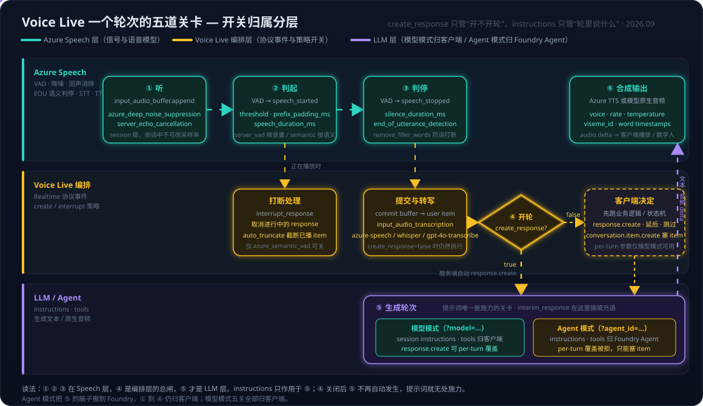
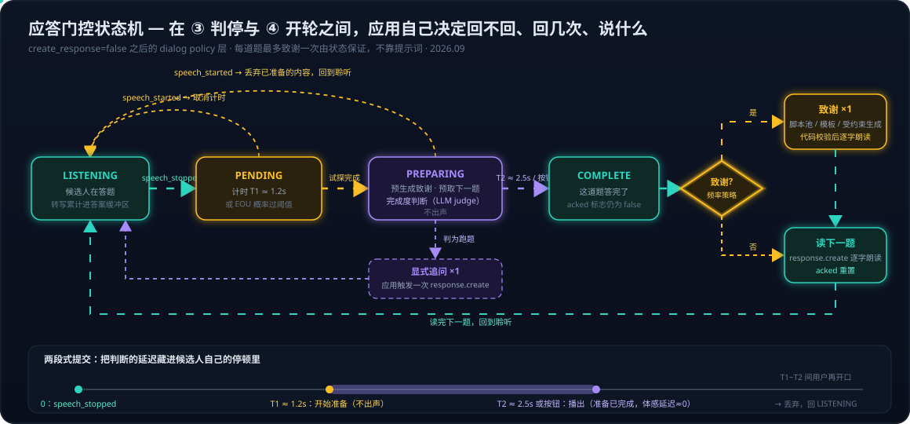

# Voice Live 系列 06：轮次控制的五道关卡——create_response、response.create 与 Model、Agent 模式的控制权归属

> 一个常见困惑：用户说完话，模型总会自动接一句，不管提示词里怎么写"不要主动追问"都压不住。排查下去会发现这不是提示词写得不够狠，而是**开关放错了层**——决定"模型有没有轮次"的开关和决定"轮次里说什么"的提示词根本不在同一层，前者关掉之后后者无处施力。
> 本文把 Voice Live 的一个对话轮次拆开，逐关看开关、看归属、看两种模式下谁说了算。系列前篇：[系列01](Voice%20Live系列01：Agent实现架构——从级联流水线到Azure%20Voice%20Live%20API.md) 讲级联流水线与端到端两条路线、WebSocket + WebRTC 双通道；[系列02](Voice%20Live系列02：架构演进——与Agent%20Service解耦后的合作模式与组合选型.md) 讲 Voice Live 与 Agent Service 解耦后的组合选型。本文是这两篇的"控制面"续篇：路线和组合选定之后，会话里的每个开关到底在控制什么。第六节用一个真实案例演示：面试官在一道题里连说三次 "Thank you"，怎么从事件轨迹上把它拆开；第七节回答案例留下的问题：不想回太多也不想完全静默，怎样判断该不该 response。

---

## 一、先分层：这些功能到底是谁的

Voice Live 官方定位是"把 speech recognition、generative AI、text to speech 整合进一个接口"的托管编排服务，协议与 Azure OpenAI Realtime API 兼容，Voice Live 独有的功能"optional and additive"。所以 session 里出现的每个字段，可以归到三层之一：

| 层 | 归属组件 | session / 事件里对应的东西 |
|---|---|---|
| **Azure Speech 层** | Azure Speech 的信号处理与语音模型 | `input_audio_noise_reduction`（`azure_deep_noise_suppression`）、`input_audio_echo_cancellation`（`server_echo_cancellation`，含 Live-Reference AEC）、`turn_detection` 里的 VAD 本体（`server_vad` 按音量、`azure_semantic_vad` 按语义）与 `end_of_utterance_detection`、`remove_filler_words`、`input_audio_transcription`（`azure-speech` / `mai-transcribe`）、`voice`（`azure-standard` / `azure-custom` / HD 音色、`rate`）、`output_audio_timestamp_types`、`animation.outputs` 的 viseme、`avatar` |
| **Voice Live 编排层** | Voice Live 服务本身（Realtime 协议的服务端实现） | 全部协议事件：`session.update`、`input_audio_buffer.append / commit / clear`、`conversation.item.create / truncate / delete`、`response.create / cancel`；以及 `turn_detection` 里的**策略开关** `create_response`、`interrupt_response`、`auto_truncate`；`interim_response` 的触发逻辑 |
| **LLM 层** | 所选生成模型，或 Foundry Agent | `instructions`、`tools` / `tool_choice`、`temperature`、`max_response_output_tokens`、`modalities`；`response.create` 里的 per-turn 覆盖项；Agent 模式下整层搬到 Foundry Agent Service |

有几个字段容易归错层，单独说明：

- **`turn_detection` 是一个混合对象**。`type` / `threshold` / `silence_duration_ms` / `end_of_utterance_detection` 这些是 Speech 层的"检测器"参数；`create_response` / `interrupt_response` / `auto_truncate` 是编排层的"检测到之后怎么办"策略。同一个 JSON 块里放了两层的东西，这是"VAD 只有一个开关"这种说法的来源——检测器参数很多，但**行为开关**在 `server_vad` 下确实只有 `create_response` 一个（`interrupt_response` 仅 `azure_semantic_vad` 系列可配）。
- **`semantic_vad` 与 `azure_semantic_vad` 不是同一层**。前者是 OpenAI gpt-realtime 模型内置的语义判停，只能配 gpt-realtime / gpt-realtime-mini，`eagerness` 是它的参数；后者是 Azure Speech 的语义判停模型，对所有模型可用。名字像，归属不同。
- **`input_audio_transcription` 的位置随模型变化**。用 gpt-4o / gpt-4.1 / gpt-5 这类文本模型时，`azure-speech` 转写是**主链路**（模型只看得到文字）且自动开启；用 gpt-realtime 这类原生音频模型时，转写是**旁路**（模型直接听音频，转写只为给应用留文字记录），此时可选 `whisper-1` / `gpt-4o-transcribe`。
- **`modalities` 里的 audio 在级联模型下是假的**。gpt-4o 等文本模型输出的只有文本，音频由 Azure TTS 合成；只有 gpt-realtime、phi4-mm-realtime、azure-realtime 这些原生音频模型才真的在 LLM 层产出音频。这决定了"让模型小声一点、慢一点说"这类提示词在级联模型下不可能生效——它们要调的是 `voice.rate`、`voice.temperature` 这些 Speech 层参数（这是从分层推出的结论，非文档原话）。

分层的价值在于：**知道功能归哪层，就知道该在哪层调，也知道哪一层的参数管不到另一层的行为**。下面的五道关卡就是把这个分层沿时间轴展开。

---

## 二、一个轮次的五道关卡

### 2.1 先说清"轮次"是什么：response 对象

"模型有没有轮次"这个说法里的"轮次"，在协议里对应一个具体对象：**response**。先拆开三个容易混在一起的"轮"：

| 说法 | 指什么 | 协议里的实体 |
|---|---|---|
| 对话轮（conversation turn） | 人的直觉：用户说一句、助手答一句 | 没有对应对象，是两个东西拼出来的感觉 |
| 语音轮（`turn_detection` 里的 turn） | **用户**这一段话的起止。turn detection 检测的是"用户说完了没有" | `speech_started` / `speech_stopped` 事件，以及被 commit 成的一个 user item |
| 生成轮次（本文说的"模型的轮次"） | 模型被调用一次推理，产出内容 | **response 对象**：`response.create` → `response.created` → 一串 delta → `response.done` |

可以把整个会话理解为一份共享文档，即 conversation，里面是一条条 item：用户说的话（转写后的 user item）、模型说过的话（assistant item）、function call 及其结果、应用塞进去的 system item。用户说话、应用塞 item，都只是在往这份文档里追加内容，**模型并没有被调用**。response 才是"调用模型"这个动作：服务端拿当前的 conversation 加上 instructions 和 tools，让模型跑一次推理，把输出（文本、音频、function_call）追加回 conversation，然后 `response.done`。同一时刻只能有一个活跃的 response，这就是 `conversation_already_has_active_response` 错误的来源。

`create_response` 这个名字已经把它管的东西说清楚了：用户语音轮结束后，要不要自动 create 一个 response。两条事件轨迹对照，用户同样说完一句话：

```text
# create_response=true
speech_started
speech_stopped
input_audio_buffer.committed
conversation.item.created                       (user item)
response.created                                ← 服务端自动建的
response.output_item.added
response.audio_transcript.delta ...
response.done
conversation.item.input_audio_transcription.completed

# create_response=false
speech_started
speech_stopped
input_audio_buffer.committed
conversation.item.created                       (user item)
conversation.item.input_audio_transcription.completed
（到此为止，除非客户端发 response.create）
```

第二条轨迹里，模型一次都没被调用，提示词一次都没被读。**提示词的作用范围是 per-response 的**：session instructions 在每个 response 开始时被带进上下文，只在 response 里生效。

**默认配置下这就是一来一回**，感觉不到拆过。普通的 Chat Completions 把"用户一句 + 模型一句"焊在一次调用里；Realtime 协议把两半拆成独立动作，`create_response=true` 再把它们粘回去。拆开的原因是语音输入和文字不一样，一来一回在几种场景下会出问题：用户说到一半停顿两秒想词，VAD 判停了，模型立刻插话；用户连说三段，想让模型一次看完再回；用户说完后应用要先查库、走状态机再让模型开口；用户没说话，应用要模型先开口（开场白、超时提醒）；用户说完了但这一句根本不需要回。这些都是"来"和"回"不再一一对应的情况。`create_response=false` 是把"回"的触发权从服务端拿到应用手里，让一来一回变成一来 N 回、N 来一回或者零来一回。

### 2.2 五道关卡

用户开口到模型说完，服务端按固定顺序过五关。每一关对应一组开关，归属层各不相同：



| 关卡 | 服务端做什么 | 开关 | 归属层 |
|---|---|---|---|
| **① 听** | 客户端持续 `input_audio_buffer.append`，服务端做降噪与回声消除 | `input_audio_noise_reduction`、`input_audio_echo_cancellation`（会话中不可改采样率与 AEC 参考源） | Speech |
| **② 判起** | VAD 判定说话开始，发 `speech_started`；若允许打断，取消正在播的 response 并按 `auto_truncate` 截断已播 item | 检测：`threshold`、`prefix_padding_ms`、`speech_duration_ms`；策略：`interrupt_response`、`auto_truncate` | 检测归 Speech，策略归编排 |
| **③ 判停** | VAD 判定说话结束，发 `speech_stopped`，自动 commit buffer，生成 user item，启动转写 | 检测：`silence_duration_ms`、`end_of_utterance_detection`、`remove_filler_words`；转写：`input_audio_transcription` | Speech |
| **④ 开轮** | 决定是否给模型一个生成轮次 | `create_response`：true 则服务端自动发一次 `response.create`；false 则等客户端自己发 | 编排 |
| **⑤ 生成** | 模型按 instructions + 对话历史 + 工具生成，流式回 text / audio delta；Agent 推理慢时可插 `interim_response` 填充语 | 模型模式：session `instructions`、`tools` 及 `response.create` 的 per-turn 参数；Agent 模式：Agent 定义 | LLM |

之后是 ⑥ 合成输出：级联模型下由 Azure TTS 把文本变成音频（顺带产出 viseme 与 word timestamps 给数字人），原生音频模型下模型自己出音频。

把 `turn_detection` 设为 null，② ③ 两关整个交给客户端：自己 `input_audio_buffer.commit`，自己 `response.create`。这是 push-to-talk 形态。

**关键是 ④ 和 ⑤ 是两个独立关卡**。`create_response` 只决定 ④ "要不要开轮"，⑤ "轮里说什么"由另一套东西管。开头那个困惑的机制解释就在这里：提示词只作用于 ⑤；`create_response=true` 时每次说话停止都会自动进入 ⑤，模型拿到轮次后是否守规矩靠概率；`create_response=false` 时 ⑤ 根本不会自动发生，提示词也就无处施力——不是提示词失效，而是**没有轮次可供提示词约束**。这就是 "impossible by construction instead of by instruction" 的确切含义：它不是加强版的提示词，它是换了一层。

反过来也成立：`create_response=false` 之后应用仍然可以手动发一个不带任何约束的 `response.create`，模型照样自由发挥。"关掉自动开轮"和"模型只念稿"不是一回事，后者还需要应用自己发的每一次 `response.create` 都带着确定的内容。

---

## 三、客户端手里的控制手段

按作用点分四类：

**会话级（`session.update`，可中途改）**：VAD 类型与参数、`create_response`、语音、音频格式、转写模型、`interim_response` 配置。中途改 `create_response` 是合法的，这意味着同一个会话可以在不同阶段切换"自动对话"和"应用节拍"。

**轮次触发（`response.create` / `response.cancel`）**：什么时候开轮、什么时候掐断。模型模式下 `response.create` 可以带 `instructions`、`modalities`、`max_output_tokens`、`tools`、`tool_choice`，以及 `conversation: "none"` + `input` 做不进历史的旁路生成（官方文档原话：session.update 设定的输出与生成属性"later overridable using the response.create event"）。

**对话状态（`conversation.item.create` / `truncate` / `delete`）**：往历史里塞 system / user / assistant item，或删改已有 item。这是**唯一在两种模式下都可用的内容级操控手段**。Azure 的 Agent 模式 quickstart 里，开场白就是这样做的：先 `conversation.item.create` 一条 system item "Say something to welcome the user in English"，再发一个空的 `response.create`。

**音频缓冲（`input_audio_buffer.append` / `commit` / `clear`）**：无 VAD 或需要人工纠正判停时用。

---

## 四、Model 模式与 Agent 模式：每个控制点归谁

两种模式的分野在连接 URL 上就定了：`?model=gpt-realtime` 是模型模式，`?agent_id=…&project_id=…` 是 Agent 模式（Speech 资源不支持 Agent 模式，需 Foundry 资源）。官方文档对 Agent 模式只有一句硬约束："The `instructions` property isn't supported when you're using a custom agent"。把这句话沿五关展开：

| 控制点 | 模型模式 | Agent 模式 |
|---|---|---|
| ① ② ③ ④ 音频与 VAD 全部参数 | 客户端 `session.update` | 客户端 `session.update`，也可预置在 Agent metadata 的 `microsoft.voice-live.configuration` 里（512 字符分块存储） |
| ⑤ session 级 `instructions` | 客户端 | Agent 定义，session 级字段禁用 |
| ⑤ `tools` 与工具执行 | 客户端声明、客户端执行 function call | Agent 自带（知识库、Foundry 工具），服务端执行 |
| ⑤ `response.create` 的 per-turn `instructions` | 可用 | 被拒（实测返回 "Overriding instructions in response.create is not supported"） |
| ⑤ 通过 item 注入 system 消息 | 可用 | 可用（官方示例用法） |
| ⑤ `interim_response` 填充语及其 instructions | 可用 | 可用，且是 Agent 模式的主要用途（`triggers: ["tool", "latency"]`） |
| ⑤ `conversation: "none"` 旁路生成 | 可用 | 文档未明确，需实测 |
| ⑥ 语音、viseme、avatar | 客户端 | 客户端 |

一句话概括：**Agent 模式把 ⑤ 这一关的"脑子"搬到了 Foundry，客户端保留 ① 到 ④ 与 ⑥ 的全部控制，外加在 ⑤ 里往对话里塞 item 的能力，失去的是 per-turn 参数化**。模型模式下客户端持有全部关卡。

这个差别对 ④ 的意义很大。模型模式下 `create_response` 是一个**调节器**：关掉自动开轮之后，应用还能用 per-turn `instructions` 给每一次手动开轮设不同的目标，"开轮但限死只说一句确认"是真实存在的中间档。Agent 模式下 per-turn 约束不可用，手动开轮的效果等于自动开轮只是时间由应用控制，于是 `create_response` 从调节器退化成**总闸**：要么模型自由发挥，要么应用逐字塞稿，没有中间档。这与 [系列02](Voice%20Live系列02：架构演进——与Agent%20Service解耦后的合作模式与组合选型.md) 里"控制力递减、托管度递增"的光谱是同一件事在轮次粒度上的体现（[voice-live-agent 概念页](../../wiki/concepts/voice-live-agent.md)记有"挂 Agent 后 session 的 instructions 字段被禁用"的证据）。

---

## 五、能组合出的七种使用形态

把"④ 谁开轮"和"⑤ 怎么约束内容"两个维度叉乘，得到几种典型形态：

1. **全自动对话**。`create_response=true`，内容靠 session instructions 或 Agent 定义。语音助手、客服、闲聊。两种模式都行，Agent 模式在这里最省事，知识库和工具都是现成的。

2. **应用节拍**。`create_response=false`，应用在 `speech_stopped` 或转写完成后先跑业务逻辑（状态机推进、查库、鉴权、判断是否需要回应），再决定发不发 `response.create`。表单填报、IVR、考试、游戏 NPC。两种模式都行。这一形态的价值是"说完不一定立刻答，答不答由业务定"，副产品是彻底消除自动 response 与应用 response 撞车的 `conversation_already_has_active_response` 错误——全会话里只有应用会发 `response.create`。

3. **受约束轮次**。应用节拍 + `response.create` 带 per-turn `instructions` / `max_output_tokens`。每一轮可以换角色、换任务（这轮只确认、这轮只翻译、这轮只复述）。**模型模式独有**。Agent 模式的近似替代是塞一条 system item 再开轮，约束力弱一档。

4. **脚本朗读**。应用节拍 + 把要说的话以极窄指令塞进轮次（模型模式用 `instructions: "逐字朗读："`，Agent 模式用 system item），模型退化为 TTS。合规话术、流程引导、播报。Voice Live 没有独立的 TTS 事件，逐字朗读本质是"指令窄到只剩一个正确答案"。

5. **旁路生成**。`conversation: "none"` + `input`，让模型对当前对话做一次不进历史的判断：意图分类、情绪判断、路由决策、要不要转人工。结果给应用用，不给用户听。模型模式可用。

6. **分阶段混合**。同一会话里用 `session.update` 切 `create_response`：开场脚本（形态 4）→ 自由问答（形态 1）→ 收尾脚本（形态 4）。或者在自由问答里遇到敏感问题临时切到应用节拍处理完再切回。

7. **push-to-talk**。`turn_detection: null`，客户端 commit。嘈杂环境、对讲机式交互、需要精确控制录音边界的场景。

几点在所有形态下都成立的事实：

- `create_response=false` **不影响数据采集**。VAD 仍然 commit buffer、仍然生成 user item、转写仍然跑。丢掉的只是自动生成这一步。
- `interrupt_response` 与 `create_response` **相互独立**。应用节拍下打断仍然生效，用户在应用主动播报时开口会把播报截断；要不要在播报期间关打断，是应用节拍要顺带决定的事。
- Agent 模式的 `interim_response` **在应用节拍下不会出现**。它是服务端编排器在 Agent 推理耗时时推的填充语，没有 Agent 推理就没有填充，题间空白由应用自己填。
- **不需要为了"应用全权控制"关掉整个 VAD**。关掉 `create_response` 就够了，保留 server VAD 还能白拿 `speech_stopped` 的时机和服务端转写。

---

## 六、一个案例：面试官连说三次 "Thank you"

**现象**：一个语音面试产品的题库（bank）模式下，候选人答完一道题，数字人面试官连说了三次 "Thank you."，然后才读下一题。产品侧的第一反应是环境有杂音，"用户的话没被收进去，但又被打断了，于是自动回了一句"。

**机制拆解**。这条链路上有三个开轮来源，噪音只是其中一种触发器的放大器：

1. 后端 session 用 `azure_semantic_vad`，`create_response=true`。每一次 ③ 判停，④ 自动放行，⑤ 开一个完整的 response。
2. 提示词写的是"候选人答完了回一句简短致谢；如果只是中途停顿说 please go on"。但模型在 ⑤ 里分不清停顿和答完，多数时候选 "Thank you."。
3. 前端"我答完了"按钮在没有活跃 response 时会补发一个裸的 `response.create`。这一个开轮来源不经过 VAD，也不受 `create_response` 管。

一个不需要任何噪音的三次场景：候选人中途停顿一次 → 第 1 次；说完停下 → 第 2 次；点"我答完了"时上一条已播完，补发的 `response.create` → 第 3 次。用文章的框架说：**"Thank you" 的次数等于 ④ 被放行的次数**。停顿、噪音、回声都只是在 ② ③ 两关多制造了几次"用户说完了"的信号，改变的是开轮次数，不是开轮机制。安静房间里也会在每次自然停顿处说一次。

噪音和回声在这套机制里的作用方式：`interrupt_response=true` 时任何被判为语音的声音都会打断数字人正在说的话并开启一段新的"用户发言"，这段发言结束又触发一次开轮。如果这段"发言"其实是噪音，转写通常为空或碎片，模型拿到一个空的 user item，也只能回一句致谢。更隐蔽的一种是数字人自己的声音从扬声器回到麦克风，形成 "Thank you" → 被自己触发 → 再一次 "Thank you" 的短循环。

**三种触发源有不同的转写指纹，不需要额外埋点就能坐实**。把每个 `response.created` 往前配对最近一个 user item 的 `input_audio_transcription.completed`：

| 触发原因 | user item 的转写文本 |
|---|---|
| 候选人中途停顿 | 有实际内容，是答题的半句 |
| 环境噪音 | 空，或一两个无意义碎片 |
| 数字人回声 | **是数字人自己刚说过的话**，如 "Thank you" 或题目片段 |

一个级联模型下的顺序细节：`response.create` 在 `speech_stopped` 时就自动发出，早于转写完成；级联模型只看文字，服务端要等转写出来再喂模型。所以是"先开轮、再等转写"，不是"转写为空、再开轮"。结论不变，但排查日志时要按这个顺序读。

**回声在数字人场景下本来就更容易漏**。官方文档对 `server_echo_cancellation` 默认模式有一个前提：服务端用自己发出的音频做参考信号，并假设客户端一收到 response 音频就立刻播放，播放延迟超过两秒回声消除质量就下降。带 avatar 时用户听到的声音走的是 WebRTC 视频流里的音轨，不是 WebSocket 上的 audio delta，播放路径和时序都与服务端参考信号对不上。这正是 Live-Reference AEC 存在的理由：客户端把实际播放的音频作为第二声道送回去当参考（`reference_source: client`，`channels: 2`）。它是 ① 听这一关的 Speech 层参数，与下面的编排层修法正交，两者可以同时做。

**修法落在编排层**。产品最终把 bank 模式默认改为线性轮次：`create_response=false` 并去掉前端的补发，模型不再拿到自己的轮次，只在后端给题时逐字读题，题间静默。无论 VAD 因停顿、噪音还是回声被触发多少次，都不会再多出一句 "Thank you"。这是形态 2 "应用节拍"叠加形态 4 "脚本朗读"的组合。收尾报告里的一句原话把机制说得很准："that auto-response setting is a single bool; the turn and the follow-up turn are the same turn"——致谢和追问出自同一个 response，协议层没有"只许致谢、不许追问"这一档，这就是提示词修不了它的原因。

设计上有三个可以对照的点：

- **开关形式**：落地方案是一个 per-persona 的显式开关，默认线性，另一个选项在 UI 里就叫 "Model has its own turn"，把"模型有没有轮次"这个概念直接做进了产品词汇。另一种做法是把它做成 `max_follow_ups == 0` 的派生量——自由轮次唯一能做到、脚本文本做不到的事就是追问，追问上限为零时自由轮次没有正面产出。显式开关多一个概念但 admin 看得见，派生量少一个概念但编辑器 Playground 那种"必须保留模型轮次否则静音"的例外不好表达。产品选了前者，并明确记录这是对早先"engine decides, no knob"决策的反转。
- **两层各治一段**：线性轮次治的是"次数"，噪音和回声仍会在 ③ 产生 user item 并进答案缓冲区，那是 Speech 层要用 `end_of_utterance_detection`、`remove_filler_words`、降噪和 Live-Reference AEC 另外治的。不要指望一个开关同时解决两层的问题。
- **验证标准**：真实语音跑一场 bank 面试，`response.created` 的次数应当严格等于读题次数。多出来的每一个都能用上面的指纹表分类，这一跑同时能确认线性修的是次数，而回声若仍在会以"噪音进了答案缓冲区"的形式留下来。

## 七、中间地带：怎样判断该不该 response

第六节的修法是把 ④ 关死，代价是题间完全静默。很多产品要的是中间状态：偶尔回一句、不重复、不插话。"要么回太多、要么静默"这个二元是把决定权交给服务端的结果，服务端只有一个布尔值，它不懂"偶尔"。`create_response=false` 把决定权拿回应用之后，"回不回、回几次、说什么"就变成应用自己写的策略。这一层在 [系列01](Voice%20Live系列01：Agent实现架构——从级联流水线到Azure%20Voice%20Live%20API.md) 的级联流水线里叫 dialog manager，是 Voice Live 默认配置折叠掉的那一层，位置在 ③ 判停与 ④ 开轮之间。

### 7.1 把一个判断拆成四个

"该不该 response"其实是四个不同的问题，信号不同、方法不同、所在层不同。混在一起就会退回布尔开关：

| 问题 | 信号 | 方法 | 所在层 | 时延量级 |
|---|---|---|---|---|
| 这句话说完了没 | 静音时长、转写文本的语言完整性、语调音高节奏 | end-of-turn 模型（见 7.2） | Speech 层或紧贴其上 | 几十毫秒 |
| 这道题答完了没 | 题目 + 累计转写 + 评分要点 | 文本模型做完成度判断（见 7.3） | 应用层 | 几百毫秒到一秒 |
| 要不要致谢 | 答题时长、距上次致谢的题数、是否章节边界 | 带跨轮状态的规则或打分（见 7.5） | 应用层 | 零 |
| 说什么 | 转写内容、脚本池、校验规则 | 分档内容源 + 代码校验（见 7.5） | 应用层，可选一次模型调用 | 零到几百毫秒 |

### 7.2 "说完了没"：end-of-turn 判断的三代方法

| 代 | 信号 | Voice Live 内的对应 | 业界对应 | 弱点 |
|---|---|---|---|---|
| 静音阈值 | 停多久算完 | `server_vad` 的 `silence_duration_ms`（默认 500） | 所有基础 VAD | 想词的停顿和说完无法区分，只能在"手快"和"迟钝"之间选 |
| 文本语义 | 转写文本在语言上完整了没 | `end_of_utterance_detection`，`model: semantic_detection_v1`（英语）或 `semantic_detection_v1_multilingual`（10 种语言），`threshold_level: low / medium / high`，`timeout_ms` 默认 1000 | LiveKit 2024 年的 text turn-detector（已弃用） | 依赖转写先出来，多一段转写延迟；听不到语调；"pizza." 和 "pizza, and…" 在停顿那一刻转写完全相同 |
| 音频原生 | 直接编码音频，语义 + 语调、音高、节奏 | **2026-06-01-preview** 新增 `model: smart_end_of_turn_detection`，直接作用于输入音频流，同样暴露 `threshold_level` 与 `timeout_ms` | LiveKit Turn Detector v1.0（2026-06，音频模型，eot-bench 上 300ms 预算下误截断率 9.9%）、Pipecat Smart Turn（开源音频模型） | 自建时要自己拿到音频流跑模型；Voice Live 内置版仍是 preview |

三个容易搞错的点：

- **`azure_semantic_vad` 不等于 EOU**。官方对 `azure_semantic_vad` 的定义是"用语义语音模型判断用户开始与停止说话，在噪音环境下更稳健"，它解决的是**起止检测在噪音下的鲁棒性**；"这句话在语言上完整了没"是另一个可选子对象 `end_of_utterance_detection`，要单独配。只开了 `azure_semantic_vad` 没配 EOU 块，停顿仍然按 `silence_duration_ms` 一刀切。第六节案例里的 session 用的正是 `azure_semantic_vad`，EOU 有没有配是排查时要先看的一项。
- **文本语义 EOU 没有退役**。GA 版 API 2026-04-10 的 `server_vad`、`azure_semantic_vad`、`azure_semantic_vad_multilingual` 三种类型都带 `end_of_utterance_detection` 字段；preview 版是在它旁边**新增**了音频模型选项，不是替换。LiveKit 弃用的是它自家的文本模型，理由是文本有天花板：模型只能好到转写的程度、转写本身加延迟、转成文字丢掉了时序和声学信号。Azure 的演进路线一样，先文本后音频，只是两个都还在。
- **为什么 API 默认值不开 EOU**。Voice Live 的默认 `turn_detection` 是按音量的 `server_vad`，EOU 是 opt-in。文档没有解释，可推断的理由有三条：与 Azure OpenAI Realtime API 的默认行为保持一致，现有应用切到 Voice Live 时行为不变（"optional and additive"的承诺）；语言覆盖有限，不支持的语言会被忽略，做默认值对多数 locale 是错的；`timeout_ms` 意味着拿不准时最多再等一秒，车载指令这类短句场景宁要 500ms 静音判停。值得注意的是，Agent 模式的官方 quickstart 示例配置**开了** `azure_semantic_vad` + `semantic_detection_v1_multilingual`，即"推荐配置"和"API 默认值"并不一致。

**EOU 的配置方法**。它不是独立的 session 字段，而是嵌在 `turn_detection` 里的子对象，三种 VAD 类型都能挂。一份面向"应用节拍"的配置：

```json
{
  "type": "session.update",
  "session": {
    "turn_detection": {
      "type": "azure_semantic_vad_multilingual",
      "threshold": 0.5,
      "prefix_padding_ms": 420,
      "silence_duration_ms": 800,
      "remove_filler_words": true,
      "end_of_utterance_detection": {
        "model": "semantic_detection_v1_multilingual",
        "threshold_level": "medium",
        "timeout_ms": 1500
      },
      "create_response": false,
      "interrupt_response": true
    }
  }
}
```

工作方式：VAD 先按 `silence_duration_ms` 发现一段静音，此时不立刻发 `speech_stopped`，而是让 EOU 模型对到目前为止的转写打一个"这句话完整了"的概率；概率过了 `threshold_level` 对应的门限就立刻判停，没过就继续等用户接着说，最多等 `timeout_ms`，超时后无论如何判停。所以它加的延迟只出现在"句子看起来没说完"的停顿上，说完了的句子仍按静音时长判停，这就是文档说"显著减少过早判停且无用户可感知延迟"的机制。要分清的是：**EOU 只决定 ③ 何时触发，不决定 ④ 是否放行**。`speech_stopped` 一旦发出，`create_response=true` 就照常开轮；它挡得住句中停顿想词这类误判停，挡不住说完一个完整句子后停下想下一个要点（句子完整了，它不知道这道题有几个要点），也挡不住不经过 VAD 的客户端补发。空转写（噪音、回声）没有完整性可判，多半等到 `timeout_ms` 后照发，需实测。`threshold_level` 有 `low / medium / high / default` 四档，`default` 等于 `medium`；文档原话是"With a lower setting the probability the sentence is complete will be higher"，即 `low` 更容易判为说完（手快），`high` 更倾向多等（保守）。`model` 二选一：`semantic_detection_v1` 只支持英语，`semantic_detection_v1_multilingual` 支持英、西、法、意、德、日、葡、中、韩、印地十种语言，其他语言被忽略，等于没配。

三个使用细节：

- **字段名随 API 版本变过**。早期 preview（如 2025-05-01-preview）的示例写法是 `"threshold": 0.01, "timeout": 2`（浮点阈值、秒），GA 版 2026-04-10 的定义是 `threshold_level`（字符串档位）与 `timeout_ms`（毫秒）。网上样例两种写法都有，按自己连接的 `api-version` 对照 API Reference 页确认，配错字段服务端可能静默忽略。
- **Agent 模式同样可配**。`turn_detection` 整块归客户端，既可以在 `session.update` 里发，也可以预置在 Agent metadata 的 `microsoft.voice-live.configuration` 里，官方 Agent quickstart 的示例就带着 `end_of_utterance_detection`。
- **怎么确认生效**。`session.updated` 事件会回显整个 `turn_detection` 块，先看 EOU 子对象有没有原样回来；再用日志对比开关前后两个数字：`speech_stopped` 到下一次 `speech_started` 间隔小于 3 秒的比例（误判完成率）应当下降，最后一次 `speech_stopped` 的到达时间相对静音起点应当只在"没说完的句子"上变晚。preview 版把 `model` 换成 `smart_end_of_turn_detection` 即切到音频原生模型，其余两个字段不变。

不管用哪一代，**输出应当是一个概率而不是布尔值**，阈值由应用定，这样才能做 7.4 的两段式提交。

### 7.3 EOU 小模型与 LLM judge 的分工

一个直觉是"用大模型判断语义是否结束、是否该追问"。这个直觉对了一半：大模型该判，但判的不是 EOU 那个问题。两者是叠放关系，不是替代关系：

| | EOU 模型（`semantic_detection_v1` 等） | LLM judge |
|---|---|---|
| 回答的问题 | 这句话在语言上完整了没 | 这道题答完了没、覆盖了几个要点、是否跑题、要不要追问 |
| 输入 | 流式转写（音频版直接读音频） | 题目 + 评分要点 + 累计转写 + 面试上下文 |
| 输出 | 一个概率，按 `threshold_level` 判 | 结构化判断（JSON：complete / partial / off-topic + 理由） |
| 时延 | 几十毫秒，文档称"无用户可感知延迟" | 几百毫秒到一秒，每次调用计费 |
| 知道任务吗 | 不知道，只看语言 | 知道 |
| 所在层 | Speech 层，配在 `turn_detection` 里 | 应用层 |

拿 LLM 去做 EOU 是错位的：每次停顿都要等一次几百毫秒的往返，而且它也读不到语调，"pizza." 的问题它同样答不了。拿 EOU 去做任务判断是不可能的：它不知道题目是什么。正确的叠法是 EOU 负责把 `speech_stopped` 的触发信号洗干净，少一些误触发；judge 拿洗干净之后的转写决定接下来干什么。

还有一个更根本的区别：**judge 与 speaker 分离**。`create_response=true` 时，判断"该不该追问"和"说出追问"发生在同一个 response 里，模型的判断没有人能否决，这就是第六节提示词失效的结构原因。把 judge 拆成独立的一次调用（模型模式可用形态 5 的旁路生成，任何模式都可用外部文本模型），输出结构化结果给应用，应用再决定开不开轮、开轮说什么。追问从模型的自由行为变成应用在 off-topic 状态下显式触发的一次 `response.create`，每题上限由状态保证。这是 [生成评估分离](../../wiki/concepts/generation-evaluation-separation.md)在语音轮次上的具体形态。

### 7.4 两段式提交与应答门控状态机

上面两层判断都要时间，直接串在链路上会让反应变慢。做法是两个阈值：

- **T1 试探完成**（约 1.2 秒静音，或 EOU 概率过阈值）：开始准备内容，比如跑完成度判断、预生成致谢文本、预取下一题，但不出声。
- **T2 确认完成**（约 2.5 秒，或用户按了"答完了"，或完成度判为已覆盖）：播出。
- T1 到 T2 之间用户再开口：丢弃准备好的内容，回到聆听。

候选人感知到的延迟是 T2 减去准备耗时，准备已经在 T1 做完了，体感几乎为零。阈值可以按说话人自适应：前一两分钟统计候选人句内停顿的分布，把 T1 放在 95 分位。



状态机的几个要点：多次停顿在 PENDING 与 LISTENING 之间来回，最后只产生一次 COMPLETE；每道题的 `acked` 标志只能从 false 翻到 true 一次，致谢上限是结构保证的，不是提示词承诺的；中途停顿时什么都不说，真人面试官在候选人想词时是点头不是开口，如果一定要给信号，只在静默超过很长的阈值（如 8 秒）时说一句 "Take your time"，同样每题最多一次；线性轮次是这个状态机的退化情形，"致谢"步骤永远跳过，所以从线性轮次演进到"偶尔致谢"不需要推翻架构。

### 7.5 频率策略与内容分档

频率策略不需要模型，需要的是跨轮次的状态，所以只能在应用层。这些规则一行都写不进提示词，因为它们依赖上一题说了什么、本题答了多久，而提示词只在单个 response 内生效：

- 每道题致谢上限 1，由状态机保证。
- 答题不足 3 秒不致谢，大概率是噪音或误触。
- 上一次致谢距今不到两题不致谢，或按概率 0.5 致谢，避免机械感。
- 章节切换处固定致谢并说过渡语，普通题之间不致谢。
- 相邻两次不用同一句话。

可以写成一个简单打分：答题时长、距上次致谢的题数、是否章节边界各给权重，超过阈值才致谢。

内容分三档，档位越高内容感越强、风险越大：

| 档 | 做法 | 效果 | Agent 模式可用 |
|---|---|---|---|
| 脚本池 | 8 到 10 句中性过渡语，随机取、不与上一句重复，逐字朗读 | 零成本、零风险，与答案内容无关 | ✅ |
| 模板加槽位 | 从转写里抽一个主题名词填进 "Thanks for walking me through {X}" | 用一次便宜的抽取调用换来"听进去了"的感觉，风险可控 | ✅ |
| 受约束生成 | 文本模型基于转写生成一句，代码校验（无问号、无评价词表中的词如 great / excellent / impressive、长度上限、语言一致），不合格回退第一档 | 有内容感、有变化，且输出可拦截 | ✅（模型模式还可用 `response.create` 的 per-turn `instructions` 直接约束，但那一档模型说什么就播什么，没有否决权） |

面试场景建议停在第二档。带评价色彩的回应会被候选人读成信号，也让不同候选人的体验不一致，结构化面试刻意保持中立不是妥协而是优点。

### 7.6 评估指标与演进顺序

已有的事件日志就够做离线评估，不用再埋点：

- **误判完成率**：COMPLETE 之后 3 秒内又出现 `speech_started` 的比例，度量"手快"。
- **完成延迟**：最后一次 `speech_stopped` 到播出的时间，度量"迟钝"。
- **致谢重复率**：相邻两次致谢文本相同的比例。

把一批真实会话的事件流回放到不同阈值与模型组合上，前两个指标画成曲线选拐点。这和 LiveKit 开源的 eot-bench 思路一样，只是数据换成自己的。

演进顺序：

1. 规则起步：`create_response=false`，两段式提交，每题致谢上限 1，脚本池。这一步已经消灭重复致谢和大部分误插话。
2. 误判完成率仍高：开 `azure_semantic_vad` 并配 `end_of_utterance_detection`，拉长 `silence_duration_ms` 到 1200 到 1500，开 `remove_filler_words`。
3. 需要区分"说完"和"答完"：加 LLM judge 做完成度判断，追问变成显式触发。
4. 前三步都做了仍嫌手快：试 preview 的 `smart_end_of_turn_detection`，或自跑 LiveKit / Pipecat 的音频模型。后者要接管音频流，工程量最大，放最后。

## 八、选型的判断顺序

1. **谁决定什么时候答**：业务需要在说完和答之间插逻辑，就 `create_response=false`；否则保持 true。
2. **每一轮的任务是否一样**：一样就用 session 级约束（两种模式都行）；不一样就需要 per-turn 约束，那就只能是模型模式。
3. **要不要现成的知识库和托管工具**：要就 Agent 模式，并接受形态 3 不可用、`create_response` 退化为总闸。
4. **音频质量与判停精度**：嘈杂或多语言环境上 `azure_semantic_vad_multilingual` + 深度降噪；这一步与前三步正交，因为它全在 Speech 层。

## 九、小结

1. **Voice Live 的 session 字段分三层**：Speech 层（VAD 检测器、降噪、转写、TTS、viseme、avatar）、编排层（协议事件与 `create_response` / `interrupt_response` / `auto_truncate` 策略开关）、LLM 层（instructions、tools、per-turn 参数，Agent 模式下整层归 Foundry Agent）。`turn_detection` 是跨 Speech 与编排两层的混合对象。
2. **"轮次"= response 对象**，与用户语音轮、人感觉的对话轮是三样东西；`create_response` 管的是语音轮结束后要不要自动 create 一个 response，默认 true 把两者粘成一来一回。**一个轮次五道关卡**：听、判起、判停归 Speech；开轮归编排；生成归 LLM。`create_response` 只管 ④，`instructions` 只管 ⑤；④ 关掉后 ⑤ 不再自动发生，提示词无处施力——这是"by construction 而非 by instruction"的机制含义。
3. **两种模式的差别集中在 ⑤**：Agent 模式拿走 session 级与 per-turn 的 `instructions`，保留 item 注入；由此 `create_response` 在模型模式下是调节器，在 Agent 模式下是总闸。
4. **七种形态由"谁开轮 × 怎么约束"叉乘得到**，其中受约束轮次与旁路生成是模型模式独有；分层混合形态依赖 `session.update` 可中途改 `create_response` 这一事实。
5. 级联模型下 `modalities: audio` 由 Azure TTS 兑现，LLM 层的提示词管不到韵律，要调 `voice.rate` / `voice.temperature`；原生音频模型才在 LLM 层产出音频。
6. **"要么回太多、要么静默"之间有中间地带**，前提是 `create_response=false` 把决定权拿回应用：把"该不该 response"拆成说完了没（EOU 模型，Speech 层，几十毫秒）、答完了没（LLM judge，应用层，知道任务）、要不要致谢（跨轮状态规则）、说什么（分档内容源 + 代码校验）四个判断；两段式提交把判断延迟藏进候选人自己的停顿里；judge 与 speaker 分离是追问可控的结构前提。`azure_semantic_vad` 管的是噪音下的起止鲁棒性，句子完整性要另配 `end_of_utterance_detection`；文本 EOU 在 GA 版仍在，preview 版新增音频原生的 `smart_end_of_turn_detection`。
7. **排查重复回应先数 `response.created`**：次数等于 ④ 放行次数，与提示词无关；每个 response 配对前一个 user item 的转写，空 = 噪音、半句 = 停顿、复述自己的话 = 回声。数字人场景回声消除默认参考信号与 WebRTC 播放路径不匹配，需 Live-Reference AEC；这与编排层的线性轮次修法各治一层。

## 参考

- [How to use the Voice Live API — Microsoft Learn](https://learn.microsoft.com/en-us/azure/ai-services/speech-service/voice-live-how-to)（turn_detection 全部字段与默认值；"instructions isn't supported when you're using a custom agent"；session.update 属性可由 response.create 覆盖；转写模型与聊天模型的配对表；server_echo_cancellation 的两秒播放假设与 Live-Reference AEC 配置）
- [Voice Live API Overview — Microsoft Learn](https://learn.microsoft.com/en-us/azure/ai-services/speech-service/voice-live)（Voice Live 独有功能"optional and additive"；模型表中级联模型"audio input through Azure speech to text + audio output through Azure text to speech"与原生音频模型的区分）
- [Quickstart: Voice Agent with Foundry Agent Service — Microsoft Learn](https://learn.microsoft.com/en-us/azure/ai-services/speech-service/voice-live-agents-quickstart)（Agent metadata `microsoft.voice-live.configuration` 分块存储；system item + 空 response.create 触发开场白；interim_response 配置）
- [Voice Live 线性轮次部署报告的翻译与解释](https://chatgpt.com/share/6ab4930c-54d4-83ec-8072-078d399be32d)（第六节案例的收尾报告：bank 模式默认改线性轮次、"Model has its own turn" 选项、对 "engine decides, no knob" 决策的反转；注意其中对缺词原文的还原属推测，第三次 "Thank you" 的来源以代码链路为准）
- [Voice Live API Reference 2026-04-10 — Microsoft Learn](https://learn.microsoft.com/en-us/azure/ai-services/speech-service/voice-live-api-reference-2026-04-10)（GA 版三种 VAD 类型均带 `end_of_utterance_detection`；`RealtimeEOUDetection` 的 `model` / `threshold_level` / `timeout_ms` 定义与"允许自然停顿、显著减少过早判停且无用户可感知延迟"的描述；`azure_semantic_vad` 的定义为噪音下更稳健的起止检测）
- [Voice Live API Reference 2026-06-01-preview — Microsoft Learn](https://learn.microsoft.com/azure/ai-services/speech-service/voice-live-api-reference-2026-06-01-preview)（新增音频原生 `smart_end_of_turn_detection`、Live-Reference AEC 的 `reference_source` / `channels`、`parallel_tool_calls`）
- [Solving end-of-turn detection: LiveKit Turn Detector v1.0 — LiveKit Blog](https://livekit.com/blog/solving-end-of-turn-detection)（文本模型的三条天花板与 "pizza" 例子；音频模型双分支架构；eot-bench 上 300ms 预算 9.9% 误截断率）
- [livekit/turn-detector — Hugging Face](https://huggingface.co/livekit/turn-detector)（早期开源文本 EOU 模型的模型卡，已被音频版取代）
- [pipecat-ai/smart-turn — GitHub](https://github.com/pipecat-ai/smart-turn)（开源音频原生 turn detection 模型）
- [Azure OpenAI Realtime API events reference — Microsoft Learn](https://learn.microsoft.com/en-us/azure/ai-foundry/openai/realtime-audio-reference)（response.create 的 instructions / conversation / input 等字段；conversation.item.* 与 input_audio_buffer.* 事件语义）
- 系列前篇：[Voice Live系列01：Agent实现架构——从级联流水线到Azure Voice Live API](Voice%20Live系列01：Agent实现架构——从级联流水线到Azure%20Voice%20Live%20API.md)、[Voice Live系列02：架构演进——与Agent Service解耦后的合作模式与组合选型](Voice%20Live系列02：架构演进——与Agent%20Service解耦后的合作模式与组合选型.md)、[Voice Live系列03：数字人出场延迟优化——ICE门控根因、实测分解与预热占位策略](Voice%20Live系列03：数字人出场延迟优化——ICE门控根因、实测分解与预热占位策略.md)、[Voice Live系列04：四条路线与全双工——GPT-Live-1对数字人方案的影响评估](Voice%20Live系列04：四条路线与全双工——GPT-Live-1对数字人方案的影响评估.md)、[Voice Live系列05：两类数字人头像——viseme驱动的Video Avatar与VASA-1生成的Photo Avatar](Voice%20Live系列05：两类数字人头像——viseme驱动的Video%20Avatar与VASA-1生成的Photo%20Avatar.md)
- 相关 wiki：[voice-live-agent 概念页](../../wiki/concepts/voice-live-agent.md)（三种模式的控制力光谱与"挂 Agent 后 instructions 禁用"证据）、[turn-taking 概念页](../../wiki/concepts/turn-taking.md)（轮次交接的通用机制）、[generation-evaluation-separation 概念页](../../wiki/concepts/generation-evaluation-separation.md)（judge 与 speaker 分离的理论基础）
