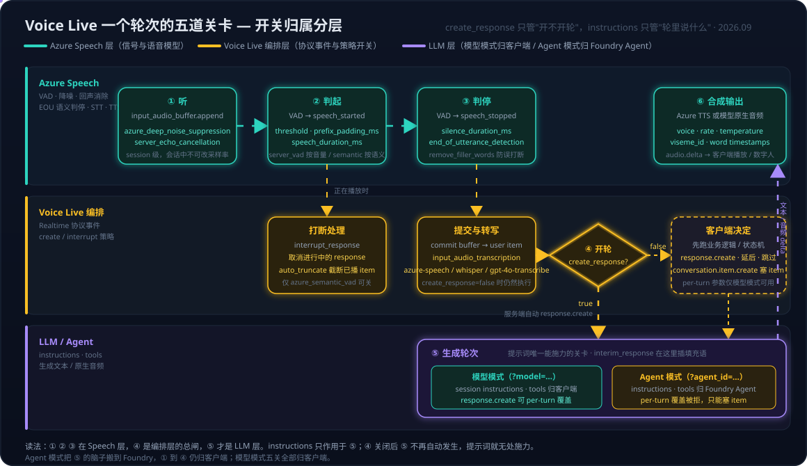

# Voice Live 系列 06：轮次控制的五道关卡——create_response、response.create 与 Model、Agent 模式的控制权归属

> 一个常见困惑：用户说完话，模型总会自动接一句，不管提示词里怎么写"不要主动追问"都压不住。排查下去会发现这不是提示词写得不够狠，而是**开关放错了层**——决定"模型有没有轮次"的开关和决定"轮次里说什么"的提示词根本不在同一层，前者关掉之后后者无处施力。
> 本文把 Voice Live 的一个对话轮次拆开，逐关看开关、看归属、看两种模式下谁说了算。系列前篇：[系列01](Voice%20Live系列01：Agent实现架构——从级联流水线到Azure%20Voice%20Live%20API.md) 讲级联流水线与端到端两条路线、WebSocket + WebRTC 双通道；[系列02](Voice%20Live系列02：架构演进——与Agent%20Service解耦后的合作模式与组合选型.md) 讲 Voice Live 与 Agent Service 解耦后的组合选型。本文是这两篇的"控制面"续篇：路线和组合选定之后，会话里的每个开关到底在控制什么。本文只讲机制；机制之上的两件事各自成篇：[系列07](Voice%20Live系列07：重复致谢排查——三次Thank%20you的三个开轮来源、转写指纹与编排层修法.md) 用"面试官连说三次 Thank you"的真实案例演示怎么从事件轨迹上把开轮来源拆开，[系列08](Voice%20Live系列08：应答门控——判停与开轮之间的四个判断：EOU、LLM%20judge、两段式提交与频率策略.md) 回答案例留下的问题——不想回太多也不想完全静默，怎样判断该不该 response。

---

## 一、先分层：这些功能到底是谁的

Voice Live 官方定位是"把 speech recognition、generative AI、text to speech 整合进一个接口"的托管编排服务，协议与 Azure OpenAI Realtime API 兼容，Voice Live 独有的功能"optional and additive"。所以 session 里出现的每个字段，可以归到三层之一：

| 层 | 归属组件 | session / 事件里对应的东西 |
|---|---|---|
| **Azure Speech 层** | Azure Speech 的信号处理与语音模型 | `input_audio_noise_reduction`（`azure_deep_noise_suppression`）、`input_audio_echo_cancellation`（`server_echo_cancellation`，含 Live-Reference AEC）、`turn_detection` 里的 VAD 本体（`server_vad` 按音量、`azure_semantic_vad` 按语义）与 `end_of_utterance_detection`、`remove_filler_words`、`input_audio_transcription`（`azure-speech` / `mai-transcribe`）、`voice`（`azure-standard` / `azure-custom` / HD 音色、`rate`）、`output_audio_timestamp_types`、`animation.outputs` 的 viseme、`avatar` |
| **Voice Live 编排层** | Voice Live 服务本身（Realtime 协议的服务端实现） | 全部协议事件：`session.update`、`input_audio_buffer.append / commit / clear`、`conversation.item.create / truncate / delete`、`response.create / cancel`；以及 `turn_detection` 里的**策略开关** `create_response`、`interrupt_response`、`auto_truncate`；`interim_response` 的触发逻辑 |
| **LLM 层** | 所选生成模型，或 Foundry Agent | `instructions`、`tools` / `tool_choice`、`temperature`、`max_response_output_tokens`、`modalities`；`response.create` 里的 per-turn 覆盖项；Agent 模式下整层搬到 Foundry Agent Service |

有几个字段容易归错层，单独说明：

- **`turn_detection` 是一个混合对象**。`type` / `threshold` / `silence_duration_ms` / `end_of_utterance_detection` 这些是 Speech 层的"检测器"参数；`create_response` / `interrupt_response` / `auto_truncate` 是编排层的"检测到之后怎么办"策略。同一个 JSON 块里放了两层的东西，这是"VAD 只有一个开关"这种说法的来源——检测器参数很多，但**行为开关**在 `server_vad` 下确实只有 `create_response` 一个（`interrupt_response` 仅 `azure_semantic_vad` 系列可配）。
- **`semantic_vad` 与 `azure_semantic_vad` 不是同一层**。前者是 OpenAI gpt-realtime 模型内置的语义判停，只能配 gpt-realtime / gpt-realtime-mini，`eagerness` 是它的参数；后者是 Azure Speech 的语义判停模型，对所有模型可用。名字像，归属不同。
- **`input_audio_transcription` 的位置随模型变化**。用 gpt-4o / gpt-4.1 / gpt-5 这类文本模型时，`azure-speech` 转写是**主链路**（模型只看得到文字）且自动开启；用 gpt-realtime 这类原生音频模型时，转写是**旁路**（模型直接听音频，转写只为给应用留文字记录），此时可选 `whisper-1` / `gpt-4o-transcribe`。
- **`modalities` 里的 audio 在级联模型下是假的**。gpt-4o 等文本模型输出的只有文本，音频由 Azure TTS 合成；只有 gpt-realtime、phi4-mm-realtime、azure-realtime 这些原生音频模型才真的在 LLM 层产出音频。这决定了"让模型小声一点、慢一点说"这类提示词在级联模型下不可能生效——它们要调的是 `voice.rate`、`voice.temperature` 这些 Speech 层参数（这是从分层推出的结论，非文档原话）。

分层的价值在于：**知道功能归哪层，就知道该在哪层调，也知道哪一层的参数管不到另一层的行为**。下面的五道关卡就是把这个分层沿时间轴展开。

---

## 二、一个轮次的五道关卡

### 2.1 先说清"轮次"是什么：response 对象

"模型有没有轮次"这个说法里的"轮次"，在协议里对应一个具体对象：**response**。先拆开三个容易混在一起的"轮"：

| 说法 | 指什么 | 协议里的实体 |
|---|---|---|
| 对话轮（conversation turn） | 人的直觉：用户说一句、助手答一句 | 没有对应对象，是两个东西拼出来的感觉 |
| 语音轮（`turn_detection` 里的 turn） | **用户**这一段话的起止。turn detection 检测的是"用户说完了没有" | `speech_started` / `speech_stopped` 事件，以及被 commit 成的一个 user item |
| 生成轮次（本文说的"模型的轮次"） | 模型被调用一次推理，产出内容 | **response 对象**：`response.create` → `response.created` → 一串 delta → `response.done` |

可以把整个会话理解为一份共享文档，即 conversation，里面是一条条 item：用户说的话（转写后的 user item）、模型说过的话（assistant item）、function call 及其结果、应用塞进去的 system item。用户说话、应用塞 item，都只是在往这份文档里追加内容，**模型并没有被调用**。response 才是"调用模型"这个动作：服务端拿当前的 conversation 加上 instructions 和 tools，让模型跑一次推理，把输出（文本、音频、function_call）追加回 conversation，然后 `response.done`。同一时刻只能有一个活跃的 response，这就是 `conversation_already_has_active_response` 错误的来源。

`create_response` 与 `response.create` 两个名字长得像，但根本不在同一层：一个是**会话配置里的开关**，一个是**客户端发出的事件**。先把两者正面摆在一起：

| | `response.create` | `create_response` |
|---|---|---|
| 是什么 | 一条 WebSocket 事件，即**动作**："现在调一次模型，产出一个 response" | `turn_detection` 里的一个布尔，即**开关**："VAD 判停后，服务端要不要自动替你发一次 `response.create`" |
| 谁发出 | 客户端（应用）；或服务端在 `create_response=true` 时代发 | 客户端在 `session.update` 里设定，可中途改 |
| 作用点 | ④ 开轮的那一刻：拿当前 conversation 加 instructions 加 tools 跑一次推理，流式回 `response.created → delta → response.done` | ③ 判停与 ④ 开轮之间：决定 `speech_stopped` 之后要不要自动进入 ④ |
| 能带什么 | per-turn `instructions`、`max_output_tokens`、`tools` / `tool_choice`、`conversation: "none"` + `input` 旁路生成、`pre_generated_assistant_message` 直接 TTS（模型模式；Agent 模式下 `instructions` 被拒） | 只有 true / false |
| 默认 | 无所谓默认，不发就没有 response | true，于是"用户说完一句、模型答一句"看起来是一体的 |

两者是**触发器与动作**的关系：`create_response` 是自动触发器，`response.create` 是被触发的动作。关掉自动触发器，动作本身还在，只是触发权从服务端回到应用。`create_response` 这个名字已经把它管的东西说清楚了：用户语音轮结束后，要不要自动 create 一个 response。两条事件轨迹对照，用户同样说完一句话：

```text
# create_response=true
speech_started
speech_stopped
input_audio_buffer.committed
conversation.item.created                       (user item)
response.created                                ← 服务端自动建的
response.output_item.added
response.audio_transcript.delta ...
response.done
conversation.item.input_audio_transcription.completed

# create_response=false
speech_started
speech_stopped
input_audio_buffer.committed
conversation.item.created                       (user item)
conversation.item.input_audio_transcription.completed
（到此为止，除非客户端发 response.create）
```

第二条轨迹里，模型一次都没被调用，提示词一次都没被读。**提示词的作用范围是 per-response 的**：session instructions 在每个 response 开始时被带进上下文，只在 response 里生效。

**默认配置下这就是一来一回**，感觉不到拆过。普通的 Chat Completions 把"用户一句 + 模型一句"焊在一次调用里；Realtime 协议把两半拆成独立动作，`create_response=true` 再把它们粘回去。

拆开的原因是**语音特有的**，文字 LLM 没有这个问题。文字聊天里"用户一段话"的边界是确定的：用户按下回车，一条消息就结束了，模型该不该答、答几次，没有歧义。语音里没有回车键，"用户说完了"这件事本身要靠 VAD 从声音里**猜**出来，而猜出来的边界和"该不该让模型答一次"并不一一对应。几类典型场景：

- **边界猜错**：用户说到一半停顿两秒想词，VAD 按静音时长判停了，模型立刻插话。这是 ③ 判停的误判（[系列08](Voice%20Live系列08：应答门控——判停与开轮之间的四个判断：EOU、LLM%20judge、两段式提交与频率策略.md) 第二节的 end-of-turn 问题），文字里不存在"半句消息"。
- **边界根本不是用户的话**：环境噪音被判为一段语音，转写为空或碎片，模型拿到一个空的 user item 也会回一句；更隐蔽的是数字人自己的声音从扬声器回到麦克风，形成"说一句 → 被自己触发 → 再说一句"的短循环（[系列07](Voice%20Live系列07：重复致谢排查——三次Thank%20you的三个开轮来源、转写指纹与编排层修法.md) 第三、四节的噪音与回声指纹）。文字输入没有噪音，也不会把自己的输出当成输入。
- **多来一回**：用户连说三段，希望模型看完整再答。文字里用户会把三段写进一条消息，语音里每段之间的停顿都是一个潜在的判停点。
- **来了先不回**：用户说完后，应用要先查库、走状态机、判断"该不该回"，再让模型开口（系列08 的应答门控）。
- **没来也要回**：用户没说话，应用要模型先开口（开场白、超时提醒）。
- **来了不需要回**：用户说完了，但这一句根本不需要回。面试读题场景答完直接读下一题，不需要模型对答案发表意见。

前两类是 VAD、噪音、回声这些**声学层**制造的假边界，后四类是**业务层**对"来"与"回"对应关系的不同要求。共同点是"来"和"回"不再一一对应。`create_response=true` 把这两件事焊在一起，所以只能在"每个边界都答"和"都不答"之间选；`create_response=false` 是把"回"的触发权从服务端拿到应用手里，让一来一回变成一来 N 回、N 来一回或者零来一回，声学层的假边界仍然会产生 user item 和转写，但不再自动变成一次模型开口。

### 2.2 五道关卡

用户开口到模型说完，服务端按固定顺序过五关。每一关对应一组开关，归属层各不相同：



| 关卡 | 服务端做什么 | 开关 | 归属层 |
|---|---|---|---|
| **① 听** | 客户端持续 `input_audio_buffer.append`，服务端做降噪与回声消除 | `input_audio_noise_reduction`、`input_audio_echo_cancellation`（会话中不可改采样率与 AEC 参考源；输入采样率为什么默认 24 kHz、级联模式能否降 16 kHz 见[系列01](Voice%20Live系列01：Agent实现架构——从级联流水线到Azure%20Voice%20Live%20API.md) 4.5.1） | Speech |
| **② 判起** | VAD 判定说话开始，发 `speech_started`；若允许打断，取消正在播的 response 并按 `auto_truncate` 截断已播 item | 检测：`threshold`、`prefix_padding_ms`、`speech_duration_ms`；策略：`interrupt_response`、`auto_truncate` | 检测归 Speech，策略归编排 |
| **③ 判停** | VAD 判定说话结束，发 `speech_stopped`，自动 commit buffer，生成 user item，启动转写 | 检测：`silence_duration_ms`、`end_of_utterance_detection`、`remove_filler_words`；转写：`input_audio_transcription` | Speech |
| **④ 开轮** | 决定是否给模型一个生成轮次 | `create_response`：true 则服务端自动发一次 `response.create`；false 则等客户端自己发 | 编排 |
| **⑤ 生成** | 模型按 instructions + 对话历史 + 工具生成，流式回 text / audio delta；Agent 推理慢时可插 `interim_response` 填充语 | 模型模式：session `instructions`、`tools` 及 `response.create` 的 per-turn 参数；Agent 模式：Agent 定义 | LLM |

之后是 ⑥ 合成输出：级联模型下由 Azure TTS 把文本变成音频（顺带产出 viseme 与 word timestamps 给数字人），原生音频模型下模型自己出音频。

把 `turn_detection` 设为 null，② ③ 两关整个交给客户端：自己 `input_audio_buffer.commit`，自己 `response.create`。这是 push-to-talk 形态。

**关键是 ④ 和 ⑤ 是两个独立关卡**。`create_response` 只决定 ④ "要不要开轮"，⑤ "轮里说什么"由另一套东西管。开头那个困惑的机制解释就在这里：提示词只作用于 ⑤；`create_response=true` 时每次说话停止都会自动进入 ⑤，模型拿到轮次后是否守规矩靠概率；`create_response=false` 时 ⑤ 根本不会自动发生，提示词也就无处施力——不是提示词失效，而是**没有轮次可供提示词约束**。这就是 "impossible by construction instead of by instruction" 的确切含义：它不是加强版的提示词，它是换了一层。

反过来也成立：`create_response=false` 之后应用仍然可以手动发一个不带任何约束的 `response.create`，模型照样自由发挥。"关掉自动开轮"和"模型只念稿"不是一回事，后者还需要应用自己发的每一次 `response.create` 都带着确定的内容——靠 per-turn `instructions` 求它照读会随模型漂，可靠的做法是让 `response.create` 带 `pre_generated_assistant_message`，文本不进模型（[系列09](Voice%20Live系列09：脚本朗读的机制化——pre_generated绕过模型推理、宿主模型与代码、prompt、voice三层分工.md)）。

---

## 三、客户端手里的控制手段

按作用点分四类：

**会话级（`session.update`，可中途改）**：VAD 类型与参数、`create_response`、语音、音频格式、转写模型、`interim_response` 配置。中途改 `create_response` 是合法的，这意味着同一个会话可以在不同阶段切换"自动对话"和"应用节拍"。

**轮次触发（`response.create` / `response.cancel`）**：什么时候开轮、什么时候掐断。模型模式下 `response.create` 可以带 `instructions`、`modalities`、`max_output_tokens`、`tools`、`tool_choice`，以及 `conversation: "none"` + `input` 做不进历史的旁路生成（官方文档原话：session.update 设定的输出与生成属性"later overridable using the response.create event"）。

**对话状态（`conversation.item.create` / `truncate` / `delete`）**：往历史里塞 system / user / assistant item，或删改已有 item。这是**唯一在两种模式下都可用的内容级操控手段**。Azure 的 Agent 模式 quickstart 里，开场白就是这样做的：先 `conversation.item.create` 一条 system item "Say something to welcome the user in English"，再发一个空的 `response.create`。

**音频缓冲（`input_audio_buffer.append` / `commit` / `clear`）**：无 VAD 或需要人工纠正判停时用。

上面四类是按作用点分的。换一个坐标系，把 Chat Completions 的 messages 数组当参照，Voice Live 里"能往模型面前放文字"的手段一共这些，其中 per-turn `instructions` 最容易被误解：

| Voice Live 手段 | 对应 Chat 里的什么 | 作用范围 | 进不进对话历史 | Agent 模式 |
|---|---|---|---|---|
| `session.update` 的 `instructions` | **system / developer prompt**，每次调用都前置 | 整个会话，每个 response 都带 | 不进（是会话属性，不是 item） | 禁用，由 Agent 定义代替 |
| `response.create` 的 `instructions`（**per-turn**） | 只给**这一次调用**临时换掉的 system prompt | 仅这一个 response，官方语义是 override 会话级 instructions | 不进，下一轮模型看不到它曾存在 | 被拒 |
| `conversation.item.create` `role: system` | messages 数组里**插在某个位置**的一条 system message | 从插入点起所有后续 response 都看得到 | 进，除非 `conversation.item.delete` | 可用，是 Agent 模式唯一的注入手段 |
| `conversation.item.create` `role: user` | user message（纯文本，无音频） | 同上 | 进 | 可用 |
| `conversation.item.create` `role: assistant` | 预填的 assistant message | 同上 | 进 | 可用 |
| `response.create` 的 `pre_generated_assistant_message` | 往数组末尾追加一条 assistant message，**不调模型**，然后念出来（[系列09](Voice%20Live系列09：脚本朗读的机制化——pre_generated绕过模型推理、宿主模型与代码、prompt、voice三层分工.md)） | 立即播出 | 进 | 未实测 |
| VAD 产生的 user item | user message（音频加转写） | 同上 | 进 | 自动 |

所以 **per-turn `instructions` 就是只对这一个 response 生效的 system prompt**。它与会话级 `instructions` 在同一层（都不是 item，都不在 messages 数组里），差别只在时效：会话级常驻，per-turn 一次性。这个差别决定了两种约束方式怎么选：

- **要约束一轮、不留痕迹**：用 per-turn。"这一轮只说一句致谢，不要追问"，说完下一轮模型完全不知道有过这条限制，不会把"简短"的惯性带进自由问答。
- **要约束从此往后**：用 system item。"接下来进入自由问答，不要再出题"，它留在历史里，后面每一轮都看得到；想撤销得显式 `delete`。
- **Agent 模式只有第二种**。第四节说 Agent 模式下 `create_response` 从调节器退化成总闸，根源就在这一格：没有一次性的 system prompt，只能往历史里塞常驻的 system message，约束力弱一档，且 Agent 自己的定义优先级更高。

还有一个推论：中途把整段对话交给模型自由发挥时，历史里有的是 system item、assistant item、user item 三种，缺的正是从来不进历史的两层（会话级与 per-turn `instructions`）。切阶段时的说明要么随每次 `response.create` 以 per-turn 形式重复带，要么以 system item 塞一次留在历史里。

---

## 四、Model 模式与 Agent 模式：每个控制点归谁

两种模式的分野在连接 URL 上就定了：`?model=gpt-realtime` 是模型模式，`?agent_id=…&project_id=…` 是 Agent 模式（Speech 资源不支持 Agent 模式，需 Foundry 资源）。官方文档对 Agent 模式只有一句硬约束："The `instructions` property isn't supported when you're using a custom agent"。把这句话沿五关展开：

| 控制点 | 模型模式 | Agent 模式 |
|---|---|---|
| ① ② ③ ④ 音频与 VAD 全部参数 | 客户端 `session.update` | 客户端 `session.update`，也可预置在 Agent metadata 的 `microsoft.voice-live.configuration` 里（512 字符分块存储） |
| ⑤ session 级 `instructions` | 客户端 | Agent 定义，session 级字段禁用 |
| ⑤ `tools` 与工具执行 | 客户端声明、客户端执行 function call | Agent 自带（知识库、Foundry 工具），服务端执行 |
| ⑤ `response.create` 的 per-turn `instructions` | 可用 | 被拒（实测返回 "Overriding instructions in response.create is not supported"） |
| ⑤ 通过 item 注入 system 消息 | 可用 | 可用（官方示例用法） |
| ⑤ `interim_response` 填充语及其 instructions | 可用 | 可用，且是 Agent 模式的主要用途（`triggers: ["tool", "latency"]`） |
| ⑤ `conversation: "none"` 旁路生成 | 可用 | 文档未明确，需实测 |
| ⑥ 语音、viseme、avatar | 客户端 | 客户端 |

一句话概括：**Agent 模式把 ⑤ 这一关的"脑子"搬到了 Foundry，客户端保留 ① 到 ④ 与 ⑥ 的全部控制，外加在 ⑤ 里往对话里塞 item 的能力，失去的是 per-turn 参数化**。模型模式下客户端持有全部关卡。

这个差别对 ④ 的意义很大。模型模式下 `create_response` 是一个**调节器**：关掉自动开轮之后，应用还能用 per-turn `instructions` 给每一次手动开轮设不同的目标，"开轮但限死只说一句确认"是真实存在的中间档。Agent 模式下 per-turn 约束不可用，手动开轮的效果等于自动开轮只是时间由应用控制，于是 `create_response` 从调节器退化成**总闸**：要么模型自由发挥，要么应用逐字塞稿，没有中间档。这与 [系列02](Voice%20Live系列02：架构演进——与Agent%20Service解耦后的合作模式与组合选型.md) 里"控制力递减、托管度递增"的光谱是同一件事在轮次粒度上的体现（[voice-live-agent 概念页](../../wiki/concepts/voice-live-agent.md)记有"挂 Agent 后 session 的 instructions 字段被禁用"的证据）。

---

## 五、能组合出的七种使用形态

把"④ 谁开轮"和"⑤ 怎么约束内容"两个维度叉乘，得到几种典型形态：

1. **全自动对话**。`create_response=true`，内容靠 session instructions 或 Agent 定义。语音助手、客服、闲聊。两种模式都行，Agent 模式在这里最省事，知识库和工具都是现成的。

2. **应用节拍**。`create_response=false`，应用在 `speech_stopped` 或转写完成后先跑业务逻辑（状态机推进、查库、鉴权、判断是否需要回应），再决定发不发 `response.create`。表单填报、IVR、考试、游戏 NPC。两种模式都行。这一形态的价值是"说完不一定立刻答，答不答由业务定"，副产品是彻底消除自动 response 与应用 response 撞车的 `conversation_already_has_active_response` 错误——全会话里只有应用会发 `response.create`。

3. **受约束轮次**。应用节拍 + `response.create` 带 per-turn `instructions` / `max_output_tokens`。每一轮可以换角色、换任务（这轮只确认、这轮只翻译、这轮只复述）。**模型模式独有**。Agent 模式的近似替代是塞一条 system item 再开轮，约束力弱一档。

4. **脚本朗读**。应用节拍 + 把要说的话以极窄指令塞进轮次（模型模式用 `instructions: "逐字朗读："`，Agent 模式用 system item），模型退化为 TTS。合规话术、流程引导、播报。**修正（2026-09-30）**：本文初版写"Voice Live 没有独立的 TTS 事件，逐字朗读本质是指令窄到只剩一个正确答案"，这在 `response.create` 带 `pre_generated_assistant_message` 时不成立——服务端对给定文本直接 TTS、跳过 ⑤，逐字朗读从 prompt 约束变成机制约束，见[系列09](Voice%20Live系列09：脚本朗读的机制化——pre_generated绕过模型推理、宿主模型与代码、prompt、voice三层分工.md)。"指令窄到只剩一个正确答案"只剩 Agent 模式（`pre_generated` 在该模式下未实测）这一条退路。

5. **旁路生成**。`conversation: "none"` + `input`，让模型对当前对话做一次不进历史的判断：意图分类、情绪判断、路由决策、要不要转人工。结果给应用用，不给用户听。模型模式可用。

6. **分阶段混合**。同一会话里用 `session.update` 切 `create_response`：开场脚本（形态 4）→ 自由问答（形态 1）→ 收尾脚本（形态 4）。或者在自由问答里遇到敏感问题临时切到应用节拍处理完再切回。

7. **push-to-talk**。`turn_detection: null`，客户端 commit。嘈杂环境、对讲机式交互、需要精确控制录音边界的场景。

几点在所有形态下都成立的事实：

- `create_response=false` **不影响数据采集**。VAD 仍然 commit buffer、仍然生成 user item、转写仍然跑。丢掉的只是自动生成这一步。
- `interrupt_response` 与 `create_response` **相互独立**。应用节拍下打断仍然生效，用户在应用主动播报时开口会把播报截断；要不要在播报期间关打断，是应用节拍要顺带决定的事。

> **⚠️ 2026-10-03 实测更正：在"音频走 WebSocket PCM"那条路上，`interrupt_response` 是空转的，而原因与打断逻辑无关。**
>
> 实测（无形象 persona，合成 WAV 让候选人的声音精确落在读题中途）：
>
> ```
> 6249ms  response.done  status=completed
> 6259ms  input_audio_buffer.speech_started     ← 10 毫秒后候选人开口
> 6259→11379ms  候选人连续说了 5.1 秒 —— 这 5 秒里 Azure 一个事件都没有
> ```
>
> 根因是**投递与播放的时间尺度完全不同**：Azure 在 **783 毫秒内投递了 4275 毫秒的音频**，并在候选人开口
> 前 10 毫秒就把 response 标记为 `completed`。等客户端真正播到那一段时，Azure 眼里早就没有"正在进行的
> response"可截断了——要截断的东西全在**客户端的播放队列**里，服务端碰不到。所以本文②"判起"那一行
> 「取消正在播的 response」在这条路上不成立，`auto_truncate` 同理。
>
> **限定范围（没测到的不写成测到）：** 这条只对 WS PCM 下行成立。数字人在场时音频走 WebRTC 音轨，RTP 流
> 由 Azure 持续推送、它随时可以停，机制不同，本文原文很可能在那条路上是对的——**但我没测那条**
> （有形象时 `response.audio.delta` 一个都不发，这个实验在那条路上做不出来）。
>
> 产品侧的后果：要不要在候选人插话时掐掉已排队的音频，变成**纯客户端决定**。该项目的 owner 选择不掐
> （2026-10-03）——听几秒两个声音比漏掉半道题可接受；转写不受影响，上行是候选人自己的麦克风。
- Agent 模式的 `interim_response` **在应用节拍下不会出现**。它是服务端编排器在 Agent 推理耗时时推的填充语，没有 Agent 推理就没有填充，题间空白由应用自己填。
- **不需要为了"应用全权控制"关掉整个 VAD**。关掉 `create_response` 就够了，保留 server VAD 还能白拿 `speech_stopped` 的时机和服务端转写。

---

## 六、选型的判断顺序

1. **谁决定什么时候答**：业务需要在说完和答之间插逻辑，就 `create_response=false`；否则保持 true。
2. **每一轮的任务是否一样**：一样就用 session 级约束（两种模式都行）；不一样就需要 per-turn 约束，那就只能是模型模式。
3. **要不要现成的知识库和托管工具**：要就 Agent 模式，并接受形态 3 不可用、`create_response` 退化为总闸。
4. **音频质量与判停精度**：嘈杂或多语言环境上 `azure_semantic_vad_multilingual` + 深度降噪；这一步与前三步正交，因为它全在 Speech 层。


## 七、persona 挂 Agent 还有没有意义：把"谁开轮 × 谁给内容"画成矩阵

把 ④ 交给应用、把 ⑤ 的内容交给应用塞进来的现成文本之后，一个很自然的追问是：persona 背后那个 Foundry Agent（或者 session 里那段 instructions）还有没有意义？先把 persona 和 Agent 拆开看。persona 里的音色、形象、语速、开场白、VAD 参数都在 Speech 层与编排层，程序接管 ④ 之后一点没受影响。被架空的只是"Agent 作为脑子"这一个角色，因为 instructions、知识库、工具全部只在 ⑤ 起作用，而 ⑤ 一旦退化成逐字朗读，就没有它们施力的地方。

### 7.1 控制权矩阵

Agent 的价值等于有多少轮次的**内容决定权**交给了它。用 ④ 谁开轮、⑤ 内容由谁生成两个维度画矩阵：

| ④ 谁开轮 | ⑤ 内容由谁生成 | 会话内模型 / Agent 的价值 | 对应形态 |
|---|---|---|---|
| VAD 自动 | 会话内模型或 Agent 自由生成 | **高**。知识库、托管工具、Foundry 端版本化的 prompt 都用得上，`interim_response` 也只在这里出现 | 形态 1 |
| 应用 | 会话内模型或 Agent 自由生成 | **中**。应用只控时机，模型决定说什么；"该不该追问"由应用判、追问内容由模型写，就落在这一格 | 形态 2 |
| 应用 | 应用给现成文本，模型逐字读 | **零**。模型是传声筒，Agent 定义一次都不会被有效读取 | 形态 2 + 4 |
| 应用 | 模型 + per-turn `instructions` 约束 | 模型模式独有，Agent 模式进不了这一格 | 形态 3 |

面试产品里的 persona 模式对到矩阵上：**external API 模式**（题来自外部网关，后端提交答案后拿回下一题再塞进会话读）与 **bank 模式的 linear 档**（题来自题库，后端按流程取下一题塞进会话逐字读）都是第三行。矩阵只看谁开轮、谁决定内容，不区分文本是从题库取的还是从外部 API 拿的，所以两者对会话内模型和 Foundry Agent 的依赖同样为零。**bank 模式的 response 档**（UI 里叫 "Model has its own turn"）才离开第三行：由 VAD 直接开轮时在第一行；若在判停与开轮之间插入应用侧的 EOU、LLM judge 与两段式提交（[系列08](Voice%20Live系列08：应答门控——判停与开轮之间的四个判断：EOU、LLM%20judge、两段式提交与频率策略.md)），则应用控时机、模型写内容，落在第二行。这两行是 persona 的 instructions 或 Agent 定义唯一真正生效的地方，也是需要继续细化的一档：判停链（VAD → EOU → LLM judge → 开轮）归应用，开轮之后"说什么"才归 model / agent。两个模式的差别不在矩阵里，而在矩阵外：内容从哪来、每轮多少延迟（[系列03](Voice%20Live系列03：数字人出场延迟优化——ICE门控根因、实测分解与预热占位策略.md) 测出 external API 模式每轮约 5.6s 里外部网关占 3.9s）、追问由谁做。

response 档下容易把 VAD、EOU、LLM judge 和 model / agent response 当成并列的选项，其实它们是**串行的两段，各管一件事**。第一段是"该不该开轮"的门控链：VAD 判"声音停了"、EOU 判"话说完了没"、LLM judge 判"答完了没、要不要回应"，两段式提交把这几个概率合成一次开轮决定——这一整段都在应用侧，与用哪个模型、挂不挂 Agent 完全无关，展开见系列08。第二段是"开轮之后说什么"，即第五关的归属，这时才轮到 model 与 agent 二选一：挂 `agent_id` 拿知识库、托管工具与 `interim_response`，代价是失去 per-turn `instructions`；用 `?model=` 加 session instructions 保留 per-turn 约束，随时能滑进受约束轮次（矩阵第四行）。完整链路是 VAD → EOU → LLM judge → 两段式提交 → `response.create` → model / agent 生成：前四步决定时机与频率，是应用的 dialog manager；最后一步决定内容，才是 persona 的 instructions 或 Agent 定义生效的地方。第二段选哪个底座取决于需求：每题要换约束（这轮只致谢不追问）只能 model 模式；要现成知识库和填充语才值得挂 Agent（判断顺序见第六节，Agent 的落点见 7.4）。

换个角度看，第三行里 persona 的"agent"并没有消失，只是搬到了应用后端：外部网关或题库状态机本身就是那个 agent，它管题、流程、评分。Voice Live 上再挂一个 Foundry Agent，等于两个脑子，其中一个永远不说话。这与 [系列07](Voice%20Live系列07：重复致谢排查——三次Thank%20you的三个开轮来源、转写指纹与编排层修法.md) 里三次 Thank you 的错位是同一件事：以为写在 Agent 里的提示词能管住轮次，而它连轮次都拿不到。

### 7.2 第三行下 Agent 模式是负资产

在第三行，挂 `agent_id` 不只是没用，还比 `model` 模式差三点：

- Agent 模式不接受 per-turn `instructions`，逐字朗读只能靠塞 system item 提示，模型有改写余地；模型模式可以在每次 `response.create` 上带 `instructions: "逐字朗读以下内容"` 与 `max_output_tokens`，把模型钉死成传声筒；更彻底的做法是 `pre_generated_assistant_message`，连模型都不经过（[系列09](Voice%20Live系列09：脚本朗读的机制化——pre_generated绕过模型推理、宿主模型与代码、prompt、voice三层分工.md)）。
- 每次读题都要经过 Foundry Agent Service 的 thread 与 runtime 一圈，多一段延迟，而读题完全用不上知识库和工具。
- `interim_response` 是服务端在 Agent 推理耗时时才推的填充语，应用节拍下没有 Agent 推理，它不会出现，题间空白仍要应用自己填。

所以 external API 与 bank 线性两种 persona 应当走 `?model=`，选最小最便宜的模型当传声筒（external-brain persona 实际用 gpt-4.1-mini 就是这个用法），Agent 字段留空，避免团队误以为写在 Agent 里的 instructions 会生效。产品配置上值得把"brain 类型"显式分成 external-brain、foundry-agent、model+instructions 三档，"Model has its own turn" 开关只对后两档有意义。

### 7.3 传声筒也绕不开模型：为什么不能直接到 Speech（已由系列09 修正）

> **修正（2026-09-30）**：本节"response 的唯一入口是模型"不成立。`response.create` 可以带 `pre_generated_assistant_message`，服务端对给定文本直接 TTS 并跳过 ⑤ 模型推理（`response.done.usage.input_tokens` 为 0），文本仍入对话历史。会话必须配模型这一点仍然成立，但原因是模型是 VAD / STT / TTS / avatar 的宿主，不是文本必须经它复述。原文保留供对照，完整分析见[系列09](Voice%20Live系列09：脚本朗读的机制化——pre_generated绕过模型推理、宿主模型与代码、prompt、voice三层分工.md)。

第三行里内容只剩"嘴巴读"，但在 Voice Live 里嘴巴前面必须先过一次模型，`?model=` 或 `?agent_id=` 两者必选其一，**不能直接把文本交给 Speech 层的 TTS**。原因在协议层：Voice Live 没有"说这句话"的事件，唯一能让服务端出声的动作是 `response.create`，而 response 的定义就是"调用模型跑一次推理"（见 2.1）。应用把下一题塞成 item，发 `response.create`，模型把文本原样复述一遍，复述出来的文本再交给 Azure TTS 合成音频与 viseme，最后驱动 avatar。模型在这条链上是传声筒，但拆不掉。系列03 测出的"读题到首块音频 0.63s"里就含着这一次推理的开销。

"直接到 Speech"对了一半：嘴巴确实是 Speech 层的 TTS，avatar 场景下 `voice.type` 用 azure 音色，会话本来就是级联式，模型只出文本（[系列04](Voice%20Live系列04：四条路线与全双工——GPT-Live-1对数字人方案的影响评估.md) 第三节）。但文本进 TTS 的唯一入口是 response，response 的唯一入口是模型。真想让嘴巴不经过任何模型，就要离开 Voice Live 这一层，直接调 Azure Speech 的 avatar 实时合成接口，文本进、音视频出，代价是失去 Voice Live 在同一会话里打包好的 VAD、转写、回声消除与打断，这些得回到 [系列01](Voice%20Live系列01：Agent实现架构——从级联流水线到Azure%20Voice%20Live%20API.md) 的级联流水线里自己拼。以 external API 模式每轮 5.6s 里网关占 3.9s 的分布看，省掉模型这 0.6s 不值这个改动，优化点仍在网关一段。

### 7.4 Agent 在面试场景能落的位置

只要把某些轮次的内容决定权交回给它，Agent 就有用。对照面试产品，有四个位置：

- **分阶段混合（形态 6）**：主流程线性读题，开场破冰、候选人反问公司情况、结束答疑用 `session.update` 切回 `create_response=true` 让 Agent 自由对话。brain 管题与流程，Agent 管面试官的对话人格，这是 persona-agent 最现实的落点。
- **追问**：`max_follow_ups > 0` 时追问需要读懂答案再问，这是 LLM 层的活。外部网关也能做，但中位 3.9s；让会话内模型做追问延迟低得多，可做成 brain 给主题、模型追问的分工（矩阵第二行）。
- **内容无法预写的 persona**：产品咨询、政策解答、开放式行为面试，题不固定、答案要查知识库，Agent 的 file search 与托管工具才是省事的。
- **多 persona 共享一套 brain 但性格不同**：只有 Agent 拿到自由轮次时，Agent instructions 里的性格差异才会体现；线性模式下性格只能落在音色和稿子里。

## 八、小结

1. **Voice Live 的 session 字段分三层**：Speech 层（VAD 检测器、降噪、转写、TTS、viseme、avatar）、编排层（协议事件与 `create_response` / `interrupt_response` / `auto_truncate` 策略开关）、LLM 层（instructions、tools、per-turn 参数，Agent 模式下整层归 Foundry Agent）。`turn_detection` 是跨 Speech 与编排两层的混合对象。
2. **"轮次"= response 对象**，与用户语音轮、人感觉的对话轮是三样东西；`create_response` 管的是语音轮结束后要不要自动 create 一个 response，默认 true 把两者粘成一来一回。`create_response` 与 `response.create` 是触发器与动作的关系：前者是 `turn_detection` 里的配置开关，后者是客户端事件；关掉开关动作仍在，只是触发权从服务端回到应用，拆开是因为语音里"用户一段话"与"模型一次回答"并不一一对应。**一个轮次五道关卡**：听、判起、判停归 Speech；开轮归编排；生成归 LLM。`create_response` 只管 ④，`instructions` 只管 ⑤；④ 关掉后 ⑤ 不再自动发生，提示词无处施力——这是"by construction 而非 by instruction"的机制含义。
3. **两种模式的差别集中在 ⑤**：Agent 模式拿走 session 级与 per-turn 的 `instructions`，保留 item 注入；由此 `create_response` 在模型模式下是调节器，在 Agent 模式下是总闸。
4. **七种形态由"谁开轮 × 怎么约束"叉乘得到**，其中受约束轮次与旁路生成是模型模式独有；分层混合形态依赖 `session.update` 可中途改 `create_response` 这一事实。
5. 级联模型下 `modalities: audio` 由 Azure TTS 兑现，LLM 层的提示词管不到韵律，要调 `voice.rate` / `voice.temperature`；原生音频模型才在 LLM 层产出音频。
6. **persona 挂 Agent 的价值 = 交给它的内容决定权**：按"谁开轮 × 谁给内容"画矩阵，bank 线性与 external API 两种 persona 都在"应用开轮 + 应用给现成文本"这一行，会话内模型只是传声筒，Agent 价值为零且 Agent 模式还是负资产（丢 per-turn 约束、多一圈 runtime、无 `interim_response`），应走 `?model=` + 最小模型；只有开 "Model has its own turn" 或分阶段切回自由轮次，Agent 定义才生效。传声筒是否绕得开模型：文本进 TTS 的唯一入口是 response 这一点成立，但 response 不一定调模型——`response.create` 带 `pre_generated_assistant_message` 时直接 TTS，系列09 据此修正了初版"绕不开"的说法；会话仍必须配模型，原因是它是 VAD / STT / TTS / avatar 的宿主。
7. 机制之上的三个续篇：[系列07](Voice%20Live系列07：重复致谢排查——三次Thank%20you的三个开轮来源、转写指纹与编排层修法.md) 用"三次 Thank you"案例演示排查方法（先数 `response.created`，再按转写指纹分停顿、噪音、回声）；[系列08](Voice%20Live系列08：应答门控——判停与开轮之间的四个判断：EOU、LLM%20judge、两段式提交与频率策略.md) 给出"要么回太多、要么静默"之间的应答门控方案（EOU 与 LLM judge 分工、两段式提交、频率策略）；[系列09](Voice%20Live系列09：脚本朗读的机制化——pre_generated绕过模型推理、宿主模型与代码、prompt、voice三层分工.md) 从读题文本经模型复述会被改写这一现象出发修正本文 7.3 节，给出 `pre_generated_assistant_message` 直接 TTS 的机制、宿主模型的角色与代码、prompt、`session.voice` 三层分工。

## 参考

- [How to use the Voice Live API — Microsoft Learn](https://learn.microsoft.com/en-us/azure/ai-services/speech-service/voice-live-how-to)（turn_detection 全部字段与默认值；"instructions isn't supported when you're using a custom agent"；session.update 属性可由 response.create 覆盖；转写模型与聊天模型的配对表）
- [Voice Live API Overview — Microsoft Learn](https://learn.microsoft.com/en-us/azure/ai-services/speech-service/voice-live)（Voice Live 独有功能"optional and additive"；模型表中级联模型"audio input through Azure speech to text + audio output through Azure text to speech"与原生音频模型的区分）
- [Quickstart: Voice Agent with Foundry Agent Service — Microsoft Learn](https://learn.microsoft.com/en-us/azure/ai-services/speech-service/voice-live-agents-quickstart)（Agent metadata `microsoft.voice-live.configuration` 分块存储；system item + 空 response.create 触发开场白；interim_response 配置）
- [Azure OpenAI Realtime API events reference — Microsoft Learn](https://learn.microsoft.com/en-us/azure/ai-foundry/openai/realtime-audio-reference)（response.create 的 instructions / conversation / input 等字段；conversation.item.* 与 input_audio_buffer.* 事件语义）
- 系列前篇：[Voice Live系列01：Agent实现架构——从级联流水线到Azure Voice Live API](Voice%20Live系列01：Agent实现架构——从级联流水线到Azure%20Voice%20Live%20API.md)、[Voice Live系列02：架构演进——与Agent Service解耦后的合作模式与组合选型](Voice%20Live系列02：架构演进——与Agent%20Service解耦后的合作模式与组合选型.md)、[Voice Live系列03：数字人出场延迟优化——ICE门控根因、实测分解与预热占位策略](Voice%20Live系列03：数字人出场延迟优化——ICE门控根因、实测分解与预热占位策略.md)、[Voice Live系列04：四条路线与全双工——GPT-Live-1对数字人方案的影响评估](Voice%20Live系列04：四条路线与全双工——GPT-Live-1对数字人方案的影响评估.md)、[Voice Live系列05：两类数字人头像——viseme驱动的Video Avatar与VASA-1生成的Photo Avatar](Voice%20Live系列05：两类数字人头像——viseme驱动的Video%20Avatar与VASA-1生成的Photo%20Avatar.md)
- 系列续篇：[Voice Live系列07：重复致谢排查——三次Thank you的三个开轮来源、转写指纹与编排层修法](Voice%20Live系列07：重复致谢排查——三次Thank%20you的三个开轮来源、转写指纹与编排层修法.md)、[Voice Live系列08：应答门控——判停与开轮之间的四个判断：EOU、LLM judge、两段式提交与频率策略](Voice%20Live系列08：应答门控——判停与开轮之间的四个判断：EOU、LLM%20judge、两段式提交与频率策略.md)、[Voice Live系列09：脚本朗读的机制化——pre_generated绕过模型推理、宿主模型与代码、prompt、voice三层分工](Voice%20Live系列09：脚本朗读的机制化——pre_generated绕过模型推理、宿主模型与代码、prompt、voice三层分工.md)（修正本文 7.3 节：pre_generated_assistant_message 直接 TTS）
- 相关 wiki：[voice-live-agent 概念页](../../wiki/concepts/voice-live-agent.md)（三种模式的控制力光谱与"挂 Agent 后 instructions 禁用"证据）、[turn-taking 概念页](../../wiki/concepts/turn-taking.md)（轮次交接的通用机制）
