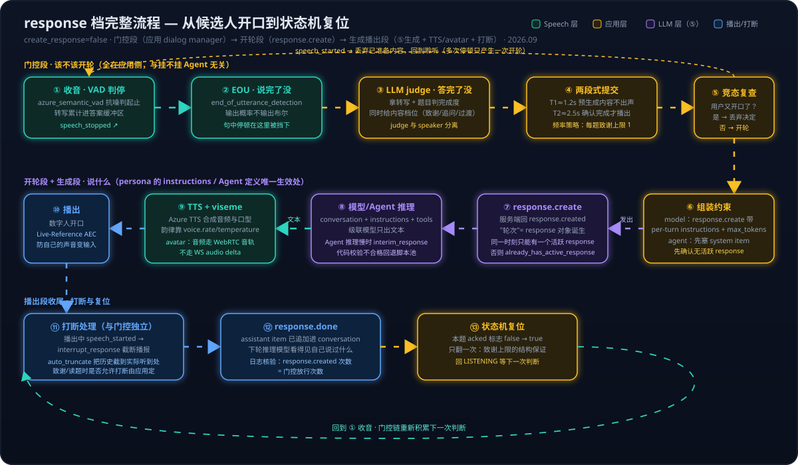

# Voice Live 系列 08：应答门控——判停与开轮之间的四个判断：EOU、LLM judge、两段式提交与频率策略

> [系列07](Voice%20Live系列07：重复致谢排查——三次Thank%20you的三个开轮来源、转写指纹与编排层修法.md) 案例的修法是把 ④ 开轮关死，代价是题间完全静默。很多产品要的是中间状态：偶尔回一句、不重复、不插话。"要么回太多、要么静默"这个二元是把决定权交给服务端的结果，服务端只有一个布尔值，它不懂"偶尔"。`create_response=false` 把决定权拿回应用之后，"回不回、回几次、说什么"就变成应用自己写的策略。这一层在 [系列01](Voice%20Live系列01：Agent实现架构——从级联流水线到Azure%20Voice%20Live%20API.md) 的级联流水线里叫 dialog manager，是 Voice Live 默认配置折叠掉的那一层，位置在 ③ 判停与 ④ 开轮之间。
> 文中 ③ ④ ⑤ 指 [系列06](Voice%20Live系列06：轮次控制的五道关卡——create_response、response.create与Model、Agent模式的控制权归属.md) 的五道关卡编号（判停、开轮、生成），"形态 N"指系列06 第五节的七种使用形态。

---

## 一、把一个判断拆成四个

"该不该 response"其实是四个不同的问题，信号不同、方法不同、所在层不同。混在一起就会退回布尔开关：

| 问题 | 信号 | 方法 | 所在层 | 时延量级 |
|---|---|---|---|---|
| 这句话说完了没 | 静音时长、转写文本的语言完整性、语调音高节奏 | end-of-turn 模型（见第二节） | Speech 层或紧贴其上 | 几十毫秒 |
| 这道题答完了没 | 题目 + 累计转写 + 评分要点 | 文本模型做完成度判断（见第三节） | 应用层 | 几百毫秒到一秒 |
| 要不要致谢 | 答题时长、距上次致谢的题数、是否章节边界 | 带跨轮状态的规则或打分（见第五节） | 应用层 | 零 |
| 说什么 | 转写内容、脚本池、校验规则 | 分档内容源 + 代码校验（见第五节） | 应用层，可选一次模型调用 | 零到几百毫秒 |

## 二、"说完了没"：end-of-turn 判断的三代方法

| 代 | 信号 | Voice Live 内的对应 | 业界对应 | 弱点 |
|---|---|---|---|---|
| 静音阈值 | 停多久算完 | `server_vad` 的 `silence_duration_ms`（默认 500） | 所有基础 VAD | 想词的停顿和说完无法区分，只能在"手快"和"迟钝"之间选 |
| 文本语义 | 转写文本在语言上完整了没 | `end_of_utterance_detection`，`model: semantic_detection_v1`（英语）或 `semantic_detection_v1_multilingual`（10 种语言），`threshold_level: low / medium / high`，`timeout_ms` 默认 1000 | LiveKit 2024 年的 text turn-detector（已弃用） | 依赖转写先出来，多一段转写延迟；听不到语调；"pizza." 和 "pizza, and…" 在停顿那一刻转写完全相同 |
| 音频原生 | 直接编码音频，语义 + 语调、音高、节奏 | **2026-06-01-preview** 新增 `model: smart_end_of_turn_detection`，直接作用于输入音频流，同样暴露 `threshold_level` 与 `timeout_ms` | LiveKit Turn Detector v1.0（2026-06，音频模型，eot-bench 上 300ms 预算下误截断率 9.9%）、Pipecat Smart Turn（开源音频模型） | 自建时要自己拿到音频流跑模型；Voice Live 内置版仍是 preview |

三个容易搞错的点：

- **`azure_semantic_vad` 不等于 EOU**。官方对 `azure_semantic_vad` 的定义是"用语义语音模型判断用户开始与停止说话，在噪音环境下更稳健"，它解决的是**起止检测在噪音下的鲁棒性**；"这句话在语言上完整了没"是另一个可选子对象 `end_of_utterance_detection`，要单独配。只开了 `azure_semantic_vad` 没配 EOU 块，停顿仍然按 `silence_duration_ms` 一刀切。系列07 案例里的 session 用的正是 `azure_semantic_vad`，EOU 有没有配是排查时要先看的一项。
- **文本语义 EOU 没有退役**。GA 版 API 2026-04-10 的 `server_vad`、`azure_semantic_vad`、`azure_semantic_vad_multilingual` 三种类型都带 `end_of_utterance_detection` 字段；preview 版是在它旁边**新增**了音频模型选项，不是替换。LiveKit 弃用的是它自家的文本模型，理由是文本有天花板：模型只能好到转写的程度、转写本身加延迟、转成文字丢掉了时序和声学信号。Azure 的演进路线一样，先文本后音频，只是两个都还在。
- **为什么 API 默认值不开 EOU**。Voice Live 的默认 `turn_detection` 是按音量的 `server_vad`，EOU 是 opt-in。文档没有解释，可推断的理由有三条：与 Azure OpenAI Realtime API 的默认行为保持一致，现有应用切到 Voice Live 时行为不变（"optional and additive"的承诺）；语言覆盖有限，不支持的语言会被忽略，做默认值对多数 locale 是错的；`timeout_ms` 意味着拿不准时最多再等一秒，车载指令这类短句场景宁要 500ms 静音判停。值得注意的是，Agent 模式的官方 quickstart 示例配置**开了** `azure_semantic_vad` + `semantic_detection_v1_multilingual`，即"推荐配置"和"API 默认值"并不一致。

**EOU 的配置方法**。它不是独立的 session 字段，而是嵌在 `turn_detection` 里的子对象，三种 VAD 类型都能挂。一份面向"应用节拍"的配置：

```json
{
  "type": "session.update",
  "session": {
    "turn_detection": {
      "type": "azure_semantic_vad_multilingual",
      "threshold": 0.5,
      "prefix_padding_ms": 420,
      "silence_duration_ms": 800,
      "remove_filler_words": true,
      "end_of_utterance_detection": {
        "model": "semantic_detection_v1_multilingual",
        "threshold_level": "medium",
        "timeout_ms": 1500
      },
      "create_response": false,
      "interrupt_response": true
    }
  }
}
```

工作方式：VAD 先按 `silence_duration_ms` 发现一段静音，此时不立刻发 `speech_stopped`，而是让 EOU 模型对到目前为止的转写打一个"这句话完整了"的概率；概率过了 `threshold_level` 对应的门限就立刻判停，没过就继续等用户接着说，最多等 `timeout_ms`，超时后无论如何判停。所以它加的延迟只出现在"句子看起来没说完"的停顿上，说完了的句子仍按静音时长判停，这就是文档说"显著减少过早判停且无用户可感知延迟"的机制。要分清的是：**EOU 只决定 ③ 何时触发，不决定 ④ 是否放行**。`speech_stopped` 一旦发出，`create_response=true` 就照常开轮；它挡得住句中停顿想词这类误判停，挡不住说完一个完整句子后停下想下一个要点（句子完整了，它不知道这道题有几个要点），也挡不住不经过 VAD 的客户端补发。空转写（噪音、回声）没有完整性可判，多半等到 `timeout_ms` 后照发，需实测。`threshold_level` 有 `low / medium / high / default` 四档，`default` 等于 `medium`；文档原话是"With a lower setting the probability the sentence is complete will be higher"，即 `low` 更容易判为说完（手快），`high` 更倾向多等（保守）。`model` 二选一：`semantic_detection_v1` 只支持英语，`semantic_detection_v1_multilingual` 支持英、西、法、意、德、日、葡、中、韩、印地十种语言，其他语言被忽略，等于没配。

三个使用细节：

- **字段名随 API 版本变过**。早期 preview（如 2025-05-01-preview）的示例写法是 `"threshold": 0.01, "timeout": 2`（浮点阈值、秒），GA 版 2026-04-10 的定义是 `threshold_level`（字符串档位）与 `timeout_ms`（毫秒）。网上样例两种写法都有，按自己连接的 `api-version` 对照 API Reference 页确认，配错字段服务端可能静默忽略。
- **Agent 模式同样可配**。`turn_detection` 整块归客户端，既可以在 `session.update` 里发，也可以预置在 Agent metadata 的 `microsoft.voice-live.configuration` 里，官方 Agent quickstart 的示例就带着 `end_of_utterance_detection`。
- **怎么确认生效**。`session.updated` 事件会回显整个 `turn_detection` 块，先看 EOU 子对象有没有原样回来；再用日志对比开关前后两个数字：`speech_stopped` 到下一次 `speech_started` 间隔小于 3 秒的比例（误判完成率）应当下降，最后一次 `speech_stopped` 的到达时间相对静音起点应当只在"没说完的句子"上变晚。preview 版把 `model` 换成 `smart_end_of_turn_detection` 即切到音频原生模型，其余两个字段不变。

不管用哪一代，**输出应当是一个概率而不是布尔值**，阈值由应用定，这样才能做第四节的两段式提交。

## 三、EOU 小模型与 LLM judge 的分工

一个直觉是"用大模型判断语义是否结束、是否该追问"。这个直觉对了一半：大模型该判，但判的不是 EOU 那个问题。两者是叠放关系，不是替代关系：

| | EOU 模型（`semantic_detection_v1` 等） | LLM judge |
|---|---|---|
| 回答的问题 | 这句话在语言上完整了没 | 这道题答完了没、覆盖了几个要点、是否跑题、要不要追问 |
| 输入 | 流式转写（音频版直接读音频） | 题目 + 评分要点 + 累计转写 + 面试上下文 |
| 输出 | 一个概率，按 `threshold_level` 判 | 结构化判断（JSON：complete / partial / off-topic + 理由） |
| 时延 | 几十毫秒，文档称"无用户可感知延迟" | 几百毫秒到一秒，每次调用计费 |
| 知道任务吗 | 不知道，只看语言 | 知道 |
| 所在层 | Speech 层，配在 `turn_detection` 里 | 应用层 |

拿 LLM 去做 EOU 是错位的：每次停顿都要等一次几百毫秒的往返，而且它也读不到语调，"pizza." 的问题它同样答不了。拿 EOU 去做任务判断是不可能的：它不知道题目是什么。正确的叠法是 EOU 负责把 `speech_stopped` 的触发信号洗干净，少一些误触发；judge 拿洗干净之后的转写决定接下来干什么。

还有一个更根本的区别：**judge 与 speaker 分离**。`create_response=true` 时，判断"该不该追问"和"说出追问"发生在同一个 response 里，模型的判断没有人能否决，这就是系列07 案例里提示词失效的结构原因。把 judge 拆成独立的一次调用（模型模式可用系列06 形态 5 的旁路生成，任何模式都可用外部文本模型），输出结构化结果给应用，应用再决定开不开轮、开轮说什么。追问从模型的自由行为变成应用在 off-topic 状态下显式触发的一次 `response.create`，每题上限由状态保证。这是 [生成评估分离](../../wiki/concepts/generation-evaluation-separation.md)在语音轮次上的具体形态。

## 四、两段式提交与应答门控状态机

上面两层判断都要时间，直接串在链路上会让反应变慢。做法是两个阈值：

- **T1 试探完成**（约 1.2 秒静音，或 EOU 概率过阈值）：开始准备内容，比如跑完成度判断、预生成致谢文本、预取下一题，但不出声。
- **T2 确认完成**（约 2.5 秒，或用户按了"答完了"，或完成度判为已覆盖）：播出。
- T1 到 T2 之间用户再开口：丢弃准备好的内容，回到聆听。

候选人感知到的延迟是 T2 减去准备耗时，准备已经在 T1 做完了，体感几乎为零。阈值可以按说话人自适应：前一两分钟统计候选人句内停顿的分布，把 T1 放在 95 分位。


状态机的几个要点：多次停顿在 PENDING 与 LISTENING 之间来回，最后只产生一次 COMPLETE；每道题的 `acked` 标志只能从 false 翻到 true 一次，致谢上限是结构保证的，不是提示词承诺的；中途停顿时什么都不说，真人面试官在候选人想词时是点头不是开口，如果一定要给信号，只在静默超过很长的阈值（如 8 秒）时说一句 "Take your time"，同样每题最多一次；线性轮次是这个状态机的退化情形，"致谢"步骤永远跳过，所以从线性轮次演进到"偶尔致谢"不需要推翻架构。

## 五、频率策略与内容分档

频率策略不需要模型，需要的是跨轮次的状态，所以只能在应用层。这些规则一行都写不进提示词，因为它们依赖上一题说了什么、本题答了多久，而提示词只在单个 response 内生效：

- 每道题致谢上限 1，由状态机保证。
- 答题不足 3 秒不致谢，大概率是噪音或误触。
- 上一次致谢距今不到两题不致谢，或按概率 0.5 致谢，避免机械感。
- 章节切换处固定致谢并说过渡语，普通题之间不致谢。
- 相邻两次不用同一句话。

可以写成一个简单打分：答题时长、距上次致谢的题数、是否章节边界各给权重，超过阈值才致谢。

内容分三档，档位越高内容感越强、风险越大：

| 档 | 做法 | 效果 | Agent 模式可用 |
|---|---|---|---|
| 脚本池 | 8 到 10 句中性过渡语，随机取、不与上一句重复，逐字朗读 | 零成本、零风险，与答案内容无关 | ✅ |
| 模板加槽位 | 从转写里抽一个主题名词填进 "Thanks for walking me through {X}" | 用一次便宜的抽取调用换来"听进去了"的感觉，风险可控 | ✅ |
| 受约束生成 | 文本模型基于转写生成一句，代码校验（无问号、无评价词表中的词如 great / excellent / impressive、长度上限、语言一致），不合格回退第一档 | 有内容感、有变化，且输出可拦截 | ✅（模型模式还可用 `response.create` 的 per-turn `instructions` 直接约束，但那一档模型说什么就播什么，没有否决权） |

面试场景建议停在第二档。带评价色彩的回应会被候选人读成信号，也让不同候选人的体验不一致，结构化面试刻意保持中立不是妥协而是优点。

## 六、串起来：从开口到复位的完整流程

前五节把各个判断拆开讲了，这一节按时序把它们串成一条链。整条链分三段：**门控段**（该不该开轮，全在应用侧，与挂不挂 Agent 无关）、**开轮加生成段**（说什么，persona 的 instructions 或 Agent 定义唯一生效的位置）、**播出段**（打断与复位）。



**门控段（①~⑤，应用的 dialog manager）**：

1. **收音与 VAD 判停**（Speech 层）：`azure_semantic_vad` 抗噪判起止，转写持续累计进答案缓冲区，静音触发 `speech_stopped`。
2. **EOU 判"说完了没"**（Speech 层）：`end_of_utterance_detection` 输出句子完整性的概率，句中停顿在这里被挡下。输出是概率不是布尔，阈值留给应用。
3. **LLM judge 判"答完了没、要不要回"**（应用层）：拿转写和题目判完成度，同时给出内容档位——致谢、追问还是过渡语。judge 与 speaker 分离，追问才是显式可控的。
4. **两段式提交**（应用层）：T1（约 1.2s 或 EOU 过阈值）开始预生成内容但不出声，T2（约 2.5s 或完成度判定通过）确认播出；T1 到 T2 之间用户再开口就丢弃。频率策略在这里生效：每题致谢上限 1、答题不足 3 秒不致谢等。
5. **竞态复查**（应用层）：judge 是异步的，放行的瞬间用户可能已经又开口。发 `response.create` 前再查一次是否处于 `speech_started` 之后的收音态，是则丢弃这次开轮决定，让门控链重新走。这一步实现时最容易漏。

**开轮加生成段（⑥~⑨）**：

6. **组装约束**（应用层）：模型模式直接在 `response.create` 上带 per-turn `instructions`（"只说一句简短致谢，不要追问"）和 `max_response_output_tokens`；Agent 模式 per-turn instructions 被拒，先 `conversation.item.create` 塞一条 system item 再发裸的 `response.create`，约束力弱一档。发之前确认没有活跃 response，上一轮没播完要先 `response.cancel`。
7. **`response.create` 开轮**（编排层）：服务端回 `response.created`，"轮次"即 response 对象在这一刻诞生。同一时刻只能有一个活跃 response。
8. **模型或 Agent 推理**（LLM 层）：拿当前 conversation 加 instructions 加 tools 跑一次推理。这是全链路里 persona 定义唯一生效的位置。Agent 推理慢时服务端会推 `interim_response` 填充语。受约束生成档在这里配代码校验，不合格回退脚本池。
9. **TTS 与 viseme**（Speech 层）：级联模型只出文本，Azure TTS 合成音频与口型；韵律归 `voice.rate` / `voice.temperature`，提示词管不到。avatar 场景下音频走 WebRTC 音轨，不走 WebSocket audio delta。

**播出段（⑩~⑬）**：

10. **播出**：数字人开口。自己的声音可能绕回麦克风，数字人场景要配 Live-Reference AEC（见 [系列07](Voice%20Live系列07：重复致谢排查——三次Thank%20you的三个开轮来源、转写指纹与编排层修法.md) 第四节）。
11. **打断处理**（编排层，与门控独立）：播出中用户开口触发 `speech_started`，`interrupt_response` 截断播报，`auto_truncate` 把对话历史截到用户实际听到的位置。致谢或读题时要不要允许打断，是应用要显式决定的事。
12. **`response.done`**：assistant item 已追加进 conversation，下一轮推理模型看得见自己刚说过什么。日志核验点在这里：`response.created` 次数应严格等于门控放行次数。
13. **状态机复位**（应用层）：本题 `acked` 标志从 false 翻到 true，只能翻一次——致谢上限是结构保证的。回到 LISTENING，门控链重新积累下一次判断。

三段的归属正好对应 [系列06](Voice%20Live系列06：轮次控制的五道关卡——create_response、response.create与Model、Agent模式的控制权归属.md) 的矩阵第二行：①~⑤ 决定时机与频率，是应用补回的 dialog manager；⑧ 决定内容，才轮到 model 与 agent 二选一。把两段混起来（比如指望提示词管频率、或指望门控链影响语气）就会回到"要么回太多、要么静默"的原点。

## 七、评估指标与演进顺序

已有的事件日志就够做离线评估，不用再埋点：

- **误判完成率**：COMPLETE 之后 3 秒内又出现 `speech_started` 的比例，度量"手快"。
- **完成延迟**：最后一次 `speech_stopped` 到播出的时间，度量"迟钝"。
- **致谢重复率**：相邻两次致谢文本相同的比例。

把一批真实会话的事件流回放到不同阈值与模型组合上，前两个指标画成曲线选拐点。这和 LiveKit 开源的 eot-bench 思路一样，只是数据换成自己的。

演进顺序：

1. 规则起步：`create_response=false`，两段式提交，每题致谢上限 1，脚本池。这一步已经消灭重复致谢和大部分误插话。
2. 误判完成率仍高：开 `azure_semantic_vad` 并配 `end_of_utterance_detection`，拉长 `silence_duration_ms` 到 1200 到 1500，开 `remove_filler_words`。
3. 需要区分"说完"和"答完"：加 LLM judge 做完成度判断，追问变成显式触发。
4. 前三步都做了仍嫌手快：试 preview 的 `smart_end_of_turn_detection`，或自跑 LiveKit / Pipecat 的音频模型。后者要接管音频流，工程量最大，放最后。

## 八、小结

1. **"要么回太多、要么静默"之间有中间地带**，前提是 `create_response=false` 把决定权拿回应用，在 ③ 判停与 ④ 开轮之间补回 dialog manager 这一层。
2. **"该不该 response"是四个判断**：说完了没（EOU 模型，Speech 层，几十毫秒）、答完了没（LLM judge，应用层，知道任务）、要不要致谢（跨轮状态规则）、说什么（分档内容源 + 代码校验）。混在一起就退回布尔开关。
3. **EOU 与 LLM judge 是叠放不是替代**：EOU 只决定 ③ 何时触发，挡得住句中停顿、挡不住完整句子后的想词；judge 决定接下来干什么。judge 与 speaker 分离是追问可控的结构前提。
4. **`azure_semantic_vad` 不等于 EOU**：前者管噪音下的起止鲁棒性，句子完整性要另配 `end_of_utterance_detection`（`model` / `threshold_level` / `timeout_ms`，字段名随 API 版本变过）。文本 EOU 在 GA 版仍在，2026-06-01-preview 新增音频原生 `smart_end_of_turn_detection`。
5. **两段式提交**把判断延迟藏进候选人自己的停顿里；每题致谢上限由状态机保证；面试场景内容分档建议停在模板加槽位。
6. **完整链路十三步分三段**：门控段（VAD → EOU → LLM judge → 两段式提交 → 竞态复查）决定时机与频率，全在应用侧；开轮生成段（组装约束 → `response.create` → 推理 → TTS/viseme）里只有推理一步是 persona 定义生效处；播出段（播放 → 打断 → `response.done` → acked 翻真复位）收尾。竞态复查（judge 放行瞬间用户又开口则丢弃）是实现时最容易漏的一步。
7. **用已有事件日志离线评估**：误判完成率、完成延迟、致谢重复率；演进顺序是规则 → EOU → LLM judge → 音频原生模型。

## 参考

- [How to use the Voice Live API — Microsoft Learn](https://learn.microsoft.com/en-us/azure/ai-services/speech-service/voice-live-how-to)（turn_detection 全部字段与默认值；azure_semantic_vad 与 semantic_vad 的适用模型；remove_filler_words 的行为）
- [Quickstart: Voice Agent with Foundry Agent Service — Microsoft Learn](https://learn.microsoft.com/en-us/azure/ai-services/speech-service/voice-live-agents-quickstart)（官方示例配置开启 azure_semantic_vad + semantic_detection_v1_multilingual，即"推荐配置"与"API 默认值"不一致的证据）
- [Voice Live API Reference 2026-04-10 — Microsoft Learn](https://learn.microsoft.com/en-us/azure/ai-services/speech-service/voice-live-api-reference-2026-04-10)（GA 版三种 VAD 类型均带 `end_of_utterance_detection`；`RealtimeEOUDetection` 的 `model` / `threshold_level` / `timeout_ms` 定义与"允许自然停顿、显著减少过早判停且无用户可感知延迟"的描述；`azure_semantic_vad` 的定义为噪音下更稳健的起止检测）
- [Voice Live API Reference 2026-06-01-preview — Microsoft Learn](https://learn.microsoft.com/azure/ai-services/speech-service/voice-live-api-reference-2026-06-01-preview)（新增音频原生 `smart_end_of_turn_detection`、Live-Reference AEC 的 `reference_source` / `channels`、`parallel_tool_calls`）
- [Solving end-of-turn detection: LiveKit Turn Detector v1.0 — LiveKit Blog](https://livekit.com/blog/solving-end-of-turn-detection)（文本模型的三条天花板与 "pizza" 例子；音频模型双分支架构；eot-bench 上 300ms 预算 9.9% 误截断率）
- [livekit/turn-detector — Hugging Face](https://huggingface.co/livekit/turn-detector)（早期开源文本 EOU 模型的模型卡，已被音频版取代）
- [pipecat-ai/smart-turn — GitHub](https://github.com/pipecat-ai/smart-turn)（开源音频原生 turn detection 模型）
- [Azure OpenAI Realtime API events reference — Microsoft Learn](https://learn.microsoft.com/en-us/azure/ai-foundry/openai/realtime-audio-reference)（response.create 的 instructions / conversation / input 等字段；conversation.item.* 与 input_audio_buffer.* 事件语义）
- 系列前篇：[Voice Live系列06：轮次控制的五道关卡——create_response、response.create与Model、Agent模式的控制权归属](Voice%20Live系列06：轮次控制的五道关卡——create_response、response.create与Model、Agent模式的控制权归属.md)（五关框架、七种形态）、[Voice Live系列07：重复致谢排查——三次Thank you的三个开轮来源、转写指纹与编排层修法](Voice%20Live系列07：重复致谢排查——三次Thank%20you的三个开轮来源、转写指纹与编排层修法.md)（本文要解决的题间静默来自其修法）；更早各篇见系列06 参考
- 相关 wiki：[turn-taking 概念页](../../wiki/concepts/turn-taking.md)（轮次交接的通用机制）、[generation-evaluation-separation 概念页](../../wiki/concepts/generation-evaluation-separation.md)（judge 与 speaker 分离的理论基础）
