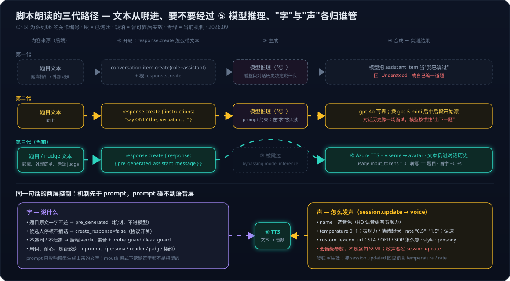

# Voice Live 系列 09：脚本朗读的机制化——pre_generated 绕过模型推理、宿主模型与代码、prompt、voice 三层分工

> [系列06](Voice%20Live系列06：轮次控制的五道关卡——create_response、response.create与Model、Agent模式的控制权归属.md) 第七节有一个结论："传声筒也绕不开模型——Voice Live 没有'说这句话'的事件，文本进 TTS 的唯一入口是 response，response 的唯一入口是模型。"这个结论对了前半句、错了后半句。response 确实是唯一入口，但 `response.create` 可以带一个 `pre_generated_assistant_message`，服务端对给定文本直接合成音频，⑤ 生成这一关被整个跳过。让这件事暴露出来的是题库驱动场景里迟早会出现的现象：读题文本经模型复述后被改写，甚至被替换成模型自己编的一道题。
> 本文的主张可以压成一句：让数字人"照稿朗读"，把智能留给后端。分三部分：怎么让 Voice Live 直接 TTS 而不让模型"回复"；直接 TTS 之后不走 LLM 了，为什么建连还必须配模型；既要精确读题又要保留一部分 LLM 生成（后端 judge、编辑器 Playground），代码和 prompt 怎么分工。顺带纠正一个常见混淆：prompt 管的"语气"只是文字，语速、表现力、发音是语音层，走 `session.voice`，不是 SSML。文中 ①~⑥ 沿用系列06 的关卡编号（听、判起、判停、开轮、生成、合成）。[系列07](Voice%20Live系列07：重复致谢排查——三次Thank%20you的三个开轮来源、转写指纹与编排层修法.md) 的线性轮次修法把开轮次数管住了，本文管的是开轮之后"说出来的字是不是给定的字"；[系列08](Voice%20Live系列08：应答门控——判停与开轮之间的四个判断：EOU、LLM%20judge、两段式提交与频率策略.md) 十三步流程里的第 ⑥ 步（组装约束）与第 ⑨ 步（TTS 与 viseme）在本文展开。

---

## 一、问题：读题这一步为什么会"想"

先说机制。题库驱动的语音面试里，读题的常见做法是：后端定好题目文本，前端发一个 `response.create`，在 `response.instructions` 里写阅读契约加一句 "say ONLY this, verbatim: <题目>"。这种读法在 gpt-4o 上可以长期稳定；换到 gpt-5-mini 这类模型后，进行到面试中后段就会出现题目被改写成另一种问法、甚至模型自己编出一道题库里不存在的题目的情况。因区域原生模型限制而切换模型时，读法若不重验，这个现象会直接出现在真实会话里。

根因有两个，缺一个都不会发生：

1. **读题仍然是一次模型推理**。每一个 `response.create` 都是一次"想"（系列06 2.1 节：response 的定义就是调用模型跑一次推理）。模型看到的不是"一句要读的稿"，而是整段对话历史：前面六道题、六段候选人的回答、六次"请照读"的指令。到中后段，这段历史像一场进行中的面试，模型按惯性做了面试官该做的事——出下一题。"verbatim" 是 prompt 约束，它在**求**模型照读，gpt-4o 听劝，gpt-5-mini 不一定。
2. **送达确认看不见偏差**。当时的送达确认只按 response id 比对，代码注释里写着 "immune to paraphrasing"——这句话本意是防转写噪音，效果却是改写和编造都无声无息地过了。

前一个根因是本文第一部分要换掉的机制，后一个是第 1.4 节要补的验证。

## 二、先搞清 Voice Live 里"一句话是怎么被说出来的"

一个 Voice Live 会话就是一条 WebSocket，上面同时跑着五件事。对照系列06 的六道关卡：

| 环节           | 对应关卡  | 谁在做                                                  | 应用能控制的开关                            |
| ------------ | ----- | ---------------------------------------------------- | ----------------------------------- |
| 听（VAD + STT） | ① ② ③ | Azure `turn_detection` + `input_audio_transcription` | VAD 类型、`create_response`、EOU 检测     |
| 想（决定说什么）     | ④ ⑤   | 会话绑定的**模型**（`?model=` 或 Foundry agent）               | `response.create` 发不发、带什么           |
| 说（TTS）       | ⑥     | Azure 语音（`voice`）                                    | 文本从哪来、怎么发声                          |
| 脸（avatar）    | ⑥ 之后  | Azure avatar 管线（WebRTC 视频）                           | `avatar` 配置                         |
| 记（对话历史）      | 贯穿    | 会话里的 conversation items                              | `conversation.item.create / delete` |

关键认识只有一句：**每一次 `response.create` 默认都是一次"想"**。`create_response=true` 时候选人一停顿 Azure 就自动替你发一次；即便关掉自动回复，你手动发的 `response.create` 仍然是一次模型推理。题库驱动的面试里，问哪题由后端定，数字人只是嘴，"想"这一步在读题环节是多余的，也正是它出的错。两个名字的正面对照见[系列06](Voice%20Live系列06：轮次控制的五道关卡——create_response、response.create与Model、Agent模式的控制权归属.md) 2.1 节：`create_response` 是 `turn_detection` 里的自动触发开关，`response.create` 是客户端事件即动作本身；本文管的是这个动作里"带什么"。

## 三、怎么直接 TTS，不让模型"回复"

### 3.1 读题的三代路径



| 版本 | 读题方式 | 约束类型 | 结果 |
|---|---|---|---|
| 第一代 | `conversation.item.create(role=assistant, text=题目)` + 裸 `response.create` | prompt（隐式） | gpt-4o 把 assistant item 当"我已经说过了"，回一句 "Understood." 或**自己编一道题** |
| 第二代 | `response.create { response: { instructions: 阅读契约 + "say ONLY this, verbatim: 题目" } }` | prompt（显式） | gpt-4o 上可靠；换 gpt-5-mini 后进行到中后段，对话历史像一场面试，模型按惯性"出下一题" |
| **第三代（当前）** | `response.create { response: { pre_generated_assistant_message: {...} } }` | **机制** | 服务端直接 TTS 给定文本，**不经过模型**，不可能改写 |

前两代都在求模型照读，第三代文本根本不进模型。这就是 [架构约束优先于 Agent 学习](../../wiki/decisions/architecture-constraint-over-agent-learning.md) 在读题这一步上的形态：把"不许改写"从对模型的要求变成协议上做不到的事。

### 3.2 `pre_generated_assistant_message` 的用法与文档依据

```json
{
  "type": "response.create",
  "response": {
    "pre_generated_assistant_message": {
      "type": "message",
      "role": "assistant",
      "content": [{ "type": "text", "text": "Please walk me through a project you led from start to finish." }]
    }
  }
}
```

API 参考对该字段的定义："A pre-generated assistant message to use for generating the audio response instead of having the model generate the text. When provided, the server generates an audio response for the predefined text, **bypassing model inference for text generation**. The message is added to the conversation context history." 约束是 `role` 必须为 `assistant`，`content` 只能有一个 text 部分。三个 API 版本都有这个字段：`2026-01-01-preview`、GA 版 `2026-04-10`、以及 `2026-06-01-preview`。

### 3.3 实测要点（photo avatar + gpt-5-mini）

- **事件流和普通 response 一样**：`response.created → response.audio_transcript.delta / done → response.audio.delta（avatar 模式下音频走 WebRTC，WS 上没有）→ response.done`。所以现有的 "Interviewer 气泡"和"按 response id 确认送达"逻辑一行没改。response 对象仍然存在，只是 ⑤ 这一关空转。
- **`response.done.usage` 里 `input_tokens: 0`**，只有输出音频 token（TTS 本身）。候选人说话的音频仍计 input audio token。也就是读题环节的模型输入成本归零；会话与音频计费照常，以定价页为准。
- **首字延迟**：读题请求发出到 `response.created` 约 0.26~0.35s（WS 协议层延迟探针实测）。[系列03](Voice%20Live系列03：数字人出场延迟优化——ICE门控根因、实测分解与预热占位策略.md) 第六节测到的"读题 → 首块音频 0.63s"含一次模型推理，两个数字口径不同（一个到 `response.created`、一个到首块音频），不能直接相减，但省掉的推理开销方向是确定的。
- 与 `role: user` 的 item 不同，它**不会**触发模型回答；与 `role: assistant` 的 item 加裸 `response.create` 不同，它**不会**被模型"接话"。
- 文本进入对话历史，所以后面若有真正的模型回合，模型知道数字人已经说过这句。这一点对第五部分的 Playground 和分阶段混合形态很重要。
- **它算不算一个 turn**：按系列06 的三种"轮"分开看。作**生成轮次（response）**，算：仍是一次 `response.create`，事件流照常，同一时刻只能有一个活跃 response 的约束照常，系列07 "`response.created` 次数等于读题次数"的验证标准对它同样成立，只是 ⑤ 空转、`input_tokens` 为 0。作**对话历史里的 assistant 轮**，算：它以一条 `role: assistant` 的 message item 落进 conversation，与模型自己生成的回答没有区别。作**语音轮（`turn_detection` 里的 turn）**，不算：那个 turn 指用户这一段话的起止。
- **中途把整段内容交给模型时，历史是否完整**：主线是完整的。conversation 里有应用塞的 system item、每次 `pre_generated` 读出的题目与 nudge（assistant item）、候选人每段回答的转写（user item），"数字人说过什么、候选人答了什么"齐全。不在历史里的有四类：每次 `response.create` 上带的 per-turn `instructions`（只在那一个 response 内生效，见[系列06](Voice%20Live系列06：轮次控制的五道关卡——create_response、response.create与Model、Agent模式的控制权归属.md) 第三节的对照表）；后端 judge 的判断过程（只有被说出来的 nudge 进了历史）；被打断截掉的部分（`auto_truncate` 把 assistant item 截到用户实际听到的位置，`pre_generated` 被打断时同样如此）；重连之前的一切（新会话历史清零，要延续得应用用 `conversation.item.create` 回放）。还有一个实际风险：历史完整正是第二代读法漂掉的原因——到中后段这段历史看起来就是一场进行中的面试，模型一旦拿到自由轮次，第一反应很可能是出下一题或致谢。切回自由轮次时要在 `response.create` 上带明确的 per-turn `instructions`（模型模式）或先塞一条 system item 说明"接下来是自由问答，不要再出题"（两种模式都可），不要指望它从历史里自己读懂阶段切换。

### 3.4 光有 TTS 读法还不够：把其它"会说话的口子"也堵上

数字人能开口的路径不止一条，每一条都要用**协议级**开关控制，而不是靠 prompt：

| 口子 | 关法 | 落在哪一层 |
|---|---|---|
| 候选人停顿后 Azure 自动回复 | `turn_detection.create_response: false` | 后端会话构建器 |
| 前端"我答完了"后的裸 `response.create` | linear 模式下不发 | 前端协议层的提交逻辑 |
| Foundry agent 自己的指令（"候选人答完要致谢"） | linear / judged 会话**不挂 agent**，走 MODEL 模式 | 后端按 persona 类型选建连模式 |
| 读题本身 | `pre_generated_assistant_message` | 前端协议层的读题发送 |

前两条就是系列07 的线性轮次修法。第三条值得展开：Agent 模式下 Azure **拒绝** `response.create` 里覆盖 `instructions`（live 报错 "Overriding instructions in response.create is not supported"），而 agent 自己的指令会赢过任何 assistant item——实测中曾有一次读题被 agent 变成了一句 "Thank you."。这正是系列06 7.2 节说的"第三行下 Agent 模式是负资产"的现场版。所以凡是"嘴"型会话（external、linear、judged）一律 MODEL 模式建连，agent 只留给编辑器 Playground。`pre_generated_assistant_message` 在 Agent 模式下是否同样生效未做实测，因为嘴型会话已经不挂 agent。

### 3.5 读法可靠了，还要"知道它读对了没有"

之前的送达确认只按 response id，这恰恰让改写和编造无声无息。现在两层：

- **运行时**：读题 response 的 `audio_transcript.done` 到达时，把转写与题目做归一化比对（忽略大小写、标点、空白），不一致就打一条"读题偏离"告警。TTS 读法下这永远不该触发，触发即回归。
- **测试时**：live 测试抓页面发出的每个 `response.create`，断言 `pre_generated_assistant_message.content[0].text === 卡片题目`，且 Azure 转写等于卡片题目。

系列07 的验证标准是 "`response.created` 次数等于读题次数"，管的是次数；这里加的是内容。两条合起来才是"读了几次、每次读的是不是那句话"。

## 四、不走 LLM 了，为什么建连还必须配模型？能不配吗？

### 4.1 为什么必须配

Voice Live 的会话身份就是"一个模型 + 一组语音能力"。建连 URL 必须带 `model=<区域原生模型>` 或 `agent_name=…`，没有"纯 TTS 会话"这种类型。VAD、STT、TTS、avatar 都是**挂在这个模型会话上**的配套能力，而不是独立服务。所以即使应用一次 `response.create` 都不让模型"想"，会话也要有个模型坐在那里——它是会话的**宿主**，不是应用在用的功能。

顺带一提，`model=` 只接受该区域原生的 Voice Live 模型（swedencentral 上是 gpt-5-mini / gpt-4o / gpt-4.1-mini 等），自己部署的 deployment 名不算。系列03 提过"region 可用性才是真分水岭"，这是它在模型字段上的另一面。

> 2026-10-05 补：这句只对原生路径成立。自己部署的 deployment 名配上 `profile=byom-…` 就能接（BYOM 路径不查 region 预部署清单），三条接入路径与实测见[系列 14](Voice%20Live系列14：模型接入的三条路径——原生清单按region开通、BYOM用profile选协议定直通或级联、推理模型与语音会话模型为何要拆开.md)。

### 4.2 那这个模型现在还干什么

在 linear / judged / external 会话里，它**一句话都不生成**。剩下三件事：

1. **当宿主**：承载 VAD / STT / TTS / avatar。
2. **当保险丝**：应用仍把 reader prompt（阅读契约）作为 system item 注入。万一哪条代码路径误发了一个裸 `response.create`，它会按"只读稿、不追问"行事，而不是自由发挥。保险丝不是主控制，主控制是第 3.4 节那四个开关。
3. **真正用到它的只剩编辑器 Playground**（agent 模式，自由对话测 instructions）。

对照系列06 的控制权矩阵："应用开轮 + 应用给现成文本"这一行里会话内模型的价值是零，这一点没变。变的是"零价值但拆不掉"的原因：不是"文本必须经它复述"，而是"会话必须有个宿主"。

### 4.3 想彻底不配模型？可以，但换产品

如果场景连保险丝都不要、也不用 Voice Live 的 VAD / STT，Azure **Speech 服务的实时 TTS avatar**（Speech SDK 的 avatar synthesis，WebRTC 出音视频）是纯 TTS 加数字人，不涉及任何 LLM。代价是：

- 听（STT + VAD）要自己另接 Speech 的识别服务，轮次管理自己写——这就回到了[系列01](Voice%20Live系列01：Agent实现架构——从级联流水线到Azure%20Voice%20Live%20API.md) 的级联流水线，dialog manager、句子缓冲、打断都要自己拼；
- 一条连接变多条，延迟与状态同步都要自己处理；
- 已经踩平的 Voice Live 坑（首读被 avatar 握手切掉、cancel-then-speak、重连状态）要在新管线上重来一遍。

对"题库驱动 + 需要听候选人 + 偶尔要 judge 出声"的场景，留在 Voice Live、把模型当宿主是更省的选择：读题走 TTS，模型输入成本归零，架构不变。系列06 7.3 节最后那句"省掉模型这 0.6s 不值这个改动"的账现在不用算了——推理开销已经被 `pre_generated` 省掉，而且不用换产品。

## 五、既要"精确读题"，又要"保留部分 LLM 生成"：代码和 prompt 怎么分工

### 5.1 原则：能用机制的绝不用 prompt；prompt 只管字

| 要保证的事 | 用什么保证 | 为什么不用 prompt |
|---|---|---|
| 题目原文一字不差 | `pre_generated_assistant_message` | 实测 prompt "verbatim" 在 gpt-5-mini 上会漂 |
| 候选人停顿时数字人不插话 | `create_response=false` | 单个布尔，比"请勿打断"可靠 |
| 不追问、不纠偏 | 后端 judge 的 verdict 集合就是 `(wait, nudge)`；`follow_up` / `redirect` 直接不认 | 模型再"想"追问也发不出来 |
| nudge 不是变相提问 | 服务端疑问句守卫：含 `?` / `？` 或疑问词开头就静音 | prompt 里"不要问问题"是软约束 |
| 不泄露评分要点 | judge 的 prompt **不放 rubric**；再加泄露守卫兜底 | 模型看不见的东西无从泄露 |
| 什么时候该说 | 后端状态机 + 页面时序（停顿计时、提交） | 时序不该交给模型判断（系列08 的门控段） |
| **说什么字**（用词、耐心、是否致谢） | prompt——persona 的 prompt 片段 / reader prompt / judge 契约 | 这才是 prompt 擅长的；**只影响模型生成的文本** |
| **怎么发声**（语速、表现力 / 情绪、发音） | `session.voice`：`name`、`temperature`、`rate`、`style`、`custom_lexicon_url`（第六节） | prompt 碰不到语音层；这是会话参数，不是 SSML |

### 5.2 现在的三种"嘴"

```text
                      决定说什么                 怎么说出来
linear bank    ───►  后端题库指针          ───►  pre_generated TTS
judged bank    ───►  题库指针 + 后端 judge  ───►  pre_generated TTS（题目和 nudge 都是）
external       ───►  外部 workflow 平台      ───►  pre_generated TTS
Playground     ───►  Voice Live 里的 agent  ───►  模型自己的 response（这里才让它"想"）
```

judged 模式是"保留部分 LLM"的典型。LLM 在**后端**（gpt-5-mini 的 chat 调用，reasoning 关闭），拿到的是候选人的草稿转写，只回答一个问题："这句话是不是说完了"。它产出的 nudge 文本再作为普通文本走 `pre_generated` TTS。**Voice Live 里的模型仍然一句不生成**。这样 LLM 的自由度被限制在一个可以单元测试、可以 eval、可以加守卫的 JSON 输出里，而不是直接对着候选人开口。这是系列08 第三节 "judge 与 speaker 分离"的落地版，也是 [生成评估分离](../../wiki/concepts/generation-evaluation-separation.md) 的具体形态：judge 只出结构化判断，speaker 是不会走样的 TTS。

系列08 第五节的内容三档在这里对应得很直接：nudge 走的是"受约束生成"档，但生成发生在后端、经过代码校验、再以 `pre_generated` 播出，于是那一档原本"模型说什么就播什么，没有否决权"的短板消失了——否决权在校验代码手里。

### 5.3 judge 的 prompt 怎么写才和代码配合

- **有序检查再给结论**。reasoning 关闭的小模型直接问"要不要说话"会把停顿当作"还在说"。让它先引用"最后几个词"，再判"是否说完"，最后才给 `verdict`——顺序本身就是约束。
- **允许的 verdict 由代码给**：prompt 里写 "Allowed verdicts right now: wait, nudge."，parse 时不在集合内的一律 `wait` 并发 error 事件。prompt 和代码引用的是同一份 verdict 集合。
- **不给它不需要的信息**：nudge 不需要 rubric，就不放。少一段上下文等于少一种泄露、少一份 token。
- **输出形状再过一遍代码**：长度上限、泄露守卫、疑问句守卫，任何一条不过就静音。原则是"宁可不说，不可说错"。
- **persona 的 prompt 放在前面、契约放在最后并声明覆盖**（"it overrides anything above"）——管理员可以改语气，改不动规则。

### 5.4 前端协议层要防的几个坑（都踩过）

1. **cancel-then-speak**：`create_response=true` 时 Azure 自动回复常在飞行中，直接发读题会撞 `conversation_already_has_active_response`。现在 linear 下没有自动回复，但机制保留：有活动 response 就先 `response.cancel`，等 `response.done` 再读。
2. **phantom active response**：发 `response.create` 前乐观地把"有活跃 response"标记置真，如果 Azure 拒绝（非撞车错误）、看门狗放弃、或 WS 掉线，这个标记要**主动清掉**，否则后面每题都"取消并排队"等一个永远不来的 `response.done`——整场静音。
3. **首读被 avatar 握手切掉**：avatar 的音频走 WebRTC，视频帧没画出来前读题开头会被吃掉。首读要等 avatar 就绪（有上限），重连后同样要重新 gate。系列03 的出场链路优化与这条是同一处。
4. **重连要重置轮次状态**：不只是 avatar 的守卫，还有读题看门狗、未确认的读题（stash 后在新会话重读）、judge 与自动提交计时器、麦克风（先释放再重新初始化，否则每次重连泄漏一个 MediaStream）。
5. **按 id 确认送达不等于确认内容**：加转写比对（第 3.5 节）。

## 六、"怎么发声"是另一层：语速、表现力、发音靠 `session.voice`，不靠 prompt，也不是 SSML

容易混的一点：prompt 只能影响**模型生成出来的字**。在 mouth 模式下读题连字都不是模型生成的，所以 prompt 对读题的"语气"毫无作用；judge 的 nudge 和 Playground 是仅剩的、prompt 能影响措辞的地方。语音层——语速、情绪起伏、某个缩写怎么念——由会话的 `voice` 对象控制，走 `session.update`：

```json
{
  "voice": {
    "type": "azure-standard",
    "name": "en-US-Ava:DragonHDLatestNeural",
    "temperature": 0.8,
    "rate": "1.1",
    "custom_lexicon_url": "https://…/lexicon.xml"
  }
}
```

| 参数 | 作用 | 备注（按 `azure-ai-voicelive 1.3.0b1` 与 API 参考核对） |
|---|---|---|
| `name` | 选声音（600 多种神经语音，HD 语音更有表现力） | 按 locale 从 persona 的语音映射表取 |
| `temperature` 0~1 | **表现力 / 情绪起伏**：高更有戏剧性，低更平稳中性 | HD 语音生效；FAQ 里的 "voice temperature" |
| `rate` `"0.5"`~`"1.5"` | 语速 | 字符串 |
| `style` | 说话风格（支持 style 的语音） | SDK 有字段；未在会话构建器里暴露 |
| `prosody`（pitch / rate / volume） | SSML 式韵律值：`x-low…x-high`、`+10%`、`+50Hz`、`-2st`、`-6dB` | 见 `2026-04-10` 及之后的 API 参考；`2026-01-01-preview` 上未验证 |
| `custom_lexicon_url` | 发音词典（格式同 SSML lexicon）——"SLA"、"OKR"、"SOP" 这类缩写怎么念 | 对专业术语很有用，与 [Speech-Out 深入](../../Notes/AI/voice/Speech-Out深入——Grapheme、Phoneme、G2P、Lexicon与SSML的工程解析.md) 里的 lexicon 机制同源 |
| `custom_text_normalization_url` | 数字、日期等的读法规则 | |

两个限制要记住：

1. **这些是会话级参数，不是逐句 SSML。** `pre_generated_assistant_message.text` 是纯文本，文档没有声明支持内联 `<speak>` / `<prosody>` 标记。想"这题读慢一点"，路径是在两次读题之间发 `session.update` 改 `voice`，而不是往文本里塞标签——会话中途改 voice 是否有切换延迟，需要 live 验证再依赖。[系列04](Voice%20Live系列04：四条路线与全双工——GPT-Live-1对数字人方案的影响评估.md) 说数字人场景的输出表现力上限是 "Azure TTS 的能力（HD Voice / Custom Voice + SSML）"，上限的说法不变，但在 Voice Live 会话内触达这个上限的手段是 `voice` 参数，不是逐句 SSML。
2. **情绪不能像 SSML `express-as` 那样逐句指定**，只能靠 `temperature`（整体表现力）加 `style`（整体风格）加选一个本身有情绪特征的声音。

**一个容易踩的陷阱**：管理端 persona 上有语音温度（默认 0.8）和语速（默认 1.0）两个旋钮，编辑器里能调，但它们只被旧的通话元数据构建器用到；实际走的 WS 代理会话构建器只传了 `name` 和 `type`——调了没效果。修法是把两者接进 `AzureStandardVoice(temperature=…, rate=str(…))`，live spec 断言 `session.updated` 回显的 `voice.temperature` / `voice.rate` 等于 persona 的值（实测回显 `temperature: 0.8, rate: "1.0"`）。

接上之后出现一个**新的**风险：以前值不生效，所以编辑器把温度放到 0~2、语速放到 0.5~2 也无害；现在值直达 Azure，超出范围会让 `session.update` 被拒、整条语音通道报 "Voice unavailable"。所以要同时做三件事：管理 API 加 `Field(ge/le)` 边界（温度 0~1、语速 0.5~1.5）、编辑器输入框收到同样范围、会话构建器再做一次 clamp（保护边界生效前存下的旧值）。

教训和读题那件事同源：**以为在控制，其实那条路径根本没接上；只有抓 WS 帧断言，才知道生效没有。而一条路径真接上之后，原本"无害"的输入范围就要重新审一遍。**

### 6.1 `voice.type` 与模型是硬约束，配错了会静默失败（2026-10-01 实测）

`voice` 不是"填个名字就行"：**type 必须和会话的模型匹配**，否则 Azure 直接拒。原生 WebRTC 入口
（`/voice-live/realtime/calls`）上实测到的允许清单，由 Azure 的报错原文给出：

| 模型 | 允许的 `voice.type` |
|---|---|
| `azure-realtime` | 只有 `azure-realtime-native` |
| `gpt-realtime` | `openai`、`azure-standard`、`azure-platform`、`azure-custom`、`custom`、`azure-personal`、`avatar-voice-sync`（**不含** `azure-realtime-native`） |

实测通过的三种组合：`azure-realtime` + `azure-realtime-native`（ava）、`gpt-realtime` + `azure-standard`
（en-US-AvaNeural）、`gpt-5-mini` + `azure-standard`。两种被拒：`gpt-realtime` + `azure-realtime-native`、
`azure-realtime` + `azure-standard`，报错都是 `invalid_voice_type`、`param: session.voice`。

**失败的样子很容易误读**：`rtc.call.error` 在控制 WS 上回来了，但 SDP answer 照样返回、PeerConnection 照样
连上、我们的音频照样发出去——只是永远不会有回复。所以排查时的判据必须是**业务信号**（转写出现、
`response.created` 到达、下行 RTP 字节增长），不是 `connectionState === "connected"`。

## 七、一个决策清单

新加一句"数字人要说的话"时，问自己：

1. 这句话的**内容**是谁定的？后端或外部系统定的，用 `pre_generated`；必须由模型现场生成，才用 `response.create` 让它"想"，并且优先在**后端** LLM 里生成成文本再 TTS。
2. 触发**时机**是谁定的？页面或状态机定的，用事件与计时器，不要依赖 `create_response=true`。
3. 有没有**不该说**的情况？写成代码守卫（集合、正则、长度），prompt 只是第一道网。
4. 怎么**证明**它说对了？live spec 抓 WS 帧断言发出的文本等于期望，转写等于期望。
5. 要调的是**字**还是**声**？字走 prompt 或后端文本；声（语速、表现力、发音）走 `session.voice` 参数，并断言 `session.updated` 回显了你设的值——管理端的旋钮不等于生效。

## 八、对系列前文的修正

- **系列06 第五节形态 4 与第七节 7.3**："Voice Live 没有独立的 TTS 事件，逐字朗读本质是指令窄到只剩一个正确答案"、"文本进 TTS 的唯一入口是 response，response 的唯一入口是模型"——后半句不成立。入口仍是 response，但 `response.create` 带 `pre_generated_assistant_message` 时 ⑤ 被跳过，文本直接进 ⑥。形态 4 "脚本朗读"从 prompt 形态变成了机制形态，模型模式下不再需要"逐字朗读"指令。
- **系列06 7.2 节**"Agent 模式是负资产"的三条理由里，第一条（无 per-turn `instructions`，只能靠 system item 提示，模型有改写余地）被本文 3.4 节的实测坐实；用 `pre_generated` 后模型模式下的读题连 per-turn `instructions` 也不需要了。
- **系列06 7.3 节**"省掉模型这 0.6s 不值这个改动"的取舍前提已变：不换产品也能省掉推理。
- **系列08 第六节第 ⑥ 步**（组装约束）：当内容是现成文本时，不用 per-turn `instructions`，用 `pre_generated`；第 ⑨ 步（TTS 与 viseme）里"韵律归 `voice.rate` / `voice.temperature`"在本文第六节展开为完整参数表与两个限制。
- **系列04 第三节**"表现力上限是 Azure TTS 的能力（HD Voice / Custom Voice + SSML）"：上限不变，Voice Live 会话内的触达手段是 `session.voice`，逐句 SSML 不可用。

## 九、小结

1. **每一次 `response.create` 默认都是一次模型推理**，读题走这条路就是把"稿子"交给一个看着整段面试历史的模型，它迟早按惯性出题。"verbatim" 是 prompt 约束，换模型就可能失效。
2. **`pre_generated_assistant_message` 是机制约束**：服务端对给定文本直接 TTS，跳过 ⑤，文本不进模型，`input_tokens` 归零，事件流与普通 response 相同，文本仍入对话历史。三个 API 版本都有。系列06 "传声筒绕不开模型"的结论据此修正：入口仍是 response，但 response 不一定调模型。
3. **堵口子要用协议级开关**：`create_response=false`、去掉前端补发、嘴型会话不挂 Agent、读题用 `pre_generated`。Agent 模式下 agent 指令会赢过任何 item，且拒绝 per-turn `instructions`，实测能把读题劫持成 "Thank you."。
4. **送达确认要看内容**：转写比对加 WS 帧断言。系列07 管次数，本文管内容。
5. **模型是会话宿主，不是脑子**：建连必须配模型是因为 VAD / STT / TTS / avatar 都挂在模型会话上；它在嘴型会话里只当宿主与保险丝。彻底不要模型就得换成 Speech 服务的实时 avatar 合成并自建 VAD / STT，对本场景不划算。
6. **代码与 prompt 分工**：能用机制绝不用 prompt；prompt 只管模型生成的字。judged 模式把 LLM 放在后端出结构化 verdict，speaker 是 `pre_generated` TTS，否决权在校验代码。
7. **字与声是两层**：语速、表现力 / 情绪、发音走 `session.voice`（`name` / `temperature` / `rate` / `custom_lexicon_url` 等），是会话级参数而非逐句 SSML；旋钮不等于生效，要断言 `session.updated` 回显；路径接上之后输入边界要重审。

一句话总结：**Voice Live 里的模型是会话的宿主，不是面试官的脑子。脑子在后端，嘴用 TTS，说什么字由 prompt 管、怎么发声由 `session.voice` 管——而且每一条"以为在控制"的路径，都要抓 WS 帧证明它真的接上了。**

## 参考

- [Voice Live API Reference 2026-04-10 — Microsoft Learn](https://learn.microsoft.com/en-us/azure/ai-services/speech-service/voice-live-api-reference-2026-04-10)（`response.create` 的 `pre_generated_assistant_message` 字段定义与 "bypassing model inference for text generation" 原文；`voice` 对象的 `temperature` / `rate` / `prosody` / `custom_lexicon_url` 字段）
- [Voice Live API Reference 2026-01-01-preview — Microsoft Learn](https://learn.microsoft.com/en-us/azure/ai-services/speech-service/voice-live-api-reference-2026-01-01-preview)（同样含 `pre_generated_assistant_message`）
- [Voice Live API Reference 2026-06-01-preview — Microsoft Learn](https://learn.microsoft.com/en-us/azure/ai-services/speech-service/voice-live-api-reference-2026-06-01-preview)
- [How to use the Voice Live API — Microsoft Learn](https://learn.microsoft.com/en-us/azure/ai-services/speech-service/voice-live-how-to)（`voice` 配置、`custom_lexicon_url`、区域原生模型列表、"instructions isn't supported when you're using a custom agent"）
- [Real-time synthesis for text to speech avatar — Microsoft Learn](https://learn.microsoft.com/en-us/azure/ai-services/speech-service/text-to-speech-avatar/real-time-synthesis-avatar)（不经 LLM 的纯 TTS avatar 方案，第 4.3 节的替代路线）
- [azure-ai-voicelive — PyPI](https://pypi.org/project/azure-ai-voicelive/)（`AzureStandardVoice` 的 `temperature` / `rate` / `style` 字段，1.3.0b1）
- 系列前篇：[Voice Live系列06：轮次控制的五道关卡——create_response、response.create与Model、Agent模式的控制权归属](Voice%20Live系列06：轮次控制的五道关卡——create_response、response.create与Model、Agent模式的控制权归属.md)（五关框架、控制权矩阵；本文修正其 7.3 节结论）、[Voice Live系列07：重复致谢排查——三次Thank you的三个开轮来源、转写指纹与编排层修法](Voice%20Live系列07：重复致谢排查——三次Thank%20you的三个开轮来源、转写指纹与编排层修法.md)（线性轮次管次数，本文管内容）、[Voice Live系列08：应答门控——判停与开轮之间的四个判断：EOU、LLM judge、两段式提交与频率策略](Voice%20Live系列08：应答门控——判停与开轮之间的四个判断：EOU、LLM%20judge、两段式提交与频率策略.md)（judge 与 speaker 分离、十三步流程的第 ⑥ ⑨ 步）、[Voice Live系列03：数字人出场延迟优化——ICE门控根因、实测分解与预热占位策略](Voice%20Live系列03：数字人出场延迟优化——ICE门控根因、实测分解与预热占位策略.md)（读题 0.63s 的口径对照）、[Voice Live系列04：四条路线与全双工——GPT-Live-1对数字人方案的影响评估](Voice%20Live系列04：四条路线与全双工——GPT-Live-1对数字人方案的影响评估.md)（数字人必落级联式，输出表现力归 TTS）；更早各篇见系列06 参考
- 相关文章：[Speech-Out 深入——Grapheme、Phoneme、G2P、Lexicon 与 SSML 的工程解析](../../Notes/AI/voice/Speech-Out深入——Grapheme、Phoneme、G2P、Lexicon与SSML的工程解析.md)（lexicon 与 SSML 的机制，对照本文"会话级 voice 参数而非逐句 SSML"）
- 相关 wiki：[generation-evaluation-separation 概念页](../../wiki/concepts/generation-evaluation-separation.md)（judge 与 speaker 分离）、[architecture-constraint-over-agent-learning 决策页](../../wiki/decisions/architecture-constraint-over-agent-learning.md)（机制约束优先于 prompt 约束）、[voice-live-agent 概念页](../../wiki/concepts/voice-live-agent.md)（三种模式的控制力光谱）
