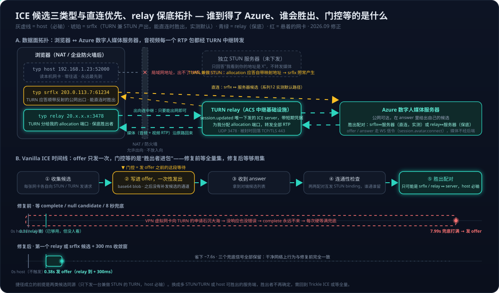

# Voice Live 系列 10：ICE、STUN 与 TURN——数字人 WebRTC 建连的候选类型、一次性信令与 relay-only 拓扑

> [系列03](Voice%20Live系列03：数字人出场延迟优化——ICE门控根因、实测分解与预热占位策略.md) 把数字人出场慢 8 秒的根因定在"ICE 门控死等 gathering `complete`"，修法是把等待目标从"全量集"改成"够用集"。那篇文章的重心在实测与修法，把 ICE 本身当成了读者已知的东西。回头复盘时留下一串追问：ICE 门控到底是什么，它和 WebRTC 是什么关系，为什么需要它；既然建 WebRTC 只要一对能用的地址，为什么"修复前"要等全部候选，默认不该是先到先得吗；官方参考实现明知走 relay，为什么不直接按 relay 建连；host、srflx、relay 各是什么缩写、具体差别在哪、格式长什么样；relay 具体在做什么，Azure 是不是额外提供了一个中继器；WebSocket 也是双工的，为什么它就没有这套配对流程。
> 本文按这串追问的顺序展开。它不改系列03 的任何结论，而是把那些结论下面的协议层摊开——读完应该能判断：这个捷径在什么前提下成立、换一个服务端会不会失效、以及为什么"WebRTC 一端明明是服务器"却仍然逃不掉 ICE。双通道架构（WS 信令 + WebRTC 媒体）见[系列01](Voice%20Live系列01：Agent实现架构——从级联流水线到Azure%20Voice%20Live%20API.md)，两种协议的定位对比见 [WebSocket与WebRTC深度对比](../../Notes/AI/voice/WebSocket与WebRTC深度对比——从Azure%20Voice%20Live%20API看实时通信协议选型.md)。

---

## 一、ICE 是什么：WebRTC 建连的必经阶段

数字人的音视频不走那条 WebSocket，而是一条独立的 WebRTC 连接（浏览器 ↔ Azure 的数字人媒体服务器）。WebRTC 建连之前要先解决一个 WebSocket 从不需要面对的问题：**双方到底用哪一对网络地址互发 UDP 包？**

浏览器本机可能有一堆"候选地址"（ICE candidate）：局域网网卡、VPN 虚拟网卡、IPv6、经 STUN 探出来的公网出口、经 TURN 中继分到的地址。**ICE（Interactive Connectivity Establishment，交互式连接建立，RFC 8445）就是 WebRTC 里"收集这些候选、两边交换、逐对试通、选出一对能用的"这套流程。** 它是 WebRTC 建连的必经阶段，没有 ICE 就没有媒体流；WebRTC 协议没有"跳过 ICE"的模式，哪怕实际拓扑简单到只有一条路可走。



## 二、三类候选：host、srflx、relay 各是什么

一个候选 = "别人可以往这里发 UDP 包找到我"的一个 `IP:端口`。三类候选的区别在于**这个地址是从哪个视角看到的**。

| 类型 | 全称 | 这个地址是什么 | 怎么得到 | 谁能用它找到你 |
|---|---|---|---|---|
| **host** | host candidate | 本机网卡上的地址：`192.168.1.23:52000`、VPN 的 `10.x`、IPv6、mDNS 混淆过的 `xxx.local` | 读网卡，零网络往返 | 只有同一局域网里的对端 |
| **srflx** | server reflexive（服务器反射） | 你在 NAT 外面的公网出口地址 `203.0.113.7:61234`，是 NAT 设备"反射"给你的 | 向 STUN 服务器发一个包，它把"我从哪个地址收到你"回给你 | 公网上的对端，前提是你的 NAT 允许外来包进来（很多企业 NAT / 对称 NAT 不允许） |
| **relay** | relayed candidate | 中继服务器上专门分给你的一个地址（`20.x.x.x:3478` 上的一个端口） | 向 TURN 服务器申请一块 allocation，之后所有包由它转发 | 任何能到达那台中继的人——最稳，但多一跳 |
| （prflx） | peer reflexive | 连通性检查过程中对端"意外"发现你的地址 | 不用预先收集 | 补充用，通常不出现在 offer 里 |

一个比喻：**host 是你家里的门牌号**（只有小区里的人认）；**srflx 是小区大门对外的门牌**（外面的人能找到，但门卫可能不放行陌生快递）；**relay 是你在邮局租的一个信箱**——谁都能寄到，邮局再转给你。

### 2.1 STUN 和 TURN：产出 srflx 与 relay 的两个协议

两者是同一族协议（TURN 是 STUN 的扩展，STUN 见 RFC 8489、TURN 见 RFC 8656），端口通常都是 3478（TLS 5349）：

- **STUN（Session Traversal Utilities for NAT）**：只做"照镜子"。你发一个 binding 请求，它回你"我看到你的地址是 X"。它不转发媒体，成本几乎为零。产出 **srflx**。
- **TURN（Traversal Using Relays around NAT）**：在 STUN 之上加了 Allocate / Permission / Send / Data 这套操作。你申请一个 allocation，服务器就在自己身上开一个端口代表你；之后你的媒体先发给 TURN，TURN 转给对端，反向同理。它承载全部媒体流量，所以要带宽和凭据（`username` / `credential`，通常是短期 HMAC 凭据）。产出 **relay**。

ICE 的工作就是把双方的候选两两配对，按优先级（host > srflx > relay，越"直"越优先）逐对发 STUN 探测，第一对通了且优先级最高的胜出。注意这里的选择依据是 **priority + 试通结果**，到达顺序根本不在考虑里——这一点在第四节会变得关键。

### 2.2 候选在 SDP 里长什么样

`setLocalDescription` 之后，每个候选是 SDP 里的一行 `a=candidate:`（RFC 8839 格式）：

```text
a=candidate:<foundation> <component> <transport> <priority> <address> <port> typ <type> [raddr <ip> rport <port>] [generation N] ...
```

三类候选的真实样子：

```text
a=candidate:1467250027 1 udp 2122260223 192.168.1.23 52000 typ host generation 0
a=candidate:1853887674 1 udp 1686052607 203.0.113.7  61234 typ srflx raddr 192.168.1.23 rport 52000 generation 0
a=candidate:750991856  1 udp 41885439   20.50.12.34   3478  typ relay raddr 203.0.113.7  rport 61234 generation 0
```

- `priority` 的量级就体现了偏好：host 约 2.1e9，srflx 约 1.7e9，relay 约 4e7。
- `raddr` / `rport` 是"这个候选背后的相关地址"：srflx 背后是 host，relay 背后是 srflx。
- 系列03 门控里匹配的就是这一行里的 `typ relay`（正则 `/ typ (relay|srflx)(\s|$)/`）。浏览器 API 里对应 `RTCIceCandidate.candidate` 字符串，以及 `candidate.type` 属性（`"host" | "srflx" | "prflx" | "relay"`）。

## 三、"门控"是什么：offer 发出去之前的一道等待

候选是要写进 SDP offer 里发给对方的。WebRTC 传候选有两种方式：

- **Trickle ICE**（RFC 8838）：offer 先发，候选收集到一个补发一个。需要信令通道能反复双向发消息。这是现代 WebRTC 的默认做法，也是"不用等全量"这个直觉的正确版本。
- **Vanilla ICE**：offer 作为一个完整包只发一次，里面必须已经带着所有要用的候选。

Azure 数字人的信令属于后者：offer 以 base64 blob 通过 `session.avatar.connect` **只发一次**，之后没有补发候选的消息类型。所以浏览器在发 offer 前必须"等一等"，确保最终会胜出的那个候选已经在包里——这道"发之前等候选"的等待，就是所谓 **ICE 门控**。它不是拍脑袋加的保守代码，而是这种一次性信令下的必要动作：offer 里少了那个候选，连接就建不起来。

## 四、为什么不能"先到先得"：三层原因与"修复前"方案的来历

"建 WebRTC 只要一对能用的地址，先到先得不就行了"——这个直觉在 ICE 里恰恰不成立，原因有三层。

### 4.1 "能用"不是本地能判断的——要对方参与

一个候选"能不能用"，指的是**这对地址**（我这边一个 + 对方那边一个）之间的 UDP 包能不能互通。浏览器在收集阶段不知道这件事，只有在 offer/answer 交换完、双方都拿到对方的候选列表、开始做 connectivity checks（互发 STUN binding 请求）之后才知道。时序是：

```text
收集候选 → 写进 offer 发出 → 拿到 answer → 两边配对逐对试通 → 选出胜出的一对
```

"先到的那个能不能用"，在发 offer 的那一刻没有任何人知道。

### 4.2 先到的偏偏是最没用的

候选按类型的收集速度差别巨大：

| 类型 | 怎么来的 | 何时到 | 到得了 Azure 吗 |
|---|---|---|---|
| host | 读本机网卡地址 | 几乎瞬间，永远最先到 | 局域网 / VPN 地址，基本到不了 |
| srflx | 向 STUN 服务器问"我的公网出口是啥" | 一次 UDP 往返 | 也许 |
| relay | 向 TURN 服务器申请一个中继地址 | 一次或多次往返 | 一定到得了 |

如果真的"先到先得"，发出去的 offer 里只有 host 候选，Azure 那边一个也试不通——连接建不起来，而且是必然的。这就是为什么通用实现不能取第一个。

### 4.3 不能"先发出去、后面再补"——这才是关键

WebRTC 标准里正是这么设计的（Trickle ICE），但它的前提是信令通道能双向、反复地传候选。Azure 数字人的信令不是——上一节说了，一次性 blob，没有补发通道。于是退回到 Vanilla ICE：**一个包必须自带所有会用到的候选。**

在"不知道哪个候选会赢"的通用假设下，Vanilla ICE 唯一正确的做法就是等 gathering `complete`——因为你不知道该漏掉哪一个。这就是"修复前"方案的来历：**它不是有人写坏了，而是这条一次性信令通道下的教科书标准做法**（Azure 官方 avatar 参考实现也是这么等的，项目里的 Avatar 层是从那里移植来的）。它的缺点只在于 `complete` 的语义是"所有网卡都了结"，被最慢最坏的那张网卡绑架，在多网卡机器上必然撞 8 秒兜底——这部分系列03 第三节已经讲透。

### 4.4 修复为什么成立——因为我们知道了"谁会赢"

修复不是发明了新的 WebRTC 规则，而是利用了这条链路的特定事实：**Azure 只下发一个 TURN relay，没有 STUN、没有直连路径。** 那么：

- 胜出的候选只可能是 relay 类型（host 到不了 Azure 的中继，srflx 没有 STUN 就不会产生）；
- 所以包里只要有一个 relay 候选，"会用到的候选"就已经齐了——通用假设里"不知道谁会赢"的那个未知量被消掉了。

于是"等全量集"合法地退化为"等第一个 relay 候选 + 300 ms 收敛"。正确性一分不丢，因为我们等的仍然是"胜出者进包"，只是现在知道胜出者长什么样。

一句话：**"先到先得"错在两点——先到的（host）恰恰是必输的，而且谁赢要等对方一起试过才知道；"等全量"是一次性信令下的正确通用解，只是慢；修复是用 relay-only 这个服务端事实把"全量"缩成"够用"。** 换一个 STUN / 直连都开放的服务端，这个捷径就不再安全，就得回到 Trickle 或全量。

## 五、官方参考实现为什么不按 relay 建连

既然 Azure 数字人只走 relay，官方实现为什么不直接按 relay 门控，甚至只收集 relay？三个层面。

### 5.1 通用 SDK 不能把部署事实写死

等待逻辑在 Speech SDK 的 avatar 启动路径和官方 JS sample 里，写的是"等 `complete` / 兜底超时"。官方之所以这么写，是因为它是通用 SDK，不能假设 relay-only：

- 文档原话："We recommend fetching ICE server details from Speech service, but you can use your own."——用户可以传自己的 ICE 服务器（STUN、允许直连的 TURN、多个 server）。一旦 ICE 配置不是"一个 TURN relay"，胜出候选就可能是 srflx 甚至 host，"看到第一个 relay 就发"就会漏掉真正会赢的候选，连接失败。
- SDK 作者只能实现协议层面永远正确的做法：Vanilla ICE 下等收集完成。**"relay-only"是 Azure 默认 relay token 这一部署事实，不是 WebRTC 协议保证**——微软自己以后也可能加 STUN / 直连路径（TURN 中继要付带宽钱，直连更省）。通用代码不会把部署事实写死。
- 应用侧能做这个捷径，是因为它只服务这一条链路，且每次都从 `session.updated` 拿到 Azure 下发的那一个 relay——**应用知道的比 SDK 多**。

### 5.2 `iceTransportPolicy: "relay"` 为什么解决不了那 8 秒

WebRTC 有一个开关表达 relay-only：`new RTCPeerConnection({ iceServers, iceTransportPolicy: "relay" })`，让浏览器只收集 relay 候选，不碰 host / srflx。这是"官方语法"里表达 relay-only 的方式，官方 sample 没用，修复里也没用。

但它解决不了撞到的那个 8 秒：relay 候选是"**从每个本地网卡分别向 TURN 申请**一个中继地址"得来的。VPN 虚拟网卡上的 TURN 申请一样会石沉大海，所以 `complete`（= 所有网卡都了结）照样不来：

| 做法 | 候选噪音 | VPN 网卡悬着时 |
|---|---|---|
| 默认策略 + 等 `complete`（官方） | 多 | 卡满兜底 |
| `iceTransportPolicy: "relay"` + 等 `complete` | 少 | 仍然卡（那张网卡的 relay 申请不结束） |
| "第一个 relay 候选 + 300 ms"门控 | 无所谓 | 不卡（好网卡的 relay 几百毫秒就到） |

所以门控的关键不在"少收集"，而在"**不等最坏的那张网卡**"。`iceTransportPolicy: "relay"` 可以作为锦上添花（SDP 更干净、少几次无用探测），但不是必要的；没有顺手改它，是因为要动就得再跑一轮真机验证，而收益只是几十毫秒级。

### 5.3 Azure 数字人为什么用 relay 而不是直连

这是 Azure 的架构选择，和 SDK 无关：

- 浏览器几乎总在 NAT / 企业防火墙后面；数字人媒体服务器在 Azure。要直连，服务器得作为 ICE-lite 端暴露公网 UDP，并要求客户端网络放行任意 UDP——企业网络经常不放。
- TURN relay（ACS，Azure Communication Services 的中继基础设施）提供一条确定可达的路径，支持 UDP 不通时回落 TCP/443，穿透率最高。代价是多一跳和带宽费，但对"必须在客户办公网里可靠出画面"的产品，这是正确取舍。
- relay-only 顺带把"哪对候选会赢"变成了确定的——这正是应用侧能安全做门控的前提。换句话说，**Azure 为可靠性选了 relay，应用为延迟利用了这个选择。**

## 六、relay 具体在做什么：Azure 额外提供了一台中继器

是的。Azure 数字人不会让浏览器直连它的媒体服务器，而是给你一台它自己运营的 TURN 服务器：

- **Speech 服务**：`GET /tts/cognitiveservices/avatar/relay/token/v1` 返回 `urls` / `username` / `credential`；
- **Voice Live**：同样的信息直接放在 `session.updated` 的 `session.avatar.ice_servers` 里——代理里看到的就是 1 个 `turn:relay.communication.microsoft.com:3478` 加短期凭据。

数据面上发生的事：

```text
浏览器 ──UDP 3478 / TCP 443（出向）──▶ TURN 中继（Azure，ACS relay） ◀──── Azure 数字人媒体服务器
   ▲  你的 allocation 端口就在中继上；                              ▲
   │  音频 / 视频每一个 RTP 包都经它转发                             │
   └── 浏览器只需要"能出网到这台中继"，不需要任何入向放行 ────────────┘
```

它为什么值得这多一跳：企业防火墙几乎都允许**出向** UDP/TCP 到一个已知地址，而几乎不允许**入向**任意 UDP——TURN 把"双向直连"问题变成了"双向都只出向连中继"。UDP 被封时还能回落 TURN-over-TCP/TLS 443。代价是延迟多几十毫秒、Azure 要付中继带宽——所以 Azure 选它，是拿一点延迟换"在任何客户办公网里都能出画面"。反过来，对使用方而言，全部经中继意味着每会话码率直接决定办公网入口带宽或自建 TURN 的配额预留：1080p 视频数字人约 2~4 Mbps/会话，512×512 照片数字人低一个数量级，两类头像的带宽与并发对照见[系列05](Voice%20Live系列05：两类数字人头像——viseme驱动的Video%20Avatar与VASA-1生成的Photo%20Avatar.md)第七节。

回到门控：因为 Azure 只给了这一台 TURN、没给 STUN、也不暴露直连地址，胜出的候选对必然是"我的 relay 候选 ↔ Azure 服务器候选"。这就是"只等第一个 relay 候选"能成立的全部前提。这台中继也是可替换的：`session.avatar.ice_servers` 传自己的 TURN 即可，你的 TURN 只替换浏览器一侧、与 Azure 的中继互不知道对方存在，配置要求与何时值得见[系列11](Voice%20Live系列11：自建TURN中继——ice_servers替换入口、coturn要求、与Azure侧的关系及何时值得.md)。

## 七、为什么 WebSocket 没有这个问题

WebSocket 也是双工的，为什么它不需要这套配对？核心区别一句话：**WebSocket 是"客户端主动连一个有公网地址的服务器"；WebRTC 是"两个可能都躲在 NAT 后面的对等端互相找到对方"。** 前者的连接方向和地址是已知的，后者两者都未知，ICE 就是把这两个未知量解出来的过程。

### 7.1 WebSocket：放弃对等，换来零发现成本

```text
浏览器（私网 10.0.0.5，NAT 后）──TCP 三次握手，出向──▶ 服务器 wss://api.example.com:443（公网）
```

- **方向固定**：永远是客户端发起。NAT 和防火墙天然允许"出向 TCP 连接 + 它的回包"——这是 NAT 存在的方式：出去一个包，映射表里记一条，回来的包按表放行。
- **地址已知**：服务器有一个 DNS 名和公网 IP，客户端不需要"发现"任何东西。
- **服务器从不需要主动找客户端**：所有服务器 → 客户端的消息都走这条已建立的 TCP 连接回来。"双工"是建在这条单向发起的连接之上的。

所以 WebSocket 没有"配对"问题，不是因为它更聪明，而是因为它**放弃了对等**：一方必须是公网可达的服务器。HTTP、gRPC、MQTT 全都如此。

### 7.2 WebRTC：为了两端都不是服务器，必须做 ICE

WebRTC 的设计目标是 peer-to-peer 媒体：两个浏览器（各自在家庭 / 公司 NAT 后面）直接互传音视频，不经过服务器——省服务器带宽，延迟最低。这带来两个 WebSocket 没有的未知量：

1. **谁是"服务器"？** 没有。双方都在 NAT 后，都没有公网可达地址，谁也不能"被连"。
2. **走哪条路？** 同一局域网内用 host 最好；跨公网要用 NAT 外的 srflx，还得 NAT 允许入向；都不行才走 relay。哪条路能通，取决于双方各自的 NAT 类型和网络策略，事先无法知道。

ICE 解决它的方式就是：两边各自把所有可能的地址列出来（收集候选）→ 通过信令交换 → 两边同时互发探测包（这就是 NAT 打洞：两边同时出向发包，各自在 NAT 上打开映射，对方的包就能进来）→ 选出第一对通的。"提前配对"不是多余的仪式，而是在没有服务器可依赖的前提下建立直连的唯一办法。

另外 WebRTC 走 UDP（RTP），因为实时音视频宁可丢包也不能等重传——TCP 的队头阻塞会让延迟抖动累积。而 UDP 没有"连接"概念，NAT 对它的映射更短命、规则更杂，穿透难度比 TCP 高得多。这也是 ICE 复杂度的来源之一。

### 7.3 Azure 数字人"一端明明是服务器"，为什么还要 ICE

这里确实没有对等的必要，Azure 的媒体服务器完全可以像 WebSocket 服务器一样公网可达。理论上有更简单的做法：服务器做 ICE-lite（只提供自己的公网 host 候选，不做主动探测），浏览器用 srflx 直连它，一次往返就通。

Azure 没这么做，而是给了一台 TURN 中继，原因就是第六节说的：企业网络对 UDP 极不友好。直连服务器的 UDP 常被公司防火墙整个封掉；TURN 可以回落到 TCP/443——而这时候它做的事，**本质上和 WebSocket 一模一样**：客户端出向连一个已知的公网地址，媒体在这条隧道里双向走。

| | WebSocket（信令 / 转写 / 控制） | WebRTC + TURN（数字人音视频） |
|---|---|---|
| 连接方向 | 客户端 → 已知服务器 | 客户端 → 已知中继（TURN） |
| 传输 | TCP | UDP，被封时回落 TCP/443 |
| 需要 ICE 吗 | 不需要 | 协议要求必须走 ICE（WebRTC 没有"跳过 ICE"的模式），即使实际只会走 relay |
| 为什么要 UDP | 不需要，消息不在乎几十毫秒抖动 | 实时视频要低延迟、允许丢帧 |

也就是说，Azure 用 TURN 把 WebRTC 拉回到了"客户端连已知服务器"这个和 WebSocket 一样简单的拓扑，但 WebRTC 的协议机器（收集候选、写 SDP、连通性检查）不会因此消失——这就是为什么仍然要处理候选收集，也是为什么"只有 relay 会赢"这个事实能让等待缩到最短：**拓扑已经退化成客户端-服务器了，ICE 只是形式上还得走一遍。**

## 八、一段梳理与四处校正

把前七节压成四条因果链，再逐条校正措辞，是检验自己是否真懂的最好办法。梳理原文如下：

1. WebRTC 基于 UDP，是为了在网络不稳定时保住性能：即使丢掉一些包，也不必像 TCP 那样保序重传。
2. WebRTC 是 peer-to-peer，没有明确的 client 与 server，是对等交流，所以交流之前先通过 ICE 互相交换可用的地址和端口。
3. 企业网络对 UDP 的规则不一定放行，所以出现 relay 这种模式，让它退阶到 WebSocket 那样的单向发起模式，简化企业网络问题。
4. relay 只是中继，ICE 的动作仍然要完成，所以解决不了前期检测那一段——于是就有了 ICE 延迟高的问题。

四条的方向都对，第 1、2、4 条各补一个细节，第 3 条有两处需要修正。

### 8.1 UDP 的理由：对，但"丢了就丢了"不是放任

WebRTC 媒体走的是 RTP over UDP。先把 RTP 说清：**RTP 是 Real-time Transport Protocol（实时传输协议，RFC 3550）**，承载音视频媒体本身的应用层协议。它不负责"把数据送到对方"，那是下面 UDP 的事；它负责的是"让对方知道收到的这段字节是什么、该在什么时候播"。UDP 只是"往这个地址发一坨字节"，没有任何媒体语义，RTP 在每个包前加一个 12 字节起的头补上这些语义：

| RTP 头字段 | 作用 |
|---|---|
| sequence number（序列号） | 接收端据此发现丢包、把乱序包排回顺序。只是"发现"，不像 TCP 那样自动重传 |
| timestamp（时间戳） | 采样时钟，告诉接收端这一帧该在什么时刻播放，抖动缓冲靠它对齐 |
| payload type | 载荷编码类型，如 Opus 音频、H.264 或 VP8 视频 |
| SSRC | 同步源标识，区分同一连接里的不同媒体流，数字人的音频轨和视频轨就是两个 SSRC |
| marker | 标记一帧的最后一个包，视频一帧通常拆成多个 RTP 包 |

与它成对的是 **RTCP**（RTP Control Protocol）：接收端周期性报告丢包率、抖动、往返时延，发送端据此调码率或触发关键帧；NACK 与 PLI（请求关键帧）也是 RTCP 消息。WebRTC 默认把 RTP 与 RTCP 复用在同一个 UDP 端口上，并强制用 DTLS-SRTP 加密载荷。一句话：**UDP 决定包怎么送到，RTP 决定包里是什么、什么时候播、丢了怎么知道。**

对照 Voice Live 的两条管道：WebSocket 那条传音频时是把 PCM 或编码字节直接放进 WebSocket 帧，没有 RTP 头，没有时间戳对齐与丢包恢复机制，全靠 TCP 保序，抖动直接变成延迟累积；数字人那条 WebRTC 管道里音视频都是 RTP 包——这也是系列03 提到 avatar 模式下 WebSocket 上看不到 `response.audio.delta` 的原因：音频已经作为 RTP 音频轨走了 WebRTC。

"丢了就丢了"背后有一套实时友好的丢包处理：抖动缓冲（jitter buffer）吸收乱序与抖动、FEC（前向纠错）用冗余包就地恢复、按需 NACK 只对来得及的帧请求重传。要避开的是 TCP 的队头阻塞——已到的帧全得等前面那个丢的，延迟一累积就不实时了。所以准确说法是：**放弃"全部到达且有序"这个保证，换取"到了的立刻能用"。**

### 8.2 对等 → 需要 ICE：对，补两个细节

- ICE 做的不只是"交换地址"。交换只是前置，**双方同时互发探测包做连通性检查**才是 NAT 打洞的核心——两边同时出向发包，各自在 NAT 上打开映射，对方的包才进得来。没有这一步，交换来的地址只是一张没验证过的清单。
- WebRTC 协议本身**没有信令通道**，候选和 SDP 要靠应用自己选的通道传。在 Voice Live 里这条信令通道就是那条 WebSocket（`session.avatar.connect` 上行送 offer、`session.avatar.connecting` 下行回 answer）。Azure 把它设计成一次性的（offer 只发一次、不补候选），这才逼出了"发前要等候选"的门控——**门控不是 WebRTC 的规定，是这条信令通道的设计决定的。**

### 8.3 relay 的定位：两处修正

- **relay 不是为企业网专门发明的"退化模式"，它本来就是 ICE 的第三档兜底。** 标准顺序是 host → srflx → relay，普通 WebRTC 也会在前两档都不通时走 relay。Azure 的特别之处不在"用了 relay"，而在**只给 relay**（只下发一个 TURN、不给 STUN、不暴露直连），于是 relay 从"兜底"变成了"唯一"。
- **它默认仍然是 UDP（TURN over UDP），只是在 UDP 被封时才回落 TCP/TLS 443。** 所以"退阶到 WebSocket 模式"要拆成两层说：**拓扑上**退化成了"客户端 → 已知服务器"（这一点确实和 WebSocket 一样），但**传输层**不是变成 WebSocket，而是"能 UDP 就 UDP，不行才 TCP"。这也是为什么走 relay 之后媒体延迟只多几十毫秒，而不是多一个 TCP 的抖动累积。

### 8.4 relay 消不掉 ICE 的流程：对，但要把 8 秒定位准

即使只有 relay 会赢，收集候选、写 SDP、连通性检查这一整套仍然要走一遍，WebRTC 没有"跳过 ICE"的模式。不过那 8 秒具体卡在哪一环要说清：**不是连通性检查慢，也不是 relay 本身慢，而是收集阶段的等待策略。** 用系列03 的分段数字对账：

| 阶段 | 修复前 | 修复后 | 属于谁 |
|---|---:|---:|---|
| 收集候选 → 发 offer（门控） | 7.99 s：等 `complete`，被悬着的 VPN 网卡拖死 | 0.38 s：等到第一个 relay 候选就发 | 客户端策略 |
| offer → answer → ICE 试通 → 视频首帧 | 2.4 s | 2.1~3.9 s（Azure 侧建流 + 1080p 首帧，与修复无关） | 服务端 |

也就是说，**ICE 的"必要成本"其实只有几百毫秒加一次到中继的往返**；那 7.6 秒不是 ICE 的成本，而是客户端在一次性信令下选择了"等全量"这个保守策略的产物。修复没有绕开 ICE，只是把等待条件从"所有网卡都了结"改成"胜出者已在包里"。剩下的 2~4 秒是 Azure 那边建流和渲染首帧，属于服务端成本，和 ICE 无关（这部分的构成与缓解见系列03 第 5.4 节）。

四条合成一句话：**WebRTC 为了低延迟选 UDP，为了两端都可以不是服务器发明了 ICE；Azure 为了穿透企业网只给 relay，把拓扑拉回客户端-服务器，但 ICE 流程照走；出场慢的那 8 秒不是 ICE 本身，而是一次性信令下"等全量候选"这个策略在多网卡机器上必然打满兜底——知道赢家只能是 relay，改成"等第一个 relay"就好了。**

## 九、小结

1. **ICE 是 WebRTC 建连的必经阶段**：收集候选、交换、逐对试通、选胜出者。没有"跳过 ICE"的模式。
2. **三类候选是三个视角的地址**：host 是本机网卡（局域网门牌），srflx 是 STUN 反射的公网出口（小区大门），relay 是 TURN 分配的中继端口（邮局信箱）。到得了对端的可能性依次升高，优先级依次降低。
3. **门控源于一次性信令**：Azure 数字人的 offer 是只发一次的 blob，没有 Trickle 补发通道，所以发前必须等"胜出者进包"。
4. **"先到先得"不成立**：能不能用要对方一起试过才知道；先到的 host 恰恰必输；一次性信令没有后补机会。"等全量"是通用假设下的教科书解，只是被最慢的网卡绑架。
5. **捷径的前提是 relay-only**：服务端只下发一个 TURN、无 STUN、无直连，胜出者就确定是 relay，"全量"才能缩成"够用"。官方 SDK 不写死这个部署事实是对的，应用侧知道得更多才能这么做；换一个开放 STUN / 直连的服务端，捷径失效。
6. **`iceTransportPolicy: "relay"` 不是解**：它减少候选噪音，但 `complete` 仍被悬着的网卡拖住；门控的关键是"不等最坏的网卡"，不是"少收集"。
7. **relay 就是 Azure 额外运营的一台 TURN 中继**：把"双向直连"变成"双向都只出向连中继"，UDP 被封回落 TCP/443，用几十毫秒和带宽费换任何办公网都能出画面。
8. **WebSocket 没有这个问题，是因为它规定了一端必须是公网服务器**；WebRTC 为了允许两端都不是服务器发明了 ICE；Azure 用 TURN 实际上又回到了"一端是服务器"，但 ICE 这道流程是 WebRTC 的固定开销，省不掉，只能等得更聪明。
9. **8 秒要定位到收集阶段的等待策略，不是 ICE 的成本**：ICE 的必要成本只有几百毫秒加一次到中继的往返；relay 是 ICE 第三档兜底而非专用退化模式，默认仍是 TURN over UDP，Azure 让拓扑退化成客户端-服务器，传输层没有退化成 WebSocket。

## 参考

- 系列前篇：[Voice Live系列03：数字人出场延迟优化——ICE门控根因、实测分解与预热占位策略](Voice%20Live系列03：数字人出场延迟优化——ICE门控根因、实测分解与预热占位策略.md)（根因、实测与"全量集→够用集"修法，本文是其协议层展开）、[Voice Live系列01：Agent实现架构——从级联流水线到Azure Voice Live API](Voice%20Live系列01：Agent实现架构——从级联流水线到Azure%20Voice%20Live%20API.md)（WS + WebRTC 双通道与 Avatar 连接时序）、[Voice Live系列05：两类数字人头像——viseme驱动的Video Avatar与VASA-1生成的Photo Avatar](Voice%20Live系列05：两类数字人头像——viseme驱动的Video%20Avatar与VASA-1生成的Photo%20Avatar.md)（媒体流承载的是什么）
- 系列后篇：[Voice Live系列11：自建TURN中继——ice_servers替换入口、coturn要求、与Azure侧的关系及何时值得](Voice%20Live系列11：自建TURN中继——ice_servers替换入口、coturn要求、与Azure侧的关系及何时值得.md)（把默认中继换成自己的 TURN：替换入口、coturn 要求、与 Azure 侧的关系）
- 协议背景：[WebSocket与WebRTC深度对比——从Azure Voice Live API看实时通信协议选型](../../Notes/AI/voice/WebSocket与WebRTC深度对比——从Azure%20Voice%20Live%20API看实时通信协议选型.md)
- [Interactive Connectivity Establishment (ICE): A Protocol for Network Address Translator (NAT) Traversal — RFC 8445](https://datatracker.ietf.org/doc/html/rfc8445)（候选类型、优先级、连通性检查、ICE-lite）
- [Session Traversal Utilities for NAT (STUN) — RFC 8489](https://datatracker.ietf.org/doc/html/rfc8489)
- [Traversal Using Relays around NAT (TURN) — RFC 8656](https://datatracker.ietf.org/doc/html/rfc8656)（Allocate / Permission / Send / Data）
- [Trickle ICE: Incremental Provisioning of Candidates for the ICE Protocol — RFC 8838](https://datatracker.ietf.org/doc/html/rfc8838)
- [RTP: A Transport Protocol for Real-Time Applications — RFC 3550](https://datatracker.ietf.org/doc/html/rfc3550)（RTP 头字段与 RTCP）
- [Session Description Protocol (SDP) Offer/Answer Procedures for ICE — RFC 8839](https://datatracker.ietf.org/doc/html/rfc8839)（`a=candidate` 行格式）
- [RTCIceCandidate: type property — MDN](https://developer.mozilla.org/en-US/docs/Web/API/RTCIceCandidate/type)、[RTCPeerConnection() constructor: iceTransportPolicy — MDN](https://developer.mozilla.org/en-US/docs/Web/API/RTCPeerConnection/RTCPeerConnection)
- [Real-time synthesis for text to speech avatar — Microsoft Learn](https://learn.microsoft.com/en-us/azure/ai-services/speech-service/text-to-speech-avatar/real-time-synthesis-avatar)（relay token 接口与 "you can use your own" ICE server 说明）
- [How to use the Voice Live API — Microsoft Learn](https://learn.microsoft.com/en-us/azure/ai-services/speech-service/voice-live-how-to)（`session.avatar.ice_servers` 与 `session.avatar.connect`）
