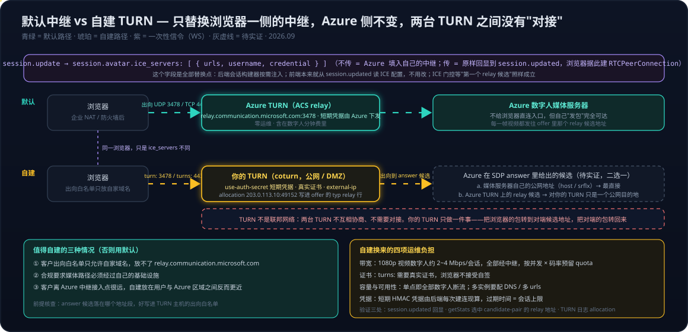

# Voice Live 系列 11：自建 TURN 中继——ice_servers 替换入口、coturn 要求、与 Azure 侧的关系及何时值得

> [系列10](Voice%20Live系列10：ICE、STUN与TURN——数字人WebRTC建连的候选类型、一次性信令与relay-only拓扑.md) 讲清了两件事：数字人媒体为什么只走 relay，以及 relay 就是 Azure 额外运营的一台 TURN 中继。紧接着的部署问题是：如果客户有自己的中继，具体怎么配置和替换；既然 Azure 没有提供其他接入点、它底层的媒体服务器又"不可达"，客户自建的 relay 是不是还得和 Azure 的 relay 沟通。
> 本文分四段：替换入口在哪、自己的 TURN 要满足什么、代码里改哪几处、怎么验证真的走了自己的中继；然后单独回答"要不要和 Azure 的中继对接"，把"不可达"说精确；最后是决策：什么时候值得这么做。两类头像的码率差异会直接进入中继的容量预算，见[系列05](Voice%20Live系列05：两类数字人头像——viseme驱动的Video%20Avatar与VASA-1生成的Photo%20Avatar.md)第七节。本文所有"改动点"都是位置与量的说明，尚未实施。

---



## 一、替换入口：`session.avatar.ice_servers`

可以替换，而且 Voice Live 的会话配置里就有正式入口。

**Voice Live 路径**：`session.update` 的 `avatar` 对象有一个正式字段 `ice_servers`（API 参考里 `RealtimeAvatarConfig` → `RealtimeIceServer[]`）：

```json
{
  "type": "session.update",
  "session": {
    "avatar": {
      "type": "photo-avatar",
      "character": "amira",
      "model": "vasa-1",
      "video": { "codec": "h264" },
      "ice_servers": [
        {
          "urls": [
            "turn:turn.example.com:3478",
            "turns:turn.example.com:443?transport=tcp"
          ],
          "username": "1730275200:app",
          "credential": "<base64(HMAC-SHA1(shared_secret, username))>"
        }
      ]
    }
  }
}
```

Azure 会把它原样回显在 `session.updated.session.avatar.ice_servers`，浏览器用这份配置建 `RTCPeerConnection`。**不传这个字段时，Azure 才填入它自己的 `relay.communication.microsoft.com`**——这就是系列10 里看到的那一个 relay。

**Speech SDK 直连数字人路径**（不经 Voice Live）：没有会话字段，直接在 `new RTCPeerConnection({ iceServers: [...] })` 里填自己的 TURN，然后把这个 peer connection 交给 avatar synthesizer 启动。官方文档那句 "We recommend fetching ICE server details from Speech service, but you can use your own" 指的就是这里。

两条路的本质一样：**你的 TURN 只替换"浏览器那一侧的中继"**。Azure 媒体服务器会把媒体发到你 TURN 上分给浏览器的 allocation 地址。Azure 那一侧不需要、也不能改。

## 二、自己的 TURN 要满足什么

先说清"自建 TURN"具体是跑什么。**coturn 是一个开源的 TURN 与 STUN 服务器软件**，名字即 "C 语言实现的 TURN 服务器"（c + turn），是目前部署最广的 TURN 实现，Jitsi、Matrix、Nextcloud Talk 与大量自建 WebRTC 系统默认都用它。三者的关系要分开：

| | 是什么 |
|---|---|
| TURN | 协议，RFC 8656 定义的"申请中继地址、转发媒体"这套规则 |
| coturn | 实现这个协议的一个具体程序，跑在你的服务器上 |
| `relay.communication.microsoft.com` | 微软自己运营的 TURN 服务，用什么软件实现你看不到也不需要知道 |

类比：TURN 之于 coturn，就像 HTTP 之于 Nginx。下文"自建 TURN（如 coturn）"的意思就是"自己跑一台 TURN 服务器，通常选 coturn"。它同时充当 STUN（回答"你的公网地址是什么"）和 TURN（分配 allocation 端口、转发 RTP 包），支持 UDP / TCP / TLS 三种监听，所以能配出 `turn:` 3478 与 `turns:` 443 两个入口；下表右列的配置项都是它内置的。

| 要求 | 为什么 | coturn 对应 |
|---|---|---|
| 公网可达，UDP 3478 + TCP/TLS 443 | Azure 媒体服务器从公网发包到你的 allocation；企业网 UDP 被封时浏览器要回落 TCP 443 | `listening-port=3478`、`tls-listening-port=443`、`external-ip=<公网IP>/<内网IP>`（云上 NAT 后必填） |
| 短期凭据（RFC 8489 long-term credential 机制 + TURN REST API 约定） | 凭据会下发到浏览器，必须可过期；不要用静态用户名密码 | `use-auth-secret`、`static-auth-secret=...`、`realm=turn.example.com`；后端按 `username = <unix过期时间>:<标识>`、`credential = base64(HMAC-SHA1(secret, username))` 生成 |
| 允许对端是 Azure 的公网地址 | TURN 只转发浏览器 CreatePermission 过的对端；对端就是 Azure 在 answer 里给的公网候选 | 不要把 `denied-peer-ip` 配得过宽；如做白名单，放行数字人服务所在 Azure 区域的地址段 |
| 带宽与并发 | 1080p H.264 数字人实测约 1.5~2.4 Mbps/会话、静音期突发 3~4 Mbps（photo 头像 512×512 约 0.65 Mbps），音频上行走 WebSocket 不经 TURN，24 kHz PCM16 含封装实测约 0.54~0.68 Mbps（[系列01](Voice%20Live系列01：Agent实现架构——从级联流水线到Azure%20Voice%20Live%20API.md) 4.5.1）；视频与下行音频全部经中继 | 按并发会话数 × 码率预留；`total-quota` / `user-quota` 设上限 |
| 地理位置 | 媒体路径变成 浏览器 → 你的 TURN → Azure，中继离两端都远会加 RTT | 放在客户用户与 Azure 区域之间，或客户机房 DMZ |
| 证书 | `turns:` 需要真实证书，浏览器不接受自签 | `cert=` / `pkey=`，Let's Encrypt 即可 |

coturn 的最小配置：

```ini
listening-port=3478
tls-listening-port=443
fingerprint
use-auth-secret
static-auth-secret=CHANGE_ME_LONG_RANDOM
realm=turn.example.com
external-ip=203.0.113.10
cert=/etc/letsencrypt/live/turn.example.com/fullchain.pem
pkey=/etc/letsencrypt/live/turn.example.com/privkey.pem
no-multicast-peers
no-cli
```

Linux 上一般 `apt install coturn` 即可安装，配置文件是 `/etc/turnserver.conf`，上面的内容就是往这个文件里写的；装好后确认服务启用并放行 3478/UDP、3478/TCP、443/TCP 以及 allocation 使用的 UDP 端口段（默认 49152~65535，可用 `min-port` / `max-port` 收窄）。

## 三、代码里的替换点：只动一处

- **后端会话构建器**（组装 `avatar` 字典的地方）：增加可选的 `ice_servers`。来源二选一——环境变量里一份 JSON（全局，最简单），或按租户 / 场景配置（每个客户可不同）。**凭据要每次建连时由后端用 shared secret 现算**（过期时间 = 现在 + 会话上限，如 60 分钟），不能存死。量级约二十行加一个单测，断言 `avatar.ice_servers` 进了 `session.update`。
- **前端 WebRTC 握手 hook**：不用改。它本来就是从 `session.updated.session.avatar.ice_servers` 读 ICE 配置再转成 `RTCIceServer[]`，Azure 回显什么就用什么。
- **ICE 门控**（系列03 的"第一个 relay 候选 + 300 ms"）：仍然成立。门控等的是"第一个 relay 或 srflx 候选"，你的 TURN 产出的 relay 候选一样触发。只有一种情况要重新审视：你的 ICE 配置里同时加了 STUN，**并且** Azure 侧也暴露直连候选——后者目前不存在，所以不用动。
- **网络要求文档 / 客户交付手册**：把出向放行从 `relay.communication.microsoft.com` 改成你的 TURN 域名与端口。

## 四、怎么验证真的走了自己的中继

1. **`session.updated` 回显**：`avatar.ice_servers[0].urls` 应是你的域名。在协议层测试里加一条断言即可，与断言 `voice.temperature` 回显是同一模式（见[系列09](Voice%20Live系列09：脚本朗读的机制化——pre_generated绕过模型推理、宿主模型与代码、prompt、voice三层分工.md)"旋钮不等于生效"）。
2. **浏览器 `pc.getStats()`**：找 `candidate-pair` 里 `nominated` / `selected` 的那一对，其 `local-candidate` 应为 `candidateType: "relay"` 且 `address` 是你 TURN 的公网 IP。这个诊断日志加在握手 hook 里是十分钟级改动，顺带能实证系列10 的推断"默认配置下胜出的就是 relay"。
3. **TURN 服务器日志**：能看到 allocation 与流量；数字人出画面延迟应与现在持平或更好（取决于 TURN 位置）。

## 五、自建的 relay 需要和 Azure 的 relay 沟通吗

不需要。这里要把"不可达"说精确。

**Azure 的数字人媒体服务器"不可达"，指的是它不给浏览器一条可以直连它的路**：不发 STUN、不在网络要求里列出直连地址。它自己**发包**是完全没问题的——它现在每一帧视频，就是发到 `relay.communication.microsoft.com` 上你那个 allocation 端口的。

### 5.1 TURN 之间不存在"沟通"

TURN 不是联邦网络，两台 TURN 不会互相协商。一台 TURN 做的事只有两件：把浏览器发来的包转发到对端候选地址，把从对端候选地址收到的包转回浏览器。对它来说，对端只是一个普通的公网 `IP:端口`。

所以自建 TURN 后，路径是：

```text
浏览器 ──▶ 你的 TURN（allocation：203.0.113.10:49152） ──▶ Azure 在 SDP answer 里给出的候选地址
                                                    ◀──  Azure 媒体服务器往 203.0.113.10:49152 发视频
```

Azure 那一侧知道要发到哪，是因为**你的 offer 里带着 `typ relay 203.0.113.10 49152` 这个候选**，ICE 连通性检查通过后它就把这对地址选为路径。不需要注册、不需要任何对接。

### 5.2 唯一的实际前提：你的 TURN 能出向到达 Azure 的 answer 候选

Azure 在 SDP answer 里放的候选是什么，决定你的 TURN 主机出向规则要放行什么：

| Azure 侧候选类型 | 你的 TURN 需要能到达 | 备注 |
|---|---|---|
| 媒体服务器自己的公网地址（host / srflx） | 该 IP 的某个 UDP 端口 | 最直接 |
| Azure 自己 TURN 上的 relay 候选（文档列出的 ACS 中继地址段，如 `20.202.0.0/16`） | 该地址段的 UDP 3478 / TCP 443 | 路径变成"你的 TURN → Azure 的 TURN → 媒体服务器"，但对你的 TURN 只是一个公网目的地，不是对接 |

**哪一种，目前没有实证**——从没打印过 Azure 的 answer SDP 里的 `a=candidate` 行。这是一个很便宜的诊断：在握手 hook 的 `setRemoteDescription` 之前把 answer 的候选行打到 console，跑一次真机就知道。它同时能回答"胜出的到底是不是 relay"。

两种情况下对客户的运维要求都一样：TURN 主机的出向规则要允许到 Azure 的那些公网地址（通常就是允许所有出向 UDP 与 443 TCP，云主机默认如此）；如果 TURN 放在客户 DMZ 且出向也做白名单，就把 answer 里看到的地址段加进去——这条和现在文档里"放行 `relay.communication.microsoft.com`"是同一性质，只是从"浏览器出向"挪到了"TURN 出向"。

直白地回答：

- 客户自建 relay **不需要**和 Azure 的 relay 建立任何关系，两者互不知道对方存在。
- 客户的 relay **需要**能把 UDP/TCP 发到 Azure 在 answer 里给出的公网候选地址——Azure 的服务器对"发包"是可达的，只是不给浏览器直连入口。
- 换句话说，Azure 说的"你可以用自己的 ICE server"是成立的，不存在隐藏依赖；要确认的只是 answer 候选到底落在哪个地址段，好写进客户的出向白名单。

## 六、什么时候值得自建

只有三种情况：

1. 客户出向白名单只允许自家域名，放不了 `relay.communication.microsoft.com`；
2. 合规要求媒体路径必须经过自己的基础设施；
3. 客户离 Azure 中继的接入点很远，自建放在用户与 Azure 区域之间反而更近。

Azure 自带的中继是**零运维、已含在数字人分钟费里**的。自建 TURN 反而多出四项运维负担：**带宽**（并发 × 码率，全部经中继）、**证书**（`turns:` 要真实证书）、**容量与可用性**（单点即全部数字人断流，多实例要配 DNS 或多 `urls`）、**凭据**（后端每次建连现算短期 HMAC）。不满足上面三条之一，默认中继就是正确选择。

## 七、小结

1. **替换入口只有一个字段**：`session.avatar.ice_servers`。不传，Azure 填自己的中继；传了，原样回显，浏览器照用。前端与 ICE 门控都不用改，后端会话构建器加约二十行。
2. **自建 TURN 六项要求**：公网可达（UDP 3478 + TCP/TLS 443）、短期 HMAC 凭据、允许对端为 Azure 公网地址、按并发 × 码率预留配额、放在两端之间、真实证书。
3. **你的 TURN 只替换浏览器一侧的中继**，Azure 侧不变、不能改、也不需要知道你的 TURN 存在。TURN 不是联邦网络。
4. **"不可达"要说精确**：媒体服务器不给浏览器直连入口，但自己发包完全可达。唯一前提是你的 TURN 能出向到达 Azure 在 answer 里给出的候选地址；那个候选是媒体服务器公网地址还是 Azure 中继上的 relay，打印 answer 的 `a=candidate` 行即可实证。
5. **验证三处**：`session.updated` 回显、`getStats()` 选中 candidate-pair 的 relay 地址、TURN 日志里的 allocation。
6. **默认中继是默认答案**：零运维且含在分钟费里；只在出向白名单、合规路径、地理接入三种情况下值得自建，代价是带宽、证书、容量可用性、凭据四项运维。

## 参考

- 系列前篇：[Voice Live系列10：ICE、STUN与TURN——数字人WebRTC建连的候选类型、一次性信令与relay-only拓扑](Voice%20Live系列10：ICE、STUN与TURN——数字人WebRTC建连的候选类型、一次性信令与relay-only拓扑.md)（relay-only 拓扑与 TURN 在做什么，本文是其部署延伸）、[Voice Live系列03：数字人出场延迟优化——ICE门控根因、实测分解与预热占位策略](Voice%20Live系列03：数字人出场延迟优化——ICE门控根因、实测分解与预热占位策略.md)（ICE 门控，自建 TURN 后仍成立）、[Voice Live系列05：两类数字人头像——viseme驱动的Video Avatar与VASA-1生成的Photo Avatar](Voice%20Live系列05：两类数字人头像——viseme驱动的Video%20Avatar与VASA-1生成的Photo%20Avatar.md)（两类头像的码率与中继容量预算）、[Voice Live系列09：脚本朗读的机制化——pre_generated绕过模型推理、宿主模型与代码、prompt、voice三层分工](Voice%20Live系列09：脚本朗读的机制化——pre_generated绕过模型推理、宿主模型与代码、prompt、voice三层分工.md)（"旋钮不等于生效"的回显断言模式）
- [Voice Live API Reference — Microsoft Learn](https://learn.microsoft.com/en-us/azure/ai-services/speech-service/voice-live-api-reference-2026-04-10)（`RealtimeAvatarConfig.ice_servers` 与 `RealtimeIceServer` 字段定义）
- [Real-time synthesis for text to speech avatar — Microsoft Learn](https://learn.microsoft.com/en-us/azure/ai-services/speech-service/text-to-speech-avatar/real-time-synthesis-avatar)（"you can use your own" ICE server 说明与 relay token 接口）
- [Network recommendations — Azure Communication Services — Microsoft Learn](https://learn.microsoft.com/en-us/azure/communication-services/concepts/voice-video-calling/network-requirements)（ACS 中继域名与地址段）
- [coturn — TURN and STUN server](https://github.com/coturn/coturn)（`use-auth-secret`、`external-ip`、`total-quota` 等配置项）
- [A REST API For Access To TURN Services — draft-uberti-behave-turn-rest-00](https://datatracker.ietf.org/doc/html/draft-uberti-behave-turn-rest-00)（`<expiry>:<id>` 用户名与 HMAC-SHA1 凭据约定）
- [Traversal Using Relays around NAT (TURN) — RFC 8656](https://datatracker.ietf.org/doc/html/rfc8656)（Allocate / CreatePermission / 对端地址）
- [RTCIceCandidatePairStats — MDN](https://developer.mozilla.org/en-US/docs/Web/API/RTCIceCandidatePairStats)（`getStats()` 里定位选中的 candidate-pair）
