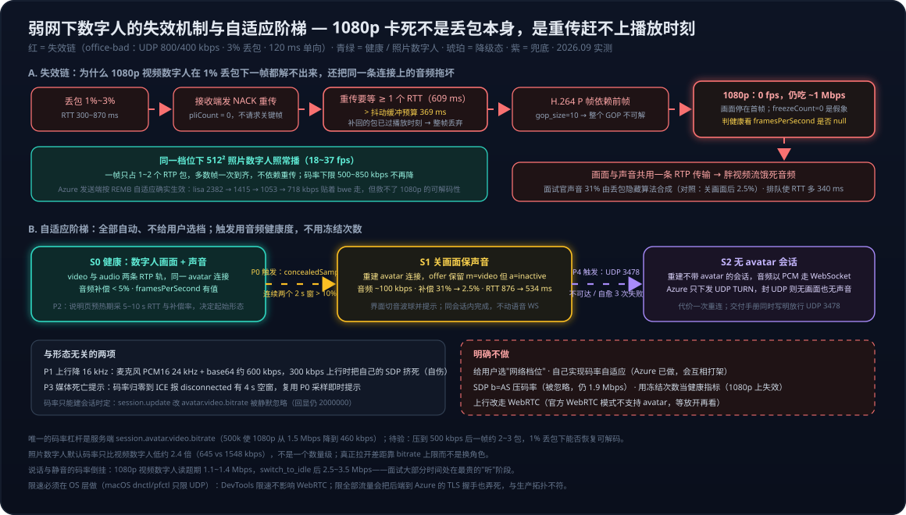

# Voice Live 系列 12：数字人弱网表现——Azure 码率自适应实测、1080p 解码失效机制、胖视频饿死音频与关画面保声音

> 系列03 把数字人出场与对话轮次的延迟测清了，系列10、11 把直连优先、relay 保底的拓扑讲透了，但所有实测都在开发机和云上的好网络上。客户的办公网不是这样：共享上行、VPN、1% 到 3% 的丢包、上百毫秒的时延。这一篇回答三个问题：Azure 数字人流是否自适应码率、卡顿的机制是什么、部署到客户办公网时该定什么规则。方法是浏览器侧 getStats 探针加 OS 层限速，全部数字来自 2026-09-30 的真机实测。
> 结论先看第一节；两个反直觉的机制在第五节（1080p 一帧都解不出来却仍吃带宽、胖视频饿死音频）；决定性对照在第六节（关画面让语音质量提升一个数量级）；自适应设计在第七节。它同时修正了系列05、11 里"照片数字人码率低一个数量级"的说法：默认下只差约 2.4 倍。

---



## 一、结论先行

1. **Azure 数字人发送端协商了 REMB 带宽反馈**（`goog-remb` 加 `abs-send-time`，没有 transport-cc），并且**确实按接收端估计自动降码率**：1080p 视频数字人随网络恶化 2382 → 1415 → 1053 → 718 kbps，全程贴着 `availableIncomingBitrate` 走。"让程序按带宽调码率"这件事 Azure 已经做了，不需要再实现一遍。
2. **客户端没有带宽杠杆。** SDP 里声明的 `b=AS` / `b=TIAS` 上限被 Azure 忽略：加了 `b=AS:500`，1080p 仍以 1.9 Mbps 发送。会话中通过 `session.update` 改 `avatar.video.bitrate` 也被静默忽略，Azure 回 `session.updated` 但回显仍是 2000000。**码率只能在建会话时由服务端 `session.avatar.video.bitrate` 定**：设 500 kbps，1080p 从 1.5 Mbps 降到 460 kbps；设 300 kbps，照片数字人从 645 降到 276 kbps。
3. **自适应救不了 1080p。** 1% 丢包、单向 80 ms 时延下，1080p 视频数字人从第二个采样点起 `framesPerSecond` 为 null，30 多秒里没有解出一帧，画面停在首帧，却仍吃约 1 Mbps。机制是抖动缓冲预算小于 RTT，NACK 重传永远迟到。同档位 512×512 照片数字人稳定 18 到 37 fps。
4. **胖视频流会饿死同一条连接上的音频。** 3% 丢包下，1080p 数字人死前有 31% 的面试官声音是丢包隐藏算法合成的；关掉视频轨后降到 2.5%，RTT 从 876 降到 534 ms，对照组两轮复现。这是最要命的一条：候选人听不清题目，面试直接作废。（31% 与 2.5% 是含静音的原始比值，只统计有声段的可听补偿率见 7.5；结论不变，另有三项与静音无关的证据。）
5. **麦克风上行不是小数目。** PCM16 24 kHz 加 base64 加 JSON 封装实测 540 到 680 kbps。上行限到 300 kbps 时，`session.avatar.connect` 的数 KB SDP 排在几百个音频帧后面发不出去，数字人握不上手。这是自伤，不是环境限制。
6. **UDP 被封则既无画面也无声音。** Azure 下发的 ICE 只有 `turn:relay.communication.microsoft.com:3478` UDP，没有 `?transport=tcp` 候选，客户端也无法自行加 TURN/TCP（凭据是 Azure 的）。avatar 模式下 WS 上不发 `response.audio.delta`，所以封 UDP 后候选人能被听到和转写，面试官却无声无画。
7. **照片数字人的码率优势比预期小**：默认下 645 对 1548 kbps，约 2.4 倍，不是一个数量级。真正拉开差距靠 `video.bitrate` 上限，不是换角色。
8. **所有结论的前提是 RTT 约 300 ms 起**（开发机到 Sweden Central）。失效链由"重传等一个 RTT 大于抖动缓冲"触发，用户离区域近则同样丢包率下不会触发；选离用户最近的数字人区域、或用同区域 AVD 跑浏览器，效果好于任何码率调优，见 5.6。
9. **落地后补两条硬约束。** `session.avatar.connect` 每个会话只接受一次，会话中途不能重协商，所以画面开关都要重建整条会话，约 5 秒；avatar 会话创建有速率限制，约 20 秒内第三次请求被拒并要求 43 秒后重试，被拒会耗尽重连预算把面试打成"语音不可用"。降级策略因此必须不对称：关画面立即，开画面冷却，见 7.4。
10. **实测回填。** 端到端触发已在限速真机验证：第 16 秒主触发关画面，64 秒后自动开回且真实解码。音频补偿率的健康基线随数字人差一个量级，全局阈值不可行，次触发保持关闭，免阈值的主触发在真正需要保护的场景本来就开火；两个都差先关画面且关画面永不等待。被否决的恢复若被记成已发生，画面就永远回不来，真机只差 1 秒抓到正面。见 7.5。
11. **客户网络基线（7.6）。** 先过 UDP 3478 门，再测到媒体服务器的 RTT、UDP 丢包率、可用下行三个数：RTT ≤ 150 ms 且丢包 ≤ 0.5% 才推荐视频数字人（推导值）；RTT 到 300 ms 用照片数字人流畅；300 到 500 ms 或丢包到 1% 用照片数字人并压码率；丢包 3% 起纯音频起步；UDP 不通只剩 WS 纯音频。上行独立于形态，300 kbps 必败、一律 16 kHz。分段测点先看后端有没有 `session.created`，再看 ICE 候选类型，再看选中候选对的 RTT。

## 二、测量方法

**探针。** 一个 opt-in 的 Playwright live spec（真 Azure，不进 CI），在页面注入脚本收集 `RTCPeerConnection` 实例与 SDP，每秒调用 `getStats()` 采 inbound-rtp 的 video 与 audio、selected candidate-pair，并包裹 `WebSocket.send` 统计麦克风上行字节。输出逐秒表与 JSON。可注入 `b=AS` 上限、可切纯音频 offer。

**判断「有没有声音」不能用累积计数器。** 补偿率这类指标回答的是「到达的音频有多少是编出来的」，回答不了「此刻是否有人在说话」。后者用瞬时 `audioLevel` 跨底噪判断：实测静音期 level 稳定在 0.0000–0.0010、`totalAudioEnergy` 恒为 0，声音一到 level 跳到 0.09–0.47，两个数量级的间隔。用 `totalSamplesReceived` 或「`totalAudioEnergy` 有增长」都会误判，三种错法与它们各自为什么失效见 [系列03](Voice%20Live系列03：数字人出场延迟优化——ICE门控根因、实测分解与预热占位策略.md) §6.2。

**限速必须在 OS 层做。** Chrome DevTools 的网络限速只作用于 HTTP 与 WebSocket，不影响 WebRTC 的 UDP 媒体流。macOS 自带的 dnctl 加 pfctl 可以对非 loopback 流量限带宽、丢包、时延，需要 sudo。Chromium 内置的假网络字段试验两种格式都试过，这版 Playwright Chromium 不含该管道，没生效。

**指标定义。**

| 指标 | 来源 | 含义 |
|---|---|---|
| 视频 kbps | inbound-rtp bytesReceived 差分 | 实际到达的视频码率 |
| bwe | candidate-pair `availableIncomingBitrate` | 接收端 REMB 估计，Azure 据此降码率 |
| 冻结 | `freezeCount` / `totalFreezesDuration` | 帧间隔超过均值 3 倍或均值加 150 ms 的次数；25 fps 下一次 RTT 级重传就是一次冻结。**1080p 上会骗人**，见第五节 |
| 解码 fps | `framesPerSecond` | 为 null 即解码器没出帧，判断视频健康要看它 |
| 补偿占比 | audio `concealedSamples` 增速 / 48 kHz | 面试官声音有多少是丢包隐藏算法"编"出来的 |
| 死亡 t | 视频码率归零的秒数 | 媒体流何时死 |

**四档限速（只限 UDP，即 avatar 媒体）。**

| 档位 | 下/上 kbps | 丢包 | 单向时延 | 对应场景 |
|---|---:|---:|---:|---|
| baseline | 无限速 | 0 | 0 | 开发网对照 |
| office-ok | 4000 / 2000 | 0.5% | 50 ms | 一般办公网 |
| office-tight | 1500 / 800 | 1% | 80 ms | VPN、共享上行 |
| office-bad | 800 / 400 | 3% | 120 ms | 拥塞、热点 |
| uplink-starved | 4000 / 300，限全部流量 | 0 | 20 ms | 麦克风 WS 上行对 300 kbps |

**一个方法学坑。** 第一次跑 office-tight 以下三档六轮全失败，页面报 "Voice connection timeout (30s)"，后端日志是 8 次连 `wss://…/voice-live/realtime` 超时。原因是限速范围包含了后端到 Azure 的 TCP，1% 丢包加 80 ms 时延让 TLS 握手过不去，会话根本没建。这在生产上不成立：后端跑在 Azure 内，客户办公网只承载"浏览器到后端 WS"和"浏览器到 Azure WebRTC"两条流。修正为视频档位只限 UDP；uplink-starved 档限全部但丢包为 0，让 TLS 能握手、只暴露带宽问题。

## 三、第一阶段：无限速基线与四个前提逐项验证

**基线与杠杆试验（开发网，每档 45 秒）。**

| 档位 | 角色 | 视频 kbps 均值（min/max） | 帧 | 视频丢包 | 冻结次 / 秒 | NACK | 音频丢包 | RTT ms | 上行 kbps |
|---|---|---|---|---:|---|---:|---:|---:|---:|
| 默认 | amira 照片 | 645 (389/839) | 512×512 @25 | 64 | 34 / 9.1 | 346 | 49 | 315 | 676 |
| 默认 | lisa 视频 | 1548 (887/4164) | 1920×1080 @21 | 32 | 8 / 9.4 | 147 | 55 | 296 | 535 |
| 客户端 `b=AS:500` | lisa | 1920 (764/3644) | 1920×1080 @25 | 1 | 59 / 15.2 | 522 | 45 | 293 | 664 |
| 服务端 bitrate=500k | lisa | 460 (92/1481) | 1920×1080 @25 | 1 | 82 / 23.7 | 498 | 141 | 291 | 623 |
| 服务端 bitrate=300k | amira | 276 (152/370) | 512×512 @25 | 4 | 2 / 0.6 | 8 | 8 | 281 | 542 |
| 会话中 `session.update` 400k | lisa | 前 1184 / 后 2785 | 1920×1080 @25 | — | 72 / 19.3 | 557 | — | — | — |

读法：音频丢包与视频码率无关，可当作"这一轮网络有多差"的对照列，所以 bitrate=500k 那轮的冻结数不能和基线比，bitrate=300k 那轮网络最好、冻结也最少。开发网的随机波动不足以下结论，必须在限速下重复。协商到的编码是视频 H.264（照片数字人还多给了 VP8 选项）、音频 Opus 48 kHz 立体声，说话时约 130 kbps，静音期 DTX 到 1 到 2 kbps。ICE 路径全程 srflx 到 srflx，说明开发机能直连 Azure 媒体服务器、没走 TURN。这一观察修正了系列10、11 初版"relay-only、胜出必是 relay"的表述：Azure 媒体服务器公网可达，relay 是保底不是唯一。

**"好网络"上就已经在卡。** 本机到 Azure 媒体服务器 RTT 约 300 ms。每丢一个视频包，重传要等一个 RTT 以上，解码器冻结 0.3 秒左右。45 秒窗口里视频冻结 9 秒，占 20%。冻结次数与丢包数近似 1 比 1，所以降码率（少发包）在同等丢包率下直接减少冻结。这条对照片数字人成立，对 1080p 要改读为"冻结约等于 NACK 次数除以若干"，见第五节。

**程序自适应的四个前提逐项验证。**

| 前提 | 验证方法 | 结果 |
|---|---|---|
| Azure 会不会随接收端反馈自动降码率 | 需要真实限速 | 第二阶段确认：会，见第五节 |
| 会话中能否改码率 | 连接后 12 秒经语音 WS 发 `session.update`，携带完整 `session.avatar` 对象、`video.bitrate=400000` | Azure 接受消息、回 `session.updated`，但回显 bitrate 仍为 2000000，码率不变。**会话中改不了，只能重建会话** |
| 前端能否承受会话中多出来的 `session.updated` | 同上一轮观察 | 一次性握手守卫拦住了重握手，不会重连或黑屏，安全 |
| 办公网只放 TCP 时能不能连 | Chromium 策略禁用非代理 UDP | **60 秒内 avatar 连接从未到 connected**。Azure 只下发 UDP 3478 的 TURN |

从 `session.updated` 回显顺带拿到的事实：Azure 端 avatar 默认 `video.bitrate=2000000`、`gop_size=10`（25 fps 下每 0.4 秒一个关键帧，解释了 3 Mbps 级别的突发）、`output_protocol=webrtc`。还有一个**说话与静音的码率倒挂**：1080p 视频数字人读题期间约 1.1 到 1.4 Mbps，`switch_to_idle` 之后跳到 2.5 到 3.5 Mbps。数字人"听候选人说话"的静音阶段是最贵的阶段，而面试大部分时间正是这个阶段。照片数字人没有这个现象，全程约 650 kbps。

> [!WARNING]
> **复现失败 ×2（2026-10-02 补测）——上面这个倒挂的幅度不要再直接引用，见下。**

两次重测，同一个资源（swedencentral）、同一个 1080p 视频数字人（lisa / casual-sitting）、同一条开发网，
用 `getStats()` 的 `inbound-rtp` + `session.avatar.switch_to_speaking` / `switch_to_idle` 分段：

| 轮次 | 读题期 | 静音期 | 本地丢帧 |
|---|---|---|---|
| 第一次 | 1.65 Mbps | 1.71 Mbps | 未测（fps 13.2 / 16.0，远低于 25，疑似本地丢帧） |
| 第二次（改进设计） | 1.74 Mbps | 1.61 Mbps | **0.0%** |

**两次码率都基本持平，都没有做出 1.1–1.4 → 2.5–3.5 这个倒挂。**

但第二次（数据干净，丢帧 0）测到了**另一个差别，而且很整齐**：

| | 读题期 | 静音期 |
|---|---|---|
| 帧率 | **12.5 fps** | **25.0 fps** |
| 每帧字节 | **17395** | **8036** |

**读题时帧率恰好是静音时的一半，每帧字节约两倍，乘起来码率持平。** 12.5 正好是 25 的一半、且本地丢帧为
0（不是解不出来，是 Azure 只发了这么多帧），所以更像是**刻意减半**而不是巧合。这同时**推翻了一个顺手的
推断**——"静音期帧间变化大所以帧更大"：实际相反，静音期是"多而轻"的帧，读题期是"少而重"的帧。
（机制为**推断**：读题时渲染管线要逐帧合成面部，算力受限则砍帧率、每帧多给比特保质量；静音放现成素材，
能跑满 25 fps 且帧轻。）

**这两次测量本身的局限，必须一起记下来**，否则它们也会被过度引用：

1. 第二次只拿到**一对** block（读题 7.6 s / 静音 8.6 s），n=1，不是统计结论。
2. 探针节奏退化：9.6 分钟只采到 33 个样本、计划 6 轮只推进了 2 轮 —— 把"推进轮次"和"采样"放在同一个
   循环里，`isEnabled()` 的自动等待把节奏拖到约 17 秒一个样本。再测必须把两件事拆开。
3. 第一次的 `bytes/frame` 用的是 `framesDecoded`，会被**本地**丢帧压低分母而虚高；第二次改用
   `framesReceived` 才干净。**早期任何用 `framesDecoded` 算每帧字节的数字都不可信。**

**不下"原结论是错的"这个判断**：条件不同（网络、时间、Azure 侧行为都可能已变），而且原值出自当时的实测。
标为 **待复测**。要定下来需要第三次：修好探针、拿 4–5 对 block。

**一个下游影响要提前说**：§7.6 的 A 级把"下行 ≥ 4 Mbps"的依据写成"按静音期突发 3.5 Mbps 定"，而这个
3.5 正是没复现出来的那个数。**在复测之前，不要用它作为客户网络分级的硬门槛。**

> **不做第三次（owner 决定，2026-10-03）。** 理由不是"测累了"，是倒挂本身不合产品设计：产品组不会把
> "静音期最贵"做进来。而第二次测到的那套行为——读题 12.5 fps / 每帧 17395 B，静音 25.0 fps / 每帧
> 8036 B，乘积持平——恰好是**合理**的产品行为：按帧率和每帧质量两个旋钮分配固定的码率预算。两个反例
> 加上一个自洽的机制解释，足以把原结论作废；再测一次只会得到第三个反例。
>
> 所以本节的状态是**最终的**：原「静音期码率倒挂」结论作废，静音期**不比**读题期贵；真正可引用的是
> 上面那张帧率 / 每帧字节表。下游（7.6 的 A 级 3.5 Mbps、系列 05 与系列 11 的带宽表）按"约 1.6–1.8
> Mbps 持平"取值，不要再按静音期突发取值。

## 四、通道结构与"关画面保声音"的两条路

开启数字人时有两条独立通道：Voice Live WebSocket（麦克风上行、转写、VAD、题目控制，TCP 443）和 avatar 的 WebRTC 连接（数字人画面加说话声音两条 RTP 轨，服务端唇形对齐，UDP 3478 TURN）。Azure 在 avatar 模式下不在 WS 上发 `response.audio.delta`，所以"UDP 被封"的准确描述是：候选人能被听到和转写，面试官既无画面也无声音。

两条通道的音频格式也不同，容易混淆，这里把"48 kHz""16 kHz""Opus"三个词拆开。

**Opus 是编解码器，PCM16 是原始采样。** WebSocket 上行的麦克风音频是应用自己打包的 PCM16：每个采样点 16 位、每秒 24000 个，不压缩，所以 384 kbps（可降 16 kHz，见系列01 4.5.1）。avatar 连接里的下行音频是 WebRTC 音频轨，WebRTC 强制用 Opus 编码、不允许传裸 PCM；Opus 把原始采样压缩成很小的比特流，大小由码率决定而不是采样率，同样是语音，24 到 32 kbps 就远超电话清晰度，比 PCM16 小十几倍。

**48 kHz 只是 Opus 的时钟标签。** RFC 7587 规定 Opus 在 RTP 与 SDP 里永远写 48000，无论实际内容带宽是多少；Opus 内部按内容自动选带宽档：

| Opus 内部带宽档 | 等效采样率 | 保留的最高频率 |
|---|---|---|
| 窄带 NB | 8 kHz | 4 kHz |
| 宽带 WB | 16 kHz | 8 kHz |
| 超宽带 SWB | 24 kHz | 12 kHz |
| 全带 FB | 48 kHz | 20 kHz |

Azure 的 TTS 输出是 24 kHz PCM，进 Opus 后最多用到超宽带档，SDP 上仍写 48000。所以"Opus 48 kHz"与"该不该用 16 kHz"不是同一个问题：前者是协议标签，后者是采样率的实际选择。

**上行为机器、下行为人，两个方向的合理采样率本来就不同。** 系列01 4.5.1 说 16 kHz 够用，前提是给语音识别器听，识别只需要 8 kHz 以内的信息；下行数字人的声音是给人听的，人耳对 8 到 12 kHz 敏感，那一段决定合成语音是否发闷，这是微软把 TTS 输出定在 24 kHz 的原因。"24 降 16"改的是上行 PCM 那条，下行 RTP 那条不动。

**真正值得质疑的不是 48，而是"立体声、130 kbps"。** 本次 SDP 协商成立体声，实测说话时约 130 kbps、静音期 DTX 降到 1 到 2 kbps。一个说话的人头是单声道源，立体声没有信息增益，只让码率翻倍；Opus 编码语音的常规码率是 24 到 48 kbps，130 kbps 是 Azure 发送端的选择，不是 48 kHz 标签的要求。如果能请求成单声道 32 kbps 左右（6.1 节的音频轨待查项），弱网下音频轨自己占的份额就小了四分之三。这与上行降 16 kHz 是同一个思路在两条管道上的两次应用：上行去掉识别器用不到的高频，下行去掉人耳分不出的第二声道。

**所以下行音频"有没有压缩"的完整答案是：压缩了，但有三点。** 一，它是 Opus，相比上行 PCM 已是压缩形态；二，压得不够紧，130 kbps 立体声对单声道人头源是浪费；三，它的问题不在压缩而在**同车**——与 1080p 视频共用一条 RTP 传输，弱网下视频把管道占满、排队变长，音频包跟着丢和迟到，才有 3% 丢包时 31% 靠算法编出来的声音，关掉视频轨后同一网络降到 2.5%（第六节），证明音频自身没问题，是被视频拖累，这是 P0 把"关画面保声音"排第一的原因。还有一个例外：走 P4 兜底重建不带 avatar 的会话、音频改走 WebSocket 时，下行回到 PCM16 24 kHz 加 base64 的 384 kbps 起，不再压缩；那时可用 `output_audio_format` 的 `pcm16_16000hz` 或 G.711 变体压到 256 或 64 kbps，代价是人耳可感的音质下降（系列01 4.5.1）。

**路 A：同一条 avatar 连接里只收音频。**

| 变体 | Azure 反应 | 结果 |
|---|---|---|
| 去掉 `m=video`（只有 audio） | `error`: "Avatar connection failed: WebRTC SDP negotiation failed: peer connect created failure: None is not in list" | **拒绝**。前端还把这个 error 当成需要重连 WS，连开 3 条 PC 都失败 |
| 保留 `m=video` 但 `a=inactive`，音频 `recvonly` | 正常回 SDP answer，ICE connected，`ontrack kind=audio`，`switch_to_speaking` 后音频 60 到 80 kbps，读题完成；视频 0 kbps | **成功**（建连时）。会话中途不能重协商，见下方修正 |

路 A 两个产品侧注意点：前端"首读等 avatar 就绪"的门等的是首帧视频（系列03 第一节），纯音频时会等满约 6 秒超时才读题，要改成"等音轨或首帧任一"（已改为等媒体就绪）；ICE 一样要求 UDP 可达，路 A 解决的是带宽，不是 UDP 封锁。

> **修正（2026-09-30 落地时发现）**：上表验证的是"建连时就用 `a=inactive`"，不是"会话中途重协商"，这个区别只有真机实现才暴露。`session.avatar.connect` 每个会话只接受一次，客户端事件全集里没有任何断开或重协商事件；连接健康时再发一次 offer，Azure 回 `WebRTC connection is in connected state` 拒绝。所以路 A 不能在同一会话里来回切，画面开与关都要重建整条会话，约 5 秒。路 A 与路 B 的差别由此缩小为"重建时带不带 video 轨"，不再是"要不要重建"。细节与由此得出的冷却策略见 7.4。

**路 B：重建会话，不带 `avatar`。** Azure 改为在 WS 上下发 PCM 音频，前端已有这条播放路径（无角色的 persona 即此模式）。代价是一次重连和几秒中断，但它是 UDP 被封时唯一能出声的路。

## 五、第二阶段：UDP-only 限速数据与五条结论

每档 40 秒，限速只作用于 UDP。"死亡 t"是视频码率归零的秒数，"死前音频补偿"是流死亡之前每秒被丢包隐藏算法合成的音频比例。

| 档位 | 角色 | 视频 kbps | 解码 fps | bwe | RTT ms | 死亡 t | 死前音频补偿 | 冻结 s / 存活 s |
|---|---|---:|---:|---:|---:|---|---:|---|
| baseline | amira 512² | 505 | 24 | 797 | 284 | 存活 | 0.0% | 0.0 / 38 |
| baseline | lisa 1080p | 2382 | 24 | 2714 | 291 | 存活 | 4.9% | 18.5 / 38 |
| office-ok | amira | 782 | 25 | 701 | 432 | 存活 | 2.1% | 19.1 / 39 |
| office-ok | lisa | 1415 | 26 | 1986 | 440 | 存活 | 2.5% | 24.6 / 38 |
| office-tight | amira | 849 | 24 | 1206 | 473 | 存活 | 10.5% | 28.7 / 39 |
| office-tight | lisa | 1053 | **0** | 1111 | 609 | 42 s | 10.7% | — |
| office-bad | amira | 827 | 24 | 504 | 644 | 42 s | 4.5% | 20.3 / 30 |
| office-bad | lisa | 718 | **0** | 597 | 876 | 44 s | **31.3%** | — |

### 5.1 Azure 确实会自适应降码率，方向正确、幅度也够

lisa 的视频码率随网络单调下降：2382 → 1415 → 1053 → 718 kbps，全程贴着 `availableIncomingBitrate` 走。amira 到 500 到 850 kbps 就不再往下，那是照片数字人的下限档，office-ok 下它反而升到 782 kbps，是重传字节。所以"让程序按带宽调码率"Azure 已经做了。

### 5.2 但自适应救不了 1080p：丢包 1% 时它一帧都解不出来

office-tight 和 office-bad 两轮 lisa 的 `framesPerSecond` 从第二个采样点起就是 null，`totalDecodeTime` 和 `jitterBufferDelay` 全程不再增长：约 1 Mbps 的视频字节一直在到，解码器 30 多秒里没有成功解出一帧。画面停在首帧或黑屏，带宽照吃。同一档位下 amira 稳定 18 到 37 fps。

机制是**抖动缓冲预算小于 RTT**：抖动缓冲目标 369 ms，RTT 609 ms。1080p 一帧要 5 个以上 RTP 包，丢一个就要 NACK 重传，重传回来已过播放时刻，整帧丢弃；H.264 的 P 帧依赖前帧，后续整个 GOP 全部不可解。照片数字人一帧只占 1 到 2 个包，多数帧一次到齐，不依赖重传，所以照常播。`pliCount` 全程为 0，说明接收端只靠 NACK 修复、没有请求关键帧重传，这一项在 Azure 侧是否可配值得再查。

**"冻结次数"这个指标在 1080p 上会骗人**：解不出帧就不会产生 freeze 事件，lisa 的 freezeCount 为 0 看起来比 amira 的 90 次"好"，实际是完全不动。判断视频健康要看 `framesPerSecond` 是否为 null。

#### 5.2.1 为什么"自适应救不了"：它调的是带宽，杀死 1080p 的是包数与时序

自适应解决的是"带宽不够"，而 1080p 在这里死掉的原因不是带宽不够，是"每帧包太多、重传赶不上"，两者不是同一个问题。接收端通过 REMB 报告"我估计还能收多少"，发送端把编码器目标码率往下调，实测它确实这么做了，视频字节的确变少了，管道没有被撑爆。但它调的只有一个旋钮：每秒多少比特。它不改分辨率、不改帧率、不改 GOP 长度、不改接收端的抖动缓冲预算。而杀死 1080p 的是另外三个量的关系：

| 量 | 值 | 自适应能否改变 |
|---|---|---|
| 每帧的包数 | 1080p 在 1053 kbps、25 fps 下每帧约 5 KB，仍要 4 到 5 个包 | 只能略减，压到 718 kbps 也还是 3 到 4 个包 |
| 重传一次要等的时间 | RTT 609 ms | 不能 |
| 接收端最多等多久 | 抖动缓冲 369 ms | 不能 |

只要一帧仍是多个包、丢一个就要重传、重传又必然超过抖动缓冲，这一帧就必死，后面整个 GOP 跟着报废。码率从 2.4 M 降到 0.7 M 只是让"每帧 8 个包"变成"每帧 4 个包"，没有跨过"每帧 1 到 2 个包、大多数帧不需要重传"那条线。照片数字人天生在那条线以下，所以同档位照播。

换个说法：自适应回答的是"管子够不够粗"，1080p 遇到的是"信太长拆成好几页寄，丢一页补寄来不及"。管子再细一点，信还是好几页。真正能救它的手段是自适应不碰的那些：把分辨率或码率降到每帧一两个包（第六节末"压到 500 kbps"那个待验假设的由来）；让接收端遇丢包直接请求新关键帧而不是补旧包（`pliCount` 为 0 说明现在没走这条路）；或者把抖动缓冲拉长到超过 RTT（页面侧 `jitterBufferTarget`，代价是音视频整体延迟增加几百毫秒，且追不上排队造成的迟到，见 6.1）。这三样都不在 Azure 的码率自适应里。

一个比喻：1080p 每帧是一封拆成六页寄的信，少一页就读不了，补寄一页要 600 ms，而收件人只等 370 ms 就把这封信扔掉，并且后面的信都是"接上一封说"的，于是整叠信都作废。照片数字人每封信一页纸，寄到就能读。

#### 5.2.2 1080p 与 512×512 之间的换算：像素 → 比特 → 包数

两者之间没有直接的"单位换算"，1080p 和 512×512 说的是像素数，而卡不卡取决于每帧多少个 RTP 包。中间要经过三步，每一步都不是线性的。

**第一步，像素数，纯几何。**

| | 分辨率 | 像素数 | 比值 |
|---|---|---:|---:|
| 视频数字人 | 1920×1080 | 2,073,600 | 约 7.9 倍 |
| 照片数字人源 | 512×512 | 262,144 | 1 |

系列05 说的"差了八倍像素"就是这个数。照片数字人的输出画布也可以是 1920×1080，512×512 是 VASA-1 生成的人头本身的分辨率，放进大画布后周围是静态背景。

**第二步，像素数到每帧比特数，取决于画面里有多少东西在变。** H.264 的 P 帧只编码相对上一帧的变化：1080p 视频数字人是真人实拍素材回放，整个半身、衣服褶皱、背景噪点都在变，每帧要编码的差异多；照片数字人只有一个 512×512 的头在动，画布其余部分静止，压缩后几乎为零。所以码率差距小于像素差距，实测只有 2.4 倍而不是 8 倍。用实测码率除以帧率得到每帧平均字节数：

| | 码率 | 帧率 | 每帧平均 |
|---|---:|---:|---:|
| 视频数字人 baseline | 1548 kbps | 25 | 约 7.7 KB |
| 视频数字人 office-tight | 1053 kbps | 25 | 约 5.3 KB |
| 照片数字人 | 645 kbps | 25 | 约 3.2 KB |

"平均"掩盖了一件事：每 10 帧有一个关键帧，它比 P 帧大很多倍。照片数字人的平均 3.2 KB 里，关键帧可能占十几 KB，中间的 P 帧只有 1 到 2 KB。

**第三步，每帧字节数到每帧包数。** RTP 包的载荷上限约 1200 字节，超过就拆。7.7 KB 要拆 6 到 7 个包，5.3 KB 要 4 到 5 个包，照片数字人的 P 帧 1 到 2 KB 就是 1 到 2 个包。这就是"1080p 一帧 5 个以上包，照片数字人一帧 1 到 2 个包"的来源，说的是常态下的 P 帧，关键帧两边都是多包的。

**为什么最后只看包数。** 丢包按包随机发生，一帧的包越多，"至少丢一个"的概率越高；而只要丢一个，在 RTT 大于抖动缓冲的条件下这一帧就必死。1% 丢包下，5 个包的帧完整到达的概率约 95%，2 个包的帧约 98%，看起来差得不多，但 GOP 里任何一帧死掉整段都报废，10 帧连乘之后差距就拉开了，再加上丢包往往成串，实测就成了一个 0 fps、一个 18 到 37 fps。

整条换算是：像素数决定"有多少东西可能要编码"，画面变化量决定"实际编了多少比特"，比特数除以帧率再除以包大小决定"一帧几个包"，包数决定"丢包时这一帧活不活"。8 倍像素差最后落到弱网上是"每帧 5 个包对 1 到 2 个包"的差别，这才是起作用的单位。

### 5.3 胖视频流会饿死同一条连接上的音频

面试官的声音和画面共用一条 RTP 传输。office-bad 档 lisa 死前有 31.3% 的音频是丢包隐藏算法合成的，同档 amira 只有 4.5%。网络差时 1080p 数字人不仅自己不动，还把面试官的声音搞坏到听不清。流死亡之后补偿率升到 100%，即完全静音。

### 5.4 媒体死亡后自愈生效，但有几秒空窗

office-bad-amira 在 t=42 视频归零，t=46 ICE 报 disconnected，t=49 触发第一次恢复，t=50 重建 PeerConnection。宽限窗口按设计工作（系列10 的媒体层自愈）。但"码率归零"到"ICE 报错"之间有 4 秒，界面仍显示已连接，用户看到的是画面卡住且无提示。（已补：降级判决复用每 2 秒的媒体采样，视频归零即提示，不再等 ICE，见 7.4。）

### 5.5 麦克风上行会把自己挤死

上行限到 300 kbps（无丢包）后两轮均失败：能建起会话的那一轮里 ICE 收集从平时的 1 秒拖到 4.3 秒，`session.avatar.connect` 发出后 SDP 应答等不到，最终 "Voice connection timeout (30s)"。原因不是网络慢，是麦克风流把上行占满了：PCM16 24 kHz 加 base64 约 600 kbps，管道只有 300 kbps，携带数 KB SDP 的 `session.avatar.connect` 排在几百个音频帧后面发不出去。降采样率到 16 kHz（约 400 kbps，见[系列01](Voice%20Live系列01：Agent实现架构——从级联流水线到Azure%20Voice%20Live%20API.md) 4.5.1）能直接消除。

### 5.6 所有结论的前提：RTT 约 300 ms 起，区域距离比丢包率更决定结果

RTT（Round-Trip Time，往返时延）是一个包从浏览器到对端再回来的总时间。本文的失效链靠的是"重传要等一个 RTT，而 RTT 大于抖动缓冲预算"这一关系，所以 RTT 的基线决定了同样的丢包率会不会触发它。这批实测的开发机在亚洲、数字人区域在 Sweden Central，无限速时 RTT 就有约 300 ms，限速再加 120 ms 单向时延后到 600 到 870 ms。如果用户就在数字人区域附近，RTT 只有几十毫秒，1% 丢包下重传轻松落在 369 ms 的缓冲内，1080p 不会死，音频也不会被饿到 31%。

这解释了一个此前只有经验没有机制的现象：用与 Voice Live 同区域的 Azure Virtual Desktop 跑浏览器给客户演示，效果明显好于本地浏览器。不是因为 AVD 的网络"更好"，而是浏览器到媒体服务器的 RTT 从 300 ms 降到区域内的几十毫秒，整条 NACK 迟到的链路根本不触发；同时后端到 Voice Live 也是区域内往返（系列03 5.4 节实测省 1.6 到 1.7 秒）。

对部署的含义：选离**用户**最近且支持数字人的区域，对弱网表现的影响可能大于所有码率、GOP 与编码调优；本文的限速数据应读作"RTT 300 ms 起的用户"的结果，欧洲用户与亚洲用户看到的会是两套曲线。跨洲用户如果只能用远区域，AVD 或同区域的远程桌面是把 RTT 问题从客户网络挪走的现成手段，代价是远程桌面自身的画面延迟与成本。

## 六、决定性对照：关画面留声音

同一 office-bad 档位四轮对比。"音频死亡"是补偿比例达到 100% 的时刻。表中"音频补偿"为含静音的原始比值，静音段被填充也计入分子；只统计有声段的可听比值见 7.5，量级仍差一个数量级以上，结论不变。

| 变体 | 视频 kbps | 死前音频补偿 | 音频丢包 | RTT ms | 音频死亡 t | ICE |
|---|---:|---:|---:|---:|---|---|
| lisa 完整视频（第 1 轮） | 608 | 31.3% | 505 | 876 | 44 s | 中途 disconnected |
| lisa 完整视频（第 2 轮，复现） | 599 | **30.7%** | 525 | 871 | 48 s | 全程 connected |
| **lisa 纯音频**（video 轨 `inactive`） | 0 | **2.5%** | **66** | **534** | 49 s | **全程 connected** |
| amira 纯音频 | 0 | 4.8% | 72 | 532 | 42 s | 中途 disconnected，恢复已触发 |
| amira 完整视频 | 658 | 4.5% | 67 | 644 | 42 s | 中途 disconnected，恢复已触发 |

**关掉画面让语音质量提升一个数量级。** 音频补偿从 31% 降到 2.5%，约 12 倍；音频丢包从 505 到 525 个降到 66 个。31% 意味着三分之一的语音是算法编出来的，候选人听到断续含混的题目；2.5% 属于偶尔一个字发毛，完全可听。RTT 从 876 降到 534 ms，这 340 ms 是自己的视频流在管道里排队造成的自伤延迟，同时拖慢轮次交接。对照组两轮 31.3% 与 30.7%，结论是复现的。

**但纯音频不等于不死。** lisa 纯音频全程 ICE connected 最健康，amira 纯音频仍在 46 秒掉线并触发恢复。3% 丢包下单次 40 秒窗口方差很大，可信的说法是：纯音频把"听不清"变成"听得清"，但没有让连接不死。所以纯音频降级和媒体层自愈两件事都要有。

**一个便宜的待验假设。** 1080p 在 1% 丢包下解不出帧的直接原因是一帧跨 5 个以上包。如果把 `video.bitrate` 压到 500 kbps，一帧约 2 到 3 个包，可能恢复可解码性（画面变糊但动起来）。这一档还没在限速下测过。

### 6.1 服务端 avatar 可调项复核：没有接收端缓冲参数，但有三个未验证的字段

上面几节反复出现"抖动缓冲预算 369 ms"这个量，它不是浏览器的固定配置，是 Chrome 的自适应抖动估计器按观测到的到达抖动、帧大小波动与 RTT 在运行时算出来的目标值，对 RTT 打折且有上限，取向是实时通话的低延迟。Voice Live 侧对它没有任何对应参数：2026-04-10 版 API 参考里 avatar 配置的全部字段都是发送端编码器与传输协商的设置，没有 jitter buffer、playout delay 或 latency 一类字段。这符合协议分工，接收端缓冲本来就不归服务端管。页面侧唯一的入口是 `RTCRtpReceiver.jitterBufferTarget`（毫秒，Chrome 上限 4000），音频轨有各自独立的目标，要保口型同步得两边一起设。发送端理论上可经 RTP 头扩展 playout-delay 影响接收端，若 Azure 用了会出现在 SDP answer 的 `a=extmap` 行里，探针抓过 SDP，待 grep 确认，判断大概率没有。

> **⚠️ 字段清单已被修正（2026-10-03）。** 下表写于只读 API 文档的时候，把 `video.bitrate` 标成"唯一已验证的
> 杠杆"，这句话后来被我在别处引用成"服务端只有码率一个杠杆"——**那是错的**。直接读 SDK
> `azure-ai-voicelive 1.3.0b1` 的生成模型（它是服务 schema 的权威投影，比文档页更全）：
>
> - `VideoParams` 的字段是 `bitrate`、`codec`、**`crop`**（`VideoCrop`：`top_left` / `bottom_right`
>   两个整数点）、**`resolution`**、`background`、`gop_size`。所以**分辨率和裁剪都是可调的**，而不是
>   "只有码率"。
> - `AvatarConfig` 上还有一个独立的 **`Scene`**：`zoom`（(0, +∞)，**小于 1 是缩小**）、`position_x` /
>   `position_y`（[-1, 1]，按画面宽高的比例平移）、`rotation_x/y/z`（[-π, π]）、`amplitude`（(0, 1]，
>   动作幅度）。
>
> **`scene.zoom` 已实测有效**（2026-10-03，照片数字人 amira，三次会话各抓一帧对比）：不传 = 头到下巴；
> `0.6` = 露出肩膀与胸部但人偏小、白边多；`0.78` = 头肩像，翻领与里面的上衣可见。项目已按 0.78 落地
> （照片数字人专用；视频数字人本来就是站姿，缩小只会让人变小）。
>
> 对弱网的含义还没测，但现在至少知道**路是通的**：`VideoParams.resolution`（**数字人视频轨的分辨率，
> 与麦克风上行的音频采样率是两件无关的事**——后者见系列 01 4.5.1）直接对着系列 12 的核心结论:
> 1080p 在 1% 丢包下一帧都解不出来，而"把分辨率降到每帧一两个包"此前被当成只能靠换形象实现。
> 下表其余内容不变，只是"唯一"二字作废。

服务端能调的全部字段如下，其中三个与弱网直接相关但尚未验证：

| 字段 | 默认值 | 管什么 | 与弱网的关系 |
|---|---|---|---|
| `video.bitrate` | 2000000 | 编码器目标码率 | 已验证的杠杆（第三节）。**不是唯一的**，见上方修正 |
| `video.codec` | h264，文档称目前仅此一值 | 编码器 | 不是杠杆，见下 |
| `video.gop_size` | 10，范围 1 到 2000 | 关键帧间隔 | **待验**：调小则丢帧后等下一个关键帧更短、恢复更快，调到 1 即全关键帧、每帧独立，代价是码率大涨。与 bitrate 一起是服务端仅有的两个能改变"丢包后能不能活"的旋钮，应与"压到 500 kbps"的假设一起在限速下测 |
| `video.resolution` / `video.crop` / `video.background` | — | **视频轨**的画面内容 | **待验，且现在是最有希望的一条**：分辨率决定每帧的字节数，从而决定每帧拆成几个包。1080p 一帧要跨很多个包，丢一个包整帧报废、连带 GOP 报废（第四节），所以它在 1% 丢包下一帧都解不出来；而 512×512 照片数字人一帧只占 1 到 2 个包，同档位照常播（第四节实测）。把 `video.resolution` 调小 = 让视频数字人也落到"每帧一两个包"那一侧，此前这件事被当成只能靠换成照片形象来实现。纯色 `background` 更好压，是次要项 |
| `ice_servers` | Azure 中继 | 走哪个 TURN | 见系列11 |
| `output_protocol` | webrtc，可选 websocket | 媒体从哪条通道下发 | **待验**：若 websocket 意味着数字人音视频也能改走 WebSocket 下发，UDP 被封时的兜底就不必重建"不带 avatar 的会话"，而是保留数字人改协议；需实测它在 avatar 模式下到底下发什么 |
| `output_audit_audio` | false | WebRTC 模式下是否同时把音频经 WebSocket 转发 | **待验**：为 true 时 WS 上终于能看到 avatar 会话的音频，直接解决系列03 第六节结论 4 留下的"数字人开口相对首段音频的增量"待测项；也可能成为关画面之外另一条保声音的路，虽然文档把它定位为审计调试用途 |

**关于 `video.codec`：不是可用的杠杆。** API 字段目前只接受 h264；第三节协商到的 SDP 里照片数字人多给了一个 VP8 选项，说明 Azure 编码侧可能有第二种实现，但没有暴露为可配项，浏览器按 offer 顺序仍选 H.264。即使将来开放，对弱网的影响也要分开看：

| 编码 | 同画质码率（相对 H.264） | 浏览器解码 | 对本文失效链的意义 |
|---|---|---|---|
| H.264 | 基准 | 几乎所有设备硬解，CPU 与功耗最低 | 每帧包数由码率与分辨率决定，编码本身不改变"多包帧丢一个就死"的结构 |
| VP8 | 约相当 | 多为软解 | 无收益，只多耗客户端 CPU |
| VP9 | 约省 30% 到 40% | 新设备硬解，旧设备软解 | 同画质下每帧少约三分之一的包，对失效链有实际帮助；支持 SVC 分层，理论上可让接收端按带宽选层 |
| AV1 | 约省 50% | 仅最新设备硬解 | 收益最大，但老办公电脑软解 1080p 会先把 CPU 打满 |

结论：在"客户办公网、机器配置不可控"的场景下，H.264 的普适硬解比编码效率更重要，默认值是对的；能压包数的手段仍是分辨率与码率，不是换编码。

**音频轨侧待查。** 下行音频是 Opus，SDP 的 fmtp 是否带 `useinbandfec=1`（带内 FEC 不等重传即可恢复丢包，正对高 RTT）、是否协商成立体声（人头说话用单声道足够）、有没有 RED 冗余音频，探针抓的 SDP 里 grep 即可。浏览器可以在 offer 的 fmtp 里请求 `useinbandfec=1`、`stereo=0`、`maxaveragebitrate`，发送端通常尊重，与被忽略的 `b=AS` 不是同一机制。这直接作用在"胖视频饿死音频"那 31% 上。

## 七、自适应设计建议

### 7.1 已确认的七条事实

1. Azure 会按接收端带宽估计自动降码率，这件事不用自己做。
2. 码率只能在建会话时定；会话中 `session.update` 改 `avatar.video.bitrate` 被静默忽略。
3. 1080p 在 1% 丢包下一帧都解不出来，却仍吃约 1 Mbps；抖动缓冲预算小于 RTT 时 NACK 修复永远迟到。
4. 画面和声音共用一条传输，胖视频流会把自己的音频饿死：3% 丢包下音频补偿 31%，关视频后 2.5%。
5. 关画面留声音可行（video 轨 `a=inactive`，约 100 kbps），但只能在建连时定：`session.avatar.connect` 每会话只接受一次，中途切换要重建会话（7.4 修正）。
6. 麦克风上行 600 kbps 在窄上行下会挤死自己的信令，导致数字人握不上手。
7. avatar 会话创建有速率限制：约 20 秒内第三次请求被拒并要求 43 秒后重试；被拒的请求会走完重连预算，最终判成"语音不可用"（7.4）。

### 7.2 P0 到 P4，全部自动

**P0：把"关画面"做成自动降级，触发条件用音频健康度而不是画面健康度。** 前端每 2 秒读 `getStats()`，算音频 `concealedSamples` 的增速。连续两个窗口超过 10%（48 kHz 下约 4800 样本/秒）就重建 avatar 连接、video 轨标 `inactive`，界面切成音波球并提示"网络较弱，已切换为语音模式"。选音频指标而不是冻结次数，是因为冻结次数在 1080p 上会骗人，而音频补偿率直接对应"候选人能不能听清题目"，正是要保的东西。（已落地，形态有变：触发改成两级，主触发免阈值；切换需重建会话；开画面加冷却。见 7.4。端到端已在限速真机验证；音频补偿率次触发因基线随数字人变化而保持关闭，这里的 10% 阈值作废。见 7.5。）

**P1：麦克风上行降到 16 kHz。** 上行从约 600 降到约 400 kbps，消除第 6 条的自伤，与数字人无关，收益独立。为什么 Voice Live 默认 24 kHz、降了会不会掉准确率、为什么必须前后端同时改，见系列01 4.5.1。（已落地并 A/B 验证：24 与 16 kHz 词错误率都是 0.0%，见 7.4。）

**P2：开场前探测决定起始形态，而不是决定码率。** 说明页预热阶段（系列03 5.2 节）已经在建连接，顺便采 5 到 10 秒的 RTT 与音频补偿率：健康则正常进入数字人，不健康则直接以纯音频起步，避免用户先看到一段卡死的画面再被降级。码率由 Azure 自己管，探测的产出是"要不要脸"这个布尔值。

**P3：媒体死亡的空窗与提示。** "码率归零"到"ICE 报 disconnected"之间有 4 秒，复用 P0 的采样，归零即提示，不必等 ICE。自愈重建逻辑本身工作正常。（已落地。）

**P4：UDP 不可达的兜底。** 重建一个不带 `avatar` 的会话，让音频以 PCM 走 WebSocket。交付手册同时写明放行 UDP 3478。

### 7.3 明确不做的

- 不做"网络档位"给用户选，对用户负担太重，上面四项都是自动的。
- 不自己实现码率自适应，Azure 已经在做，重复实现只会互相打架。
- 不用 SDP `b=AS` 压码率，Azure 忽略。
- 不用"冻结次数"当健康指标，1080p 上完全失效。
- 上行不改走 WebRTC，官方 WebRTC 模式明确不支持 avatar（系列10 相关讨论），等 Azure 放开再看。
- 不按数字人配阈值表；音频补偿率不做全局阈值触发，它的健康基线随形象差一个量级。真要加回来，做成与"视频确实在吃带宽"的合取，且等一个真实案例出现（7.5）。

### 7.4 落地补记：两条 Azure 硬约束与不对称冷却

> 2026-09-30 晚补记。P0、P1、P3 按上面的设计交给 coding agent 实现，真机对接时撞到两条计划里没有的约束，它们改变了 P0 的形态。本节只记与设计不同的部分和踩到的坑。

**约束一：`session.avatar.connect` 每个会话只接受一次。** 第四节验证的是"建连时就用 `a=inactive`"，不是"会话中途重协商"，两者的区别只有真机才暴露：连接健康时再发一次 offer，Azure 回 `WebRTC connection is in connected state`；客户端事件全集里也没有任何断开或重协商事件。所以画面的开与关都要重建整条会话（WS 加 WebRTC），约 5 秒，期间面试官短暂静默。路 A 与路 B 的差别由此缩小为"重建时带不带 video 轨"。

**约束二：avatar 会话创建有速率限制。** 约 20 秒内的第三次创建请求被拒，响应要求 43 秒后重试。危险在连锁反应：被拒的请求会走完前端的重连预算，最终让页面判定"语音不可用"并切到纯文字，一次网络抖动反而把面试打死。这与系列02 记的"每分钟 30 个新连接"不是同一个限制，这条更紧，且专门针对 avatar 会话。

**由此得出不对称冷却。** 两个方向的代价不同：关画面是救场动作，晚一秒候选人就多听一秒合成音；开画面是锦上添花，但每次都消耗一次会话创建配额，还可能再次触发降级形成震荡。

| 动作 | 触发 | 延迟 | 说明 |
|---|---|---|---|
| 关画面（降级到纯音频） | 判决成立即执行 | 无 | 先关掉仍在吃带宽的旧连接，再请求上层重建不带视频轨的会话 |
| 开画面（自动恢复） | 健康保持 45 秒，且距上次降级至少 60 秒 | 60 秒起 | 失败一次门槛翻倍：45 → 90 → 180 秒；两次失败后本场永久纯音频 |
| 开画面（手动） | 用户点击 | 冷却期内按钮禁用 | 界面显示纯音频提示与开关 |

自动恢复的次数上限做成一个常量，改成 0 即彻底关掉自动恢复，只留手动开关。

**判决逻辑做成纯函数，两级触发。** 主触发不依赖阈值：视频字节仍在流入但已解码帧数不再增长，这正是 5.2 节"0 fps 却仍吃 1 Mbps"的直接判据，不需要标定。次触发是音频补偿率 `concealedSamples / totalSamplesReceived`，阈值暂定，探针已补采标定所需的计数器；因主触发免阈值，次触发标定不准也仍能工作。`freezeCount` 明确禁用。媒体层每 2 秒采样一次，判决降级时立刻关掉浪费带宽的旧连接再请求重建；5.4 节"码率归零到 ICE 报错之间 4 秒谎报已连接"的空窗由同一采样补掉。首读的门从"等首帧"改为"等媒体就绪"（音轨或首帧任一），纯音频不再白等 6 秒。

**一个自己引入的坑：有意重启前要先摘掉旧连接的关闭回调。** 否则新的连接流程已把状态标志复位，旧 socket 关闭时其回调再触发一次重连，表现为每次切换都开两个 avatar 会话，直接撞上约束二。任何带自动重连的 WS 客户端在有意重启时都会遇到"重连处理器也响了"，切换前显式解绑是通用修法。

**P1 已落地并验证。** 麦克风上行降到 16 kHz，前后端各一处常量，后端把生效采样率回显在连接确认事件里供前端比对防两边漂移。用同一段录音做假麦克风，在 24 与 16 kHz 会话下各转写一遍，词错误率都是 0.0%，整句逐字一致，系列01 4.5.1 的推理成立。顺带澄清一个容易混的点：假麦克风素材的 WAV 是 48 kHz，那是文件的采样率，不是会话参数；真实麦克风硬件通常也是 48 kHz，浏览器按会话要求重采样，`input_audio_sampling_rate` 只有 16000 与 24000 两个取值。

**尚未验证（已在 7.5 回填）。** 自动降级的端到端触发与音频补偿率阈值标定，答案见 7.5：前者已在限速真机验证，后者的结论是全局阈值不可行、次触发保持关闭。第六节"1080p 压到 500 kbps 是否恢复可解码"与 6.1 三个待验字段状态不变。

### 7.5 实测回填：端到端触发验证、阈值标定的答案与恢复失同步的坑

> 2026-09-30 深夜补记。7.4 末尾留的两项"尚未验证"——限速真机上的端到端触发、音频补偿率阈值标定——本节给出答案。一共跑了六轮，只有最后一轮配置正确；前五轮的失效原因全在测试工具而不在被测逻辑，一并记下，因为每一条都通用。

**端到端触发已验证。** 1080p 视频数字人，第二节的 UDP 限速加 3% 丢包档位，结果如下。

| 事件 | 时刻 | 判据与结果 |
|---|---|---|
| 关画面 | 第 16 秒 | 主触发（免阈值）：视频字节在涨、已解码帧数不增，RTT 872 ms |
| 开画面 | 降级后 64 秒（预估约 66 秒） | 健康保持 45 秒且 60 秒冷却期满，重建带视频轨的会话 |
| 恢复后 | 10 个采样窗口 | 已解码帧数增加 357、视频约 3.0 MB，画面真的在动，不只是 SDP 里多了一条 m=video |
| 恢复资格 | 成立 | 约 283 万音频样本中可听补偿率 0.475%，远低于 3% 的恢复门槛 |



**抓到一个只差 1 秒的失同步缺陷。** 第一次恢复判决时，决策层判定"链路健康，可以开画面"，执行层却因 avatar 会话创建的冷却还剩 1 秒而回答"再等"。修复前，被否决的切换会被决策层记成"已发生"，它从此认为画面已经开着，不会再问，表现就是画面永远回不来。这正是前几轮"只验证了关、没验证开"时看不见的那条路径，此前只有单元测试覆盖，这次真机抓到了正面。修法是执行层必须把"否决"回传，决策层只在执行确认后才更新自己的形态记录。2 秒后第二次判决通过，画面回来。这类"决策层与执行层各记一份状态"的失同步，在任何带冷却或限速的自动切换里都会出现；单元测试很难构造只差 1 秒的时序，真机才抓得到。

**阈值标定有了答案，而且推翻了 7.4 的假设。** 两个数字人并排跑纯音频，看可听补偿率（只统计有声段，静音填充不计入分子）。

| 数字人 | 健康基线 | 限速中 |
|---|---:|---:|
| lisa（1080p 视频数字人） | 0.3 到 0.5% | 21.9% |
| amira（512×512 照片数字人） | 8 到 19.3% | 16.9% |

指标本身不是没用：在 lisa 上两个分布差约 45 倍，任何居中的阈值都干净。问题是**基线随数字人变化而阈值是全局的**，候选值 0.15 正落在 amira 的健康区间里（照片数字人健康基线为何这么高尚未深究）。所以次触发（音频补偿率）**保持关闭**，只留主触发。这么做代价为零：真正需要保护的场景是 1080p 在丢包下解不出帧，那里主触发本来就开火，本轮就是；照片数字人一帧只占 1 到 2 个包、总共几百 kbps，关掉它的画面对声音几乎没有帮助。次触发唯一能"额外"生效的场合，恰好是它最不可靠、也最没价值的场合。

**如果以后要把次触发加回来，形状已定但未实现。** 不按数字人配两套阈值，那是一张每加一个形象就要重测的表。改成合取：声音受损**并且**视频确实在吃带宽（视频字节增速高于一个与形象无关的绝对值）。两个数字人真正的差别不是"照片还是视频"，而是视频占的带宽差一个数量级；照片数字人永远达不到"视频在吃带宽"这一条，天然沉默，1080p 才允许声音这个信号说话。一条全局规则两边都对，不需要知道任何形象的声音基线。启用它的前提是出现一个真实案例："画面能解码、声音却单独变差"。第六轮的数据里没有这种组合：1080p 在丢包下画面先崩，声音损伤与画面崩溃同时发生，画面信号足够代表。没有真实案例驱动就加触发条件，前六轮已经演示过会付出什么。

**牺牲顺序确认：两个都差，先关画面，且关画面永不等待。** 所有冷却检查都只在"切到视频"的分支上，关画面走另一条没有等待的路，因为它是救场动作，晚一秒候选人就多听一秒合成音。阶梯是：① 画面与声音同时变差，立刻关画面，同一条连接的带宽全留给声音；② 关了画面仍连不上，重建纯音频会话，按翻倍退避重试；③ 重试耗尽，界面回到音波球，此时声音也没了，因为面试官的声音和画面走同一条 WebRTC 传输。第 ③ 步是物理限制不是设计缺陷：Azure 只下发 UDP 中继地址，UDP 被完全封死时画面与声音一起消失，兜底是 P4（重建不带 avatar 的会话让音频走 WebSocket），是独立的一件事。

**四种组合各会发生什么。** 启用的判决只看视频一个信号，完全不参考音频；音频只在"恢复资格"里出现（可听补偿率低于 3% 才允许开画面）。

| 画面 | 声音 | 当前行为 |
|---|---|---|
| 字节仍在流入、解码帧数不增 | 好坏不论 | 主触发开火，立刻关画面，重建纯音频会话。实测"两个都差"就是这一行：1080p 丢包时帧解不出，声音同时受损 |
| 正常 | 单独变差 | 什么都不做。次触发已关闭，这是承认的缺口，等真实案例再以合取形式启用 |
| 字节不再流入 | 也断了 | 主触发不开火（字节不涨），由媒体层自愈接管：码率归零即提示、ICE 断开即重建，翻倍退避，耗尽后音波球（5.4、7.4） |
| 正常 | 正常 | 不动；处于纯音频时，健康保持 45 秒且冷却期满才开画面 |

**一处更正：第六节的 31% 是含静音的原始比值。** 面试官大部分时间在等候选人说话，静音段被丢包隐藏算法填充也计入 `concealedSamples`，所以 31.3%、30.7%、2.5% 这些数字是原始补偿率，不能读成"三分之一的可听语音被合成"。修正后的可听补偿率在 lisa 上健康 0.3 到 0.5%、限速 21.9%，量级仍差一个数量级以上。第六节的核心结论不受影响，它靠的是三项与静音无关的证据：零帧解码却仍吃约 1 Mbps、音频丢包 505 对 66、RTT 876 对 534 ms。原文数字保留并加注，不悄悄改。

**六轮里五轮无效，原因都在测试工具。**

1. 假麦克风的音频文件路径是个占位符，Chromium 静默接受了不存在的文件，喂进去的是静音，前两轮什么都没测到。
2. 指标把静音当损伤（上一条的下游）：面试官沉默是常态，程序却一直以为网络很糟，画面自然不敢开回来，第三、四轮如此。
3. 探针脚本在 ES module 环境下取自身路径的写法失效，落盘的 JSON 根本没写出去。
4. 最贵的一条：没有钉住被测数字人。默认形象是照片数字人，它在丢包下解码毫无问题，主触发在这个配置下不可能开火，前五轮都在测一个不可能触发的条件。换成 1080p 后一轮定案。

真正让局面转向的改动不是任何一个修复，而是**让工具报告它测到了什么，而不只是通过或失败**：每个采样窗口落一行 JSON、可听与原始补偿率并排打印、采样器每十个样本吐一次摘要。加上这些之后，一轮就看清了问题在哪。

### 7.5.1 防误读：关画面不是提速手段（2026-10-01 实测）

容易被当成「关掉画面所以更快了」。实测不是：内置题库、amira 钉住、循环 WAV 作答，提交答案 → 声音可听，两种模式**音频都走 WebRTC**（纯音频是同一条连接把 video m-line 标 `a=inactive`，并断言该连接视频字节为 0）：

| 轮次 | 带画面 | 关画面 |
|---|---|---|
| 第 1 轮 | 1071 ms | 972 ms |
| 第 2 轮 | 1069 ms | 1076 ms |
| 第 3 轮 | 1067 ms | 1172 ms |
| 中位 | **1069 ms** | **1076 ms** |

中位差 7 ms，在 run 间噪声内。**关画面买的是带宽与可解码性，不是每轮延迟**——这正是本文 5.2 与 5.3 的结论：网络好的时候视频在延迟上不要钱，所以纯音频的全部价值落在网络差的那一侧。反过来说，这也回答了「那为什么不干脆一直用纯音频」：网络好时它什么都不买。

另记一笔一次性代价：降级要重建整个会话（7.4 的硬约束一），实测**从点下开关到声音回来约 4.9 秒**。这不是每轮成本，但它是弱网路径上候选人唯一会抱怨的几秒。

另外，逐轮本身不退化：带画面三轮 1071 / 1069 / 1067 ms，几乎重合（[系列03](Voice%20Live系列03：数字人出场延迟优化——ICE门控根因、实测分解与预热占位策略.md) §6.1）。

### 7.6 给客户的网络基线与配置推荐：先测三个数，再对号入座

> 前几节回答"机制是什么"，这一节回答客户会问的"我们的网络到底能不能用数字人、该用哪种"。所有阈值来自第五节的八个实测点（亚洲开发机到 Sweden Central，无限速 RTT 约 300 ms，四档限速），**实测锚点与推导区间分开标**，未测过的不冒充测过。

#### 7.6.1 客户要测什么

只需要三个数加一道门，都能从一次 60 秒的探针会话里读出来（第二节的探针，或说明页预热阶段的 P2 探测）。

| 测什么 | 从哪读 | 为什么是它 |
|---|---|---|
| **UDP 3478 出向是否可达** | avatar 连接能否到 `connected`；ICE 候选里有没有 srflx 或 relay | 一道门。Azure 只下发 UDP 中继、没有 TCP 候选，封了就没有任何形态的数字人（第三节前提四、6.1） |
| **RTT** | candidate-pair 的 `currentRoundTripTime`，取 p95 | 失效链的主变量：重传要等一个 RTT，RTT 大于抖动缓冲预算（实测约 370 ms）时多包帧必死（5.2、5.6）。注意是浏览器到**媒体服务器**的 RTT，不是到公网网关的 ping；媒体服务器没有固定域名，对端从哪来、离线怎么代理见 7.6.6 |
| **UDP 丢包率** | 音频轨 `packetsLost / (packetsReceived + packetsLost)` | 音频丢包与视频码率无关，是"这条网络有多差"最干净的读数（第三节读法） |
| **可用下行** | candidate-pair `availableIncomingBitrate`，取 p50 | Azure 据此降码率；也是判断能不能喂饱某个形态的直接数 |
| **上行带宽**（单独测） | 限全部流量的一次上行探测，或 WS 上行字节速率对比设定值 | 与形态无关，任何一级都要过：麦克风 PCM 约 400 到 600 kbps，300 kbps 必败（5.5） |

三条测法要求：**在真实座位、真实时段测**（上班高峰、VPN 开与关各一遍），每处跑三次取最差一组；测的是到**目标数字人区域**，换区域要重测；探针本身用 avatar 会话，不要拿网页测速站的数字代替，它测的是到 CDN 的 TCP。

#### 7.6.2 五级对照：网络分级决定起始形态



| 级 | 网络特征（RTT 到媒体服务器 / UDP 丢包 / 下行） | 推荐起始形态 | 依据 | 性质 |
|---|---|---|---|---|
| **A** | RTT ≤ 150 ms，丢包 ≤ 0.5%，下行 ≥ 4 Mbps 稳定 | 视频数字人，默认码率 | 重传一次仍落在约 370 ms 缓冲内，失效链不触发；同区域 AVD 演示效果好的机制（5.6）。~~下行按静音期突发 3.5 Mbps 定~~ **依据已更换（2026-10-03 终局）**：3.5 Mbps 来自已作废的码率倒挂结论，两次复现失败且不再复测（第三节）。现按**实测持平值约 1.8 Mbps 的两倍余量**取 4 Mbps —— 数值不变，但依据从"静音期突发"换成"均值 × 2 的余量"，后者才是能对客户解释的那个 | **推导值**，台架未测：亚洲机器到 Sweden Central 做不出 150 ms 以下 |
| **B** | RTT 150 到 300 ms，丢包 ≤ 0.5%，下行 ≥ 2 Mbps | 照片数字人，默认码率 | 实测锚点 baseline：amira RTT 284、0 丢包，24 fps、零冻结、补偿 0%。同点 lisa 能解码但 38 秒里冻结 18.5 秒、补偿 4.9%，"好网络上就已经在卡"（第三节），不推荐 | 实测 |
| **C** | RTT 300 到 500 ms，丢包 0.5 到 1%，下行 1.5 到 4 Mbps | 照片数字人，`video.bitrate` 压到 300 k | 实测锚点 office-ok / office-tight：amira 24 fps 但冻结 19 到 29 秒 / 39 秒、补偿 2 到 10%，可用但"动一下停一下"；lisa 在 1% 丢包下 0 fps 且仍吃 1 Mbps，主触发会在十几秒内把它关掉（7.5），不要以它起步 | 形态为实测；300 k 能否减少冻结为推导（第三节 276 kbps 那轮冻结最少，但那轮网络也最好） |
| **D** | 丢包 ≥ 3%，或 RTT ≥ 600 ms，或下行 < 1 Mbps | 纯音频起步（avatar 会话、视频轨 `inactive`） | 实测锚点 office-bad：照片数字人也在 42 秒媒体死亡；纯音频把 31% 原始补偿压到 2.5%，但不保证连接不死，靠媒体层自愈（第六节） | 实测 |
| **E** | UDP 3478 不可达 | 纯音频走 WebSocket（不带 avatar 的会话） | 无论其余指标多好；PCM 下行 384 kbps 起，可用 `pcm16_16000hz` 压到 256（第四节末）。交付手册写明放行 UDP 3478 | 实测（前提四） |

**分级只决定起点，不替代运行时降级。** 7.4、7.5 的自动降级在任何一级都开着，分级的作用是让用户不必先看一段卡死的画面再被降级（P2 的由来），并决定降级会多频繁地开火。C 级用视频数字人不是"不能"，是每场都会在十几秒内被关掉，等于白花一次会话重建。

#### 7.6.3 每级对应的配置项

| 配置项 | 在哪定 | A | B | C | D | E | 状态 |
|---|---|---|---|---|---|---|---|
| 数字人形象 | 建会话 | 视频数字人 | 照片数字人 | 照片数字人 | 无画面 | 无 avatar | 已验证 |
| `session.avatar.video.bitrate` | 建会话时，会话中改不了（第三节） | 默认 2 M | 默认，或 500 k | 300 k | 不适用 | 不适用 | 300 k / 500 k 的绝对码率已验证；对冻结的改善待验 |
| 起始形态 | 说明页预热探测（P2） | 视频 | 视频 | 视频 | 纯音频 | WS 纯音频 | 已落地 |
| 上行采样率 `input_audio_sampling_rate` | 前后端同改 | 16 k | 16 k | 16 k | 16 k | 16 k | 已验证，词错误率无差异（7.4） |
| 数字人区域 | 部署 | 离**用户**最近且支持数字人的区域；跨洲只能远区域时用同区域 AVD 跑浏览器 | 同 | 同 | 同 | 同 | 机制已解释（5.6），区域切换后的曲线未重测 |
| `gop_size` | 建会话 | 默认 10 | 默认 | 待验：拉长可省关键帧突发，但丢包后恢复更慢 | 不适用 | 不适用 | 待验（6.1） |
| 接收端 `jitterBufferTarget` | 页面侧 | 不动 | 不动 | 待验：拉到大于 RTT 可能救回多包帧，代价整体延迟加几百毫秒 | 不适用 | 不适用 | 待验（6.1） |
| 下行 Opus 单声道 | Azure 侧是否可请求待查 | 若可行全级适用，音频轨自身份额少四分之三（第四节） | | | | | 待查 |

#### 7.6.4 分段测点：坏的是哪一段

一场数字人面试经过五段链路，客户网络只承载其中三段。定位时先看**哪一层的连接状态先出问题**，再对着下表找测法。

| 段 | 端点 | 协议 | 谁承载 | 怎么测 | 坏了长什么样 |
|---|---|---|---|---|---|
| ① 浏览器 → 后端 | 应用后端 WS | TCP 443 | 客户网络 | WS 连接时间；上行字节速率对设定值（16 k 时约 400 kbps）；限全部流量到目标上行值跑一场 | 上行不够时 `session.avatar.connect` 排在音频帧后面发不出去，30 秒超时；ICE 收集从 1 秒拖到 4 秒以上（5.5）。这是**自伤**，与 Azure 无关 |
| ② 后端 → Voice Live 端点 | AI Foundry 资源的 wss 端点 `/voice-live/realtime` | TCP 443 | 后端所在网络（通常 Azure 内） | TLS 握手与 WS 建连时间、`session.created` 时延、会话创建请求的成功率 | 建连超时表现为"Voice connection timeout"且连数字人画面都没开始（第二节方法学坑）；连续创建被拒并要求 43 秒后重试是 avatar 会话速率限制（7.4），不是网络 |
| ③ 浏览器 → STUN/TURN | `relay.communication.microsoft.com:3478` | UDP | 客户网络 | ICE 候选收集：srflx 候选是否出现（到达 STUN 并拿到公网映射）、relay 候选是否出现（TURN 分配成功）、收集耗时 | 只有 host 候选：UDP 出向被封或 3478 被封，avatar 永远到不了 `connected`（前提四）；有 srflx 无 relay：TURN 分配被拦，直连可行时不影响，直连不可行时无保底 |
| ④ 浏览器 ↔ 媒体服务器 | avatar 音视频 RTP 对端（公网可达） | UDP，srflx 直连或经 relay | 客户网络 | 选中候选对的类型（srflx↔srflx 为直连，含 relay 为中继）；candidate-pair RTT、音频丢包率、`availableIncomingBitrate`；视频 `framesPerSecond` 是否为 null | 这一段就是第五节全部数据的来源。走了 relay 时 RTT 里多一跳，B 级可能掉到 C 级；直连 RTT 300 ms 起是区域距离，不是网络故障（5.6） |
| ⑤ 后端 → 会话与 token 的 REST | Foundry / Speech 资源的 REST 端点 | TCP 443 | 后端所在网络 | 请求时延与状态码 | 与客户办公网无关；出问题是配额、鉴权或速率限制 |

定位顺序：**先看 ② 有没有 `session.created`**，没有则问题在后端到 Azure，客户网络无关；**再看 ③ 候选类型**，只有 host 就是 UDP 门没过，直接归 E 级；**然后看 ④ 选中的候选对与 RTT**，这决定 A 到 D；**最后单独看 ①** 的上行，它独立于形态。①③④ 都能在浏览器的 `getStats()` 与 ICE 事件里拿到，客户座位上一个探针页面就够；② ⑤ 在后端日志里看。

#### 7.6.5 待补的台架测试

上表标"推导"和"待验"的项，每一项都能在第二节的限速台架上补一轮。按对基线指导的价值排序：

1. **A 级实证：小 RTT 下 1080p 是否真的扛住 1% 丢包。** 亚洲机器做不出 150 ms 以下的 RTT，要把探针放到数字人同区域或邻近区域的 VM 上跑 office-ok 与 office-tight 两档。这是 A 级唯一没有实测锚点的地方，也是"区域选择比码率调优更重要"这条结论的正面证据。
2. **1080p 压到 500 kbps 在 office-tight 下能否解码。** 第六节末的待验假设，决定 B 级能否给视频数字人开一条"糊但会动"的路。
3. **照片数字人 300 k 在 office-tight / office-bad 下的冻结与存活时长。** C 级推荐 300 k 目前只有开发网一轮的旁证。
4. **上行下限扫描。** 16 kHz 下把上行限到 400 / 600 / 800 kbps（限全部流量、零丢包），找到 `session.avatar.connect` 能发出去的最低值；现在只知道 300 败、2000 成。
5. **纯音频的下行与丢包下限。** 300 / 500 kbps 下行加 3% 与 5% 丢包，看纯音频会话的可听补偿率与存活时长，给 D 级一个"再差到哪就连纯音频也不行"的边界。
6. **把每档跑到 3 分钟而不是 40 秒。** 第六节已指出 3% 丢包下 40 秒窗口方差很大，"死亡 t"需要更长窗口才有统计意义。
7. **分段探针脚本。** 把 7.6.4 的 ①③④ 做成一个客户座位上可跑的页面或命令：输出 UDP 门、候选类型、RTT p95、音频丢包率、下行估计、上行速率，并直接给出 A 到 E 的分级。这是交付给客户的测试工具，也是 P2 开场探测的离线版。

补完 1 到 3 之后，7.6.2 的"推导"列就能全部换成"实测"，本节才算定稿。

#### 7.6.6 RTT 测的是谁、端点从哪来、命令与现成脚本

**RTT 的对端是媒体服务器，它没有固定域名。** 第五节与 7.6.2 里的 RTT 是 WebRTC 连通性检查的往返：浏览器向**选中候选对的远端**发 STUN Binding 请求并计时，`getStats()` 里 candidate-pair 的 `currentRoundTripTime` 就是它。远端是谁取决于选中的路径：直连时是 avatar 媒体服务器的公网地址（远端候选类型 srflx），中继时是 TURN 的地址（relay，此时 RTT 已含中继那一跳，也正是实际生效的时延）。这个地址每场会话都可能不同，来自 Azure 的媒体服务器池，所以**没有一个可以事先 ping 的域名**，只能在会话里读。

| 端点 | 域名或地址从哪来 | 承载什么 | 客户网络能否事先测 |
|---|---|---|---|
| Voice Live 端点 | AI Foundry 资源的端点主机名，路径 `/voice-live/realtime`，TCP 443 | 后端到 Azure 的会话 WS | 能：TCP 建连时间就是到该区域的一个 RTT（脚本 ②） |
| STUN/TURN | `session.updated` 回显的 `avatar.ice_servers`，默认 `turn:relay.communication.microsoft.com:3478` UDP 加短期凭据 | ICE 候选收集、中继保底 | 能：STUN Binding 请求测 UDP 门与到中继的 RTT（脚本 ①）。TURN 分配需凭据，只能在会话里看 relay 候选是否出现 |
| 媒体服务器 | 只出现在 `session.avatar.connecting` 带回的 answer SDP 的 `a=candidate` 行，以及 `getStats()` 的 remote-candidate（address、port、candidateType） | 数字人音视频 RTP | 不能事先测；会话内读 candidate-pair RTT（脚本 ③）。离线只能用同区域 TCP 建连时间当下界 |
| 应用后端 | 部署地址，TCP 443 | 麦克风上行、事件 | 能：WS 建连时间与上行速率 |

**一个容易踩的错位：中继的 RTT 不代表区域的 RTT。** `relay.communication.microsoft.com` 是就近接入的中继池，本机测得 STUN 往返约 80 ms，而同一台机器到 Sweden Central 的 TCP 建连约 252 ms。若拿前者当"网络很好"的证据，会把 B、C 级误判成 A 级。到中继的 RTT 只回答"UDP 门通不通、中继近不近"；到数字人区域的 RTT 要看脚本 ② 的 TCP 建连时间（下界）或脚本 ③ 的会话内读数（权威）。

**哪些命令能用、哪些不能。**

| 想测 | 用 | 不要用 | 原因 |
|---|---|---|---|
| UDP 3478 通不通 | STUN Binding 请求（脚本 ①），或浏览器 ICE 收集里出现 srflx 候选 | `nc -u -z host 3478` | UDP 没有握手，`nc` 的"成功"只是发出去了 |
| 到区域的 RTT | `curl -w '%{time_connect}'` 到 Foundry 端点或同区域任一 TCP 服务（脚本 ②） | `ping` 媒体服务器地址 | Azure 公网地址普遍不回 ICMP；且媒体地址事先不知道 |
| 会话内真实 RTT、丢包、下行估计 | `getStats()`（脚本 ③）或 `chrome://webrtc-internals` 里该 PeerConnection 的 candidate-pair 图 | 网页测速站 | 测速站测的是到 CDN 的 TCP，与 UDP 媒体路径无关 |
| 路径与跳数 | `mtr -T -P 443` 或 `traceroute -P TCP -p 443`（macOS 需 sudo） | 默认 ICMP traceroute | 中间跳与终点多不回 ICMP，TCP 443 探针能走到头 |
| Windows 座位 | `curl` 与 `tracert` 自带；脚本 ① 需 Python 3；脚本 ③ 与平台无关 | `Test-NetConnection` 测 UDP | 它只测 TCP |

**脚本 ①：UDP 门与 STUN 往返（Python 3，无依赖）。** 向 STUN/TURN 发 RFC 5389 Binding Request，打印公网映射（即 srflx 地址）与 RTT；不通则退出码 2，直接归 E 级。

```python
#!/usr/bin/env python3
"""UDP 门 + STUN 往返：向 STUN/TURN 服务器发 RFC 5389 Binding Request，打印公网映射（srflx）与 RTT。
用法：python3 stun_probe.py [host] [port]   默认 relay.communication.microsoft.com 3478；环境变量 N 控制次数。"""
import os, socket, struct, statistics, sys, time

host = sys.argv[1] if len(sys.argv) > 1 else "relay.communication.microsoft.com"
port = int(sys.argv[2]) if len(sys.argv) > 2 else 3478
n = int(os.environ.get("N", "5"))
MAGIC = 0x2112A442

def binding_request():
    tid = os.urandom(12)
    return struct.pack("!HHI", 0x0001, 0, MAGIC) + tid, tid

def mapped_address(data, tid):
    mtype, length, magic = struct.unpack("!HHI", data[:8])
    if magic != MAGIC or data[8:20] != tid:
        return None
    p = 20
    while p < 20 + length:
        atype, alen = struct.unpack("!HH", data[p:p + 4])
        val = data[p + 4:p + 4 + alen]
        p += 4 + ((alen + 3) // 4) * 4
        if atype in (0x0020, 0x8020) and val[1] == 1:          # XOR-MAPPED-ADDRESS, IPv4
            xport = struct.unpack("!H", val[2:4])[0] ^ (MAGIC >> 16)
            ip = ".".join(str(b ^ m) for b, m in zip(val[4:8], struct.pack("!I", MAGIC)))
            return ip, xport
        if atype == 0x0001 and val[1] == 1:                      # MAPPED-ADDRESS
            return socket.inet_ntoa(val[4:8]), struct.unpack("!H", val[2:4])[0]
    return None

ip = socket.getaddrinfo(host, port, socket.AF_INET, socket.SOCK_DGRAM)[0][4][0]
print(f"{host} -> {ip}:{port}")
sock = socket.socket(socket.AF_INET, socket.SOCK_DGRAM)
sock.settimeout(2.0)
rtts, mapped = [], None
for i in range(n):
    pkt, tid = binding_request()
    t0 = time.perf_counter()
    try:
        sock.sendto(pkt, (ip, port))
        data, _ = sock.recvfrom(2048)
        rtt = (time.perf_counter() - t0) * 1000
        mapped = mapped_address(data, tid) or mapped
        rtts.append(rtt)
        print(f"  #{i + 1} rtt={rtt:.1f} ms  mapped={mapped}")
    except socket.timeout:
        print(f"  #{i + 1} timeout（UDP 出向 {port} 被封，或无应答）")
    time.sleep(0.2)
if rtts:
    print(f"UDP 门: 通   srflx 映射={mapped}   rtt p50={statistics.median(rtts):.1f} ms  max={max(rtts):.1f} ms")
else:
    print("UDP 门: 不通 → E 级，只能 WebSocket 纯音频")
    sys.exit(2)
```

**脚本 ②：TCP 段时延（bash + curl）。** 对 Voice Live 端点与区域锚点各测 N 次：`tcp - dns` 约一个 RTT，`tls - tcp` 约一到两个 RTT。区域锚点用同区域任一 TCP 服务即可，只看建连时间。

```bash
#!/usr/bin/env bash
# TCP 段：Voice Live 端点与区域锚点的 DNS / TCP 建连 / TLS 时延。tcp-dns ≈ 1 个 RTT，tls-tcp ≈ 1~2 个 RTT。
# 用法：tcp_probe.sh <foundry-host> [region]   例：tcp_probe.sh my-res.services.ai.azure.com swedencentral
set -u
HOST=${1:?用法: tcp_probe.sh <foundry-host> [region]}
REGION=${2:-}
N=${N:-5}
probe() {
  local url=$1
  for _ in $(seq "$N"); do
    curl -s -o /dev/null --max-time 10 \
      -w '%{time_namelookup} %{time_connect} %{time_appconnect} %{http_code}\n' "$url"
  done | awk '{ rtt=($2-$1)*1000; tls=($3-$2)*1000; printf "  dns=%.0fms  tcp(≈RTT)=%.0fms  tls=%.0fms  http=%s\n", $1*1000, rtt, tls, $4; s+=rtt; if(rtt>m)m=rtt; n++ }
              END { if(n) printf "  → TCP RTT 均值 %.0f ms，最大 %.0f ms\n", s/n, m }'
}
echo "== DNS  $HOST"; (dig +short "$HOST" 2>/dev/null || nslookup "$HOST") | sed 's/^/  /'
echo "== Voice Live 端点  https://$HOST/"; probe "https://$HOST/"
if [ -n "$REGION" ]; then
  echo "== 区域锚点  https://$REGION.tts.speech.microsoft.com/（同区域任一 TCP 服务即可，只看建连时间）"
  probe "https://$REGION.tts.speech.microsoft.com/"
fi
echo "== 路径（TCP 443；macOS 的 traceroute 需要 sudo，否则报 pcap_activate）"
if command -v mtr >/dev/null; then mtr -rwzc 10 -T -P 443 "$HOST"
elif [ "$(uname)" = Darwin ]; then traceroute -P TCP -p 443 -w 2 -q 1 "$HOST"
else traceroute -T -p 443 -w 2 -q 1 "$HOST"; fi 2>&1 | head -30
```

**脚本 ③：会话内探针（浏览器控制台）。** 在点击"开始"之前粘贴，它包住 `RTCPeerConnection` 构造器，之后每 2 秒采一行：选中路径类型（srflx→srflx 为直连，含 relay 为中继）、远端地址（就是 RTT 的对端）、RTT、下行估计、音频丢包与补偿、视频字节与解码帧。结束后 `__vlProbe.report()` 按 7.6.2 的阈值给出 A 到 E；`copy(JSON.stringify(__vlProbe.rows))` 导出逐窗口数据。它就是第二节 Playwright 探针的手工版，也是 7.6.5 第 7 项分段探针脚本的雏形。

```js
// 会话内探针：在点击"开始"之前粘贴到浏览器控制台。包住 RTCPeerConnection 构造器，之后每 2 秒采样一次 getStats。
// 结束后运行 __vlProbe.report() 得到 A~E 分级；copy(JSON.stringify(__vlProbe.rows)) 导出逐窗口数据。
(() => {
  const S = (window.__vlProbe = { pcs: [], rows: [], t0: Date.now() });
  const Orig = window.RTCPeerConnection;
  window.RTCPeerConnection = function (...args) {
    const pc = new Orig(...args);
    S.pcs.push(pc);
    pc.addEventListener('icecandidate', (e) => {
      if (e.candidate) console.log('[ice local]', e.candidate.type, e.candidate.protocol, e.candidate.address || '', `${Date.now() - S.t0} ms`);
    });
    pc.addEventListener('iceconnectionstatechange', () => console.log('[ice state]', pc.iceConnectionState, `${Date.now() - S.t0} ms`));
    pc.addEventListener('track', () => {
      // 远端候选来自 SDP answer（session.avatar.connecting 的 server_sdp），这里直接打印其中的 a=candidate 行
      const sdp = pc.remoteDescription && pc.remoteDescription.sdp;
      if (sdp) sdp.split('\n').filter((l) => l.startsWith('a=candidate')).forEach((l) => console.log('[ice remote]', l.trim()));
    });
    return pc;
  };
  window.RTCPeerConnection.prototype = Orig.prototype;

  let prev = null;
  S.timer = setInterval(async () => {
    for (const pc of S.pcs) {
      if (pc.connectionState === 'closed') continue;
      const st = await pc.getStats();
      let pair, audio, video;
      st.forEach((r) => {
        if (r.type === 'transport' && r.selectedCandidatePairId) pair = st.get(r.selectedCandidatePairId);
        if (r.type === 'inbound-rtp' && r.kind === 'audio') audio = r;
        if (r.type === 'inbound-rtp' && r.kind === 'video') video = r;
      });
      if (!pair) st.forEach((r) => { if (r.type === 'candidate-pair' && r.nominated && r.state === 'succeeded') pair = r; });
      if (!pair) continue;
      const rc = st.get(pair.remoteCandidateId), lc = st.get(pair.localCandidateId);
      const row = {
        t: Math.round((Date.now() - S.t0) / 1000),
        path: `${lc && lc.candidateType}->${rc && rc.candidateType}`,          // srflx->srflx 为直连，含 relay 为中继
        remote: rc ? `${rc.address || rc.ip}:${rc.port}` : '',                  // 媒体服务器（或 TURN）的公网地址，就是 RTT 的对端
        rtt_ms: Math.round((pair.currentRoundTripTime || 0) * 1000),
        bwe_kbps: Math.round((pair.availableIncomingBitrate || 0) / 1000),
        a_lost: (audio && audio.packetsLost) || 0,
        a_recv: (audio && audio.packetsReceived) || 0,
        a_conceal: (audio && audio.concealedSamples) || 0,
        a_total: (audio && audio.totalSamplesReceived) || 0,
        v_frames: (video && video.framesDecoded) || 0,
        v_bytes: (video && video.bytesReceived) || 0,
        v_fps: video ? (video.framesPerSecond ?? null) : null,
      };
      row.loss_pct = row.a_recv + row.a_lost ? +((100 * row.a_lost) / (row.a_recv + row.a_lost)).toFixed(2) : 0;
      if (prev) { row.v_flowing = row.v_bytes > prev.v_bytes; row.v_decoding = row.v_frames > prev.v_frames; }
      S.rows.push(row); prev = row;
      console.log(JSON.stringify(row));
    }
  }, 2000);

  S.report = () => {
    const r = S.rows;
    if (!r.length) return '无数据：探针要在建连前粘贴';
    const q = (arr, p) => arr.slice().sort((a, b) => a - b)[Math.floor((arr.length - 1) * p)];
    const rtt95 = q(r.map((x) => x.rtt_ms).filter(Boolean), 0.95) || 0;
    const bwe50 = q(r.map((x) => x.bwe_kbps).filter(Boolean), 0.5) || 0;
    const last = r[r.length - 1], loss = last.loss_pct;
    const udp = r.some((x) => /srflx|relay/.test(x.path));
    const grade = !udp ? 'E'
      : loss >= 3 || rtt95 >= 600 || bwe50 < 1000 ? 'D'
      : rtt95 > 300 || loss > 0.5 || bwe50 < 2000 ? 'C'
      : rtt95 > 150 || bwe50 < 4000 ? 'B' : 'A';
    const out = { grade, rtt_p95_ms: rtt95, loss_pct: loss, bwe_p50_kbps: bwe50, path: last.path, remote: last.remote,
      samples: r.length, video_dead_windows: r.filter((x) => x.v_flowing && x.v_decoding === false).length };
    console.table(out);
    return out;
  };
  console.log('probe armed。现在开始会话；结束后运行 __vlProbe.report()');
})();
```

**三个脚本的读法合在一起。** ① 不通，E 级，后面不用测。① 通而 ③ 里只有 host 候选、连不上，说明 STUN 能到但媒体路径被拦（常见于只放行 3478 而拦其他 UDP 端口的出向策略），仍归 E。② 的 TCP RTT 是区域距离的下界，若已超过 300 ms，A 级不用想，直接在 B 与 C 之间按丢包分。③ 是最终判决，RTT 取 p95、下行取 p50、丢包取会话末的累计值，三次取最差。

## 八、小结

1. **Azure 已做码率自适应**，方向正确幅度够；客户端 `b=AS` 与会话中 `session.update` 都改不了码率，唯一杠杆是建会话时的 `session.avatar.video.bitrate`。
2. **1080p 的失效不是"卡"而是"一帧都解不出"**：抖动缓冲预算小于 RTT，NACK 迟到，P 帧依赖使整个 GOP 报废；`freezeCount` 为 0 是假象，看 `framesPerSecond`。
3. **胖视频饿死音频**是最要命的一条，关画面后语音质量提升一个数量级且可复现；纯音频降级与媒体层自愈两件事都要有。落地后确认关画面只能在建连时定，中途切换要重建会话约 5 秒，且会话创建有速率限制，所以关画面立即、开画面冷却（7.4）；端到端触发已在限速真机验证，第 16 秒关、64 秒后开回，被否决的恢复必须回传决策层，否则画面永不回来（7.5）。
4. **麦克风上行是自伤源**，600 kbps 在窄上行下挤死自己的 SDP，降 16 kHz 直接消除，已落地并 A/B 验证转写无差异。
5. **UDP 被封则无画面也无声音**，兜底是重建不带 avatar 的会话让 PCM 走 WS。
6. **照片数字人默认码率只低 2.4 倍**，不是一个数量级；但它在 1% 丢包下照常播，1080p 不行，这才是弱网下的真正差异。
7. **次触发不做全局阈值**：可听补偿率的健康基线随数字人差一个量级（1080p 0.3 到 0.5%，照片数字人 8 到 19.3%），保留免阈值的主触发就够，真正要保护的场景它本来就开火；再加回来要做成与视频带宽的合取，且等真实案例。第六节的 31% 是含静音的原始比值，已加注。
8. **方法学**：限速必须在 OS 层且只限 UDP，限全部流量会把后端到 Azure 的 TLS 握手也弄死，与生产拓扑不符。测试工具要报告它测到了什么而不只是通过或失败，被测形象必须钉住，否则会像 7.5 那样六轮里五轮在测一个不可能触发的条件。
9. **客户基线（7.6）**：UDP 门加三个数（RTT、丢包、下行）定 A 到 E 五级，分级只决定起始形态与码率，运行时降级照常；A 级视频数字人是推导值，等同区域小 RTT 的台架实证；分段测点按后端会话、ICE 候选类型、选中候选对 RTT、上行的顺序定位。

## 参考

- 系列前篇：[Voice Live系列03：数字人出场延迟优化——ICE门控根因、实测分解与预热占位策略](Voice%20Live系列03：数字人出场延迟优化——ICE门控根因、实测分解与预热占位策略.md)（好网络下的延迟基线、说明页预热、首读等首帧的门）、[Voice Live系列05：两类数字人头像——viseme驱动的Video Avatar与VASA-1生成的Photo Avatar](Voice%20Live系列05：两类数字人头像——viseme驱动的Video%20Avatar与VASA-1生成的Photo%20Avatar.md)（两类头像的分辨率与带宽，本文修正其码率差距）、[Voice Live系列10：ICE、STUN与TURN——数字人WebRTC建连的候选类型、一次性信令与直连优先relay保底拓扑](Voice%20Live系列10：ICE、STUN与TURN——数字人WebRTC建连的候选类型、一次性信令与直连优先relay保底拓扑.md)（RTP/RTCP 与 UDP 的关系、媒体层自愈）、[Voice Live系列11：自建TURN中继——ice_servers替换入口、coturn要求、与Azure侧的关系及何时值得](Voice%20Live系列11：自建TURN中继——ice_servers替换入口、coturn要求、与Azure侧的关系及何时值得.md)（Azure 只下发 UDP TURN 的部署含义）、[Voice Live系列01：Agent实现架构——从级联流水线到Azure Voice Live API](Voice%20Live系列01：Agent实现架构——从级联流水线到Azure%20Voice%20Live%20API.md)（4.5.1 输入采样率 24 kHz 与 16 kHz）
- [RTCInboundRtpStreamStats — MDN](https://developer.mozilla.org/en-US/docs/Web/API/RTCInboundRtpStreamStats)（`framesPerSecond`、`freezeCount`、`concealedSamples`、`nackCount`、`pliCount`、`jitterBufferDelay`）
- [RTCIceCandidatePairStats: availableIncomingBitrate — MDN](https://developer.mozilla.org/en-US/docs/Web/API/RTCIceCandidatePairStats/availableIncomingBitrate)
- [RTCP message for Receiver Estimated Maximum Bitrate — draft-alvestrand-rmcat-remb](https://datatracker.ietf.org/doc/html/draft-alvestrand-rmcat-remb-03)（`goog-remb`）
- [Extended RTP Profile for RTCP-Based Feedback (RTP/AVPF) — RFC 4585](https://datatracker.ietf.org/doc/html/rfc4585)（NACK 与 PLI）
- [Voice Live API Reference — Microsoft Learn](https://learn.microsoft.com/en-us/azure/ai-services/speech-service/voice-live-api-reference-2026-04-10)（`avatar.video.bitrate`、`gop_size`、`input_audio_sampling_rate`）
- [How to use the Voice Live API — Microsoft Learn](https://learn.microsoft.com/en-us/azure/ai-services/speech-service/voice-live-how-to)（avatar `video` 配置示例，默认 bitrate 2000000）
- [dnctl(8) / pfctl(8) — macOS 手册](https://man.freebsd.org/cgi/man.cgi?dummynet(4))（dummynet 限带宽、丢包、时延）
