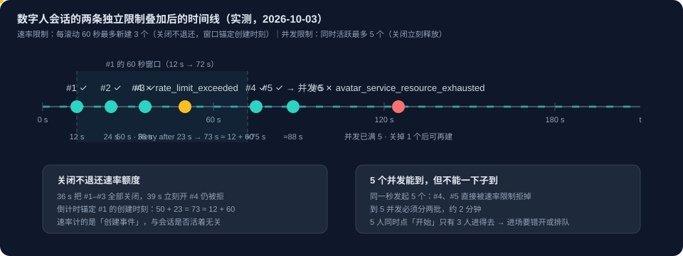

# Voice Live 系列 13：数字人配额与限流——文档值 vs 实测值、并发 5 与新建 3 次/分钟两条限制、为何没有可申请的 quota

> 系列导读与主题地图见[系列 00](Voice%20Live系列00：导读——主题地图、阅读顺序与已定决策速查.md)。本文接[系列 12](Voice%20Live系列12：弱网表现——Azure码率自适应实测、1080p解码失效机制、胖视频饿死音频与关画面保声音.md) 7.4 节顺手记下的那条「avatar 会话创建有速率限制」，把它从一句备注展开成完整的配额模型，并更正那里写错的窗口长度。

**触发本文的现场报错**：

```
Voice unavailable: Avatar request was rate-limited. Retry after 7.0s. — you can continue by text.
```

前缀与后缀是应用自己加的，**中间那句是 Azure 原样返回的**。一个人在测试环境里把数字人「关掉再连」就能撞上它，这件事本身就说明：要么配额小得出奇，要么我们理解错了配额的形状。查下来两者都有一点，而且文档、实测与配额申请三条线各有各的坑，所以单独成文。

## 一、速查：文档值 vs 实测值

每一格都标了来源。**「≥」表示压到这个数仍未触顶，是下界不是上限。**

### 1.1 数字人开启（avatar）：走 Speech 的 avatar 配额

| 限制 | 文档 | **实测** | 错误码 |
|---|---|---|---|
| **同时活跃会话** | 文档**没有**并发这一行 | **5** | `avatar_service_resource_exhausted` |
| **新建连接 / 分钟** | 2 | **3 次 / 60 秒** | `rate_limit_exceeded` |
| 窗口长度 | 未明说 | **60 秒**（两次独立的 `Retry after` 都收敛到首次创建 +60 秒，误差小于 1 秒） | — |
| 关闭是否退还 | 未说 | 并发**会**立刻释放；速率**不**退还 | — |
| 单会话最长（说话） | 30 分钟 | 未测 | — |
| 单会话最长（空闲） | 5 分钟 | 未测 | — |
| 作用域 | per resource | **速率已证按资源**；并发未测 | — |

### 1.2 纯语音（无数字人）：走 Voice Live 自己的配额

| 限制 | 文档 | **实测** |
|---|---|---|
| **同时活跃会话** | 文档**没有**并发这一行 | **≥ 60**，零错误零掉线（**未触顶**） |
| **新建连接 / 分钟** | 30 | **≥ 120**，零失败（**未触顶**） |
| 单会话最长 | ≤ 60 分钟 | 未测 |
| tokens / 分钟 | ≤ 120,000 | 未测 |
| avatar 配额消耗 | — | **0**（不发 `session.avatar.connect`） |

### 1.3 排除项：Azure OpenAI 的 TTS，本方案不用

| 项 | 值 | 为什么与本文无关 |
|---|---|---|
| `OpenAI.Standard.tts` | 3 RPM 共享池 | 没有部署 |
| `OpenAI.Standard.tts-hd` | 3 RPM 共享池，已分配满 | 宿主资源的 kind 是 `OpenAI`；本方案用 Speech 的 `azure-standard` 音色，代码零引用，该部署七天零错误 |

### 1.4 这张表最该带走的一条

**关掉数字人，并发能力差 12 倍以上（5 到 ≥ 60）。** 数字人是整个系统唯一真正紧的资源。其余环节（纯语音、转写、LLM）在本方案的规模下都不构成约束。

## 二、先立框架：avatar 不是一个服务，是 Speech 的附属能力

这句话是负责人提出来的，而它不是用词上的讲究。**本文后面五条分散的实测结论，都是它的必然推论。** 数字人没有自己的资源类型，没有「部署」这个东西，它是 Azure AI Speech 的 text-to-speech 之下的一个能力。于是：

| 实测现象（本文各节） | 由这个框架直接解释 |
|---|---|
| Foundry **Quota 页上没有 avatar 这一行**（第七节） | 那个页面列的是**模型部署**。avatar 不是可部署的模型，没有可分配的 RPM 池，所以没有行 |
| **Request quota 按钮用不上**（第七节） | 它做的是「把区域配额池分配给某个部署」。没有部署，就没有可分配的对象 |
| 账户级 usage API **返回空**（第六节） | usage 项跟踪的是已部署、已计量的能力 |
| 拒绝以**带内 `error` 事件从 Voice Live 的 WebSocket 回来**，而不是资源上的 HTTP 4xx（第六节） | 它是**会话的一个特性**，不是一个有独立请求路径的 API 端点 |
| 配额**小且固定**，与资源规模无关（第三节） | 不是按 provision 的容量定的，是服务端对附属能力的固定节流 |

连「文档说不可调 vs 社区问答说开票」这个矛盾也由此解释：它不是配额体系里的一等公民，所以既没有自助页面，支持票也未必有对应的旋钮。**规划容量时不要把它当成「可以申请扩容的配额」，要当成服务的固定行为约束。** 这会直接改变结论：横向加资源是确定可行的，等配额不是。

## 三、文档怎么写：同一个资源上两套配额，数字人走更严的那套

[Quotas and limits for Azure Speech](https://learn.microsoft.com/en-us/azure/ai-services/speech-service/speech-services-quotas-and-limits) 的 **Real-time text-to-speech avatar** 一节（S0）：

| 配额项 | Free (F0) | Standard (S0) |
|---|---|---|
| **New connections per minute** | 不可用 | **2** |
| Maximum connection duration with speaking | 不可用 | 30 分钟 |
| Maximum connection duration with idle state | 不可用 | 5 分钟 |

同一页里有一句关键的归属说明：

> Avatars used in Voice Live follow the quotas and limits described in Real-time text-to-speech avatar later in this article.

**所以不要去看 Voice Live 自己那张表。** 那张写的是 30 连接/分钟、单会话 ≤ 60 分钟、120k tokens/分钟。数字人受的是 **Speech 的 avatar 配额**。这是本文最容易搞错的一点：同一个资源上两套配额，数字人走更严的那套。[系列 02 第九节](Voice%20Live系列02：架构演进——与Agent%20Service解耦后的合作模式与组合选型.md#九开放问题待验证后续讨论) 备忘里记的「每资源新连接 30 次/分钟」说的是纯语音那套，对数字人不适用。

### 3.1 两次独立观测都能被 60 秒窗口解释

`Retry after` 的数值不是固定退避，而是**窗口里最老那次连接还有多久滚出 60 秒窗口**：

| 观测 | 报的 Retry after | 反推「最老一次连接在多久前」 |
|---|---|---|
| 第一次（自愈路径，第三次请求） | 43.0 s | 60 − 43 = **17 秒前** |
| 第二次（关掉再重连） | 7.0 s | 60 − 7 = **53 秒前** |

两个都落在 60 秒窗口内，自洽。

> **更正[系列 12 7.4](Voice%20Live系列12：弱网表现——Azure码率自适应实测、1080p解码失效机制、胖视频饿死音频与关画面保声音.md#74-落地补记两条-azure-硬约束与不对称冷却) 的一条旧结论。** 那里写「约 20 秒内第三次请求被拒」，并据此把客户端的窗口设成了 20 秒。那是**错误的反推**：观测只说明三次请求挨得很近，**推不出窗口长度**。文档的 60 秒才是窗口，20 秒这个数从来没有证据支持。

## 四、实测：两条独立的限制

这一节改过两次，两次都是结论不够远：先把速率说成「容量上限」，接着又断言「是速率不是并发」。**两者都错。** 完整的模型是两条独立的限制，错误码不同，能否靠释放缓解也不同。

| 限制 | 实测值 | 错误码 | 关闭会话能缓解吗 |
|---|---|---|---|
| **同时活跃的数字人会话** | **5** | `avatar_service_resource_exhausted` | **能**，立刻腾出位置 |
| **每 60 秒新建连接** | **3** | `rate_limit_exceeded` | **不能**，只数创建次数 |



### 4.1 实验 A：并发上限 = 5

每 38 秒只开 1 个（2.4 次/分钟，守住速率限制），一个一个加：

```
 13s  #1 ✅   51s  #2 ✅   89s  #3 ✅   126s  #4 ✅   164s  #5 ✅
202s  #6 ❌ avatar_service_resource_exhausted
      "Service capacity exceeded: too many concurrent avatar rendering requests.
       The system has reached its maximum processing capacity. Please reduce request
       rate or wait for current requests to complete before retrying."
```

第 6 个被拒时活跃 5 个，**并发上限 5**。

### 4.2 实验 B：释放确实腾出容量

到顶后关掉 1 个（活跃降到 4），等 65 秒避开速率限制，再开 1 个，**成功，回到 5**。

所以负责人最初那个怀疑方向是对的：「是否没有释放成功？」对**并发**限制而言，没被释放的会话会一直占着容量，而那条错误原文自己就写着 "wait for current requests to complete"。本文早先那句「释放与这个限制无关」只对**速率**限制成立，不能推广。

### 4.3 实验 C：关闭不退还速率额度，窗口锚定「创建时刻」

负责人问「为什么关闭不立刻退还？」这条此前只有推理，现在有直接实验：

```
12s #1 ✅   24s #2 ✅   36s #3 ✅
36s 三个全部关闭
39s 立刻开第 4 个
50s #4 ❌ rate_limit_exceeded  "Retry after 23.0s."
```

**50 + 23 = 73 秒，而 #1 的创建时刻是 12 秒，12 + 60 = 72 秒**，误差 1 秒内。倒计时仍锚定在 #1 的**创建**时刻，尽管 #1 在 3 秒前已被关闭。关闭对这个计数毫无影响。

两条限制保护的是不同的东西，这解释了差异：

| | 保护的是 | 计什么 | 关闭的影响 |
|---|---|---|---|
| 并发 5 | **稳态渲染容量**（几路 25 fps 正在跑） | 当前活跃数 | **立刻释放** |
| 3 次 / 60 秒 | **建立会话的成本**（分配渲染器、载入形象、WebRTC 协商） | 窗口内**创建次数** | **无影响**，开销已花掉 |

这段「为什么」是推理，不是文档。若关闭能退还，开关开关就能让服务端反复付启动开销而计数永远为 0，这条限制就形同虚设。上面那张实测表才是事实。

### 4.4 「只能建 3 个却有 5 并发」不矛盾

3 次是**每滚动 60 秒**，不是「总共 3 个」。实验 A 里间隔 38 秒，任意 60 秒窗口内最多 2 次创建，**从未碰到速率限制，却照样到了 5 个并发**：

```
0–40 秒   建 3 个 → 并发 3（速率额度用尽）
60 秒后   最老那次滚出窗口 → 再建 2 个 → 并发 5
```

**到 5 并发约需 2 分钟。** 速率限制只拖慢「到达的速度」，不封顶「总数」。

### 4.5 操作规则：5 个并发「能到」，但不能一下子到

这是两条限制叠起来之后最容易踩的坑，也是负责人特别点出来要写清的一条。**同一时刻涌进 4 到 5 个会被拒。** 最早那轮突发测试（间隔仅 6 到 9 秒）：

```
#1 ✅   #2 ✅   #3 ✅
#4 ❌ rate_limit_exceeded  "Retry after 40.0s."
#5 ❌ rate_limit_exceeded  "Retry after 34.0s."
```

| 想要的并发 | 最快可达时间 | 能不能同时发起 |
|---|---|---|
| 1 到 3 | 立刻 | 可以 |
| 4 | 约 60 秒 | 第 4 个被拒 |
| 5 | 约 2 分钟 | 第 4、5 个被拒 |
| 6 及以上 | **不可能** | 并发上限是 5 |

**对产品的含义**：如果 5 位候选人在同一秒点「开始面试」，**只有 3 个能进去，另外 2 个会拿到 `rate_limit_exceeded`**。而按本文第八节描述的常见实现，拿到这个错误的候选人会被直接降级成文字面试。所以批量场景必须**错开进场**，每 20 秒放一个，或在前端排队。

### 4.6 作用域：按资源，已实测

负责人要求验这一条，因为「横向加资源」这个建议完全依赖它。若限制是按 IP 或按订阅，加资源买不到任何东西，而生产环境走的是**单个静态 NAT 出口 IP**。

实验设计先排除混淆：第一步单独验证资源 B 本身可用，否则后面的失败无法归因。

| 步骤 | 动作 | 结果 |
|---|---|---|
| 0 | 把会话端点切到资源 B，单独试一次 | 数字人建连出声 |
| 1 | 切回资源 A | — |
| 2 | 在 A 上**并发**开 3 个（耗尽 A 的 3 次/60 秒） | A1、A2、A3 全部成功 |
| 3 | 立刻切到资源 B | — |
| 4 | 在 B 上尝试 | **建连出声** |
| — | B 的尝试完成于 A 首次创建后 | **36 秒**（仍在 A 的 60 秒窗口内，实验有效） |

两个资源都是 `AIServices` kind、S0、同一区域。**结论：限制按资源计。** 同一台机器、同一个源 IP、同一套 Entra 凭据、同一个订阅，A 的额度耗尽时 B 有完整的自己的额度。所以：

- **「横向加资源」确实有效**，不再是依赖文档的推断；
- 按 IP、按订阅的假设被排除；
- 与文档一致，avatar 两张表位于 *quotas and limits per resource* 之下。

**边界**：这证明了两个资源之间不共享额度，没有进一步区分「按资源」与「按资源乘区域」。对容量规划而言两者等价。**并发 5 的作用域仍未验证**：那个实验只测了速率。并发是否也按资源计，还是共享的区域容量，需要**两个后端同时在跑**才能测。切换端点要重启后端，而重启会杀掉会话、把并发容量释放掉，实验会被自己破坏。

> 一个让作用域实验得以成立的细节：第 3 步切换端点要重启后端，这会杀掉 A 的三个会话。但这不影响实验，因为**关闭不退还速率额度**（实验 C 已证），所以 A 在第 4 步时仍处于耗尽状态。

### 4.7 纯语音的上限：压到 120 次/分钟仍未触及

既然关掉数字人能绕开 avatar 限制，那纯语音自己的上限在哪？直连后端 WebSocket（不经浏览器，否则建连耗时会把速率拖低）压测：

| 轮次 | 发起方式 | 实际速率 | 结果 |
|---|---|---|---|
| 串行（等每条建成） | 35 条 / 136 秒 | 约 15 次/分钟 | 35 条全建成，**0 错误** |
| 并发（不等建成） | 40 条 / 20 秒 | **约 120 次/分钟** | 40 条全建成，**0 错误** |

**120 次/分钟是文档所称 Voice Live「30 新建连接/分钟」的 4 倍，仍然零失败。** 所以在测试强度下纯语音不构成约束。第一轮串行的 15 次/分钟**没有达到上限**，单独列出来是因为只看那一轮会得出「测到 35 条没问题」这种偏弱的结论。另一组实测：31 秒内连开 5 个纯语音会话，**avatar offer 0 次、限流 0 次**，5 个都正常出声。

## 五、为什么会有这两个限制：证据与推理分开标

负责人问：「为什么有这个限制呢？因为服务器消耗也很大吗？」

**「消耗大」这一点有证据，不是猜测**，最强的证据是并发上限本身：

| 证据 | 说明 |
|---|---|
| **并发上限只有 5** | 一个廉价的功能不会在单个资源上卡到 5。这是最直接的信号 |
| Azure 自己的措辞 | `avatar_service_resource_exhausted` 原文是 *too many concurrent avatar **rendering** requests. The system has reached its maximum **processing capacity***，明确是**渲染、算力**语言，不是计费或策略话术 |
| 工作量本身 | 每个会话要在服务端持续渲染 **25 fps 的 H.264**（照片数字人 512×512，视频数字人 1080p），而单会话可以活 **30 分钟** |

**而「为什么还要在并发之外单独限制创建速率」，我不知道。** 本文早先在这里写过一个理由（「防止客户端反复开关让服务端白做分配」），那是**在给 Azure 安动机，没有证据支持，已撤回**。负责人指出：这件事跟客户端无关，是服务端的事。

**能说的是 Azure 自己对两者用了不同的词汇**，这是实测帧里直接读到的：

| 限制 | 错误码 | 类型 | 措辞 |
|---|---|---|---|
| 并发 5 | `avatar_service_resource_exhausted` | — | "maximum processing capacity"，**容量**陈述 |
| 速率 3/60 s | `rate_limit_exceeded` | `invalid_request_error` | 纯**限流**词汇，**没有**任何容量措辞 |

也就是说：**并发那条是「机器跑不动了」，速率那条是「我不让你这么快」。** 后者读起来是一个刻意的节流，而不是「服务端每分钟只造得出 3 个」。但 Azure 为什么要节流它，文档没说，我也没有证据。实验 C 告诉我们的只是这个计数挂在哪里：挂在**创建事件**上，而不是挂在被占用的资源上。

## 六、怎么查看：Azure 侧看不到

三条路都试过了，结论是**这个事件在 Azure 侧不可观测**：

| 途径 | 结果 | 实测命令 |
|---|---|---|
| 资源的 usage/quota API | **空**，没有 avatar 相关项 | `az cognitiveservices account list-usage -g <rg> -n <acct>` |
| Azure Monitor `ClientErrors` | **0** | `az monitor metrics list --metrics ClientErrors` |
| Azure Monitor `Ratelimit` | 是**限值量规**不是计数器（3000006 / 6 次调用，每次约 500001） | 同上，`--metrics Ratelimit` |

原因：**数字人连接被拒是从 Voice Live 的 WebSocket 里以带内 `error` 事件回来的，不是资源上的 HTTP 4xx**，所以不计入 `ClientErrors`，也不进配额指标。

**于是唯一的观测点是自己的应用。** 页面上那句 Azure 原文是目前唯一的证据，服务端如果没有专门的限流日志，事后连「今天被拒了几次」都答不上来。这是实现层该补的第一件事。

## 七、SKU 是什么、该申请什么 quota：答案是没有可申请的 quota 对象

负责人的要求很明确：「一定要搞清楚，对应的 SKU 是啥，要去申请什么的 quota。」下面是钉死的结果。

### 7.1 资源身份

应用实际连的那个资源：`Microsoft.CognitiveServices/accounts`，kind `AIServices`，SKU **S0**，Sweden Central。

### 7.2 Azure 对这个订阅加区域跟踪的全部配额：287 项，没有一项是 avatar

区域级 usages API（`Microsoft.CognitiveServices/locations/<region>/usages`）返回 287 项：

| 前缀 | 项数 | 是什么 |
|---|---:|---|
| `OpenAI.*` | 179 | Azure OpenAI 模型部署容量 |
| `AIServices.*` | 107 | 106 项模型部署容量 + `AIServices.S0.AccountCount` |
| `AccountCount` | 1 | 账户数量 |

按 `avatar`、`conn`、`realtime`、`live`、`session` 穷举筛，命中的**全部是 Azure OpenAI 的模型名**（`gpt-realtime`、`gpt-live-1` 等）。**没有任何 avatar 条目，也没有任何 Speech 能力的配额项。** Speech 自己的神经音色（`en-US-AvaNeural` 这类，本方案用的就是这个）在这 287 项里一条都没有，与「Speech 的能力不是配额对象」完全一致。

连同第六节，现在是**四条独立途径都查过**：账户 usage API、Azure Monitor 指标、`Microsoft.Quota` 提供程序（对 CognitiveServices 作用域直接 BadRequest）、区域级 usages API。

### 7.3 结论：没有 quota 名字可以填

| 问题 | 答案 |
|---|---|
| 对应 SKU | `Microsoft.CognitiveServices/accounts` · kind `AIServices` · **S0** |
| 该申请哪个 quota | **没有。** Azure 的配额体系里不存在这一项 |
| 为什么 Request quota 按钮没用 | 它分配的是**模型部署**的容量池；avatar 没有部署、没有池 |
| 它是什么 | **服务端对一个附属能力的固定行为节流**，不是可分配的配额 |

**所以开支持票只能是「请求提高一个服务端限制」，而不是「申请某个配额」。** 但第四节的实验把「该请求什么」钉死了，工单可以写得很具体：

| 项 | 值 |
|---|---|
| 资源类型 / kind / SKU | `Microsoft.CognitiveServices/accounts` · `AIServices` · **S0** |
| 区域 | 资源所在区域 |
| 要提高的限制 | **并发数字人渲染会话数（concurrent avatar rendering requests）** |
| 当前实测值 | **5**（第 6 个即被拒） |
| 可引用的错误码 | `avatar_service_resource_exhausted`，原文 "Service capacity exceeded: too many concurrent avatar rendering requests" |
| 另一条相关但不同的限制 | 新建连接 **3 次/60 秒**（`rate_limit_exceeded`），**不是**要提的那一条 |

这也正是 [Increase the limit of concurrent users in Speech Services avatar](https://learn.microsoft.com/en-us/answers/questions/2258596/increase-the-limit-of-concurrent-users-in-speech-s) 那个问答帖标题在问的东西。它的回答建议「说明当前用量与期望的并发上限」，放在并发这条限制上就说得通了。之前读不通，是因为我们当时以为要提的是速率。

**要区分清楚两件事**：配额 API 和 Quota 页里**没有**这一项，所以没有自助入口；但**要请求提高的那个限制本身是可命名、可量化的**。规划时仍按固定约束对待，直到工单有结果。

### 7.4 不要把那个 3 RPM 和 avatar 的 3 混为一谈

两个数字都是 3，**但毫无关系**，而且是本文写作过程中真实造成过误解的一处：

| 哪个 3 | 单位 | 是什么 | 在哪看得到 |
|---|---|---|---|
| `OpenAI.Standard.tts-hd limit=3` | **Count** | **Azure OpenAI** 的 TTS 模型部署**容量分配**（已分配 3/3） | Foundry Quota 页、usages API |
| 实测「3 次被接受、第 4 次被拒 / 60 秒」 | **连接/60 秒** | **avatar 的新建连接速率** | **哪里都看不到**，只能实测 |

注意 usages 里的 `current` 是**已分配给部署的份额**，不是请求数。这就是为什么 Quota 页显示 3/3 而 "Weekly rate limiting" 同时是 0%。

那个 `tts-hd` 确实属于 **Azure OpenAI，不是 Speech 的 TTS**，三条独立证据：配额命名空间是 `OpenAI.*`，和 `OpenAI.GlobalStandard.gpt-4o` 同一族；宿主资源的 kind 是 `OpenAI`；应用实际用的 `AIServices` 资源上**没有任何 TTS 部署**。还有一条更直接：它自己的面板说七天零错误，而一场面试要朗读 9 道题，若真走 3 RPM 的部署，早该持续报错。会话里音色写死为 Speech 的 `voice.type = "azure-standard"`，这是 Voice Live 里「Azure Speech 标准音色」那个枚举值，与 Azure OpenAI 的 TTS 模型是两套东西。

**前瞻（这条配额现在无害，但它是「别动 `voice.type`」的具体理由）**：Voice Live 的 `voice.type` 可切成 `openai`。一旦切过去就会落到这个 3 RPM 上，9 次朗读对 3 RPM，每道题都要排队。

## 八、实现层最容易犯的三类错

这三条都是对照实测后在应用里真实找到的，写成通用形式：

**1. 本地账本的窗口与 Azure 不一致。** 客户端自己记一个「每窗口最多 N 次」的账本来避免撞限流，这个思路对，但窗口长度若凭一次观测反推（见 3.1 的更正），就会比 Azure 的 60 秒窄。2 次/20 秒等于 6 次/分钟，而 Azure 给 2 次/分钟，**账本放行了一个必然被拒的请求**。现场那句报错的机制正是：候选人关闭会话，等了二十到六十秒之间再连，本地窗口已过、Azure 窗口没过，这是本分钟内第 3 次，拒绝并告知还要等 7 秒。花同一份配额的路径有三条，Azure 看来完全一样：自愈重新握手、主动切换媒体模式、全新会话。

**2. 账本只活在内存里，跨不过刷新。** 若账本是组件内的状态，每次挂载都是空的。而 Azure 的配额是**资源级**的、跨页面跨标签页跨用户。于是候选人点「重新开始」、刷新页面、同一资源上第二位候选人同时开始、管理员在后台试数字人，全都绕过保护。最后两条值得单独强调：**配额是资源级的**，所以多人同时用时一定会撞上，不是只有「手快」才会遇到。要护住「两位候选人同时开始」，`sessionStorage` 一类的本地持久化不够，只有提并发限制或排队能解。

**3. 把限流当成永久失败。** 建连前的 `error` 分支把「无效模型」「不支持的区域」这类错误标成永久失败、不再重连，这个判断对那些错误是对的，**重试确实徒劳**。但限流是相反的情形：**Azure 明确告诉你等多久就能成功**。把它和永久性错误归成一类，结果是候选人等 7 秒就能看到数字人，却被直接降级成文字面试。正确做法是解析 `Retry after N s`，等满再重试一次。

## 九、一次面试到底花几次：1 次

负责人的疑问是合理的：「我就是一个人测试，这个额度都会爆满。」所以先排除「我们在乱建连接」，数一次「开始面试 → 语音作答」里 `session.avatar.connect` 发了几次：

```
   886ms  WS 打开
  6031ms  >>> session.avatar.connect     ← 唯一的一次
  6328ms  收到 session.avatar.connecting
  7829ms  收到 session.avatar.switch_to_speaking
 共花掉 1 次
```

**正常路径不重复建连。** 各个动作的实际花费：

| 动作 | 花费 | 依据 |
|---|---|---|
| 打开后台配置页看形象缩略图 | **0** | 那是静态 CDN 缩略图；只有点「语音试听」才建连 |
| 后台「语音试听」 | 1 | 与面试同一条建连路径 |
| 开始面试 + 语音作答 | **1**（实测） | 上面 |
| 「重新开始」 | 再 1 | 重建会话 |
| 刷新、新标签页 | 再 1 | 且绕过内存账本 |
| 媒体模式切换（关画面 / 开画面） | 再 1 | Azure 不支持会话中途重协商，切换 = 重建会话（[系列 12 7.4](Voice%20Live系列12：弱网表现——Azure码率自适应实测、1080p解码失效机制、胖视频饿死音频与关画面保声音.md#74-落地补记两条-azure-硬约束与不对称冷却)） |
| **关闭会话** | **不退还** | 限的是「每分钟**新建**数」 |

**结论：配额是按生产形态定的，不是按开发形态。** 真实候选人开一次、保持最多 30 分钟，3 次/分钟很宽裕；而开发时「开面试看一眼 → 重新开始 → 再看 → 同时开后台试听对比」一分钟内凑三次毫不费力。这正是本文开头那次报错的现场动作：`Retry after 7.0s`，最老那次连接在 53 秒前。

### 9.1 对生产形态的含义

| | 实际约束 |
|---|---|
| 同时在面试的人数 | **5**（硬上限，第 6 个直接被拒） |
| 每分钟能「开始」的人数 | **3**（约 20 秒一个） |
| 一批 30 人 | **不能同时面试**。需要排队：5 个在面试、其余等位，且进场还要守 3 次/分钟 |

**这一条才是真正的容量上限**，而且比早先理解的「每分钟 2 人开始」更要紧：它限制的是**同时在场人数**。超过 5 人并发的场景只有两条路：**提并发限制**（第七节的工单），或**横向加资源**（4.6 已实测有效）。

### 9.2 测试期的可持续节奏

- 只看画面就**别按「重新开始」**，复用当前会话。
- 需要重开时**间隔约 30 秒**（60 秒窗口里留 2 个名额，约 30 秒一次是可持续速率）。
- **别在面试开着时点后台试听。**
- 密集测试**关掉数字人**：纯语音不走 avatar 配额，实测 120 次/分钟仍零失败，在测试强度下它根本不是约束。不要把文档那个 30 当成要规避的上限，实测没碰到。
- 更密集的测试**再开一个 AI 资源**，各有各的额度（4.6 已实测）。「按会话选资源」未验证，属设计选项。

## 十、顺带确认的两个硬时限

同一张文档表里还有两个值，和长面试直接相关，此前没有记录在任何地方：

- **说话状态下单次连接最长 30 分钟**
- **空闲状态下最长 5 分钟**

[实时合成文档](https://learn.microsoft.com/en-us/azure/ai-services/speech-service/text-to-speech-avatar/real-time-synthesis-avatar)原文："The real-time API disconnects after 5 minutes of idle or after 30 minutes of connection."

**5 分钟空闲断开**是个现实风险：候选人在某道题上思考超过 5 分钟（简历类、情景类题目完全可能），数字人连接会被 Azure 主动断开。断开后重连又要花一次新建额度。这一条**尚未实测**，列为待验。

## 十一、怎么自己量

这两个限制在 Azure 侧完全不可见（第六节），所以**唯一的办法是实测**。写一个脚本把两项都量：并发模式按固定间隔（守住速率）一个一个加直到被拒；速率模式连开直到被拒，由 `Retry after` 反推窗口长度。实跑输出（速率模式）：

```
13s  #1 ✅ 建连
26s  #2 ✅ 建连
39s  #3 ✅ 建连
51s  #4 ❌ [rate_limit_exceeded] Avatar request was rate-limited. Retry after 22.0s.

速率额度 = 3 次 / 约 58 秒窗口（由 Retry after 反推）
```

**前提**：形象配置必须带数字人（`character` 非空）。纯语音不建 avatar 连接，脚本应检测到并直接提示退出，而不是给出一个空结果。

**什么时候跑**：提限制之后（看有没有真的生效）、换 Azure 资源之后、重要演示之前、以及怀疑限制变了的时候。

> **写这个脚本时踩的一个坑，值得记下**：第一版用「等待结束的时刻」反推窗口，把等待稳定的时间（最多 12 秒）也算进了窗口长度，于是把 60 秒报成了 **69 秒**。改用**错误帧到达的时刻**后报 58 秒，与精测的 60 秒只差约 2 秒（残差来自起点取的是 offer 发出时刻，而窗口大概从 Azure **接受**连接时起算）。**一个会报错数字的工具比没有工具更糟。**

## 十二、待验与待办

1. **并发 5 的作用域**：是否按资源计。需要两个后端同时在跑才能测（4.6）。
2. **5 分钟空闲断开**的实际表现，以及断开后自动重连是否会立刻撞上新建额度（第十节）。
3. **实现层三件事**（第八节）：窗口改 60 秒；限流不再判死，解析 `Retry after` 等满重试一次；补一条限流专用日志，因为 Azure 侧观测不到。
4. **账本跨刷新持久化**需要设计决策：本地持久化只能护住同一标签页，护不住「两位候选人同时开始」。

## 十三、小结

1. **数字人走 Speech 的 avatar 配额，不是 Voice Live 那张表。** 同一个资源上两套配额，数字人走更严的那套。
2. **两条独立限制**：并发 5（容量语言，关闭即释放）；新建 3 次/60 秒（限流语言，关闭不退还、窗口锚定创建时刻）。文档写 2，实测 3。
3. **5 个并发能到但不能一下子到**：到 5 并发要分两批约 2 分钟；5 人同时点开始只有 3 人进得去，批量场景必须错开进场或排队。
4. **速率限制按资源计，已实测**，所以横向加资源有效；并发的作用域待验。
5. **纯语音完全不碰这条限制**，压到 120 次/分钟、60 并发仍零失败。关掉数字人并发能力差 12 倍以上。
6. **没有可申请的 quota 对象**，四条途径查遍；Request quota 按钮对它无用；但要请求提高的限制可命名可量化，工单写「并发数字人渲染会话数，当前 5」。
7. **Azure 侧观测不到被拒事件**，唯一观测点是自己的应用，限流日志必须自己补。
8. **avatar 是 Speech 的附属能力而非服务**，这一个框架解释了以上大半现象。规划容量时把它当固定约束，不当可扩容配额。
9. **方法学**：一次观测推不出窗口长度；「为什么」要把证据和推理分开标，给服务商安动机的句子要撤回；一个会报错数字的测量工具比没有工具更糟。

## 参考

- [Quotas and limits for Azure Speech](https://learn.microsoft.com/en-us/azure/ai-services/speech-service/speech-services-quotas-and-limits)：Real-time text-to-speech avatar 一节与「Voice Live 中的 avatar 遵循该节」归属说明
- [Real-time synthesis for text to speech avatar](https://learn.microsoft.com/en-us/azure/ai-services/speech-service/text-to-speech-avatar/real-time-synthesis-avatar)：5 分钟空闲 / 30 分钟连接断开
- [Increase the limit of concurrent users in Speech Services avatar](https://learn.microsoft.com/en-us/answers/questions/2258596/increase-the-limit-of-concurrent-users-in-speech-s)：社区问答，提并发限制需开支持票
- 系列内：[系列 12 7.4](Voice%20Live系列12：弱网表现——Azure码率自适应实测、1080p解码失效机制、胖视频饿死音频与关画面保声音.md#74-落地补记两条-azure-硬约束与不对称冷却) 首次记下该限制（窗口长度已由本文更正）；[系列 02 第九节](Voice%20Live系列02：架构演进——与Agent%20Service解耦后的合作模式与组合选型.md#九开放问题待验证后续讨论) 会话时长上限备忘；[系列 05 第七节](Voice%20Live系列05：两类数字人头像——viseme驱动的Video%20Avatar与VASA-1生成的Photo%20Avatar.md#七功能与价格该推荐哪一类) 两类头像的带宽与并发
