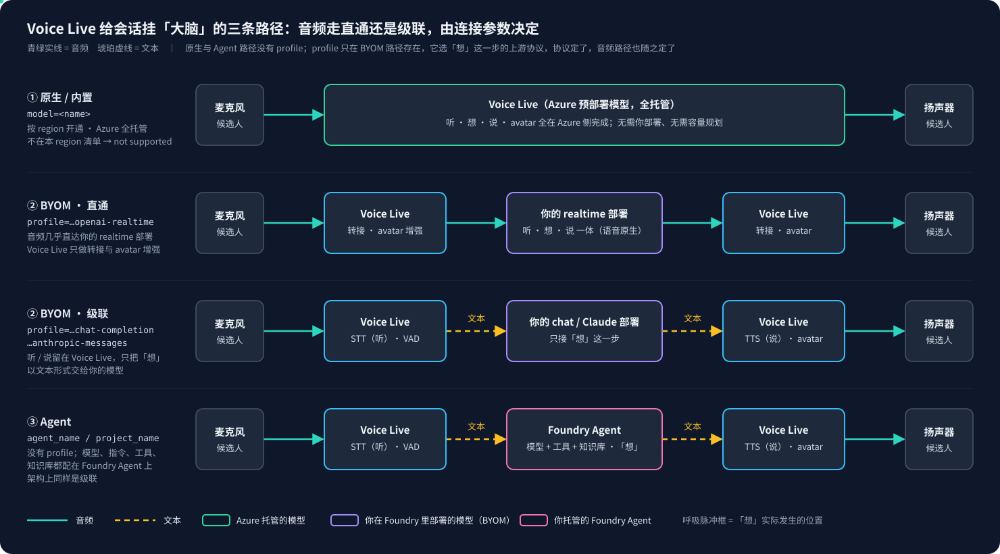

# Voice Live 系列 14：模型接入的三条路径——原生清单按 region 开通、BYOM 用 profile 选协议定直通或级联、推理模型与语音会话模型为何要拆开

> 系列导读与主题地图见[系列 00](Voice%20Live系列00：导读——主题地图、阅读顺序与已定决策速查.md)。本文接[系列 09 第四节](Voice%20Live系列09：脚本朗读的机制化——pre_generated绕过模型推理、宿主模型与代码、prompt、voice三层分工.md#四不走-llm-了为什么建连还必须配模型能不配吗)那句"`model=` 只接受该区域原生模型，自己部署的 deployment 名不算"，把它补成完整的三条接入路径；并给[系列 06 第四节](Voice%20Live系列06：轮次控制的五道关卡——create_response、response.create与Model、Agent模式的控制权归属.md#四model-模式与-agent-模式每个控制点归谁)的 Model / Agent 两种模式补上 BYOM 这一变体。

**触发本文的现场矛盾**：同一个服务，一边在建连时回这样一条报文

```json
{"message": "Model gpt-5.4-mini is not supported in this region.",
 "type": "invalid_request_error", "code": "invalid_model", "param": null}
```

一边在文档里写 **Bring Your Own Model（自带模型）**：微调模型、Claude、Grok、PTU 预留部署都能接。既然能自带模型，为什么又说某个模型在某个 region 不支持？这个问题在团队里反复出现，而且每次都有人给出"文档过时了"或者"region 没放开"这类半对的解释。查下来两句话都成立，只是说的不是同一件事。

## 一、结论先行：两句话说的是两扇门

- **"not supported in this region" 来自原生路径**（`?model=<name>`）。这类模型由 Azure 预部署、全托管，清单**按 region 开通**，你点不到的就报这个错。它的含义不是"这个模型不存在"，而是"这个模型没有在当前 region 预部署进内置清单"。
- **"Bring Your Own Model" 是 BYOM 路径**（`?profile=byom-…&model=<你的 deployment>`）。模型是**你自己在 Foundry 资源里部署的**，接入时根本不查那张 region 预部署清单，所以这条路径上压根不会出现 "not supported in this region"。

同一个 `gpt-5.4-mini`，原生路径回你 region 不支持，文档却说它受支持、请用 BYOM 接入。**不是矛盾，是两扇门。** 下面按"查文档、写探测、跑真实连接"三步给证据。

## 二、一个会话的「大脑」有三种接法

Voice Live 是一条单 WebSocket 的语音到语音流水线（听、想、说、avatar、记忆）。其中"想"这一步，也就是给会话挂一个"大脑"，有且只有三种方式。**它们是三组不同的连接参数，不能混用。**

| 路径 | 连接参数 | 模型从哪来 | 谁管容量与部署 |
|---|---|---|---|
| **① 原生 / 内置** | `model=<name>` | Azure 预部署、全托管 | Azure（无需你部署、无需容量规划、无需 PTU） |
| **② BYOM（自带模型）** | `model=<你的 deployment>` 加 `query={"profile": "byom-…"}` | **你自己**在 Foundry 资源里部署 | 你（部署、配额、内容过滤都归你） |
| **③ Agent（自带智能体）** | `agent_name` / `agent_version` / `project_name` | 你托管的 Foundry Agent | 你 |

SDK（`azure-ai-voicelive`）把三条路径表达得很干净，`connect()` 的签名里同时有 `model`、`query`、`foundry_resource_override` 和 agent 三件套。一个常见的后端只走 ① 和 ③，agent 模式填三件套，否则填 `model=默认模型`。BYOM 是第三条很多人没走过的门。

三条路径的音频流向差别很大，先把图放在这里，后文反复会用到：



这张图最该记住的一点：**原生与 Agent 路径上没有 profile 这个参数；profile 只在 BYOM 路径存在，它选"想"这一步的上游协议，协议定了，音频走直通还是级联也随之定了。**

[系列 09 第四节](Voice%20Live系列09：脚本朗读的机制化——pre_generated绕过模型推理、宿主模型与代码、prompt、voice三层分工.md#四不走-llm-了为什么建连还必须配模型能不配吗)讲过"模型是会话宿主，不是脑子"。本文讨论的是另一个维度：不管这个模型最终当不当脑子，**它从哪里来、经哪条门进会话**。

## 三、原生路径：清单是全局的，开通是按 region 的

Microsoft Learn 的 Voice Live 概览页有一节 "Supported models and regions"（2026-10-05 抓取），原话是：

> All natively supported models are fully managed, so you don't need to deploy models, worry about capacity planning, or provision throughput.

原生预部署清单：

```
gpt-realtime-2.1   gpt-realtime-2.1-datazone   gpt-realtime-2.1-mini
gpt-realtime-1.5   gpt-realtime-1.5-datazone
gpt-realtime       gpt-realtime-datazone       gpt-realtime-mini
gpt-4o   gpt-4o-mini
gpt-4.1  gpt-4.1-mini  gpt-4.1-nano
gpt-5.6-terra  gpt-5.6-luna
gpt-5.4  gpt-5.2  gpt-5.1  gpt-5  gpt-5-mini  gpt-5-nano
phi4-mm-realtime
azure-realtime  azure-realtime-native
```

**这张清单是全局的"支持"清单，不等于某个 region 当下真的开通了。** 文档紧跟一条 Note：

> Models `gpt-5.5`, `gpt-5.4-mini` and `gpt-5.4-nano` are supported and tested with Voice Live but aren't pre-deployed. To use them, deploy them in your Foundry resource and connect via Bring Your Own Model (BYOM).

官方自己点名了三个"**支持但未预部署**"的模型，它们恰恰是要走 BYOM 的。这正是"又支持又不支持"困惑的来源：**同一个模型，在原生路径下报 region 不支持，在 BYOM 路径下却是官方推荐接法。**

### 3.1 清单是会动的，文档领先于 rollout

对同一个 swedencentral 资源做过两次原生探测（方法见第六节）。2026-09-23 那次 `gpt-5.6-luna` 还被拒，2026-10-05 这次已接受。这说明两件事：

- region 预部署清单随时间推进，文档常常领先于某个 region 的实际 rollout；
- 所以"某模型能不能用"**不能只查文档**，要对目标资源实测。这正是探测脚本存在的理由，也是后文"原生模式下拉只列实测接受的模型"这个修法的依据。

## 四、BYOM 路径：profile 选协议，协议定音频走直通还是级联

Microsoft Learn 有专页 "Bring Your Own Model (BYOM) with Voice Live API"。BYOM 适用于：微调模型、任何未被 Voice Live 预部署的 Foundry 模型（Anthropic Claude、Grok、Fireworks 自定义权重、model router）、PTU 预留吞吐部署、自定义内容安全。

### 4.1 profile 到底是什么

它不是"配置档案"，而是官方所说的 **BYOM 集成模式（integration mode）**：告诉 Voice Live "用哪一套上游 API 协议去驱动你那个自带模型"。你的 deployment 对外暴露的接口类型不同（realtime WebSocket、chat completion、Anthropic Messages），Voice Live 必须知道该用哪套协议去调它。更关键的是，**这个选择直接决定音频走直通还是级联**。官方博客的原话：

> The BYOM connection profile determines whether Voice Live sends the turn to a speech-native realtime deployment or uses a cascade through a chat or partner model.

| profile | 你的模型是哪类接口 | 音频路径 | 例子 |
|---|---|---|---|
| `byom-azure-openai-realtime` | realtime 语音原生模型 | **直通**：音频基本直接进出你的模型，延迟最低；Voice Live 主要做转接与 avatar、语音增强 | 自建 `gpt-realtime`、`gpt-realtime-mini` |
| `byom-azure-openai-chat-completion` | chat completion 文本模型（也涵盖其他 Foundry 模型） | **级联**：听（STT）和说（TTS）仍由 Voice Live 做，只有"想"换成你的模型 | `gpt-5.4`、`grok-4`、你的任意 chat deployment |
| `byom-foundry-anthropic-messages`（preview） | Foundry 上的 Claude，走 Messages API | **级联**（同上，协议换成 Anthropic Messages） | `claude-sonnet-4.6`、`claude-haiku-4.5` |

**直通 vs 级联，是 BYOM 这代最该记住的区别。** realtime 那条，你的模型自己就是"耳朵 + 脑子 + 嘴"的语音原生模型，Voice Live 基本只做转接。另两条是级联，Voice Live 保留"耳朵（STT）+ 嘴（TTS）+ avatar"，你的模型只接管"脑子"这一步。所以文本大模型（Claude、Grok、gpt-5.x、你自己微调的）都能当大脑接进来，代价是多一层 STT 与 TTS 拼接的延迟。这和[系列 02 第五节](Voice%20Live系列02：架构演进——与Agent%20Service解耦后的合作模式与组合选型.md#五模型组合原生-realtime-vs-级联性能与能力的取舍)"原生 Realtime vs 级联"的取舍是同一件事，只是 BYOM 把它变成了一个 profile 开关。

### 4.2 连接形态

```python
# ② BYOM：model= 变成"你的 deployment 名"，profile 作为 query 参数带上
async with connect(
    endpoint=endpoint,
    credential=credential,
    model="your-claude-deployment-name",      # 你在 Foundry 里起的名字
    query={"profile": "byom-foundry-anthropic-messages"},
) as connection:
    ...
```

对应的 WebSocket query string：

```
?api-version=2026-04-10&profile=byom-foundry-anthropic-messages&model=<your-deployment>
```

### 4.3 两条硬约束

1. **必须是 Microsoft Foundry 资源。** 默认只能接**同一个 Foundry 资源**里部署的模型；要跨资源，加 `foundry-resource-override`（Foundry endpoint 是 `https://my-foundry-resource.services.ai.azure.com`，就传 `my-foundry-resource`）。普通的 Azure Speech 资源不支持 BYOM。
2. **Entra ID 鉴权下的权限。** 在 chat completion 与 anthropic messages 两种模式下，Foundry 资源的 system-assigned managed identity 需要有访问对应模型 deployment 的权限。长会话里 token 会过期，靠 managed identity 续。

### 4.4 三个最常被追问的点

**追问一：profile 作用在"听 / 想 / 说"的哪一层？**

作用在"想"这一步，而且它配的不是"想得好不好"，是 **Voice Live 用哪一套上游 API 协议，把这一步的请求发给你的 deployment**。它不直接去配"听"或"说"。但协议一旦选定，听和说走直通还是级联也随之确定：realtime 协议，音频直通你的模型；chat completion 或 anthropic 协议，Voice Live 保留 STT 与 TTS，只把"想"以**文本**形式交出去。一句话：**profile 是"想"这一步的协议；协议定了，音频路径也就定了。**

**追问二：deployment 名和模型名不就能推出协议吗，为什么还要显式传 profile？**

不能，四个原因：

1. **deployment 名是你自己起的任意字符串**，字符串本身不带协议与类型信息。要推断，Voice Live 得反过来查 Foundry 管理 API 去解析它背后是什么模型、什么能力，多一层跨服务调用、权限与延迟。
2. **即便解析出背后的模型，realtime 还是 chat 仍有歧义**。走直通还是级联是你**主动选**的架构决定，不是模型的固有属性，名字层面决定不了。
3. **跨厂商协议是硬差异**。Claude 走 Anthropic Messages，不是 OpenAI 的任何 API，名字无法替 Voice Live 选对 client 栈。
4. 所以 Microsoft 的设计是**让调用方显式声明集成模式**，而不是去猜。

**追问三：不能用一个 Responses API 把三条统一掉吗？**

不能统一全部，但 OpenAI 文本那一条确实在往 Responses 收敛。Chat Completions、Responses API、Anthropic Messages 本来就是三个团队设计的三份不同 wire contract：

| | Chat Completions | Responses API | Messages API |
|---|---|---|---|
| 厂商 | OpenAI | OpenAI | Anthropic |
| endpoint | `POST /v1/chat/completions` | `POST /v1/responses` | `POST /v1/messages` |
| 设计目标 | 无状态文本 | agent 化、内建工具、状态管理 | Claude 原生（扩展思考、prompt 缓存） |

单一 Responses API 顶不下三条，有两个彼此独立的原因：

1. **音频传输层不同。** realtime 直通要的是一条**双向流式音频 WebSocket**（即 Realtime API，voice-to-voice 亚 300 ms、带打断）。Responses API 是 request/response，即便用 SSE 流式，也只是"流式返回一个 response"，**不是双向音频会话**，拿不到 speech-native 直通。realtime 这条是被**传输物理**隔开的，不是 API 设计偏好的问题。
2. **厂商边界。** Responses 是 OpenAI 家的契约，寻址不到 Anthropic Claude；Claude 在 Foundry 上走 Anthropic Messages。一个佐证：拿 OpenAI 兼容 SDK 去调 Claude，audio input 会被直接丢弃，两套 API 根本对不上。

能收敛的部分：`byom-azure-openai-chat-completion` 这一条是 OpenAI 文本家族，Responses API 正是 Chat Completions 的后继，未来这条 profile 有可能迁到 Responses 之上。但它**仍吞不下** realtime（传输不同）和 anthropic（厂商不同）。所以 **profile 这个开关短期不会消失**，它选的正是三条物理上不同的集成模式。

> 旁注：OpenAI 另推的 "Open Responses" 想做跨模型统一，但那是开源模型生态（Hugging Face、Ollama、vLLM 等）的方向，不是 Azure Foundry BYOM 当前的接法。Foundry 上的 Claude 依旧是 Anthropic Messages。

## 五、Agent 路径：没有 profile，大脑在 Foundry 侧

顺着上面的问题自然会问："realtime BYOM 是你的模型自己当耳朵、脑子、嘴，那 agent 配 realtime 又是什么流程？"先厘清一个概念差：**agent 不是一个模型，而是一个编排层**（自带指令、工具、知识库，背后再挂一个模型）。所以 agent 模式和 BYOM 直通不是一回事。

### 5.1 连接参数

`connect()` 不传 `model=`，改传 agent 三件套：

| 参数（SDK kwarg） | 必填 | 含义 |
|---|---|---|
| `agent_name` | 是 | Foundry agent 名 |
| `project_name` | 是 | 承载该 agent 的 Foundry **project** 名（等于 project endpoint 的最后一段） |
| `agent_version` | 否 | agent 版本 |
| `foundry_resource_override` | 否 | 跨资源时，承载 agent 的 Foundry 资源名 |
| `conversation_id` | 否 | 复用或重连到已有会话 |
| `client_id` / `description` | 否 | 关联 client id、覆盖 agent 工具描述 |

> [!NOTE]
> 命名有漂移：WS query 在 api-version `2026-04-10` 写作 `agent-name` / `agent-project-name`，社区早期示例又有 `agent_id` / `project_id`。**以 SDK kwarg 为准**，SDK 按目标 api-version 映射。`session.update` 里引用 agent 的对象 `type` 固定为 `"foundry_agent"`。

```python
# ③ Agent：不传 model=，大脑与编排都在 agent 侧
async with connect(
    endpoint=endpoint, credential=credential, api_version=api_version,
    agent_name="my-interviewer-agent",
    agent_version="3",                       # 可选
    project_name="my-foundry-project",
    foundry_resource_override="my-foundry",  # 仅跨资源时
) as conn:
    ...
```

### 5.2 "agent 配 realtime"的流程，以及它和 BYOM 直通的区别

**agent 路径上没有 profile 这回事**，profile 是 BYOM 专属。agent 的"大脑"（底层模型、指令、工具、知识库）是**在 Foundry 侧的 agent 上配好的**，不在 Voice Live 的连接参数里选。

- **架构上 agent 模式本质是级联**（对应 Microsoft 的 "Voice Live + prompt agent" 模式）：说话，Voice Live 做 STT（耳朵），agent 跑模型加工具加知识库检索（脑子加编排，内部可能多步），出文本，Voice Live 做 TTS（嘴）和 avatar visemes，候选人听到。Voice Live 保留整条语音层。
- **"realtime" 在 agent 语境下**指：agent 背后挂的那个模型 deployment 要是**支持 realtime 语音交互的模型**，否则连接可能静默关闭（社区问答实测）。但这块是**在 agent 上配**的，connect 只负责"指到哪个 agent"。
- 所以 BYOM 直通的"音频近乎直达模型"特性，agent 模式**拿不到**。agent 要做 tool calling 和 RAG，天然要走 STT、文本、编排、文本、TTS 这一圈。

### 5.3 一个产品里两种模式并存是常态

以面试数字人为例，同一个后端里哪个会话走哪条路径是按 persona 决定的：

| persona 类型 | 有无 agent 标识 | 走哪条路径 | 为什么 |
|---|---|---|---|
| 已同步到 Foundry 的数字人面试官 | 有 | **③ Agent** | 有 agent 标识且不是嘴型会话 |
| 外部大脑驱动的嘴型 persona | 有（也同步过） | **① Model** | 嘴型会话即使带 agent 标识也强制走 model |
| 全新未同步 persona | 无 | **① Model** | 没有 agent 标识，用默认模型 |

嘴型会话即使同步出了 agent 标识也强制走 model 模式，原因在[系列 09 第三节](Voice%20Live系列09：脚本朗读的机制化——pre_generated绕过模型推理、宿主模型与代码、prompt、voice三层分工.md#三怎么直接-tts不让模型回复)：挂一个会自己即兴发问的 agent 会变成"第二个大脑"，让逐字朗读跑偏。

再往下一层是运行期的真实调用链。上表讲"哪个 persona 走哪条连接路径"；下表讲一次候选人面试里，WebSocket 上**到底有没有大脑在推理、每句话是谁产出的**。这才是"model / agent 实际被不被调用"的答案：

| 面试链路 | WS 模式 | WS 上有大脑在推理？ | 每句话从哪来 | 用到 Foundry agent？ |
|---|---|---|---|---|
| 外部题源（默认） | Model（嘴型） | 否，`create_response=False` | 外部 API 产题，`pre_generated_assistant_message` 逐字念 | 否，即使同步了也强制摘掉 |
| 题库线性 | Model（嘴型） | 否 | 题库文本逐字念 | 否 |
| 题库 judged | Model（嘴型） | 否 | 题库文本逐字念；候选人停顿时的 nudge 来自 **WS 之外**的 judge 模型，文本回传后仍交给嘴逐字念 | 否 |
| 编辑器 Playground | **Agent** | 是 | agent 自由对话（用来测 agent 指令） | **是，唯一真正挂 agent 的地方** |

三个最反直觉的点：

1. **候选人面试里 Voice Live 几乎永远是"一张嘴"。** 三条默认链路都是嘴型会话，agent 被**显式摘掉**。"一直用到 agent"是反的：默认根本不接 agent。
2. **judged 用的那个"模型"既不是 Voice Live 的 `model=`，也不是 agent**，而是第三条独立链：WS 之外的 chat completion judge，和打分共用同一个适配器。judge 从不写一个面试官回合，只回 `wait | nudge`，nudge 文本再回交给嘴逐字念（[系列 08](Voice%20Live系列08：应答门控——判停与开轮之间的四个判断：EOU、LLM%20judge、两段式提交与频率策略.md)）。
3. **"在面试 WS 上让模型自由回合"这条路径已经退役。** 题库轮次模式只剩线性与 judged 两种，所以没有任何候选人面试业务会在语音 WS 上挂 agent。agent 唯一的用武之地是编辑器 Playground：pin 住 persona 后保留模型回合，用来和 agent 自由对话、测它的指令。

## 六、实测：同一资源上原生与 BYOM 的边界（swedencentral，2026-10-05）

探测脚本直接连真实 Azure Voice Live（本系列一贯的规矩：永远用真实连接、不做 mock），逐个候选模型建连、发一个最小 `session.update`，按服务器第一条事件分类：

- `session.updated`，记 **ACCEPTED**
- `error` 含 "not supported in this region"，记 **REJECTED_REGION**

凭证走和线上一致的链路，Entra 鉴权，api-version `2026-01-01-preview`。endpoint 以 `<your-resource>.services.ai.azure.com` 占位，region 与 api-version 为真实值。

### 6.1 原生路径探测

**ACCEPTED（20 个）：**

```
gpt-realtime-2.1  gpt-realtime-2.1-mini  gpt-realtime-1.5  gpt-realtime  gpt-realtime-mini
gpt-4o  gpt-4o-mini  gpt-4.1  gpt-4.1-mini  gpt-4.1-nano
gpt-5.6-terra  gpt-5.6-luna  gpt-5.4  gpt-5.2  gpt-5.1  gpt-5  gpt-5-mini  gpt-5-nano
phi4-mm-realtime  azure-realtime
```

**REJECTED_REGION（3 个）：** `gpt-5.5`、`gpt-5.4-mini`、`gpt-5.4-nano`。服务器原始报文就是本文开头那条。

**gpt-6 与 gpt-6.1 一代专项复测：全部 REJECTED_REGION（12 个）**，`gpt-6`、`gpt-6-mini`、`gpt-6-nano`、`gpt-6-luna`、`gpt-6-sol`、`gpt-6-terra`、`gpt-6-astra`、`gpt-6.1`、`gpt-6.1-mini`、`gpt-6.1-nano`、`gpt-6.1-luna`、`gpt-6.1-terra`，报的都是同一个 `invalid_model`。

> [!WARNING]
> **`invalid_model` 这个 code 是有歧义的。** 它既可能是"模型名存在、只是当前 region 没预部署"，也可能是"压根没这个模型名"。原生探测无法区分这两者。所以 gpt-6 一代全拒，**不代表这些名字一定存在**，只能确定"在本 region 的原生清单里都点不到"。要真用，走 BYOM 自己在 Foundry 部署，或等 region rollout；能不能部署还得看该模型在 Foundry 里是否真的放出来了。

### 6.2 为什么这组数据是决定性的

**被原生路径拒绝的那三个模型，正好就是 Microsoft 文档点名"支持但未预部署、请走 BYOM"的那三个。** 一字不差。这把"测量到的行为"和"文档写的行为"扣在了一起。

### 6.3 BYOM 路径探测

先查了该 Foundry 资源里的真实部署（deployments API 实际返回，14 个）：

```
gpt-4o  gpt-4o-mini  gpt-4o-mini-2  gpt-4.1-mini
gpt-5  gpt-5-mini  gpt-5.4  gpt-5.4-mini
gpt-5.6-terra  gpt-5.6-luna  gpt-5.6-sol
gpt-6-luna  gpt-6-sol  gpt-6-astra
```

**注意这张表和 6.1 的 ACCEPTED 名单不是同一张表。** `gpt-5.4-mini`、`gpt-6-*`、`gpt-5.6-sol` 都是**真实部署但原生被拒**。这就是第七节"两种语义"的直接证据。下面每一行都是真实建连的结果：

| # | 探测 | 结果 | 含义 |
|---|---|---|---|
| A | `gpt-5.4-mini` **原生** | 拒，REJECTED_REGION | 它是真部署，但不在本 region 原生清单 |
| B | `gpt-5.4-mini` **BYOM** `byom-azure-openai-chat-completion` | **ACCEPTED** | **同名同资源，原生被拒、BYOM 能连** |
| C | `gpt-6-luna` **BYOM** 同 profile | ACCEPTED | gpt-6 一代原生 12 个全拒，BYOM 可用 |
| D | `no-such-deployment-xyz` **BYOM** 同 profile | **ACCEPTED** | **建连阶段不校验 deployment 名** |
| E | `gpt-5-mini` 加 profile `byom-not-a-real-profile` | 明确报错 | profile **会**在建连时校验 |
| F | `gpt-5-mini` 加 profile `byom-azure-openai-realtime`（chat 部署配 realtime 协议） | 明确报错 | **协议不匹配会**在建连时被抓 |

E 与 F 的服务器原始报文：

```json
{"message": "Profile byom-not-a-real-profile is not supported.",
 "type": "invalid_request_error", "code": "invalid_profile", "param": null, "event_id": null}

{"message": "Connection error to BYOM Realtime service: status 400, message: Invalid response status",
 "type": "invalid_request_error", "code": "byom_realtime_connection_error", "param": null, "event_id": null}
```

由这六条实测得到四个结论：

1. **BYOM 在本资源上用当前的 `2026-01-01-preview` 就能工作**，不需要文档示例里出现过的 `2026-04-10`。原先"BYOM 可能需要更新 api-version"这个待验项已证伪。
2. **Entra 下 Foundry managed identity 的权限已经通**，B 与 C 两条都是 Entra 建连成功。另一个待验项已解。
3. **"region not supported" 在 BYOM 路径上压根不会发生**，那是原生路径独有的错误。所以"让自带部署连得上"这件事，BYOM 是确定可行的解法，不是猜测。
4. **BYOM 的 deployment 名在建连时不被校验（D）。** 这条推论很重要：
   - 保存时的实测校验对 BYOM **证明不了"这个部署存在"**，只能抓住 profile 选错（E）和协议不匹配（F）；"部署名合法"由部署下拉框本身保证，它列的是 deployments API 的真实返回。
   - 更深一层：候选人面试里 Voice Live 是嘴型会话（`create_response=False`），**从不请求"想"这一步**，所以 BYOM 级联里你那个模型**根本不会被调用**。D 这条实测正好印证了这点，连一个不存在的部署名都能把会话建起来。所以**在候选人面试上给语音腿开 BYOM，不会改变任何面试行为**，它改变的只是会话宿主与计费口径。这也是下一节"推理模型"与"语音会话模型"应当拆成两个配置的实测依据。

> [!NOTE]
> 本文早先的版本有一句未经验证的话，写"当前没有 BYOM deployment，故只覆盖原生路径"。实际去查之后资源里有 14 个部署，BYOM 完全可以实测，而且已经测完。把"以为"当"查过"写进文档，是这个系列反复提醒自己的一类错。

## 七、管理端那一个「模型」字段到底在喂谁

接着问："judge 用的模型是管理端配的还是写死的？打分呢？agent 里面呢？"结论：**全部来自配置，写死的只有兜底默认值 `gpt-5-mini`。** 但它们是**四条不同的解析链**，生效时机也不同。而且管理端那**一个**模型字段同时喂了其中三条，这正是 region 报错的根因。

### 7.1 四条解析链

| 用到模型的地方 | 解析链（左优先） | 何时生效 |
|---|---|---|
| **judge**（judged 模式的 wait / nudge） | 管理端主配置的模型字段，其次环境变量，最后兜底 `gpt-5-mini` | 适配器**注册时**钉死；管理端保存后重建适配器，不用重启 |
| **评估 / 打分**（含 checklist 起草、SOP 覆盖） | **同上，同一条链、同一个适配器实例** | 同上 |
| **Foundry agent 的底层模型** | per-persona 模型，其次上面那条链 | **"同步到 Foundry"时**写进 agent，不在连接时传 |
| **Voice Live `model=`**（路径 ①） | per-persona 模型，其次管理端主配置的模型字段，最后环境变量 | **每次建连**时读配置，改了下一场面试即生效 |

三个最容易误会的点：

1. **"写死"只剩兜底。** 几处默认值都只是配置缺失时的兜底，管理端一填就被盖掉。
2. **适配器按 provider 取，不按模型名取。** 模型在注册时就固定在适配器实例上，调用方选不了。推论：**judge 和打分今天必然是同一个模型**，想让它们用不同模型需要新开关。另外 judge 与打分**都不读 per-persona 模型**，per-persona 模型只影响 agent 同步和 Voice Live 连接。
3. **管理端那一个模型字段，一条链喂三处用途。** 它同时是 judge 与打分的 chat 模型、agent 同步时的底层模型、Voice Live 的 `model=`。前两个接受**你自己的 deployment 名**，第三个只认**本 region 的原生预部署清单**。所以把一个自有 deployment 名填进这个字段，chat 侧正常、语音侧立刻报 "not supported in this region"。

### 7.2 自有 deployment 不是"没用"，它在四处里有三处是唯一正确的填法

| 用到模型的地方 | 吃不吃"你自己的 deployment 名" | 为什么 |
|---|---|---|
| judge | 吃，而且这就是正确的东西 | 走 Foundry 的 Responses API，Azure 侧的 `model=` **本来就是 deployment 名** |
| 评估 / 打分 | 吃（同一个适配器实例） | 同上 |
| Foundry agent 的底层模型 | 吃 | agent 建在你的 Foundry project 里，它的模型只能是你的 deployment |
| Voice Live `model=`（路径 ①） | **唯一不吃** | 只认本 region 的原生预部署清单，自有名字回 `invalid_model` |

所以毛病不在"自有 deployment 不该用"，而在**一个字段同时承载了两种互不兼容的语义**：填上你的 deployment，前三处全对、第四处立刻报错。要让第四处也吃自有 deployment，**只有 BYOM 一条路**。

### 7.3 修法：拆成「推理模型」与「语音会话模型」

当前版本已把它拆成两个设置：

- **推理模型**：喂 judge、打分、agent 同步。仍列你的 deployment，行为不变。
- **语音会话模型**：独立的模型名、一个 native / byom 模式开关、一个 BYOM profile。原字段**不再喂 Voice Live**，per-persona 模型也不再进语音链（那是第二个漏非法值的口子）。根因就此切断。

两个配套守卫：

- 原生模式的下拉只列**对本资源实测 ACCEPTED** 的模型（6.1 的探测，缓存 6 小时）。这是 3.1 "文档领先 rollout"的直接后果，列文档清单会把 region 没开的模型放进去。
- 保存前对改动过的语音模型再做一次实测复校，被明确拒绝就是 422、不落库。对 BYOM 它能抓的是 profile 选错与协议不匹配（E、F），抓不了部署名不存在（D），部署名合法由下拉框保证。

**为什么拆而不是"统一成一个值"：** 语音腿是嘴、不推理（[系列 09](Voice%20Live系列09：脚本朗读的机制化——pre_generated绕过模型推理、宿主模型与代码、prompt、voice三层分工.md)）。为了口径一致把它也拖进 BYOM，要付出 Foundry 资源、managed identity 权限、级联延迟的真实代价，却换不到任何功能收益。6.3 的 D 条实测正说明那条腿根本不会去调你的模型。

> 旁注：配置覆盖层**故意不**去覆盖语音默认模型的全局设置，因为覆盖它会让每个语音会话在管理端保存的瞬间就挂掉；但建连时直接读了主配置行，所以主配置的模型仍会进 Voice Live。绕过了设置对象，没绕过问题。这是拆字段之前真实存在的一个绕路。

## 八、agent / model / prompt / avatar / VAD / voice 分别落在哪一层

最容易混淆的点：**这些参数不是平级的"一堆 session config"，它们分属三层，生效时机也不同。**

| 管理端字段 | 层 | 怎么用、何时生效 | 哪种模式 |
|---|---|---|---|
| **agent**（标识与版本） | 连接选择 | 由"同步到 Foundry"动作生成（**不是手填**），决定走 agent 还是 model | — |
| **model** | 大脑 | 仅 model 模式作 `model=`；**agent 模式根本不传**（大脑是 agent 自带的） | 仅 ① |
| **prompt** | 大脑的指令 | **从不作为 `session.instructions` 传**（Azure 拒绝覆盖 instructions）。agent 模式，同步时写进 Foundry agent，不随连接传；嘴型 / model 模式，作为**会话系统消息**在 `session.update` 后注入 | 两种，但走法不同 |
| **avatar**（形象、风格、背景） | 语音层 | 每次连接经 `session.update` 的 `avatar` 装配 | ① ③ 都生效 |
| **VAD**（turn_detection、EOU） | 语音层 | 每次连接经 `session.update` 的 `turn_detection` 装配 | ① ③ 都生效 |
| **voice**（音色、temperature、rate、语言） | 语音层 | 每次连接经 `session.update` 的 `voice`、转写、采样率装配 | ① ③ 都生效 |

一句话：**avatar、VAD、voice、语言是"语音层"配置，确实每次连接当 session config 用，两种模式都吃**；而 **model 和 prompt 是"大脑层"**，model 只在 model 模式当连接参数，prompt 从不走 `session.instructions`（agent 模式它住在 Foundry agent 里，model 模式它当会话系统消息注入）。会话构建器的参数表里根本没有 `instructions` 这个键。这与[系列 09 第六节](Voice%20Live系列09：脚本朗读的机制化——pre_generated绕过模型推理、宿主模型与代码、prompt、voice三层分工.md#六怎么发声是另一层语速表现力发音靠-sessionvoice不靠-prompt也不是-ssml)"声是另一层"的结论互相印证。

## 九、judge 已经用了一个模型，为什么不把它接到 create_response

顺着第五节"judge 是第三条独立链"再追一问：既然 judged 模式里确实调了一个真模型，为什么不干脆把它当成 Voice Live `create_response` 的那个大脑，而要留在 WebSocket 之外？因为 **judge 和 `create_response` 干的是两个不同的活，这个产品是刻意把"判断"和"开口"拆开的。**

先厘清误解：judge 用到的那个"模型"，不是 Voice Live 的 `model=`。面试会话仍是嘴型，WS 上的 `model=` 只是不推理的宿主；judge 是 WS 之外一条独立的 chat completion 调用。所以"judge 用了模型"和"把模型接进 `create_response`"从来不是同一个开关。

| | judge 的模型 | `create_response` 的模型 |
|---|---|---|
| 回答什么 | "候选人说完了吗，要不要催" | "面试官这一轮说什么" |
| 产出形态 | 结构化判决 `wait` 或 `nudge`，其它一律按 `wait` 处理 | 自由语音 turn |
| 能否"只判决、绝不编题" | 能（结构化契约、超时、泄漏守卫、预取） | **不能**（单布尔，一开全开） |
| 题目来源 | 题库逐字，由嘴念 | **模型自己编** |
| 在哪 | WS 之外，和打分共用适配器 | WS 上 |

挡着把 judge 塞进 `create_response` 的，是三道各自独立的墙：

1. **一个是裁判，一个是嘴，题从哪来变了。** 面试官要说的题目永远来自题库逐字（SOP 引用、与打分 rubric 对齐、可审计）。一旦 `create_response=True`，模型开始自己编题，这正是题库设计明令禁止的，也是嘴型会话存在的全部理由（[系列 07](Voice%20Live系列07：重复致谢排查——三次Thank%20you的三个开轮来源、转写指纹与编排层修法.md) 的 "Thank you." 漂移、卡片与口播不一致）。
2. **`create_response` 是一个布尔，"只判决、绝不即兴"表达不出来。** "acknowledge turn" 与 "follow-up turn" 是同一个 turn，"acknowledge but never follow up" 不可达。打开它就同时拿到"确认 + 追问 + 即兴"，没法只要 nudge。WS 之外的 judge 能表达这个窄合同，正因为它返回结构化判决而不是自由语音，这也正是当初把它挪到 WS 之外的原因（[系列 06 第二节](Voice%20Live系列06：轮次控制的五道关卡——create_response、response.create与Model、Agent模式的控制权归属.md#二一个轮次的五道关卡)）。
3. **judge 需要的那套，一条 WS 语音 turn 全给不了。** 有序契约、逐项引用检查、泄漏守卫、JSON 解析、超时、失败转 `wait`、预取与应用。WS 的语音 turn 是自由音频，拿不到结构化判决、跑不了引用检查、也绑不住它。

一句话：**judge "用了模型"和 `create_response` "用模型"不是同一个杠杆，不能互相替换。** judge 用模型来判决并返回一个决定，然后把开口权交回给那张逐字念题的嘴；`create_response` 是让模型自己当面试官开口。把 judge 接到 `create_response` 等于让模型自己编面试，要动架构，并撞上题库逐字、打分对齐、单布尔管不住这三道墙。所以这不是"能复用却没复用"，而是这两个活天生要分开。

## 十、一句话决策树

```
想给 Voice Live 换"大脑"？
├─ 模型在该 region 的原生预部署清单里（对目标资源实测 ACCEPTED）
│    → 直接 model=<name>，Azure 全托管，零部署成本。                ← 路径 ①
├─ 模型"受支持但未预部署"（gpt-5.5 / gpt-5.4-mini / gpt-5.4-nano），
│  或是 Claude / Grok / 微调 / PTU / 自定义内容安全
│    → 在自己的 Foundry 资源里部署，profile=byom-…，                ← 路径 ②（BYOM）
│      model=<你的 deployment>，必要时加 foundry-resource-override。
│      要直通选 realtime profile；要接文本大模型选 chat 或 anthropic profile（级联）。
└─ 想让一个已托管的 Foundry Agent 来驱动（指令 + 工具 + 知识库）
     → agent_name / agent_version / project_name，没有 profile。     ← 路径 ③
```

**当前现状**：外部题源与题库模式走路径 ①，默认 `gpt-5-mini`（实测 ACCEPTED）；数字人面试官的 Playground 走路径 ③。路径 ② 已在本资源上实测可用，管理端已给语音侧加上 native / BYOM 模式开关，但候选人面试的语音腿**不打算**切到 BYOM（7.3）。

## 十一、对系列前文的补充

- [系列 09 4.1](Voice%20Live系列09：脚本朗读的机制化——pre_generated绕过模型推理、宿主模型与代码、prompt、voice三层分工.md#41-为什么必须配)："`model=` 只接受该区域原生模型，自己部署的 deployment 名不算"。**这句只对原生路径成立。** 自己部署的 deployment 名配上 `profile=byom-…` 就算，而且是官方给"支持但未预部署"模型的推荐接法。
- [系列 06 第四节](Voice%20Live系列06：轮次控制的五道关卡——create_response、response.create与Model、Agent模式的控制权归属.md#四model-模式与-agent-模式每个控制点归谁)：Model 模式实际有两个变体，原生与 BYOM。连接参数层面 BYOM 仍是 `model=`，只是多了 `profile`。两个变体下五道关卡的控制权是否完全一致，本文未逐项复验（见第十二节）。
- [系列 02 第五节](Voice%20Live系列02：架构演进——与Agent%20Service解耦后的合作模式与组合选型.md#五模型组合原生-realtime-vs-级联性能与能力的取舍)："原生 Realtime vs 级联"的取舍。BYOM 把这个取舍变成了一个 profile 开关，而且让级联的"想"可以是任何 Foundry 模型，包括 Claude。
- [系列 03](Voice%20Live系列03：数字人出场延迟优化——ICE门控根因、实测分解与预热占位策略.md)"region 可用性才是真分水岭"：模型字段上这条分水岭只划在原生路径；BYOM 路径不看 region 清单，看的是你的 Foundry 资源里有没有这个部署。

## 十二、待验

1. **BYOM 直通未实测。** 本资源没有 realtime 类型的部署，`byom-azure-openai-realtime` 只测到了"协议不匹配会被抓"（F），没测到成功建连与直通延迟。
2. **anthropic messages profile 未实测。** 本资源没有 Claude 部署。
3. **`foundry-resource-override` 跨资源未实测。**
4. **`invalid_model` 的歧义无法由原生探测解开。** 要区分"region 没开"与"名字不存在"，得对照 Foundry 模型目录。
5. **BYOM 下五道关卡的控制权是否与原生 Model 模式完全一致**（per-turn `instructions`、`interim_response`、`conversation: "none"`）未逐项复验。
6. **BYOM 级联相对原生的延迟增量未量化。**
7. **region 预部署清单的变化节奏**：两次探测相隔 12 天就有一个模型从拒到收，6 小时的缓存是否合适要看后续。

## 十三、小结

1. **"not supported in this region" 与 "Bring Your Own Model" 不矛盾，是两扇门。** 前者只从原生路径抛出，后者是 BYOM 路径，BYOM 不查 region 预部署清单。
2. **给会话挂大脑有且只有三条路径**：原生 `model=`、BYOM `model=` 加 `profile`、Agent 三件套。参数不能混用，原生与 Agent 路径上没有 profile。
3. **原生清单是全局的，开通是按 region 的，文档领先 rollout。** 某模型能不能用要对目标资源实测，不能只查文档。
4. **profile 是 BYOM 集成模式，选"想"这一步的上游协议；协议定了，音频走直通还是级联也定了。** 不能从部署名推断，一个 Responses API 也统一不掉三条（传输物理与厂商边界两个独立原因）。
5. **Agent 不是模型而是编排层，架构上是级联**，拿不到 BYOM 直通的特性；它的模型、指令、工具、知识库都配在 Foundry 侧。
6. **实测把文档与行为扣在了一起**：原生被拒的三个模型正是文档点名走 BYOM 的三个；同名同资源原生拒、BYOM 通；BYOM 建连不校验部署名，但校验 profile 与协议匹配。
7. **一个模型字段喂三处用途是 region 报错的根因**：judge、打分、agent 底层模型都吃自有 deployment，唯独 Voice Live `model=` 不吃。修法是拆成"推理模型"与"语音会话模型"，原生下拉只列实测接受的模型。
8. **嘴型会话没必要为口径一致拖进 BYOM**：它不请求"想"，连不存在的部署名都能建连，换 BYOM 只换宿主与计费口径，却要付 Foundry 资源、权限、延迟的代价。
9. **judge 用模型与 `create_response` 用模型不是同一个杠杆**：一个产出判决，一个产出台词；判断与开口刻意分开。
10. **方法学**：把"以为"写成"查过"是要撤回的；`invalid_model` 这种有歧义的错误码，结论要写到证据能支持的那一步为止。

## 参考

- [Voice Live API overview](https://learn.microsoft.com/en-us/azure/ai-services/speech-service/voice-live)：Supported models and regions 一节，含三个"支持但未预部署"模型的 Note
- [Bring Your Own Model (BYOM) with Voice Live API](https://learn.microsoft.com/en-us/azure/ai-services/speech-service/how-to-bring-your-own-model)：三种 profile、Foundry 资源与 managed identity 两条硬约束、`foundry-resource-override`
- 系列内：[系列 09 第四节](Voice%20Live系列09：脚本朗读的机制化——pre_generated绕过模型推理、宿主模型与代码、prompt、voice三层分工.md#四不走-llm-了为什么建连还必须配模型能不配吗) 模型是宿主不是脑子；[系列 06 第四节](Voice%20Live系列06：轮次控制的五道关卡——create_response、response.create与Model、Agent模式的控制权归属.md#四model-模式与-agent-模式每个控制点归谁) Model 与 Agent 模式控制权；[系列 08](Voice%20Live系列08：应答门控——判停与开轮之间的四个判断：EOU、LLM%20judge、两段式提交与频率策略.md) LLM judge 的设计；[系列 02 第五节](Voice%20Live系列02：架构演进——与Agent%20Service解耦后的合作模式与组合选型.md#五模型组合原生-realtime-vs-级联性能与能力的取舍) 原生 Realtime vs 级联
