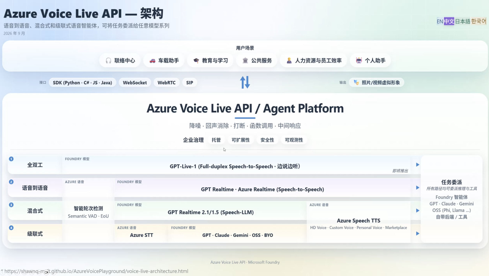
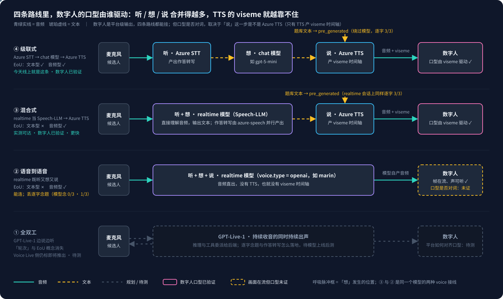
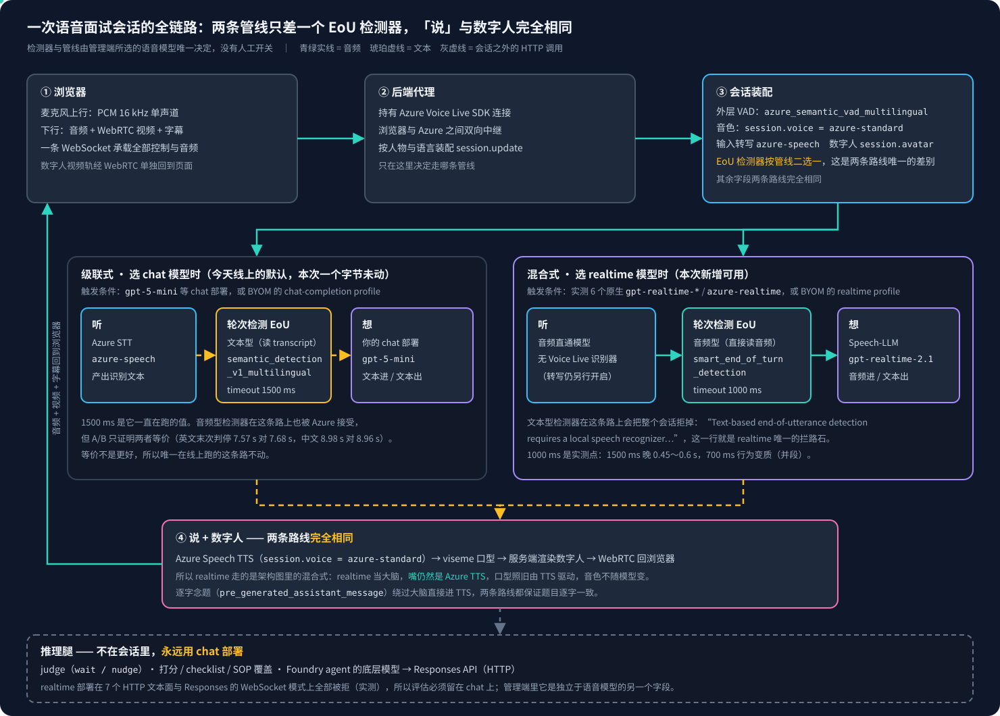
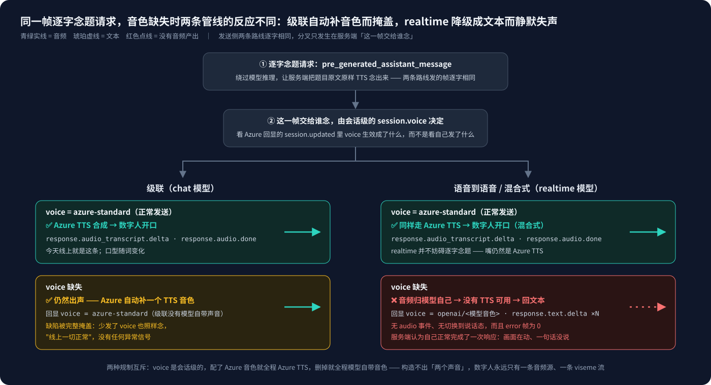
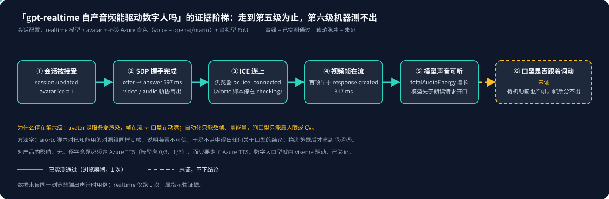

# Voice Live 系列 15：realtime 模型与数字人——四条路线再展开、EoU 两种实现决定可达性、文本驱动已验证与音频驱动的证据边界、GPT-Live-1 待测清单

> 系列导读与主题地图见[系列 00](Voice%20Live系列00：导读——主题地图、阅读顺序与已定决策速查.md)。本文把[系列 04 第一节](Voice%20Live系列04：四条路线与全双工——GPT-Live-1对数字人方案的影响评估.md#一一张图四条路线合并的组件越来越多)那张四条路线架构图再展开一层，并用实测回答[系列 04 第三节](Voice%20Live系列04：四条路线与全双工——GPT-Live-1对数字人方案的影响评估.md#三真开关是-voice-配置不是模型选择数字人的-viseme-闸门)留下的问题：挂 avatar 是否必然落在混合式接线上。模型接入的三条路径（原生、BYOM、Agent）见[系列 14](Voice%20Live系列14：模型接入的三条路径——原生清单按region开通、BYOM用profile选协议定直通或级联、推理模型与语音会话模型为何要拆开.md)，本文不重复。

**触发本文的问题**，原话是三句：用 gpt-realtime 的时候能不能确定数字人？它的音频能不能驱动数字人，还是只能文本驱动？"不行"和"容易飘"是两个问题，分别是哪个？

## 一、结论先行

| 问题 | 答案 | 证据强度 |
|---|---|---|
| 选 gpt-realtime 还能不能挂数字人 | **能**。数字人是平台级输出，与四条路线无关 | 四种组合实测，会话全部接受并下发 ICE |
| 文本能不能驱动数字人 | **能，已验证**。题库文本经 `pre_generated_assistant_message` 走 Azure TTS，产 viseme 驱动口型；在 realtime 宿主会话上同样成立 | 浏览器实测，逐字一致 |
| gpt-realtime 自己念文本会不会飘 | **会**。是否逐字取决于模型的指令跟随：受测的 `gpt-realtime-2.1` 逐字命中 0/3 与 1/3，`gpt-5-mini` 0/3 与 3/3，只代表这两个模型 | 各 3 次实测 |
| gpt-realtime 自产音频能不能驱动数字人 | **画面与声音都出来了，口型是否对词未证**。帧在流不等于在动嘴 | 浏览器实测 1 次，第六级机器测不出 |
| 之前为什么认为 realtime 用不了 | EoU 用了只有级联才有的**文本型**实现。换**音频型**后 realtime 整列可达 | 五组合矩阵实测 |

一句话：**不是"数字人必须 speech 驱动"，而是本产品的逐字念题必须走 Azure TTS；只要走了 Azure TTS，数字人就顺带成立。** 这正是四条路线里第 ③ 行「混合式」对本产品合适、第 ② 行「语音到语音」不合适的真正原因。

## 二、四条路线再展开：听、想、说分别在哪，数字人的口型由谁驱动

先放产品组那张架构图，本文只看三处：左侧四条路线、「输出」那一行的数字人、第 ③ 行把 Azure Speech TTS 画在 realtime 右边。



**数字人画在「输出」一行，与 SDK、WebSocket、WebRTC、SIP 这些接口并列，不在四条路线里面。** 所以它是平台级输出，选哪条路线都能挂。实测印证：

| 组合 | avatar | 结果 |
|---|---|---|
| realtime + Azure 音色 | 有 | 接受，`avatar ice=1`，`voice=azure-standard` |
| realtime + 不设音色（模型自己的声音） | 有 | 接受，`avatar ice=1`，`voice=openai/marin` |
| 级联 chat + Azure 音色 | 有 | 接受，`avatar ice=1` |
| 级联 chat + 不设音色 | 有 | 接受，Azure 自动填 `azure-standard`（级联没有模型自带声音） |

平台从不因为路线而拒绝 avatar。但**会话被接受不等于口型能对上**，口型由谁驱动要看「说」这一步落在哪里。把四条路线按听、想、说拆开：



| 路线 | 听 | 想 | 说 | 口型来源 | EoU | 本产品可达性 |
|---|---|---|---|---|---|---|
| ④ 级联式 | Azure STT | chat 模型 | **Azure TTS** | TTS 的 viseme 时间轴，已验证 | 文本型、音频型都可 | **今天线上** |
| ③ 混合式 | realtime 模型（Speech-LLM） | realtime 模型 | **Azure TTS** | 同上，已验证 | **仅音频型** | **实测可达，更快** |
| ② 语音到语音 | realtime 模型 | realtime 模型 | realtime 模型自产音频 | 无 viseme；帧在流、声可听，**口型是否对词未证** | 仅音频型 | 能连，但丢逐字念题 |
| ① 全双工 | GPT-Live-1 边说边听 | 委派后端 | GPT-Live-1 | 平台如何对齐，**待测** | 概念消失 | Voice Live 侧仍标即将推出 |

③ 与 ② 是同一个 realtime 模型的两种 `voice` 接线（[系列 04 第三节](Voice%20Live系列04：四条路线与全双工——GPT-Live-1对数字人方案的影响评估.md#三真开关是-voice-配置不是模型选择数字人的-viseme-闸门)）。本文新增的是 ③ 与 ② 两行的**实测**结论，以及一个之前没意识到的前提：③ 要可达，EoU 必须换实现。

## 三、EoU 有两种实现，文本型只在级联可用

realtime 一开始在生产会话形状下被 Azure 拒掉，报文指向 `session.turn_detection.end_of_utterance_detection`：

```
Text-based end-of-utterance detection requires a local speech recognizer
and is only supported on cascaded pipelines.
```

根因是 SDK 里 EoU 有两个类，之前一直用的是只有级联才有的那一个：

| SDK 类型 | `model` 字面量 | 工作在 | 哪里可用 |
|---|---|---|---|
| `AzureSemanticDetectionMultilingual` | `semantic_detection_v1_multilingual` | **识别出的文本**上 | 仅级联（需要 Voice Live 自己的语音识别器） |
| `SmartEndOfTurnDetection` | `smart_end_of_turn_detection` | **输入音频流**上 | 所有管线，含直通与语音到语音 |

同一份生产会话，只换 EoU 变体：

| 组合 | 文本型 EoU | 音频型 EoU |
|---|---|---|
| 原生 `gpt-realtime-2.1` | 拒 | 接受 |
| 原生 `gpt-realtime-1.5` | 拒 | 接受 |
| 原生 `gpt-5-mini`（今天线上） | 接受 | 接受 |
| BYOM `byom-azure-openai-realtime` | 拒 | 接受 |
| BYOM `byom-azure-openai-chat-completion` | 接受 | 接受 |

**音频型是严格超集。** 换过去不损失"轮次检测"能力本身，只换实现，却把 realtime 整列从不可用变成可用。架构图第 ③ 行把「智能轮次检测（Semantic VAD · EoU）」画在 realtime 左边，就是在说这件事。

### 3.1 两种 EoU 的分段行为实测等价，判定延迟可调回持平

同一段音频以 20 ms 帧实时喂进生产形态的嘴型会话，只换 EoU，模型固定 `gpt-5-mini`（两种都合法的唯一管线）：

| 用例 | 文本型 @1500ms | 音频型 @1500ms | 音频型 @1000ms | 音频型 @700ms |
|---|---|---|---|---|
| 一句连续说完 | 1 段 | 1 段 | — | — |
| 中间 1.2 s 停顿（英文） | **2 段** | **2 段**，末次判停晚 0.3～0.5 s | 2 段，**基本持平**（−0.16～+0.20 s） | **1 段**，合并并推迟到 9 s，行为变质 |
| 中间 1.2 s 停顿（中文，Azure TTS 素材） | 2 段，8.98 s | — | 2 段，**8.96 s** | — |
| 2.5 s 长停顿（英文） | 8.91 s | — | 9.14 s | — |

两条结论和一条坑：

- 文本型声称的"更干净、更少碎片"优势**没有出现**，带停顿输入同样切成两段，转写逐字相同。
- 音频型默认晚约半秒，但 `timeout_ms` 调到 1000 即持平；700 会变质，不是越小越快。
- **中文素材不要用 macOS `say` 合成**，第一轮两边都不干净，换成产品实际使用的 Azure TTS 合成后持平。素材问题会伪装成 EoU 差异。

> [!IMPORTANT]
> 决策：统一到音频型 EoU @1000 ms，删掉文本型分支与为它存在的管线开关。realtime 自动可用，运维不再需要选管线。待补：每种配置只跑 1 次，持平需重复确认；真人录音未覆盖。

### 3.2 一次会话的全链路：两条管线只差一个检测器

把浏览器、后端代理、会话装配、两条管线、「说」与数字人、会话之外的推理腿放到一张图上，就能看出 realtime 这条路对现有流程改动有多小：



| 环节 | 级联式（chat 模型） | 混合式（realtime 模型） |
|---|---|---|
| 会话装配 | VAD、音色、输入转写、avatar 全部相同 | 全部相同 |
| 听 | Azure STT 产出识别文本 | 音频直通模型，转写仍另行开启 |
| 轮次检测 | 文本型 @1500 ms（线上现值） | **音频型 @1000 ms**，唯一差别 |
| 想 | chat 部署，文本进文本出 | Speech-LLM，音频进文本出 |
| 说 + 数字人 | Azure TTS → viseme → 服务端渲染 → WebRTC | **完全相同** |
| 逐字念题 | pre_generated 绕过大脑直接进 TTS | 完全相同 |
| 推理腿（judge、打分、agent 底层模型） | chat 部署，HTTP | 仍是 chat 部署，不随语音模型变 |

走哪条管线由管理端所选的语音模型唯一决定，没有人工开关；级联这条线上一个字节未动。

## 四、文本驱动数字人：已验证，而且在 realtime 会话上更快

产品在用的路径是题库文本经 `pre_generated_assistant_message` 直接 TTS，模型被绕过（[系列 09](Voice%20Live系列09：脚本朗读的机制化——pre_generated绕过模型推理、宿主模型与代码、prompt、voice三层分工.md)）。把宿主模型换成 realtime 再跑一次：

| 会话宿主 | `response.done` | 音频字节 | 逐字一致 | 耗时 |
|---|---|---|---|---|
| 级联 `gpt-5-mini` | 是 | 188000 | 是 | 1.8 s |
| 混合式 `gpt-realtime-2.1` | 是 | 188000 | 是 | **1.4 s** |

浏览器端出声计时（realtime 宿主、avatar、Azure 音色、音频型 EoU）：

| 分段 | 毫秒 |
|---|---|
| 点击 → 代理连上 | 2565 |
| 代理连上 → `session.updated` | 477 |
| avatar offer → answer | 597 |
| answer → PeerConnection 连上 | 904 |
| 朗读请求 → `response.created` | 273 |
| **`response.created` → 真正听得见** | **862** |
| **合计：朗读请求 → 听得见** | **1135** |
| 合计：点击 → 听得见（含建连与 avatar 握手） | 7140 |

与级联基线对比（同一用例、同一机器，级联三次是另一天跑的）：

| 指标 | 级联 `gpt-5-mini`（3 次中位） | realtime `gpt-realtime-2.1`（1 次） |
|---|---|---|
| 朗读请求 → 听得见 | 1248 | **1135（−113）** |
| `response.created` → 听得见 | 988 | **862（−126）** |

realtime 只跑 1 次，网络条件不同日，这是**指示性结论**。但两处独立测量方向一致（1.4 s 对 1.8 s，1135 对 1248），都是 realtime 更快。

## 五、gpt-realtime 自己念题：不是"不行"，是"容易飘"，取决于指令跟随

"不行"和"会飘"是两个问题。同一道题，三种投递方式各 3 次，比对实际说出的文本：

| 投递方式                                            | `gpt-realtime-2.1` | `gpt-5-mini` | 说明                  |
| ----------------------------------------------- | ------------------ | ------------ | ------------------- |
| `pre_generated_assistant_message`（绕过模型，服务端 TTS） | 3/3                | 3/3          | **这一行不衡量模型**，模型被绕过  |
| assistant item（模型念）                             | **0/3**，它去回答问题了    | 0/3          | 两个模型都把题目当成了对话输入     |
| `response.instructions` 要求逐字念                   | **1/3**            | 3/3          | 指令跟随的模型差异，样本仅两个模型 |

第一行容易误读。realtime 宿主下 pre_generated 3/3 只说明"以该模型为宿主的会话上 TTS 这条路正常"，不说明 realtime 会逐字念。真正衡量的是后两行，而后两行衡量的是**指令跟随**：这只是两个具体模型各 3 次的样本，推不出"realtime 类比 chat 类更容易念错"，换模型或版本结论可能变。

结论反过来强化了现有设计：**无论用哪种模型，逐字念题都留在 pre_generated 上**，两个模型都 3/3，零推理。声音一旦归模型，逐字念题就不存在了。

### 5.1 音色缺失时两条路线反应不同：级联自动补音色而掩盖，realtime 降级成文本而静默失声

"声音一旦归模型，逐字念题就不存在"这句有一个具体机制，是在一次念题"没声音"的排查里补上的。先把两条路线的会话配置逐字段比对：二十余个字段里只差两个，都在 EoU 检测器上（文本型换音频型、判定延迟随之调整），`voice` 等其余字段逐字相同；发送侧那行 `pre_generated_assistant_message` 也是无条件的，两条路线发的帧完全一样。**所以差别不在"两条路配得不一样"，而在服务端对同一帧的处理：这一帧交给谁念，由会话级的 `session.voice` 决定。**



| | 级联（chat 模型） | 语音到语音 / 混合式（realtime 模型） |
|---|---|---|
| `voice` 为 Azure 音色 | Azure TTS 合成，`response.audio_transcript.delta` → `response.audio.done`，数字人开口 | 完全相同，这就是混合式 |
| `voice` 缺失 | **仍然出声**。级联没有模型自带声音，Azure 自动补一个 TTS 音色，回显 `voice=azure-standard` | **回文本**。音频归模型自己，没有 TTS 可用，服务端把这帧渲染成 `response.text.delta`，无 audio 事件、不切换说话态 |
| 异常信号 | 没有。缺陷被完整掩盖，"线上一切正常" | **也没有**。error 帧为 0，服务端认为自己正常完成了一次响应：画面在动、一句话没说 |

两点推论：

- **这是一个静默失效点，只在 realtime 上暴露。** 同一个配置缺陷（会话里少了 `voice`）在级联上跑多久都不会有症状，换到 realtime 宿主才失声，而且日志里没有报错。它解释了为什么"realtime 用不了"这类判断容易下错：症状来自 `voice`，却被归因到模型。
- **修法不在发送侧，在检测侧。** 发送那行无需改；要补的是对 Azure 回显的 `session.updated` 做校验：`voice` 生效成了什么，以自己发了什么为准是不够的。排查时也应**先看回显再查配置**，一步就能定位。

顺带回答一个曾担心的问题：同一个会话里，念题时配 Azure 音色、到模型回答时把音色去掉改用模型自带声音，会不会出现"两个声音"？**不会，而且这不是设计约定，是 Azure 的硬限制。**"会话级"只否掉了"按每次响应指定音色"，没否掉"中途再发一次 `session.update` 改音色"，所以这一格必须测而不能推。在同一个会话里按顺序做：

| 步骤 | 动作 | 结果 |
|---|---|---|
| 1 | 建会话，Azure 音色 | 回显 `voice=azure-standard` |
| 2 | 念题 `pre_generated` | 出音频 |
| 3 | 中途 `session.update` 改成 `openai/<模型音色>` | **被拒**，`invalid_request_error`，`param=voice`，错误信息为 "Cannot update voice from AzureVoice to OpenAIVoice" |
| 4 | 模型轮 | 出音频，仍是原 Azure 音色 |
| 5 | 再念一次题 | 出音频，字节数与第 2 步相同，`text.delta` 为 0 |

Azure 禁止在一个会话里把音色从 Azure 家族换成 OpenAI 家族，"念题用 Azure 音色、模型轮用模型音色"的混搭发不出去。被拒后会话保持原音色，之后的念题与模型轮都是同一个 Azure TTS 声音。要用模型自带音色，只能在建会话那一刻就不配 Azure 音色，那是整场会话的选择，而那样念题就会失声（上表第二行）。两种规制互斥，数字人永远只有一条音频源、一条 viseme 流。

| 建会话时 | 念题 | 模型轮 | 数字人 |
|---|---|---|---|
| 配 Azure 音色（当前方案） | Azure TTS | 同一个 Azure TTS | 一条音频源，viseme 驱动口型 |
| 不配 `voice` | **失声，回文本** | 模型自带音色 | 音频被路由到数字人通道，口型是否跟词未验证（第六节） |

两格未验证：反方向中途换音色（开场模型音色、中途改成 Azure），按那条错误信息推测同样被拒；模型自带音色时数字人口型是否真跟词动，即第六节的第六级。

## 六、gpt-realtime 自产音频驱动数字人：证据走到第五级

会话配置为 realtime 模型、挂 avatar、不设 Azure 音色（模型用自己的声音 marin）、音频型 EoU。判别设计：对照组 realtime + Azure 音色，实验组 realtime + 不设音色，量浏览器端的 `framesDecoded` 与 `totalAudioEnergy`。



| 级 | 观察 | 状态 |
|---|---|---|
| ① 会话被接受 | `session.updated`，`avatar ice=1` | 通过 |
| ② avatar SDP 握手 | offer → answer 597 ms，video 与 audio 轨都协商出 | 通过 |
| ③ ICE 连上 | 浏览器 `pc_ice_connected` | 通过 |
| ④ 视频帧在流 | 首帧比 `response.created` 还早 317 ms | 通过 |
| ⑤ 模型声音可听 | 音频能量增长；用例自判 void，因为"朗读请求前音频已在播"，即模型先开口了 | 通过 |
| ⑥ 口型是否跟着词动 | avatar 服务端渲染，待机动画也产帧，帧数分不出"动嘴"与"待机" | **未证** |

所以准确的说法是：**数字人不需要文本或 TTS 才有画面**，模型自产音频时画面照样推、声音照样可听，整条链路不以 Azure TTS 为前提。但"口型是否对上模型的词"这一格，自动化到此为止，只能靠人眼或 CV。

两条方法学记录：

- 用 aiortc 写脚本自收视频轨，ICE 一直停在 checking，对**已知能用的对照组**也是 0 帧。装置不可信，于是不从中得出任何关于口型的结论，换浏览器才拿到 ③④⑤。
- 对产品决策这一格**不影响**：逐字念题必须走 Azure TTS（第五节），而只要走了 Azure TTS，口型就由 viseme 驱动、已验证。

## 七、realtime 能产文本，但 judge 与打分留在 chat 模型

realtime 会话里也有文本输出，评估能不能也用 realtime？把所有文本面测了一遍：

| 接口（realtime 部署） | 结果 |
|---|---|
| realtime 自己的 WS 协议，`modalities: ["text"]` | **返回了要求的精确 JSON** |
| AOAI chat completions（多个 api-version） | 400 unsupported |
| 资源根与 project-scoped 的 `openai/v1/chat/completions` | 400 unsupported |
| 资源根与 project-scoped 的 `openai/v1/responses` | 400，This model is not supported by Responses API |
| Responses API WebSocket 模式 | error 帧，同样 unsupported |

三句话：realtime **能**做文本生成；它**不能**通过任何 HTTP 或 Responses 文本面被调用；本产品的 judge 与打分是 HTTP 调用，所以按现状用不了 realtime。不是能力不够，是协议对不上。改评估走 realtime WS 可以但不建议，没有质量上的理由，打分是一批并发 HTTP 调用。

这给[系列 14 第七节](Voice%20Live系列14：模型接入的三条路径——原生清单按region开通、BYOM用profile选协议定直通或级联、推理模型与语音会话模型为何要拆开.md#七管理端那一个模型字段到底在喂谁)"两个设置分开"补上了实测依据：

| | 语音会话模型 | 推理模型（judge、打分、agent） |
|---|---|---|
| 可以是 realtime | 可以（混合式） | **不可以**，协议对不上 |
| 可以是 chat | 可以（级联，今天如此） | 必须 |

顺带一条：部署的 `capabilities` 里**没有任何 realtime 正向标记**，realtime 部署只是 `chat_completion` 为 `"false"`，图像部署的 capabilities 是空对象。推理模型下拉按 `chat_completion == "true"` 过滤是对的；但 BYOM realtime 的下拉若复用这份 chat 清单，就一个可选值都没有，一条已验证可用的路径从界面走不通。

## 八、「realtime 不用 STT 也不用 TTS」这条需求的两个后果

需求原话：用户选 realtime 模型时，不要 STT，也不要 TTS，直接用 realtime 收声音、交流、驱动数字人。按字面实现会打断两个核心能力：

| 去掉什么 | 失去什么 | 实测依据 |
|---|---|---|
| 不用 TTS | **逐字念题**。题目改由模型即兴，SOP 引用与打分 rubric 对齐随之失去 | 模型念逐字命中 1/3（第五节） |
| 不用 STT | **候选人作答文本**。judge 与打分吃的就是这份转写，报告里也没有原话 | 转写来自 `input_audio_transcription` |

两条合起来，realtime 模式会变成一场自由对话，那是另一个产品形态，不是现有流程的一个开关。

**已验证可行、且不破坏上述两项的那条路就是第 ③ 行混合式**：realtime 当耳朵与脑子（延迟更低），Azure TTS 保留（逐字念题、viseme），输入转写保留（judge、打分）。代码层面只需统一音频型 EoU 并允许把语音模型设成 realtime，已实测保存通过、面试跑通、数字人正常。要走第 ② 行，需要先回答两个问题：接受模型即兴发问吗；接受没有候选人文本吗。

### 8.1 gpt-realtime 与 `voice` 的组合原则：speech in / speech out 到底怎么配

把本文和前几篇里散落的实测收成一组规则。speech in 这一侧由模型决定，speech out 这一侧几乎全由 `session.voice` 决定，两侧各有硬约束。

1. **模型决定 `voice.type` 的允许集，配错静默失败。** `gpt-realtime` 可配 `openai`、`azure-standard`、`azure-custom`、`azure-platform`、`azure-personal`、`custom`、`avatar-voice-sync`，不可配 `azure-realtime-native`；`azure-realtime` 只配 `azure-realtime-native`。配错报 `invalid_voice_type`，但连接层一切正常、只是永远无回复（[系列 09 第 6.1 节](Voice%20Live系列09：脚本朗读的机制化——pre_generated绕过模型推理、宿主模型与代码、prompt、voice三层分工.md#61-voicetype-与模型是硬约束配错了会静默失败2026-10-01-实测)）。
2. **`voice` 的家族决定「说」落在哪，也就决定路线。** 同一个 `gpt-realtime`，配 Azure 家族音色就是第 ③ 行混合式（模型听与想，Azure TTS 说，产 viseme）；配 `openai` 家族就是第 ② 行语音到语音（模型自产音频，无 viseme）。模型选择不改变路线，`voice` 才改变（第二节）。
3. **`voice` 是会话级的，中途不可跨家族切换。** 同一会话里把 Azure 音色改成 OpenAI 音色，服务端拒绝："Cannot update voice from AzureVoice to OpenAIVoice"。同家族内改语速、表现力等参数走 `session.update` 可以（系列 09）。所以"念题用 Azure 声、回答用模型声"不存在，一个会话只有一条音频源、一条 viseme 流（第 5.1 节）。
4. **`voice` 缺失不是"安全地用默认声音"。** 级联被 Azure 自动补 `azure-standard`，毫无症状；realtime 则音频归模型，`pre_generated` 逐字念题降级成 `response.text.delta`，无音频、无报错。realtime 会话必须显式配 `voice`，并以回显的 `session.updated` 为准校验（第 5.1 节）。
5. **realtime 只接受音频型 EoU。** 文本型 EoU 只在级联可用，拿级联的会话形状直接换模型会被拒；两种 EoU 的分段行为实测等价，统一到音频型即可（第三节）。
6. **avatar 不受 `voice` 约束，口型受。** `gpt-realtime` + `openai` 音色 + avatar 会话被接受、ICE 下发、帧在流、声可听；但 viseme 只在 Azure standard / custom 音色下产生，模型自产音频驱动的口型是否对词未证（第二、六节）。
7. **逐字朗读依赖 Azure 家族 `voice`。** `pre_generated_assistant_message` 走服务端 TTS，前提是会话里有 TTS 可用；让 realtime 模型自己念，逐字命中只有 1/3（第五节）。
8. **speech out 不等于没有文本。** `openai` 音色下模型仍回 `response.audio_transcript.*`，输入侧开 `input_audio_transcription` 仍有候选人转写；但 realtime 模型的文本只走自己的协议，HTTP 文本面与 Responses API 全拒，judge 与打分留在 chat 模型（第七节）。

按目标选组合：

| 目标 | `gpt-realtime` 的配置 | 得到 | 失去 / 未证 |
|---|---|---|---|
| 混合式（当前方案） | Azure 家族 `voice`（standard / custom）+ 音频型 EoU + `input_audio_transcription` | 逐字念题、viseme 口型、作答转写，延迟低于级联约 0.1～0.4 s | 无 |
| 纯 speech in / speech out | `openai` 音色 + 音频型 EoU，不配 TTS | 最低延迟，模型自带声音与韵律 | 逐字念题（回文本）、viseme；avatar 能挂但口型是否对词未证；作答文本需显式开转写 |
| 两种声音混搭 | 中途跨家族 `session.update` | 不可达 | 服务端拒绝 |
| `azure-realtime` 当模型 | 只能 `azure-realtime-native` | 一体化低延迟 | 不可配 Azure standard 音色，与 avatar 的组合未测 |

一句话：**speech in 由模型定，speech out 由 `voice` 的家族定，而且在建会话那一刻就定死。**要换一种出声方式，重建会话，不要在会话里改。

## 九、GPT-Live-1 的待测清单

OpenAI 于 2026-09-10 发布 GPT-Live-1，Microsoft 当时表示一周内上 Foundry Models；截至 2026-10-05，Voice Live 的原生清单里没有它，架构图第 ① 行仍标"即将推出"。本文把它作为**待测项**而不是结论，并把测法写死，上线当天可直接跑。延续[系列 04 第八节](Voice%20Live系列04：四条路线与全双工——GPT-Live-1对数字人方案的影响评估.md#八开放问题)。

| # | 待测 | 测法 | 判据 |
|---|---|---|---|
| 1 | 全双工 × avatar 的平台方案 | 会话形状探针跑 `gpt-live-1` + avatar + Azure 音色 / 不设音色 | 是否接受；`voice.type` 被填成什么；ICE 是否下发 |
| 2 | 逐字念题在全双工下是否存在 | 同一道题三种投递方式各 3 次 | `pre_generated_assistant_message` 是否仍被接受并逐字；边说边听时朗读会不会被候选人声音打断 |
| 3 | 输入转写是否仍可用 | 会话带 `azure-speech` 转写建连 | judge 与打分的输入是否还在 |
| 4 | EoU 概念消失后 judge 的静默触发怎么定义 | 对比 `speech_stopped` 事件是否仍下发 | 没有"轮"时催促阈值的计量单位 |
| 5 | 数字人是否仍是平台级输出、口型由谁对齐 | 浏览器端出声计时用例，量 `framesDecoded` 与音频能量；录屏人眼判口型 | 与第六节证据阶梯同一张表 |
| 6 | 延迟 | 同一用例、同日、各 3 次，与级联、混合式三方对比 | 朗读请求 → 听得见；`response.created` → 听得见 |
| 7 | 中文全双工 | EoU A/B 的中文素材（Azure TTS 合成，不用 macOS `say`） | 判停准确率、误打断率 |
| 8 | 成本 | 每分钟会话费加后端 token，与混合式 audio-in token 加 TTS 字符费折算 | 按分钟通话成本 |

## 十、对系列前文的补充

- [系列 04 第三节](Voice%20Live系列04：四条路线与全双工——GPT-Live-1对数字人方案的影响评估.md#三真开关是-voice-配置不是模型选择数字人的-viseme-闸门)"挂 avatar 就必然落在混合式接线上"：**在会话配置层面不成立**。Azure 接受 avatar 配模型自己的声音，照样下发 ICE，画面在流。成立的是更弱的一句：要口型由 viseme 驱动、要逐字念题，就得落在混合式接线上。
- [系列 04 第一节](Voice%20Live系列04：四条路线与全双工——GPT-Live-1对数字人方案的影响评估.md#一一张图四条路线合并的组件越来越多)四条路线表：补上本产品可达性列与 EoU 前提（第二节表）。
- [系列 09](Voice%20Live系列09：脚本朗读的机制化——pre_generated绕过模型推理、宿主模型与代码、prompt、voice三层分工.md)"模型是会话宿主"：宿主换成 realtime 后 pre_generated 同样成立且更快，宿主身份与路线无关。
- [系列 14 第六节](Voice%20Live系列14：模型接入的三条路径——原生清单按region开通、BYOM用profile选协议定直通或级联、推理模型与语音会话模型为何要拆开.md#六实测同一资源上原生与-byom-的边界swedencentral2026-10-05)BYOM realtime profile 探针接受：**有条件可用**。探针发最小会话是假绿灯，生产会话形状下要音频型 EoU 才接受；保存校验必须发生产会话形状。

## 十一、待验

1. 第六级：模型自产音频下口型是否对词。方法只剩录屏人眼或 CV。
2. realtime 延迟只跑 1 次，与级联不同日。需同日各 3 次。
3. 音频型 EoU @1000 ms 持平每种配置只跑 1 次；700 ms 变质的机理未查清，knob 不要往下调。
4. 真人录音（口音、语速、噪声）未覆盖，全部素材是合成语音。
5. 第九节 GPT-Live-1 八项，全部待模型上线。
6. 会话中途把音色从模型家族改成 Azure 家族（第 5.1 节的反方向）是否同样被拒，只有正向实测，反向按错误信息推测。

## 十二、小结

1. **数字人是平台级输出，四条路线都能挂。** 但口型由谁驱动取决于「说」落在哪，只有 Azure TTS 产 viseme 时间轴。
2. **realtime 配 Azure 音色就是混合式**，口型已验证，逐字念题成立，且比级联快约 0.1～0.4 s（指示性）。
3. **之前认为 realtime 用不了，错在 EoU 实现。** 文本型只在级联可用，音频型到处可用且分段行为等价，统一到音频型 @1000 ms。
4. **文本驱动已验证；让模型自己念会飘，是否逐字取决于指令跟随**（受测 `gpt-realtime-2.1` 1/3、`gpt-5-mini` 3/3，只代表这两个模型）。"不行"与"会飘"是两个问题，答案是后者；逐字念题因此不押在任何模型的指令跟随上。
   - 补一条机制：**`session.voice` 是会话级的，决定逐字念题这一帧交给谁念。** 缺失时级联自动补 TTS 音色而掩盖，realtime 降级成 `response.text.delta` 且 error 为 0，静默失声；修法在校验回显的 `session.updated`，不在发送侧。会话中途把音色从 Azure 家族改成 OpenAI 家族被服务端拒绝，所以一个会话里不可能出现两个声音，这是硬限制而非约定。
5. **模型自产音频驱动数字人：帧在流、声可听，口型是否对词未证。** 对产品无影响，因为逐字念题已把路线钉在 Azure TTS 上。
6. **realtime 能产文本但只走自己的协议**，judge 与打分留在 chat 模型，这是语音会话模型与推理模型拆开的实测依据。
7. **"不用 STT 不用 TTS"是另一个产品形态**，可行且不破坏核心能力的那条路是混合式。
   - 组合原则一句话：speech in 由模型定，speech out 由 `voice` 的家族定，建会话那一刻定死；换出声方式重建会话，不在会话里改（第 8.1 节）。
8. **GPT-Live-1 八项待测**，测法已写死，上线即跑。
9. **方法学三条**：从一次失败推"不可能"是本轮连错三次的同一个毛病，正确做法是把 SDK 同类型列全各测一次；一个对对照组都失效的测量装置不能用来下结论；素材问题会伪装成被测对象的差异。

## 参考

- [How to use the Voice Live API](https://learn.microsoft.com/en-us/azure/ai-services/speech-service/voice-live-how-to)：viseme 输出前提为 Azure standard 或 custom voice
- [Azure Voice Live API 架构总览（培训页）](https://shawnq-msft.github.io/AzureVoicePlayground/voice-live-architecture.html)：四条路线与「输出」一行的数字人
- [Build more natural voice experiences with GPT-Live-1 in the API](https://openai.com/index/introducing-gpt-live-1-in-the-api)：全双工发布事实
- 系列内：[系列 04](Voice%20Live系列04：四条路线与全双工——GPT-Live-1对数字人方案的影响评估.md) 四条路线与 viseme 闸门；[系列 09](Voice%20Live系列09：脚本朗读的机制化——pre_generated绕过模型推理、宿主模型与代码、prompt、voice三层分工.md) pre_generated 与宿主模型；[系列 14](Voice%20Live系列14：模型接入的三条路径——原生清单按region开通、BYOM用profile选协议定直通或级联、推理模型与语音会话模型为何要拆开.md) 三条接入路径与 BYOM；[系列 08](Voice%20Live系列08：应答门控——判停与开轮之间的四个判断：EOU、LLM%20judge、两段式提交与频率策略.md) EOU 与 judge
