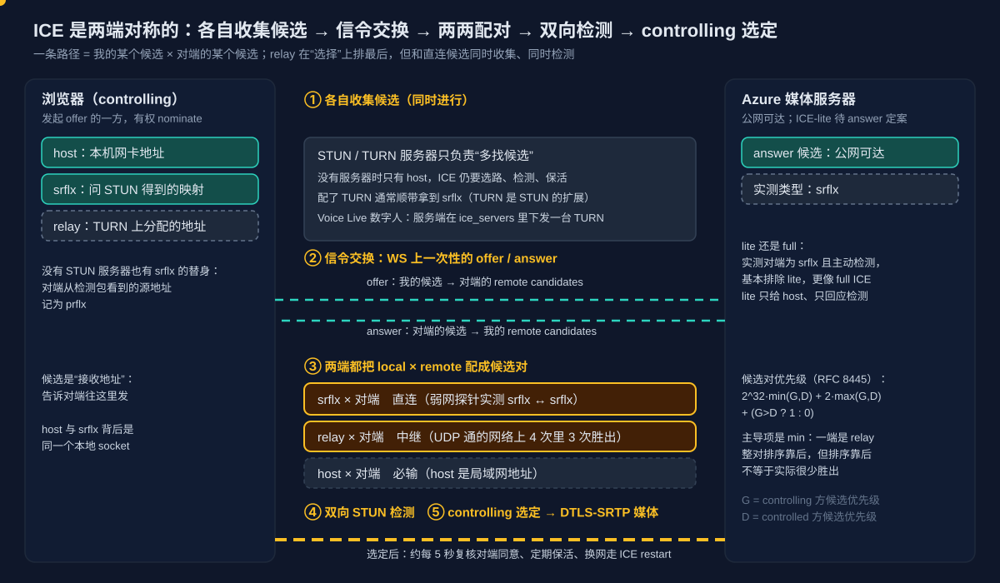
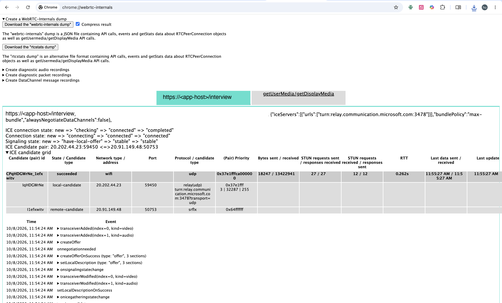

# Voice Live 系列 16：传输层概念对齐——WebSocket 与 WebRTC 两条路径、ICE 两端对称与五件事、Opus 为何进不了 WS、用 webrtc-internals 验证

> 系列导读与主题地图见[系列 00](Voice%20Live系列00：导读——主题地图、阅读顺序与已定决策速查.md)。**本文是传输层的前置篇**：编号排在后面，是因为它成文晚，阅读时建议放在[系列 03](Voice%20Live系列03：数字人出场延迟优化——ICE门控根因、实测分解与预热占位策略.md)、[系列 10](Voice%20Live系列10：ICE、STUN与TURN——数字人WebRTC建连的候选类型、一次性信令与直连优先relay保底拓扑.md)、[系列 11](Voice%20Live系列11：自建TURN中继——ice_servers替换入口、coturn要求、与Azure侧的关系及何时值得.md)、[系列 12](Voice%20Live系列12：弱网表现——Azure码率自适应实测、1080p解码失效机制、胖视频饿死音频与关画面保声音.md) 之前读。系列10 已讲过的候选三类型、SDP 候选行格式、门控与一次性信令，本文只引用不重复。

**触发本文的追问**：ICE、STUN、TURN、relay 是数字人引入的吗？纯语音还有吗？语音也能走 WebRTC，那还有吗？没有 STUN、TURN 服务器，为什么还要 ICE？Opus 为什么只有 WebRTC 能用？

**标注约定**：**（文档）** 已在 Microsoft Learn 或 RFC 查证；**（实测）** 系列内已有实测；**（推断）** 文档未说明、尚未实测，引用前需验证。

## 一、结论先行

1. **ICE、STUN、TURN、relay 属于 WebRTC，不属于数字人。** 在 Voice Live 里只有数字人默认走 WebRTC，所以看起来像数字人带进来的。
2. **纯语音走 WebSocket 时，这些全都没有。** 只要 443 端口的 WSS 能通。
3. **语音改走 WebRTC，ICE 一定有**，STUN、TURN 取决于服务端下不下发。连有公网地址的媒体服务器时不配 STUN、TURN 往往也能通，但**没有 relay 保底**，出站 UDP 被封就建连失败。
4. **ICE 两端对称。** 一条路径 = 我的某个候选 × 对端的某个候选。relay 在**排序**上靠后，但和直连候选**同时收集、同时检测**；实测 UDP 未被封的开发网络上 4 次里 relay 胜出 3 次（8.5 截图是其中一次），"保底"是排序语义，不等于很少用到。
5. **STUN、TURN 服务器只负责"多找候选"。** 选路、连通性检测、对端同意、保活、换网，这五件事有没有服务器 ICE 都要做。
6. **WebRTC 与 WebSocket 的差别远不止 UDP 换 TCP**：编码、丢包处理、抖动缓冲、拥塞控制、发送节奏、媒体经不经过后端，全都不一样。
7. **Opus 不是 WebRTC 专属**，只是 Voice Live 的 WebSocket 接口不收 Opus。

## 二、Voice Live 的两条传输路径与四种组合

### 2.1 纯语音：WebSocket

音频是 PCM 帧，在 WebSocket 上双向传。WebSocket 就是 TCP + TLS，和普通 HTTPS 一样能穿代理与防火墙，所以不收集候选、没有 STUN 与 TURN、没有 SDP offer / answer。常见的部署是浏览器 → 自己的后端代理 → Azure Voice Live，全程 WebSocket，整条链路里没有 WebRTC。

### 2.2 数字人：WebRTC

数字人的画面是一路实时视频，Azure 用 WebRTC 推给浏览器（文档）：

1. 会话配置 avatar 后，Azure 在 `session.updated` 的 `session.avatar.ice_servers` 里返回 TURN 地址和临时凭据。
2. 浏览器用它创建 `RTCPeerConnection`，生成 SDP offer。
3. offer 经 base64 放进 `session.avatar.connect` 的 `client_sdp`，**走同一条 WebSocket** 发给 Azure，Azure 回 answer。这就是系列10 说的"一次性信令"。
4. ICE 能直连就直连，否则走 relay。

麦克风的 `getUserMedia` 两种模式都会调用；`new RTCPeerConnection` 只在数字人这条路径上出现。这条区别后面验证时会用到（第八节）。

**一个例外**（文档）：avatar 有个 `output_protocol` 字段，可选 `webrtc`（默认）或 `websocket`。选 `websocket` 时数字人视频也走 WS，整条链路就没有 ICE 了。代价与可用性见[系列 12](Voice%20Live系列12：弱网表现——Azure码率自适应实测、1080p解码失效机制、胖视频饿死音频与关画面保声音.md) 可调字段表里的待验项。

### 2.3 语音也可以走 WebRTC

- **Azure OpenAI Realtime**（文档）官方支持 WebRTC 接入并建议客户端使用，标称延迟约 100 ms、WebSocket 约 200 ms。官方示例直接 `new RTCPeerConnection()`，**没有配 iceServers**。
- **Voice Live**（文档 + 实测）：SDK 里有 `rtc.call.sdp.create` / `rtc.call.sdp.created`，可在 WS 上发 SDP offer 建一条 WebRTC 语音通道。[系列 01 第四节](Voice%20Live系列01：Agent实现架构——从级联流水线到Azure%20Voice%20Live%20API.md)已实测上行 WebRTC 可用，但**今天和数字人互斥**：官方说明 avatar 在 side-band control 下不支持。
- **未查证**：Voice Live 语音 WebRTC 会不会下发 TURN。

### 2.4 四种组合

| 传输方式 | ICE | STUN | TURN / relay | 防火墙要求 |
|---|---|---|---|---|
| 语音 · WebSocket | 无 | 无 | 无 | 443 WSS 通即可 |
| 语音 · WebRTC（OpenAI Realtime 示例） | 有 | 通常不配 | 通常没有，无保底 | 需要出站 UDP |
| 数字人 · WebRTC（Voice Live 默认） | 有 | TURN 兼做 | 有，下发一台 TURN | UDP，或 TURN 走 TCP / TLS |
| 数字人 · WebSocket（`output_protocol: websocket`） | 无 | 无 | 无 | 443 WSS 通即可 |

## 三、候选再对齐：四个容易混的点

候选三类型（host / srflx / relay）的定义、缩写和 SDP 行格式见[系列 10 第二节](Voice%20Live系列10：ICE、STUN与TURN——数字人WebRTC建连的候选类型、一次性信令与直连优先relay保底拓扑.md#二三类候选hostsrflxrelay-各是什么)。这里只补四个容易混的点。

1. **候选是"接收地址"，不是源地址。** 它写在 SDP 里告诉对端"往这里发，我收得到"。
2. **候选背后有个真正收发数据的 socket（base）。** host 与 srflx 的 base 是**同一个本地 socket**，srflx 只是它经过 NAT 后在外面"看起来"的地址；relay 的 base 在 TURN 服务器上，我发的数据先封装交给 TURN，由它代发。
3. **第四种候选 prflx（peer reflexive）。** srflx 是 STUN **服务器**看到的我的地址；遇到对称 NAT，我发往对端的包会被分配另一个外网端口，STUN 服务器看到的地址对对端没用。ICE 的处理是：对端收到我的检测包后，把**实际看到的源地址**记为一个新候选，即 prflx。这是"不配 STUN 服务器也能通"的原因之一。
4. **STUN 与 TURN 不是二选一，而是同时收集。** ICE 开始时同时收集各类候选，配对后并行检测，最后选出能通的里面优先级最高的一对。"直连优先、relay 保底"说的是**选择顺序**，不是**时间顺序**：不是 STUN 失败了才去试 TURN，relay 早就备好了。TURN 是 STUN 的扩展，向 TURN 申请中转地址的应答里本身带着我的公网映射，所以配了 TURN 通常顺带拿到 srflx——这正是 Azure 只下发一台 TURN 的原因（[系列 10 5.3](Voice%20Live系列10：ICE、STUN与TURN——数字人WebRTC建连的候选类型、一次性信令与直连优先relay保底拓扑.md#53-azure-为什么只下发一台-turn却又允许直连)）。

**relay 与 TURN 这两个词**：TURN 是协议，也指那台服务器；relay 是 TURN 分配出来的候选类型，也指"媒体经服务器中转"这种连接方式。

**什么时候离不开 TURN**：

| 情况 | 原因 | 能否直连 |
|---|---|---|
| 锥形 NAT（多数家用路由器） | 同一内网端口映射固定，对端照映射发包就能进来 | 能 |
| 对称 NAT | 发往不同目的地址每次分配不同外网端口 | 对端是公网服务器时多半仍能靠 prflx 通（推断），两端都在对称 NAT 后则不能 |
| 出站 UDP 被封（企业网、部分 VPN、酒店） | 直连检测包出不去 | 不能，TURN 走 TCP 或 TLS 443 |
| 只允许经 HTTP 代理出网 | 同上，且非 HTTP 流量全拦 | 不能，取决于 TURN 能否走代理 |

| | STUN | TURN |
|---|---|---|
| 服务器负担 | 回答一个小请求，之后不参与 | 全程转发所有媒体 |
| 延迟 | 直连，最低 | 多绕一跳 |
| 成本 | 几乎为零 | 带宽成本高，所以要凭据 |

连 Azure 时的特殊之处（推断）：Azure 媒体服务器公网可达，客户端在对称 NAT 后主动发包过去，对端也能通过 prflx 学到地址并回包，所以真正离不开 TURN 的主要是"出站 UDP 被封"。但这条推断不能读成"relay 很少被用到"：[系列 10 4.4](Voice%20Live系列10：ICE、STUN与TURN——数字人WebRTC建连的候选类型、一次性信令与直连优先relay保底拓扑.md#44-修复为什么成立因为我们知道了谁会赢) 在一台 UDP 并未被封的开发机上连测 3 次，**两次胜出的是 relay/udp**，一次是 srflx/udp；[系列 12](Voice%20Live系列12：弱网表现——Azure码率自适应实测、1080p解码失效机制、胖视频饿死音频与关画面保声音.md) 的弱网探针则测到 srflx ↔ srflx 直连；本文 8.5 的截图又是一次 relay(udp) 胜出，浏览器到 TURN 走的就是 UDP，可见 UDP 并没被封。直连可行时 relay 为什么仍会胜出，原因未查明（合计 4 次、同类开发网络），列入第九节待验。

## 四、两端对称：local candidate 与 remote candidate



### 4.1 完整过程

1. 两端各自收集候选。
2. 经信令交换：我的候选成为对端的 remote candidates，对端的候选成为我的 remote candidates。
3. 两端都把 local × remote 两两配成候选对（candidate pair）。
4. 两端都对候选对发 STUN 检测。
5. controlling 一方选定最终那一对（nominate），之后走 DTLS-SRTP 媒体。

对端的候选同样带 `typ host` / `typ srflx` / `typ relay`。我这边与对端的组合：

| 我这边 | 对端 | 含义 |
|---|---|---|
| host | host | 同一局域网，或双方都有公网 IP |
| srflx / prflx | host | 我在 NAT 后，对端有公网地址 |
| srflx | srflx | 双方都在 NAT 后，打洞成功 |
| relay | 任意 | 我这边走 TURN 中转 |

Voice Live 数字人上，浏览器的 host 是局域网地址，对端配不上，**host 必输**（[系列 10 4.4](Voice%20Live系列10：ICE、STUN与TURN——数字人WebRTC建连的候选类型、一次性信令与直连优先relay保底拓扑.md#44-修复为什么成立因为我们知道了谁会赢)）。对端在 answer 里给的候选是什么类型，要抓一次 SDP answer 才能说清（第八节）。

### 4.2 controlling 与 controlled

ICE 规定一方是 controlling、另一方是 controlled。双方都做检测，只有 controlling 方有权选定最终那一对，通常是发起 offer 的一方——在 Voice Live 数字人上就是浏览器。

对端若是 ICE-lite（见 4.3），它固定是 controlled，客户端是唯一的 controlling 方，选路完全由浏览器决定。

### 4.3 ICE-lite，以及服务端一般公布什么

**"公布"指的是写进 SDP 交给对端的 `a=candidate:` 行**，即"往这些地址发，我收得到"。ICE-lite 是 RFC 8445 里给**始终公网可达的一端**（典型是媒体服务器）准备的精简实现，和完整实现（full）的差别：

| | full ICE（如浏览器） | ICE-lite（如媒体服务器） |
|---|---|---|
| 收集候选 | host、srflx、relay 都收集 | 只公布自己的 host 候选，不问 STUN、不申请 TURN |
| 连通性检测 | 主动向对端每个候选对发检测 | 不主动发，只回应 |
| 角色 | 与 lite 对接时一定是 controlling | 一定是 controlled |
| SDP 标记 | 无 | 会话级一行 `a=ice-lite` |

"只公布 host"的意思是只列**自己网卡上绑定的地址**，没有 srflx 与 relay。一个典型的 lite 服务器的 SDP 大致如下：

```
a=ice-lite
a=candidate:1 1 udp 2130706431 20.50.12.34 40000 typ host
a=candidate:2 1 tcp 1076302079 20.50.12.34 40000 typ host tcptype passive
```

地址是公网 IP，所以类型虽叫 host，对端照样能直接连到。第二行是 **TCP passive** 的 host 候选（ICE-TCP，RFC 6544），给 UDP 被封的客户端走 TCP，不配 TURN 也能兜住一部分环境。lite 之所以够用：客户端在 NAT 后面没关系，它主动发检测包过来，服务器从包里看到真实源地址（prflx）照着回包即可，服务器不需要自己"打洞"。前提是它必须真的公网可达，在 NAT 后就不该用 lite。

云主机上有个特殊情况：网卡上往往只有内网 IP，公网 IP 是平台的 1:1 NAT 映射，网卡看不到。这时有两种做法，**对端看到的候选类型也因此不同**：

| 角色 | 通常公布的候选 | 对端看到的类型 |
|---|---|---|
| 浏览器（full） | host + srflx + relay；host 常被隐藏成 `xxxx.local` 的 mDNS 名 | srflx 要配 STUN 或 TURN 才有，relay 要配 TURN 才有 |
| ICE-lite 服务器，配"对外宣告地址" | 把公网 IP 当 host 写进去，常加 TCP passive | `typ host` |
| full ICE 服务器，在云上 1:1 NAT 后 | 内网 host + 经 STUN 或静态映射得到的公网 srflx | 能连上的是 `typ srflx` |
| 自带 TURN 的服务 | 服务器侧同上两行之一，另在给客户端的 ice_servers 里下发 TURN | relay 候选由**客户端**申请，服务器自己不一定有 |

开源实现里，mediasoup 只支持 ICE-lite（用 announced address 宣告公网 IP）；Janus 两种都支持，可切成 lite，并有 1:1 NAT 映射配置；Jitsi Videobridge 用 full ICE，通过 STUN 或静态映射拿到公网地址。

**放到 Azure 上看**：[系列 12](Voice%20Live系列12：弱网表现——Azure码率自适应实测、1080p解码失效机制、胖视频饿死音频与关画面保声音.md) 的探针测到的路径是 srflx ↔ srflx，即**对端候选是 srflx**。这更像上表第三行"full ICE 服务器在 1:1 NAT 后"，而不像标准的 lite（通常只给 `typ host`）。所以 Azure 数字人媒体服务器**有可能不是 ICE-lite**，若如此，两端都会主动做检测，"Azure 只应答、浏览器包办选路"不成立，第三节"relay 为什么常胜出"也要按两端都在检测来分析。8.5 的截图给了第二条证据：浏览器**收到**对端 12 次 STUN 检测请求并逐一回应，说明对端在主动发检测，而 lite 一端不主动发起检测，这与 lite 不符。两条证据合起来，**基本可以排除 ICE-lite**，Azure 更像云上 1:1 NAT 后的 full ICE；最终以 SDP answer 里没有 `a=ice-lite` 定案（8.2）。

### 4.4 候选对的优先级由两端一起决定

RFC 8445 的候选对优先级公式（文档），G 是 controlling 方候选的优先级，D 是 controlled 方的：

```
pair priority = 2^32 × min(G, D) + 2 × max(G, D) + (G > D ? 1 : 0)
```

主导项是 `min`：一对的排名主要看两端中较差的那个。只要一端是 relay，这一对就排在后面——这是"直连优先、relay 保底"在数学上的体现。但排序只决定"都通时选谁"，不决定"谁先检测通过"，这和第三节 relay 实测常胜出并不矛盾，只是原因还待查。

## 五、没有 STUN、TURN 服务器，为什么还要 ICE

"没有 STUN 服务器"不等于"没有 STUN 协议"。ICE 除了收集候选，还要做五件事，有没有服务器都要做（文档，RFC 8445 / RFC 7675）：

1. **选路。** 一台电脑通常有多个出口（Wi-Fi、有线、VPN、IPv4、IPv6），每个都是一个 host 候选，要逐一检测，选能通且最好的。
2. **连通性检测，并学到 NAT 外的地址。** 浏览器直接向对端候选发 STUN Binding Request（用 STUN 协议，不经 STUN 服务器），对端从包里学到我的映射地址（prflx）并回包。
3. **对端同意（consent）。** 浏览器绝不向没回应过 ICE 检测的地址发媒体，并大约每 5 秒复核一次（RFC 7675 consent freshness）。否则网页 JS 就能让浏览器向任意 IP 发 UDP 洪泛。ICE 的 ufrag / pwd 对检测包做认证，后续 DTLS 握手也和它绑定。
4. **保活。** UDP 没有连接，NAT 映射会过期，ICE 定期发包保持映射。
5. **换网。** Wi-Fi 切到 4G 时用 ICE restart 换路，不必重建整个会话。

一句话：**STUN、TURN 服务器用来多找候选；ICE 是验证并维持路径的机制，无论如何都要有。** "数字人一端明明是服务器，为什么还要 ICE"的另一种回答见[系列 10 第七节](Voice%20Live系列10：ICE、STUN与TURN——数字人WebRTC建连的候选类型、一次性信令与直连优先relay保底拓扑.md#七为什么-websocket-没有这个问题)。

## 六、WebRTC 与 WebSocket：不只是 TCP 换成 UDP

UDP 只是最底层。WebRTC 在上面叠了一整套为实时媒体设计的协议与处理，WebSocket 只是一条通用的可靠字节管道。

| 方面 | WebSocket | WebRTC |
|---|---|---|
| 丢包怎么处理 | TCP 重传，后面的包全排队等（队头阻塞） | 丢了就跳过，由丢包隐藏补上 |
| 编码 | PCM16 裸音频 | Opus，约 32 kbps，带 FEC、DTX |
| 抖动缓冲与播放 | 应用自己写（如 AudioWorklet 播放队列） | 浏览器内置 |
| 拥塞控制 | 只有 TCP 那套，不感知媒体 | RTCP 反馈 + 带宽估计，自动调码率 |
| 加密 | TLS | DTLS-SRTP |
| 发送节奏 | 服务端能推多快推多快 | 按实时速度 |
| 事件通道 | 和音频同一条 WS | 另开 DataChannel 或 side-band WS |
| 网络要求 | 443 TCP | 出站 UDP（或 TURN） |

和语音产品直接相关的三点：

1. **弱网表现差别最大。** 重传要等一个 RTT 以上，卡顿近似等于丢包数 × RTT，正是 TCP 队头阻塞（[系列 12](Voice%20Live系列12：弱网表现——Azure码率自适应实测、1080p解码失效机制、胖视频饿死音频与关画面保声音.md) 在约 300 ms RTT 下实测）。WebRTC 不等重传，丢包表现为音质轻微下降而不是卡住。
2. **打断（barge-in）会重新有意义。** 实测 Azure 在 WS PCM 下行上不到 1 秒就把一整段回复的音频推完并标记完成，所以 `interrupt_response` 没有可截断的对象（[系列 08](Voice%20Live系列08：应答门控——判停与开轮之间的四个判断：EOU、LLM%20judge、两段式提交与频率策略.md)）。WebRTC 按实时速度推，服务端知道播到哪儿，打断和截断才有意义（推断，待在 WebRTC 音轨路对照实测）。
3. **架构会变，这一条最需要权衡。** WebRTC 时媒体在浏览器和 Azure 之间**直连**，不经过后端。后端代理原本承担的隐藏密钥、鉴权、记录转写、注入预生成 TTS 等职责都要重新设计，后端只剩签发临时 token 和信令，控制靠 side-band WS（文档：Azure Realtime 的 SDP 应答带 `Location` 头，可以用来再连一条控制 WS）。

## 七、Opus：为什么看起来"只有 WebRTC 能用"

### 7.1 基本情况与三种模式

Opus 是 IETF 标准（RFC 6716，2012），开源免专利费，WebRTC 强制要求支持（RFC 7874）。它由 Skype 的 SILK（语音）与 Xiph 的 CELT（音乐、低延迟）融合而来：

| 模式 | 原理 | 适用 |
|---|---|---|
| SILK | 线性预测，模拟声道 | 低码率语音 |
| CELT | MDCT 变换编码 | 音乐、高码率、超低延迟 |
| Hybrid | 低频 SILK + 高频 CELT | 中码率高质量语音 |

编码器按码率与内容自动切换，无需重新协商。关键参数：码率 6～510 kbps，语音 16～32 kbps 就很清晰；音频带宽从窄带 4 kHz 到全频带 20 kHz，RTP 时钟固定 48 kHz；帧长 2.5～60 ms，WebRTC 默认 20 ms；算法延迟默认约 26.5 ms，低延迟模式约 5 ms。为实时传输准备的特性：带内 FEC（每包夹带上一帧的低码率副本）、DTX（静音几乎不发包）、PLC（丢包时按前文推测补一段）、可变码率；Opus 1.5（2024）加了基于神经网络的深度 PLC 与 DRED（可夹带长达约 1 秒的冗余）。

### 7.2 和 PCM16 的带宽差

| | PCM16（WS 路径） | Opus（WebRTC） |
|---|---|---|
| 上行 16 kHz | 256 kbps | 约 24～32 kbps |
| 下行 24 kHz | 384 kbps | 约 24～32 kbps |
| 丢包 | TCP 重传，会卡住 | FEC + PLC，听感不断 |

差 10 倍以上。WebRTC 路径上 Opus 只用在浏览器到 Azure 这一段，Azure 解码成 PCM 再交给模型，模型"听到"的和走 WS 时一样。上行 256 kbps 这个数与 [系列 01 4.5.4](Voice%20Live系列01：Agent实现架构——从级联流水线到Azure%20Voice%20Live%20API.md#454-上行成帧同一份音频怎么从-391-kbps-降到-256-kbps2026-10-03-实测落地) 的实测一致，那里也测了 permessage-deflate 对裸 PCM 只压到 95%，基本无效。

### 7.3 真正的限制在 Voice Live 的 WebSocket 接口

Opus 是编码格式，和传输协议无关：`.opus` / `.ogg` / `.webm` 文件、`MediaRecorder` 录音、各类 IM 语音消息、YouTube 音轨都用它；浏览器 WebCodecs 的 `AudioEncoder` / `AudioDecoder` 能直接编解码 Opus，编出来的帧完全可以走 WebSocket。

限制在 Voice Live 的 WS 接口（文档，API 参考 2025-10-01 到 2026-06-01-preview 一致）：

| 方向 | 允许的格式 |
|---|---|
| 输入 `input_audio_format` | `pcm16`、`g711_ulaw`、`g711_alaw` |
| 输出 `output_audio_format` | `pcm16`、`pcm16_8000hz`、`pcm16_16000hz`、`g711_ulaw`、`g711_alaw` |

为什么这样设计（推断）：WS 接口主要面向服务端对服务端和电话场景，后端手里本来就是 PCM，G.711 是电话网标准；Opus 的 FEC、PLC 是为会丢包的网络设计的，TCP 已经把丢包变成重传，这些用不上，只剩省带宽；Opus 是一个个独立的包，在字节流上要额外约定帧边界（Ogg 封装或长度前缀），PCM 随便切。这和[系列 01 4.5.2](Voice%20Live系列01：Agent实现架构——从级联流水线到Azure%20Voice%20Live%20API.md#452-为什么会有这些不一致三条产品线的拼接缝)"三条产品线的拼接缝"是同一个来源。

### 7.4 可选方案：只在第一段用 Opus

链路是"浏览器 ↔ 后端 ↔ Azure"，紧张的是第一段（用户网络），第二段在数据中心内，带宽便宜：

```
浏览器 ──Opus(WS)──▶ 后端 解码成 PCM ──pcm16(WS)──▶ Azure
浏览器 ◀──Opus(WS)── 后端 编码成 Opus ◀──pcm16(WS)── Azure
```

- **收益**：用户一侧带宽降到约十分之一。
- **代价**：后端每路会话做 Opus 编解码；每帧多约 20 ms 打包延迟；WebCodecs 在 Safari 上的兼容性要实测；**不解决 TCP 队头阻塞**，只是减轻。
- **另一个现成选项** `g711_ulaw` / `g711_alaw`：64 kbps，Azure 原生支持，但 8 kHz 窄带是电话音质，会影响识别准确率，面试这类场景不推荐。

**方向选择**：只想省带宽 → 第一段换 Opus，架构基本不动；还想消除卡顿 → 必须换 WebRTC（只有 UDP 能避开队头阻塞），代价是媒体不再经过后端（第六节第 3 点）。

## 八、在浏览器里几分钟验证

### 8.1 一份空 dump 说明什么

`chrome://webrtc-internals` 导出的 dump 里：

```json
"getUserMedia": [],
"PeerConnections": {}
```

两个都空，说明导出时这个浏览器 profile 里既没有 WebRTC 连接、也没打开过麦克风，即当时没有会话在进行。对照第二节：**纯语音会话有 `getUserMedia` 记录但 `PeerConnections` 为空**（符合"纯语音没有 WebRTC"），只有数字人会话两者都有。

拿到空 dump 的常见原因：导出时会话已结束，或页面被刷新、关闭过；会话在别的 profile 里进行（无痕窗口、另一个 Chrome 用户、Edge）；没开数字人；数字人很快退回纯语音（弱网自动降级，或撞上[系列 13](Voice%20Live系列13：数字人配额与限流——文档值vs实测值、并发5与新建3次每分钟两条限制、为何没有可申请的quota.md) 的创建速率限制），PeerConnection 随即关闭。

### 8.2 用 webrtc-internals 看最终走了哪条路

1. **先**打开 `chrome://webrtc-internals` 并保持打开。
2. 在**同一个 Chrome 窗口**（非无痕）另一个标签页，开一场带数字人的会话。
3. 等数字人画面出现、开始说话，不要关闭或刷新会话页。
4. 回到 internals，展开会话页对应的条目：
   - **Stats Tables** 里找 `candidate-pair`，看 `nominated: true` 且 `state: succeeded` 的那条。
   - 顺着它的 `localCandidateId` / `remoteCandidateId` 找到 `local-candidate` / `remote-candidate`，看 `candidateType`（host / srflx / prflx / relay）。**只要有一端是 relay，媒体就经过了 TURN**；local 端是 relay 时 `relayProtocol` 说明浏览器到 TURN 走的是 udp、tcp 还是 tls。
   - **Event log** 的 `setRemoteDescription` 里是 Azure 返回的 SDP answer：有没有会话级 `a=ice-lite`；`a=candidate:` 行是对端候选，看是 `typ host` 还是 `typ srflx`、有没有 `tcptype passive`——据此判断对端是 ICE-lite 还是云上 1:1 NAT 后的 full ICE（4.3）。
5. 再点 "Create dump" 导出。

### 8.3 用 getStats 做同样的事

自己的测试页里拿得到 `RTCPeerConnection` 实例时，在控制台跑：

```js
const stats = await pc.getStats();
const byId = {};
stats.forEach(r => (byId[r.id] = r));
stats.forEach(r => {
  if (r.type === "candidate-pair" && r.nominated && r.state === "succeeded") {
    const l = byId[r.localCandidateId], rm = byId[r.remoteCandidateId];
    console.log("local", l.candidateType, l.protocol, l.relayProtocol ?? "",
                "→ remote", rm.candidateType, rm.protocol, "rtt", r.currentRoundTripTime);
  }
});
```

### 8.4 不开会话也能测 TURN 是否可达

想知道"这个网络里 TURN 通不通、走的是哪种协议"，不必等一场完整会话。从一次 `session.updated` 拿到 `session.avatar.ice_servers`（凭据是临时的，拿到后尽快用），在任意页面控制台跑：

```js
const pc = new RTCPeerConnection({ iceServers, iceTransportPolicy: "relay" });
pc.createDataChannel("probe");
pc.onicecandidate = e => e.candidate && console.log(e.candidate.type, e.candidate.protocol, e.candidate.address);
await pc.setLocalDescription(await pc.createOffer());
```

`iceTransportPolicy: "relay"` 让浏览器只收集 relay 候选。打出 `relay` 候选就说明 TURN 分配成功、这个网络能走中继；一条都没有就说明连 TURN 都不通，这个网络里数字人画面没有保底。这只测"浏览器到 TURN"这一段，不测 TURN 到 Azure 媒体服务器；客户网络基线的完整测法见[系列 12](Voice%20Live系列12：弱网表现——Azure码率自适应实测、1080p解码失效机制、胖视频饿死音频与关画面保声音.md) 第七节。

### 8.5 一次实测：怎么读这张 webrtc-internals 截图

下面是一场数字人会话进行中、按 8.2 抓到的 webrtc-internals 页面（前端地址已隐去）：



| 看哪里 | 截图里的值 | 读出什么 |
|---|---|---|
| 第一行构造参数 | `iceServers` 只有 `turn:relay.communication.microsoft.com:3478`；`bundlePolicy: max-bundle` | Azure 只下发一台 TURN（与[系列 10 5.3](Voice%20Live系列10：ICE、STUN与TURN——数字人WebRTC建连的候选类型、一次性信令与直连优先relay保底拓扑.md#53-azure-为什么只下发一台-turn却又允许直连)一致）；音视频合用一条传输，所以只有一对候选对 |
| 三行状态 | ICE `new → checking → connected → completed`；signaling `new → have-local-offer → stable` | 浏览器是发 offer 的一方，即 controlling；ICE 走完了检测并定下路径 |
| `ICE Candidate pair` | `20.202.44.23:59450 <=> 20.91.149.48:50753`，状态 `succeeded` | 这就是 nominated 的那一对 |
| `local-candidate` | `relay(udp)`，经 `turn:relay.communication.microsoft.com:3478?transport=udp` | **媒体经过 TURN**；浏览器到 TURN 走 UDP，说明这个网络 UDP 是通的，relay 仍然胜出 |
| `remote-candidate` | `srflx`，`20.91.149.48:50753` | 对端以 srflx 公布，不是 lite 常见的 host（4.3） |
| 优先级 | local `0x37e1fff`，remote `0x64ffffff` | relay 一端低得多，按 4.4 的公式整对排在后面——排序靠后照样胜出 |
| Bytes sent / received | 18 247 / 13 422 941 | 下行约 13 MB 是数字人的视频加音频；上行只有十几 KB，是 RTCP 与检测包。**麦克风不走这条连接**，上行音频在 WebSocket 上（第二节、[系列 01](Voice%20Live系列01：Agent实现架构——从级联流水线到Azure%20Voice%20Live%20API.md)） |
| STUN requests sent / responses received | 27 / 27 | 浏览器发出的检测与保活全部有回应 |
| STUN requests received / responses sent | 12 / 12 | **对端也在主动发检测**，ICE-lite 一端不会这样做（4.3） |
| RTT | 0.262 s | 经 TURN 中转后的往返时延，跨区域开发机上与[系列 12](Voice%20Live系列12：弱网表现——Azure码率自适应实测、1080p解码失效机制、胖视频饿死音频与关画面保声音.md) 记的约 300 ms 同一量级 |

这一张图回答了本文的三个问题：relay 在 UDP 通的网络上也会胜出；对端以 srflx 公布并主动检测，基本不是 ICE-lite；数字人这条 WebRTC 连接只承载下行。下面的 Event log 从 `transceiverAdded(video)`、`transceiverAdded(audio)` 到 `createOffer`、`setLocalDescription`，就是第二节那套一次性信令在浏览器侧的时间线；继续往下展开 `setRemoteDescription` 即可看到 SDP answer，用来给 ICE-lite 定案。

### 8.6 WebSocket 侧怎么看：没有 webrtc-internals，要分层

WebSocket 没有和 webrtc-internals 对等的工具，原因和第六节同源：WebRTC 的拥塞控制、抖动缓冲、丢包统计、RTT 都在浏览器里，浏览器才能把它们摆出来；WebSocket 只是 TCP 上的字节管道，重传、RTT、拥塞窗口在操作系统的 TCP 栈里，浏览器自己也看不到。所以按层选工具：

| 想看什么 | 工具 | 能看到 |
|---|---|---|
| 消息层：发了什么、收到什么、什么时刻 | Chrome DevTools → Network → 筛选 `WS` → 点开连接 → **Messages**（Firefox 有同样的面板） | 每帧方向、时间戳、大小、内容；二进制帧只显示长度。**Headers** 里能看到握手，如 `Sec-WebSocket-Extensions: permessage-deflate` |
| 连接层：握手、代理、TLS、连接复用 | `chrome://net-export` 导出 NetLog，用 netlog-viewer 打开 | socket 建立、`101 Switching Protocols`、代理协商、TLS 握手、收发字节数；看不到帧内容 |
| 传输层：重传、RTT、窗口、队头阻塞 | Wireshark / tcpdump；只看 RTT 与重传，Linux 上 `ss -ti` | TCP 重传、RTT、零窗口。**对应 webrtc-internals 里 RTT 与丢包那部分的是这一层** |
| 应用层自测：上行有没有被网络卡住 | 页面里读 `ws.bufferedAmount` | 已交给 WebSocket、还没发上网络的字节数 |
| 中间人代理 | mitmproxy、Charles、Fiddler | 完整的 WS 消息流，可过滤、重放 |
| 手动连一条 | wscat、websocat | 命令行里直接收发帧，单独验证服务端 |

**DevTools Messages：最常用，能直接看到两件前文的结论。**

1. 开 DevTools 后**再**建会话（先建后开，Messages 里只有打开之后的帧）。
2. Network 面板筛选 `WS`，点开 Voice Live 那条连接，切到 Messages。
3. 看下行：一次回复的音频增量帧在不到 1 秒内集中涌到，紧跟着就是 `response.done`，而播放要持续好几秒。这就是 WS PCM 下行上 `interrupt_response` 没有可截断对象的现场（[系列 08](Voice%20Live系列08：应答门控——判停与开轮之间的四个判断：EOU、LLM%20judge、两段式提交与频率策略.md)、第六节第 2 点）。
4. 看上行：音频帧是 base64 JSON 文本还是裸 PCM 二进制、每帧多大、多久一帧。这对应 [系列 01 4.5.4](Voice%20Live系列01：Agent实现架构——从级联流水线到Azure%20Voice%20Live%20API.md#454-上行成帧同一份音频怎么从-391-kbps-降到-256-kbps2026-10-03-实测落地) 从 391 降到 256 kbps 的那次改动。
5. 切到 Headers，确认握手协商了 permessage-deflate 没有（同一节测过它对文本帧压掉 27%、对裸 PCM 基本无效）。

音频帧数量很大，用 Messages 顶部的过滤框按事件名筛（如 `response.done`、`session.updated`），比逐帧翻快。

**`bufferedAmount`：WebSocket 能拿到的最接近"带宽估计"的信号。** 它是已交给 `send()`、但还没真正发上网络的字节数。网络够用时它在每次发送后很快回到 0；持续上涨说明上行跟不上发送速度，帧在本地排队，之后到达 Azure 时已经晚了。自己的页面里拿得到 socket 实例时：

```js
setInterval(() => console.log("bufferedAmount", ws.bufferedAmount), 500);
```

它只反映**上行**、只反映本机发送缓冲；下行卡没卡，要看 Messages 里帧的到达间隔，或者到传输层看。

**弱网时 DevTools 只能看到"帧到晚了"，看不出为什么。** 要证明是 TCP 重传造成的队头阻塞（[系列 12](Voice%20Live系列12：弱网表现——Azure码率自适应实测、1080p解码失效机制、胖视频饿死音频与关画面保声音.md) 的"卡顿约等于丢包数乘 RTT"），得到传输层：

1. 用导出 TLS 密钥的方式启动一个独立的 Chrome（macOS 上 `open` 不传环境变量，要直接起二进制）：

   ```bash
   SSLKEYLOGFILE=$HOME/sslkeys.log \
     "/Applications/Google Chrome.app/Contents/MacOS/Google Chrome" --user-data-dir=/tmp/chrome-ws
   ```

2. Wireshark 里 Preferences → Protocols → TLS，把 (Pre)-Master-Secret log filename 指向这个文件，wss 就能解成 WebSocket 帧。
3. 过滤 `tcp.analysis.retransmission` 看重传，和 Messages 里帧到达变慢的时刻对齐；`websocket` 过滤看帧本身。

只想要数字不想抓包时，Linux 上 `ss -ti` 按连接打出 `rtt` 与 `retrans`。

一句话：**webrtc-internals 约等于 DevTools 的 WS Messages（消息）加 Wireshark（传输），中间再用 `bufferedAmount` 当拥塞信号**，没有一个工具一次全给。

## 九、待验

1. 数字人连接最终选中的候选对类型，换不同网络各测几次，补足系列10 的 n=3。
2. 直连可行时 relay 为什么仍会胜出（检测完成先后、nomination 时机，还是 srflx 那一对实际不通）。既然对端也是 full ICE、两端都在检测，分析时要把对端的检测与 nomination 一起算进去。
3. Azure 的 SDP answer 是否 `a=ice-lite`，候选是 `typ host` 还是 `typ srflx`、有无 `tcptype passive`；对端候选为 srflx 且主动发检测（8.5），已基本排除 ICE-lite，待 answer 定案。
4. 封掉出站 UDP 后，数字人能否经 TURN 的 TCP / TLS 恢复画面。
5. Voice Live 语音 WebRTC（`rtc.call.sdp.create`）路径是否下发 TURN。
6. WebRTC 音轨路上打断与截断是否如推断那样生效。

## 十、小结

1. **ICE、STUN、TURN、relay 属于 WebRTC**，纯语音走 WebSocket 时都没有；数字人走 WebRTC 才有，`output_protocol: websocket` 时又没有。
2. **语音也能走 WebRTC**，Voice Live 上实测可用但今天与数字人互斥；OpenAI Realtime 示例不配 iceServers，因此没有 relay 保底。
3. **候选是接收地址**；host 与 srflx 同一个 socket；prflx 是对端从检测包学到的地址；STUN 与 TURN 同时收集。
4. **ICE 两端对称**，一条路径是 local × remote；controlling 方选定；候选对优先级看两端中较差的那个，所以 relay 排序靠后，但实测常胜出，原因待查。ICE-lite 一端只公布 host、只应答；Azure 对端候选实测为 srflx 且主动发检测，基本排除 ICE-lite，更像云上 1:1 NAT 后的 full ICE。
5. **ICE 的五件事**：选路、检测、对端同意、保活、换网，有没有 STUN / TURN 服务器都要做。
6. **WebRTC 与 WebSocket 差在一整套媒体处理**，最大的取舍是媒体不再经过后端。
7. **Opus 进不了 Voice Live 的 WS 是接口限制**，只想省带宽可以只在浏览器到后端这一段用 Opus。
8. **验证靠 webrtc-internals 与 getStats**，看 nominated 的候选对两端类型；TURN 可达性用 `iceTransportPolicy: "relay"` 单独测。WebSocket 没有对等工具，按层看：DevTools Messages 看帧，Wireshark 看重传，`bufferedAmount` 看上行排队。

## 参考

- 系列内：[系列 10](Voice%20Live系列10：ICE、STUN与TURN——数字人WebRTC建连的候选类型、一次性信令与直连优先relay保底拓扑.md)（候选三类型、门控、一次性信令、只下发一台 TURN）、[系列 11](Voice%20Live系列11：自建TURN中继——ice_servers替换入口、coturn要求、与Azure侧的关系及何时值得.md)（自建 TURN）、[系列 12](Voice%20Live系列12：弱网表现——Azure码率自适应实测、1080p解码失效机制、胖视频饿死音频与关画面保声音.md)（弱网实测与客户网络基线）、[系列 03](Voice%20Live系列03：数字人出场延迟优化——ICE门控根因、实测分解与预热占位策略.md)（ICE 门控延迟）、[系列 01](Voice%20Live系列01：Agent实现架构——从级联流水线到Azure%20Voice%20Live%20API.md)（双通道、上行 WebRTC 与数字人互斥、采样率与成帧）
- 协议背景：[WebSocket与WebRTC深度对比——从Azure Voice Live API看实时通信协议选型](../../Notes/AI/voice/WebSocket与WebRTC深度对比——从Azure%20Voice%20Live%20API看实时通信协议选型.md)
- [Voice Live API reference — Microsoft Learn](https://learn.microsoft.com/en-us/azure/ai-services/speech-service/voice-live-api-reference-2026-04-10)（`ice_servers`、`output_protocol`、`session.avatar.connect`、音频格式）
- [How to use the Voice Live API — Microsoft Learn](https://learn.microsoft.com/en-us/azure/ai-services/speech-service/voice-live-how-to)
- [Use the GPT Realtime API via WebRTC — Microsoft Learn](https://learn.microsoft.com/en-us/azure/foundry/openai/how-to/realtime-audio-webrtc)
- [GPT Realtime API for speech and audio — Microsoft Learn](https://learn.microsoft.com/en-us/azure/foundry/openai/how-to/realtime-audio)（连接方式对比）
- [Real-time synthesis for text to speech avatar — Microsoft Learn](https://learn.microsoft.com/en-us/azure/ai-services/speech-service/text-to-speech-avatar/real-time-synthesis-avatar)（ICE relay token）
- [Interactive Connectivity Establishment (ICE) — RFC 8445](https://datatracker.ietf.org/doc/html/rfc8445)（含 ICE-lite）、[TCP Candidates with ICE — RFC 6544](https://datatracker.ietf.org/doc/html/rfc6544)、[STUN — RFC 8489](https://datatracker.ietf.org/doc/html/rfc8489)、[TURN — RFC 8656](https://datatracker.ietf.org/doc/html/rfc8656)、[STUN Usage for Consent Freshness — RFC 7675](https://datatracker.ietf.org/doc/html/rfc7675)
- [Definition of the Opus Audio Codec — RFC 6716](https://datatracker.ietf.org/doc/html/rfc6716)、[WebRTC Audio Codec and Processing Requirements — RFC 7874](https://datatracker.ietf.org/doc/html/rfc7874)
- [WebSocket: bufferedAmount property — MDN](https://developer.mozilla.org/en-US/docs/Web/API/WebSocket/bufferedAmount)、[NSS Key Log Format — Mozilla](https://firefox-source-docs.mozilla.org/security/nss/legacy/key_log_format/index.html)
- [RTCPeerConnection.getStats() — MDN](https://developer.mozilla.org/en-US/docs/Web/API/RTCPeerConnection/getStats)、[RTCIceCandidatePairStats — MDN](https://developer.mozilla.org/en-US/docs/Web/API/RTCIceCandidatePairStats)
