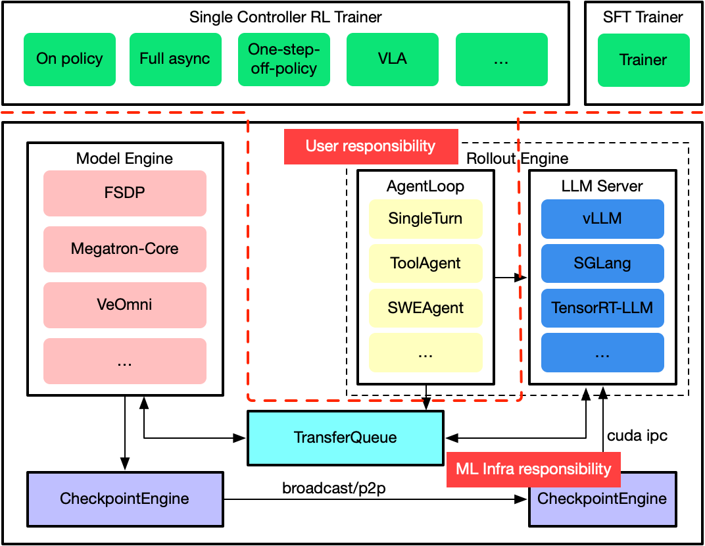

# Agent Lightning 系列 07：强化学习与 VERL 入门——RL 基础、三大框架架构对比与 agent-lightning 的选型逻辑

> 阶梯爬到第三级——RL。本篇先补强化学习的基础认知，再回答两个工程问题：VERL 到底是什么、为什么 agent-lightning 把 RL 这一级直接绑定到 VERL，而非 TRL 或 OpenRLHF。结论先行：**Agent RL 本质上是一个分布式系统问题，而非算法问题；VERL 被选中，是因为它解决的是"系统级 RL"的瓶颈，而非单纯提供训练接口。**

---

## 〇、为什么需要这一篇

[[Agent Lightning系列02：框架全景与脊柱拆解——9大模块与method-agnostic设计]] §六给出了一条由轻到重的优化阶梯：**APO → SFT → RL**。前六篇已经把前两级吃透——APO 路线见系列 01～04，SFT 路线见 [[Agent Lightning系列05：SFT路线剖析——reward不喂答案而造标签、拒绝采样微调与自蒸馏真相]] 与 [[Agent Lightning系列06：SFT实战篇——从Azure GPU VM到跑通unsloth拒绝采样微调]]。阶梯的最高级——真正用 RL 微调权重——在 agent-lightning 里只有一条内置路径：`algorithm` 槽位里的 **VERL**。

这就带出一个绕不开的问题：RL 框架并非只有 VERL 一家，社区里 TRL、OpenRLHF 同样流行，为什么 agent-lightning 偏偏选了工程门槛最高的 VERL？要回答它，需要先建立两层认知：

1. **算法层**：强化学习到底在做什么，与 SFT 的本质差异在哪；
2. **系统层**：当 RL 遇上多步 Agent，瓶颈从"算法"迁移到了"基础设施"，而三大框架恰好站在这条迁移线的不同位置。

本篇按"RL 基础 → VERL 定位 → 三框架架构对比 → agent-lightning 选型逻辑 → 标准架构与数据流 → 替代方案"的顺序展开，作为整个 RL 这一级的入门地图。

---

## 一、强化学习基础：从单轮反馈到多步轨迹

### 1.1 RL 的基本范式

强化学习的核心是一个智能体（Agent）通过与环境反复试错（trial-and-error）来学习策略（policy）。它的基本循环可以抽象为四个要素的不断流转：

```
        ┌──────────────┐
   ┌───▶│   Policy     │  根据当前状态选择动作
   │    │  π(action|state) │
   │    └──────┬───────┘
   │           │ action
   │           ▼
   │    ┌──────────────┐
   │    │ Environment  │  执行动作，返回新状态与奖励
   │    └──────┬───────┘
   │           │ (next_state, reward)
   └───────────┘
```

智能体的目标不是模仿某个"正确答案"，而是最大化长期累积奖励（cumulative reward）。这一点决定了 RL 与监督学习的根本分野。

### 1.2 RL 与监督学习 / SFT 的本质差异

| 维度 | 监督学习 / SFT | 强化学习 |
| --- | --- | --- |
| 训练信号 | 标注好的"正确答案"（label） | 标量奖励（reward），可正可负 |
| 学习方式 | 模仿已知答案 | 试错探索 + 利用反馈 |
| 样本来源 | 静态数据集 | 智能体自己与环境交互产出（rollout） |
| 能力上界 | 受限于训练数据已有的行为 | 可探索出数据中从未出现的新策略 |
| 稳定性 | 高 | 低，对超参与奖励设计敏感 |

[[Agent Lightning系列05：SFT路线剖析——reward不喂答案而造标签、拒绝采样微调与自蒸馏真相]] 已论证：SFT 的"限制"（只学正样本、不探索）恰恰是它便宜又稳的来源；而 RL 用探索换上界，代价是成本最高、最不稳。两者在 agent-lightning 里共享同一套 `Triplet` 轨迹表示（见系列 02 §2.5），因此换算法只换槽位、不动 agent 代码。

### 1.3 LLM 场景下的 RL：从 RLHF 到 RLVR

在大模型语境里，RL 主要以几种形态出现：

- **PPO（Proximal Policy Optimization）**：经典策略梯度算法，需要 actor（策略模型）与 critic（价值模型）两套网络，是 RLHF 的标准内核；
- **GRPO（Group Relative Policy Optimization）**：用组内相对优势替代独立的 critic，省去价值网络，更省显存，是近年 LLM RL 的主流选择；
- **RLHF（RL from Human Feedback）**：奖励来自人类偏好训练出的奖励模型；
- **RLVR（RL from Verifiable Rewards）**：奖励来自可自动验证的规则（如数学题答案正确、代码通过测试），无需奖励模型，是 Agent 场景最常用的形态。

这些算法层的差异，最终都收敛到一个共同的工程结构：**生成数据（rollout）与更新模型（training）两个阶段的交替**。而正是这个结构，在 Agent 场景下被放大成系统级的瓶颈。

### 1.4 单轮 RL 与多步 Agent RL 的分水岭

传统 RLHF 假设的是单轮交互：

```
prompt → model → output → reward → update
```

一次生成、一次打分、一次更新，同步且简单。但 Agent 的真实执行是多步轨迹：

```
step 1: 思考 → 调用工具 → 观察结果
step 2: 再决策 → 再调用工具 → 再观察
   ...
step n: 给出最终答案 → 整条轨迹获得 reward
```

这条轨迹具有四个传统 RL 不具备的特征：**多轮、有状态、异步、依赖外部环境（API / 数据库 / 浏览器 / 代码执行器）**。这四个特征，正是后文判断框架是否胜任 Agent RL 的核心标尺。

### 1.5 一个高频混淆：Rollout 与 Epoch 不是一类东西

初学者读 RL 训练日志时常把 `rollout` 和 `epoch` 当成层级关系，因为它们经常并排出现。但二者属于**完全不同的维度**：

- **Rollout 属于数据采集维度**——回答的是"Agent 实际执行了多少次任务"。一次"用户提问 → Search → Observation → Answer"就是一条 rollout。`1000 rollouts` 表示采集了 1000 条轨迹，属于 Data Collection 阶段；
- **Epoch 属于优化维度**——回答的是"采集到的数据被反复学习了多少遍"。`epoch 3` 表示这批轨迹被训练了 3 次，属于 Optimization 阶段。

若要在监督学习里找对应物：**rollout ≈ sample / trajectory，而非 epoch。** 类比"收集 1000 张猫狗图片，训练 5 个 epoch"——图片对应 rollout，epoch 还是 epoch。在 PPO / GRPO 的标准流程里二者的先后关系是：

```
Step 1  收集 Rollouts:  policy_v1 产出 1000 条 (prompt, response) 轨迹
Step 2  计算 Reward:    1000 条轨迹 → reward model / 规则 → 1000 个 reward
Step 3  训练:           用这 1000 条数据跑 epoch1 → epoch2 → epoch3 …
```

放进 agent-lightning 的配置语境就是：`rollout_num = 100` 先执行 100 次 Agent 任务得到 100 条 trajectory，`ppo_epoch = 4` 再拿这 100 条轨迹训练 4 个 epoch。常见 RL 术语的定位可一表厘清：

| 术语 | 本质 | 所属维度 |
| --- | --- | --- |
| Rollout | 一次轨迹采样（trajectory） | 数据采集 |
| Episode | 一次完整任务（多数场景 ≈ 一个 rollout） | 数据采集 |
| Sample | 一个训练样本 | 数据采集 |
| Batch | 一批样本 | 优化 |
| Step | 一次参数更新 | 优化 |
| Epoch | 全部数据训练一遍 | 优化 |

这也是为什么许多 RL 框架的日志会刻意分成 `Collect Rollouts` 与 `Optimize Epochs` 两段分别统计——一个在采经验，一个在更新参数。理解这条边界，是读懂后文 VERL"rollout 与 training 解耦"的前提。

---

## 二、VERL 是什么：面向大模型 RL 的分布式基础设施

### 2.0 名字与出身：Volcano Engine RL，由 ByteDance Seed Team 发起

先厘清一个常被误解的命名。VERL 不是"某个叫 Volcano 的 RL 引擎"，它的拆解是 **VE + RL**：

```
V        E          R              L
↓        ↓          ↓              ↓
Volcano  Engine     Reinforcement  Learning
└──── 火山引擎 ────┘  └──── 强化学习 ────┘
```

这里的 **VE = Volcano Engine（火山引擎）**，正是字节跳动对外云服务品牌的官方英文名，与火山引擎的英文名称完全一致；RL = Reinforcement Learning。之所以缩写成 VERL 而非 VRL，是因为把"Volcano Engine"当作一个整体品牌处理——与 AWS SageMaker、Azure ML、Google Vertex AI 把品牌名整体前置的命名方式同理。

出身上需要区分**研发团队**与**项目归属**：VERL 最初由 **ByteDance Seed Team 发起开发**，后以 Volcano Engine 品牌开源、由社区共同维护。官方 README 第一行即写明："verl is a RL training library initiated by ByteDance Seed team and maintained by the verl community."——这也解释了为何代码仓库在 `github.com/volcengine/verl`（品牌归火山引擎），而核心研发来自 Seed Team。

更关键的一条技术血缘：**VERL 是论文 _HybridFlow: A Flexible and Efficient RLHF Framework_ 的开源实现**。Seed Team 的一系列工作（HybridFlow 论文 → VERL 开源实现、Seed-Thinking 推理模型、DAPO 算法、Agent RL 研究）大量基于或演进自 VERL，这也是 VERL 近年成为国内外 RLHF / RL-for-LLM 社区使用最广的训练框架之一的原因。下文 §2 提到的"HybridFlow 控制器模型"，正是这篇论文的核心设计在 VERL 中的落地。

### 2.1 VERL 的三个核心特征

VERL 不是一个训练脚本库，而是一套面向大规模 LLM 强化学习的分布式基础设施系统。它的设计目标可以用一句话概括：**让 GPU 利用率最大化，哪怕代价是工程复杂度上升。** 其核心特征有三：

**其一，HybridFlow 控制器模型。** VERL 采用"单控制器 + 多控制器"的混合编排：一个中央 Driver 负责全流程调度，多个 Worker（actor / critic / rollout）并行执行。本质上是"一个小型调度系统 + 一堆分布式 worker"，强调调度与解耦，适合复杂 pipeline。

**其二，training 与 rollout 解耦。** 这是 VERL 的核心竞争力。它提供两种模式：
- **Engine mode（默认）**：rollout 与 training 共存于同一集群，权重共享，效率高；
- **Server mode**：rollout 独立为一个服务（通过 RPC 调用），训练与推理彻底分离，便于横向扩展。

**其三，基于 Ray 的集群级调度。** VERL 构建在 Ray 之上，支持多节点、多 engine（FSDP / Megatron 做训练，vLLM 做推理），以及 GPU 资源调度与 actor/critic 解耦。它是一个完整的 cluster-level 系统，而非单机训练工具。

此外，VERL 把算法与执行引擎解耦——PPO、GRPO、RLHF、RLVR 都是可插拔的配置项，其设计哲学是"让算法替换成为一个配置问题"。这与 agent-lightning 在更上层追求的 method-agnostic 一脉相承。

### 2.2 SFT 与 RL 在 VERL 里是两个独立入口——冷启动如何接

一个高频疑问：VERL 既然是 RL 框架，为什么仓库里还带一个独立的 **SFT Trainer**？它跑 RL 时会默认先做一遍 SFT 冷启动吗？



答案是**不会自动做**。在 VERL 里 SFT 与 RL 是**两个平级、独立的入口**——这正对应官方架构图顶层那两个并排的 Trainer（`Single Controller RL Trainer` 与 `SFT Trainer`），二者**共享下层的 Model Engine（FSDP / Megatron-Core / VeOmni）与 CheckpointEngine**，但调用上各跑各的：

- SFT：`verl.trainer.fsdp_sft_trainer`（或 Megatron 版）——独立 job；
- RL：`verl.trainer.main_ppo`——独立 job，启动时不会替你先跑 SFT。

**所谓"用 SFT 作为冷启动"，不是一个开关，而是一个配置。** 本质就是把 RL 的初始 policy 指向一个已经 SFT 过的 checkpoint：

```bash
actor_rollout_ref.model.path=<已 SFT / Instruct 的模型路径>
```

这里有一个关键工程细节：VERL 把 **actor / rollout / reference 三者打包**在 `actor_rollout_ref` 配置组下、**共享同一个 `model.path`**。因此这个 SFT 模型同时承担两个角色——既是 **actor 的初始权重**（RL 从此出发探索），又是 **reference policy**（KL 惩罚的锚点，约束 RL 策略不漂离 SFT 模型太远）。冷启动模型有两种来路：

1. **直接用现成 Instruct 模型**（如 `Qwen2.5-7B-Instruct`）——它已被上游 SFT 过，开箱即用；
2. **自己先用 VERL 的 `fsdp_sft_trainer` 产出 checkpoint**，再把路径喂给 `main_ppo`，构成"SFT → RL"两段式。两段共享同一套 Model Engine / CheckpointEngine，checkpoint 格式天然衔接，这正是 VERL 内置 SFT Trainer（而非让用户另找一套 SFT 代码）的工程价值所在。

**最佳实践**可一表厘清：

| 场景                     | 做法                                                                               |
| ---------------------- | -------------------------------------------------------------------------------- |
| 任务在通用能力范围内（多数情况）       | 直接拿现成 Instruct 模型当冷启动，跳过自做 SFT。社区 GSM8K/MATH 的 GRPO 示例几乎都从 `Qwen2.5-Instruct` 起步 |
| 领域差距大 / base 模型离目标格式很远 | 先自做 SFT（造领域指令数据）→ 再 RL                                                           |
| 复刻 R1 式推理冷启动           | 用少量高质量 reasoning 轨迹 SFT 冷启动 → RL，甚至多轮 `SFT→RL→SFT→RL` 交替                         |

把这条放回本系列的语境会发现一个呼应：agent-lightning 在更上层把 SFT（委托 unsloth）与 RL（委托 VERL）拆成 `algorithm/` 里两个独立槽位（见系列 05、06 与本篇 §四），其底气正来自 **VERL 内部本就把 SFT 与 RL 解耦成两个独立步骤**。两层的"解耦"是同构的——区别只在 agent-lightning 跨框架解耦（unsloth ↔ verl），而 VERL 在自己一套底座内解耦（共享 Model Engine 的两个 Trainer 入口）。

---

## 三、三大框架架构对比：VERL vs TRL vs OpenRLHF

理解 VERL 的最佳方式，是把它放进与 TRL、OpenRLHF 的对照中。三者并非功能上的替代关系，而是站在"算法工具 → 工程化训练框架 → 分布式基础设施"这条谱系的不同位置。

### 3.1 定位差异

| 框架 | 核心定位 | 目标用户 |
| --- | --- | --- |
| **TRL** | 简化 RLHF 的轻量训练库 | 算法工程师 / 研究员 |
| **OpenRLHF** | 介于两者之间的工程化训练框架 | 中型团队 |
| **VERL** | 大规模 RL 基础设施（工业级 LLM 训练） | 平台团队 / Infra 团队 |

### 3.2 调度与控制层

RL 流程由谁来编排，决定了框架能撑起多复杂的 pipeline。

| 框架 | 调度能力 | 实现方式 |
| --- | --- | --- |
| VERL | 强 | HybridFlow（中央 Driver + 并行 Worker），基于 Ray |
| OpenRLHF | 中 | 有 actor/critic 分组件的弱编排，但非真正的调度系统 |
| TRL | 弱 | 无独立调度层，基于 HuggingFace Trainer，循环同步写死 |

TRL 的本质是"for-loop + optimizer + loss"；VERL 的本质是"一个调度系统 + 一堆分布式 worker"；OpenRLHF 居于中间。

### 3.3 rollout 与 training 架构（核心差异）

LLM RL 的核心瓶颈在于 rollout（生成数据）与 training（更新模型）如何协同。

| 框架 | rollout 架构 | 后果 |
| --- | --- | --- |
| VERL | 独立 / 可服务化（Engine / Server 双模式） | 训练推理解耦，可横向扩展 |
| OpenRLHF | 半独立，依赖 DeepSpeed | 中间态，扩展性有限 |
| TRL | 完全内嵌（`model.generate()` 在训练循环里） | 简单，但 GPU 利用率低、不可扩展 |

### 3.4 分布式设计

| 框架 | 分布式能力 | 底座 |
| --- | --- | --- |
| VERL | 集群级 | Ray + FSDP/Megatron + vLLM |
| OpenRLHF | DeepSpeed 级（ZeRO + 分布式训练） | DeepSpeed |
| TRL | 基础（数据并行） | transformers Trainer + accelerate |

### 3.5 算法与系统解耦程度

| 框架 | 解耦程度 | 表现 |
| --- | --- | --- |
| VERL | 高 | PPO/GRPO/RLHF/RLVR 皆可插拔，换算法是改配置 |
| OpenRLHF | 中 | 有模块化，但不彻底 |
| TRL | 低 | 算法与训练器紧耦合（如 `PPOTrainer`），适合快速实验 |

### 3.6 架构谱系一图

```
                ┌───────────────┐
                │  强化学习算法  │
                │  PPO / GRPO   │
                └───────┬───────┘
                        │
        ┌───────────────┼────────────────┐
        │               │                │
      TRL          OpenRLHF            VERL
   (训练库)       (训练框架+)       (基础设施系统)
        │               │                │
   单机 loop        多组件训练       分布式系统
   无调度层          部分调度         完整调度(Ray)
   rollout 内嵌      半独立           完全解耦
```

### 3.7 选型建议

| 适用场景 | 推荐框架 |
| --- | --- |
| PoC / demo、小模型实验、单团队 | TRL |
| 中等规模训练、已有 DeepSpeed 基础、不愿搭复杂 infra | OpenRLHF |
| RL 平台 / Agent RL / 大模型后训练、GPU 规模数十卡以上、需要吞吐与稳定性 | VERL |

一句话总结（适合对外汇报）：**TRL 是算法工具，OpenRLHF 是工程化训练框架，而 VERL 是面向大模型强化学习的分布式基础设施系统。**

---

## 四、为什么 agent-lightning 选 VERL

回到本篇的核心问题。agent-lightning 选 VERL，并非偏好，而是被 Agent RL 的本质所决定。可以拆成四层来看。

### 4.1 Agent ≠ 单轮 RL（决定性因素）

§1.4 已经指出：TRL 假设的是单轮、同步、简单 pipeline；而 Agent 的真实执行是多轮、有状态、异步、带外部环境的轨迹。TRL 这种"单轮训练 loop"在结构上根本撑不起 Agent RL——这是第一道硬门槛。

### 4.2 Agent RL 的本质是系统问题，不是算法问题

agent-lightning 需要解决的，不是"怎么写 PPO loss"，而是一组系统级难题：

- rollout（环境交互）极其复杂，单条轨迹要反复调 LLM、调工具、拼上下文；
- 涉及多个组件：policy model、reward model、tool executor、environment；
- 高并发，需要大量轨迹同时生成。

这些恰恰是 VERL 的 Worker 架构（actor / rollout / critic）+ Ray 调度 + async execution 所擅长的，而 TRL / OpenRLHF 都不完整支持。

### 4.3 Agent RL 必须 training-rollout 解耦

在 Agent 场景里，rollout 是"真正跑一遍 agent"，是整个流程中最重的环节。若像 TRL 那样把 rollout 嵌在训练循环里，训练时 rollout 的 GPU 空转、rollout 时训练的 GPU 空转，利用率会急剧恶化，完全无法 scale。VERL 的 Server mode 允许 rollout 独立成 worker、用 vLLM serving、异步批处理——这正是 Agent RL 几乎必须依赖 VERL 类架构的根本原因。

### 4.4 这是架构锁定，而非简单依赖

更准确的表述是：**agent-lightning 不是"兼容 VERL"，而是"建立在 VERL 类架构的假设之上"。** 它隐式依赖了 VERL 提供的几项能力：

| agent-lightning 的需求 | 需要的能力 | VERL 对应 |
| --- | --- | --- |
| 多步 Agent | trajectory RL（轨迹级强化学习） | 支持 |
| 工具调用 | async rollout（异步环境交互） | 支持 |
| 高吞吐 | 分布式 rollout worker | 支持 |
| RLVR / 自动奖励 | 自定义 reward pipeline | 支持 |

这套"rollout abstraction + reward pipeline + actor/critic/rollout/reward worker 模型 + Ray runtime"的组合，正是 agent-lightning 的 `Triplet` 轨迹、reward span、store 控制平面（见系列 02 §2.4、§2.6）在 RL 这一级能够落地的前提。

> 升维理解（可对外复述）：**在 Agent 时代，强化学习不再是一个算法问题，而是一个分布式系统问题；VERL 之所以被选中，是因为它解决的是"系统级 RL"的瓶颈，而不是单纯提供训练接口。**

---

## 五、agent-lightning + VERL 的标准架构与数据流

把前面的认知落到一张可用于设计评审的架构图上。

### 5.1 组件视角

```
                         ┌──────────────────────────────┐
                         │     Agent-lightning Layer    │
                         │   (Agent 编排逻辑 / 业务层)   │
                         └──────────────┬───────────────┘
                                        │ Trajectory（多步轨迹）
                                        ▼
┌────────────────────────────────────────────────────────────┐
│                       VERL (RL 基础设施)                     │
│                                                              │
│   ┌──────────────┐   ┌──────────────┐   ┌────────────────┐  │
│   │   Rollout    │   │    Reward    │   │    Trainer     │  │
│   │   Workers    │   │    Workers   │   │ (Actor/Critic) │  │
│   └──────┬───────┘   └──────┬───────┘   └───────┬────────┘  │
│          │                  │                   │           │
│          ▼                  ▼                   ▼           │
│   ┌──────────────┐   ┌──────────────┐   ┌────────────────┐  │
│   │   Policy     │   │ Reward Model │   │  Value Model   │  │
│   │   (Actor)    │   │   / Rules    │   │   (Critic)     │  │
│   └──────────────┘   └──────────────┘   └────────────────┘  │
└───────────────┬──────────────────────────────────────────────┘
                │
                ▼
     ┌──────────────────────────────┐
     │  External Environment / Tools │
     │  (搜索 / DB / API / 代码执行)  │
     └──────────────────────────────┘
```

各模块职责：

- **Agent-lightning 层**：编写业务的地方，负责多步 agent 逻辑、tool calling、memory / state、任务编排，输出 trajectory；
- **Rollout Workers**：系统的主要负载，每个 worker 跑一个完整 agent executor（思考 → 调工具 → 获取结果 → 再思考），最耗资源，可异步、可水平扩展；
- **Reward Workers**：计算奖励，Agent 场景典型奖励包括任务是否完成、工具使用是否正确、多步一致性；
- **Trainer（Actor + Critic）**：执行 PPO / GRPO 更新，输入 trajectory + reward，输出新的 policy；
- **Environment / Tools**：搜索引擎、数据库、浏览器、代码执行器，是 Agent RL 最大的变量来源。

### 5.2 数据流：一次完整迭代

```
Step 1  任务进入            用户任务 / 数据集 → Agent-lightning
Step 2  触发 rollout（并行） Agent-lightning → VERL：dispatch rollout jobs
Step 3  Rollout 执行 Agent  worker 内循环：action = policy(obs); obs = env(action)
Step 4  Reward 计算         trajectory → reward worker（RLVR 自动打分 / 规则）
Step 5  传给 Trainer        (trajectory, reward) → Actor/Critic Update (PPO/GRPO)
Step 6  模型回流            new policy → rollout workers → 回到 Step 2
```

### 5.3 关键工程判断点

作为平台负责人，评估这套系统是否健康，重点盯三件事：

1. **最大瓶颈在 rollout，不在训练。** 经验上 rollout 占据 80~90% 的时间，training 反而次要。优化重点是：rollout 是否异步、是否批处理、是否用 vLLM serving；
2. **rollout 与 training 是否 overlap。** 理想状态是"生成第 n+1 批轨迹"与"训练第 n 批"并行，这正是 VERL 的强项；
3. **三个健康指标**：GPU 利用率（rollout / training 是否互相空转）、rollout 吞吐（trajectory/sec）、reward 稳定性（reward variance 是否发散）。

此外两个典型坑：**工具延迟**（API/DB/网络抖动拖慢 rollout，需 caching / async / mock env）与 **reward 设计**（Agent 场景里 reward 极难设计，重要性甚至高于算法本身，与系列 02 §七"reward 是真瓶颈"呼应）。

---

## 六、VERL 的替代方案：竞品分析与替换成本

既然 agent-lightning 绑定了 VERL，一个自然的追问是：在 Agent RL 场景里，有没有可以替代 VERL 的框架？结论是：**有部分替代品，但目前没有一个是等价替代，全部都是 trade-off。**

### 6.1 真正能替代（但需改架构）

**Slime（server-first 架构）。** 可视为 VERL 的"架构对立版本"：rollout 完全服务化（RPC）、training 与 rollout 强解耦、偏向 agent 多轮任务，更云原生、rollout 可独立扩展。代价是 RPC 带来更高延迟、infra 复杂度更高、社区成熟度低于 VERL。若要在 agent-lightning 上替换，需改动 rollout 路径、serving 模式与 reward pipeline。（Slime 与 VERL 的系统哲学差异、组件选型，以及二者脚下 Megatron/FSDP/Ray/vLLM/SGLang 的训练推理栈分层，详见 [[Slime vs VERL 深度架构对比——数据流哲学、组件选型与训练推理栈分层]]。）

**自研 Ray-based RL 系统。** 本质上 VERL ≈ Ray + PPO + rollout orchestration，因此完全可以用 Ray + vLLM + PyTorch 自建 rollout/training/reward worker。优势是完全可控、强适配 agent；代价极高——开发成本与 debug 成本巨大，需要专门的 infra 团队。现实中很多"声称不用 VERL"的团队，最后造出来的其实是一个 VERL-lite。

### 6.2 可用但不适合 Agent RL

**OpenRLHF。** 能跑 RLHF pipeline、有 actor/critic 分离、支持 DeepSpeed，但 rollout 不是真正 async、多步 agent 支持弱、tool + env 集成不自然。能跑 RL，但跑 Agent RL 会陷入 patch hell。

**TRL。** 缺乏分布式 rollout、环境交互、async pipeline，在 Agent 场景完全不具备替代能力，只适合单轮 PPO/DPO 实验。

### 6.3 替换成本的本质

| 框架 | 在 Agent-lightning 场景的替代力 |
| --- | --- |
| Slime | 可替代，但需重建 rollout / serving / reward |
| 自研 Ray 系统 | 可替代，但成本极高（等于重造一个 VERL） |
| OpenRLHF | 勉强可用，不适合 Agent RL |
| TRL | 不具备替代能力 |

要替换 VERL，真正要回答的是三个系统问题：rollout 机制（多步轨迹 + 工具集成 + 异步执行）怎么重建？training / rollout 怎么解耦？分布式编排用什么替（Ray / Kubernetes+RPC / Actor 模型）？换言之——**你替换的不是一个库，而是一个分布式系统**，这就是替代成本远高于使用成本的根本原因。

> 一句话总结（可对外讲）：**在 Agent-RL 场景中，VERL 目前更像一个"事实标准的分布式强化学习基础设施"；虽然存在如 Slime 或自研 Ray 系统等替代方案，但都需要在 rollout、调度与训练解耦上重新构建核心能力，因此替代成本远高于使用成本。**

---

## 七、小结与系列衔接

本篇把 agent-lightning 优化阶梯的最高级——RL——的入门认知补齐，核心结论：

1. **RL 与 SFT 的本质差异**：SFT 模仿正样本、便宜稳定但受限于已有能力；RL 用试错探索换更高上界，代价是最贵、最不稳。两者共享 `Triplet` 轨迹表示，换算法只换槽位；
2. **VERL 的定位**：不是训练脚本库，而是面向大模型 RL 的分布式基础设施，核心能力是 training-rollout 解耦 + Ray 集群调度 + 算法可插拔；
3. **三框架谱系**：TRL（算法工具）→ OpenRLHF（工程化训练框架）→ VERL（分布式基础设施），并非替代关系而是不同抽象层；
4. **agent-lightning 选 VERL 的逻辑**：Agent RL 是系统问题而非算法问题，多步轨迹 + 异步工具 + 训练推理解耦的需求，使框架几乎必然建立在 VERL 类架构之上——这是架构锁定，不是简单依赖；
5. **替代方案**：Slime 与自研 Ray 系统可部分替代但需重建核心能力，OpenRLHF/TRL 不适合 Agent RL；替换 VERL 等于替换一个分布式系统。

**系列后续计划**：

- 系列 08：VERL 路线实战——在 GPU 环境真正跑通一次 RL 权重微调（rollout pipeline 拆解、reward 设计、actor/critic 资源放置）；
- 系列 09：把框架套到自己的真实 Agent 上（换数据集 + reward + agent 逻辑），打通 APO → SFT → RL 完整阶梯。

> 相关：[[Agent Lightning系列02：框架全景与脊柱拆解——9大模块与method-agnostic设计]]、[[Agent Lightning系列05：SFT路线剖析——reward不喂答案而造标签、拒绝采样微调与自蒸馏真相]]、[[Agent Lightning系列06：SFT实战篇——从Azure GPU VM到跑通unsloth拒绝采样微调]]、[[控制论相关概念澄清——Cybernetics、Harness、强化学习与在线学习]]、[[SGLang与vLLM的基因之争——为什么PrefixSharing×Hybrid这条线SGLang领先]]
