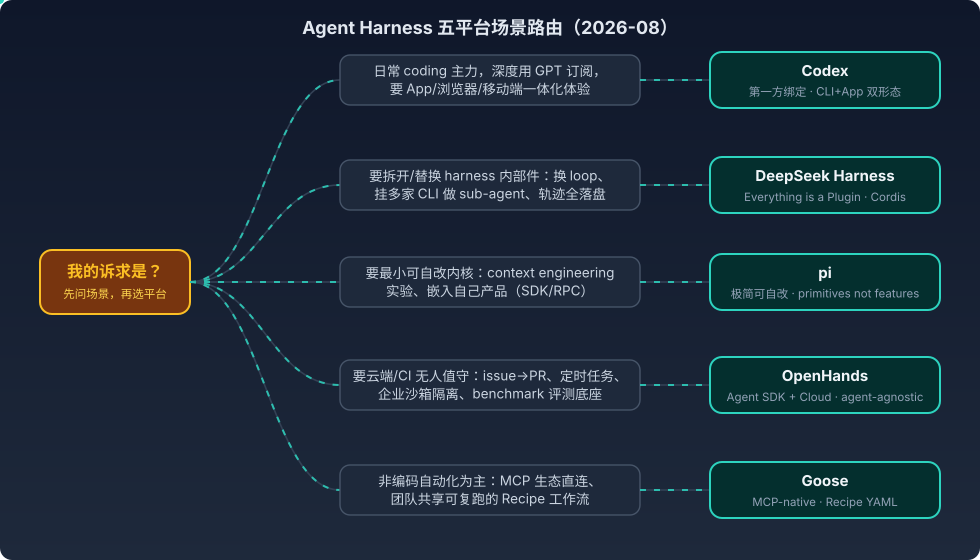

# Agent Harness 五平台对比——DeepSeek Harness、pi、Codex、OpenHands 与 Goose 的架构哲学与场景选择

> 2026 年 8 月的 agent harness 市场已经明显分化：不是"谁更强"，而是五种**架构哲学**各自锚定了不同的场景。本文把 DeepSeek Harness（dsh）、pi、Codex、OpenHands、Goose 放在同一张桌面上，先讲每家的架构立场，再给出"先问场景、再选平台"的路由表。分析框架沿用 [[Agent=Model+Harness——从VS Code Copilot博客看第一方绑定与多模型适配的路线之争]] 的核心命题：**模型是引擎，harness 是整辆车**——五个平台本质上是造车的五种方式。

---

## 一、五种架构哲学：一句话立场

| 平台 | 一句话立场 | 出品方 / 许可 | 核心形态 |
|------|-----------|--------------|---------|
| **Codex** | 第一方绑定：模型与 harness 训练时缝合，垂直一体化 | OpenAI（CLI 开源 Rust，App 闭源） | CLI + Desktop App（ChatGPT Work）+ Cloud + 移动端 |
| **DeepSeek Harness（dsh）** | Everything is a Plugin：harness 本身可分解，loop 也是插件 | DeepSeek AI，MIT，developer preview | Web UI / CLI，基于 Cordis 内核 |
| **pi** | 极简可自改：primitives not features，harness 是你的 | Mario Zechner（Earendil），MIT | Terminal TUI，四运行时模式 |
| **OpenHands** | SDK + 云平台：agent 逻辑与执行沙箱分离，agent-agnostic | OpenHands（原 OpenDevin 社区），MIT + 商业云 | SDK / CLI / GUI / Cloud / Desktop |
| **Goose** | MCP-native：extension 即 MCP server，工作流即 Recipe | Block（Square），Apache 2.0 | Desktop + CLI |

五家在 [[model-harness-codesign]]（第一方绑定 vs 多模型适配）光谱上的位置很清晰：Codex 在最左端（绑定最深），dsh / pi / OpenHands / Goose 都在多模型一侧，但**多模型内部又按"可分解程度"再次分层**——这是本文想补充的第二个维度。

## 二、逐家解剖

### 2.1 Codex：第一方绑定的参照系

Codex 是五家中唯一的第一方绑定平台，也是对比的基准线：

- **形态**：Rust 单体 CLI（开源，91K+ stars）+ ChatGPT Work/Codex 桌面 App + Cloud 沙箱执行 + Chrome Extension 浏览器接管 + 移动端。2026 上半年补齐了持久 Goals（token 预算）、thread 级 sub-agent 委派、plugin marketplace、实验性 Hooks（与 Claude Code 同构的 5 生命周期事件）、Claude Code 配置一键导入。
- **架构特征**：模型（GPT-5.5/5.6 系列）与 harness 协同调优，OS 级沙箱是强项。但 CLI 与 App 两个入口 **runtime 不对等**——Computer Use / `@Browser` runtime 只在 App 侧原生存在，Skill 跨端可见但不可执行（"Skill 是说明书，Runtime 才是手脚"），细节见 [[Computer Use与Browser Use系列六：Codex CLI与App的能力分界——同一套Skill、两条调用链与第三方生态补位]]。
- **没有的东西**：Skill 格式官方不支持（截至 2026-08 的横评口径）；harness 内部件不可替换——你不能换掉它的 loop 或 session 存储。

### 2.2 DeepSeek Harness：把"不可替换"翻转成卖点

dsh 是 2026 年最激进的架构声明：**大多数 coding agent 是焊死的整车，dsh 把每个部件都做成可插拔**。

- **Cordis 内核 + capability seams**：内核只管插件的挂载/卸载/依赖，所有能力（模型、工具、skills、sessions、沙箱、存储、loop、调度、UI）都是插件。每个能力是一个 seam（`ctx.subagents`、`ctx.compaction`、`ctx.sandbox`……），扩展只依赖 Service Definition、不依赖具体 provider。
- **sub-agent seam 有五个 provider**：in-process spawn、fork、ACP、**Codex、Claude Code**——把整个外部 harness 挂为 sub-agent 是配置项而非改代码。这使 dsh 的定位更像"编排层/胶水"而非 Claude Code 竞品。
- **Every run is traceable**：session log 是模型可见事实的唯一来源（single source of truth），自带 trajectory 视图（类 Langfuse 的 tool call 审计）。
- **四种预设模式**：Standard（全功能）/ Code（工具经 Code Mode SDK 暴露，模型写 TypeScript 程序组合多步操作）/ Minimal（只有 persistent bash + str_replace_editor 两个工具）/ Creator（做自定义 preset）。
- **成熟度**：developer preview，明示会有 breaking changes；生态爆发极快（203K stars、awesome 列表、dsh-movein 一键迁移 Claude Code/Codex/OpenCode 配置、sandbase-skills 88 个 skill 包）。

### 2.3 pi：反方向的极简主义

pi 与 dsh 是同一命题的两个极端答案。dsh 说"一切皆插件"，pi 说"**一切皆不内置**"：

- **刻意不做**：MCP、sub-agents、plan mode、权限弹窗、内置 todos、background bash——这些都留给 extension/package 生态或让 pi 自己给你写（自改后 `/reload` 即生效，self-modifying 是一等公民）。
- **最小 system prompt**：默认系统提示几乎为空，只注入 AGENTS.md，可整体替换（SYSTEM.md）——这是做 context engineering 实验最干净的底座。对照 Claude Code / Codex 的长 system prompt，pi 用 read/write/edit/bash 四个工具 + 极简提示就拿下 terminal-bench 第 8（Opus 4.5）。
- **四运行时模式**：interactive TUI / print+JSON / RPC / SDK——SDK 模式的旗舰案例就是 OpenClaw（整个 gateway 产品嵌 pi 为内核）。
- **无内置权限系统**：默认以启动用户的权限裸跑，边界靠容器化自备（Gondolin micro-VM / Docker / OpenShell 三模式）。
- **包生态**：`@earendil-works/pi-coding-agent`（曾用名 `@mariozechner/pi-coding-agent`），`pi install` 支持 npm/git 装 extension+skill+prompt+theme 包。

### 2.4 OpenHands：从单体 agent 到 SDK + 云平台

OpenHands（原 OpenDevin）在 2025 底以 Software Agent SDK 完成 V1 重构，定位从"开源 Devin"变成**生产级 agent 基础设施**：

- **架构分离**：agent 逻辑（CodeAct agent，本地、低延迟）与工具执行（远程沙箱，隔离、可扩容）解耦；接口层（CLI/GUI/REST API）独立可替换。SDK 九组件含 event-sourced 状态管理、Secret Registry、安全分析器。
- **agent-agnostic 是 2026 的新故事**：经 ACP 可以把 **Claude Code、Codex、Gemini CLI** 接为后端 agent，用 OpenHands 的编排、持久化、自动化外壳包住别家 harness——订阅额度在 session 启动时注入，云端跑完为止。这与 dsh 的 sub-agent seam 形成有趣对照：dsh 在 loop 内挂别家做 sub-agent，OpenHands 在 loop 外包住别家做执行体。
- **自动化触发**：GitHub issue 标签、Slack @提及、Linear ticket、定时任务→自动开 session，机器可以关机（Cloud 托管）。
- **评测底座身份**：SWE-Bench / GAIA 的 reference platform，研究团队换自己的 agent、复用它的沙箱与评测 harness。

### 2.5 Goose：MCP 原教旨与 Recipe 工作流

Goose 的立场是**协议优先**：不发明私有扩展机制，直接把 MCP 当扩展系统：

- **extension 即 MCP server**：任何给 Claude Desktop 写的 MCP server 原生可用，官方目录 70+；MCP Apps 让 extension 在 Desktop 里渲染交互 UI（按钮、表单、可视化）。
- **Recipe（YAML 工作流）是独有资产**：instructions + 所需 extensions + 结构化参数 + sub-recipes 打包成一个可分享文件，团队共享、CI 可跑——相当于"存成宏的 agent 行为"，五家中没有直接等价物（最接近的是 dsh 的 preset，但 Recipe 更面向非开发者分发）。
- **双协议**：MCP 管工具，ACP 管 agent 间通信——Goose 既可作为 ACP server 被 Zed/JetBrains/VS Code 连接，也能把 Claude Code / Codex 当 provider 用。
- **定位偏移**：15+ provider、桌面优先，Block 内部大量用于**非编码自动化**（数据、运营、基础设施），coding 能力在第一梯队之下但"够用"。

## 三、场景选择路由表

核心判据不是功能清单，而是**你要对 harness 拥有多大的控制权、控制发生在哪一层**：

| 场景 | 首选 | 备选 / 说明 |
|------|------|------------|
| 日常 coding 主力，用 GPT 订阅，要 App/浏览器/移动一体化 | **Codex** | 第一方绑定的体验红利；接受 harness 不可拆的代价 |
| 编排多家 agent（fan-out 横评、pick the winner） | **dsh** | sub-agent seam 五 provider；OpenHands ACP 是"loop 外包住"的备选 |
| 轨迹采集 / 可审计执行（喂 RL、合规审计） | **dsh** | session log 单一事实源 + trajectory 视图；关联 agent-lightning 主线 |
| context engineering 实验、极简基线、嵌入自己产品 | **pi** | 空 system prompt + SDK/RPC 模式；OpenClaw 是嵌入范例 |
| 云端无人值守：issue→PR、定时任务、Slack 触发 | **OpenHands** | Cloud + 自动化触发器；企业沙箱隔离与合规是长板 |
| agent 研究 / benchmark 评测 | **OpenHands** | SWE-Bench/GAIA reference platform，换 agent 复用沙箱 |
| 非编码自动化、团队分发可复跑工作流 | **Goose** | Recipe 面向非开发者；MCP 生态直接继承 |
| 已有大量 MCP server 资产想直接复用 | **Goose** | extension 即 MCP server，零适配 |

两条反向提醒：

1. **dsh 的 preview 身份**：breaking changes 明示存在，生产 loop 不要迁（对应日记 DSH 深挖场景 4 的既有判断）；它适合当**实验编排层**，不适合当此刻的日常主力。
2. **pi 的裸跑权限**：没有权限系统不是疏忽而是立场，但意味着它进入团队/企业环境前必须先解决容器化——这恰是 Codex（OS 沙箱）和 OpenHands（远程沙箱）替你做掉的事。

## 四、放回既有框架：两个维度的十字定位

用 [[model-harness-codesign]]（绑定维度）× 可分解程度（控制权维度）交叉，五家各占一格：

- **绑定深 + 不可拆**：Codex——体验最完整，控制权最少；
- **不绑定 + 完全可拆**：dsh——loop 都能换，代价是 preview 的不稳定；
- **不绑定 + 极简内核可自改**：pi——可拆的方式不是插件配置而是"让 agent 改自己的源码"；
- **不绑定 + SDK 分层可拆**：OpenHands——拆的粒度是架构层（agent/沙箱/接口）而非能力件；
- **不绑定 + 协议标准化**：Goose——不自己定义扩展点，把拆解外包给 MCP 标准。

与 [[harness-portability-spectrum]]（离模型越近越可移植）合看还有一个推论：**skill/MCP 资产在五家间基本可流动**（dsh-movein、Codex 的 Claude 配置导入、Goose 的 MCP 直连都是证据——2026 年"搬家工具"本身成了产品类目，说明切换成本真实存在但正在被工程化消解），而 hook/plugin/subagent 配置仍然锁死在各自 harness。资产沉淀策略不变：**优先投资可移植层**。

## 参考

- [DeepSeek Harness: Everything is a Plugin](https://github.com/deepseek-ai/deepseek-harness)（GitHub，MIT，developer preview）
- [DeepSeek Harness developer preview: Everything is a plugin](https://deepseek.com/harness/en)（官方产品页，四模式与设计立场）
- [DeepSeek Harness: When the Agent Loop Itself Becomes a Plugin](https://medium.com/@kaliarch/deepseek-harness-when-the-agent-loop-itself-becomes-a-plugin-7fad0aa9de1c)（capability seams 表与依赖方向分析）
- [Pi Agent Harness](https://github.com/badlogic/pi-mono)（GitHub，MIT）与 [pi.dev](https://pi.dev)（primitives not features 立场、四运行时模式、容器化三模式）
- [What I learned building an opinionated and minimal coding agent](https://mariozechner.at/posts/2025-11-30-pi-coding-agent/)（Mario Zechner，极简 system prompt 与 agent loop 设计）
- [The OpenHands Software Agent SDK: A Composable and Extensible Foundation for Production Agents](https://arxiv.org/html/2511.03690v1)（arXiv 2511.03690，V0→V1 架构重构与九组件）
- [Controlling any Coding Agent with the OpenHands Agent Canvas and SDK](https://www.openhands.dev/blog/use-any-coding-agent-in-openhands-with-acp)（ACP 挂接 Claude Code/Codex 与云端订阅注入）
- [goose | Your open source AI agent](https://goose-docs.ai)（MCP/ACP 双协议、Recipe、MCP Apps）
- [State of CLI Coding Agents, Mid-2026](https://blog.arcbjorn.com/state-of-cli-coding-agents-2026)（Codex 2026 上半年功能演进与横评矩阵）
