# Computer Use与Browser Use系列一：概念与产品形态——从包含关系到四种浏览器形态与认证三链路

> 本系列基于与 Codex/ChatGPT（GPT-5.6）的深入实测与追问整理而成。系列一讲清概念与产品形态；[系列二](Computer%20Use与Browser%20Use系列二：Codex浏览器运行时解剖——从bundled%20plugin看Agent浏览器控制的工程设计.md)解剖 Codex 的浏览器运行时；[系列三](Computer%20Use与Browser%20Use系列三：自己实现——action%20loop协议、双执行器路线与跨平台adapter矩阵.md)讲如何自己实现；[系列四](Computer%20Use与Browser%20Use系列四：产品化——可审计智能RPA、Extension-Plugin-WebMCP三层选型与安全设计.md)讲产品化路径。

## 引言：一个常见的误解

大多数人（包括我最初）对 Computer Use 和 Browser Use 的直觉理解是：**两种并列的能力**——一个操作电脑，一个操作浏览器。实测中我用 Codex 完成了一次浏览器任务（读取已登录网站的结构化页面信息），Codex 自己也先给出了"这次用的是 Browser Use，不是 Computer Use"的回答。

但产品界面的截图显示，这次任务被归类在 **Computer Use** 之下。追问之后，正确的关系浮出水面：

```
Computer Use（产品里的总类目：控制 GUI 的能力）
└─ Chrome integration（通过扩展连接用户已有的 Chrome）
   └─ Browser Use（读取网页结构、导航、提取内容的操作方式）
```

**Browser Use 没有消失，但它不是与 Computer Use 并列的顶层功能，而是 Computer Use 之下更适合网页的一种操作方式。** 这个认知纠偏是理解整个体系的起点。

## 一、两种操作方式的本质区别

虽然归属上是包含关系，但两种操作方式的技术路径确实不同：

| | Browser Use（结构化操作） | Computer Use（视觉操作） |
|---|---|---|
| 工作方式 | 读取网页的结构化内容（DOM、无障碍树、标题、按钮、链接、表格） | 像人一样看屏幕截图、移动鼠标、按键点击 |
| 擅长场景 | 查信息、填网页、筛选列表、读取页面数据 | 桌面软件、Canvas 类界面、没有可读结构的界面 |
| 稳定性与效率 | 更快、更准确 | 更通用，但受窗口位置、布局变化影响 |
| 可操作范围 | 浏览器标签页 | 整个电脑界面（浏览器 + 原生应用） |

一句话概括：**Browser Use 是"理解网页后操作网页"，Computer Use 是"像人一样操作屏幕"。** 当两者都可用时，网页任务优先走结构化路径；遇到桌面应用或网页无法提供结构化内容时，才回退到视觉路径。

实测中读取网站页面信息时，Agent 通过 DOM snapshot 拿到的是带语义的结构树（`link`、`heading`、`button` 及其文本），而不是靠截图猜按钮位置——这正是结构化路径又快又稳的原因。

## 二、四种浏览器形态

在 Codex/ChatGPT 桌面应用的实际使用中，会遇到四种不同的浏览器呈现形态。它们不是四个独立产品，而是**两种浏览器载体 × 两种交互入口**的组合：



### 形态 1：内置浏览器（Built-in Browser，侧边面板）

Codex 桌面应用自带的浏览器，作为侧边面板与聊天并排显示。关键特征：

- **独立浏览器 Profile**——不共享你日常 Chrome 的标签页和登录会话
- 用 `@Browser` 明确指定
- Computer Use 可以直接在其中点击、输入、检查渲染状态、截图
- 任务结束后页面可作为交付物留在 Codex 中

适合：公开网页浏览、资料查询、本地 Web 开发调试、需要展示/保留网页结果的场景。

### 形态 2：外部 Chrome 接管（画中画预览）

通过 Chrome 集成扩展连接你**日常使用的真实 Chrome**。关键特征：

- 直接使用你现有 Chrome Profile 的登录态（已登录的 GitHub、企业系统等）
- 实际页面仍在外部 Chrome，Codex 只显示一个浮动的画中画（Picture in Picture）预览
- 用 `@Chrome` 明确指定
- 控制结束后仍是你原来的 Chrome 页面

适合：需要既有登录状态、已有标签页、浏览器扩展或本机浏览器环境的任务。

一个容易误判的点：**画中画不代表启动了"浏览器模拟器"或 headless 浏览器**。证据链是——它能访问你已有的登录态、画中画显示的是真实页面、任务记录显示 "Used Chrome integration"。headless 浏览器是独立、不可见、没有你现有登录会话的自动化浏览器，与此完全不同。

### 形态 3：Side chat（Chrome 里的扩展侧栏）

在宿主 Chrome 里点击 ChatGPT 扩展图标（macOS 快捷键 `Cmd + Shift + .`），在当前网页旁打开聊天侧栏。关键特征：

- 浏览器仍是你的 Chrome，侧栏绑定在打开它的那个标签页
- 聊天可直接获得该页面或选中文本作为上下文
- 聊天会同步回桌面应用，可在桌面应用中继续同一对话

官方扩展支持 Chrome、Edge、Brave、Opera、Vivaldi 五种浏览器（Firefox 不在列表中）；其中 Opera 不支持 side chat，只支持从桌面应用发起浏览器控制。`@Chrome` 专指 Chrome，操作 Edge/Brave 需分别用 `@Edge`、`@Brave Browser` 等。

### 形态 4：Browser comments（内置浏览器的页面批注）

内置浏览器的 Annotation mode：点击某个元素或拖拽框选一块区域，把批注**锚定在渲染后的页面位置上**，再让 Codex 根据批注回代码里修改。这是 vibe coding 场景下修 UI bug 的利器——比"截图 + 文字描述位置"高效得多。批注写法上要给足约束：

```text
移动端 390px 宽度下，这个按钮文字溢出。
优先保持单行；无法保持时才换行。
不要改变卡片高度，也不要修改桌面端布局。
```

### Side chat 与 Browser comments 的区别

两者都是"指着网页说话"，但定位精度和载体不同：

| | Side chat | Browser comments |
|---|---|---|
| 所在浏览器 | 你的宿主 Chrome 等 | Codex 内置 Browser |
| 交互方式 | 在网页旁边聊天 | 点选元素/框选区域后留言 |
| 上下文粒度 | 当前标签页、选中文本、整页 | 精确到元素或视觉区域 |
| 登录态 | 使用 Chrome 已有登录态 | 默认不共享 Chrome 登录态 |
| 典型场景 | 已登录 SaaS、内部系统的问答与任务 | 本地网页开发、UI bug 视觉反馈 |

值得注意的直觉修正：从产品实现角度，内置浏览器做精确批注反而**更容易**（应用自己拥有浏览器面板和页面生命周期）；side chat 要处理扩展、多浏览器 Profile、标签页关联、与桌面应用的通信，工程复杂度不一定更低。

## 三、形态选择的决策逻辑

这个决策大多数情况由 Codex/ChatGPT 自动做出，但遵循明确的优先级：

1. **用户明确指定时，以用户为准**——"用我当前 Chrome"、"在旁边打开网页"、"不要碰我现有浏览器"
2. **任务需要已有登录态或现有标签页**→ 接入外部 Chrome（画中画）
3. **公开浏览、资料查询、需要展示网页结果**→ 内置浏览器（侧边面板）
4. **浏览器无法完成、需要桌面应用**→ 更通用的 Computer Use

官方文档明确写到：任务会根据需要在"专用插件、你的常用浏览器、内置浏览器"之间切换。一个重要细节是——官方定义的是这两类浏览器的**会话边界**（独立 Profile vs 你的 Profile），但"画中画还是侧边栏"属于桌面应用的 UI 呈现，不是稳定 API 承诺。可靠的控制方式是用 `@Browser` / `@Chrome` 显式指定。

## 四、内置浏览器到底是什么？

追问"内置浏览器是不是 Playwright + Chrome 内核"时，得到了一个值得记录的澄清：

- **Playwright 不是浏览器内核**，它是自动化库，可以控制 Chromium、Firefox、WebKit
- 内置浏览器是桌面应用内嵌、可见、带独立 Profile 的浏览器，不是典型的 Playwright headless 进程
- 官方公开承诺的是：独立 Profile + 可选的受控 CDP（Chrome DevTools Protocol）访问（Developer mode）
- 官方**没有承诺**底层内核是哪个浏览器，也没有承诺内部使用 Playwright

Agent 工具面上出现 `tab.playwright`、`page.mouse.click()` 这类接口名，只能说明**控制层兼容或借鉴了 Playwright 的抽象**，不能反推底层实现。同理，`@Browser` 和 `@Chrome` 都能开 Developer mode 拿到受控 CDP，但这不等于"内置浏览器就是 Chrome 或完全兼容 Chrome 协议"。工程上应把它当作：

> 一个与常用 Chrome 分离、具有独立 Profile、支持受控 CDP 的内置浏览器。

若你必须依赖真实 Chrome 的 Profile、扩展或精确行为，用 `@Chrome`，不要假定 `@Browser` 等同于 Chrome。

内置浏览器与 Codex 的交互模式也值得说清：**默认是以 Computer Use 为主的混合交互**——官方原文是可以 "inspect rendered state, take screenshots"，能点击、输入、验证页面结果；它可能同时使用页面文本和语义辅助理解，但正常模式下**不承诺**把完整 DOM 暴露给模型。需要程序化 DOM/网络/控制台能力时，显式开启 Developer mode（需要用户批准，因为 CDP 权限敏感）。

## 五、认证三链路——与 Azure OpenAI 的实测

这是本篇最有实战价值的部分。使用浏览器控制时，涉及**三条彼此独立的认证链路**，混淆它们会导致错误的安全假设：

```
① ChatGPT/Codex 身份
   登录桌面应用的账号（个人账号，或企业工作区的 SSO）

② 当前网站身份
   Chrome Profile 里已有的网站 Cookie / 网页 SSO 会话
   （已登录的 GitHub、Salesforce、内部系统）

③ 模型服务身份
   桌面应用调用模型的 provider 配置
   （OpenAI 官方，或 Azure OpenAI 的 endpoint / 部署 / 凭据）
```

### 实测发现：side chat 复用桌面应用的 Azure OpenAI provider

我的桌面应用配置的是 Azure OpenAI provider。实测 Chrome side chat 时，右下角显示的模型正是 Azure 部署的 `5.6 Sol`——**side chat 的模型调用走的是我的 Azure OpenAI 配置，而不是 ChatGPT 官方账号的推理服务**。

这个实测结果修正了 Codex 自己最初的回答（它一开始认为扩展不会使用 Azure provider）。正确的分层是：

```
Chrome Side chat 扩展
  └─ 连接/配对本机 ChatGPT/Codex 桌面应用
       └─ 继承当前聊天的模型与 provider
            └─ Azure OpenAI（你的 endpoint / 部署 / 凭据）

Chrome 当前网页
  └─ 仍使用该 Chrome Profile 自己的网站登录态
```

关键结论：

- 扩展**没有**单独配置 Azure OpenAI 的入口——endpoint、deployment、认证都在桌面应用的 provider 配置里
- 扩展只是浏览器控制端与页面上下文入口，**不保存**模型凭据
- 扩展与桌面应用共享的是同一个**应用级任务上下文**（这也解释了为什么 side chat 和桌面应用的聊天能互相打开、继续同一任务），而不仅是 UI 同步
- 网站登录态（链路②）与模型认证（链路③）始终是两条独立的线

对企业用户的意义：如果公司用 Microsoft Entra ID 登录 ChatGPT 企业工作区，那是链路①的身份；它不是 Azure OpenAI 资源的 API 凭据，不会自动让扩展调用你的 Azure 部署——链路③需要在桌面应用单独配置。

## 六、Claude 侧的对照

同样的能力版图，Anthropic 侧的形态选择不同，正好呼应 [Agent = Model + Harness——从 VS Code Copilot 博客看第一方绑定与多模型适配的路线之争](../../../tool/Agent=Model+Harness——从VS%20Code%20Copilot博客看第一方绑定与多模型适配的路线之争.md) 的判断——**浏览器能力是 harness 的一部分，各家把它焊进 harness 的方式反映了产品路线**：

| 能力 | OpenAI（Codex/ChatGPT） | Anthropic（Claude） |
|---|---|---|
| 内置浏览器 | 桌面应用 Built-in Browser（独立 Profile + 可选 CDP） | Claude Code 无内置浏览器，靠 Playwright MCP / 自配工具补齐 |
| 接管用户浏览器 | 官方扩展（Chrome/Edge/Brave/Opera/Vivaldi）+ 画中画 | Claude in Chrome extension（研究预览起步，逐步放开） |
| 页面旁聊天 | Side chat（扩展侧栏，连回桌面应用） | Claude in Chrome 侧边栏形态 |
| API 层 Computer Use | Responses API `computer` 工具（action loop） | Anthropic API computer use tool（beta 起步，同为 action loop） |
| 模型 provider 灵活性 | 桌面应用可配 Azure OpenAI，扩展继承 | Claude Code 可走 Bedrock/Vertex，浏览器扩展绑定 Claude 账号 |

两家在 API 层的 action loop 协议高度同构（截图进、动作出）；差异集中在**产品层**——OpenAI 把内置浏览器和多浏览器扩展做成了桌面应用的一等公民，Anthropic 则以 Chrome 扩展为主、开发者场景靠 MCP 生态自组。对使用者的实际影响：在 Claude Code 里做网页自动化，今天要自己搭 Playwright MCP 这类"外挂浏览器手臂"；在 Codex 桌面应用里，浏览器是开箱即用的内置能力。

## 七、小结

1. **包含关系**：Browser Use 是 Computer Use 之下更适合网页的操作方式，不是并列功能
2. **两种路径**：结构化（DOM/语义，快而稳）vs 视觉（截图/坐标，通用兜底）；网页任务优先结构化
3. **四种形态**：内置浏览器（侧边面板）、外部 Chrome 接管（画中画）、side chat（扩展侧栏）、browser comments（页面批注）——本质是"独立 Profile vs 你的 Profile"两种会话边界
4. **三条认证链路**：ChatGPT 身份、网站登录态、模型 provider 各自独立；实测确认 side chat 复用桌面应用的 Azure OpenAI 配置
5. **形态是 UI，边界是契约**：画中画/侧边栏是呈现细节，`@Browser`/`@Chrome` 的 Profile 边界才是稳定语义

系列二将深入 Codex bundled browser plugin 的内部：browser binding、tab 生命周期、三套操作 API 的分层哲学，以及那份网上几乎找不到二手资料的安全确认策略四级分类。

## 参考

- [Browser（内置浏览器）官方文档](https://learn.chatgpt.com/docs/browser)
- [Browser extension 官方文档](https://learn.chatgpt.com/docs/chrome-extension)
- [Computer Use 官方文档](https://learn.chatgpt.com/docs/computer-use)
- [Computer use API 指南](https://developers.openai.com/api/docs/guides/tools-computer-use)
