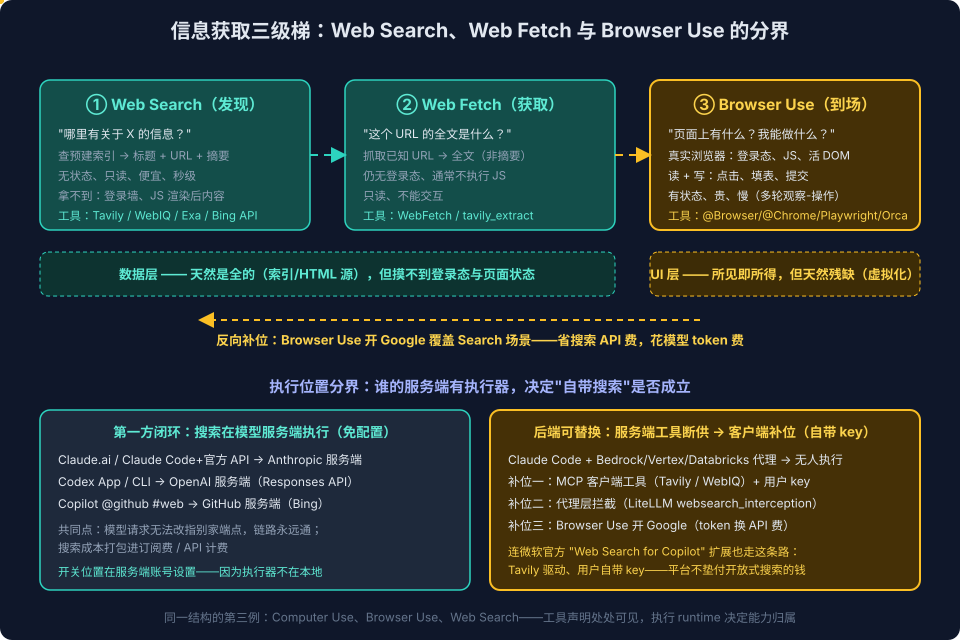

# Computer Use与Browser Use系列七：Web Search与浏览器操作的分界——信息获取三级梯、执行位置与成本转移

> 系列导航：[系列一：概念与产品形态](Computer%20Use与Browser%20Use系列一：概念与产品形态——从包含关系到四种浏览器形态与认证三链路.md) ｜ [系列二：Codex 浏览器运行时解剖](Computer%20Use与Browser%20Use系列二：Codex浏览器运行时解剖——从bundled%20plugin看Agent浏览器控制的工程设计.md) ｜ [系列三：自己实现](Computer%20Use与Browser%20Use系列三：自己实现——action%20loop协议、双执行器路线与跨平台adapter矩阵.md) ｜ [系列四：产品化](Computer%20Use与Browser%20Use系列四：产品化——可审计智能RPA、Extension-Plugin-WebMCP三层选型与安全设计.md) ｜ [系列五：最佳实践](Computer%20Use与Browser%20Use系列五：最佳实践与日常使用习惯——场景路由表、内容获取链路与实战经验.md) ｜ [系列六：CLI 与 App 的能力分界](Computer%20Use与Browser%20Use系列六：Codex%20CLI与App的能力分界——同一套Skill、两条调用链与第三方生态补位.md) ｜ 本篇

## 引言：一个朴素的疑问

前六篇的主线是 GUI 操作能力——Computer Use 操作桌面、Browser Use 操作浏览器。本篇处理一个看似不相关、实则同构的问题，起点是一个日常使用中的朴素疑问：

> 为什么 Codex App、Claude.ai、GitHub Copilot 这些产品都能"自行搜索"，而我的 Claude Code 却要绑定 Tavily 或 WebIQ 才能做 web search？

追这个问题的过程中发现了两件事：其一，**web search 和 browser use 根本不在同一棵能力树上**——前者作用于互联网的数据层，后者作用于 UI 层，很多场景下的工具选择困惑来自把它们当成了同一能力的强弱版本；其二，"谁能自带搜索"的答案与系列六"CLI 为什么没有原生 Computer Use"是**同一个结构**——工具声明处处可见，执行 runtime 决定能力归属。这是这个论点的第三个实例。

## 一、本质区别：调 API vs 开浏览器

**Web search 是一次无状态的 API 调用。** 发一个查询字符串，搜索后端（Bing、Tavily、Exa……）在**预先爬好并建好索引**的数据里检索，返回结构化结果：标题、URL、摘要片段。整个过程没有浏览器、没有页面渲染、没有 JS 执行、没有登录态。它回答的问题是——**"互联网上哪里有关于 X 的信息？"**

**Browser use 是驱动一个真实浏览器实例。** 起一个浏览器（或接管已有的 Chrome），加载页面、执行 JS、渲染 DOM，然后观察（截图 / DOM snapshot / Accessibility Tree）并操作（点击、输入、滚动、提交）。它回答的问题是——**"这个具体页面上有什么？我能在上面做什么？"**

一个类比：web search 像打电话问图书馆管理员"有哪些关于 X 的书"，拿到的是书目卡片；browser use 像亲自走进图书馆，翻开那本书读，还能在借书单上签字。

五个维度的系统对照：

| 维度 | Web Search | Browser Use |
|---|---|---|
| 作用层 | 数据层（搜索索引） | UI 层（渲染后的活页面） |
| 状态 | 无状态，一问一答 | 有状态：会话、cookie、登录态、tab 生命周期 |
| 能力方向 | 只读，且读的是摘要/片段 | 读全文 + **写操作**（填表、提交、下单） |
| 内容新鲜度 | 受限于爬虫索引周期，抓不到登录墙/JS 渲染后内容 | 所见即所得——页面此刻长什么样就拿到什么 |
| 成本/延迟 | 便宜、快（一次 HTTP 调用） | 贵、慢（浏览器进程 + 多轮观察-操作循环 + 截图 token） |

## 二、信息获取三级梯



Search 和 browser use 之间还有一个常被混淆的第三者——**web fetch**（Claude Code 的 `WebFetch`、Tavily 的 `extract`）：给定已知 URL，抓取该页内容。它比 search 深一层（拿全文而非摘要），但比 browser use 浅一层（无登录态、通常不执行 JS、不能交互）。三者构成一个梯子：

```text
① Web Search   →  发现：哪里有信息（返回 URL + 摘要）
② Web Fetch    →  获取：这个 URL 的内容（公开、静态可达的部分）
③ Browser Use  →  到场：登录态、JS 渲染、交互操作、页面状态
```

遇到任务时的四问决策链：

1. **我知道信息在哪吗？** 不知道 → **web search**（发现阶段永远是它）
2. **知道 URL 了，页面公开且静态可达吗？** 是 → **web fetch**（最便宜的全文获取）
3. **需要登录态 / JS 渲染 / 页面此刻的状态吗？** 是 → **browser use**
4. **需要在页面上"做事"（点击、填表、提交）吗？** 是 → 只有 **browser use** 能做，前两级都是只读的

对应到本 vault 的日常配置：Tavily（search + extract 覆盖第 1、2 问）→ Playwright / Orca 内嵌 Browser / Codex `@Chrome`（覆盖第 3、4 问）。vault 的 URL 路由硬规则（认证站点直接上 Playwright、禁止先试 WebFetch）本质上就是"第 3 问答案已知为是时，跳过第 2 级"的路由捷径。

一个容易踩的认知坑值得单独点出：**browser use 并不总是"更强的 web search"**。它拿到的是 UI 层的活 DOM——这正是系列五 DOM 虚拟化教训的根源：UI 层天然是残缺的（只渲染视口附近），而 search / fetch 走的数据层反而天然是全的。所以"用更强的工具"不等于"拿到更全的内容"，**层选对了才是对的**。

## 三、"自带搜索"的真相：执行位置决定一切

### 3.1 Web search 是服务端工具，harness 只发声明

Claude Code 的 `WebSearch` 工具本身**不含任何搜索引擎**。它做的事只是在 API 请求里声明一个服务端工具类型（`web_search`），真正的搜索——查询、索引、排序——全部发生在 **Anthropic 的 API 服务端**。请求到达官方 API 时，服务端看到工具声明就执行搜索并把结果塞回响应；harness 只是转发声明的 wrapper。Codex CLI 的搜索同理（OpenAI Responses API 的 `web_search` 工具），Copilot 的 `@github #web` 同理（GitHub 服务端调 Bing）。

这和系列六的核心命题是同构的：**工具声明（Skill / tool schema）可以到处存在，但执行 runtime 决定它是否真的能用。** `WebSearch` 的"手脚"长在模型厂商服务端，不长在本地。

### 3.2 换掉模型后端，搜索执行器就消失了

当 Claude Code 的请求不走官方 API、而走 Bedrock / Vertex / Databricks 这类代理端点时，代理只做模型推理转发——请求里的 `web_search` 声明**没有人执行**。官方可用性矩阵印证了这个形状：

| 提供方 | 服务端 web search |
|---|---|
| Anthropic 官方 API | ✅ 完整支持（含动态过滤版本） |
| Amazon Bedrock | ❌ 不支持 |
| Google Vertex AI | 仅基础版（且 Claude Code 曾有集成 bug：Vertex 加了工具但 Claude Code 看不到） |
| Microsoft Foundry | Beta |
| 各类代理（Databricks、LiteLLM、OpenRouter） | ❌ 除非代理自己实现拦截 |

所以差异不在"App vs CLI"，而在**请求最终落在谁的服务端**。第一方产品（Claude.ai、Codex、Copilot）的用户从来不会遇到这个问题——不是因为架构更好，而是它们**根本不允许把模型请求指到别家端点**，链路永远是通的。用 Claude Code 换 base URL 是行使了第一方产品用户没有的自由，代价就是服务端工具全家桶（搜索、code execution 等）随之断供。

### 3.3 Codex + Azure OpenAI：断供点上移到 harness 层

把 Codex CLI 的 `model_provider` 指向 Azure OpenAI（比如 gpt-5.6-sol 部署）时，内置 web search 同样失效——但断供的位置与 Claude Code 换 Bedrock/Databricks **不在同一层**，值得单独解剖：

- **端点层其实已经通了（阉割版）**：Azure OpenAI 的 Responses API 现在有服务端 `web_search` 工具（GA，不再只有 `web_search_preview`），但官方文档明确写着 "Live internet access isn't supported"——`external_web_access` 恒为 `false`，搜的是预建索引而非实时网页；按 tool call 单独计费，且可以在订阅级用 Azure CLI 整体禁用
- **harness 层拒发声明**：Codex 的内置搜索是 OpenAI Responses 的 hosted tool，而 Codex **只在请求发往默认 OpenAI provider 时才附加这个工具声明**。一旦 `model_provider` 是自定义的（Azure、网关、vLLM），Codex 干脆不往请求里塞 `web_search`（openai/codex#3851）——`--search` / `web_search = "live"` 配了也无物可执行，哪怕端点侧其实长着执行器
- **还有兼容性摩擦**：gpt-5.6-sol 等部署下，Codex 会往请求里发 Azure 不认的内部 header 与 `additional_tools` 命名空间，请求直接被拒（openai/codex#31875），需要本地代理剥离才能跑通

所以判断"有没有 web search"要在**两层分别问**：端点层——请求落点的服务端有没有搜索执行器；harness 层——客户端愿不愿意为这个 provider 发工具声明。Claude Code + Databricks 是"端点无执行器"，Codex + Azure 是"端点有（阉割版）执行器、harness 拒发声明"——断供点上移了一层，结果殊途同归。补位路线也与 Claude Code 完全一致：在 `~/.codex/config.toml` 里配 MCP 搜索工具（Tavily / WebIQ / Exa，客户端执行、自付账单），或 browser use 反向补位（见第四节）。一个 TOML 实操坑顺带记下：顶层 `web_search` 键必须写在所有 `[section]` 头之前，否则它会静默绑定到前面的 table（变成 `model_providers.xxx.web_search`）而完全不生效。

### 3.4 Copilot 的双面演示

GitHub Copilot 恰好在同一个产品里演示了两条路线：

- **`@github #web`**（第一方闭环）：GitHub 服务端执行、Bing 做后端。开关位置很说明问题——它不在 VS Code 本地设置里，而在 **GitHub 账号的服务端配置**里（Settings → Copilot → "Copilot access to Bing"），因为执行器在服务端，本地根本没有可开关的东西
- **"Web Search for Copilot" 官方扩展**（agent 工具层）：微软自己出品，却**由 Tavily 驱动、要求用户自带 API key**。连自家有 Bing 的微软，在给 Copilot agent 模式补搜索工具时，走的也是"客户端工具 + 用户自付账单"的路线——与在 Claude Code 里配 Tavily MCP 一模一样

这坐实了一个商业逻辑：搜索有真实成本，第一方订阅把它打包进价格；一旦进入"模型后端可替换 / 开放工具层"的世界，平台方没有理由垫付开放式搜索的钱，成本就回到用户头上。

### 3.5 补位的三条路线

与系列六 Computer Use 的补位空间完全同构，服务端搜索断供后有三条补位路线：

1. **客户端 MCP 工具**（Tavily、WebIQ、Exa）——搜索做成普通自定义工具，客户端执行、结果作为 tool result 回传。最通用，与后端提供方无关；代价是自己管 key 和账单
2. **代理层拦截**（LiteLLM `websearch_interception`）——代理检测到请求里的原生 `web_search` 声明时拦截下来自己执行（可路由到 Perplexity 等），再按 Anthropic 响应格式回填。相当于在代理层重建缺失的服务端执行器，原生 `WebSearch` 在 Bedrock/Azure/Vertex 后端也能"假装"通了。目前只覆盖 `web_search`，`web_fetch` 的同类拦截还是 open feature request。**注意这条路线的前提是声明被发出来**：它只救得了"断在端点层"的场景（harness 照发声明、落点没人执行，如 Claude Code + Bedrock）；对"断在 harness 层"的场景（Codex + 自定义 provider，见 3.3——声明根本不出门）无效，代理收到的请求里没有 `web_search`，无物可拦。断供点越靠上游，下游可补位的层就越少——客户端补位之所以最通用，正因为它在整条链路的最上游，不依赖任何下游环节配合
3. **Browser use 反向补位**——见下一节

值得注意的是执行位置的天然倾向：web search 本来就是远程 API，放服务端或客户端执行都可行，所以代理层能拦截补位；而 **browser use 没法在代理层补**——它最大的价值之一是复用真实浏览器的登录态，登录态在用户机器上，代理摸不到。

## 四、反向补位：用 Browser Use 开 Google，省掉搜索 API

三级梯上层的工具天然向下兼容下层的只读场景——browser use 可以直接打开 Google，把搜索引擎的结果页当成普通网页来读。Codex `@Browser` 给人"自带搜索"的体感很大程度就来自这个机制：不是调了搜索 API，而是浏览器访问了 SERP。系列五场景路由表里"公开资料检索 → 内置浏览器"这一行用的正是这条路。

**没有 API key、没有搜索账单——但钱没有消失，只是换了个计价科目。**

Browser use 走 Google 的每一步都在消耗模型 token：加载结果页 → snapshot 进上下文 → 模型判断 → 点击/翻页 → 再观察。算细账：

| | 搜索 API（Tavily 等） | Browser Use 开 Google |
|---|---|---|
| 直接费用 | API 计费（Tavily 免费档每月 1000 credits） | 零 |
| Token 消耗 | 极小——精炼的结构化结果 | 大——SERP 是广告、知识卡片、相关搜索堆出来的重型页面 |
| 延迟 | 一次 HTTP 调用，秒级 | 浏览器加载 + 多轮观察-操作循环 |
| 结果形态 | 结构化，直接可用 | 模型要从页面噪声里自己扒 |
| 风控风险 | 无（厂商与搜索引擎间是正规商业通道） | 有——频率高了撞 CAPTCHA / "unusual traffic" |

准确的说法是：**browser use 搜索省下的是搜索厂商的钱，花掉的是模型厂商的钱**。两个非成本的边界也要计入：

- **反爬风控**：extension 模式带真实浏览器指纹和登录态，比 Playwright 裸开好很多，但正如系列五所说——"不是风控豁免"。放弃标准公式（自动化价值 = 重复次数 × 单次节省 − 失败风险）里，browser use 搜 Google 的失败风险项随频率上升
- **结果质量一体两面**：SERP 能拿到 API 拿不到的东西（知识卡片、实时信息框、"用户还搜了"），但有广告噪声、个性化排序、可复现性差；搜索 API 返回数据层的干净结果，但覆盖面受制于该厂商自己的索引

### 实际路由建议

- **交互式、低频、探索性检索**（聊着天顺手查一下）→ browser use 开 Google 完全合理，尤其 Codex `@Browser` 里这就是默认姿势，省心
- **Agent 工作流里的程序化检索**（一次任务发七八个查询的调研类工作）→ 搜索 API 明显更优：快、便宜、结构化、无风控风险。这也是为什么 Tavily MCP 在 Claude Code 侧是正解，而不只是"没有原生 WebSearch 的无奈补丁"
- **需要搜索引擎 UI 层独有信息**（实时信息框、购物/地图垂类结果）→ 只有 browser use 能拿到

## 五、汇入主线：同一结构的第三例

把系列六和本篇放在一起，"执行位置决定能力归属"这个论点已经有了三个实例：

| 能力 | 声明（处处可见） | 执行 runtime（决定归属） | 断供时的补位 |
|---|---|---|---|
| Computer Use | bundled Skill 文件两端共享 | App 的 `node_repl + @oai/sky` | Orca / open-computer-use（客户端） |
| Browser Use（原生入口） | `@Browser`/`@Chrome` Skill 可见 | App 的 Browser runtime | Orca 内嵌 Browser / Playwright（客户端） |
| Web Search | `WebSearch` 工具声明 / `web_search` tool type | 模型厂商服务端执行器 | Tavily MCP（客户端）/ LiteLLM 拦截（代理层）/ browser use 开 Google（反向） |

三个实例的补位形态还有一条规律：**能力越贴近用户本地状态，补位就越只能发生在客户端**。Web search 无本地状态，三层（客户端/代理层/UI 层反向）都能补；browser use 依赖本地登录态，只能客户端补；computer use 依赖本地桌面和系统权限，同样只能客户端补，且要过 macOS 权限这一关。

这也给 Agent = Model + Harness 的路线之争补了一个观察角度：**第一方绑定的隐性福利之一就是服务端工具全家桶**（搜索、code execution、computer use runtime）——多模型适配路线省下的是绑定，付出的是每个服务端工具都要在客户端重新长一遍。Copilot 有趣在两边都占：`#web` 走第一方绑定，agent 工具层走客户端生态，在同一个产品里演示了两条路线的取舍。

Microsoft Scout 则演示了第三种形态——**自己不长执行器，整体挂靠别人的闭环**。Scout 是跑在 Windows 本地的个人 agent（能读本地文件、跑 PowerShell、写代码），但它不走 M365 Copilot 许可，而是连接 GitHub Copilot、消耗 Copilot Business/Enterprise credits，模型目录也直接继承自 GitHub Copilot。它的 web research（搜索、fetch、带引用综合）开箱即用，原因不是 Scout 本地长了搜索引擎，而是整条链路（Scout → GitHub Copilot 后端 → 模型 + 服务端工具）落在同一个第一方闭环里——相当于给 Copilot 的服务端全家桶套了一个本地 harness 外壳。这与 Codex + Azure 恰好是镜像：后者把请求指出闭环、工具随之断供；前者把整个 harness 挂进闭环、工具随之继承。**能力归属跟着请求落点走，不跟着产品形态走**——这条规律在两个方向上都成立。

## 小结

1. **不在同一棵树上**：web search 作用于数据层（索引），browser use 作用于 UI 层（活页面）——是两族能力，不是强弱版本；中间还有 web fetch，三者构成"发现 → 获取 → 到场"的三级梯
2. **四问路由**：不知道在哪 → search；知道 URL 且公开静态 → fetch；要登录态/JS/页面状态 → browser use；要做事 → 只有 browser use
3. **"自带搜索"= 第一方闭环的服务端工具**：Claude.ai / Codex / Copilot `#web` 能搜是因为模型和搜索执行器在同一个服务端；换成 Bedrock/Vertex/Databricks 代理后声明无人执行——与系列六"Skill 可见但 runtime 缺失"同构。且判断要**分两层**：端点层有没有执行器、harness 层肯不肯为该 provider 发声明——Codex + Azure 是"端点有（阉割版）、harness 拒发"的新形态；Scout 挂靠 GitHub Copilot 闭环则是反方向的例证
4. **反向补位有成本表**：browser use 开 Google 省的是搜索 API 费、花的是模型 token 费，且有风控风险——低频交互划算，程序化检索仍是搜索 API 更优。"能补"和"该用它补"之间隔着一张成本表
5. **层选对了才是对的**：UI 层天然残缺（虚拟化）、数据层天然完整——browser use 不是万能上位替代，DOM 虚拟化的教训在信息获取场景同样成立

## 参考

- 本系列：[系列五](Computer%20Use与Browser%20Use系列五：最佳实践与日常使用习惯——场景路由表、内容获取链路与实战经验.md)（场景路由表、DOM 虚拟化教训）、[系列六](Computer%20Use与Browser%20Use系列六：Codex%20CLI与App的能力分界——同一套Skill、两条调用链与第三方生态补位.md)（Skill ≠ 能力、补位生态）
- [Web search with the Responses API（Microsoft Foundry 官方文档，Azure `web_search` 限制说明）](https://learn.microsoft.com/en-us/azure/foundry/openai/how-to/web-search)
- [Codex built-in web search only attaches to default OpenAI provider（GitHub Issue #3851）](https://github.com/openai/codex/issues/3851)
- [Codex CLI with Azure OpenAI gpt-5.6-sol fails due to internal headers（GitHub Issue #31875）](https://github.com/openai/codex/issues/31875)
- [Microsoft Scout common questions（模型与处理链路挂靠 GitHub Copilot）](https://learn.microsoft.com/en-us/microsoft-scout/faq)
- [LiteLLM: Claude Code WebSearch Across All Providers](https://docs.litellm.ai/docs/tutorials/claude_code_websearch)
- [GCP Vertex WebSearch tool available but Claude Code can't see it（GitHub Issue #7806）](https://github.com/anthropics/claude-code/issues/7806)
- [LiteLLM Feature Request: Server-side WebFetch interception](https://github.com/BerriAI/litellm/issues/25711)
- [Web Search for Copilot（VS Code Marketplace，微软官方，Tavily 驱动）](https://marketplace.visualstudio.com/items?itemName=ms-vscode.vscode-websearchforcopilot)
- [Copilot can't access web even after changed setting（GitHub Community，#web 与 Bing 开关机制）](https://github.com/orgs/community/discussions/159884)
- [Exa、Tavily 与 Context7——AI Agent 搜索三剑客的定位与 MCP 配置实践](../Exa、Tavily与Context7——AI%20Agent搜索三剑客的定位与MCP配置实践.md)
