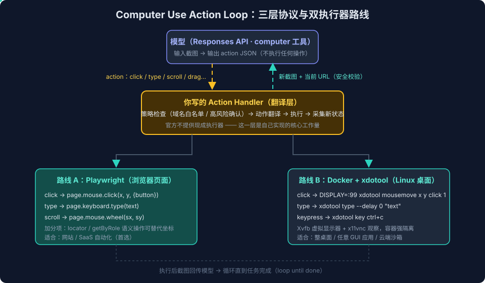

# Computer Use与Browser Use系列三：自己实现——action loop协议、双执行器路线与跨平台adapter矩阵

> 系列导航：[系列一：概念与产品形态](Computer%20Use与Browser%20Use系列一：概念与产品形态——从包含关系到四种浏览器形态与认证三链路.md) ｜ [系列二：Codex 浏览器运行时解剖](Computer%20Use与Browser%20Use系列二：Codex浏览器运行时解剖——从bundled%20plugin看Agent浏览器控制的工程设计.md) ｜ 本篇 ｜ [系列四：产品化](Computer%20Use与Browser%20Use系列四：产品化——可审计智能RPA、Extension-Plugin-WebMCP三层选型与安全设计.md) ｜ [系列五：最佳实践](Computer%20Use与Browser%20Use系列五：最佳实践与日常使用习惯——场景路由表、内容获取链路与实战经验.md) ｜ [系列六：CLI 与 App 的能力分界](Computer%20Use与Browser%20Use系列六：Codex%20CLI与App的能力分界——同一套Skill、两条调用链与第三方生态补位.md) ｜ [系列七：Web Search 与浏览器操作的分界](Computer%20Use与Browser%20Use系列七：Web%20Search与浏览器操作的分界——信息获取三级梯、执行位置与成本转移.md)

## 引言：最容易混淆的三层

读 OpenAI 的 [Computer use 官方指南](https://developers.openai.com/api/docs/guides/tools-computer-use) 时，示例代码里同时出现 `action.x`、`page.mouse.dblclick()`、`xdotool mousemove`——很容易以为它们是同一套东西的不同写法。实际上 **Docker、xdotool、Playwright、OpenAI 的 action 完全不在同一层级**：

```
模型返回 action JSON（协议层）
        ↓
你写的 action handler（翻译层 — 官方给示例，但要你自己实现）
        ↓
Playwright API 或 xdotool 命令（执行层）
        ↓
浏览器页面 / Linux 桌面环境（目标环境）
```

搞清这个分层，自己实现 Computer Use 就是三个明确的工程问题：协议怎么接、执行器选哪条路线、跨平台怎么办。



## 一、协议层：`computer` 工具的 action loop

`action` 来自 OpenAI Responses API 的 `computer` 工具返回值，形如：

```json
{ "type": "click", "x": 412, "y": 286, "button": "left" }
```

它只是模型提出的"下一步 UI 动作"，**不会自己执行**。官方定义的 action 类型集合：

`click` / `double_click` / `drag` / `move` / `scroll` / `keypress` / `type` / `wait` / `screenshot`

循环骨架是：

```
1. 截图当前环境 → 发给模型
2. 模型返回 action
3. 你的 handler 执行 action
4. 截取新状态 → 回传模型
5. 重复直到任务完成
```

所以"Docker 支持这些 action"是个误读——**支持 action 的是你写的 handler**，Docker 和 Playwright 只是 handler 背后的两种执行环境。官方指南中的 `handleComputerActions(...)` 正是这个映射层的示例。

官方同时明确支持三种实现思路：

1. **纯视觉方式**：模型看截图，返回坐标动作（上面的循环）
2. **自定义浏览器工具**：你提供"读取页面结构""点击某元素""填某字段"等高层工具，模型通过 tool call 操作
3. **混合方式**：日常优先 DOM/页面结构，遇到 Canvas、复杂组件或结构不可靠时回退到截图操作

官方把 2、3 称为 **custom harness**——你可以把 Playwright、Selenium、VNC、MCP 或自己的浏览器控制层接给模型。[系列二](Computer%20Use与Browser%20Use系列二：Codex浏览器运行时解剖——从bundled%20plugin看Agent浏览器控制的工程设计.md)解剖的 Codex 运行时（playwright 语义层 + dom_cua 节点层 + cua 坐标层）正是混合方式的完整参考实现。

## 二、执行层路线 A：Playwright（浏览器页面）

Playwright 是自动化库（**不是浏览器内核**），控制 Chromium、Firefox、WebKit：

```bash
npm i playwright && npx playwright install
```

```js
import { chromium } from "playwright";
const browser = await chromium.launch({ headless: false });
const page = await browser.newPage();
```

对象层级：

```
chromium
  └─ Browser
      └─ Page（一个浏览器标签页）
          ├─ mouse      （Mouse 对象：坐标级鼠标）
          ├─ keyboard   （Keyboard 对象：键盘）
          ├─ locator()  （语义级元素定位）
          └─ screenshot / goto / evaluate / …
```

action → Playwright 的映射表：

| Computer Use action | Playwright API |
|---|---|
| `click` | `page.mouse.click(x, y, { button })` |
| `double_click` | `page.mouse.dblclick(x, y)` |
| `move` | `page.mouse.move(x, y)` |
| `drag` | `mouse.move()` → `mouse.down()` → `mouse.move()` → `mouse.up()` |
| `scroll` | `page.mouse.wheel(scrollX, scrollY)` |
| `keypress` | `page.keyboard.press(key)` |
| `type` | `page.keyboard.type(text)` |
| `wait` | `page.waitForTimeout(ms)` |
| `screenshot` | `page.screenshot()` |

Playwright 的真正优势不在坐标映射，而在**语义层能力**——这也是长期维护 SaaS 自动化时该优先用的：

```js
await page.getByRole("button", { name: "提交" }).click();
await page.getByLabel("邮箱").fill("a@example.com");
await page.locator("#status").innerText();
```

`locator` / `getByRole` / `getByLabel` 基于 DOM 和无障碍语义，页面小改版不影响；`mouse.click(412, 286)` 则一次重排就失效。

## 三、执行层路线 B：Docker + xdotool（Linux 桌面）

Docker 本身**不提供任何鼠标键盘命令**，它只是隔离环境。官方示例的 Dockerfile 装了这些包：

```dockerfile
apt-get install -y xdotool xvfb x11vnc ...
```

各组件的分工：

- **`xdotool`**：Linux/X11 下的命令行 GUI 自动化工具，`mousemove`、`click`、`type`、`key`、`mousedown`、`mouseup` 都是它的子命令
- **`Xvfb`**：虚拟显示器（X virtual framebuffer），容器里没有真实屏幕，靠它渲染
- **`x11vnc`**：把虚拟屏幕通过 VNC 暴露出来供观察
- **`DISPLAY=:99`**：环境变量，告诉 xdotool 把事件发到编号 `:99` 的虚拟屏幕

于是这条命令的含义就完全清楚了：

```bash
DISPLAY=:99 xdotool mousemove 412 286 click 1
# 在虚拟显示器 :99 上，鼠标移到 (412, 286)，点击左键（X11 中按钮 1 = 左键）
```

action → xdotool 的映射表：

| Computer Use action | xdotool 子命令 |
|---|---|
| `click` | `mousemove x y click button` |
| `double_click` | `click --repeat 2 1` |
| `drag` | `mousemove` → `mousedown` → 多次 `mousemove` → `mouseup` |
| `scroll` | 滚动量转成 X11 滚轮按钮（4/5）点击 |
| `keypress` | `key Return`、`key ctrl+c` |
| `type` | `type --delay 0 "文本"` |

### 两条路线怎么选

| | Docker + xdotool | Playwright |
|---|---|---|
| 控制层级 | 整个 Linux 图形桌面 | 浏览器页面 |
| 操作方式 | X11 鼠标键盘事件 | 浏览器自动化 API |
| 可操作对象 | Firefox、桌面 App、任意 X11 GUI | Chromium/Firefox/WebKit 页面 |
| 语义能力 | 基本只有坐标和按键 | 坐标 + DOM + Locator + 网络/控制台 |
| 隔离性 | 强，适合云端沙箱 | 取决于浏览器启动方式 |
| 适合场景 | 多应用、远程桌面、旧 GUI | 网站/SaaS 自动化（**通常首选**） |

对网页任务，推荐的降级链是：

```
Playwright DOM/Locator 语义操作
    ↓ 失败或页面是 Canvas/复杂组件
截图 + Computer Use 坐标 action
    ↓ 再失败
交给用户接管或人工确认
```

## 四、跨平台：宿主机桌面的 adapter 矩阵

Docker+xdotool 只是 **Linux 的一种实现**，不是跨平台标准。要操作客户宿主机上的原生应用（音乐播放器、Office、任意桌面软件），需要一个**本机运行的桌面代理（native companion）**，按操作系统接不同的系统接口：

```
OpenAI 模型返回 action
  ↓
你的后端策略层：允许吗？需要确认吗？
  ↓
客户电脑上的本机代理
  ├─ Windows adapter
  ├─ macOS adapter
  └─ Linux adapter
  ↓
实际桌面 App
```

### 四平台能力矩阵

| 系统 | 打开应用 | 读取 UI 语义 | 鼠标/键盘输入 | 截图 |
|---|---|---|---|---|
| Windows | `ShellExecuteEx` / `CreateProcess` | **UI Automation (UIA)** | `SendInput` | Windows Graphics Capture |
| macOS | `NSWorkspace`（或 `open -a`） | **Accessibility API (`AXUIElement`)** | Quartz `CGEvent` | ScreenCaptureKit |
| Linux/X11 | `xdg-open` / 进程启动 | AT-SPI | `xdotool` / XTEST | X11/Xvfb |
| 浏览器 | 启动或连接 Chrome | DOM / Accessibility Tree | Playwright、CDP、扩展 | Playwright screenshot |

**Windows 要点**：UIA 读取"窗口名、按钮名、输入框、菜单"等语义（比截图坐标稳定），SendInput 发送系统级输入。常用封装：.NET 的 FlaUI、Python 的 `pywinauto`。注意 Windows 的系统级输入发生在**当前活动桌面**——目标应用要保持前台可见；要后台跑就用独立 Windows VM。

**macOS 要点**：`NSWorkspace` 启动 App，Accessibility API 定位控件，`CGEvent` 做输入，ScreenCaptureKit 抓屏。AppleScript 只对暴露了脚本接口的 App 有效，不能当通用方案。需要用户授两类权限：**屏幕录制**（看得见）+ **辅助功能**（点得动）。

**统一的设计原则**：没有跨三大桌面平台的标准接口，最接近"统一层"的做法是**自定义跨平台动作协议**：

```ts
type DesktopAction =
  | { type: "launch_app"; app: string }
  | { type: "focus_window"; title: string }
  | { type: "get_ui_tree" }
  | { type: "click"; x: number; y: number }
  | { type: "fill"; target: string; text: string }
  | { type: "keypress"; keys: string[] }
  | { type: "screenshot" };
```

模型、后端、业务策略只认这套高层协议；平台差异全部隔离在各 adapter 里：

```
click(412, 286)   → Windows: SendInput ｜ macOS: CGEvent ｜ Linux: xdotool
get_ui_tree()     → Windows: UIA      ｜ macOS: AXUIElement ｜ Linux: AT-SPI
```

## 五、移动端：Android 能做，iPhone 基本不能

手机端接同一套 action loop（`tap` / `type` / `swipe` / `screenshot`），但两个平台的能力边界差异极大：

| 平台 | 能控制其他 App 吗 | 推荐技术 | 适合客户正式使用吗 |
|---|---|---|---|
| Android 用户真机 | 可以（高权限+用户授权） | **AccessibilityService** | 可以，但合规要求高 |
| Android 测试/模拟器 | 可以 | ADB、UI Automator、Appium | 适合测试、设备农场 |
| iPhone 用户真机 | **基本不可以** | 无通用公开接口 | 不适合跨 App 自动化 |
| iOS 模拟器/测试机 | 可以 | XCUITest、Appium/WebDriverAgent | 只适合测试 |
| 自家 App（双平台） | 可以 | 原生 SDK、深链、App Intent | **最可靠，优先做** |

**Android**：`AccessibilityService` 是最接近桌面 Computer Use 的能力——用户明确授权后，可以读当前界面的无障碍 UI 树、按文字/控件类型定位、点击输入滚动、`dispatchGesture()` 做坐标手势兜底。ADB（`input tap` / `input text` / `screencap`）只适合自己管理的测试设备，不该做成普通客户产品的主通道。

**iPhone**：iOS 沙箱不给第三方 App"读取并点击其他 App 界面"的通用权限。普通用户真机上无法可靠实现"打开任意 App → 看界面 → 自动点击"。可行路径只有：自家 App 的 App Intents/Shortcuts/Deep Link、测试环境的 XCUITest/WebDriverAgent、或把场景转到网页。如果客户的核心业务在 iPhone 原生 App 里，最现实的策略是推动该 App 提供深链或 API，而不是承诺 UI 自动化。

**Appium 的定位**：它统一的是"测试环境怎么调用"（`findElement` / `click` / `sendKeys` 跨平台同一套 API，底层 Android 走 UiAutomator2、iOS 走 XCUITest），但它**不能绕过 iOS 对跨 App 自动化的系统限制**——不要把它误当成移动端的通用答案。

## 六、小结

1. **三层分离**：action 是协议（模型只提议）、handler 是你的翻译层（核心工程量）、Playwright/xdotool 是执行器
2. **两条路线**：网页任务首选 Playwright（有语义层）；整桌面/云端沙箱用 Docker+Xvfb+xdotool
3. **降级链**：语义操作 → 坐标兜底 → 用户接管，与 Codex 运行时的三层 API 设计（系列二）互为印证
4. **跨平台没有银弹**：自定义动作协议 + 每平台 adapter（UIA/AX/AT-SPI + SendInput/CGEvent/xdotool）
5. **移动端边界**：Android AccessibilityService 可做受限产品化；iPhone 用户真机放弃通用 UI 自动化，走深链/API

系列四回到产品视角：当客户说"SaaS API 一直变、跨部门对接太难，想用浏览器控制"时，怎么设计一个可审计、可交付的浏览器代理产品。

## 参考

- [Computer use 官方指南](https://developers.openai.com/api/docs/guides/tools-computer-use)（含 Playwright 与 Docker 两套 handler 示例）
- [Playwright 官方文档](https://playwright.dev/)
- [xdotool 手册](https://github.com/jordansissel/xdotool)
- [Android AccessibilityService](https://developer.android.com/guide/topics/ui/accessibility/service)
