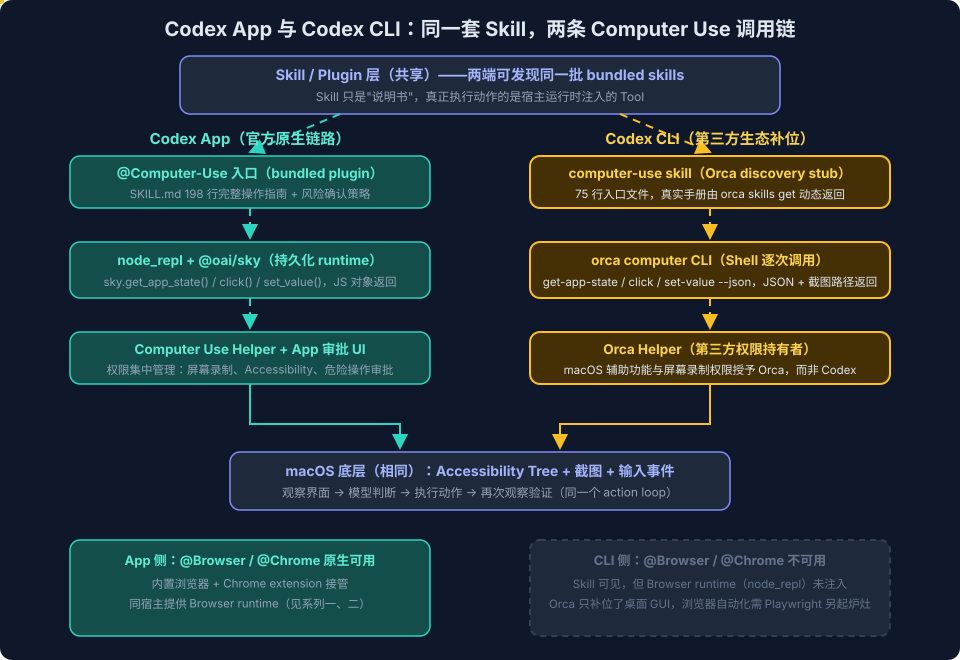

# Computer Use与Browser Use系列六：Codex CLI与App的能力分界——同一套Skill、两条调用链与第三方生态补位

> 系列导航：[系列一：概念与产品形态](Computer%20Use与Browser%20Use系列一：概念与产品形态——从包含关系到四种浏览器形态与认证三链路.md) ｜ [系列二：Codex 浏览器运行时解剖](Computer%20Use与Browser%20Use系列二：Codex浏览器运行时解剖——从bundled%20plugin看Agent浏览器控制的工程设计.md) ｜ [系列三：自己实现](Computer%20Use与Browser%20Use系列三：自己实现——action%20loop协议、双执行器路线与跨平台adapter矩阵.md) ｜ [系列四：产品化](Computer%20Use与Browser%20Use系列四：产品化——可审计智能RPA、Extension-Plugin-WebMCP三层选型与安全设计.md) ｜ [系列五：最佳实践](Computer%20Use与Browser%20Use系列五：最佳实践与日常使用习惯——场景路由表、内容获取链路与实战经验.md) ｜ 本篇 ｜ [系列七：Web Search 与浏览器操作的分界](Computer%20Use与Browser%20Use系列七：Web%20Search与浏览器操作的分界——信息获取三级梯、执行位置与成本转移.md)

## 引言：一次"CLI 里居然能用 Computer Use"的意外

前五篇的语境基本默认：Computer Use 和 Browser Use 是 Codex **桌面 App** 的能力，CLI 没有。第一次实测先推翻了一半——在 Codex CLI 会话里说"使用 Computer Use 打开网易云音乐，播放王菲的《金刚经》"，任务真的完成了：Agent 枚举窗口、截图、读取 Accessibility Tree、点击搜索、播放成功。但紧接着测 `@Browser` 和 `@Chrome`，两者都失败。进一步用 Orca 内嵌 Browser 通过 Google 查询 MSFT 股价后，另一半也需要重新表述：失败的是 OpenAI 原生入口，不是 CLI 的所有浏览器控制路径。

同一个 CLI，为什么 Computer Use 通了、`@Browser` 和 `@Chrome` 却不通？追下去发现了一个比"能不能用"更有意思的结构：**Codex CLI 和 App 共享同一套 Skill 发现机制，但 Skill 依赖的执行 runtime 两端并不对等**——App 有 OpenAI 原生后端，CLI 则可以靠第三方工具（本例中是 Orca）同时补位桌面控制与浏览器控制。这里需要区分：Orca 补上的不是 Codex `@Browser` / `@Chrome` runtime，而是它自己的内嵌 Browser runtime，以及通过 `orca computer` 对外部浏览器窗口的桌面 GUI 控制。

本篇把这次实测拆成五个问题：两端能力矩阵到底什么样、"同一套 Skill 两条调用链"在底层如何成立、两个 Computer Use 后端的接口差异有多大、Orca 如何用独立的内嵌 Browser 补位，以及 OpenAI 为什么不直接给 CLI 开放原生接口。

## 一、能力矩阵：App 与 CLI 的真实分界

先给修正后的结论表——"修正"是因为第一版答案把 CLI 的 Computer Use 写成了 ❌，实测证明这个 ❌ 需要加限定词：

| 能力                                              | Codex App   | Codex CLI     | 备注                                                         |
| ----------------------------------------------- | ----------- | ------------- | ---------------------------------------------------------- |
| 核心 Agent 能力（文件、Shell、Git、Skills、MCP、Web Search） | ✅           | ✅             | 两端相近                                                       |
| Computer Use（桌面 GUI 控制，含把外部浏览器当桌面应用操作）          | ✅ 原生 plugin | ⚠️ 无原生，第三方补位  | 本机经 Orca 实测通过（`orca computer ...`）                         |
| Browser Use：OpenAI 原生入口（`@Browser` / `@Chrome`） | ✅           | ❌ runtime 未注入 | Skill 可见但不可执行，实测失败                                         |
| Browser Use：第三方路径                               | ——          | ⚠️ 可补位        | Orca 内嵌 Browser（`orca goto/snapshot/...`，实测可用）或 Playwright |

两端的产品定位差异决定了这张表的形状：

- **Codex CLI** 运行在终端里，容易组合进 SSH、CI、管道和非交互式任务，但自身没有 OpenAI 的 GUI 宿主——不原生承载 `@Browser` / `@Chrome`，也不直接控制桌面窗口；第三方 runtime 可以补齐部分能力
- **Codex App** 是图形化工作台，原生承载 Computer Use、内置浏览器和 Chrome 扩展，适合"看见页面、点击界面、操作已登录网站"的任务

概念层的包含关系（系列一讲过，这里放实测视角的版本）：

```text
Computer Use（广义 GUI 操作能力）
├── 桌面应用：Obsidian、网易云音乐、系统设置等
└── 浏览器操作（Browser Use）
    ├── @Browser：Codex App 内置浏览器
    ├── @Chrome：Codex App 通过扩展连接真实 Chrome profile
    ├── Orca 内嵌 Browser：Orca worktree 内的独立 Browser tab
    └── Orca Computer Use：把外部 Chrome、Edge、Safari 当作桌面应用控制
```

关键修正：**"CLI 不支持 Computer Use / Browser Use"只适合描述 OpenAI 原生 runtime，不适合描述 CLI 的实际可扩展能力**。准确表述是——CLI 无 OpenAI 原生 Computer Use、`@Browser` 与 `@Chrome` runtime，但环境里若装了 Orca 等外接执行后端，桌面控制和浏览器控制都可以建立替代链路。这正是本篇的主线。

## 二、底层结构：Skill 是说明书，Runtime 才是手脚

### 2.1 为什么 CLI 里能看到 App 的 Skill 却用不了

追查两端差异时发现一个反直觉的事实：**Codex CLI 里能读到 App 的 bundled Computer Use Skill 文件**（缓存在 `~/.codex/plugins/cache/openai-bundled/computer-use/<version>/` 下），但完全无法执行它。

原因在于 OpenAI 插件体系的设计：

- 插件采用通用插件目录，App 和 CLI **发现同一批插件**
- 插件可以同时包含 Skill、MCP server、connector 等组件
- 但 **Skill 只是"操作说明"，真正执行动作的是宿主运行时注入的 Tool**

bundled Skill 的第一步就暴露了依赖：

```js
globalThis.sky = (await import("@oai/sky")).sky;
```

这行代码要求宿主提供持久化的 `node_repl` 环境和 `@oai/sky` 模块。Codex App 提供，CLI 不提供——于是同一份 Skill 文件，在 App 里是完整能力，在 CLI 里是一纸空文。

> **安装或缓存了 Skill，不代表当前宿主提供了它依赖的运行接口。** 这是理解 Codex 插件生态最重要的一条。

### 2.2 两条调用链



```text
Codex App（官方原生）
→ Computer Use plugin（bundled Skill）
→ node_repl + @oai/sky（持久化 runtime）
→ Computer Use Helper + App 审批 UI
→ macOS Accessibility 与截图能力
```

```text
Codex CLI（第三方补位）
→ computer-use skill（Orca discovery stub）
→ orca computer CLI（Shell 逐次调用）
→ Orca Helper（持有 macOS 权限）
→ macOS Accessibility 与截图能力
```

Browser Use 还有一条独立的 Orca 调用链，它不经过 `orca computer`：

```text
Codex CLI（第三方 Browser 补位）
→ orca-cli skill
→ orca goto / snapshot / click / fill / tab ...
→ Orca runtime / bridge
→ 当前 worktree 的内嵌 Browser tab
```

因此，标题中的"两条调用链"仍指同一类 Computer Use 的官方链与补位链；Orca 内嵌 Browser 是并列的第三方浏览器执行链。

前述两条 Computer Use 链在最底层汇合——都是 macOS 的 Accessibility Tree、截图和输入事件；在最顶层也一致——都遵循同一个 action loop（系列三的主题）：

```text
观察界面 → 模型判断下一步 → 执行点击/输入 → 再次观察验证
```

不同的是中间两层：**执行引擎、调用协议、权限系统和功能边界全部不同**。逐层对比：

| 层面 | Codex App | Codex CLI（Orca 补位） |
|---|---|---|
| 执行后端 | OpenAI 内置 Computer Use plugin | Orca Computer Use provider |
| 调用方式 | `@Computer-Use` → `@oai/sky` App 内部服务 | Skill → `orca computer ...` |
| 观察界面 | 截图 + Accessibility Tree | 相同 |
| 执行动作 | 点击、输入、滚动等原生接口 | Orca CLI 发出对应操作 |
| 权限管理 | Codex App 设置与审批界面 | Orca Helper 持有的 macOS 权限 |
| 浏览器集成 | 原生 `@Browser` / `@Chrome` | 无对等的 OpenAI 集成；另有 Orca 内嵌 Browser，外部浏览器可走 `orca computer` |
| 能力与稳定性 | 官方整合 | 取决于 Orca 版本与运行状态 |

权限一行值得展开：App 链路里，屏幕录制和辅助功能权限授予 **Codex App 自己**，危险操作审批走 App 的 UI；CLI 链路里，这些 macOS 权限授予的是 **Orca Helper**——Codex CLI 本身从头到尾没碰系统权限。这意味着两条链的信任边界完全不同：前者信任 OpenAI 的审批策略，后者信任第三方工具的权限持有。

## 三、接口对比：两个同名 Skill 的解剖

本机恰好同时存在两个 `name: computer-use` 的 Skill 文件——OpenAI bundled 版（App 用）和 Orca 版（CLI 用）。逐项对比它们，能看清两种后端的设计哲学差异：

| 对比项 | OpenAI bundled skill | Orca skill |
|---|---|---|
| 文件长度 | 198 行 | 75 行 |
| 定位 | 完整执行说明 | discovery stub（入口文件） |
| 执行后端 | `@oai/sky` | `orca computer` |
| 调用环境 | 持久化 `node_repl` | Shell 中执行 Orca CLI |
| 返回形式 | JavaScript 对象 | JSON 命令输出 + 截图文件路径 |
| 状态管理 | `node_repl` 会话内保持状态 | Orca runtime + 每次 CLI 调用 |
| 安全规则 | 完整的分类确认策略 | stub 中只有简要限制 |
| 版本管理 | 插件目录固定版本 | 运行时动态返回与二进制匹配的文档 |

### 3.1 OpenAI bundled skill：文档即完整 API

所有操作通过持久化 `node_repl` 里的 `sky` 对象：

```js
await sky.get_app_state(...)   // 返回 Accessibility Tree + 截图
await sky.click(...)
await sky.set_value(...)
await sky.press_key(...)
```

几个设计细节体现了官方整合的深度：

- 默认强调**重新观察后再使用新的 `element_index`**（防止陈旧索引点错元素）
- 可以自动启动目标应用
- `paste()` 会临时借用剪贴板、用完恢复原内容
- 包含非常详细的风险确认规则：删除、发送消息、上传文件、交易、登录、修改系统设置等都要停下来确认
- 明确规定：除非用户特别要求，**不要混用 AppleScript、`osascript`、JXA 等其他 GUI 技术**——保证操作全部走可审计的同一条链

### 3.2 Orca skill：刻意做短的 discovery stub

Orca 的 SKILL.md 自我声明"This file is a discovery stub, not the usage guide"——它只负责两件事：定位 Orca 可执行文件、告诉 Agent 用 `orca skills get computer-use` 动态拉取真实手册。实际调用形式：

```bash
orca status --json
orca computer capabilities --json
orca computer list-apps --json
orca computer get-app-state --app <app> --json
orca computer click --app <app> --element-index 42 --json
```

stub 设计的动机很清楚：**避免静态说明与 Orca 二进制版本脱节**。真实操作手册由当前安装的 Orca 动态返回，天然版本对齐；代价是 Agent 需要额外处理 runtime 状态探测、应用/窗口选择和结构化错误。这与系列二讲的 `browser.documentation()` 按需加载是同一个思路（progressive disclosure），只是把"文档源"从 plugin 内挪到了二进制里。

### 3.3 操作能力高度对应

两套接口的动作原语几乎一一映射——毕竟底层都是 macOS 的同一套能力：

| `@oai/sky` | Orca CLI |
|---|---|
| `list_apps()` | `orca computer list-apps` |
| `get_app_state()` | `orca computer get-app-state` |
| `click()` | `orca computer click` |
| `set_value()` | `orca computer set-value` |
| `press_key()` | `orca computer press-key` |
| `scroll()` | `orca computer scroll` |
| `drag()` | `orca computer drag` |

### 3.4 同名冲突与路由的真实机制

两个 Skill 的 frontmatter 都声明 `name: computer-use`，环境里实际存在两个同名 Skill。这次任务之所以最终走 Orca，不是什么智能路由，而是**排除法**：当前会话有可执行的 `orca`，但没有 bundled skill 要求的 `node_repl`。换句话说，**Skill 路由的隐式裁决者是 runtime 可用性**——这既是当前机制的务实之处，也是潜在的歧义来源（如果未来两个 runtime 同时可用，行为未定义）。

## 四、实测记录：Orca 补位的成色与毛边

"播放王菲的《金刚经》"这个任务里，界面识别、截图、点击全部由 Orca 完成，但有一处毛边值得记录：**网易云音乐窗口拒绝获得键盘焦点，Agent 额外用了一次 `osascript` 激活窗口**，最后再由 Orca 截图确认播放成功。

这个细节说明两点：

1. 第三方补位链路**能用但不等价**——App 原生链路的 bundled skill 明确禁止混用 `osascript`（保证审计一致性），而 CLI 链路里 Agent 可以自由组合 Shell 工具救场。灵活性和可审计性此消彼长，正是系列四讲的产品化取舍在两条链上的现实投影
2. 窗口焦点是桌面 GUI 自动化的经典暗坑（系列三的 adapter 矩阵里提过），任何执行后端都躲不掉

另一个认知修正与 Orca 本身有关。此前的记录里（[Orca 使用笔记](../../../tool/notes/Orca使用笔记——多Agent编排IDE与Mobile跨网络远程互动.md)），Orca 的定位是 iPhone—Mac 连接器：手机远程发指令、Mac 上的 CLI Agent 执行、结果回传。这次实测确认 **Computer Use provider 是 Orca 的另一条独立能力线**：

```text
Orca
├── Mobile Companion
│   └── iPhone → Mac → CLI Agent
├── Computer Use provider
│   └── 截图、Accessibility Tree、点击、输入、滚动、拖动
└── 内嵌 Browser runtime
    └── 导航、snapshot、页面元素交互、tab 管理
```

旧笔记里其实早就出现过 `snapshot`、`click`、`fill` 这些命令；现在回看，它们属于 Orca 内嵌 Browser 的页面控制接口，并不是 `orca computer` 的桌面控制命令。此次实测补全的心智模型，正是把这两条能力线拆开：一条操作 Browser tab 内的网页元素，另一条通过 Accessibility Tree 操作外部桌面应用。工具的能力边界经常大于第一次使用时的心智模型——这也算 PKC 语境下"知识需要多轮 pass 才编译完整"的一个注脚。

### Browser Use 如何被 Orca 补位

`@Browser` 和 `@Chrome` 在 CLI 里的失败方式一致：Skill 已加载，但它们依赖的 OpenAI Browser runtime（同样由 `node_repl` 承载）未在会话中注入。失败的是这两个**原生入口**，不是 CLI 上所有可能的 Browser Use。

Orca 为 CLI 提供了两条不同的浏览器控制路径：

| 路径 | 控制对象 | 命令与句柄 | 适用场景 |
|---|---|---|---|
| Orca 内嵌 Browser | 当前 Orca worktree 内的 Browser tab | `orca goto/snapshot/click/fill/tab...`；snapshot ref（如 `@e1`） | 网页导航、搜索、表单和页面级自动化 |
| Orca Computer Use | 外部 Chrome、Edge、Safari 或 Browser webview | `orca computer ...`；Accessibility Tree 的 `element-index` + screenshot | 需要操作真实桌面浏览器窗口或其他 GUI 时 |

内嵌 Browser 的典型 action loop 是：

```bash
orca goto --url "https://www.google.com" --json
orca snapshot --json
orca click --element @e1 --json
orca snapshot --json
orca fill --element @e2 --value "MSFT stock" --json
orca keypress --key Enter --json
orca wait --text "Microsoft" --json
orca snapshot --json
orca tab list --json
```

其中 `@e1`、`@e2` 仅用于展示命令形态，实际操作必须使用前一步 `snapshot` 返回的最新 ref。这条链已经实测用于通过 Google 查询 MSFT 最新股价。导航、点击或切换 tab 后必须重新 `snapshot`，因为 ref 只属于某一个 Browser tab，并会随页面变化失效；并发控制多个 tab 时，则从 `orca tab list --json` 读取 `browserPageId`，后续通过 `--page <browserPageId>` 明确指定页面。

#### 它是真浏览器，还是 Orca 自研浏览器

更准确的说法是：**Orca 打开的是真实网页渲染面，但不是另起炉灶自研浏览器内核，也不是接管外部 Chrome / Safari 窗口。** Orca 动态手册把它定义为 worktree-scoped 的 embedded Browser tab；本机安装包同时包含 `Electron Framework 43.1.0`，因此当前版本的页面渲染基础来自 Electron 所集成的 Chromium。这里能确认的是当前安装版本的实现，不应把具体 Chromium / Electron 版本写成 Orca 永久不变的产品承诺。

控制时，Codex CLI 本身不接管页面渲染进程，而是通过 Orca CLI 调用 runtime / bridge：`snapshot` 为当前页面生成可操作 ref，`click`、`fill` 等动作消费 ref，tab 切换和并发页面则使用 `browserPageId` 定位。它与 `orca computer` 的 Accessibility Tree 路线是两套作用域、两种元素句柄，不能混用。

因此，Orca 已经为 CLI 的 Browser Use 提供了实际补位，但没有实现 Codex 的 browser binding 协议，也无法替代 `@Chrome` 通过 Extension 接管真实 Chrome profile 的链路。若不使用 Orca，Playwright 仍是另一条独立路径。

### 卸载 Orca 之后还剩什么

把依赖关系推到边界：如果卸载 Orca 且不装替代后端，当前 CLI 就无法进行通用 macOS Computer Use，也失去 Orca 内嵌 Browser 这条浏览器链——不能枚举窗口、不能读 Accessibility Tree、不能截图点击，也不能再用 `orca goto/snapshot/click/fill/tab...`。但"补位"这个位置本身是开放的。社区调研（2026-08-30）显示已有多个项目站在相同或相邻的位置，按补位方式分三类：

**同位置直接替代（本机桌面控制，MCP/Skill 接入）**：

- [open-computer-use](https://github.com/iFurySt/open-codex-computer-use)（MIT）——定位就叫 "Open-Source Alternative to Codex Computer Use"，作者明说是研究了 Codex Computer Use 后做的跨平台复刻。与 Orca 补位方式一致但更开放：`npm i -g open-computer-use`（macOS 14+/Linux/Windows），同时暴露 **MCP server、CLI、Skill、JS/Python/Go SDK** 四种接入形态，官方提供一键装进 Codex（`~/.codex/config.toml`）、Claude Code、Gemini CLI、opencode 的命令；工具语义对齐 `@oai/sky`（`get_app_state` / `click --element-index` / `press_key`），且支持 sequence 模式在单进程内复用 `element_index` 状态——补上了逐次 CLI 调用重新观察的开销
- [mcp-server-macos-use](https://fazm.ai/blog/open-source-mcp-server-macos-accessibility-tree)（Fazm 开源）——macOS 专精，卖点是**纯 Accessibility Tree、默认不传截图**：BFS 遍历前台应用 AX 树，给模型六字段的结构化元素列表，只在需要视觉推理时才回退像素，对 token 消耗敏感的场景最省
- [computer-mcp](https://lobehub.com/mcp/commandagi-computer-mcp)（commandAGI）——跨平台通用 MCP server，每个动作响应默认附带截图与完整状态（焦点应用、鼠标键盘状态），"全家桶"风格

**沙箱/VM 隔离路线（不碰真机桌面，给 Agent 一个可丢弃的桌面）**：

- [trycua/cua](https://github.com/trycua/cua)（MIT，21.9k stars）——最完整的基础设施栈：`lume` 用 Apple Virtualization.framework 跑 macOS/Linux VM（Apple Silicon 近原生性能）、Docker/QEMU 后端、MCP + CLI 双驱动界面，还带 RL 环境与 benchmark（`cua-bench`），明确面向 evals / RL loops / batch rollouts 场景
- [Bytebot](https://github.com/bytebot-ai/bytebot)（Apache 2.0）——每个 Agent 一个容器化 Linux 桌面（预装 Firefox/VS Code），支持 1Password/Bitwarden 认证工作流，动作历史带前后截图

**完整 Agent 产品栈（自带模型循环，不只是执行后端）**：

- [UI-TARS Desktop](https://github.com/bytedance/UI-TARS-desktop)（ByteDance，Apache 2.0，38k+ stars）——模型与执行器一体：UI-TARS 是专训的 GUI 多模态模型，不依赖宿主模型的 computer use 能力
- [goose](https://github.com/block/goose)（Block，Apache 2.0）——桌面 app + CLI 双形态，15+ 模型 provider，桌面控制作为 MCP 扩展之一接入

其余传统选项仍然成立：Playwright（提供浏览器自动化，但不是完整桌面控制）、AppleScript/JXA（有限的 macOS 应用自动化）、自建执行后端（系列三的路线：Accessibility API + 截图 + 输入事件），以及未来 OpenAI 向 CLI 开放 `@oai/sky` runtime。

其中 **open-computer-use 是验证"补位位置开放"论断的最佳实测对象**——它与 Orca 站在完全相同的位置、接口语义对齐 `@oai/sky`，可以做"同任务换后端"的对照实验（如同样播放网易云音乐，看窗口焦点问题它如何处理）；且它能同时装进 Claude Code，是 Orca 之外让 Claude Code 获得桌面控制的现成路径。

准确结论：**Codex CLI 目前没有 OpenAI 原生通用 Computer Use、`@Browser` 与 `@Chrome` runtime；Orca 是这个环境中同时补齐桌面控制与内嵌 Browser Use 的第三方执行后端，而非唯一解。**

## 五、为什么 OpenAI 不给 CLI 开放同一接口

官方没有解释设计决策，但从产品边界可以做合理推断：

- **宿主生命周期**：Codex App 长期运行，有 GUI 宿主和 Helper 生命周期管理；CLI 进程随任务启停，承载不了持久 runtime
- **权限与审批**：App 能集中管理屏幕录制、Accessibility、应用白名单和危险操作审批 UI；给普通终端进程直接开放全桌面控制，安全边界会显著扩大
- **运行环境假设**：CLI 经常跑在 SSH、CI、容器或无桌面环境里——那里根本没有"桌面"可控
- **配套能力的 GUI 依赖**：`@Browser`、Chrome Extension、Computer History 等都依赖 App 的图形界面

所以当前格局的准确描述是：

> Skill 已经可以共享，但 `@oai/sky` 所依赖的 Computer Use runtime 尚未作为通用 CLI 接口提供。

理论上未来只要 OpenAI 向 CLI 注册同样的 `node_repl`/`@oai/sky` 后端，两个入口就能用同一套 Skill——插件体系的架构已经为此留好了位置。但官方文档目前只承诺桌面 App 的原生支持。在那之前，CLI 侧的 Computer Use 与 Browser Use 都存在第三方生态的补位空间；Orca 已分别通过 `orca computer` 和内嵌 Browser runtime 跑通这两类场景。

## 小结

1. **能力分界的真实形状**：App 与 CLI 共享核心 Agent 能力；Computer Use 在 App 是原生、在 CLI 是"无原生但可补位"；`@Browser` / `@Chrome` runtime 仍属于 App，但 Orca 内嵌 Browser 等第三方后端可以补位 CLI 的 Browser Use
2. **Skill ≠ 能力**：插件目录两端共享，Skill 文件处处可见，但 Skill 只是说明书——宿主没注入它依赖的 runtime（`node_repl` + `@oai/sky`），它就是一纸空文
3. **两条调用链，一个 action loop**：官方链（plugin → sky → Helper → 审批 UI）与补位链（stub skill → orca CLI → Orca Helper）在顶层范式和底层 macOS 能力上一致，在执行引擎、协议、权限持有者上完全不同
4. **接口设计的两种哲学**：bundled skill 把 198 行完整 API 和安全策略写死在文档里（版本随插件走）；Orca 用 75 行 stub + 动态手册（版本随二进制走）——各自解决各自的版本对齐问题
5. **补位有成色也有边界**：Orca 已跑通桌面控制和内嵌 Browser 搜索；前者仍可能遇到窗口焦点问题，后者也不等于 Codex `@Browser` binding 或 `@Chrome` 的真实 profile 接管——第三方链路"能用"与官方链路"等价"之间仍隔着 runtime、权限体系和审批策略

## 参考

- 官方文档：[Codex App](https://developers.openai.com/codex/app) · [Codex CLI](https://developers.openai.com/codex/cli) · [Computer Use](https://developers.openai.com/codex/computer-use) · [Browser](https://developers.openai.com/codex/browser) · [Browser extension](https://developers.openai.com/codex/chrome-extension) · [Plugins](https://developers.openai.com/codex/plugins)
- 本系列：[系列二](Computer%20Use与Browser%20Use系列二：Codex浏览器运行时解剖——从bundled%20plugin看Agent浏览器控制的工程设计.md)（browser binding 协议与 runtime 引导）、[系列三](Computer%20Use与Browser%20Use系列三：自己实现——action%20loop协议、双执行器路线与跨平台adapter矩阵.md)（action loop 与执行后端实现）、[系列四](Computer%20Use与Browser%20Use系列四：产品化——可审计智能RPA、Extension-Plugin-WebMCP三层选型与安全设计.md)（可审计性与安全设计）、[系列五](Computer%20Use与Browser%20Use系列五：最佳实践与日常使用习惯——场景路由表、内容获取链路与实战经验.md)（场景路由表）
- [Orca 使用笔记——多 Agent 编排 IDE 与 Mobile 跨网络远程互动](../../../tool/notes/Orca使用笔记——多Agent编排IDE与Mobile跨网络远程互动.md)
- [[Orca使用笔记二——Computer Use桌面控制与Codex CLI补位实践]]
