# Computer Use 与 Browser Use 系列八：Jev × Codex 实践——把动作判断交给 System One 模型的受控对照、费用账与 skill 优先级结论

> 本篇是实践记录，接在 [系列五](Computer%20Use与Browser%20Use系列五：最佳实践与日常使用习惯——场景路由表、内容获取链路与实战经验.md) 的场景路由表和 [系列六](Computer%20Use与Browser%20Use系列六：Codex%20CLI与App的能力分界——同一套Skill、两条调用链与第三方生态补位.md) 的 Codex skill 调用链之后，回答一个具体问题：把 Codex 在 UI 操作里"下一步做什么"的判断交给 TypeSafe 的 Jev，省不省时间、省不省钱、准不准，以及能不能因此把 Jev 对应的两个 skill 设为以后 browser use、computer use 的优先选择。Jev 是什么、RLCD 与校准见 [TypeSafe Jev：System One 模型、RLCD 与校准决策](../../../product/TypeSafe-Jev：System-One模型、RLCD与校准决策——从聊天模型到软件可直接消费的决策原语.md)。
>
> 数据来自 2026-09-27 一次完整的 Codex 会话与实验记录（8 次正式受控测试、4 次早期试跑、102 次已记录 API 调用）。所有金额是按公开单价的估算，不是账单。

---

## 一、先分清三样东西

| 层 | 是什么 | 本次对应物 | 常见误解 |
|---|---|---|---|
| API 能力 | Jev 接收文本或结构化状态，返回 Choice / Score / Noul 的概率分布与 confidence | `POST /v1/systemone`，模型 `jev-1.13.0` | 不接受截图，不能替换 Codex 背后的通用模型 |
| skill 指导 | 告诉 Codex 怎样正确调用 Jev、设计问题 | 官方 `typesafe-ai` skill（`npx skills add typesafe-ai/skills --skill typesafe-ai`） | 装了 skill 不等于每一步 UI 决策都经过 Jev |
| UI 执行器 | 真正观察界面、选动作、点击输入的循环 | 开源项目 `jev-ultrafast`（浏览器）、`typesafe-computer-use`（桌面），封装成两个新 skill | skill 名字本身不提供互斥，执行器才需要锁 |

一个环境细节值得记：`~/.zshrc` 里放了 key，但文件开头对 Codex 的非终端进程提前 `return`，导致 key 在 Codex 执行环境里读不到。验证方法不是在另一个终端 `export`，而是在 Codex 实际执行脚本的进程里检查"是否可读"，再发一条小请求。

## 二、Jev 放在操作循环的哪个位置

两种接法，结果相反：

| 接法 | 流程 | 对速度的影响 |
|---|---|---|
| 事后询问 | Codex 已决定动作，再让 Jev 判断一次 | 纯增加请求，只会更慢 |
| 接管循环 | 执行器观察界面 → 元素编号表交给 Jev 一次选出动作与目标 → 执行 → 重新观察；只在需要填文字时调用一个 writer 模型；结束后交回 Codex | Codex 不必在每次点击之间完整思考，这是提速来源 |

两个已有的开源执行器都走第二种：

| | `browser-use/jev-ultrafast` | `awlevin/typesafe-computer-use` |
|---|---|---|
| 定位 | 轻量浏览器执行器 | macOS 桌面执行器，另有独立浏览器后端 |
| 读界面 | DOM、HTML/ARIA 控件 | OCR + 辅助功能树 |
| Jev 做什么 | 一次请求同时选动作与目标元素 | 多个 Choice 选动作类型、目标、站点等 |
| 填文字 | 另一个文本模型（writer） | 另一个 writer，还负责解读结束状态 |
| 作者报告 | 航班搜索约 7.07 s；新旧执行器 9.45 → 7.09 s 是执行器优化，不是对 Codex 的对照 | 单步决策 0.13~0.38 s 对比截图模型 5.2 s；含 OCR 单步约 1.5 s 对比 5.5 s |
| 接入要补的 | 低置信度不自动停止；直接接受模型 `DONE`；writer 请求带 `reasoning`、`max_tokens` 等参数，Azure 需适配 | 默认每次动作后等待 2 秒，单步日志不含这段；"关闭思考"参数转换时被丢弃 |
| Chrome profile | 复用现有 profile | 临时 profile，适合隔离实验 |

## 三、两个 skill 与互斥

保留 `typesafe-ai` 做 API 指导，新增两个专用 skill，各配一个调用入口，共用凭据加载与结果格式：

| Skill | 默认场景 | 触发 | 入口负责 |
|---|---|---|---|
| `jev-browser` | 普通网页的连续搜索、筛选、表单、导航（DOM 可观察） | 允许自动选择，执行前告知"本次使用 Jev Browser" | 加载凭据、限制步数与时长、低置信度交回、返回 `receipt.json` / `result.json` 与独立 `verified_success` |
| `jev-desktop` | macOS 应用中以文字、控件、OCR、辅助功能树为主的操作 | 同上 | 同上 |
| 系统 Browser / Computer Use | 纯视觉、canvas、iframe、跨 App、用户点名系统工具 | 用户点名优先 | 原生 |

任务文件只放目标与验收，不放凭据：

```json
{
  "goal": "筛选显示器、价格不超过 1000、仅看有货，选择符合条件的型号",
  "url": "http://localhost/web.html",
  "max_steps": 20,
  "timeout_seconds": 120,
  "min_confidence": 0.4,
  "verify": {"text_contains": ["M24"]}
}
```

互斥是分层的，不能假设系统天然只调用一个执行器：

| 层 | 机制 | 强度 |
|---|---|---|
| 两个 Jev 入口之间 | 共用一把全机锁，一个运行另一个不能启动；`stop` 后要等 `status` 为 idle | 程序强制 |
| Jev 与系统工具之间 | 用户级 AGENTS 约定 `native-begin` / `native-end` 预约，切换前先停止、确认释放、重新观察 | 协作式，原生工具未被改造 |
| 操作系统级 | 无 | 不存在，不能宣称 |

13 项离线测试覆盖互斥、停止、超时、启动进程异常退出、子进程清理、模型 `DONE` 后仍需验收，全部通过。

## 四、从"Jev 反而更慢"到统一口径

第一轮探索直接拿系统 Browser 与 Jev 执行器比总时间，结论是 Jev 更慢。复核后发现是三处口径不一致：

| 问题 | 探索轮的情况 | 修正 |
|---|---|---|
| 计时边界 | Jev 总时间含关闭临时 Chrome 与守护进程退出约 15.7 s；系统侧只计到验收 | 拆成初始化 / 任务执行 / 结果验收 / 退出清理四段，主表只比执行加验收 |
| writer 条件 | 会话内 Codex 用 medium 推理，独立 writer 用 low | 两组 writer 固定 Azure `gpt-6-astra` / medium，同提示词、同 schema |
| 执行链路 | 系统侧是 Codex 内置浏览器，Jev 侧是 Chrome，观察方式也不同 | 两组共用同一个系统 Browser、同一 DOM 观察器、同一候选动作与执行器 |

最终实验只留一个变量：

| 环节 | 两组共用 |
|---|---|
| 页面、初始状态、视口 | 同一本地合成页，1280×720，每次新标签页并校验尺寸 |
| 界面观察与候选动作 | 同一 DOM 观察器，同一编号规则 |
| 填写内容生成 | 同一 Astra writer，请求内容逐字一致 |
| 执行、计时、验收、停止条件 | 同一系统 Browser 接口，20 步上限，120 s 软截止，逐字段验收 |
| **唯一变量** | **下一步动作由 Azure `gpt-6-astra` 判断，还是由 `jev-1.13.0` 判断** |

正式样本 8 次：B1 筛选选择、B2 填表提交，各组各两次，交替顺序。视口不一致的试跑与预检失败的运行已排除并保留原记录。

## 五、结果

**速度、成功率、费用**（每组两次均值，费用按 Azure Global Standard 公开价与 Jev 公开价估算）：

| 任务 | 判断模型 | 验收 | 任务耗时 | 其中判断 | 其中 writer | 每次任务费用 |
|---|---|---:|---:|---:|---:|---:|
| B1 筛选并选择商品 | Astra | 2/2 | 17.76 s | 14.62 s | 1.63 s | $0.0590 |
| B1 筛选并选择商品 | Jev | 2/2 | 6.10 s | 1.79 s | 2.73 s | $0.0021 |
| B2 填写并提交表单 | Astra | 2/2 | 23.71 s | 16.06 s | 6.45 s | $0.0570 |
| B2 填写并提交表单 | Jev | 2/2 | 9.84 s | 2.22 s | 6.39 s | $0.0055 |

B1 耗时减少 65.7%，B2 减少 58.5%；费用估算减少 96.5% 与 90.3%。两组动作轨迹完全一致，都是 B1 五步、B2 六步。

**token 按模型归属**（输入 / 输出）：

| 任务 | 组 | 判断模型 token | writer 模型 token | 备注 |
|---|---|---|---|---|
| B1 | Astra | Astra 5,380 / 71 | Astra 103 / 13 | 同模型两种作用 |
| B1 | Jev | Jev 9,712 / 667 | Astra 103 / 13 | 跨模型合计 10,495，不能套单一价格 |
| B2 | Astra | Astra 4,770 / 83 | Astra 315 / 40 | |
| B2 | Jev | Jev 9,057 / 629 | Astra 315 / 40 | 跨模型合计 10,041 |

Jev 组 token 总数是 Astra 组的约 1.9 倍，但 Jev 输入每百万 $0.042、输出免费，Astra 短上下文输入/输出 $10 / $50，所以 token 多不等于贵。Jev 组的费用几乎全部来自 writer 的 Astra 调用。

**B1 逐步时间线**：



**同一页面状态下两种判断的返回结构**：

| | Astra | Jev |
|---|---|---|
| 第一步返回 | `{"choice":"a0"}` | `choice: "a0"`，`confidence: 0.96`，`probabilities: {a0 0.97, a2 0.02, a3 0.01, ...}` |
| 单次往返 | 2.899 s，921 / 12 token | 0.471 s，1,666 / 122 token |
| 可用于 | 执行 | 执行，并可按 confidence 做门控与交回 |

**验收截图**（B2 表单最终状态，两组字段结果相同）：

 

## 六、Jev 组的 6 秒花在哪

| 阶段 | 平均 | 占比 |
|---|---:|---:|
| 6 次 Jev 判断 | 1.794 s | 29% |
| 1 次 Astra writer 生成 `"1000"` | 2.728 s | 45% |
| 开页、6 次观察、5 次动作、验收、本地编排 | 1.574 s | 26% |
| 合计 | 6.096 s | |

两点判断：判断被串行调用六次是循环结构决定的，每步改变页面后才能判断下一步；writer 用大模型生成一个用户已经给定的字面值，是当前最大的可优化项。优化必须两组同步应用，否则单变量前提就破了。

## 七、桌面 Computer Use 为什么没有成绩

| 路径 | 状态 | 说明 |
|---|---|---|
| 系统 Computer Use | 阻塞 | 读取 Calculator 状态两次报 ScreenCaptureKit -3811（audio/video capture failure），未进入任务 |
| Jev Desktop | 阻塞 | 当前终端缺少 Accessibility 权限；22.412 s 是启动失败耗时，不是任务成绩 |
| 处理 | 未修改权限、未重启应用来掩盖 | 桌面组速度、正确率、token 均无有效同条件数据，不能用网页结果代替 |

## 八、结论：能不能把两个 Jev skill 设为优先选择

**数据支持什么，不支持什么**：

| 支持 | 不支持 |
|---|---|
| 同一执行器、只换判断模型时，DOM 型简单网页任务的判断延迟约为 Astra 的 1/8，任务耗时减少 58~66% | 完整产品对照：Codex 原生模式是一轮批量规划多步动作，本实验是逐步循环；探索轮里 Jev 执行器端到端反而更慢，说明"skill 整体"与"判断模型"是两回事 |
| 公开价估算下每次任务费用减少 90~96%，且节省来自判断，writer 成本两组相同 | 桌面 Computer Use，无任何有效数据 |
| 两组成功率相同（各 4/4），轨迹一致 | 一般正确率：只有两类简单页面、每组 4 次，无相似选项、动态加载、错误恢复、canvas、iframe、真实网站干扰 |
| Jev 返回 confidence 与候选概率，可做门控与交回 | confidence 不是正确率，`min_confidence: 0.4` 是拍脑袋值，尚未用结果标签校准 |

**因此结论是"条件默认"，不是"优先选择"**。路由规则可以写成：

| 任务特征 | 默认执行器 | 理由 |
|---|---|---|
| 网页、DOM 可观察、目标明确、有程序化验收、动作可逆 | `jev-browser` | 受控数据支持；验收器与 confidence 门控守住错误成本 |
| 网页但纯视觉、canvas、iframe、需要跨站点长流程 | 系统 Browser | Jev 不看截图，跨 origin 会停止交回 |
| macOS 应用、跨 App | 系统 Computer Use，`jev-desktop` 待权限修复后重测 | 目前无数据 |
| 有 stakes 的动作（付款、删除、提交不可撤销表单） | 任一执行器都走人工确认 | 错误成本主导，与判断模型无关 |
| 用户点名 | 服从用户 | 路由规则的最高优先级 |

这与 [FinOps 系列 01](../../FinOps/FinOps系列01：从token价格到任务完成花费——指标转向与AI使用边界.md) 的公式一致：Jev 压低的是模型调用成本与时间这两项，成功率与错误成本那一项要靠验收器、confidence 门控和人工确认来守，本轮只在低错误成本的任务上验证了前者。

**从"条件默认"升级到"优先选择"，还差四个实验**：

| 实验 | 目的 |
|---|---|
| 桌面复测：修复截图与 Accessibility 权限后跑 D1~D4 | 补齐 computer use 的数据 |
| 难任务集：B3 多步预约、B4 异步加载与干扰项，加相似选项、错误恢复、"确实无法完成"的任务，统计错误动作数与错误宣告完成次数 | 看正确率是否出现差异 |
| 三臂对照：加入 Codex 原生批量规划模式作为第三组 | 回答"完整产品"层面的问题 |
| writer 优化两组同步：直接复用用户给定的字面值或换更轻的 writer，每组至少 3 次重复 | 去掉当前最大单项耗时，并让结论更稳 |

---

**相关阅读**

- [TypeSafe Jev：System One 模型、RLCD 与校准决策](../../../product/TypeSafe-Jev：System-One模型、RLCD与校准决策——从聊天模型到软件可直接消费的决策原语.md)：概念篇，两层校准与 confidence 的含义
- [系列五：最佳实践与日常使用习惯——场景路由表](Computer%20Use与Browser%20Use系列五：最佳实践与日常使用习惯——场景路由表、内容获取链路与实战经验.md)
- [系列六：Codex CLI 与 App 的能力分界——同一套 Skill、两条调用链](Computer%20Use与Browser%20Use系列六：Codex%20CLI与App的能力分界——同一套Skill、两条调用链与第三方生态补位.md)
- [FinOps 系列 01：从 token 价格到任务完成花费](../../FinOps/FinOps系列01：从token价格到任务完成花费——指标转向与AI使用边界.md)
- wiki：[Harness 质量门控](../../../wiki/concepts/harness-quality-gate.md)、[Computer Use](../../../wiki/concepts/computer-use.md)
