# OpenAI Jalapeño 推理芯片——从 ASIC 基础到首测数据解读的 AI 推理硬件全景

2026 年 8 月 25 日，OpenAI 公布了自研推理芯片 Jalapeño 的首批实测结果（[Jalapeño's first results show industry-leading speed and efficiency in AI inference](https://openai.com/index/jalapeno-first-results/)）：在公开基准 InferenceX 上，Jalapeño 的能效与延迟表现全面超过 NVIDIA GB200/GB300。这颗芯片在 6 月 24 日由 OpenAI 与 Broadcom 联合发布（[OpenAI and Broadcom unveil LLM-optimized inference chip](https://openai.com/index/openai-broadcom-jalapeno-inference-chip)），官方称之为 "Intelligence Processor"——OpenAI 多代自研算力平台的第一步。

这是一个很好的切入点，可以把 AI ASIC 这个话题从概念、原理到数据解读完整梳理一遍：Jalapeño 到底是一颗什么芯片？推理芯片和训练芯片差在哪里？官方给出的"1.9 倍"和"104 倍"两套悬殊的数字是否矛盾？"年底开始部署"的说法可信吗？

## 一、Jalapeño 是什么：定位与命名

### 处理器分类中的位置

Jalapeño 不是 CPU，也不叫 GPU 或 TPU。OpenAI 官方将其称为 custom inference accelerator（定制推理加速器），技术分类上属于 **AI ASIC**：

```
处理器
├── CPU：通用计算，运行操作系统和任意程序
├── GPU：通用并行加速，兼顾训练和推理（NVIDIA、AMD）
└── AI ASIC：针对 AI 负载专门设计
    ├── Google TPU
    ├── AWS Inferentia / Trainium
    └── OpenAI Jalapeño
```

ASIC 是 **Application-Specific Integrated Circuit（专用集成电路）** 的缩写——Application-Specific 指针对特定应用设计，Integrated Circuit 即集成电路。与 CPU、GPU 相比，ASIC 牺牲通用性，换取目标任务上更高的性能、能效和成本效率。TPU 是 Google 商标化的产品名，本质上与 Jalapeño 同属 AI ASIC 这一类。Jalapeño 在数据中心承担的角色类似 GPU（插在加速卡上跑模型），但架构上更接近 TPU、Inferentia 这样的专用加速器。

### 命名由来

Jalapeño 是西班牙语单词，指墨西哥常见的哈拉佩尼奥辣椒，词源来自墨西哥城市 Xalapa/Jalapa（词尾 -eño 表示"来自某地的"），它也早已是英语中的常用外来词。OpenAI 没有正式解释命名原因，合理的推测是："辣、热"容易联想到高性能芯片与激烈的算力竞争，名字短、形象鲜明，比字母数字代号更易传播——科技公司用食物、动物、地名做内部代号是常见做法，通常不直接对应技术规格。

### 研发背景

按公开时间线，OpenAI 与 Broadcom、台积电的定制芯片合作在 2024 年即有报道，2025 年双方公布长期合作及 2026 年开始部署的计划。OpenAI 总裁 Greg Brockman 对 CNBC 表示，Jalapeño 从头到尾的设计周期约九个月，且大量借助了 OpenAI 自家 AI 模型辅助设计——他称这可能是高性能先进半导体史上最快的 ASIC 开发周期。分工上：OpenAI 负责加速器架构设计，Broadcom 提供硅实现、网络与互连技术，Celestica 负责板卡、机架与系统集成。Broadcom CEO Hock Tan 给出的商业口径是：早期测试显示相比典型 AI GPU 约有 50% 的成本节省。

## 二、推理芯片 vs 训练芯片：差异是多层次的联合优化

Jalapeño 被明确定位为推理 ASIC，而它对标的 GB300 并非"训练芯片"——GB300/Blackwell Ultra 是同时支持训练和推理的通用 AI GPU 平台，尤其擅长大模型推理、长上下文和 reasoning 模型。两者对标的是同一任务下的推理性能与能效，不意味着 Jalapeño 能替代 GB300 做训练。

一个容易误解的点是：推理 ASIC 和训练 ASIC 并不是像 x86/ARM 那样由指令集（ISA）硬性划界的两套体系。"推理型"描述的是芯片的**设计优化目标**，差异体现在从电路到经济模型的多个层次上。

### 1. 硬件电路层：精度单元的资源配比

"强调某种数值精度"指的是芯片在物理电路上为该数据格式投入更多资源，而不只是多一条指令。以"强调 INT4"为例，可能包括：

- 矩阵乘法阵列原生一次处理更多 INT4 数字；
- 寄存器、缓存和内存按 4 bit 紧密存储，减少带宽占用;
- 内置反量化、缩放和高精度累加电路；
- 编译器为 INT4 算子生成专门的数据搬运和计算流程。

同样的芯片面积和功耗下，INT4 每周期能完成的乘加次数远高于 FP16。训练更强调 BF16/FP16/FP8，因为梯度的数值范围变化很大，INT4/INT8 通常精度不足；推理时权重已经固定，量化空间大得多——所以推理 ASIC 把更多晶体管预算押在低精度吞吐上。此次 Jalapeño 的基准测试全部使用 MXFP4 格式跑模型，也印证了这条路线。

需要注意的是，推理芯片的网络资源并不一定更少——分布式推理、长上下文和大规模 KV Cache 同样需要高互连带宽。

### 2. 算子与软件层：反向传播不是一条指令，而是一组系统要求

反向传播在数学上仍然主要是矩阵乘法。前向计算 `Y = X × W` 对应的反向至少要算输入梯度 `dX = dY × Wᵀ` 和权重梯度 `dW = Xᵀ × dY`——推理芯片的矩阵单元在数学能力上"可能算得动"这些公式，但训练对硬件提出了一整套额外要求：

- 高效支持矩阵转置及不同数据布局；
- 保存或重计算前向过程的激活值；
- 对梯度做高精度累加、归约和参数更新；
- 多芯片之间执行大量 All-Reduce 梯度同步；
- 内存要同时容纳权重、梯度、激活和优化器状态——训练所需内存常是推理的数倍。

而且软件栈可能根本不暴露训练能力：ISA、编译器、运行时可能没有高效的转置通路、梯度归约、自动微分和优化器算子。所以推理 ASIC "理论上能训练，实际上不经济甚至不可用"。

### 3. 系统架构层与经济目标层

再往上，两类芯片所处的系统形态也不同：训练强调大规模同步、All-Reduce 和统一训练集群；推理强调请求调度、continuous batching、KV Cache 管理、低延迟以及 prefill/decode 分离。云平台的 VM/实例层只是按场景分配 CPU、系统内存、网卡和加速器拓扑——HBM 是芯片封装上的物理资源，VM 只能选择不同 HBM 容量的硬件型号，改变不了"发动机"本身。

最终一切差异收敛到经济目标的不同：训练优化的是"完成一次训练所需的总时间"；推理优化的是"每百万 token 成本、响应延迟、吞吐量和能耗"。

概括起来：**训练/推理芯片的区别不是单一指令集，而是硬件电路、内存与互连、编译器与算子、集群架构及成本目标的联合优化。** GB300 是可训练可推理的"高性能通用车"，Jalapeño 是为 OpenAI 推理路线专门打造的"赛车"。

## 三、首测数据解读：1.9 倍和 104 倍为什么不矛盾

测试基于 SemiAnalysis 的公开基准 **InferenceX**，覆盖从高吞吐 serving 到高交互低延迟的完整工作区间，模型统一用 MXFP4，负载为 nominal 8k 输入/1k 输出。功耗口径按封装 TDP：Jalapeño 700W，GB200 1,200W，GB300 1,400W。OpenAI 特别强调了度量标准的选择：**性能应按单位功耗（per kW）衡量，而不是按芯片（per chip）**——在数据中心电力成为第一约束的时代，这个口径转换本身就是立场。

三个模型上的官方数据：

| 指标 | GPT-OSS-120B（vs GB200） | DeepSeek R1 670B（vs GB300） | Kimi K2.5 1T（vs GB300） |
|---|---|---|---|
| 峰值 mixed TPS/kW | ≈1.9×（85,448 vs 44,960） | ≈1.7×（19,641 vs 11,781） | ≈1.5×（18,195 vs 11,862） |
| 端到端延迟 | ≈1.7×（1.03s vs 1.80s） | ≈3.6×（1.65s vs 5.99s） | ≈3.4×（1.56s vs 5.31s） |
| 最低 TBT（单用户最快解码） | ≈2.7×（1,459 vs 535 tok/s/user） | ≈4.1×（700 vs 169 tok/s/user） | ≈3.8×（694 vs 182 tok/s/user） |
| 对手最快解码速度下的吞吐/kW | ≈53.7×（22,935 vs 427） | ≈104.3×（12,258 vs 118） | ≈56.1×（6,744 vs 120） |

前三行是 1.x~4.x 倍，最后一行却是几十倍到上百倍——两套数字并不矛盾，因为它们比较的是**吞吐—延迟曲线上不同的工作点**：

- **峰值 mixed TPS/kW（1.5~1.9×）**：各自开到最大吞吐时的能效对比，描述"极限产能"；
- **最低 TBT（2.7~4.1×）**：TBT（time between tokens）即相邻两个输出 token 的间隔，取倒数就是单用户解码速度，描述"单个用户能感受到的最快响应"；
- **matched TBT 下的吞吐（53~104×）**：先取 GB300 的最快单用户解码速度（如 DeepSeek R1 上的 169 tok/s），要求两种芯片都保持这一响应速度，再比较各自还能同时承载多少总工作量。GB300 要达到自己的最低延迟必须把并发/批量压到很低，总吞吐只剩 118 mixed TPS/kW；Jalapeño 在同样的单用户速度下仍能并行服务大量请求，达到 12,258——比值即 104 倍。

餐厅类比：两家餐厅都被要求"每位顾客每分钟上一道菜"，GB300 只有店里很空时才做得到，Jalapeño 满座时仍能做到。这不是"给单个顾客上菜快 104 倍"，而是**在相同响应速度约束下能服务的顾客数量差 104 倍**。

另外注意 mixed TPS 的口径：它统计输入 token + 输出 token 的总量，再除以标称功耗，不是单用户看到的输出速度。所以三组数字各有各的适用语境——1.5~1.9× 描述峰值吞吐能效，2.7~4.1× 描述最快单用户解码，53~104× 描述特定低延迟约束下的并发承载能力。官方将其总结为 Jalapeño 在整条曲线上都处于 Pareto frontier：现有硬件往往要在吞吐和延迟之间二选一，Jalapeño 用同一套架构同时拿到两者。这个"几十倍"是一个有价值但非常特定的服务能力指标，绝不能读成"整体性能是 GB300 的 104 倍"。

## 四、"年底开始部署"可信吗：区分部署与量产

官方原话是 "We plan to begin deploying Jalapeño within OpenAI's compute infrastructure by the end of the year"，并说明当前工作是 production qualification（生产认证）、软件成熟化和跨更多模型的性能验证。判断其可信度，关键是把 "begin deploying" 和"大规模量产"区分开。

芯片的典型交付流程如下（十个阶段：架构设计 → RTL/验证 → Tape-out → 晶圆制造 → 封装测试 → 首批样片 → 软件适配/性能验证 → 生产认证 → 小批部署 → 大规模量产）：



既然 OpenAI 已经公布了实机功耗和多模型 benchmark，说明至少完成了 Tape-out、首批晶圆、封装、样片点亮和初步软件适配——目前处于"生产认证 + 小批试部署"阶段，远不止"设计图纸"。

公开时间线也支持这一判断：



- **2024 年**：已有 OpenAI 与 Broadcom、台积电合作设计芯片的报道，实际立项可能更早；
- **2025 年**：双方公布长期定制芯片合作，及 2026 年开始部署的计划；
- **2026 年 6 月**：正式发布 Jalapeño；
- **2026 年 8 月**：公布首批实测结果（当前位置）。

也就是说，完整开发周期可能确实接近两三年（"九个月设计周期"指的是架构设计环节，不是从立项到样片的全程），只是公众最近才看到产品。

产能方面需要分层看：

- **年底小批量内部部署**：很可能。只需提前锁定有限的晶圆、封装和 HBM 配额；Broadcom 长期为 Google TPU 等定制 ASIC 服务，具备提前预订台积电产能、组织先进封装供应链的能力。
- **立即替代大量 NVIDIA GPU**：没有证据。OpenAI 未披露制程节点、晶圆订单、封装方式、良率和首批数量。
- **长期数 GW 规模**：难度大，取决于晶圆、良率、先进封装、HBM、基板和数据中心网络的多年爬坡。Hock Tan 在 CNBC 上给出的节奏是：2026 年底小批原型部署，2027 年开始 ramp，2028 年上半年 full tilt。

综合判断：**2026 年底小批量内部部署可信；2027 年能否快速放量仍高度不确定。** 这条消息最容易被误读的地方，就是把 "begin deploying" 理解成"已经进入大规模量产"。

一个常见的过度联想是把 Jalapeño 与 8 月 21 日 Sol API 降价（约 20%、三个月期限的临时优惠）建立直接因果。时间线不支持：首测结果 8 月 25 日才公布，芯片尚未规模部署、不可能已在承担 Sol 的推理流量。降价更可能源于竞争、获客和算力利用率优化。两者的真实关系是**战略相关而非直接因果**——若 Jalapeño 如期量产并替换部分 GPU，其能效优势才会把这类临时降价变成可持续的成本基础。

## 五、更大的图景：全栈自研走到硅层

Jalapeño 的意义超出一颗芯片本身，有三条线索值得持续观察：

**度量标准之争。** OpenAI 明确主张用 per-kW 而非 per-chip 衡量推理性能。当数据中心的第一瓶颈从"买多少卡"变成"有多少电"，能效就是新的竞争维度——700W 的 Jalapeño 对 1,400W 的 GB300，功耗口径本身就贡献了一半的账面优势，这既是合理的工程叙事，也是精心选择的营销框架。

**Model + Harness 的协同设计延伸到硬件层。** 此前在 [Agent = Model + Harness——从VS Code Copilot博客看第一方绑定与多模型适配的路线之争](../../tool/Agent=Model+Harness——从VS%20Code%20Copilot博客看第一方绑定与多模型适配的路线之争.md) 中讨论过模型与 harness 深度绑定的路线；Jalapeño 把这条 co-design 逻辑继续下沉：模型、推理软件栈（continuous batching、KV Cache 管理、prefill/decode 分离）、芯片架构由同一家公司联合优化。官方的表述也正是 "when we design the full system together"。Google TPU、AWS Trainium/Inferentia 之后，头部模型厂商自研 ASIC 已成明确趋势，NVIDIA 通用 GPU 面对的是"每个大客户都在造自己的专用赛车"的格局。

**用 AI 设计 AI 芯片。** 九个月的 ASIC 开发周期若属实，部分归功于 OpenAI 用自家模型辅助芯片设计。这可能是比 benchmark 数字更重要的信号：芯片设计迭代速度本身被 AI 加速后，专用芯片"设计慢、赌错架构就沉没"的传统风险模型会被改写。

**参考链接**：
- [Jalapeño's first results show industry-leading speed and efficiency in AI inference](https://openai.com/index/jalapeno-first-results/)（OpenAI，2026-08-25）
- [OpenAI and Broadcom unveil LLM-optimized inference chip](https://openai.com/index/openai-broadcom-jalapeno-inference-chip)（OpenAI，2026-06-24）
- [OpenAI and Broadcom Unveil LLM-Optimized Intelligence Processor](https://investors.broadcom.com/news-releases/news-release-details/openai-and-broadcom-unveil-llm-optimized-intelligence-processor)（Broadcom 新闻稿，2026-06-24）
- [OpenAI unveils first chip as part of Broadcom deal in effort to 'build the full stack'](https://www.cnbc.com/2026/06/24/openai-and-broadcom-reveal-jalapeno-first-ai-chip-in-partnership.html)（CNBC，2026-06-24）
- [InferenceX benchmark](https://semianalysis.com/)（SemiAnalysis）
