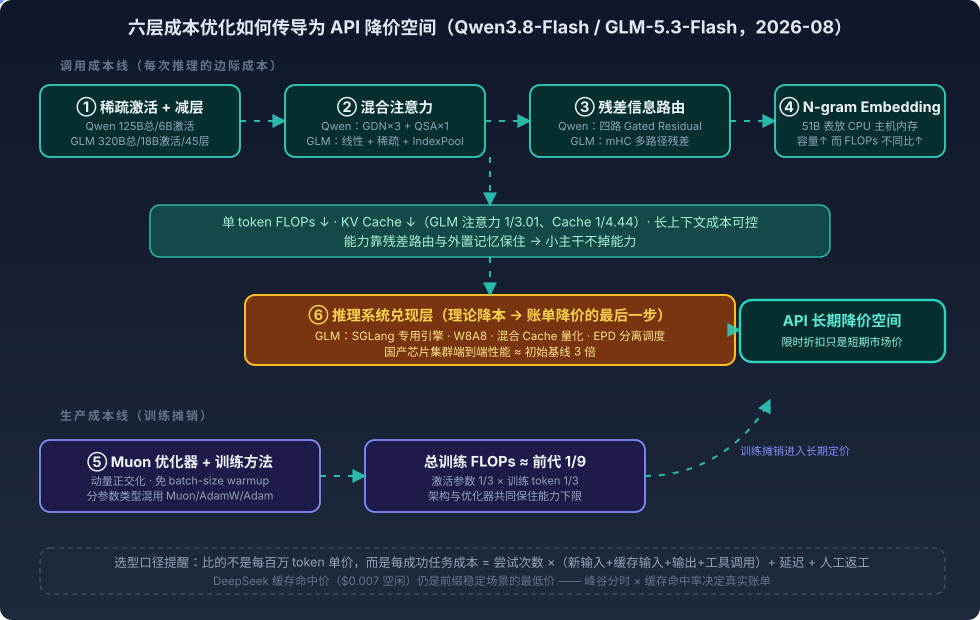

# 国内大模型新一轮架构与价格优化——Qwen3.8-Flash 与 GLM-5.3-Flash 的六层降本解剖

> 2026 年 8 月，DeepSeek 上调 V4 系列 API 价格并改用峰谷分时计费；8 月 26 日，Qwen3.8-Flash 与 GLM-5.3-Flash 同日发布，以更低单价切入 Agent 市场。表面是又一轮价格战，实质是"生产智能"的成本结构被重新设计——**厂商不再只降 token 售价，而是在减少完成任务所需的有效计算、缓存、时间和重试**。
>
> 本文按"六层降本"拆解两款 Flash 模型的架构优化如何传导为降价空间，并给出比"每百万 token 单价"更准确的选型口径：**每成功任务成本**。架构地基（GDN、Hybrid 注意力、prefix caching 失效问题）见 [[线性注意力时代的推理架构之一——Transformer-Mamba-GDN与Hybrid架构]] 及其系列；GLM 推理栈基于 SGLang 的背景见 [[SGLang与vLLM的基因之争——为什么PrefixSharing×Hybrid这条线SGLang领先]]。
>
> 素材来源：Codex 侧对 YouTube 视频《DeepSeek竟然也遭遇斩杀线》NotebookLM 转写稿的分析，关键数字已对照 Qwen / 智谱 / DeepSeek 官方技术报告与价格页核验。厂商基准不等于实际业务环境结果。

---

## 一、第一层：减少每个 token 真正经过的模型（稀疏激活 + 减层）

MoE 模型的在线推理成本核心数字是**激活参数量**，不是标称总参数：

| 模型 | 总参数 | 每 token 激活 | 层数 | 对比前代 |
|------|-------:|-------------:|-----:|---------|
| Qwen3.8-Flash-Next | ~125B（另有 51B N-gram Embedding） | ~6B | — | Qwen3.7-Plus：397B 总 / 17B 激活——激活不到前代四成 |
| GLM-5.3-Flash | ~320B | ~18B | 45 | GLM-4.5 系列：355B 总 / 32B 激活 / 92 层 |

注意一个转写稿纠错：GLM 官方比较对象是 **GLM-4.5 系列**，不是"GLM-5.2 从 92 层减到 45 层"。

传导关系：激活参数和层数减少 → 单 token 矩阵计算、专家权重读取、跨设备通信同步下降 → 单卡吞吐提高 → 相同集群承接更多请求 → **每百万 token 边际成本下降**。这是 Flash 模型能持续低价的第一层基础。

## 二、第二层：混合注意力控制长上下文成本

长上下文的注意力计算和 KV Cache 是 Agent 场景的主要成本来源——每执行一步都可能重新携带大量历史代码、文件、工具结果。两家的共同方向：**大部分层用低成本线性/状态式注意力，少部分层保留稀疏全局注意力**。

### Qwen：GDN + QSA，3:1 周期

Qwen3.8-Flash-Next 每四层一个周期：三层 Gated DeltaNet + 一层 **Qwen Sparse Attention**（QSA，不是转写稿里的"Quick Sparse Attention"）：

- **GDN**：把历史上下文压缩成固定大小的递归状态，解码时 KV Cache 不随上下文无限增长——机制细节见 [[线性注意力时代的推理架构之一——Transformer-Mamba-GDN与Hybrid架构]]（Qwen3.5 已用同路线）；
- **QSA**：轻量索引器把历史序列压成 micro-block（四倍序列压缩），块级判断相关性后只对少量重要块做核心注意力，注意力 token 预算约 2048。官方内核级数据：1M token 上下文下 Prefill 快 7.6×、Decode 快 4.9×——**这是注意力模块的内核级加速，不代表完整 API 请求同比例快**（还有 MoE、输出层、通信、调度成本）。

### GLM：线性 + 稀疏 + IndexPool

GLM-5.3-Flash 同为混合架构：线性注意力管局部连续关系，稀疏注意力管全局精确检索，IndexPool 用加权池化把四个索引器 key 向量压成一个。官方对比 GLM-5.3：**注意力计算量 1/3.01、平均 KV Cache 1/4.44**。但官方也承认 KV Cache 仍略大于 Kimi-K3 和 DeepSeek-V4-Flash，缓存效率还有优化空间。

混合注意力最大的商业价值不是让简单问题便宜几分钱，而是**让长时间运行的 Agent 不至于在后半程成本失控**。

## 三、第三层：残差信息路由——小主干保住能力的关键

残差优化的经济作用与注意力不同：它不直接省算力，而是回答"**减了层数、激活参数和全注意力之后，信息怎么不在深度中被稀释**"。

- **Qwen Gated Residual**：残差流扩展为四条并行分支，数据相关的门控决定每层从哪条分支读、读多少、写向哪些分支。分析显示其中一条分支自然形成跨大量层的长距离通路，帮早期 GDN 层的信息抵达后续全局注意力层。四路残差会增加内存流量，Qwen 用 FP8 存残差状态（相对 BF16 搬运减半）+ 内核融合来控制额外成本。
- **GLM mHC**（Manifold-Constrained Hyper-Connections）：同属多路径残差思想（扩展层间通路、学习分支读写关系、改善深层信息传播），但不是同一实现，不能混称。

它降低的是"**达到目标能力所需的模型规模**"，而不是把某个算子成本削减几倍——传导为间接降价空间。

## 四、第四层：N-gram Embedding——把记忆容量移出 GPU

51B N-gram Embedding 是 Qwen3.8-Flash-Next 最具辨识度的设计：按当前 token 及前若干 token 组成的局部序列**直接查询大型嵌入表**，而不是靠加层数/加专家来记住常见短语、代码局部模式、多语言组合。

三个特点使它"加 51B 参数却几乎不加同比例计算"：稀疏访问（每 token 只读少数表项）、确定寻址（查询位置由输入序列直接算出）、**可卸载到 CPU 主机内存**。Qwen 把它放在主干第 2 层，让主机内存预取与第 1 层计算重叠隐藏传输时间（转写稿"仅在前面一层使用"的更准确表述）。

本质是把模型容量拆成两类：需要推理组合的计算容量留在 GPU 主干，适合直接检索的局部模式容量放进廉价主机内存——**用廉价存储容量替代一部分昂贵计算容量**。局限：增加模型文件与主机内存需求、依赖 CPU-GPU 预取效率、对多步推理的提升不等同于 51B Transformer 参数，官方消融显示词表扩大后下游收益会饱和甚至波动。

## 五、第五层：Muon 与训练方法——降的是生产成本，不是调用成本

Muon 常被误解为推理加速技术，实际作用于训练阶段：对权重矩阵的动量更新做正交化。Qwen 的用法是**分参数类型混用**——Attention/GDN/MoE 专家等二维线性映射用 Muon；Embedding、输出头、MoE Router 用 AdamW；N-gram 表用不带 weight decay 的 Adam（Router 各输出维度对应不同专家、彼此独立，强行正交化反而放大早期训练波动）。

收益：更高最佳学习率、更大有效批量、更少梯度异常、**免 batch-size warmup**（视频提到预热约耗 18.8% 优化器步骤）。

**"训练开销只有前代九分之一"的正确读法**：不是 Muon 单独带来的——激活参数约前代 1/3 × 训练 token 约前代 1/3 = 总训练 FLOPs 约 1/9；Muon、Gated Residual、N-gram、混合注意力的作用是让模型在这么低的训练预算下仍保住能力。训练成本不是每次请求的边际成本，但以折旧和研发回收进入长期定价：训练便宜 → 迭代更频繁、更多小规模实验、更快出细分场景 Flash 版本。

## 六、第六层：推理系统兑现层——理论 FLOPs 降低 ≠ 账单降价

论文里省了 FLOPs，线上还要过内存带宽、芯片间通信、批处理效率、长短请求干扰、集群调度这些关。GLM-5.3-Flash 这轮最值得关注的就是把优化延伸到整个推理系统：

- 基于 **SGLang** 的专用推理引擎（呼应 [[SGLang与vLLM的基因之争——为什么PrefixSharing×Hybrid这条线SGLang领先]] 中"Hybrid 模型这条线 SGLang 领先"的判断）；
- 线性注意力与 LM Head 的节点内张量并行、ReplaySSM、W8A8 量化、INT8/FP8/BF16 混合 Cache 量化、Layer Split；
- **EPD 分离架构**：Encode（多模态编码）/ Prefill（长上下文输入）/ Decode（逐 token 生成）拆成独立工作池分别扩缩容。

国产芯片的表述要精确：GLM-5.3-Flash 以 Ox Alpha 身份匿名测试期间由数万张国产加速器承载流量，"端到端性能提升 3 倍"是**相对相同硬件上的初始推理基线**（经专用引擎+量化+调度优化后），不是比其他模型快 3 倍、也不是任意第三方部署都能复现。它证明的是：架构与硬件联合设计能把国产芯片的实际吞吐和每 token 成本拉到接近主流 NVIDIA GPU 的水平。

## 七、价格对比：低价存在，但不能全归因架构

截至 2026-08-31 的公开 API 价格（美元/百万 token）：

| 模型 | 未缓存输入 | 输出 | 缓存输入 | 备注 |
|---|---:|---:|---:|---|
| Qwen3.8-Flash | $0.16 | $0.47 | $0.016 | Qwen Cloud 价格 |
| GLM-5.3-Flash | $0.075 | $0.25 | $0.015 | **50% 限时优惠，至 2026-09-09 24:00（UTC+8）** |
| GLM-5.3-Flash 原价 | $0.15 | $0.50 | $0.03 | 优惠结束后标价 |
| DeepSeek V4 Flash 空闲 | $0.22 | $0.66 | **$0.007** | 非工作高峰 |
| DeepSeek V4 Flash 高峰 | $0.44 | $1.32 | $0.014 | 工作日 9–12 / 14–18（北京时间） |

合理的归因拆分：**架构降本决定长期价格下限；推理系统决定实际可售吞吐；限时折扣和免费额度负责短期获客；融资与份额策略决定厂商保留多少利润**。"免费承接 DeepSeek 涨价"的说法不准确——两家 API 都不是永久免费，"免费"来自新用户额度、Coding Plan、限时活动和开源权重（开源权重 ≠ 免费推理，自部署仍要付 GPU/内存/运维）。

### DeepSeek 没有全面失守：缓存命中价仍是王牌

DeepSeek 空闲时段缓存输入 $0.007，比 Qwen（$0.016）和 GLM 限时价（$0.015）都低一半。所以：

- **DeepSeek 仍可能更便宜**：多轮 Agent 复用相同 system prompt、大段代码仓库反复出现、长文档固定前缀、多用户共享知识库前缀——**prompt 结构越稳定越占优**；
- **Qwen/GLM 更可能占优**：每次大量新输入、输出多、缓存命中率低、请求集中在 DeepSeek 高峰时段、多模态/视觉 Agent、高并发。

## 八、真正该比的是每成功任务成本

以 100K 未缓存输入 + 10K 输出的任务估算单次理论费用：Qwen $0.0207、GLM 限时 $0.0100（原价 $0.0200）、DeepSeek 空闲 $0.0286、高峰 $0.0572。但便宜模型若要重试三次（$0.02×3=$0.06），就比一次做对的贵模型更贵。

$$\text{任务成本} = \text{尝试次数} \times (\text{新输入} + \text{缓存输入} + \text{输出} + \text{工具调用}) + \text{延迟成本} + \text{人工返工成本}$$

企业选型应监控：每成功任务成本、首次成功率、平均重试次数、缓存命中率、P50/P95 完成时间、工具调用成功率、人工返工时间。Qwen 官方自己也提醒：降低 reasoning effort 单轮更快，但分析不足导致失败返工，总 token 反而可能增加。

另一个间接降本维度：GLM-5.3-Flash 的原生多模态 + Computer Use 能力不降"每 token 成本"，但通过视觉闭环自验证（读截图、看渲染结果、查 PPTX/PDF 视觉效果）减少重试和人工检查，**降低"每成功任务成本"**。不过视频中的 Blender 16 小时案例只证明长时自治能力，不单独证明经济性。

## 九、六层优化速查表

| 技术维度 | 解决的问题 | 主要降低的成本 | 对降价的作用 |
|---|---|---|---|
| ① MoE 稀疏激活 + 减层 | 每 token 经过的网络太大 | 推理 FLOPs、权重读取、通信 | 最直接的长期降价基础 |
| ② 线性 + 稀疏混合注意力 | 长上下文计算与 KV Cache 膨胀 | Prefill、Decode、显存 | 使百万上下文可规模化供应 |
| ③ GR / mHC 残差路由 | 小模型 + 线性注意力掉能力 | 达到同等能力所需规模 | 间接降低训练与推理成本 |
| ④ N-gram Embedding | 知识容量依赖昂贵主干参数 | GPU 计算与显存 | 廉价主机内存扩容量 |
| ⑤ Muon 与训练方法 | 大训练不稳定、预热昂贵 | 训练 FLOPs、失败实验 | 降低研发与训练摊销 |
| ⑥ 量化 / 内核 / EPD 集群 | 理论降本无法变成线上吞吐 | 内存带宽、通信、集群利用率 | 把架构优势兑现为毛利空间 |
| （⑦ 商业因素） | 短期获客 | — | 限时折扣决定短期市场价，不持续 |

## 十、结论

Qwen 侧重**模型内部的成本重构**（6B 激活主干 + GDN/QSA + 四路 Gated Residual + 51B 主机内存 N-gram + Muon，用约 1/9 训练 FLOPs 验证 Qwen4 方向）；GLM 侧重**模型与部署系统的联合优化**（18B 激活 45 层 + 线性/稀疏 + mHC + W8A8/混合 Cache + EPD，在国产芯片集群兑现 3 倍端到端基线提升）。

这轮价格战最重要的变化：

> 模型与系统效率决定长期可持续的价格下限；限时补贴决定短期市场价格；任务成功率决定用户实际支付的总成本。

大模型价格战最终比的不是"谁的 token 最便宜"，而是"**谁能用最低的总成本，完成一个可以验收的任务**"。

## 时效性核验清单（后续更新用）

- [ ] GLM-5.3-Flash 五折优惠是否已结束（2026-09-09 后核验并更新价格表）
- [ ] Qwen Cloud 与阿里云百炼不同地区的实际价格差异
- [ ] DeepSeek 峰谷价格是否再次调整
- [ ] 第三方 Agent 实测的任务成功率 / 重试次数 / 总 token 消耗数据

## 参考

- [DeepSeek竟然也遭遇斩杀线](https://www.youtube.com/watch?v=VTBmsvOFlto)（YouTube 视频，NotebookLM 转写稿为素材基础）
- [Qwen3.8-Flash-Next 技术报告](https://github.com/QwenLM/Qwen3.8-Flash-Next/blob/main/tech_report.pdf)
- [Qwen3.8-Flash-Next 官方模型卡](https://huggingface.co/Qwen/Qwen3.8-Flash-Next-FP8)
- [Qwen3.8-Flash 官方价格](https://www.qwencloud.com/models/qwen3.8-flash)
- [GLM-5.3-Flash 官方技术说明](https://docs.z.ai/guides/vlm/glm-5.3-flash)
- [GLM 官方价格](https://docs.z.ai/guides/overview/pricing)
- [DeepSeek 官方价格](https://api-docs.deepseek.com/quick_start/pricing)
- [DeepSeek 更新记录与调价说明](https://api-docs.deepseek.com/updates)
