# VLA系列02：扩散与 Transformer 在 VLA 中的分工——动作块并行去噪与闭环重规划

> VLA系列导航：[01 VLA输出架构演进](VLA系列01：VLA输出架构演进——从动作token到扩散动作头.md) · **02（本篇）** · [03 扩散模型基础](VLA系列03：扩散模型基础——从去噪机制到高维连续多峰的选型逻辑.md) ｜ 总导读：[具身智能全景](具身智能全景：从LLM、Agent、RAG到物理世界闭环.md)

[VLA系列01](VLA系列01：VLA输出架构演进——从动作token到扩散动作头.md)讲了 VLA 为什么从动作 token 转向"扩散 + Transformer"的动作头，本篇拆开这个组合的内部：**Transformer 骨干和扩散头各自负责什么、为什么这个组合快、以及一个最容易卡住的问题——动作明明有先后因果（先转弯才能停止），怎么能"并行"生成？**

## 一、架构分工总览：一次编码 + 十步去噪

第二代 VLA（π0、Rho-alpha 等）的推理流程可以概括为一条流水线加一个闭环：



两个组件的分工：

- **VLM 骨干（数十亿参数的 Transformer）**：吃进相机帧和语言指令，做**一次前向（prefill）**，产出观测的表征（KV 缓存）。注意它在这里**不生成任何 token**——纯粹当编码器用。VLM 预训练带来的视觉语言理解能力（认识物体、理解指令、常识）全部沉淀在这份表征里。
- **动作专家（几亿参数，比骨干小一个量级）**：以观测表征为条件，跑约 10 步去噪，把一段随机噪声修正成一个**动作块（action chunk）**——比如未来 50 步的连续动作序列。每一步去噪都是把整段 50 步动作作为一组 token **并行**送进网络，attend 到缓存好的观测表征，输出修正方向。10 步每步都是一次并行前向，没有 token 间的串行依赖。

所以"扩散 + Transformer"里两者的功能是：**Transformer 负责"理解"（把多模态观测压缩成条件表征）+ 提供动作专家的网络主体（去噪网络本身也是 Transformer，靠双向注意力建模动作块内部的关联）；扩散负责"生成方式"（用迭代去噪替代自回归，一次出整段、天然表示多峰分布）。**

## 二、先澄清一个常见误解："LLM 慢"不是因为 decoder-only

理解这个架构为什么快，要先把两个经常绑在一起的概念拆开：

- **Decoder-only 是架构描述**：单个 Transformer 堆栈、因果掩码注意力（每个位置只看前面）。
- **自回归是生成方式**：一次产出一个 token，拼回输入再产出下一个。

GPT 系列两者都占，所以容易被当成一回事。拆开看：

1. **Decoder-only 不一定慢**。π0 的骨干 PaliGemma 就是 decoder-only 的 Gemma，但在 VLA 里它只做一次 prefill 当编码器，不生成 token——一点也不慢。Decoder-only 的单次前向本身是并行的，慢只出现在反复调用它逐个吐 token 的时候。
2. **非 decoder-only 也可能慢**。T5 这类 encoder-decoder，编码器一次跑完，解码器照样自回归逐 token 生成，decode 阶段和 GPT 没有本质区别。
3. **Transformer 可以不自回归地生成**。扩散语言模型（LLaDA、Inception 的 Mercury、Google 的 Gemini Diffusion）用 Transformer 一次输出整段文本的所有 token，再并行迭代修正几步——思路和动作扩散头完全一样，decode 速度比自回归快数倍。它们证明了"慢"来自生成方式，不来自架构。

再补一层自回归每步为什么慢：decode 阶段每生成一个 token，都要把全部权重从显存读一遍，却只做一个 token 的计算——算力大量空闲，瓶颈是**显存带宽**而非计算。speculative decoding、multi-token prediction 这些加速技术全都在想办法让一次权重读取多产出几个 token。

结论：**同一个 decoder-only 骨干，让它自回归吐 350 个动作 token 就慢，让它只做一次编码再交给扩散头就快。** 这就是第二代 VLA 架构的效率来源。

## 三、核心问题：动作有先后因果，怎么能并行生成？

这是这套架构最反直觉的地方。动作块内部确实有强时序依赖——第 30 步的位置必须接得上第 29 步，先转弯才能停止。但要区分两件事：

> **数据里有依赖，和必须按顺序生成，是两回事。前者是事实，后者只是一种实现选择。**

扩散用"联合满足"替代了"按顺序满足"。四个角度理解：

### 1. 图像扩散的类比

一张图里每个像素和邻居强相关——左眼右眼要对称、颜色要连续，这些依赖比动作的时序依赖只强不弱。但图像扩散**不是**从左上角逐像素生成到右下角：全图所有像素同时从噪声出发，每一步一起被修正。每个像素的修正方向都是看着周围所有像素算出来的——一致性在每一步被同时强制，然后通过十几步迭代逐渐收敛。

### 2. 动作块内部：双向注意力 + 迭代收敛

动作专家内部，50 个时间步的动作 token 用**双向注意力**——第 30 步既看得到第 29 步，也看得到第 31 步。去噪过程是这样收敛的：

- 第 1 步去噪：50 个点全是噪声，但每个点的修正方向都参考了其他所有点的当前状态和观测表征，修正把它们往"一条连贯轨迹"的方向拉；
- 中段：噪声减小，轨迹的大致形状显形——转弯在哪、停在哪已经能看出来；
- 末段：精修，抹平相邻步之间的不连续。

十步之后得到一条**整体自洁的曲线**，"先转弯后停止"的顺序自然包含在里面——因为训练数据里所有轨迹都是先转弯后停止，模型学到的分布里**不存在"先停后转"这种形状**。时序依赖没有被忽视，它被编码进了分布本身。（去噪为什么天然"由粗到细"——第一步就定下 50 步的整体形状、后面精修——其训练机制与 score 视角见[VLA系列03](VLA系列03：扩散模型基础——从去噪机制到高维连续多峰的选型逻辑.md)。）

### 3. NLP 的旁证：BERT

BERT 的掩码语言模型也是双向的。句子里的词之间语法依赖极强，但 BERT 并不按从左到右的顺序理解句子。**自回归不是捕捉序列依赖的唯一方式**，双向注意力同样能捕捉，只是它一次处理整段。

### 4. 控制论的视角：这本来就是规划的正确形状

人伸手拿杯子，不是决定第一毫秒怎么动、再决定第二毫秒——而是一次"规划"出整个动作再执行，运动神经科学里叫 motor chunking。经典机器人学的轨迹优化和 MPC（Model Predictive Control）也是把整条轨迹的所有路径点当成一组变量**联合求解**：平滑、避障、动力学约束耦合在所有点之间，迭代优化几轮收敛。扩散去噪在数学上就很像这种迭代优化——从随机初值出发，每步往"更合理的轨迹"方向走一小段。换句话说，**整段联合生成不是为了迁就并行计算的妥协，它本来就是运动规划的经典形态。**

## 四、真正的因果依赖：块间闭环重规划（receding horizon）

那"执行到一半环境变了"这种真因果怎么办？比如执行到第 20 步，前方突然出现障碍物——这依赖于新观测，生成动作块的那一刻无法预知。

这部分不靠块内并行解决，靠**块间闭环**：模型生成 50 步，只执行前 20–25 步，然后重新观测、重新生成一整块——控制领域称为 receding horizon（滚动时域）。真正的因果回路是：

```
观测 → 生成一块（并行）→ 执行一部分 → 再观测 → 生成下一块 → ……
```

这个外环运行在 1–2 Hz；块内 50 步的并行生成只是回路里的一个环节。所以完整的图景是**两层分工**：

| 依赖类型 | 满足机制 | 运行频率 |
|---|---|---|
| 块内时序依赖（先转弯后停止） | 双向注意力 + 迭代去噪，联合满足 | 一次生成（约 10 步去噪） |
| 对外部环境的因果依赖（障碍物出现） | Receding horizon 闭环重规划 | 1–2 Hz 重新观测、重新生成 |

一句话总结：**块内的时序依赖靠双向注意力加迭代去噪来联合满足，对环境变化的因果响应靠块间重规划来满足——两者分工，谁都没有被牺牲。** 还有第三种"因果"要区分——动作引起的世界后果（向左走会掉坑）：那不是动作块的内容，是世界模型的角色，展开见[VLA系列03](VLA系列03：扩散模型基础——从去噪机制到高维连续多峰的选型逻辑.md)第七节。

这个两层结构和软件 Agent 的 agent loop 惊人地同构：LLM 一次生成一整段推理 + 工具调用计划（块内），执行工具后拿到 observation 再进入下一轮（块间）。区别只在频率和代价——机器人把这个 loop 跑在了每秒一到两次、错了会撞坏东西的物理世界里。

## 参考

- [π0: A Vision-Language-Action Flow Model for General Robot Control – Physical Intelligence](https://www.physicalintelligence.company/blog/pi0)
- [Diffusion Policy: Visuomotor Policy Learning via Action Diffusion](https://diffusion-policy.cs.columbia.edu/)
- [Large Language Diffusion Models（LLaDA）](https://arxiv.org/abs/2502.09992)
- [Gemini Diffusion – Google DeepMind](https://deepmind.google/models/gemini-diffusion/)
- [rho-alpha | Azure AI Labs](https://labs.ai.azure.com/innovations/rho-alpha/)
