# VLA系列04：π0、FAST 与 Hi Robot——流匹配动作专家、频域动作分词与分层交互

> VLA系列导航：[01 VLA输出架构演进](VLA系列01：VLA输出架构演进——从动作token到扩散动作头.md) · [02 扩散与Transformer的分工](VLA系列02：扩散与Transformer在VLA中的分工——动作块并行去噪与闭环重规划.md) · [03 扩散模型基础](VLA系列03：扩散模型基础——从去噪机制到高维连续多峰的选型逻辑.md) · **04（本篇）** · [05 π0.5、知识绝缘与实时分块](VLA系列05：π0.5、知识绝缘与实时分块——开放世界泛化、梯度隔离与异步执行.md) ｜ 总导读：[具身智能全景](具身智能全景：从LLM、Agent、RAG到物理世界闭环.md)

系列 01–03 讲了 VLA 的通用架构原理：为什么动作输出从离散 token 走向连续动作头、扩散/流匹配动作头内部怎么分工。这一篇和下一篇换一个视角——**沿着一家公司的完整产品线，看这些原理在真实模型里如何落地、如何互相制约**。样本选 Physical Intelligence（PI）：它是 VLA 领域最有代表性的团队之一，π 系列从 2024 年 10 月的 π0 一路迭代到 2026 年的 π0.7，几乎每一步都对应 VLA 的一个核心问题；更重要的是 **π0、π0-FAST、π0.5 的权重与训练/推理代码已在 [openpi](https://github.com/Physical-Intelligence/openpi) 开源**，是目前少数可以直接上手复现的工业级 VLA。

本篇覆盖地基期的三个工作：**π0**（连续动作专家怎么接到 VLM 上）、**FAST / π0-FAST**（离散路线的正名与代价）、**Hi Robot**（分层交互系统）。下一篇 [VLA系列05](VLA系列05：π0.5、知识绝缘与实时分块——开放世界泛化、梯度隔离与异步执行.md) 接着讲 π0.5 的开放世界泛化、知识绝缘训练与实时分块执行。

## 一、π0：把 VLM 的知识接到连续动作上

### 1.1 双专家架构：两套权重，注意力交互

π0（2024-10）的基本形态是一个 Transformer 里装两组专家参数：

- **VLM 主干**：架构与初始化来自 Google 开源的 PaliGemma（SigLIP-400M 视觉编码器 + Gemma-2B 语言模型，约 3B 参数）。注意这些预训练权重**不是冻结调用**，而是作为可训练参数参与端到端训练——这个选择埋下了后来知识遗忘问题的伏笔（下一篇的 KI 就是为它收场）。
- **动作专家（action expert）**：一套独立的小规模权重（约 300M，Gemma 变体缩配：特征维度 1024、MLP 维度 4096），专门处理动作相关 token。推理阶段动作专家要跑多次前向（流匹配的多步积分），所以刻意做小。

架构灵感来自 Transfusion——用多个目标训练单个 Transformer：连续输出的 token 用流匹配损失监督，离散输出的 token 用交叉熵监督。π0 在此基础上给机器人专属 token（本体感知状态 + 动作）单独配了一组权重。

**两个专家怎么交互，是最容易被讲错的地方。** 一些中文解读把它描述成"固定拼接 + MLP 与 VLM 专家交互"，这是误读。按 π0 论文附录 B：两组专家权重**通过共享的 self-attention 层交换信息**——视觉语言 token 和动作 token 在注意力里互相看见，不需要额外的跨模态融合层。文中确实存在拼接和 MLP，但它们的用途是把带噪动作与 flow timestep 融合后投影进动作专家，**是输入适配器，不是专家间的交互接口**。

一个相关的术语提醒：π0 论文自己用了 experts、mixture-of-experts 的说法，但它是**按模态静态分配权重**（图文 token 走 VLM 权重、动作 token 走动作专家权重），没有 learned router、没有 top-k 竞争选择——不能按 LLM 语境里的稀疏 MoE 去理解。

### 1.2 动作生成：流匹配整块去噪，不是自回归

π0 的动作输出是**动作块（action chunk）**：一次生成 H=50 步的动作序列。生成方式是 flow matching——从整块高斯噪声出发，动作专家每步预测向量场，经约 10 步数值积分把整块噪声联合去噪成动作序列。

这里要纠正另一个常见误读："自回归地生成长度 H=50 的动作序列"。**π0 的整块动作是并行联合生成的，不存在逐 token 的自回归解码**——这正是它与后面 π0-FAST 的本质区别，也是[系列02](VLA系列02：扩散与Transformer在VLA中的分工——动作块并行去噪与闭环重规划.md)讲过的"动作有先后因果却能并行生成"的具体实例。动作专家的输出经线性投影得到的是**用于积分的向量场**，不是一次线性层直接吐出精确动作。

还有一个措辞边界值得记下：**权重分离不等于梯度隔离**。两个专家参数不同，但共享注意力下端到端联合训练，动作损失的梯度仍会传进 VLM 主干、侵蚀预训练表征。"通过权重分离避免了视觉语言任务与机器人动作任务之间的训练干扰"这种说法过强——事实是干扰真实存在，PI 后来专门发了 Knowledge Insulation 论文处理它（见下一篇）。

### 1.3 训练配方：预训练 + 后训练

π0 采用与 LLM 相似的两段式：

- **预训练**：混合数据集——OXE、DROID、Bridge 等开源数据（约占 9.1%）+ PI 自采真机数据（7 种机器人本体、68 项任务、超 1 万小时；903M 时间步，其中双臂 797M）。目标是跨任务、跨本体的通用基础模型。两组专家从未分开训练，始终作为整体端到端联合训练。
- **后训练（微调）**：用任务特定的高质量小数据集适配下游任务，最简单的任务 5 小时数据即可，复杂任务（叠衣服、移动操作）需要 100 小时以上。

这个"大杂烩预训练 + 精选数据后训练"的配方后来被 π0.5 系统化成多源异构协同训练，是 PI 路线里延续性最强的一条线。

## 二、FAST / π0-FAST：离散路线的正名

### 2.1 问题：朴素离散化卡在哪

[系列01](VLA系列01：VLA输出架构演进——从动作token到扩散动作头.md)讲过第一代 VLA（RT-2、OpenVLA）的做法：每个动作维度、每个时间步切 bin 映射成 token。这种表示在高频灵巧任务上失效——H 步 × d 维的动作块要 H·d 个 token，且相邻时间步高度相关，逐点离散化既冗长又损失连续性。于是行业转向连续动作头。但连续路线的训练开销大、收敛慢，PI 想回答的问题是：**离散自回归路线还有救吗？瓶颈到底在离散本身，还是在分词方式？**

FAST（2025-01，与 Stanford、UC Berkeley 合作）给出的答案是后者。

### 2.2 机制：DCT + BPE 的频域压缩

FAST（Frequency-space Action Sequence Tokenization）借用 JPEG 的思路压缩动作序列：

1. **DCT（离散余弦变换）**：把动作块从时域转到频域。机器人动作在时间上通常连续平滑，能量集中在低频，少量系数就能高保真表示整段信号。DCT 是解析变换，无需训练——对比需要训练的向量量化方法，这是工程上的显著优势。
2. **量化**：对 DCT 系数缩放取整，让不显著的系数归零——注意这是"保留显著系数"的有损压缩，不宜笼统说成"舍弃高频噪声"（高频里也可能有真实的动作细节，只是在压缩率与保真度的权衡里被舍弃）。
3. **BPE**：对量化后的系数序列做无损字典压缩，得到紧凑的离散 token。

三步下来，一个动作块压缩到 30–60 个 token，比朴素分 bin 约提升 10 倍压缩率。**FAST 顺带统一了语言与动作的"数据类型"**——动作变成了和文本一样的离散 token 序列，模型可以用标准 next-token prediction 训练。

### 2.3 π0-FAST：训练快 5 倍，推理慢 7 倍

用 FAST 分词器，PI 在 π0 相同架构和数据上训出了自回归版本 π0-FAST。结果把离散/连续两条路线的权衡摆得非常清楚：

- **能力**：π0-FAST 能胜任朴素分 bin 无法处理的高频灵巧任务，操作精度与流匹配版本相当——证明第一代 VLA 的瓶颈在分词方式，不在离散本身。
- **训练**：在所报告的实验中，训练速度比流匹配版本快约 5 倍（自回归 + 交叉熵的训练动态好得多——这个事实在下一篇 KI 里会再次登场）。
- **推理**：显著变慢。RTX 4090 上生成 1 秒的动作块，π0 约 100ms，π0-FAST 约 750ms。原因有二：自回归要串行解码 30–60 个 token 而流匹配只需约 10 个积分步；且自回归解码跑在 2B 的语言主干上，流匹配的多步前向跑在 300M 的动作专家上。

**读这组数字要注意口径**：100ms 和 750ms 是**动作块生成延迟**，换算成的"10 次/秒 vs 1.3 次/秒"是**最大串行推理调用速率**——它不是控制器执行动作的频率（动作块内部是 50Hz 级别的控制点），也不是重规划频率（取决于执行多少步后重新推理）。把它直接写成"π0 控制频率 10Hz、自回归 VLA 只有 1.3Hz"是常见的口径混淆，这三个频率在[机器人系统系列02](机器人系统系列02：Agent循环的物理形态——分层多频率控制回路与五个本质分野.md)的多频率控制回路框架里分属不同层。

这组权衡直接塑造了后续路线：π0.5 用"离散 token 预训练 + 流匹配后训练"把两条路线的优点串联起来，KI 再把这个组合规范化为单阶段方案——离散与连续不是替代关系，而是分工关系。

## 三、Hi Robot：系统 1 / 系统 2 的分层交互

### 3.1 问题：单指令跟随撑不住真实交互

"如果有火腿或烤牛肉，能不能为我朋友做一个包含其中一种的三明治？"——这种指令要求条件判断、上下文理解、技能组合；执行中途用户还可能插话纠正（"蹲低一点，不然你一直够不着"）。端到端 VLA 擅长的是原子指令（"拿起烤牛肉"），复杂提示和动态反馈需要更高层的推理。

Hi Robot（2025-02）的方案借 Kahneman 的双过程理论命名：**系统 2（高层推理）**处理复杂指令分解与反馈解读，**系统 1（低层执行）**负责把简单指令变成动作。

### 3.2 架构：同一个 VLM 底座，两种微调

- **高层（系统 2）**：一个 VLM（PaliGemma-3B 微调），输入基座 + 腕部摄像头图像、开放式指令和用户实时反馈，通过"自我对话"式推理把复杂任务拆解成低层可执行的短指令（"拿起切菜板"级别）。训练数据是人工标注技能片段 + VLM 合成语言指令构成的"技能-指令"对。
- **低层（系统 1）**：一个 VLA（即 π0，同样从 PaliGemma-3B 起步、加动作专家微调），接收高层输出的短指令，生成连续动作块。

两层以不同频率运行：低层高频出动作块，高层低频介入——**每约 1 秒重新推断一次，或收到新的语言反馈时立即触发**。这是[系列01](VLA系列01：VLA输出架构演进——从动作token到扩散动作头.md)结尾"planner / executor 分层"的完整真机实现，也和[机器人系统系列02](机器人系统系列02：Agent循环的物理形态——分层多频率控制回路与五个本质分野.md)的分层多频率控制回路直接对应。

一个细节的表述要谨慎：关于"低层能否输出语言响应"，Hi Robot 论文自身不同位置的表述不一致（图 2 图注说低层可选择性输出语言，但图示与训练描述把语言响应关联在高层）。稳妥的说法是**系统整体可以生成语言回应，高层负责预测后续技能/子任务**。

实测覆盖单臂、双臂、双臂移动三类平台，能稳定完成清理桌面、做三明治、超市购物等多阶段任务。

### 3.3 分层的另一面

值得思考的是：Hi Robot 是**两个模型**的分层（高层 VLM + 低层 VLA 独立微调、独立部署）。两个月后的 π0.5 走了相反方向——**把高层子任务预测和低层动作生成放进同一个模型**，推理时先输出文字子任务再条件生成动作块。分层是能力结构，不必然是部署结构；这条"合并还是拆分"的光谱在[机器人系统系列03](机器人系统系列03：角色与实现的分离——七个功能角色、合并拆分光谱与扫地机器人的演进路径.md)有系统展开，π0.5 的具体做法见[下一篇](VLA系列05：π0.5、知识绝缘与实时分块——开放世界泛化、梯度隔离与异步执行.md)。

## 四、本篇要点与常见误读清单

技术主线：

1. **π0 证明了 VLM 知识可以接到连续控制上**——双专家共享注意力、流匹配整块生成动作，代价是动作梯度会侵蚀 VLM 预训练知识（当时未解决）。
2. **FAST 证明了离散路线的瓶颈在分词而非离散本身**——频域压缩后自回归训练快 5 倍、精度与流匹配相当，但推理延迟大 7 倍。
3. **Hi Robot 证明了复杂指令跟随需要分层**——高低频两层各司其职，实时语言反馈成为一等输入。

三个工作各暴露一个未解问题，恰好构成下一篇的三个主角：泛化到真实开放环境（→ π0.5）、保护 VLM 预训练知识（→ KI）、消除推理延迟带来的执行停顿（→ RTC）。

写作中核对官方论文时集中纠正过的误读，单独列出备查：

| 常见说法 | 更准确的表述 |
|---|---|
| π0 动作专家通过固定拼接+MLP 与 VLM 交互 | 两组专家权重通过共享 self-attention 交互；拼接+MLP 是带噪动作与 flow timestep 的输入适配器 |
| π0 是稀疏 MoE | 按模态静态分配两组权重，无 learned router / top-k 选择 |
| π0 自回归生成 50 步动作 | 整块动作经多步 flow matching 数值积分**联合**生成，与 π0-FAST 的自回归解码相对 |
| 权重分离避免了训练干扰 | 权重分离≠梯度隔离，动作损失仍影响 VLM 主干（KI 因此而生） |
| π0 控制频率 10Hz、自回归 VLA 1.3Hz | 那是动作块生成延迟（100ms/750ms）换算的最大串行推理调用速率，非控制执行频率 |
| FAST 舍弃高频噪声 | DCT 系数缩放取整使不显著系数归零再 BPE 压缩；高频细节被权衡舍弃，未必是噪声 |

## 参考

**官方一手来源**：

- [π0: A Vision-Language-Action Flow Model for General Robot Control（论文）](https://www.physicalintelligence.company/download/pi0.pdf) · [官方博客](https://www.physicalintelligence.company/blog/pi0)
- [FAST: Efficient Action Tokenization for Vision-Language-Action Models（arXiv 2501.09747）](https://arxiv.org/abs/2501.09747) · [官方介绍](https://www.physicalintelligence.company/research/fast)
- [Hi Robot: Open-Ended Instruction Following with Hierarchical Vision-Language-Action Models（arXiv 2502.19417）](https://arxiv.org/abs/2502.19417)
- [openpi：π0 / π0-FAST / π0.5 开源权重与代码](https://github.com/Physical-Intelligence/openpi)

**中文解读素材**（本文写作起点，技术细节已按官方论文核查修订）：

- [PI VLA模型解读系列（一）：从π0模型到Hi Robot（机器觉醒时代）](https://mp.weixin.qq.com/s?__biz=MzUyMjc5MDIwNQ==&mid=2247491482&idx=1&sn=fd7f400138b8a7cb5572065ba7182cf0&scene=21)
