# VLA系列05：π0.5、知识绝缘与实时分块——开放世界泛化、梯度隔离与异步执行

> VLA系列导航：[01 VLA输出架构演进](VLA系列01：VLA输出架构演进——从动作token到扩散动作头.md) · [02 扩散与Transformer的分工](VLA系列02：扩散与Transformer在VLA中的分工——动作块并行去噪与闭环重规划.md) · [03 扩散模型基础](VLA系列03：扩散模型基础——从去噪机制到高维连续多峰的选型逻辑.md) · [04 π0、FAST与Hi Robot](VLA系列04：π0、FAST与Hi%20Robot——流匹配动作专家、频域动作分词与分层交互.md) · **05（本篇）** ｜ 总导读：[具身智能全景](具身智能全景：从LLM、Agent、RAG到物理世界闭环.md)

[上一篇](VLA系列04：π0、FAST与Hi%20Robot——流匹配动作专家、频域动作分词与分层交互.md)结尾留了三个未解问题：π0 只在训练见过的环境里灵巧，动作专家的梯度会侵蚀 VLM 预训练知识，数百毫秒的推理延迟让机器人在动作块边界停顿。本篇讲 PI 在 2025 年 4–6 月连续三个工作里对这三个问题的回答——**π0.5**（开放世界泛化）、**Knowledge Insulation**（知识绝缘训练）、**RTC**（实时动作分块），最后速览 2025 年 11 月之后转向经验学习的 π0.6 / π\*0.6 与 π0.7。

## 一、π0.5：没见过的房子里干活

### 1.1 泛化靠什么：数据组合，不是架构魔法

π0.5（2025-04）的宣传点是能在**训练集从未包含的真实住宅**里操控移动机械臂完成挂毛巾、整理床铺、餐具入水槽这类任务，单任务时长 10–15 分钟。支撑它的不是新架构，而是一套精心设计的**多源异构协同训练**配方：

| 数据源 | 内容 | 用在哪 |
|---|---|---|
| MM 移动机器人数据 | 约 400 小时真实家庭环境的移动机械臂数据 | 目标任务核心数据，预训练仅占 2.4% |
| ME 多环境非移动数据 | 固定单/双臂在多种家庭环境的操作数据 | 全程 |
| CE 跨本体实验室数据 | 多类型机器人 + OXE 开源数据 | 仅预训练 |
| HL 高层子任务标注 | 给操作数据人工加子任务语义标签 | 全程，支撑高层推理 |
| WD 网络多模态数据 | 图像描述、VQA、目标定位 | 全程，维持语义能力 |
| VI 语言指令演示 | 专家分步下指令遥操作机器人 | 仅后训练 |

预训练阶段 **97.6% 的数据来自非目标平台**——通用能力靠别的机器人、别的环境甚至纯网络数据堆出来，目标平台数据只负责锚定任务。消融实验证实这不是摆设：去掉 ME 或 CE 性能大幅下降；WD 对分布外物品的指令遵循尤其重要。环境数量扫描（3→104 个场景）显示各任务性能随训练环境数稳定上升。这是[落地实践系列01](落地实践系列01：数据飞轮与VITRA——把人类视频变成机器人的互联网语料.md)"数据侧才是主战场"判断在 VLA 上的直接印证。

### 1.2 训练与推理：离散预训练、连续后训练、统一分层推理

π0.5 的训练流程把上一篇 FAST 与 π0 的两条路线**串联**了起来：

- **预训练**：动作经 FAST 分词成离散 token，与文本、目标位置统一表征，标准自回归 next-token prediction——享受离散路线训练快、动态稳的好处。
- **后训练**：新增随机初始化的动作专家，用 flow matching 表征连续动作分布，同时保留 next-token prediction 目标联合训练——拿回连续路线的推理效率和动作精度。

推理时同一个模型走两步：先**高层推理**输出文字子任务（"拿起切菜板"），再以其为条件**低层生成**连续动作块。与 Hi Robot 的双模型分层不同，这里高低层住在同一套权重里。注意部署阶段的低层输出是**连续动作块**（动作专家生成），FAST 离散动作只是训练期的表征学习目标——"语言推理与离散动作输出联合优化"的说法容易让人误以为部署时在解码离散动作。

两个架构细节的准确说法（一些解读写反了）：

- **本体感知状态没有被丢弃**。π0.5 论文附录 E：本体状态被离散化后放进 VLM 的 prefix，动作专家通过注意力读取。变化的是输入位置和表示方式，模型仍以本体状态为条件生成动作——不是"动作专家彻底摒弃本体感知输入"。
- **adaptive RMSNorm 注入的是 flow timestep**，即去噪过程的时间变量 τ，不是机器人轨迹的物理时间。把它解读成"增强时序建模能力"混淆了两个时间轴；长程任务能力更多来自异构数据与高层子任务预测，不能归因于这一个归一化模块。

对照实验里，π0.5 显著优于同数据训练的 π0 和 π0-FAST+Flow 变体；去掉高层推理、或用 GPT-4 零样本充当高层，性能都明显更差——**分层推理与数据配方缺一不可**。

## 二、Knowledge Insulation：让动作学习别毁了 VLM

### 2.1 两难：微调会忘，冻结不行

把 VLM 适配成 VLA 的根本矛盾，上一篇已经埋好：随机初始化的动作专家在训练早期产生大量噪声梯度，经共享注意力回传进 VLM 主干，破坏预训练表征——语言遵循能力下降、训练效率变差。直观的解法是冻结 VLM 只训动作专家，但 VLM 从没见过机器人控制数据，冻结的特征撑不起高性能策略。微调会忘、冻结不够用，这就是 KI（2025-05）要拆的两难。

### 2.2 方案：梯度隔离 + 双目标 + 协同训练

KI 把 π0.5 的两阶段配方规范化成**单阶段**训练框架，三件事同时做：

1. **梯度隔离**：阻断动作专家的损失梯度回传到 VLM 主干。动作专家自己随便学，VLM 的参数不被它的噪声梯度打扰。
2. **双目标联合训练**：VLM 主干仍然在学动作——但走的是 FAST 离散 token 的自回归预测（训练动态好的那条路线）；连续动作专家并行用 flow matching 训练。**部署时只用连续动作专家**，离散分支纯粹是训练期给 VLM 喂动作知识的表征学习目标。
3. **多源协同训练**：机器人数据之外保留通用视觉-语言数据和高层规划数据，持续巩固语义能力。

上一篇 FAST 那组"训练快 5 倍 / 推理慢 7 倍"的不对称在这里被巧妙利用：**训练吃自回归的快，部署吃流匹配的快**，两条路线各取所长。

措辞边界：KI **不是冻结整个 VLM**（主干仍通过离散动作等 token 任务训练），也**不保证永不遗忘**——论文支持的结论是"在所测任务中改善语言遵循与语义泛化、缓解不利梯度影响"，而非"完整保留全部预训练知识"。代价方面：同时训两个输出分支使训练计算成本增加约 20%（部分被更快的收敛抵消）；语言指令遵循虽有提升但距理想仍有差距。

## 三、RTC：推理延迟下的连续执行

### 3.1 问题：动作块边界的停顿

大模型 VLA 单次推理数百毫秒，机器人控制周期几到几十毫秒。动作块（一次推理出 50 步、约 1 秒的动作）已经缓解了这个矛盾，但同步执行模式下仍有硬伤：执行完当前块 → 等模型生成新块 → 再执行。**块边界必然停顿**，破坏连贯性，"停止-重启"还会引发模型没见过的动力学突变——这正是[系列02](VLA系列02：扩散与Transformer在VLA中的分工——动作块并行去噪与闭环重规划.md)讨论的闭环重规划问题在延迟约束下的工程形态。

### 3.2 机制：把实时生成变成 inpainting

RTC（Real-Time Chunking，2025-06）的思路是**边执行边生成**：机器人执行旧块的同时，模型并行生成新块。难点在衔接——新旧块之间如果动作跳变，直接导致执行失败。RTC 的关键转化是把它变成一个**补全（inpainting）问题**：

- 推理需要时间，新块生成完毕时，旧块中对应这段时间的动作已经在执行了。新块开头与这段重叠的部分**直接冻结为旧块中已承诺的动作**——这些时间点反正已经流逝，改不了。
- 模型的任务从"生成完整新块"变成"给定冻结前缀，基于最新观测补全剩余部分"；对冻结区之后的重叠段，约束逐渐减弱——既保衔接又留响应空间。

扩散/流匹配模型天然擅长这种条件补全（即使没专门训练过），所以原版 RTC **无需重训**，可直接套在 π0、π0.5 等任何扩散/流匹配 VLA 上。代价是推理时的 guidance 有额外计算开销，且**只适用于扩散/流匹配类策略**——不能把适用范围扩大成"任意 VLA"。

### 3.3 实验与两个版本

在划火柴点蜡烛、插网线这类高精度任务上，RTC 在推理延迟超过 300ms（占预测时域 30% 以上）时仍稳定执行；所测 6 任务中完成速度比同步推理快约 20%。人为注入 +100ms / +200ms 延迟时 RTC 性能保持稳定，同步模式大幅退化，简单平均多个块输出的时间集成（TE）方法则完全失效。

措辞边界：这些结论限于**所测试的延迟范围与任务**——论文没有给出所有故障条件下无停顿的保证，也没有物理安全保证；"从根本上消除停顿""实现安全流畅的实时执行"都属于超出实验支撑的表述。

RTC 后来分化出两个版本，引用时要分清：

- **推理时 RTC**（[arXiv 2506.07339](https://arxiv.org/abs/2506.07339)，2025-06）：上述方案，无需重训，推理时 inpainting 有额外开销。
- **训练时 RTC**（[arXiv 2512.05964](https://arxiv.org/abs/2512.05964)，2025-12）：训练时模拟延迟、以动作前缀为条件，把补全能力学进模型，减少推理时开销——但**需要改训练**。两个版本的优点不能合并成"无需重训且无额外推理开销"。

### 3.4 顺手校准：VLA 的几个频率到底是多少

RTC 的动机建立在"推理慢"上，具体多慢值得较真。π0 论文附录 D 给了一组一手数字（RTX 4090、三相机）：图像编码 14ms + 观察前向 32ms + 10 次动作专家前向 27ms ≈ **本机 73ms**，离机链路再加 13ms。重规划设置：20Hz 控制的平台执行 16 步后重规划、50Hz 平台执行 25 步后重规划——即约 1.25/2Hz 的重规划频率。**这些是实验设置，不是架构上限**；动作块长度、重规划间隔、推理延迟、异步策略共同决定最终运行方式，"VLA 重规划总在 1–2Hz"不能当通则引用。

## 四、前沿速览：π0.6 / π\*0.6 与 π0.7

2025 年 11 月起，PI 的主线从"模仿学习 + 泛化"转向**真机经验的强化学习闭环**：

- **π0.6 / π\*0.6（2025-11）**：π0.6 是升级的基座模型；π\*0.6 是在其上用 **RECAP** 方法（基于优势条件策略的经验与修正强化学习）训练的版本——利用示范、人工接管纠正、自主经验与 RL 提升可靠性和吞吐量。两者**不能混称**：加了星号的才是经验强化版本。注意 RECAP 的"从经验中学习"是包含人工纠正与离线训练迭代的流程，不是部署中每步实时更新权重。
- **π0.7（2026-04）**：以更丰富的条件信号（语言、速度/质量档位、控制方式、视觉子目标）组织多来源数据，研究组合泛化、跨本体迁移与经验整合。被广泛转述的"空气炸锅实验"完整叙述是：单一零样本提示未能完成任务；逐步语言指导改善表现；随后**用这些指导数据微调了高层策略**，并结合视觉子目标自主执行——训练集中也存在少量相关片段。它展示的是"语言指导 → 微调 → 自主"的闭环效率，不是"零微调一句话学会任何新任务"。

这条 RL 主线与软件 Agent 侧的 APO→SFT→RL 阶梯（agent-lightning 系列）在方法论上高度平行：都是先把模仿/监督做扎实，再引入经验与强化信号。

## 五、收束：评估一个 VLA 该看什么

π 系列六个主要工作串下来，PI 的路线图其实是三对矛盾的循环解决：**离散与连续**（π0 vs FAST → π0.5/KI 的分工整合）、**新知识与旧知识**（动作学习 vs VLM 语义 → 梯度隔离）、**思考与行动**（推理延迟 vs 控制连续性 → RTC）。每一步都不是架构革命，而是在明确的权衡里挑了一个工程上站得住的点——这大概是 π 系列作为学习样本最有价值的地方。

最后回到落地视角（也是[落地实践系列03](落地实践系列03：分层选型决策——世界模型、VLA与空间智能的技术栈选择指南.md)选型框架的延伸）：评估任何 VLA 声明，至少把这几个维度分开问——新**环境**、新**物体**、新**技能**的泛化是三件事（π0.5 的未见住宅实验≠任意家庭任意任务）；成功率数字挂着什么任务与实验设置；错误恢复与人工介入率如何；数据成本（多少小时遥操作/多少环境）是多少。演示视频回答不了这些问题，论文的消融表可以回答一部分。

## 参考

**官方一手来源**：

- [π0.5: a Vision-Language-Action Model with Open-World Generalization（arXiv 2504.16054）](https://arxiv.org/abs/2504.16054) · [官方博客](https://www.pi.website/blog/pi05)
- [Knowledge Insulating Vision-Language-Action Models（arXiv 2505.23705）](https://arxiv.org/abs/2505.23705) · [官方介绍](https://www.pi.website/research/knowledge_insulation)
- [Real-Time Execution of Action Chunking Flow Policies（arXiv 2506.07339）](https://arxiv.org/abs/2506.07339) · [官方介绍](https://www.pi.website/research/real_time_chunking)
- [Training-Time Action Conditioning for Efficient Real-Time Chunking（arXiv 2512.05964）](https://arxiv.org/abs/2512.05964)
- [π*0.6 官方介绍](https://www.pi.website/blog/pistar06) · [π0.6 模型卡](https://website.pi-asset.com/pi06star/PI06_model_card.pdf)
- [π0.7 官方介绍](https://www.pi.website/blog/pi07)
- [openpi：π0 / π0-FAST / π0.5 开源权重与代码](https://github.com/Physical-Intelligence/openpi)

**中文解读素材**（本文写作起点，技术细节已按官方论文核查修订）：

- [PI VLA模型解读系列（二）：从π0.5模型到实时分块算法（RTC）（机器觉醒时代）](https://zhuanlan.zhihu.com/p/1996541895678137924)
