# 世界模型系列04：潜空间路线与 V-JEPA 2——预测表征而非像素、与 Qwen3-VL 的分野及潜空间验证五步法

> 世界模型系列导航：[01 四条实现路线](世界模型系列01：世界模型不是一种架构——像素、潜空间、显式3D与物理方程四条实现路线.md) · [02 与LLM的分野](世界模型系列02：世界模型与LLM的分野——动作条件化、空间持久记忆与中间件角色.md) · [03 与RL的边界](世界模型系列03：世界模型与强化学习的边界——判别三要素、脑内模拟器与特斯拉FSD的归类.md) · **04（本篇）** · [05 像素路线与Cosmos](世界模型系列05：像素路线与Cosmos——扩散与自回归双轨WFM、预训练到后训练的场景分工及全模态Cosmos%203.md) ｜ 总导读：[具身智能全景](具身智能全景：从LLM、Agent、RAG到物理世界闭环.md)

[世界模型系列01](世界模型系列01：世界模型不是一种架构——像素、潜空间、显式3D与物理方程四条实现路线.md)把潜空间列为四条实现路线之一，但只给了一段："预测像素是浪费模型容量，世界模型只需要预测决策相关的抽象量"。本篇把这条路线的旗手 **V-JEPA 2** 完整展开，回答三个层层递进的问题：

1. 它到底在预测什么？为什么"不生成任何东西"反而是设计立场？
2. 它和 Qwen3-VL 这类多模态 LLM、和 VLA 各是什么关系——是竞争还是分工？
3. 它的潜空间凭什么让人相信"编码了世界"——**latent 不是人类可读的 chain-of-thought，怎么验证它的合理性？**

前两问是[世界模型系列02](世界模型系列02：世界模型与LLM的分野——动作条件化、空间持久记忆与中间件角色.md)"世界模型与 LLM 分野"落到具体模型上的案例研究；第三问是这条路线特有的代价——像素路线的输出人眼能看、显式 3D 路线的表示本身可测量，唯独潜空间路线把"世界"藏在一堆向量里，可解释性必须专门设计实验去挣。

## 一、V-JEPA 2 在预测什么：表征，不是像素

V-JEPA 2（Video Joint Embedding Predictive Architecture 2）是 Meta FAIR 的开源工作。先把名字拆开——它的主体是 **JEPA = Joint-Embedding Predictive Architecture（联合嵌入预测架构）**，LeCun 提出的通用自监督范式；前缀标注模态版本：I-JEPA 是图像版，**V-JEPA 的 V 是 Video（视频版，不是 Vision）**，尾缀 2 是第二代。逐词对应：

| 英文 | 中文 | 含义 |
| --- | --- | --- |
| Video | 视频 | 输入模态是视频 |
| Joint Embedding | 联合嵌入 | 当前状态与未来状态在**同一个嵌入空间**里共同建模 |
| Predictive | 预测 | 预测未来的**表征**，而不是未来的像素 |
| Architecture | 架构 | 指整个"encoder + predictor"的组织范式 |

全称直译即"**第二代视频联合嵌入预测架构**"。其中"联合"最容易误读：它不是指"把视频和别的模态联合起来做 embedding"，而是指在共同的 embedding space 里学习"当前状态 ↔ 未来状态"的关系——考虑到技术含义，把 embedding 译作"表征"（视频联合表征预测架构）更达意。

它与视频生成模型的差别一句话可以说清：

- 视频生成模型：Video → 编码 → 预测未来 → **解码回未来像素**；
- V-JEPA 2：Video → 编码 → 预测未来 → **停在未来表征上，不解码**。

它不需要把未来世界重新渲染成 RGB——这正是[世界模型系列02](世界模型系列02：世界模型与LLM的分野——动作条件化、空间持久记忆与中间件角色.md)第二分野提过的 JEPA 立场：树叶怎么晃对决策毫无意义，模型容量应该花在决策相关的抽象量上。没有重建损失、没有解码器，你没法从它那里得到一张图。

### 架构：ViT 是骨架，JEPA 是范式

V-JEPA 2 的 backbone 是标准的 Video Vision Transformer（视频切成时空 patch / tubelet，进多层 self-attention），predictor 同样是 Transformer 结构。所以"JEPA 是不是一种新架构"这个问题的答案是否定的——**JEPA 和 Transformer 不在同一层面**，类比 LLM 最清楚：

| | 网络骨架 | 训练/预测范式 | 预测目标 |
| --- | --- | --- | --- |
| GPT | Transformer | 因果语言建模 | next token |
| V-JEPA 2 | Vision Transformer | Joint-Embedding Predictive | future latent representation |

同样的骨架，改变"模型到底要预测什么"，就换了一个范式。这也呼应[世界模型系列01](世界模型系列01：世界模型不是一种架构——像素、潜空间、显式3D与物理方程四条实现路线.md)的主论点：架构标签（Transformer / 扩散 / 自回归）从来不是世界模型的分类依据。

### 输入输出模态：Video → Latent，仅此而已

| | 模态 | 说明 |
| --- | --- | --- |
| 输入 | 视频 | `[B, T, C, H, W]`，官方示例取 64 帧 |
| 输出 ① | 视觉 latent | encoder 输出的时空 tokens（`last_hidden_state`） |
| 输出 ② | 预测 latent | predictor 对被遮挡区域/未来状态的预测（`predictor_output`） |
| 不输出 | 文本 | Video QA 是 V-JEPA 2 **加 LLM 对齐**后做的，不是原生能力 |
| 不输出 | RGB 视频 | 它不是视频生成模型 |

这个"仅此而已"是理解后面所有对比的锚点：**V-JEPA 2 的产品就是 latent 本身**——给下游的分类头、规划器、LLM adapter 反复调用的中间表示，而不是给人看的最终交付物（[世界模型系列02](世界模型系列02：世界模型与LLM的分野——动作条件化、空间持久记忆与中间件角色.md)第五分野"中间件角色"的极致形态）。

### 训练与开源现状

训练分两阶段：第一阶段用**超过 100 万小时互联网视频加约 100 万张图片**做自监督学习，目标是 masked latent feature prediction——遮住视频的部分时空区域，让模型在表征空间里预测被遮住的内容，全程不需要任何标注；第二阶段（V-JEPA 2-AC，见下节）才引入机器人数据。公开 checkpoint 从 ViT-L（300M）到 ViT-g（1B），主要代码 MIT 协议，已进入 Hugging Face Transformers（`facebook/vjepa2-*`）。官方仓库后续还发布了 V-JEPA 2.1（最高 2B 参数），方向是更 dense、空间时间上更一致的逐 token 表征。

工程上手路径也很清晰：`AutoModel` 拿 latent 做 feature extraction 是主用法；官方的 attentive probe 复现（Something-Something V2 动作分类、Diving48、EPIC-KITCHENS-100 动作预判）都是**冻结 backbone、只训小头**的模式——这个"frozen backbone + 轻量 head"的形态，在第五节验证方法论里会再次成为主角。

## 二、V-JEPA 2-AC：加上动作，才成为可规划的世界模型

按[世界模型系列03](世界模型系列03：世界模型与强化学习的边界——判别三要素、脑内模拟器与特斯拉FSD的归类.md)的判别三要素衡量，V-JEPA 2 本体只占了 Representation 一条半——它有很强的世界状态表征，predictor 也在做预测，但条件里没有"我"。补上这一环的是 **V-JEPA 2-AC**（Action-Conditioned）：把 V-JEPA 2 的视觉 encoder 冻结，用约 **62 小时** DROID 机器人轨迹数据做 post-training，让 predictor 接收动作和机器人状态（编码成 token 与视觉 token 拼接），学习

> zₜ + aₜ → ẑₜ₊₁

这就是教科书意义上的 latent dynamics model。有了它就能做 MPC 式规划：候选动作 A/B/C 各自推演出未来 latent，与目标状态比较，选最优执行，下一周期重来（[世界模型系列01](世界模型系列01：世界模型不是一种架构——像素、潜空间、显式3D与物理方程四条实现路线.md)"在脑子里演一遍"的潜空间版本）。官方在 Franka 机械臂上报告的零样本操作结果：

| 方法 | Reach | Grasp Cup | Pick&Place Cup | Pick&Place Box |
| --- | ---: | ---: | ---: | ---: |
| Octo | 100% | 10% | 10% | 10% |
| Cosmos | 80% | 0% | 0% | 0% |
| V-JEPA 2-AC | 100% | 60% | 80% | 50% |

这是论文特定实验设置下的结果，不应读成普遍性能排名。真正值得记住的是数据结构：**海量无标注视频学通用视觉动力学，几十小时机器人数据学动作条件化**——这个"互联网视频打底、少量真机数据对齐"的配比，正是[落地实践系列01](落地实践系列01：数据飞轮与VITRA——把人类视频变成机器人的互联网语料.md)数据飞轮论证的另一个实例。

## 三、与 Qwen3-VL 的分野：预测放在训练目标的哪个位置

把 V-JEPA 2 与 Qwen3-VL 摆在一起，最容易犯的错误是问"谁更懂视频"。先把三条计算通路画出来（第三条 VLA 见下节）：

### 先纠正一个直觉：Qwen3-VL 也会预测未来

"V-JEPA 才能预测，Qwen 只能理解"——**这个说法不成立**。给 Qwen3-VL 一段"球滚向桌边"的视频问"接下来会怎样"，它完全能靠视觉信息加语言知识加常识推理答出"球会掉下去"，还能多步推理、给出行动建议；理论上甚至能把它套进"候选动作 → 问 Qwen 后果 → 挑最好"的规划循环。Qwen3-VL 本身的能力面也宽得多：256K 上下文、长视频理解、时间定位、空间与 3D grounding、OCR、视觉 Agent 操作。如果任务就是 Video QA / 视频描述产品，直接用 Qwen3-VL，不需要 V-JEPA 2。

### 本质区别：训练数据、训练目标、表示接口

真正的分野要看两个模型各自被优化成了什么：

| | V-JEPA 2 | Qwen3-VL |
| --- | --- | --- |
| 核心定位 | 视频世界表征 / latent 世界模型基座 | 多模态 LLM |
| 主要数据 | 100 万小时级无标注视频（+ 少量机器人轨迹） | 图像、视频、文本、多模态指令与推理数据 |
| 训练目标 | 预测未来/被遮区域的 **latent 表征** | 多模态理解、语言生成、指令跟随（**next token**） |
| 预测未来的形式 | P(zₜ₊₁ \| zₜ, aₜ)——训练目标本身 | P(text \| video, question)——推理的副产品 |
| 主要输出接口 | latent（给规划器/下游模型反复调用） | text（给人或 Agent 消费） |
| 预训练是否需要语言 | 不需要 | 语言是核心组成 |

一句话概括：**两者不是"一个会预测、一个不会"，而是把"预测"放在了训练目标的不同位置**。Qwen3-VL 通过 next token 间接获得"用语言推理未来"的能力；V-JEPA 2 把"预测未来状态"直接写进 objective，换来的是一种不同的 inductive bias——模型容量集中在状态与状态之间的 dynamics 上，而不是语言表达上。

顺带澄清 benchmark：Meta 报告过 V-JEPA 2 加 LLM 对齐后在 MVP、TempCompass 等 Video QA 基准上超过若干对比模型的成绩，但那些对比对象不含 Qwen3-VL（后者是更晚一代的模型），且成绩本来就是"V-JEPA 2 + LLM"组合的功劳——**不能引用这些数字得出"V-JEPA 2 比 Qwen3-VL 强"**。Meta 自己的 CausalVQA / IntPhys 2 这类新基准反而说明了另一件事：现有视频语言模型对"发生了什么"已经不错，对"如果……会怎样 / 接下来会怎样"仍然明显吃力——这恰是 latent dynamics 路线针对的空档。

### 工程差异：高频 rollout 时 latent 才显出优势

计算范式的差别在闭环控制里被放大。Qwen3-VL 每做一次预测都要走一遍"视频 token 进 LLM 上下文 → 自回归吐字"，成本随 token 数、上下文长度、推理链长度增长；V-JEPA 2 的一次预测是一次 predictor 前向，latent 可以直接滚动（ẑₜ₊₁ 作为下一步输入继续推），MPC 里每个控制周期对上千条候选轨迹做推演的用法，只有后者的成本结构撑得住。**如果最终消费者是人，text 是对的接口；如果最终消费者是每秒调用几十次的规划器，latent 是对的接口。**

### 所以是组合，不是替换

回到具身场景，两者天然互补。扫地机器人的摄像头看到小孩把玩具放到地上、机器人正在靠近：Qwen3-VL 负责语义层——识别出"人 / 玩具 / 地板"、理解"有人放了障碍物"、必要时做任务分解；V-JEPA 2 负责动力学层——当前状态推演"继续直行会碰到玩具"；V-JEPA 2-AC 对候选动作（直行/左转/停止）各推一个未来 latent 交给规划器打分。语义理解和物理预测是两个不同层次的问题，V-JEPA 2 的 Video QA 成绩要靠对齐一个 LLM 才拿得到，这件事本身就是最好的证明。

## 四、与 VLA 的方向之别：一个消费动作，一个产生动作

V-JEPA 2 常和 VLA 一起出现在"机器人基础模型"语境里，但两者的输入输出方向正好相反：

| | 输入 | 输出 | 回答的问题 |
| --- | --- | --- | --- |
| V-JEPA 2 | Video | 世界状态 latent | 世界现在是什么状态 |
| V-JEPA 2-AC | Video + **Action** | 未来状态 latent | 如果做这个动作，世界会变成什么状态 |
| VLA | 观测 + **语言指令** | **Action** | 为完成这个任务，现在该做什么动作 |

这正是[世界模型系列01](世界模型系列01：世界模型不是一种架构——像素、潜空间、显式3D与物理方程四条实现路线.md)"与策略的分界"那张表的具体化：VLA 的条件里带着任务目标，输出直接是动作（[VLA系列01](VLA系列01：VLA输出架构演进——从动作token到扩散动作头.md)讲的动作 token / 扩散动作头都是这个输出的实现形式）；世界模型对任务中立，**动作是它的输入而非输出**——它消费动作、预测后果，不告诉你该做什么。两条对比合起来看就是 SVG 里的三条通路：Qwen3-VL 与 V-JEPA 2 的差别在**预测的形式**（text vs latent），V-JEPA 2 与 VLA 的差别在**信息流的方向**（动作进 vs 动作出）。

组合成完整技术栈时，三者各占一层：Qwen3-VL 类 VLM 做高层语义理解与任务分解，V-JEPA 2-AC 做低层的动作条件预测供规划器筛选，VLA 输出最终动作块——这与[机器人系统系列03](机器人系统系列03：角色与实现的分离——七个功能角色、合并拆分光谱与扫地机器人的演进路径.md)"角色与实现分离"的框架完全对得上：三个模型扮演三个角色，也可以（像"VLA 内含世界模型"那些揉法一样）被一组权重合并扮演。

## 五、潜空间的验证五步法：从 t-SNE 到闭环规划

潜空间路线把"世界"编码进人读不懂的向量，于是必须回答本篇开头的第三问：**latent 里到底有没有物理意义？怎么证明，而不是看 downstream accuracy 高就宣称它"理解了世界"？**

常见做法是取 latent 做 t-SNE 降维，看到聚类结构就宣布"latent 很有结构"——**这个证据很弱**：二维投影既不说明编码了哪些物理量，更不说明这些量参与了预测。可靠的做法是一套递进的验证 pipeline，每一步回答一个层次的问题：

| 步骤 | 回答的问题 | 做法要点 |
| --- | --- | --- |
| ① Linear Probe | latent 里**有没有**物理状态信息 | 冻结 encoder，只训一个线性探针去读物体位置/速度/朝向/接触状态；线性可读才算数 |
| ② Controlled Contrast | 信息是不是**分离**地编码 | 构造只差一个物理变量的视频对（球左移/静止/右移），检查 latent 距离是否与物理量单调对应 |
| ③ Latent Intervention | latent 方向有没有**因果**语义 | 沿某个方向扰动 z（z′ = z + αd），看下游状态读数是否稳定地对应"物体右移"等物理概念 |
| ④ Counterfactual Rollout | dynamics 是否**符合物理** | 同一状态施加不同动作（左推 vs 右推），各自推演未来 latent，再用①的探针读出物理后果，检查方向与幅度是否合理 |
| ⑤ Closed-loop Planning | 预测能不能**指导行动** | latent 规划 → 真实执行 → 观测 → 预测误差回收；能闭环才算世界模型在工作 |

两个方法论要点贯穿全程。**其一，探针必须弱**：如果拿一个 7B 模型当探针去读 latent，读出"物体正在左移"时无法区分是 V-JEPA 学会了还是探针自己推理出来的——所以必须 frozen encoder + 最弱可用探针，这与第一节 attentive probe 的评测形态同源。**其二，latent 误差不等于物理误差**：做 rollout 评估时不能只看 ‖ẑ − z‖，embedding 距离小不保证物理语义对，要同时报告 latent error、物体位置误差、速度误差随预测步长的增长曲线。

学界已经开始沿这条路做系统工作：2026 年有研究冻结 V-JEPA 2 encoder，用轻量探针配合互信息、Jensen–Shannon 散度、χ² 等统计量，检验 latent 分布是否真正随抓取角度、物体几何、时序运动结构等物理因素变化。按说服力分级，这套 pipeline 的①②属于**弱解释**（representation interpretability：某些维度大概对应某些物理量），③④⑤才是**强解释**（causal / mechanistic：干预 latent、改变动作，预测按物理规律可预期地变化，并最终在真实环境闭环验证）——对"世界模型"这个头衔来说，值得追求的是后者。

## 六、归纳

- **V-JEPA 2 = ViT 骨架 + JEPA 范式**：输入视频、输出 latent，不生成像素也不生成文本；预测未来表征是训练目标本身，不是推理的副产品；
- **与 Qwen3-VL 的分野不是能力高低，是预测的位置与接口**：Qwen3-VL 用 next token 把预测表达成语言（接口是 text，消费者是人/Agent），V-JEPA 2 把预测直接写进 objective（接口是 latent，消费者是高频调用的规划器）——具身系统里两者是语义层与动力学层的分工；
- **与 VLA 的差别在信息流方向**：VLA 条件里有目标、输出动作；世界模型对任务中立、消费动作预测后果——一个产生动作，一个评估动作；
- **潜空间的代价是可解释性要专门去挣**：五步验证（linear probe → controlled contrast → intervention → counterfactual rollout → closed-loop planning），探针要弱、latent 误差要对回物理误差，闭环规划才是最终判据。

放回[世界模型系列01](世界模型系列01：世界模型不是一种架构——像素、潜空间、显式3D与物理方程四条实现路线.md)的框架下定位：V-JEPA 2 把"状态表征、动力学、预测"三件事全部做在 latent 上，是潜空间路线目前最完整的开源样本；V-JEPA 2-AC 再把它推到规划入口。至于它离"理解物理世界"还有多远——重力、摩擦、刚体、因果、可供性是否真的在 latent 里，恰恰要靠第五节那套实验逐项去回答，而不是靠 benchmark 分数宣告。

> 边界说明：本文对 V-JEPA 2 / 2-AC / 2.1 的描述基于 Meta 官方论文、代码仓库与 Hugging Face 文档，对 Qwen3-VL 的描述基于其官方发布材料，信息截至 2026 年 9 月；Franka 实验数据与 Video QA 成绩均为论文特定设置下的结果，不构成横向排名。第五节引用的 latent 探针研究以讨论中提及的 2026 年工作（冻结 encoder + 统计探针检验物理结构）为据，细节以论文原文为准。

## 参考

- [V-JEPA 2 官方代码仓库 – facebookresearch/vjepa2](https://github.com/facebookresearch/vjepa2)
- [V-JEPA 2: Self-Supervised Video Models Enable Understanding, Prediction and Planning（arXiv 2506.09985）](https://arxiv.org/abs/2506.09985)
- [Introducing V-JEPA 2 – Meta AI](https://ai.meta.com/vjepa/)
- [V-JEPA 2 – Hugging Face Transformers 文档](https://huggingface.co/docs/transformers/model_doc/vjepa2)
- [Qwen3-VL – QwenLM/Qwen3-VL](https://github.com/QwenLM/Qwen3-VL)
- [A Path Towards Autonomous Machine Intelligence（LeCun, JEPA 立场文）](https://openreview.net/forum?id=BZ5a1r-kVsf)
- 两次关于 V-JEPA 2 的技术讨论（模型定位、与 Qwen3-VL/VLA 的对比、潜空间验证方法），经整理与考订成文
