# 世界模型系列05：像素路线与 Cosmos——扩散与自回归双轨 WFM、预训练到后训练的场景分工及全模态 Cosmos 3

> 世界模型系列导航：[01 四条实现路线](世界模型系列01：世界模型不是一种架构——像素、潜空间、显式3D与物理方程四条实现路线.md) · [02 与LLM的分野](世界模型系列02：世界模型与LLM的分野——动作条件化、空间持久记忆与中间件角色.md) · [03 与RL的边界](世界模型系列03：世界模型与强化学习的边界——判别三要素、脑内模拟器与特斯拉FSD的归类.md) · [04 潜空间与V-JEPA 2](世界模型系列04：潜空间路线与V-JEPA%202——预测表征而非像素、与Qwen3-VL的分野及潜空间验证五步法.md) · **05（本篇）** ｜ 总导读：[具身智能全景](具身智能全景：从LLM、Agent、RAG到物理世界闭环.md)

[世界模型系列04](世界模型系列04：潜空间路线与V-JEPA%202——预测表征而非像素、与Qwen3-VL的分野及潜空间验证五步法.md)深潜了潜空间路线的代表 V-JEPA 2，本篇补上与它成对的另一极：**像素路线**（[世界模型系列01](世界模型系列01：世界模型不是一种架构——像素、潜空间、显式3D与物理方程四条实现路线.md)的路线一）的工业化代表——NVIDIA **Cosmos**。选 Cosmos 做样本有三个理由：

1. 它是唯一在**同一个平台里把扩散和自回归两种生成范式各训了一套**的世界模型——同一份数据、同一个角色、两条技术路线的受控对照，正是理解"生成范式只是路线内部工程选择"的最好教材；
2. 它把"世界模型怎么变成产品"的答案写得最完整：**预训练世界基座 + 后训练场景专用化**的两段式，配套数据管线、tokenizer、护栏全部开源；
3. 它的家族演进（1.0 双轨 → Predict/Transfer/Reason 三线 → flow 统一 → 全模态 Cosmos 3）浓缩了像素路线这两年的全部技术走向。

## 一、定位：WFM 是平台，不是一个模型

Cosmos 的自我定义是 **World Foundation Model（WFM，世界基础模型）平台**，服务对象是 Physical AI——自动驾驶、机器人、视频分析 Agent。它的核心主张借用了 LLM 的成功公式：

> **通用预训练基座 + 少量领域数据后训练 = 各领域的专用世界模型。**

就像没人从零训一个法律 LLM，Cosmos 认为也没人应该从零训一个"仓库叉车世界模型"——先用海量互联网视频预训练一个理解通用视觉动力学的基座，再用领域数据（驾驶数据、机械臂轨迹）后训练成专用模型。为此平台打包了四类组件：**预训练 WFM**（扩散/自回归两轨）、**视频 tokenizer**（连续/离散两套）、**数据管线**（curation 工具链）、**护栏**（输入输出双侧安全过滤），全部以开放权重和源码发布。

按[世界模型系列03](世界模型系列03：世界模型与强化学习的边界——判别三要素、脑内模拟器与特斯拉FSD的归类.md)的判别三要素衡量：预训练 Cosmos 有很强的 Representation 和 Prediction（Video2World 就是给定历史帧预测未来帧），但**动作条件化要到后训练阶段才真正接入**——这是它与生俱来的平台设计：动作接口是领域相关的（方向盘转角 vs 关节角度），留给后训练。

## 二、双轨 WFM：tokenizer 是分岔点

Cosmos 1.0（2025 年 1 月 CES 发布，论文《Cosmos World Foundation Model Platform for Physical AI》）最有辨识度的设计，就是**同时发布扩散和自回归两族模型**：

| 轨 | 模型 | Tokenizer | Enhancer |
| --- | --- | --- | --- |
| Diffusion | Diffusion-7B/14B-Text2World → Video2World | CV8x8x8（连续潜变量） | PromptUpsampler-12B（文本扩写） |
| Autoregressive | Autoregressive-4B/12B → 5B/13B-Video2World | DV8x16x16（离散 token） | Diffusion-7B-Decoder（DV→CV 修复伪影） |

**分岔发生在 tokenizer**。视频先过 Cosmos Tokenizer 压缩，压成什么形式决定了后面用什么生成范式：

- **CV8x8x8**：压成**连续潜变量**（时间 8 倍、空间 8×8 倍压缩）——连续量没法逐个"预测下一个"，适合扩散式并行去噪，于是接 Diffusion WFM；
- **DV8x16x16**：用 FSQ 量化压成**离散 token**（压缩率更激进）——离散序列正是 LLM 的主场，于是接 Autoregressive WFM，像 GPT 预测下一个词一样预测下一个视频 token。

这正是[VLA系列03](VLA系列03：扩散模型基础——从去噪机制到高维连续多峰的选型逻辑.md)选型逻辑的又一次应验：**表示是连续还是离散，决定生成机制**——只不过 VLA 里争的是动作表示，这里争的是视频表示。

两轨各配一个 **Enhancer** 补短板。扩散轨的短板在输入侧：用户 prompt 太短太糙，PromptUpsampler-12B（微调的 LLM）先把它扩写成细节丰富的描述再喂给模型；自回归轨的短板在输出侧：激进的离散压缩带来模糊和伪影，Diffusion-7B-Decoder 把离散 token 重新解码到连续潜变量空间（DV8x16x16 → CV8x8x8），用一个小扩散模型把画质修回来——**自回归轨最终也要借扩散之手交付**，两种范式在同一条管线里是互补件而不是对立阵营。

对照结论也直白：**扩散轨画质与时序一致性上限更高，自回归轨延迟更低、天然逐帧交互、且能直接继承 LLM 的全套基建**（KV cache、投机解码、推理优化）。[世界模型系列01](世界模型系列01：世界模型不是一种架构——像素、潜空间、显式3D与物理方程四条实现路线.md)里"Cosmos 干脆同时提供纯自回归版和扩散版两套"说的就是这件事，本篇给出它的完整机理。

## 三、数据管线：平台的另一半

WFM 的护城河一半在数据工程。Cosmos 1.0 的预训练语料从**约 2000 万小时原始视频**提炼出**约 1 亿个高质量 clip**，管线全部工具化：镜头切分 → 质量与运动过滤（丢掉静止画面、文字滚屏）→ VLM 逐段标注 → 语义去重 → 按领域分桶（驾驶、手部操作、第一视角、自然动力学等）。这条管线后来独立成产品：**Cosmos Curator**（GPU 加速的视频 curation）和 **Cosmos Dataset Search**（向量化的场景检索，从数十亿 clip 里秒级捞出"雨天右转遇行人"这类目标场景），服务的正是后训练阶段"我只缺某类数据"的需求。

安全侧是双层**护栏（Guardrails）**：pre-Guard 在输入侧拦截有害 prompt（关键词黑名单 + 内容安全模型），post-Guard 在输出侧过滤生成视频并对人脸打码。对企业用户，这层是"能不能上生产"的门槛，与画质同等重要。

## 四、预训练与后训练：通用动力学基座 → 场景专用模型

这是 Cosmos 平台论的核心，值得单独展开。**预训练和后训练回答两个不同的问题**：

- **预训练 WFM 学的是"世界普遍怎么变"**——物体持久性、重力、流体、光影、遮挡关系这些跨领域通用的视觉动力学。任务形式只有两种：Text2World（文字 → 视频世界）和 Video2World（历史帧【+ 可选文字】→ 未来帧）。它对任何具体行业一无所知，就像预训练 LLM 不懂你的公司术语。
- **后训练 WFM 学的是"我这个场景、我这个本体（embodiment）、我这个动作空间下，世界怎么变"**——把通用基座对齐到具体的任务接口上，需要的数据量比预训练小几个量级。

官方论文给出的后训练案例正好覆盖三类典型场景：

| 后训练方向 | 输入接口 | 任务例子 | 对应行业 |
| --- | --- | --- | --- |
| **相机控制** | 历史帧 + 相机位姿轨迹 | 给一张图和一条相机路径，生成沿路径漫游的 3D 一致视频——把 WFM 变成"可导航的场景模拟器" | 虚拟拍摄、场景巡检、游戏 |
| **机器人操作** | 历史帧 + 文字指令 / 历史帧 + 动作序列 | ① 指令条件的未来视频预测（"把杯子放到架子上"→ 生成执行过程视频）；② 动作条件的逐帧预测（给关节动作，预测下一帧）——后者就是[世界模型系列01](世界模型系列01：世界模型不是一种架构——像素、潜空间、显式3D与物理方程四条实现路线.md)定义的 p(下一状态\|当前状态,动作) | 机械臂、人形机器人 |
| **自动驾驶** | 历史帧 + 自车轨迹 | 多视角（六路环视相机）联合生成：给定驾驶轨迹，生成六路时空一致的相机画面——把 WFM 变成驾驶场景的数据放大器 | AV 训练与仿真 |

三个案例共用同一个模式：**冻结或微调预训练基座，把领域的条件信号（相机位姿/文字指令/关节动作/行车轨迹)接进模型，用少量领域数据教会它这个接口**。到 2.5 时代，这套流程进一步配方化——官方 cosmos-cookbook 提供动作条件蒸馏指南和在 RoboCasa、Libero 仿真基准上后训练出的 policy 模型，"后训练"从论文章节变成了可复制的工程手册。

### 生成训练视频：像素路线最重的产品形态

后训练出的专用 WFM，生成的视频有两种截然不同的消费方式。第一种是**在线消费**：规划器/评估器拿预测结果做决策依据（[世界模型系列01](世界模型系列01：世界模型不是一种架构——像素、潜空间、显式3D与物理方程四条实现路线.md)"在脑子里演一遍"）。第二种是**离线消费——把生成的视频当训练数据**，喂给下游的 VLA、驾驶策略或感知模型。在 Cosmos 生态的实际用量里，第二种才是大头，也是像素路线相对潜空间路线的独有价值：**latent 没法给别的模型当训练语料，视频可以**。

生成训练视频解决的是具身智能最贵的问题：**有价值的数据在真实世界里稀缺、危险或昂贵**。三个典型用法——

- **稀有场景放大（corner case）**：自动驾驶最缺的是"雨夜逆光下行人突然横穿"这类样本——真实收集一条可能要百万公里，且不能主动制造。用后训练的驾驶 WFM 按文字/轨迹条件批量生成，一条 prompt 换一千条变体；
- **操作数据增广**：同一个"抓杯子"演示，让 WFM 重渲染出不同光照、材质、桌面布局、干扰物的版本——机器人策略的泛化瓶颈（[VLA系列05](VLA系列05：π0.5、知识绝缘与实时分块——开放世界泛化、梯度隔离与异步执行.md)讨论的开放世界问题）很大程度是数据多样性瓶颈；
- **Sim2Real 桥接**：仿真器输出的结构化场景（分割/深度/HDMap）由 Transfer 渲染成照片级真实的多样变体——仿真负责物理正确和标注免费，WFM 负责视觉真实，两边短板互补。

这条"数据放大器"路径要成立，有一个隐含前提：**生成的视频必须物理合理，否则是在用幻觉污染训练集**。所以 Cosmos 把 Reason（物理常识 VLM，见下节）放进管线当质检员——生成、过滤、再入库，本质是给数据飞轮（[落地实践系列01](落地实践系列01：数据飞轮与VITRA——把人类视频变成机器人的互联网语料.md)）加了一台合成增压器：真实数据训练 WFM，WFM 生成十倍的合成数据训练策略，策略上路又收集新的真实数据。

**这和 [V-JEPA 2](世界模型系列04：潜空间路线与V-JEPA%202——预测表征而非像素、与Qwen3-VL的分野及潜空间验证五步法.md) 的两段式惊人地同构**：都是海量无标注视频学通用动力学、少量领域数据接动作条件——差别只在基座输出像素还是 latent。系列04 那张 Franka 对照表里被 V-JEPA 2-AC 大幅超过的"Cosmos"，正是拿这里的像素基座去做操作规划的结果：像素路线每步预测都要"渲染整个世界"，做高频 MPC 成本高——但反过来，V-JEPA 2 的 latent 也没法给自动驾驶团队当训练数据用。**两条路线不是优劣，是用途分工：latent 服务规划，像素服务数据合成与仿真**。

## 五、三条产品线与家族演进：到全模态 Cosmos 3

2025 年 3 月 GTC 起，Cosmos 收敛成三条分工明确的产品线：

- **Predict**（预测未来）：1.0 双轨 WFM 的直系后代，给定当前世界（文字/图片/视频）预测接下来的视频；
- **Transfer**（转换世界）：ControlNet 式的空间条件生成——输入分割图、深度图、边缘、HDMap、LiDAR 点云等结构化控制信号，输出照片级真实视频。定位是 **Sim2Real 数据放大器**：仿真器出粗糙的结构化场景，Transfer 把它渲染成无数种天气、光照、材质的真实感变体，专治[落地实践系列02](落地实践系列02：自动驾驶与世界模型的路线交汇——传感器之争、数据飞轮与世界基础模型.md)讨论过的"仿真数据不够真、真实数据不够多"；
- **Reason**（理解与评判）：7B 物理常识 VLM，输入视频输出推理判断——"这个操作物理上合理吗？接下来最可能发生什么？"它既做具身系统的高层理解，也给生成数据当质检员（评判合成视频是否违反物理），在[机器人系统系列03](机器人系统系列03：角色与实现的分离——七个功能角色、合并拆分光谱与扫地机器人的演进路径.md)的角色表里同时扮演"理解"与"评估器"。

版本演进的两条主线值得记住。**其一，生成范式从双轨对照收敛到统一**：2025 年 10 月的 Predict2.5 改用 flow-based 生成（流匹配——与[VLA系列04](VLA系列04：π0、FAST与Hi%20Robot——流匹配动作专家、频域动作分词与分层交互.md)里 π0 动作专家同源的技术），一个模型统一 Text2World / Image2World / Video2World 三个任务，并直接拿 Reason1 当 text encoder——三条产品线开始互相咬合。随后是工程化收尾：2B 蒸馏版、面向边缘设备的低延迟 Edge 版、动作条件蒸馏配方。

**其二，模态从视频扩到"全模态"**：2026 年 6 月 GTC Taipei 发布的 **Cosmos 3** 用 mixture-of-transformers 架构把**语言、图像、视频、音频、动作**五种模态的理解与生成统一进单一模型——一个模型既能推理场景、生成世界、预测未来帧，也能直接输出机器人的关节角与轨迹点（Super/Nano 两档开放权重，Nano 的 policy 版在机器人操作榜单上有登顶记录）。这一步的概念意义超过工程意义：**当世界模型直接输出动作，它和 VLA 的边界就溶解了**——[世界模型系列01](世界模型系列01：世界模型不是一种架构——像素、潜空间、显式3D与物理方程四条实现路线.md)说"同一个网络换一下输入输出就换了角色"，Cosmos 3 是把预测、规划、策略多个角色揉进一组权重的最新样本（三种揉法的框架见[机器人系统系列03](机器人系统系列03：角色与实现的分离——七个功能角色、合并拆分光谱与扫地机器人的演进路径.md)）。

## 六、归纳

- **Cosmos 是像素路线的工业化样本**：WFM 平台 = 预训练基座 + tokenizer + 数据管线 + 护栏，复制 LLM 的"基座 + 后训练"公式到物理世界；
- **双轨设计是一场公开的受控实验**：tokenizer 决定范式——连续潜变量走扩散（画质上限），离散 token 走自回归（低延迟、继承 LLM 基建），Enhancer 互相补位，最终在 2.5 收敛到 flow 统一；
- **预训练学通用动力学，后训练接场景接口**：相机位姿、文字指令、关节动作、行车轨迹四种条件信号对应四类后训练任务，动作条件化在后训练阶段才接入——这是平台设计而非能力缺失；
- **与潜空间路线是用途分工**：像素路线的产品是"可看的世界"（合成数据、仿真、Sim2Real），潜空间路线的产品是"可规划的状态"；Cosmos 3 把动作输出吃进模型后，像素路线正在同时侵入 VLA 的领地。

对读到这里的技术栈选型者，Cosmos 生态恰好按工作流四段各给了一个抓手：**数据处理**（Curator / Dataset Search）、**仿真与数据合成**（Transfer + Omniverse）、**训练**（Predict 后训练配方、cosmos-cookbook）、**评估**（Reason 当物理合理性判官）——把某一段单独抽出来用，是比"端到端跑通全家桶"更现实的切入方式。

> 边界说明：本文对 Cosmos 1.0 的描述基于其官方论文与代码仓库；三条产品线与 2.5/Cosmos 3 的演进基于 NVIDIA 官方 GitHub、技术报告与发布材料，信息截至 2026 年 9 月。Cosmos 3 的架构细节（mixture-of-transformers 的具体配置）与榜单成绩以其 2026 年 6 月技术报告为准；文中数据规模（2000 万小时 / 1 亿 clip）为论文报告的量级，非精确值。

## 参考

- [Cosmos World Foundation Model Platform for Physical AI（arXiv 2501.03575）](https://arxiv.org/abs/2501.03575)
- [NVIDIA Cosmos 官方页](https://www.nvidia.com/en-us/ai/cosmos/)
- [Cosmos-Predict2.5 – nvidia-cosmos/cosmos-predict2.5](https://github.com/nvidia-cosmos/cosmos-predict2.5)
- [Cosmos-Transfer2.5 – nvidia-cosmos/cosmos-transfer2.5](https://github.com/nvidia-cosmos/cosmos-transfer2.5)
- [Cosmos Predict 2.5 & Transfer 2.5: Evolving the World Foundation Models for Physical AI – Hugging Face Blog](https://huggingface.co/blog/nvidia/cosmos-predict-and-transfer2-5)
- [Cosmos 3: Omnimodal World Models for Physical AI（NVIDIA 技术报告，2026-06）](https://research.nvidia.com/labs/cosmos-lab/cosmos3/technical-report.pdf)
- [NVIDIA Launches Cosmos 3, the Open Frontier Foundation Model for Physical AI – AIwire](https://www.hpcwire.com/aiwire/2026/06/01/nvidia-launches-cosmos-3-the-open-frontier-foundation-model-for-physical-ai)
