# 具身智能系列01：全景与技术路线——从 LLM、Agent、RAG 到物理世界闭环

> 系列导航：**01（本篇）** · [02 VLA输出架构演进](具身智能系列02：VLA输出架构演进——从动作token到扩散动作头.md) · [03 扩散与Transformer分工](具身智能系列03：扩散与Transformer在VLA中的分工——动作块并行去噪与闭环重规划.md) · [04 世界模型四条实现路线](具身智能系列04：世界模型不是一种架构——像素、潜空间、显式3D与物理方程四条实现路线.md) · [05 世界模型与LLM的分野](具身智能系列05：世界模型与LLM的分野——动作条件化、空间持久记忆与中间件角色.md) · [06 3D重建与世界模型](具身智能系列06：3D感知重建与世界模型的关系——状态与状态转移的空间智能分层栈.md) · [07 Agent+3D工具 vs 神经3D生成](具身智能系列07：3D内容生产的两条路线——Agent操作Blender与神经3D生成的分工.md) · [08 数据飞轮与VITRA](具身智能系列08：数据飞轮与VITRA——把人类视频变成机器人的互联网语料.md) · [09 硬件形态与生态地图](具身智能系列09：硬件形态与生态地图——从AGV到人形的五层拆解.md)

如果你已经做过大模型、Agent、RAG，那么理解具身智能（Embodied AI）不需要从零开始——它和软件 Agent 是同一套逻辑，只是"工具"从 API 变成了电机，"环境"从文件系统变成了真实空间。本篇做两件事：把具身智能的概念版图映射到你已有的知识框架上，再把当前的几条技术路线和瓶颈梳理清楚，为后续深入 VLA（Vision-Language-Action）架构打底。

## 一、什么是具身智能：补全 Agent 闭环的最后一段

一句话定义：**具身智能 = 让 Agent 拥有"身体"，在物理世界里完成 感知 → 理解 → 规划 → 行动 → 反馈学习 的闭环**。

行业的一个核心判断是：AI 能力的分水岭不在"会不会说"，而在"能不能做"——从建议层（给出分析和方案）进入执行回路（直接改变物理世界的状态）是一次跃迁，不是线性改善。软件 Agent 已经在数字世界完成了这次跃迁（写代码、操作浏览器、调用 API），具身智能是同一逻辑在物理世界的延伸。

图中有一个重要的概念分界：**感知、理解、规划这三段的核心能力，正是"空间智能"（Spatial Intelligence）**——李飞飞 2024 年提出的概念，指 AI 感知、理解、推理三维世界的能力，技术载体是世界模型，强调"看到就能理解"；而**行动与反馈学习这一段是具身智能补上的**，强调有身体、"交互中学习"。两者的关系是：空间智能是具身智能的认知底座（机器人得先知道哪是沙发、哪是门槛、东西被挪到哪了），具身智能是空间智能最重要的落地载体——李飞飞在 World Labs 收购机器人仿真公司 SceniX 后也明确表达过：机器人是空间智能的最佳物理载体。

## 二、概念映射：用你熟悉的 LLM / Agent / RAG 知识一一对应

| 软件 Agent 世界 | 具身智能里的对应物 | 关键差异 |
|---|---|---|
| LLM（token 预测） | VLA 模型：把"动作"当成和图像、语言并列的一种模态来预测 | 动作是连续、高频（几十 Hz）、有物理后果的，错了不能 Ctrl+Z |
| Function calling / 工具调用 | 技能原语 / 低层控制策略（抓取、放置、移动到某点） | "工具"的成功率不是 100%，需要闭环纠错 |
| RAG 的知识库 | 场景记忆 / 3D 语义地图 / 世界模型 | 知识是空间的、动态的（东西会被挪走） |
| Planner + Executor 分层 | 高层任务规划（LLM/VLM）+ 低层动作策略（VLA/控制器） | 低层不再是确定性代码，而是概率性控制模型 |
| Eval / 沙箱 | 仿真环境 / 视频世界模型 | Sim-to-real gap 是核心难题 |
| RLHF / 用户反馈 | 真机反馈、遥操作纠正后的持续学习 | 反馈信号来自物理世界，采集成本高 |
| 预训练语料（互联网文本） | 人类第一视角视频、遥操作轨迹 | 机器人真机数据极贵，是行业最大瓶颈 |
| Guardrails / 权限控制 | Bounded autonomy（边界内自主） | 物理世界的安全代价更高，人工审批节点和回退机制是硬要求 |

这张表的价值在于：具身智能的大部分工程问题，你在软件 Agent 里都见过同构版本——只是每一行的"关键差异"列，都指向同一个根源：**物理世界不可回滚、连续、有噪声、代价高**。后面所有技术路线的分化，本质上都是在回应这个根源。

## 三、五条技术主线

### 1. VLA 基础模型：把动作变成一种模态

VLA（Vision-Language-Action）是当前最受关注的主线：在 VLM（视觉语言模型）骨干上接动作输出，让同一个模型看图、听指令、直接出动作。代表工作：Google RT-2、开源的 OpenVLA、Physical Intelligence 的 π0、NVIDIA GR00T、微软从 Phi 系列派生的 [Rho-alpha](https://labs.ai.azure.com/innovations/rho-alpha/)（VLA + 触觉模态，双臂操作，支持部署中从人类遥操作反馈持续学习）。

各家的共同点是复用 VLM 的视觉语言理解能力；差异在三处：**数据来源**（遥操作 / 仿真 / 人类视频）、**模态覆盖**（纯视觉还是加触觉/力）、**跨形态迁移**（换一台不同构型的机器人要重训多少）。其中动作输出方式的演进——从离散 token 到扩散动作头——是理解 VLA 架构的关键，[系列02](具身智能系列02：VLA输出架构演进——从动作token到扩散动作头.md) 专门展开。

### 2. 世界模型：用视频生成模型当"可微分的仿真器"

思路：让模型"看见未来"——给定当前观测和一个候选动作，生成接下来会发生什么的视频/状态预测，策略就可以在"想象"中试错，而不必每次都上真机。代表：李飞飞 World Labs 的 Marble、Google Genie 系列、微软的视频世界模型工作。

用软件 Agent 的语言说：这是把"真机数据昂贵"部分转化为"仿真中规模化试错"——相当于给物理世界建了一个可以大规模并行 rollout 的 eval 沙箱。它与传统物理仿真器（MuJoCo、Isaac）的区别在于：传统仿真器靠人工建模物理规则，世界模型靠数据学出物理规律，对布料、液体、软体这类难以手工建模的对象更有潜力，但物理一致性尚不如手写仿真器可靠。

注意"世界模型"是一个角色而非一种架构，视频路线只是它的实现之一——完整的路线分类（像素/潜空间/显式 3D/物理方程）见[系列04](具身智能系列04：世界模型不是一种架构——像素、潜空间、显式3D与物理方程四条实现路线.md)，它与 LLM 范式的本质差异见[系列05](具身智能系列05：世界模型与LLM的分野——动作条件化、空间持久记忆与中间件角色.md)。

### 3. 3D 感知与空间智能：从图像到空间表征

这条线是"理解"环节的底座：Gaussian Splatting 做场景级 3D 重建，SAM 做开放词汇分割，TRELLIS 这类单图/多图生成 3D 资产的模型把物体级建模的成本降到秒级。组合起来的典型管线是：多视角图像 → 分割 → 点云 → 滤波 → 3D 语义重建——一张持续更新的"空间地图"，既是机器人的导航与操作基础，也可以理解为**空间版的 RAG 知识库**：Agent 检索的不再是文档，而是空间状态。

值得注意的是，3D / 空间拓扑理解目前仍是大模型的明显短板——语言模型对"左边第二个抽屉"、"门后面"这类空间关系的推理远弱于对文本关系的推理，这也是空间智能被单独提出来作为一个方向的原因。这条主线与世界模型的关系（状态 vs 状态转移、空间智能分层栈）见[系列06](具身智能系列06：3D感知重建与世界模型的关系——状态与状态转移的空间智能分层栈.md)；3D 内容生产上"神经生成"与"Agent 操作传统 3D 工具"两条路线的对比见[系列07](具身智能系列07：3D内容生产的两条路线——Agent操作Blender与神经3D生成的分工.md)。

### 4. 数据飞轮：三条数据来源并行

机器人领域没有互联网文本那样现成的海量语料，数据策略本身就是技术路线：

- **遥操作采集**：人戴着设备操控机器人示范，质量最高、成本也最高；
- **仿真合成**：在仿真器/世界模型中生成，规模大但有 sim-to-real gap；
- **人类视频转化**：把无标注的人类第一视角视频转成机器人可用的训练数据，代表是微软的 [VITRA](https://www.microsoft.com/en-us/research/project/vitra/)（百万级 episode、千万级帧的人手操作数据转成 VLA 预训练语料，在未见物体上取得约 70% 的零样本成功率）。

这三条路的关系类似 LLM 的"人工标注 / 合成数据 / 网络爬取"三角，行业共识是必须组合使用。VITRA 这条"人类视频转化"路线的管线拆解与复用条件，见[系列08](具身智能系列08：数据飞轮与VITRA——把人类视频变成机器人的互联网语料.md)。

### 5. 硬件形态：成熟度光谱

- **机械臂**：工业场景最成熟，结构化环境下已规模商用；
- **移动机器人**：扫地机、AGV 的导航建图已充分商品化，是"具身"程度最高的消费级品类；
- **灵巧手**：进展快但"手感"（触觉 + 力控）仍难替代人手，是操作类任务的瓶颈部件；
- **人形机器人**：关注度最高，但行业内务实派普遍认为其当前被高估——人形是形态不是能力，多数任务用更简单的形态 + 更好的智能就能完成。

完整的形态成熟度光谱（AGV 与 AMR 之辨、轮式双臂等中间形态）与本体/感知/算力/软件/数据五层生态地图，见[系列09](具身智能系列09：硬件形态与生态地图——从AGV到人形的五层拆解.md)。

## 四、行业共同的瓶颈

1. **真机数据贵**——上面数据飞轮一节的根本动机。
2. **长链条任务的错误累积**——单步成功率 95% 听起来不错，但 20 步串起来只剩 0.95^20 ≈ 36%。工业上真正难的不是"会做某个动作"，而是"长链条不出错"，这决定了异常检测与恢复机制比单点成功率更重要。
3. **实验室泛化 ≠ 现场泛化**——demo 里换个物体还能抓，产线上光照、磨损、来料波动带来的分布漂移是另一回事。
4. **安全与责任边界**——物理世界里"模型幻觉"的代价是碰撞和损坏，所以落地形态普遍是 bounded autonomy：先做信息理解与分析建议，再保留人工审核，最后才在明确边界内自动执行。这和软件 Agent 的权限模型（read-only → approval → auto-accept）完全同构。
5. **经济性**——值不值得做 = 自动化复杂度 × 投入成本 × 生命周期总量。这解释了为什么工业场景先于家庭场景跑通：边界清晰、异常可设计、安全可审计、回报明确。

## 五、系列规划

本系列第一阶段按三个主题簇推进——先建全景，再深入行动层（VLA），最后深入认知层（世界模型与 3D 空间智能）：

- **系列01（本篇）**：全景与技术路线
- **VLA 簇**：[系列02](具身智能系列02：VLA输出架构演进——从动作token到扩散动作头.md) VLA 输出架构演进——从动作 token 到扩散动作头，为什么 structured output 思路在动作输出上不成立；[系列03](具身智能系列03：扩散与Transformer在VLA中的分工——动作块并行去噪与闭环重规划.md) 扩散 + Transformer 各自负责什么、"动作有因果依赖怎么还能并行生成"
- **世界模型与空间智能簇**：[系列04](具身智能系列04：世界模型不是一种架构——像素、潜空间、显式3D与物理方程四条实现路线.md) 世界模型的四条实现路线（含视频世界模型与李飞飞 Marble 的关系）；[系列05](具身智能系列05：世界模型与LLM的分野——动作条件化、空间持久记忆与中间件角色.md) 世界模型与 LLM 的本质分野；[系列06](具身智能系列06：3D感知重建与世界模型的关系——状态与状态转移的空间智能分层栈.md) 3D 感知重建与世界模型的关系（空间智能分层栈）；[系列07](具身智能系列07：3D内容生产的两条路线——Agent操作Blender与神经3D生成的分工.md) 3D 内容生产两条路线——Agent 操作 Blender vs 神经 3D 生成

- **数据飞轮簇**：[系列08](具身智能系列08：数据飞轮与VITRA——把人类视频变成机器人的互联网语料.md) 以 VITRA 为样本拆解"人类视频转化"路线——全自动数据管线、预训练配方与复用前提
- **硬件与生态簇**：[系列09](具身智能系列09：硬件形态与生态地图——从AGV到人形的五层拆解.md) 形态成熟度光谱（AGV/AMR 之辨到人形）与本体、感知、算力、软件、数据五层生态地图

阅读顺序建议按编号：世界模型簇的架构讲解（"跨时间自回归、帧内扩散"）依赖 VLA 簇建立的扩散头概念。后续视学习进展扩展灵巧操作、空间智能落地等主题。

## 参考

- [Advancing AI for the physical world – Microsoft Research](https://www.microsoft.com/en-us/research/story/advancing-ai-for-the-physical-world/)
- [VITRA – Microsoft Research](https://www.microsoft.com/en-us/research/project/vitra/)
- [rho-alpha | Azure AI Labs](https://labs.ai.azure.com/innovations/rho-alpha/)
- [π0: A Vision-Language-Action Flow Model for General Robot Control – Physical Intelligence](https://www.physicalintelligence.company/blog/pi0)
- [OpenVLA: An Open-Source Vision-Language-Action Model](https://openvla.github.io/)
- 李飞飞关于空间智能的访谈与 World Labs 公开资料
