# 具身智能系列04：世界模型不是一种架构——像素、潜空间、显式 3D 与物理方程四条实现路线

> 系列导航：[01 全景与技术路线](具身智能系列01：全景与技术路线——从LLM、Agent、RAG到物理世界闭环.md) · [02 VLA输出架构演进](具身智能系列02：VLA输出架构演进——从动作token到扩散动作头.md) · [03 扩散与Transformer分工](具身智能系列03：扩散与Transformer在VLA中的分工——动作块并行去噪与闭环重规划.md) · **04（本篇）** · [05 世界模型与LLM的分野](具身智能系列05：世界模型与LLM的分野——动作条件化、空间持久记忆与中间件角色.md) · [06 3D重建与世界模型](具身智能系列06：3D感知重建与世界模型的关系——状态与状态转移的空间智能分层栈.md) · [07 Agent+3D工具 vs 神经3D生成](具身智能系列07：3D内容生产的两条路线——Agent操作Blender与神经3D生成的分工.md) · [08 数据飞轮与VITRA](具身智能系列08：数据飞轮与VITRA——把人类视频变成机器人的互联网语料.md) · [09 硬件形态与生态地图](具身智能系列09：硬件形态与生态地图——从AGV到人形的五层拆解.md) · [10 Agent循环的物理形态](具身智能系列10：Agent循环的物理形态——分层多频率控制回路与五个本质分野.md) · [11 角色与实现的分离](具身智能系列11：角色与实现的分离——七个功能角色、合并拆分光谱与扫地机器人的演进路径.md)

[系列01](具身智能系列01：全景与技术路线——从LLM、Agent、RAG到物理世界闭环.md)把"世界模型"列为具身智能的技术主线之一。但深入一步立刻会遇到概念混乱：**"世界模型"和"视频世界模型"是一个东西吗？李飞飞 World Labs 的世界模型又是什么架构——Transformer？扩散？还是别的？** 本篇把这团概念理清：世界模型是一个**角色**，不是一种架构，它至少有四种截然不同的实现路线。

## 一、世界模型是一个角色：预测"如果我这么做，世界会怎样"

世界模型的定义很朴素：**给定当前状态和一个动作，预测接下来世界会变成什么样**。它的作用是让 Agent 能"在脑子里演一遍"再行动。这个概念最早在强化学习里成型（Ha & Schmidhuber 2018 年的 World Models，以及后来的 Dreamer 系列），核心动机是：用一个学出来的环境模型替代真实环境去训练策略，省掉昂贵的真实交互。所谓"可微分环境代理、可直接用梯度优化策略性能"，说的就是 Dreamer 这一脉的思路。

三个容易误解的点先说清楚。

**说它是"角色"，不是因为它不完备或只算系统的一部分，而是因为它用"回答什么问题"定义，不用"长什么样"定义。** 就像软件工程里"缓存是一个角色"：Redis、Memcached、进程里的一个字典，实现完全不同，但满足"给 key 返回 value、比源头快"这个接口就是缓存。世界模型同理——满足"给状态和动作、返回下一状态"这个接口的都是。反过来更能说明问题：**同一个网络架构，换一下输入输出就换了角色**——一个 Diffusion Transformer，输入历史帧加动作、输出未来帧，是世界模型；输入当前帧加指令、输出动作块，就是策略。所以没法用架构定义世界模型，只能用它回答的问题定义。"角色是接口，模型是实现"这个视角的完整展开（整个具身系统的七角色分解）见[系列11](具身智能系列11：角色与实现的分离——七个功能角色、合并拆分光谱与扫地机器人的演进路径.md)。

**"角色"不等于"没有具体的模型"。** 任何能扮演"给状态和动作、预测下一状态"这个角色的东西都算世界模型，而扮演这个角色的确实是一个个具体的、训练出来的神经网络：Wayve 的 [GAIA-2](https://wayve.ai/thinking/gaia-2/) 是一个 84 亿参数的网络文件，Genie 3、Cosmos、V-JEPA 2、Dreamer 的 RSSM 都是可以下载运行的具体模型。所以准确的说法是：**没有一个统一架构叫世界模型，但有很多具体模型在扮演这个角色**——下文的四条路线，是这些具体模型选择用什么形式表示"状态"的不同选项，角色是同一个。

**"在脑子里演一遍"不是比喻，是字面意义上的计算过程，沙箱就是这个网络本身。** 以 MPC 式规划为例：当前状态 s，规划器随机采样 1000 条候选动作序列（每条 10 步），把每一条都喂给世界模型往前推 10 步，得到 1000 条预测轨迹，用一个评分函数（离目标多近、有没有碰撞）给每条打分，选最好那条的第一步去执行，下一个周期再来一遍——这里的"演"就是把世界模型的前向传播调用了 1000 × 10 次。Dreamer 的用法是另一种：策略在世界模型里连续"想象"几百万步来训练自己，真实世界只偶尔碰一次。两种用法里都没有独立的仿真软件——除非选的是物理方程那条路线，那时沙箱才是 MuJoCo、Isaac Sim 这种独立程序，而不是神经网络。

## 二、它在闭环里的位置：消费动作、吸收反馈，但不产生它们

把世界模型放回[系列01](具身智能系列01：全景与技术路线——从LLM、Agent、RAG到物理世界闭环.md)的"感知 → 理解 → 规划 → 行动 → 反馈学习"闭环里看，它不是循环里的某一段，而是一个**被多段共同使用的部件**：

- **感知**：世界模型通常不直接处理原始传感器数据，前面有一个编码器（视频 tokenizer、视觉编码器）把像素变成潜变量或状态——感知是它的上游，不是它本身；
- **理解**：这是它的核心之一——它内部维护的表示就是"世界现在是什么样"，包括看不见的部分（转过身去，杯子还在）；
- **规划**：这是它最主要的用途——规划器把候选动作序列喂给它，问"这样做会怎样"。没有世界模型的规划只能靠经验直觉（策略网络一步到位），有世界模型的规划可以先演几遍；
- **行动**：它不输出动作，但**动作是它的输入**——定义就是 p(下一状态 | 当前状态, 动作)，没有动作输入的"世界模型"只是一个视频预测器，李飞飞批评纯视频模型的原因之一正在这里。所以不能说它"不包括行动"，应该说它**消费动作、不产生动作**；
- **反馈**：它不执行反馈这一步，但**反馈是它学习的全部来源**——它预测下一帧是 A，真实世界给出 B，A 与 B 之差就是训练它的误差。部署后不再更新的世界模型只是静态的先验，会随环境变化而失效；持续从真实反馈里更新，才是"世界模型"这个名字里"模型"的含义。

所以它跨在"理解—规划"之间，同时向"行动"伸一只手接输入、向"反馈"伸一只手接监督。Dreamer 那类系统的做法说得最直白：策略在世界模型里想象着行动、想象着得到反馈，跑几百万步学会技能，再到真实世界里行动一次，用真实反馈修正世界模型——**世界模型是整个"行动—反馈"环的替身**，而不是排除了行动和反馈。

**编码器算不算世界模型的一部分？** 两种画法业界都有：狭义的世界模型只指"状态转移"那一块——给状态和动作、预测下一状态；广义的、也是多数论文实际实现的，是一个三件套——**编码器（观测 → 状态）+ 转移模型（状态 + 动作 → 下一状态）+ 解码器（状态 → 观测，可选）**。Dreamer 的 RSSM 明确把编码器算在世界模型里；GAIA-2 的视频 tokenizer 是单独训练的，但发布时算作系统的一部分。可以概括为：**编码器在世界模型的边界上，多数实现把它算在内**；相机驱动、多传感器同步、去噪这类工程层面的感知则不归它管。

## 三、世界模型的三条分界线：与策略、与评估器、与时间序列预测

### 1. 与策略的分界：条件里有没有目标

"下一状态"是"**接下来会发生什么**"，不是"我该做什么"。两者的区别就在条件里有没有目标：

|         | 世界模型                | 策略 / VLA           |
| ------- | ------------------- | ------------------ |
| 形式      | p(下一状态 \| 当前状态, 动作) | p(动作 \| 观测, 指令)    |
| 条件里有目标吗 | 没有——对任务完全中立         | 有                  |
| 回答的问题   | "如果我这么做，世界会变成什么样"   | "为了完成这个任务，我现在该做什么" |

任务中立意味着**同一个世界模型既能服务"拿杯子"也能服务"避开杯子"**——它理解的是规律，不是目标。说世界模型"就是对世界的理解"基本准确，更完整的说法是"**对世界如何随动作演化的理解**"。

"状态"具体是什么，取决于路线：GAIA-2 里是未来几帧的五路摄像头画面（潜变量再解码成像素），Dreamer 里是一个几百维的抽象向量（人看不懂但策略能用），显式 3D 路线里是更新后的场景几何。一个具体例子：给 GAIA-2 当前画面和"接下来 2 秒方向盘左打 0.1 弧度、保持 30 km/h"，它输出这 2 秒里五个摄像头会看到什么——前车相对位置怎么变、路沿怎么移入视野。**它不会告诉你左打对不对——那是规划器拿着预测结果去评判的事。**

还要强调：这张表区分的是**两个问题，不是两个网络——角色分离不等于模型分离**。两个角色可以由两个独立模型分别扮演（Wayve 用 GAIA-2 专做预测评估、另一个模型负责开车），也可以由同一组权重同时扮演——这正是"VLA 里包含世界模型"的准确含义（先想象再行动、联合训练共享表征、网络内规划三种揉法），展开见[系列11](具身智能系列11：角色与实现的分离——七个功能角色、合并拆分光谱与扫地机器人的演进路径.md)。

### 2. 与评估器的分界：状态包含后果，不包含评判

一个自然的追问：预测出的"下一状态"里，是不是也包含结果语义——比如成功了没有？答案是：**状态里包含"发生了什么"，不包含"这算好还是坏"**。前者是物理和语义层面的后果，属于世界模型；后者是对后果的评判，属于另一个角色。

状态可以很具体、可以带语义。抓杯子这一步之后：杯子的位置从桌面变到离桌面 3 厘米的空中、夹爪开合度 0.2、夹爪与杯壁有接触、杯子没有倾倒——"会不会碰撞"、"杯子会不会倒"、"门推了会不会开"这类物理后果都属于状态的一部分，是世界模型必须预测对的东西。在潜空间路线里这些信息以抽象特征存在，显式 3D 路线里是场景几何的更新，像素路线里就是画面里杯子被举起来了。

但"抓取成功了"这个判断不在状态里，原因是原则性的、不是设计上偷懒：世界模型对任务中立，而"成功"依赖任务——同一个预测状态"杯子被举离桌面"，对"把杯子拿起来"是成功，对"不要碰桌上的东西"是失败。所以评判必须由知道任务的角色来做：评估器、奖励模型、成功验证器（[系列11](具身智能系列11：角色与实现的分离——七个功能角色、合并拆分光谱与扫地机器人的演进路径.md)角色表里的"价值/评估器"与"验证器"），它们拿着预测状态和任务目标，输出一个分数或是否完成的标记。

容易混的原因是很多实现把它们打包在同一个网络里：Dreamer 的世界模型除了预测下一个潜状态，还带两个小头——一个预测这一步的奖励、一个预测回合是否结束。这两个头在功能上就是评估器和验证器的角色，只是借用了世界模型的表征、一起训练。所以看 Dreamer 的代码会觉得世界模型"输出了结果语义"；但一旦换任务，动力学部分可以原样复用、奖励头必须重训——这恰恰说明它们是两个角色。

### 3. 与时间序列预测的分界：条件里有没有"我"

可以这样记：**时间序列预测是"看世界"，世界模型是"看世界并知道自己碰它会怎样"**——多出来的那一半，正是从"建议层"跨进"执行回路"所需要的。

用股票价格预测做对照最清楚。时间序列模型：输入过去的价格（可能加成交量、宏观指标），输出明天的价格，比如 101.3——涨跌不是额外信息，预测值减当前价一减就得到。它的隐含假设是**你的存在不影响这个序列**：你买不买、买多少，明天的价格都是 101.3。世界模型：输入当前市场状态**加上你的动作**，输出动作之后的市场状态——它回答的问题变成"如果我现在以市价买入 50 万股，价格会变成多少、盘口会怎样、流动性会不会被我吃掉？如果我不动呢？如果我分十笔慢慢买呢？"这就是"影响"：不是市场对你的影响，是**你的动作对市场的影响**（交易里叫市场冲击 market impact）——时间序列模型根本不建模这部分，因为它的输入里没有"你"。此外世界模型的"状态"通常比一个价格宽得多：盘口深度、自己的持仓和现金、已成交多少，其中"持仓变化"一段是确定性的，"市场的反应"一段才是不确定、要学的。

两点澄清。其一，如果你是小散户、交易量对市场毫无影响，世界模型里"市场反应"那部分就退化成普通的时间序列预测，再加一个平凡的持仓账本——**世界模型的额外价值，只在你的动作真的会改变环境时才体现**。这也解释了为什么它对机器人是必需的：机器人的每个动作都在改变环境，而多数金融预测场景不是。其二，世界模型仍然不告诉你"该不该买"（见上面第 2 条分界）：买了之后价格和持仓会怎样是它的事，是赚是亏、风险能否接受是评估器的事，据此选哪个动作是规划器的事——一个完整的量化交易系统恰好能按[系列11](具身智能系列11：角色与实现的分离——七个功能角色、合并拆分光谱与扫地机器人的演进路径.md)那张角色表拆开。

所以这条分界可以写成一组对照：时间序列模型预测"**市场明天会怎样**"，世界模型预测"**我这么做之后市场会怎样**"——多出来的是"我这么做"这个条件，以及由它引出的全部后果。一个只会"看世界"的模型不知道自己的动作会改变什么，所以只能给建议；一个知道后果的模型才有资格去行动——评判好坏的能力在建议层就已经有了（LLM 很会评价方案），**缺的从来是对后果的预测**。

既然是角色，就有不同的扮演方式。按"**用什么表示世界**"，可以分成四条路线。

## 四、四条实现路线

### 路线一：像素/视频表示——"视频世界模型"

直接预测未来的画面。代表：Google 的 Genie 系列（Genie 3 已能实时交互、生成数分钟保持一致的可玩世界）、NVIDIA Cosmos（专门面向 Physical AI 的世界基础模型）、Wayve 和特斯拉给自动驾驶做的生成式仿真，OpenAI 也把 Sora 定位成"世界模拟器"。

**所以"视频世界模型"是"世界模型"的一个子类**——用"预测未来画面"的方式来实现世界模型这个角色。两个词在媒体报道里经常混用，技术上是包含关系。

架构上，主流视频世界模型的做法是：先用视频 tokenizer / VAE 把视频压缩到潜空间，再用 Diffusion Transformer（DiT）在潜空间里生成。为了做到"可交互"，它在**帧（段）与帧（段）之间是自回归的**——生成下一段之前要先看到前面已生成的段落，并把玩家或机器人的动作作为条件输入；而在**每一段内部是扩散的**——一段的所有潜变量并行去噪。

Cosmos 干脆同时提供纯自回归版和扩散版两套；Genie 1 用离散 token 加 MaskGIT 式并行解码；Genie 3 细节未公开，但已知是逐帧自回归生成并带长程记忆。如果你读过[系列03](具身智能系列03：扩散与Transformer在VLA中的分工——动作块并行去噪与闭环重规划.md)，会发现这和 VLA 动作头是**同一套原理的另一种排列组合**：Transformer 是网络，扩散是生成方式，自回归是时间维度上的组织方式。

这条路线的核心弱点是**空间与时间一致性**：转一圈回来，物体可能凭空消失、几何会漂移——因为它并没有一个"世界"，只是在预测"下一帧看起来像什么"。对机器人来说，这意味着它还不能当可靠的反馈信号。这正是李飞飞公开批评纯视频路线的理由。

### 路线二：潜空间表示——不预测像素，预测特征

不生成画面，在抽象特征空间里预测未来。旗手是 LeCun 的 JEPA 系列（V-JEPA 2 已能直接用于机器人零样本规划），Dreamer 系列的 RSSM 也在潜空间里做递推。这一派的论点很锋利：像素里的大量细节（树叶怎么晃）对决策毫无意义，**预测像素是浪费模型容量**——世界模型只需要预测决策相关的抽象量。

### 路线三：显式 3D 表示——李飞飞 World Labs 的主路线

生成一个**有几何结构的三维场景**，可以在里面走动、编辑、导出到游戏引擎。World Labs 的旗舰产品 Marble（2025 年 11 月发布）是代表：输入文本、图片、视频或全景图，输出一个持久的、可探索的 3D 场景，底层表示是 3D Gaussian Splatting，可导出成 mesh 放进 Unreal / Unity。

回答开头的问题——**Marble 不是视频世界模型**，它的关键设计是：

- **一致性不是"学出来的"，而是"由表示保证的"**——场景就在那里，你转一圈回来东西当然还在；
- 生成这个场景的模型本身是生成式的（扩散类方法生成 3D 表示，完整架构未公开），但生成完之后，"世界的动态"由渲染引擎和物理引擎负责，不由神经网络逐帧预测。

严格说，Marble 更像"**生成一张可以走进去的地图**"，而不是传统定义里"预测动作后果"的世界模型——李飞飞把"世界模型"这个词扩展成了"对世界的三维表征"。World Labs 收购机器人仿真公司 SceniX 的意图正在这里：Marble 生成 3D 世界，SceniX 接上物理仿真，把"生成世界"和"预测后果"两块拼上，机器人才能真的在里面训练和评估。

有意思的是 World Labs 自己也在两条路线之间做实验：另一条线 RTFM（Real-Time Frame Model，2025 年 10 月）反过来不构建显式 3D，用自回归扩散 Transformer 直接从带位姿的参考帧渲染新视角画面，把 3D 一致性当成学习的涌现结果，能在单张 H100 上实时跑——它更接近视频世界模型阵营，用"位姿条件 + 空间记忆"缓解一致性问题。

### 路线四：物理方程——手写的仿真器

MuJoCo、Isaac Sim、SceniX 这类物理仿真器，用手写的物理方程而不是神经网络来预测世界。严格说这是"世界模型"这个角色的**经典实现**，只是不是学出来的。行业趋势是把生成式 3D 和物理仿真拼起来（Marble + SceniX 就是这个组合），另有 4D 世界模型（如 TesserAct 类工作）尝试在 3D 表示上直接加时间维，兼顾动态预测与一致性。

## 五、四条路线的差别归纳

| 维度 | 像素（视频） | 潜空间 | 显式 3D | 物理方程 |
|---|---|---|---|---|
| 世界的表示 | 未来画面 | 抽象特征 | 几何场景（splats/mesh） | 状态变量 + 方程 |
| 一致性来源 | 靠学习 + 长上下文，天然会漂 | 不关心视觉一致性，只关心决策相关特征 | 表示本身保证 | 方程保证 |
| 动态从哪来 | 神经网络预测，端到端**可微** | 神经网络预测，**可微** | 物理引擎，一般不可微，但物理规律是硬约束 | 物理引擎，不会"穿墙" |
| 典型用途 | 多样化训练数据、视觉逼真仿真 | 规划与策略学习（在想象中训练） | 持久记忆、可编辑、可测量的场景 | 高保真训练与验证 |
| 代表 | Genie、Cosmos、Sora | JEPA / V-JEPA 2、Dreamer | Marble、OccWorld、数字孪生 | MuJoCo、Isaac、SceniX |

一句话总结：**四种路线都在回答"如果我这么做，世界会变成什么样"，只是用不同的语言描述世界——像素、特征、几何、方程。** 是 Transformer 还是扩散、是不是自回归，都只是路线内部的工程选择；下一篇[系列05](具身智能系列05：世界模型与LLM的分野——动作条件化、空间持久记忆与中间件角色.md)会进一步论证：这些生成机制层面的标签，恰恰**不是**世界模型区别于 LLM 的本质。

> 边界说明：World Labs 对 Marble 的架构细节公开很少，本文对它的描述基于其产品发布与技术博客，信息截至 2026 年年中，后续以官方更新为准。

## 参考

- [World Models（Ha & Schmidhuber, 2018）](https://worldmodels.github.io/)
- [GAIA-2: A Controllable Multi-View Generative World Model for Autonomous Driving – Wayve](https://wayve.ai/thinking/gaia-2/)
- [Genie 3: A New Frontier for World Models – Google DeepMind](https://deepmind.google/discover/blog/genie-3-a-new-frontier-for-world-models/)
- [NVIDIA Cosmos World Foundation Models](https://www.nvidia.com/en-us/ai/cosmos/)
- [Marble – World Labs](https://marble.worldlabs.ai/)
- [RTFM: Real-Time Frame Model – World Labs](https://www.worldlabs.ai/blog/rtfm)
- [V-JEPA 2 – Meta AI](https://ai.meta.com/vjepa/)
- [Mastering Diverse Domains through World Models（DreamerV3）](https://arxiv.org/abs/2301.04104)
