# 具身智能系列08：数据飞轮与 VITRA——把人类视频变成机器人的"互联网语料"

> 系列导航：[01 全景与技术路线](具身智能系列01：全景与技术路线——从LLM、Agent、RAG到物理世界闭环.md) · [02 VLA输出架构演进](具身智能系列02：VLA输出架构演进——从动作token到扩散动作头.md) · [03 扩散与Transformer分工](具身智能系列03：扩散与Transformer在VLA中的分工——动作块并行去噪与闭环重规划.md) · [04 世界模型四条实现路线](具身智能系列04：世界模型不是一种架构——像素、潜空间、显式3D与物理方程四条实现路线.md) · [05 世界模型与LLM的分野](具身智能系列05：世界模型与LLM的分野——动作条件化、空间持久记忆与中间件角色.md) · [06 3D重建与世界模型](具身智能系列06：3D感知重建与世界模型的关系——状态与状态转移的空间智能分层栈.md) · [07 Agent+3D工具 vs 神经3D生成](具身智能系列07：3D内容生产的两条路线——Agent操作Blender与神经3D生成的分工.md) · **08（本篇）** · [09 硬件形态与生态地图](具身智能系列09：硬件形态与生态地图——从AGV到人形的五层拆解.md)

[系列01](具身智能系列01：全景与技术路线——从LLM、Agent、RAG到物理世界闭环.md)的五条技术主线里，"数据飞轮"一直留着深潜的坑。本篇以微软 [VITRA](https://www.microsoft.com/en-us/research/project/vitra/) 为样本把它填上——它是"人类视频转化"这条数据路线目前最完整的公开工作，而且它的定位很值得琢磨：**它不是一个新的机器人模型架构，而是一套数据工程方法加一份预训练配方**。

## 一、问题：VLA 的数据饥渴

VLA 模型和 LLM 一样，需要海量、多样的训练数据才能泛化。但两者的数据处境天差地别：

- LLM 有互联网——万亿 token 的现成文本，爬下来就能用；
- 机器人数据只能靠遥操作一条条采：**贵、慢、场景单一**。全世界公开的机器人数据集加起来也就几百万条轨迹，覆盖的物体和环境极窄。

而互联网上其实存在海量的"准机器人数据"：人类第一视角视频（Ego4D、EPIC-KITCHENS 这类数据集），里面全是人手在真实环境里操作各种东西。问题是这些视频**无标注、无分段、无动作标签**——是机器人用不了的原始素材。

## 二、VITRA 的核心思想：把人手当作一种机器人末端执行器

先交代名字：VITRA 的官方材料没有给出逐字母的缩写展开，论文标题是 *Scalable Vision-Language-Action Model Pretraining for Robotic Manipulation with Real-Life Human Activity Videos*（MSRA 与清华合作，2025 年 10 月上 arXiv，ICRA 2026）。从名字看大概取的是 "VIdeo → TRAining" 这类意象，但这是推测，官方只把它当项目名。

它的核心思想一句话：**把人手视为一种灵巧的机器人末端执行器**，那么人类操作视频就是现成的"机器人示范"，缺的只是一条把它转换成标准格式的自动化管线。

## 三、管线拆解：从原始视频到 VLA 三要素

VITRA 构建了一条**全自动、无人工标注**的转换管线，对任意人手视频依次做：

1. **整体活动分析与切分**：自动把长视频切成原子级的手部动作片段（比如"右手拿起木块"）；
2. **语言描述生成**：为每个片段生成对应的语言指令；
3. **3D 重建**：逐帧重建手的 3D 姿态运动和相机运动。

这样每个片段就具备了 VLA 训练数据的三要素——**语言指令 + 视频帧 + 对齐的 3D 动作序列**，与现有机器人 VLA 数据格式完全对齐。用这条管线处理大量第一视角视频后，得到 **100 万个 episode、2600 万帧**的手部 VLA 数据集，物体、任务和环境的多样性远超任何现有机器人数据集。

## 四、训练配方与效果

在这个数据集上预训练一个灵巧手 VLA 模型，然后用**少量真机数据微调**——微调的关键是把机器人手的动作空间对齐到人手动作空间的一个子集。效果上有三点值得记：

1. **零样本泛化**：预训练后的模型在完全没见过的真实环境里，能零样本预测人手该怎么动；
2. **保留了 VLM 的通用理解并能直接转成动作**：论文设计了一个巧妙的测试——让模型"拿起某位名人/某个地标/某个 emoji 的图片"，用手移动的方向当选择题答案。模型能认出这些**从未在动作数据里出现过**的概念，说明预训练没有磨掉骨干的通用视觉理解（这正是[系列02](具身智能系列02：VLA输出架构演进——从动作token到扩散动作头.md)讲的 VLA 复用 VLM 知识的价值）；
3. **超过基线且有清晰的 scaling 曲线**：真机灵巧操作任务上，尤其在未见过的物体和背景上，成功率显著超过 π0、VPP 以及在传统机器人数据集 OXE 上预训练的基线；且预训练视频数据越多、越多样，真机成功率越高——**数据规模换泛化能力的 scaling law 在这条路线上成立**。

## 五、准确定位：一套可复用的数据工程方法

VITRA 的贡献可以拆成三份，而且 Code / Model / Data 都已开源：

1. **数据转换管线**——"怎么把手里的视频变成训练数据"的方法本身；
2. **预训练配方**——在转换数据上怎么训、怎么用少量真机数据做动作空间对齐微调；
3. **经验结论**——人类视频数据比传统机器人数据集更有效，且规模与多样性越大越好。

想复用这条路线，有四个前提条件要先对清楚：

- **视角**：管线假设第一视角视频（头戴/胸挂相机），手部清晰可见、相机运动可估计——因为它要重建"手相对相机的 3D 运动"再对齐到机器人相机坐标系。固定第三视角摄像头（家用/安防摄像头的形态）原理上也能做 3D 手部重建，但视角、遮挡、距离都和论文设定不同，**需要适配，不能直接套**；
- **规模**：价值来自百万级 episode 覆盖的物体和场景广度，几百段视频跑一遍管线意义不大；
- **最后一公里**：人类视频只解决预训练，落地仍需少量真机数据微调；
- **合规**：它处理的是人的活动视频，是隐私敏感度最高的一类数据——谁的数据、什么授权、在哪训练，都必须先有框架。

## 六、放回图谱：数据飞轮三条路里的位置

[系列01](具身智能系列01：全景与技术路线——从LLM、Agent、RAG到物理世界闭环.md)讲过数据飞轮的三条路：遥操作采集（质量最高、最贵）、仿真合成（规模大、有 sim-to-real gap，[系列07](具身智能系列07：3D内容生产的两条路线——Agent操作Blender与神经3D生成的分工.md)讲的 Agent 批量造仿真场景服务于此）、人类视频转化。VITRA 把第三条路从"想法"做成了"带开源工具链的可复现方法"。

它的战略含义可以用 LLM 的历史来对照：**LLM 的成功靠的是万亿 token 的网络文本；VITRA 的主张是——人类视频就是机器人的网络文本，关键是要有一条自动化的"分词器"把它变成模型能吃的格式。** 如果这个类比成立，那么手握海量真实生活视频的一方（可穿戴设备、智能摄像头、内容平台），在具身智能时代就坐在一座还没被开采的语料矿上——前提是先解决视角适配和合规这两道门槛。

## 参考

- [VITRA – Microsoft Research 项目页](https://www.microsoft.com/en-us/research/project/vitra/)
- [Scalable Vision-Language-Action Model Pretraining for Robotic Manipulation with Real-Life Human Activity Videos（论文入口见项目页）](https://www.microsoft.com/en-us/research/project/vitra/)
- [VITRA Redefines VLA Pre-training Paradigms via Human Video Reconstruction – Microsoft Research](https://www.microsoft.com/en-us/research/story/advancing-ai-for-the-physical-world/)
- [Ego4D: Around the World in 3,000 Hours of Egocentric Video](https://ego4d-data.org/)
- [Open X-Embodiment（OXE）](https://robotics-transformer-x.github.io/)
