# 具身智能系列09：硬件形态与生态地图——从 AGV 到人形的五层拆解

> 系列导航：[01 全景与技术路线](具身智能系列01：全景与技术路线——从LLM、Agent、RAG到物理世界闭环.md) · [02 VLA输出架构演进](具身智能系列02：VLA输出架构演进——从动作token到扩散动作头.md) · [03 扩散与Transformer分工](具身智能系列03：扩散与Transformer在VLA中的分工——动作块并行去噪与闭环重规划.md) · [04 世界模型四条实现路线](具身智能系列04：世界模型不是一种架构——像素、潜空间、显式3D与物理方程四条实现路线.md) · [05 世界模型与LLM的分野](具身智能系列05：世界模型与LLM的分野——动作条件化、空间持久记忆与中间件角色.md) · [06 3D重建与世界模型](具身智能系列06：3D感知重建与世界模型的关系——状态与状态转移的空间智能分层栈.md) · [07 Agent+3D工具 vs 神经3D生成](具身智能系列07：3D内容生产的两条路线——Agent操作Blender与神经3D生成的分工.md) · [08 数据飞轮与VITRA](具身智能系列08：数据飞轮与VITRA——把人类视频变成机器人的互联网语料.md) · **09（本篇）** · [10 Agent循环的物理形态](具身智能系列10：Agent循环的物理形态——分层多频率控制回路与五个本质分野.md) · [11 角色与实现的分离](具身智能系列11：角色与实现的分离——七个功能角色、合并拆分光谱与扫地机器人的演进路径.md) · [12 扩散模型基础](具身智能系列12：扩散模型基础——从去噪机制到高维连续多峰的选型逻辑.md) · [13 世界模型与RL的边界](具身智能系列13：世界模型与强化学习的边界——判别三要素、脑内模拟器与特斯拉FSD的归类.md) · [14 自动驾驶与世界模型的路线交汇](具身智能系列14：自动驾驶与世界模型的路线交汇——传感器之争、数据飞轮与世界基础模型.md)

[系列01](具身智能系列01：全景与技术路线——从LLM、Agent、RAG到物理世界闭环.md)的五条主线里，"硬件形态"只给了一个成熟度光谱的速写。本篇把它展开成两张地图：一张**形态成熟度光谱**（回答"AGV 是什么、各种形态处在什么阶段"），一张**生态五层地图**（回答"这个产业由哪些玩家、按什么结构组成"）。信息截至 2026 年年中——这个领域变化很快，两张图的价值在于建立坐标系，具体玩家名单会持续变动。

## 一、先回答 AGV 是什么：一部"从沿轨道走到自己找路走"的演进史

**AGV = Automated Guided Vehicle，自动导引车**。工厂和仓库里搬运物料的无人小车，上世纪 50 年代就出现了，靠地面埋的磁条、二维码或反光板来"导引"，只能沿固定路线走，遇到障碍就停下等。它是移动机器人里**最早商用、规模最大**的一类——亚马逊仓库里顶着货架跑的橙色小车（Kiva）就是典型。

与它相对的是 **AMR（Autonomous Mobile Robot，自主移动机器人）**：不靠地面标记，用激光雷达和视觉做 SLAM 建图定位，自己规划路径、绕开障碍物。两者的区别一句话：**AGV 沿轨道走，AMR 自己找路走**。近几年行业把两者统称移动机器人，AGV 正逐步向 AMR 演进。

这里有一个容易被忽略的事实：**扫地机器人在技术上就是一台消费级 AMR**——激光雷达建图、路径规划、避障、自主回充，和仓库里的 AMR 是同一套技术栈，只是尺寸小、成本低、任务单一。做扫地机的厂商，本质上已经在移动机器人赛道里了。

## 二、形态成熟度光谱：越靠左越"无聊"但越赚钱

把所有形态放到一条"商用成熟度"的轴上，比逐个罗列更能看清格局：

这张光谱有三个读法：

1. **左端（已规模商用）**：AGV、工业机械臂、AMR/扫地机、协作臂——共同点是**边界清楚**：固定路线、结构化工位、单一任务。它们不需要通用智能就已经赚钱，这正是[系列01](具身智能系列01：全景与技术路线——从LLM、Agent、RAG到物理世界闭环.md)讲的"经济性决定落地顺序"。
2. **中段（落地爬坡）**：轮式双臂（移动底盘 + 两条臂，不做腿）是当前工业落地最务实的形态——它绕开了双足行走这个最难也最没必要的问题；四足在巡检场景起量；灵巧手是这一段的**瓶颈部件**——"手感"（触觉 + 力控）短期难以替代人手。
3. **右端（研究前沿）**：人形关注度最高，但行业务实派普遍认为被高估——人形是形态不是能力，光谱上越往右，动作空间越复杂、数据越贵、跨形态迁移成本越高。**形态的选择本质上是数据策略的选择**：一个形态上采的数据换到另一个形态基本作废，这就是"与机械结构无关的潜在动作空间"（LatBot 这类工作）试图解决的问题。

## 三、生态五层地图：本体、感知、算力、软件、数据

产业生态按"谁给谁供货"可以切成五层，从下往上，**下层支撑上层、地基决定上限**：

按层读这张图：

- **本体层**是形态光谱的产业化对应：机械臂有"工业四大家族"（FANUC、ABB、KUKA、安川——精度高但生态封闭）和协作臂阵营（UR、Franka、节卡、遨博——研究与轻工业主力）；**低成本研究臂**（松灵 Piper、UFactory xArm、开源 SO-100）几千到几万元，已成 VLA 研究者的标配；人形则是国产（宇树、智元、傅利叶、银河通用等）在成本上大幅领先海外（Tesla Optimus、Figure、Atlas）。
- **感知层**里注意消费与工业的分叉：工业用禾赛/速腾的多线激光雷达和 RealSense 深度相机，扫地机用的是低成本单线 LDS；触觉传感器（GelSight 的视触觉方案、帕西尼等）是灵巧操作的关键增量——Rho-alpha 的触觉模态用的就是这类。
- **算力层**：NVIDIA Jetson Orin 是机器人边缘算力的事实标准（新一代 Thor 面向人形），而大量扫地机跑在国产瑞芯微 RK3588 上——同一层里两套生态用的是完全不同的芯片。
- **软件层**：中间件几乎被 ROS 2 统一；仿真是 NVIDIA Isaac Sim/Lab、MuJoCo、Genesis、SAPIEN 的天下（对应[系列04](具身智能系列04：世界模型不是一种架构——像素、潜空间、显式3D与物理方程四条实现路线.md)的"物理方程路线"）；开源模型生态（Hugging Face LeRobot、OpenVLA、π0 开源版）与商业模型（NVIDIA GR00T N1、微软 Rho-alpha 上 Foundry）并行。
- **数据层**是最深的护城河：遥操作设备（ALOHA 双臂主从、Gello、VR 方案）、公开数据集（Open X-Embodiment、DROID、AgiBot World、EgoDex），以及[系列08](具身智能系列08：数据飞轮与VITRA——把人类视频变成机器人的互联网语料.md)讲的 VITRA 正在开辟的人类视频新矿。

## 四、三个跨层观察

**1. 形态选择决定数据能否复用。** 本体层的选择直接锁死数据层的资产价值——人形、双臂、单臂、移动底盘的动作空间完全不同。这条产业逻辑把光谱图和生态图串了起来：为什么大家在乎跨形态迁移，因为不解决它，每换一种形态就要把最贵的数据资产重挣一遍。

**2. 消费机器人和工业机器人几乎是两套独立生态。** 五层图里的颜色分区说的就是这件事：扫地机供应链（石头、科沃斯、追觅、云鲸）用瑞芯微芯片 + 低成本 LDS，追求成本和可靠性；工业与研究生态围绕 NVIDIA + ROS 2 + 协作臂。一家消费厂商要往"家庭多品类机器人"扩展，核心工程挑战是**向工业/研究生态借技术，但要在消费生态的成本约束下落地**——这不是单点技术问题，而是跨生态的系统工程问题。

**3. 国产硬件的成本优势正在改变研究范式。** 宇树把人形做到几万元、松灵把研究臂做到几千元之后，VLA 研究的真机门槛大幅下降——这直接解释了为什么近两年研究机构能做大量真机实验、为什么 SO-100 + LeRobot 这样的开源组合能形成社区。硬件降价是这一轮具身智能研究热度的隐形推手。

## 参考

- [Hugging Face LeRobot](https://github.com/huggingface/lerobot)
- [Open X-Embodiment](https://robotics-transformer-x.github.io/)
- [NVIDIA Isaac GR00T](https://developer.nvidia.com/isaac/gr00t)
- [ALOHA: A Low-cost Open-source Hardware System for Bimanual Teleoperation](https://tonyzhaozh.github.io/aloha/)
- [rho-alpha | Azure AI Labs](https://labs.ai.azure.com/innovations/rho-alpha/)
