# 具身智能系列10：Agent 循环的物理形态——分层多频率控制回路与五个本质分野

> 系列导航：[01 全景与技术路线](具身智能系列01：全景与技术路线——从LLM、Agent、RAG到物理世界闭环.md) · [02 VLA输出架构演进](具身智能系列02：VLA输出架构演进——从动作token到扩散动作头.md) · [03 扩散与Transformer分工](具身智能系列03：扩散与Transformer在VLA中的分工——动作块并行去噪与闭环重规划.md) · [04 世界模型四条实现路线](具身智能系列04：世界模型不是一种架构——像素、潜空间、显式3D与物理方程四条实现路线.md) · [05 世界模型与LLM的分野](具身智能系列05：世界模型与LLM的分野——动作条件化、空间持久记忆与中间件角色.md) · [06 3D重建与世界模型](具身智能系列06：3D感知重建与世界模型的关系——状态与状态转移的空间智能分层栈.md) · [07 Agent+3D工具 vs 神经3D生成](具身智能系列07：3D内容生产的两条路线——Agent操作Blender与神经3D生成的分工.md) · [08 数据飞轮与VITRA](具身智能系列08：数据飞轮与VITRA——把人类视频变成机器人的互联网语料.md) · [09 硬件形态与生态地图](具身智能系列09：硬件形态与生态地图——从AGV到人形的五层拆解.md) · **10（本篇）** · [11 角色与实现的分离](具身智能系列11：角色与实现的分离——七个功能角色、合并拆分光谱与扫地机器人的演进路径.md) · [12 扩散模型基础](具身智能系列12：扩散模型基础——从去噪机制到高维连续多峰的选型逻辑.md) · [13 世界模型与RL的边界](具身智能系列13：世界模型与强化学习的边界——判别三要素、脑内模拟器与特斯拉FSD的归类.md) · [14 自动驾驶与世界模型的路线交汇](具身智能系列14：自动驾驶与世界模型的路线交汇——传感器之争、数据飞轮与世界基础模型.md) · [15 分层选型决策](具身智能系列15：分层选型决策——世界模型、VLA与空间智能的技术栈选择指南.md)

[系列01](具身智能系列01：全景与技术路线——从LLM、Agent、RAG到物理世界闭环.md)说过：从建议层进入执行回路是一次跃迁，软件 Agent 在数字世界已经完成了这次跃迁，具身智能是同一逻辑在物理世界的延伸。本篇把这句话落到工程上，回答一个做过软件 Agent 的人一定会问的问题：

> LLM Agent 的行动与反馈，本质就是代码层面的一个 loop——调模型、解析出工具调用、执行、把结果塞回上下文，直到模型不再调工具而是输出最终回答。**具身智能里有这个 loop 吗？实现方式有什么不同？**

答案是：有，而且不止一个。你熟悉的那个 loop 在具身系统里确实存在，但它只是最上面一层——物理世界逼着系统把这个 loop 拆成好几层不同频率的循环，而且每一层的"工具"、"观测"、"结束信号"都和软件 Agent 不一样。

## 一、两种 loop 的骨架并排放着看

软件 Agent 的循环大致是：

```python
while True:
    resp = llm(messages)
    if resp 没有 tool_calls: return resp.text   # 结束信号：模型自己说完了
    result = run_tool(resp.tool_calls)          # 确定性执行，世界会等你
    messages.append(result)                     # 观测是一段文本
```

具身系统的循环至少是三层嵌套：

```python
# 任务层（0.1–1 Hz 或事件驱动）：最像你熟悉的 Agent loop
while not verifier.task_done(world_state):      # 结束由感知验证，不由模型宣布
    subtask = planner(instruction, world_state)  # LLM/VLM 分解任务，选择技能
    ok = skill_server.run(subtask)               # "工具"是一个概率性的技能
    if not ok: planner.replan(failure_info)

# 技能/策略层（10–50 Hz）：VLA 或扩散策略
while not subtask_done:
    obs = sensors.read()                         # 图像、深度、关节状态
    action_chunk = policy(obs, subtask)          # 输出连续动作序列，不是命令
    execute(action_chunk[:k])                    # 只执行前几步，再重新观测

# 控制层（100–1000 Hz）：经典控制器，通常没有模型
while True:
    torque = pid(target_pose, joint_state)       # 把目标位置变成电机力矩
```

旁边还并行跑着一个**安全监视器**（碰撞检测、速度限制、急停），它不参与决策，但可以随时打断上面所有层。



## 二、三档频率从哪来：时间尺度分离原则

0.1–1 Hz、10–50 Hz、100–1000 Hz 就是每秒执行的次数：1000 Hz 表示控制器每秒计算并下发 1000 次电机指令，每次间隔 1 毫秒。这三档不是精确常数，而是行业常见的量级范围，但"**相邻两层差大约 10 倍**"这个结构是稳定的。原因有三个角度。

### 1. 每一层的频率由它对付的物理过程的时间尺度决定

- **控制层对付电机和机械结构**：电机电流响应在毫秒级，关节机械动态在几十毫秒级。控制理论的经验法则是采样频率要比被控对象快 10 倍左右才能压得住不振荡，所以落在 100–1000 Hz——工业与协作机械臂普遍 1 kHz（KUKA、Franka 都是），轮式底盘 100–200 Hz 即可，无人机姿态控制常见 400 Hz。
- **策略层对付外界物体与任务目标的变化**：人以正常速度移动物体的时间尺度是几十到几百毫秒，相机通常 30 帧/秒，人类视觉反应时间约 150–250 毫秒。策略每秒更新 10–50 次刚好跟得上，也刚好是一次视觉模型推理（几十毫秒）能承受的节奏。
- **任务层对付任务结构的变化**：一个子任务（走到厨房、拿起杯子）本身持续几秒到几十秒，规划没必要更频繁地重新思考，而且 LLM 一次推理本来就要一到几秒。所以 0.1–1 Hz，或干脆不按固定频率、由事件触发。

### 2. 每一层允许的计算量与频率成反比

1000 Hz 意味着每个周期只有 1 毫秒，只够跑 PID 这种几十次乘加的计算，绝对塞不进任何神经网络；20 Hz 有 50 毫秒，可以跑一个几亿到几十亿参数的视觉策略模型；1 Hz 有一秒，可以调一次大语言模型。分层因此也是把"聪明但慢"和"笨但快"的决策放到各自合适的位置——与 CPU 缓存层级、与人脑里脊髓反射（毫秒）/运动皮层（百毫秒）/前额叶规划（秒）的分工是同一种结构。

### 3. 为什么恰好是 10 倍左右，而不是 2 倍或 100 倍

这是级联控制里的"时间尺度分离"（time-scale separation）原则：外层回路要把内层当作一个"立刻就能执行到位"的理想执行器来对待，前提是内层比外层快得多——经验上 5 到 10 倍就够。两层频率太接近，外层刚下一个目标、内层还没跟上、外层又根据没到位的状态改目标，两层会互相打架产生振荡；差距拉到 100 倍以上，中间那段时间尺度的变化就没人管了——策略层 1 Hz、控制层 1000 Hz 的话，物体在这一秒里被碰歪了，控制层只会忠实地把机械臂送到已经错了的目标点。10 倍左右是"既能解耦、又不留空档"的平衡点，三层叠起来正好覆盖从毫秒到秒的全部时间尺度。

顺带把这条原则接回[系列03](具身智能系列03：扩散与Transformer在VLA中的分工——动作块并行去噪与闭环重规划.md)：VLA 输出 50 步动作块、执行前 20 多步就重新规划，本质上是**在策略层内部又做了一次时间尺度分离**——生成一块的频率 1–2 Hz、块内执行 50 Hz，两者也差了几十倍。同一个原则在每一层反复出现。

## 三、五个本质分野

### 1. 结束信号的来源不同

软件 Agent 的结束是模型自己决定的：不再发工具调用就算完。物理世界里不能信模型的自我判断——"我放好了"和"杯子确实在桌上"是两回事，所以任务完成要靠独立的**感知验证器**（success detector）来判断。很多任务甚至根本没有"结束"：巡逻、看护是持续运行的，循环是常驻的、事件驱动的，而不是一问一答的。

### 2. 时间的角色不同

软件 Agent 是回合制的：模型思考多久，世界就等多久，工具调用是同步的。物理世界不等人：你思考的 300 毫秒里，物体已经掉下去了。所以低层必须以固定频率持续输出动作，高层规划只能异步地、偶尔地介入——这就是分层的根本原因，也是动作块与闭环重规划机制存在的原因。**延迟在软件 Agent 里是体验问题，在机器人里是安全问题。**

### 3. 工具的性质不同

软件工具是确定性的代码：调 API 要么成功要么报错，结果可信。机器人的"工具"是一个**技能策略**——抓取的成功率可能只有 90%，而且失败时未必自知。这带来两个后果：每一步都要有验证和恢复逻辑；步骤越多成功率指数下降（[系列01](具身智能系列01：全景与技术路线——从LLM、Agent、RAG到物理世界闭环.md)里 0.95^20 ≈ 36% 的账就是这么算的）——"长链条不出错"是分水岭的原因正在这里。

### 4. 观测的性质不同

软件 Agent 的观测是工具返回的文本：完整、准确、可以直接塞进上下文。机器人的观测是每秒几十帧的高维传感器流：部分可见、有噪声、会过时，所以必须有**状态估计和空间记忆**（地图）来维护"世界现在什么样"——这一层在软件 Agent 里没有对应物。[系列06](具身智能系列06：3D感知重建与世界模型的关系——状态与状态转移的空间智能分层栈.md)讲的空间智能底座，本质上就是这一层。

### 5. 安全边界的实现位置不同

软件 Agent 的权限控制是在 loop **里**做的：模型请求、系统审批。机器人的安全层是**绕开模型**的：碰撞距离、速度上限、力矩限制、急停，用确定性代码甚至硬件实现，学习模型无权越过。[系列01](具身智能系列01：全景与技术路线——从LLM、Agent、RAG到物理世界闭环.md)提到的 bounded autonomy，在工程上就落在这一层。

## 四、LLM 在这个结构里的位置

在今天的主流实现里，你熟悉的那套 ReAct 式 loop 几乎原样出现在**任务层**：

- [SayCan](https://say-can.github.io/)（Google）让 LLM 从技能库里挑下一步——技能库就是"工具集"；
- [Code as Policies](https://code-as-policies.github.io/) 让 LLM 直接写调用机器人 API 的 Python 代码，和 function calling 一模一样；
- [Inner Monologue](https://innermonologue.github.io/) 把感知结果转成文字塞回上下文——就是把 tool result 换成了"场景描述"。

这一层的工程框架是 [ROS 2](https://docs.ros.org/) 加行为树或状态机，技能是它的"工具集"。

而端到端 VLA（[系列02](具身智能系列02：VLA输出架构演进——从动作token到扩散动作头.md)）走的是另一个极端：把任务层和技能层**压成一个模型**，每秒几十次直接从图像和指令输出动作，中间没有任何工具调用，"loop"退化成代码里一个最朴素的 `while True` 控制循环。模型本身也不产生"结束"的自然语言——完成与否靠外部判断，或者靠策略输出一个特殊的终止信号。用[系列11](具身智能系列11：角色与实现的分离——七个功能角色、合并拆分光谱与扫地机器人的演进路径.md)的语言说，这是"角色合并实现"的极端形态——规划器、世界模型、策略三个角色被压进一个网络里隐式完成。

## 五、归纳

> 软件 Agent 的 loop 是"**模型驱动、回合制、确定性工具、自宣告结束**"；具身系统的 loop 是"**分层多频率、实时异步、概率性技能、外部验证结束、安全层独立于模型**"。

你可以把软件 Agent 的那套结构原样搬到机器人的任务规划层，但下面必须再垫两层实时控制、旁边再立一层硬安全——否则它只是一个会写计划、不会负责结果的规划器。这正是"从建议层进入执行回路"这句话在工程上的真正含义。

## 参考

- [Do As I Can, Not As I Say: Grounding Language in Robotic Affordances（SayCan）](https://say-can.github.io/)
- [Code as Policies: Language Model Programs for Embodied Control](https://code-as-policies.github.io/)
- [Inner Monologue: Embodied Reasoning through Planning with Language Models](https://innermonologue.github.io/)
- [ROS 2 Documentation](https://docs.ros.org/)
