# 具身智能系列11：角色与实现的分离——七个功能角色、合并拆分光谱与扫地机器人的演进路径

> 系列导航：[01 全景与技术路线](具身智能系列01：全景与技术路线——从LLM、Agent、RAG到物理世界闭环.md) · [02 VLA输出架构演进](具身智能系列02：VLA输出架构演进——从动作token到扩散动作头.md) · [03 扩散与Transformer分工](具身智能系列03：扩散与Transformer在VLA中的分工——动作块并行去噪与闭环重规划.md) · [04 世界模型四条实现路线](具身智能系列04：世界模型不是一种架构——像素、潜空间、显式3D与物理方程四条实现路线.md) · [05 世界模型与LLM的分野](具身智能系列05：世界模型与LLM的分野——动作条件化、空间持久记忆与中间件角色.md) · [06 3D重建与世界模型](具身智能系列06：3D感知重建与世界模型的关系——状态与状态转移的空间智能分层栈.md) · [07 Agent+3D工具 vs 神经3D生成](具身智能系列07：3D内容生产的两条路线——Agent操作Blender与神经3D生成的分工.md) · [08 数据飞轮与VITRA](具身智能系列08：数据飞轮与VITRA——把人类视频变成机器人的互联网语料.md) · [09 硬件形态与生态地图](具身智能系列09：硬件形态与生态地图——从AGV到人形的五层拆解.md) · [10 Agent循环的物理形态](具身智能系列10：Agent循环的物理形态——分层多频率控制回路与五个本质分野.md) · **11（本篇）** · [12 扩散模型基础](具身智能系列12：扩散模型基础——从去噪机制到高维连续多峰的选型逻辑.md) · [13 世界模型与RL的边界](具身智能系列13：世界模型与强化学习的边界——判别三要素、脑内模拟器与特斯拉FSD的归类.md) · [14 自动驾驶与世界模型的路线交汇](具身智能系列14：自动驾驶与世界模型的路线交汇——传感器之争、数据飞轮与世界基础模型.md)

[系列04](具身智能系列04：世界模型不是一种架构——像素、潜空间、显式3D与物理方程四条实现路线.md)立了一个论断："世界模型是一个角色，不是一种架构。"读到这里，几个追问会自然冒出来：

> 为什么说它是"角色"——是因为它不完备、只是系统的一部分吗？系列04 又把世界模型和策略/VLA 分成两列对比，可[系列02](具身智能系列02：VLA输出架构演进——从动作token到扩散动作头.md)不是说 VLA 这条主线里也有世界模型的位置吗？这两个说法矛盾吗？

本篇把"角色"这个视角推到底：先讲清"角色"到底是什么意思，再回答"分开对比"与"揉在一起"为什么不矛盾，然后给出整个具身系统的**角色全景表**——它能一次性解开好几个"分不清"，最后用它看懂一台扫地机器人怎么演进成具身智能系统。

## 一、"角色"是接口，不是"不完备的部分"

说世界模型是"角色"，**不是因为它不完备或只算系统的一部分，而是因为它是用"回答什么问题"定义的，不是用"长什么样"定义的**。这和软件工程里说"缓存是一个角色"是同一个意思：Redis、Memcached、进程里的一个字典，架构完全不同，但只要满足"给 key 返回 value、比源头快"这个接口，它就是缓存。世界模型同理：只要满足"给当前状态和动作、返回下一状态"这个接口，不管内部是扩散 Transformer、RNN 还是物理方程，它就在扮演世界模型。用软件的话说：**角色是接口，模型是实现**。

反过来更能说明问题：**同一个网络架构，换一下输入输出就换了角色**。一个 Diffusion Transformer，输入是历史帧加动作、输出是未来帧，它是世界模型；输入是当前帧加指令、输出是动作块，它就是策略——GAIA-2 和 π0 的动作专家在架构上是近亲，差别只在一个预测画面、一个预测动作。所以没法用架构定义"什么是世界模型"，只能用它回答的问题来定义。

策略也是一个角色，而且是最典型的一个。它在强化学习里的原始定义就是纯功能性的：策略 π 是一个从状态到动作的映射 π(a | s)，不规定怎么算出这个映射——可以是一张查表、一个 PID 公式、一个小 MLP，或者一个 30 亿参数的 VLA。VLA 只是"策略"这个角色在今天最强的一种实现，就像 GAIA-2 是"世界模型"这个角色的一种实现。

## 二、角色分离 ≠ 模型分离：VLA 里怎么"包含"世界模型

[系列04](具身智能系列04：世界模型不是一种架构——像素、潜空间、显式3D与物理方程四条实现路线.md)那张"世界模型 vs 策略"的对比表，区分的是**两个问题**（"世界会怎样" vs "我该做什么"），不是两个网络。**一个网络可以同时回答两个问题**——只要给它两个输出头，或让它输出同时包含两类信息的东西。近两年"把世界模型揉进 VLA"的工作很多，大致三种揉法：

1. **先想象再行动**：模型先生成"任务完成过程会是什么画面"（世界模型的角色），再从这段想象的画面反推动作（逆动力学）。[UniPi](https://universal-policy.github.io/) 和 Video Prediction Policy（VPP）走这条路。
2. **联合训练、共享表征**：同一个 Transformer 既预测下一帧又预测下一步动作，两个任务互相监督——预测画面迫使模型学到物理规律，这些规律又让动作预测更准。WorldVLA、DreamVLA、字节跳动的 [GR 系列](https://gr2-manipulation.github.io/)（先在海量视频上学预测未来帧，再接动作头）都是这个思路。这里世界模型的角色是**内嵌的、隐式的**，部署时甚至可以把画面预测头去掉，只保留它训练出来的好表征。
3. **在同一个网络里做规划**：模型内部对几条候选动作分别"想象"结果再选择，想象、预测、行动在一次前向里完成。

所以完整的图是：世界模型和策略是**两个角色**，回答两个不同的问题；它们可以是**两个独立的模型**（Wayve 用 GAIA-2 专门负责预测与评估、另一个模型负责开车），也可以是**一个模型里的两个头或一段共享表征**（世界模型内嵌在 VLA 里）。系列04 的对比表说的是前者最清晰的形态，方便把概念分开；工程上两种做法都在用，且融合趋势在加强。

为什么要先分开定义再谈融合？因为只有先看清"预测世界"和"选择动作"是两个问题，才能理解融合方案里到底融合了什么、以及**各自的数据从哪里来**——预测世界可以用无标注视频学（互联网上近乎无限），选择动作必须有动作标签（很贵，见[系列08](具身智能系列08：数据飞轮与VITRA——把人类视频变成机器人的互联网语料.md)的数据经济学）。这也是为什么大量工作都想先在视频上把世界模型这个角色学好，再用少量动作数据教它第二个角色。

## 三、整个具身系统就是一组角色的组合

顺着这个思路，具身系统的每个部件都可以用"功能（输入 → 输出）"定义，实现另算：

| 角色 | 功能（输入 → 输出） | 常见实现 |
|---|---|---|
| 编码器 / 感知 | 传感器数据 → 状态表示 | 视觉编码器、SLAM、3D 重建 |
| 世界模型 | 状态 + 动作 → 下一状态 | 视频扩散模型、RSSM、物理引擎 |
| 策略 | 状态 + 目标 → 动作 | VLA、扩散策略、行为树 |
| 价值 / 评估器 | 状态（或轨迹）→ 好坏分数 | 价值网络、奖励模型、手写代价函数 |
| 规划器 | 目标 + 世界模型 + 评估器 → 动作序列 | MPC、搜索、LLM 任务分解 |
| 验证器 | 状态 → 任务是否完成 | 成功检测器、VLM 判断 |
| 安全监视 | 状态 → 是否越界 / 急停 | 确定性规则、硬件限位 |

这张表能一次性解开前面几轮讨论里所有"分不清"的地方：

- **为什么 VLA 里可以有世界模型**——一组权重同时实现两个角色；
- **为什么端到端 VLA 看起来"没有规划器"**——它把规划器、世界模型、策略三个角色压进了策略一个实现里，用隐式的方式完成；
- **为什么 Wayve 要单独做 GAIA-2**——他们选择把世界模型这个角色独立实现，专门用于评估和合成数据；
- **为什么安全层必须独立于模型**（[系列10](具身智能系列10：Agent循环的物理形态——分层多频率控制回路与五个本质分野.md)的第五个分野）——这个角色**要求确定性**，学习模型实现不了。

**不同系统的差别，本质上就是哪些角色合并实现、哪些拆开实现**：传统机器人学把每个角色都拆成独立模块，接口清晰但每个模块都要手工设计；端到端派把尽可能多的角色压进一个网络，性能上限高但内部不可解释；今天的主流是折中——策略和隐式世界模型合并、规划器和验证器用 LLM/VLM 独立实现、安全监视永远独立。你在做 LLM Agent 时熟悉的 planner、tool、verifier、guardrail 分工，本质上就是这套角色划分的数字世界版本。

这套角色分工也不只适用于机器人。以量化交易为例：市场动力学模型是世界模型（预测"我这么下单，市场会怎样"——含市场冲击 market impact，见[系列04](具身智能系列04：世界模型不是一种架构——像素、潜空间、显式3D与物理方程四条实现路线.md)与时间序列预测的分界）、盈亏与风险函数是评估器、下单逻辑是策略/规划器、风控熔断是安全监视——同样独立于模型。传统量化其实早就在按这套角色分工运转，只是没用"世界模型"这个词。角色表是跨领域的，因为它划分的是**问题**，不是技术。

和[系列10](具身智能系列10：Agent循环的物理形态——分层多频率控制回路与五个本质分野.md)的关系：那篇是按**时间频率**拆系统（谁在什么节奏上决策），本篇是按**功能角色**拆系统（谁负责回答什么问题）——两个正交的维度，叠起来才是完整的系统图景：每个角色的实现，运行在某一层频率的循环里。

## 四、四个缩写，四个角色的经典实现

角色表里的几个缩写值得展开——每一个都恰好是某个角色的经典实现。

**MLP — Multi-Layer Perceptron，多层感知机**（不是 prediction，是 perceptron——1958 年提出的最早的神经元模型）。最朴素的全连接神经网络：输入层 → 若干"线性变换 + 非线性激活"的隐藏层 → 输出层，没有注意力、卷积或循环结构。Transformer 里每个 block 后半段的 FFN（前馈网络）就是一个两层 MLP。说"策略可以是一个小 MLP"，意思是对简单任务，几万参数的全连接网络就能从状态映射到动作；一些 VLA 的扩散头里，去噪网络也用 MLP 实现而不是 Transformer。

**SLAM — Simultaneous Localization and Mapping，同步定位与建图**。机器人进入未知环境，一边用传感器（激光雷达、相机、IMU、轮速计）估计"我在哪"（定位），一边把观测拼成"这里长什么样"（建图）——两件事互相依赖：要知道自己在哪才能把观测放进地图的正确位置，要有地图才能确定自己在哪。SLAM 就是同时求解这两个问题的算法族，是移动机器人过去二十年最核心的技术：扫地机开机转一圈画出户型图、之后知道自己在哪个房间，就是激光 SLAM 在工作。在角色表里它是"编码器/感知"的经典实现。局限是输出**只有几何、没有语义**（哪里有障碍物，但那是沙发还是纸箱不知道），所以趋势是在 SLAM 地图上叠视觉语义——也就是[系列06](具身智能系列06：3D感知重建与世界模型的关系——状态与状态转移的空间智能分层栈.md)说的三维语义地图。

**RSSM — Recurrent State-Space Model，循环状态空间模型**。Dreamer 系列世界模型的核心结构（[Hafner 等，2019](https://arxiv.org/abs/1811.04551)）。它把世界状态拆成两部分：一个**确定性的循环状态**（用 GRU 这类 RNN 沿时间传递、记住历史）加一个**随机潜变量**（表示不确定性，比如"门后面有什么"）。每一步给它当前状态和动作，它预测下一步的状态分布；有观测时用观测修正，没观测时纯靠预测往前推。它是"潜空间世界模型"路线（[系列04](具身智能系列04：世界模型不是一种架构——像素、潜空间、显式3D与物理方程四条实现路线.md)路线二）的代表：不预测像素、在几百维抽象状态上做动态预测，所以快到策略可以在里面想象几百万步。[系列05](具身智能系列05：世界模型与LLM的分野——动作条件化、空间持久记忆与中间件角色.md)说"世界模型未必是 Transformer"，例子就是它——RSSM 是 RNN。

**MPC — Model Predictive Control，模型预测控制**。来自 1970 年代过程控制的规划方法，现在是机器人规划的主流框架之一。逻辑是：手里有一个能预测未来的模型（世界模型），每个控制周期做三件事——枚举或优化一批候选动作序列（往前看 H 步）、用模型把每条序列的结果预测出来并打分、**选最好的那条但只执行第一步**，下一个周期重新来一遍。这个"规划一长段、只执行一小段、再重规划"叫滚动时域（receding horizon），和[系列03](具身智能系列03：扩散与Transformer在VLA中的分工——动作块并行去噪与闭环重规划.md)里 VLA 动作块"生成 50 步、执行 20 多步、重新生成"是**同一个思想的两种实现**。[系列04](具身智能系列04：世界模型不是一种架构——像素、潜空间、显式3D与物理方程四条实现路线.md)里"采样 1000 条候选动作、各推 10 步、打分选最优"就是 MPC 的采样式变体（CEM、MPPI）。在角色表里，MPC 是"规划器"的经典实现，它天然依赖世界模型——"有世界模型的规划可以在脑子里演几遍"，MPC 就是那个"演"的算法。

## 五、用角色看演进：从扫地机器人到具身智能

角色视角最实用的地方，是能看懂一个机器人方案"哪些角色用了什么实现、哪些还是传统方法"。以最成熟的消费级品类扫地机器人为例，它的现有技术栈基本是：**SLAM 做感知与建图 → 手写规则或简单搜索做路径规划 → PID 做电机控制**——没有学习出来的策略，也没有世界模型。往具身智能走，不是推倒重来，而是**逐个角色替换或增强实现**：

- **感知/建图**：SLAM 地图上叠加视觉语义，从几何户型图升级为 3D 语义地图（空间智能）；
- **世界模型**：从缺位到补位——用 RSSM 或视频模型学出状态转移，让系统第一次有"先在脑子里演一遍"的能力，这是唯一全新补进来的角色；
- **规划/策略**：手写规则换成 MPC 规划或 VLA 策略——从"人写的逻辑"换成"学出来的映射"；
- **控制**：PID 基本保留——毫秒级周期塞不进神经网络，也不需要；
- **安全**：永远独立于学习模型，确定性实现不变。

## 六、归纳

> **角色是接口（回答什么问题），模型是实现（用什么网络）。** 世界模型、策略、规划器、验证器都是角色；一组权重可以同时扮演多个角色，一个角色也可以独立成一个模型。不同系统的差别 = 哪些角色合并、哪些拆开；具身智能的演进 = 同一组角色，逐个把实现从"手工设计"换成"学习得到"——而控制与安全两个角色，是这场替换里最稳定的锚。

## 参考

- [UniPi: Learning Universal Policies via Text-Guided Video Generation](https://universal-policy.github.io/)
- [GR-2: A Generative Video-Language-Action Model – ByteDance Research](https://gr2-manipulation.github.io/)
- [Learning Latent Dynamics for Planning from Pixels（PlaNet/RSSM, Hafner et al. 2019）](https://arxiv.org/abs/1811.04551)
- [Mastering Diverse Domains through World Models（DreamerV3）](https://arxiv.org/abs/2301.04104)
- [GAIA-2: A Controllable Multi-View Generative World Model for Autonomous Driving – Wayve](https://wayve.ai/thinking/gaia-2/)
