# 具身智能系列12：扩散模型基础——从去噪机制到高维、连续、多峰的选型逻辑

> 系列导航：[01 全景与技术路线](具身智能系列01：全景与技术路线——从LLM、Agent、RAG到物理世界闭环.md) · [02 VLA输出架构演进](具身智能系列02：VLA输出架构演进——从动作token到扩散动作头.md) · [03 扩散与Transformer分工](具身智能系列03：扩散与Transformer在VLA中的分工——动作块并行去噪与闭环重规划.md) · [04 世界模型四条实现路线](具身智能系列04：世界模型不是一种架构——像素、潜空间、显式3D与物理方程四条实现路线.md) · [05 世界模型与LLM的分野](具身智能系列05：世界模型与LLM的分野——动作条件化、空间持久记忆与中间件角色.md) · [06 3D重建与世界模型](具身智能系列06：3D感知重建与世界模型的关系——状态与状态转移的空间智能分层栈.md) · [07 Agent+3D工具 vs 神经3D生成](具身智能系列07：3D内容生产的两条路线——Agent操作Blender与神经3D生成的分工.md) · [08 数据飞轮与VITRA](具身智能系列08：数据飞轮与VITRA——把人类视频变成机器人的互联网语料.md) · [09 硬件形态与生态地图](具身智能系列09：硬件形态与生态地图——从AGV到人形的五层拆解.md) · [10 Agent循环的物理形态](具身智能系列10：Agent循环的物理形态——分层多频率控制回路与五个本质分野.md) · [11 角色与实现的分离](具身智能系列11：角色与实现的分离——七个功能角色、合并拆分光谱与扫地机器人的演进路径.md) · **12（本篇）** · [13 世界模型与RL的边界](具身智能系列13：世界模型与强化学习的边界——判别三要素、脑内模拟器与特斯拉FSD的归类.md) · [14 自动驾驶与世界模型的路线交汇](具身智能系列14：自动驾驶与世界模型的路线交汇——传感器之争、数据飞轮与世界基础模型.md) · [15 分层选型决策](具身智能系列15：分层选型决策——世界模型、VLA与空间智能的技术栈选择指南.md)

读完前面几篇，一个疑问会自然浮出来：**世界模型（[系列04](具身智能系列04：世界模型不是一种架构——像素、潜空间、显式3D与物理方程四条实现路线.md)）和 VLA 动作头（[系列02](具身智能系列02：VLA输出架构演进——从动作token到扩散动作头.md)/[03](具身智能系列03：扩散与Transformer在VLA中的分工——动作块并行去噪与闭环重规划.md)）里都出现了扩散——主要考量点是什么？底层机制是什么？为什么非用它不可？** 这个问题值得单独一篇讲透，因为扩散在两处出现的原因是**同一个**：理解了机制，两处就都通了。本篇还会顺带澄清三个容易从 LLM 经验里带过来的概念错位（高维、连续、多峰各指什么），最后用"视频世界模型怎么渲染'向左走会掉坑'"做一次机制检验。

## 一、先正名：扩散是一种"生成方法"，不是一种网络结构

"扩散模型"这个词容易让人以为存在一种叫"扩散"的网络架构，与 Transformer 并列。其实扩散规定的是两件事：**怎么训练**（学什么目标）和**怎么生成**（怎么从网络输出得到样本），它对网络结构不做任何要求——Transformer、U-Net、MLP 都可以拿来做扩散。

所以严格说，Wayve 的 [GAIA-2](https://wayve.ai/thinking/gaia-2/) 是"用扩散方法训练的 Transformer"，π0 的动作专家也是。问"扩散是算法还是模型"，答案是：**扩散是算法，用它训出来的网络才叫扩散模型**。这也是[系列04](具身智能系列04：世界模型不是一种架构——像素、潜空间、显式3D与物理方程四条实现路线.md)那句"Transformer 是网络，扩散是生成方式，自回归是时间维度上的组织方式"的展开——三者是三个正交的维度，可以自由组合。

## 二、为什么两处都用它：要生成的东西共享三个属性

世界模型要生成的是**未来画面**（或其潜变量），VLA 要生成的是**动作序列**。表面上一个是图像一个是轨迹，但它们共享三个属性：

- **高维**——一帧潜变量几千维，一个动作块 50 步 × 7 自由度 = 350 维；
- **连续**——每个分量是实数，不是从词表里选词；
- **多峰**——未来有多种可能的演化，抓取有多种正确的抓法。

这三个属性**一起出现**时，其他常用生成方法都会在某处失败：

| 方法                     | 失败在哪                                                                                 |
| ---------------------- | ------------------------------------------------------------------------------------ |
| 直接回归（MSE 损失）           | 输出所有可能性的**平均值**：图像变成一团模糊，轨迹撞向两个抓法的中间                                                 |
| 离散化成 token 再自回归        | 图像上要生成几万个 token 太慢；动作上损失精度且逐维串行（[系列02](具身智能系列02：VLA输出架构演进——从动作token到扩散动作头.md)的第一代路线） |
| GAN                    | 能生成清晰结果，但训练极不稳定，容易 mode collapse——只学会一种模式                                            |
| VAE                    | 训练稳定，但输出偏模糊                                                                          |
| **扩散 / flow matching** | 目前唯一同时做到**训练稳定、覆盖多峰、输出清晰、并行生成、容易加条件**                                                |

扩散在图像生成里胜出之后，被搬到这两个同样是"生成高维连续多峰对象"的场景，是很自然的迁移——不是两个领域各自发明了它，而是同一个问题形状在两处重现。

## 三、三个属性的精确含义：与 LLM 逐一对照

从 LLM 经验出发，这三个词每个都容易理解偏。逐一对齐。

### 1. "高维"指被生成对象的维度，不是模型内部表示的维度

LLM 内部的隐向量确实是高维的——GPT 系列的隐层维度从 768 到一万多，embedding 模型也有 512/768/1024 等规格。但那是**中间表示**，不是输出对象：LLM 每一步真正生成的东西是**一个 token**——从十万量级的词表里选一个，这是一维的离散选择。隐向量只是用来算出这十万个词各自概率的中间量，算完就丢。

扩散生成的对象**本身**就是那个高维向量：动作块是一个 350 维的实数向量，一起生成；一帧潜变量是一个几千维的实数数组，一起生成。这 350 个数不是"内部表示"，它们就是最终要下发给电机的指令。所以"高维"说的是：**扩散的输出空间是 R³⁵⁰，LLM 的输出空间是一个大小为十万的有限集合**——前者要在连续空间里定位一个点，后者是在有限选项里挑一个。

### 2. "连续"说的是取值类型，与自回归还是双向无关

这里有两条互相独立的轴，容易搅在一起：

- **取值类型轴**：每个输出元素是离散符号还是连续实数。LLM 的 token 是离散的，"左"就是"左"，没有"0.37 个左"；动作里的 Δx = 1.83 毫米、像素亮度 0.437 是实数，可以取任意值。"连续"只指这一条。
- **生成顺序轴**：一个接一个（自回归，GPT），还是一起出（并行，BERT 的掩码预测）。

两条轴正交，四种组合都真实存在：

| | 逐个生成 | 并行生成 |
|---|---|---|
| **离散取值** | GPT（自回归 token） | BERT 掩码预测、扩散语言模型（LLaDA、Gemini Diffusion） |
| **连续取值** | RT-2 把动作离散化后逐维生成（严格说已变成离散） | 回归头一次输出、**扩散头迭代并行输出** |

扩散恰好落在"连续 + 并行"这一格，但并行是它的生成方式带来的附带特性，"连续"这个词本身只说取值类型。

### 3. "多峰"是概率分布的形状，不是数组多一个维度

多峰（multimodal——这里的 modal 是统计学的"峰/众数"，不是"多模态"的那个 modal）描述的是 **p(输出 | 输入) 这个分布长什么样**，和数组维度无关。

用最简单的一维例子看。面前一个杯子，模型要输出绕行方向 Δy。画出训练数据里 Δy 的分布，会看到两个鼓包：一个在 −5 厘米附近（左绕的示范），一个在 +5 厘米附近（右绕的示范），中间 0 附近几乎没有样本——没人会直着撞过去。这个分布就是"双峰"的。**它的均值是 0，而 0 恰恰是概率最低的地方**——回归模型输出均值，就输出了撞杯子的那条路。

放到 350 维，道理一样，只是"峰"变成了 350 维空间里的几个高概率区域：左绕的所有轨迹聚成一团，右绕的聚成另一团，两团之间是空的。多峰不是在 350 维之外再加一维，而是说**这 350 维空间里的概率质量分成了几坨**。实际表现为：同一个输入喂给扩散模型多次，有时出左绕轨迹，有时出右绕轨迹，永远不会出中间那条——这就是"覆盖多峰"的意思。

再用 LLM 对照一次就更清楚了：LLM 的 next-token 分布也经常是多峰的（"左"和"右"各 50%），但 LLM 不会出问题——因为它输出的是一张完整的概率表然后**采样一个**，从来不会去算"左和右的平均值"。**多峰只对连续回归是致命的**，因为连续回归的输出就是一个点，它只能给均值。扩散解决多峰问题的方式，本质上就是让连续输出也变成"从分布里采样一个"，而不是"输出分布的均值"。

## 四、底层机制：把一个难题拆成很多个简单问题

扩散的核心思想一句话：**一次性生成一个复杂对象很难，但"把一个略带噪声的对象修正得干净一点"很容易——那就把生成拆成很多次小修正。**

### 训练：学的不是均值，是修正方向场

取一个真实样本（一段真实动作序列或一帧真实画面），往上加高斯噪声，噪声强度随机——有时加一点点，有时加到几乎认不出来。让网络看这个带噪版本和噪声强度，预测"加进去的噪声是什么"，等价于"应该往哪个方向修正"。损失就是预测噪声与真实噪声之间的 MSE。

这里有个关键点，正好回应"MSE 不是会输出均值吗"的疑虑：**损失虽然是 MSE，但条件里有带噪样本本身**——带噪样本的位置已经"暗示"了它来自哪个峰，所以网络学到的不是分布的均值，而是分布的**梯度场**：在样本空间的每个位置上，"往哪走密度会更高"。数学上这叫 score function（[Song et al. 的 score-based 框架](https://arxiv.org/abs/2011.13456)把扩散统一在这个视角下）。

### 生成：从纯噪声出发，逐级修正

生成时反过来。从一团纯高斯噪声出发，网络看一眼说"往这边修一点"，修一步；噪声等级降一档，再看一眼再修一步；重复几十步，噪声逐渐退去，一个符合训练分布的样本浮现出来。起点是随机的，所以每次生成的结果不同——但都落在某个真实的峰上，**绝不会停在峰与峰之间**。

这个过程有一个天然的**由粗到细**结构：噪声很大时，网络只能判断大致轮廓（这条轨迹大概往左还是往右、这幅画面大概是路口还是直道）；噪声小了才修细节（关节的平滑、路牌上的字）。这恰好是图像和轨迹都需要的生成顺序——先定全局结构，再抹平局部。[系列03](具身智能系列03：扩散与Transformer在VLA中的分工——动作块并行去噪与闭环重规划.md)里"动作块 50 步之间的依赖怎么并行满足"的答案就在这里：**第一步去噪就已经把 50 步的整体形状定下来了**，后面的步骤在这个形状上精修。

### 扩散与 flow matching 的关系：同一框架的两种参数化

前面反复出现的 flow matching，和扩散到底什么关系？一句话：**flow matching 是扩散的推广，扩散是其中一种特定的路径选择**——业内说"扩散"泛指整个家族，本系列也沿用这个习惯。

两者共享完全相同的骨架，就是本节已经讲过的三步：定义一条"数据 → 噪声"的路径、训练网络预测路径上的修正方向（MSE 回归）、生成时从噪声沿方向场迭代积分回数据。覆盖多峰、由粗到细、每步可加条件，这些性质全部来自骨架，所以两者全部共享。差异只在两个设计选择上：

| | 扩散（DDPM 一脉） | Flow matching |
|---|---|---|
| 路径形状 | 由"逐步加高斯噪声"的过程**隐式**决定，路径是**弯曲**的 | 路径**显式设计**，最常用的选择是**直线**（数据与噪声的线性插值） |
| 网络预测什么 | 噪声（等价于 score） | 速度（"沿路径此刻往哪个方向、走多快"） |
| 采样 | 原始形式随机（每步再注入一点噪声） | 确定性 ODE 积分（随机性只在起点的初始噪声） |

关键是：这两个差异都不是本质分歧，而是同一框架里的参数选择，数学上可以互相转换——扩散有确定性等价形式（probability flow ODE，[DDIM](https://arxiv.org/abs/2010.02502) 就是它的离散化）；flow matching 若选用与扩散相同的高斯弯曲路径，就精确还原扩散；给定噪声调度，"预测噪声"和"预测速度"之间只差一个仿射变换。谱系上看是三步：**DDPM（2020）**从"逆转加噪过程"的概率视角出发，路径是加噪过程附带决定的、没得选；**score-based SDE（2021）**把扩散统一成"学 score 场 + 逆向积分"，并指出确定性 ODE 等价形式的存在——两个视角在这里汇合；**[flow matching](https://arxiv.org/abs/2210.02747)（2022）**换从 continuous normalizing flow 出发，发现可以直接回归速度场、路径随便选——扩散的路径成了它的一个特例，而直线是更好的默认。

**直线路径为什么实际更好**：生成是数值积分——沿弯曲路径积分，每步走直线就会偏离路径，必须小步多走（几十上百步）；路径本身是直线时，大步长也不会偏，十步甚至更少就够。这就是 π0 选 flow matching、10 步去噪能跑上真机的原因，也是 Stable Diffusion 3、Flux 这批新一代图像模型改用 [rectified flow](https://arxiv.org/abs/2209.03003)（直线路径的 flow matching）的原因。确定性采样对机器人还有个附带好处：随机性只集中在初始噪声那一处，固定种子即可完全复现输出——把第六节"代价二"的麻烦收窄到了一个点上。

打个比方：同一座山的两条登山路线——扩散从热力学/概率那一侧上山（"怎么逆转一个加噪过程"），flow matching 从 ODE/流那一侧上山（"怎么学一个把噪声搬运成数据的速度场"），在山顶汇合成同一个东西：一个学出来的向量场加数值积分。Flow matching 的贡献不是发明新机制，而是**把"路径"从推导的副产品变成可以自由设计的超参数**，然后指出直线是更好的设计。

## 五、条件怎么加进去

世界模型的条件是历史帧和动作，VLA 的条件是图像和指令。加法一样：把条件编码后通过 cross-attention 或直接拼接送进去噪网络，**网络在每一步修正时都参考它**——这就是[系列03](具身智能系列03：扩散与Transformer在VLA中的分工——动作块并行去噪与闭环重规划.md)里动作专家 attend 到 VLM 观测表征（KV 缓存）的那条通路。

还有一个常用技巧叫 [classifier-free guidance](https://arxiv.org/abs/2207.12598)：训练时随机丢掉条件，生成时把"有条件的修正方向"和"无条件的修正方向"做差放大，能让生成结果更紧地贴合条件——文生图里控制"提示词服从度"的就是它，视频世界模型里同样常用。

## 六、真正的考量点：用它要付什么代价

选型从来不是只看优点。扩散的代价有三条，工程上的应对各不相同。

**代价一：推理要迭代多步。** 这在离线图像生成里无所谓，在 50 Hz 的机器人控制和实时世界模型里是核心矛盾。所以工程上所有的努力都在压步数：flow matching 把步数从几百压到十几；**蒸馏**（用多步模型当老师教一个少步学生）可以压到 1–4 步，GAIA-2 的文档明确把蒸馏列为下一步工作；在**潜空间**而不是像素空间做扩散，把维度压小几十倍（这正是视频世界模型先过 tokenizer/VAE 的原因之一）。

**代价二：随机性。** 同样的输入每次生成不同结果——这正是覆盖多峰的代价面。对安全评估是麻烦事，需要固定随机种子，或统计多次采样的分布再下结论。（Flow matching 的确定性采样把随机性收窄到初始噪声一处，固定种子即可复现，见第四节。）

**代价三：训练数据要够多样。** 否则学到的分布本来就是单峰的，扩散相对回归就没有优势。[OpenVLA-OFT](https://arxiv.org/abs/2502.19645) 用"并行解码 + 连续回归"在多个基准上打平甚至超过扩散头，说明当任务的动作分布接近单峰、且并行输出已解决延迟时，扩散并非必需——多峰假设成立与否，要看你的数据。

**什么时候不用它**，由此可以直接推出：决策是离散的（选哪个子任务、调哪个技能）——用 LLM 的自回归 token 就好；输出是低维、确定性的（PID 算力矩）——普通公式或回归就够；延迟要求到毫秒级且分布单峰——回归头更合适。**扩散只在"高维 ∩ 连续 ∩ 多峰 ∩ 可以容忍几十毫秒"这个交集里是最优选择**——而世界模型的画面生成和 VLA 的动作块生成恰好都落在这个交集里。这就是两处不约而同用了它的全部原因。

## 七、机制检验：视频世界模型怎么渲染"向左走会掉坑"

把机制放进一个具体问题里验一遍。设想要用视频世界模型展示"机器人向左走、左边有坑、掉进去"的过程——第 10 帧的"掉落"必须是第 5 帧"走到坑边"的后果，这种帧间因果是怎么被生成出来的？

### 先分清两种"因果"

- **动作之间的先后依赖**——第 2 步要接得上第 1 步。这是[系列03](具身智能系列03：扩散与Transformer在VLA中的分工——动作块并行去噪与闭环重规划.md)讲过的：块内双向注意力联合满足，不需要先执行第 1 步再决定第 2 步。
- **动作引起的世界后果**——向左走、左边有坑、所以掉进去。注意"掉进坑里"**不是一个动作，是一个状态**，是世界对动作的回应。动作块里只有"机器人打算做什么"，不包含"世界会变成什么样"——预测后果是世界模型的角色，不是策略的角色（[系列04](具身智能系列04：世界模型不是一种架构——像素、潜空间、显式3D与物理方程四条实现路线.md)"与策略的分界"、[系列11](具身智能系列11：角色与实现的分离——七个功能角色、合并拆分光谱与扫地机器人的演进路径.md)角色表）。

顺带说清策略侧怎么避免掉坑：坑**看得见**时，观测是整个动作块的共同条件，训练数据里所有"看见坑"的示范都绕开了坑，所以 p(动作块 | 看见坑) 里根本没有掉坑的轨迹——后果的知识隐含在数据分布里；坑**看不见**时（被挡住、生成后才出现），靠 receding horizon 重规划 + 独立安全层兜底（扫地机的悬崖传感器不经过任何模型，检测到悬空立刻刹停——[系列10](具身智能系列10：Agent循环的物理形态——分层多频率控制回路与五个本质分野.md)的安全监视器）。**动作块的正确理解是：基于当前观测的开环计划，有效期约半秒到一秒**；要让策略在生成时就显式考虑后果，就要接世界模型做 MPC 推演——回到"策略 + 世界模型"比纯策略更稳的论点。

### 片段内部：后果是"联合浮现"出来的

给世界模型的条件是：过去几帧画面（机器人站在地上、左边有坑），加一串**你指定的动作剧本**（第 1–5 帧每帧向左 10 厘米，之后继续向前）。动作是剧本而不是策略输出——这正是 GAIA-2 合成撞车场景的用法：故意给出会出事的动作，让模型渲染后果。

假设一次生成 16 帧（约 1 秒）：16 帧的潜变量槽位一开始全是噪声，每帧对齐一个动作 token，然后十几步去噪。去噪时每一帧都在看历史帧、看所有动作、也看其他 15 帧。第一轮去噪（噪声很大）时模型只能定大结构：训练视频里"物体在边缘 + 继续前进"接下来必然是"下落"，所以它把前几帧的粗轮廓放在"靠近坑边"、后几帧的粗轮廓放在"坑里"——**因果链的骨架（位置逐帧左移、越过边缘、高度下降）在 16 帧之间同时成形**，后面的去噪轮次在骨架上补细节（倾斜角度、阴影、尘土）。

第 10 帧的"掉落"和第 5 帧的"坑边"能对上，不是因为先生成了第 5 帧再推出第 10 帧，而是双向注意力让第 10 帧的修正方向始终参照第 5 帧的当前状态（反之亦然），两者被拉向一个**整体自洽的解**。训练数据里从来没有"站在坑边→下一秒悬空不动"的视频，所以自洽的解只有"掉下去"。这就是第四节"由粗到细 + 联合修正"机制在世界模型侧的直接应用。

一个细节：片段内部第 5 帧其实也"看得到"第 6–16 帧的动作，理论上是信息泄露——但对生成假设场景无害，你本来就是在问"如果整段动作是这样，画面会怎样"。要做**严格的逐帧实时交互**（用户每帧输入动作），就要在时间维上加因果掩码、每帧仍用扩散去噪——[Diffusion Forcing](https://arxiv.org/abs/2407.01392)、[CausVid](https://arxiv.org/abs/2412.07772) 这类方法就是这么做的，Genie 3 能实时逐帧交互靠的也是这一类技术。

### 跨片段：这时才是自回归

如果掉落发生在第 2 秒、超出一个片段的长度，就分两段：第一段渲染"走到坑边"，第二段以第一段的最后几帧为历史条件续写"越过边缘、下落"。**片段之间是自回归的**——这就是[系列04](具身智能系列04：世界模型不是一种架构——像素、潜空间、显式3D与物理方程四条实现路线.md)"跨时间自回归、帧内扩散"那张图的时间维，上下文随时间增长、要截断，长程一致性难题正出在这里。

### 模型是怎么"知道"会掉的

它没有物理引擎，也没有"重力"这个变量。它知道会掉，仅仅因为**训练视频里所有"越过边缘"的画面后面都跟着"下落"**——这个统计规律被学成了去噪方向场（score 场）的一部分。两面性由此而来：好处是不需要人为建模物理，水花、布料这些物理引擎很难手写的现象都能学；坏处是遇到训练里罕见的情形它会"合理地编"——机器人可能悬在坑上方不掉，或者掉一半消失。这就是李飞飞批评视频世界模型"缺乏物理一致性、不能当机器人的可靠反馈"的具体含义，也是 Wayve 在 GAIA-2 文档里自列的局限。要把"掉坑"渲染得物理上可信，要么训练数据里有足够多的下落，要么走显式 3D + 物理引擎的路线（[系列04](具身智能系列04：世界模型不是一种架构——像素、潜空间、显式3D与物理方程四条实现路线.md)路线三/四）——**让重力由方程保证，而不是由统计保证**。

## 八、归纳

| 问题 | 答案 |
|---|---|
| 扩散是算法还是模型 | 算法（训练目标 + 生成过程），对网络结构无要求；训出来的网络才叫扩散模型 |
| 为什么世界模型和 VLA 都用 | 两处要生成的对象共享高维、连续、多峰三属性，其他方法各有致命短板 |
| 底层机制 | 学修正方向场（score）而非均值；生成 = 从噪声出发的多步小修正，由粗到细 |
| MSE 损失为何不输出均值 | 条件里有带噪样本本身，位置暗示了所属的峰 |
| 主要代价 | 多步推理（压步数：flow matching / 蒸馏 / 潜空间）、随机性、要求数据多样 |
| 什么时候不用 | 离散决策、低维确定性输出、毫秒级延迟且单峰分布 |

一句话：**扩散不是被"加入"世界模型和 VLA 的一个组件，而是这两处的输出对象恰好都落在"高维、连续、多峰"这个问题形状里，而扩散是目前这个形状下综合最优的生成方法。**

## 参考

- [Denoising Diffusion Probabilistic Models（Ho et al., 2020）](https://arxiv.org/abs/2006.11239)
- [Score-Based Generative Modeling through Stochastic Differential Equations（Song et al., 2021）](https://arxiv.org/abs/2011.13456)
- [Denoising Diffusion Implicit Models（DDIM, Song et al., 2020）](https://arxiv.org/abs/2010.02502)
- [Flow Matching for Generative Modeling（Lipman et al., 2023）](https://arxiv.org/abs/2210.02747)
- [Flow Straight and Fast: Learning to Generate and Transfer Data with Rectified Flow（Liu et al., 2022）](https://arxiv.org/abs/2209.03003)
- [Scaling Rectified Flow Transformers for High-Resolution Image Synthesis（Stable Diffusion 3, 2024）](https://arxiv.org/abs/2403.03206)
- [Classifier-Free Diffusion Guidance（Ho & Salimans, 2022）](https://arxiv.org/abs/2207.12598)
- [π0: A Vision-Language-Action Flow Model for General Robot Control – Physical Intelligence](https://www.physicalintelligence.company/blog/pi0)
- [Diffusion Policy: Visuomotor Policy Learning via Action Diffusion](https://diffusion-policy.cs.columbia.edu/)
- [Fine-Tuning Vision-Language-Action Models: Optimizing Speed and Success（OpenVLA-OFT）](https://arxiv.org/abs/2502.19645)
- [GAIA-2: A Controllable Multi-View Generative World Model for Autonomous Driving – Wayve](https://wayve.ai/thinking/gaia-2/)
- [Diffusion Forcing: Next-token Prediction Meets Full-Sequence Diffusion](https://arxiv.org/abs/2407.01392)
- [From Slow Bidirectional to Fast Autoregressive Video Diffusion Models（CausVid）](https://arxiv.org/abs/2412.07772)
- [Genie 3: A New Frontier for World Models – Google DeepMind](https://deepmind.google/discover/blog/genie-3-a-new-frontier-for-world-models/)
