# 具身智能系列13：世界模型与强化学习的边界——判别三要素、脑内模拟器与特斯拉 FSD 的归类

> 系列导航：[01 全景与技术路线](具身智能系列01：全景与技术路线——从LLM、Agent、RAG到物理世界闭环.md) · [02 VLA输出架构演进](具身智能系列02：VLA输出架构演进——从动作token到扩散动作头.md) · [03 扩散与Transformer分工](具身智能系列03：扩散与Transformer在VLA中的分工——动作块并行去噪与闭环重规划.md) · [04 世界模型的四条实现路线](具身智能系列04：世界模型不是一种架构——像素、潜空间、显式3D与物理方程四条实现路线.md) · [05 世界模型与LLM的分野](具身智能系列05：世界模型与LLM的分野——动作条件化、空间持久记忆与中间件角色.md) · [06 3D重建与世界模型](具身智能系列06：3D感知重建与世界模型的关系——状态与状态转移的空间智能分层栈.md) · [07 Agent+3D工具 vs 神经3D生成](具身智能系列07：3D内容生产的两条路线——Agent操作Blender与神经3D生成的分工.md) · [08 数据飞轮与VITRA](具身智能系列08：数据飞轮与VITRA——把人类视频变成机器人的互联网语料.md) · [09 硬件形态与生态地图](具身智能系列09：硬件形态与生态地图——从AGV到人形的五层拆解.md) · [10 Agent循环的物理形态](具身智能系列10：Agent循环的物理形态——分层多频率控制回路与五个本质分野.md) · [11 角色与实现的分离](具身智能系列11：角色与实现的分离——七个功能角色、合并拆分光谱与扫地机器人的演进路径.md) · [12 扩散模型基础](具身智能系列12：扩散模型基础——从去噪机制到高维连续多峰的选型逻辑.md) · **13（本篇）** · [14 自动驾驶与世界模型的路线交汇](具身智能系列14：自动驾驶与世界模型的路线交汇——传感器之争、数据飞轮与世界基础模型.md)

[系列04](具身智能系列04：世界模型不是一种架构——像素、潜空间、显式3D与物理方程四条实现路线.md)讲清了世界模型是一个角色（"给状态和动作、预测下一状态"）以及它的四条实现路线。但沿着这个定义追问下去，会立刻撞上两个更尖锐的问题——本篇来自一期具身智能访谈播客引发的连环追问，问题本身很有代表性：

1. **"强化学习也是当前状态 + 下一步 action、最后拿 reward 做决策——这和世界模型是不是一回事？"**——两者用的词汇表几乎完全相同（state、action、transition、reward），初学时极易混淆；
2. **"特斯拉 FSD 是纯视觉端到端训练出来的，它算不算世界模型？"**——这是把抽象定义按到一个具体系统上时最常见的归类困境。

这两个问题共用一把钥匙：**别看系统长什么样、用什么传感器、数据量多大，只看它学到的函数在预测什么。** 本篇先把判别标准立起来，再拆世界模型与 RL 的边界和三种交叉深度，最后回到 FSD 的归类。

## 一、判别三要素：Representation、Prediction、Planning

一个系统是不是世界模型（或者说具不具备 world-model capability），看三件事：

| 要素 | 问的问题 | 例子 |
| --- | --- | --- |
| **Representation** | 内部有没有形成关于世界的状态表示？ | 车辆/行人/道路的位置速度、BEV、occupancy、latent 向量 |
| **Prediction（动作条件化）** | 能不能预测"**如果我采取动作 A**，世界接下来会怎样"？ | "刹车 → 2 秒后车速 10 km/h、行人已通过" |
| **Planning** | 有没有拿这种预测去比较候选动作、做决策？ | 演一遍 A/B/C 三个动作的后果，选最安全的 |

三条里最要害的是第二条的**动作条件化**——这也是[系列05](具身智能系列05：世界模型与LLM的分野——动作条件化、空间持久记忆与中间件角色.md)判定"世界模型与 LLM 分野"时排第一的那条：没有动作输入的预测器只是视频预测/时间序列预测，条件里没有"我"。

由此可以拆掉三个流传很广的错误推论：

**"纯视觉 = 没有世界模型"——不成立。** 判别标准里根本没有传感器这一项。用不用 LiDAR 决定的是 Representation 的构建难度（单目深度估计 vs 直接测距），不决定有没有 Representation。一个 100% camera-only 的系统，只要内部形成了可预测、可规划的世界状态，就具备 world-model capability。

**"端到端 = 没有世界模型"——不成立。** 端到端说的是训练方式（梯度从输出一路传到输入，没有人工模块边界），世界模型说的是内部有没有状态与动力学。两者正交：端到端网络的中间层完全可能自发形成隐式的世界状态。

**"不生成视频 = 不是世界模型"——不成立。** 把世界模型等同于"能生成未来视频的模型"是媒体语境造成的窄化。[系列04](具身智能系列04：世界模型不是一种架构——像素、潜空间、显式3D与物理方程四条实现路线.md)的四条路线里，视频只是路线一；Dreamer 的 RSSM 在几百维抽象向量上做预测，JEPA 连解码器都没有，它们都是世界模型。**反过来，显式的状态变量也不是必要条件**——模型内部的 latent `z_t` 只要包含了足够的空间、物体、速度、因果信息，`z_t + a → z_{t+1}` 照样是世界模型，尽管你永远读不出一行"pedestrian at x=20m"。

判别可以压缩成两个函数的对照（[系列04](具身智能系列04：世界模型不是一种架构——像素、潜空间、显式3D与物理方程四条实现路线.md)从"条件里有没有目标"切过一刀，这里补上另一面——**输出端预测的是动作还是世界**）：

| | Policy（策略） | World Model（世界模型） |
| --- | --- | --- |
| 函数形式 | a = π(o) | s′ = f(s, a) |
| 学的分布 | P(action \| observation) | P(s′ \| s, a) |
| 回答的问题 | "现在该做什么" | "这么做了会怎样" |
| 看到红灯 | 直接输出"刹车" | 输出"刹车则 2 秒后停住；不刹则撞上" |

看到红灯直接输出刹车的模型，学的是 observation → action 的映射——它是 **policy prediction**，哪怕预测得再准也不叫世界模型，因为它从未回答"如果不刹车会发生什么"。这两个角色可以由两个模型分别扮演，也可以揉进同一组权重（[系列11](具身智能系列11：角色与实现的分离——七个功能角色、合并拆分光谱与扫地机器人的演进路径.md)的"角色分离 ≠ 模型分离"）。

## 二、世界模型与强化学习：词汇表相同，学的函数不同

现在回答第一个追问。"RL 也是 state + action → reward"的直觉之所以强烈，是因为两者确实工作在**同一个数学框架**里——MDP（Markov Decision Process）五元组 (S, A, P, R, γ)。区别在于各自学的是五元组里的哪一块：

> **强化学习学的是 π(a|s)——"我该怎么做，才能拿更多 reward"。**
> **世界模型学的是 P(s′|s, a)——"世界是怎么变化的，我这么做了会发生什么"。**

关键纠正是：**RL 本身不一定学习世界模型。** 经典的 model-free RL（Q-learning、PPO 都在此列）拿到一条经验 (s, a, r, s′) 之后，直接用它更新 Q(s,a) 或 π(a|s)，然后就把这条经验用掉了——它自始至终没有去拟合 P(s′|s, a)，不回答"世界会怎样"，只回答"这么做值多少分"。这就是 model-free 与 model-based 的分野：

| | Model-Free RL | Model-Based RL |
| --- | --- | --- |
| 学什么 | 只学 π(a|s) 或 Q(s,a) | 额外学 dynamics model P(s′\|s,a) |
| 经验 (s,a,r,s′) 的用法 | 直接更新策略/价值 | 先拟合世界模型，再在模型里演练 |
| 每步试错发生在 | 真实环境 | 主要在"脑内"，偶尔到真实环境 |
| 样本效率 | 低（要海量真实交互） | 高（想象不要钱） |
| 风险 | 试错代价直接砸在真实世界 | 模型偏差——梦里学会的在现实翻车 |

为什么具身智能对 model-based 这条路格外执着？因为**真实世界的 trial-and-error 太贵**。LLM 生成一个错误答案，重答一次的成本近乎为零；机器人抓杯子失败，杯子是真的碎了——更不用说自动驾驶。世界模型的价值就在这里：把一个学出来的环境装进脑子，让 RL 在里面试一千万次，再把选出来的动作拿到真实世界执行一次。

四个概念各管一段，可以各用一句话钉死：

- **RL**："怎么做才能得高分？"（学习信号是 reward）
- **World Model**："如果我这么做，世界会怎样？"（学习信号是预测误差）
- **Planning**："提前演几遍，哪个做法更好？"（消费世界模型的预测）
- **Policy**："现在这个状态，直接该做什么？"（RL 或 planning 蒸馏出的产物）

Model-Based RL 就是把它们串成一条链：学世界模型 → 在脑内模拟 → planning / RL → 真实世界执行 → 真实反馈修正世界模型。

## 三、交叉使用的三种深度：reward 在哪里进场

上一节说"世界模型给 RL 当模拟器"，自然引出反向的问题：**世界模型自己做 planning 的时候，有没有反过来用 RL、靠 reward 来指导？两者是不是交叉使用的？**

答案是：**交叉是真实存在的，而且有三种由浅入深的形态。** 但先划清一条不动的线：

> **世界模型（dynamics）本身的训练不用 reward。** 它的训练信号是预测误差——预测的下一状态 vs 真实发生的下一状态之差（[系列04](具身智能系列04：世界模型不是一种架构——像素、潜空间、显式3D与物理方程四条实现路线.md)"反馈是它学习的全部来源"说的就是这个）。这正是它**任务中立**的来源：同一个世界模型既能服务"拿杯子"也能服务"避开杯子"，因为它学的是规律，不是目标。

但预测本身不会做决策。世界模型只回答"会发生什么"，从"会发生什么"到"该选哪个"，中间必须有一个**评分环节**——reward（或 cost、value）就是在这里进场的。进场的深度分三档：

### 深度一：推理时打分（MPC/CEM）——reward 只评分，不训练任何东西

规划器采样一批候选动作序列，每条都喂给世界模型往前推若干步，得到一批想象轨迹，然后用一个 reward/cost 函数给每条轨迹打分（离目标多近、有没有碰撞），选最好的执行第一步，下个周期重来。这里 reward 指导了决策，但**没有任何 RL 学习发生**——没有梯度流向任何网络，评分函数往往还是手写的。这是最浅的交叉：reward 只是想象轨迹的裁判。

### 深度二：在想象里跑 RL（Dreamer）——世界模型自带 reward 头，actor-critic 在梦里训练

Dreamer 系列（V1–V3）是"世界模型使用 RL"最标准的形态。它的世界模型包里除了 dynamics，还带一个**reward 预测头**——从潜状态预测这一步会得到多少 reward（这个头的训练信号是真实环境给过的 reward，本质仍是监督拟合）。有了它，想象轨迹就自带想象 reward，于是一个 actor-critic 结构可以**完全在世界模型的想象中用 RL 训练**：policy 在梦里行动、critic 在梦里估值、λ-return 在梦里回传——几百万步想象训练，真实世界只偶尔碰一次。这时 RL 是真的在世界模型内部运行的，但注意分工没有变：**dynamics 靠预测误差训练，policy/value 靠 reward 训练**，两套学习信号并行不悖。

### 深度三：由 RL 的量定义模型（MuZero）——世界模型被 reward/value"雕刻"出来

MuZero 走到了融合的极端：它学一个潜空间模型，但这个模型**不预测任何观测**——不重建画面、不预测像素，展开 k 步后只要求预测三样东西：policy、value、reward。也就是说，模型对世界的刻画只需要在"对决策有用的维度"上准确，其余的世界细节一概不管（这一思路被称为 value equivalence）。到这一步，"世界模型"和"RL"已经没有清晰的边界——模型本身就是被 RL 的目标函数雕刻出来的。代价也很直白：这样的模型完全绑定任务，失去了深度一、二里世界模型的任务中立与可复用性。

三档放在一起看：

| 深度 | 代表 | reward 参与的位置 | dynamics 的训练信号 | 任务中立性 |
| --- | --- | --- | --- | --- |
| 推理时打分 | MPC / CEM | 只在推理时给想象轨迹打分 | 预测误差 | 完整保留 |
| 想象中训练 | Dreamer V1–V3 | 训练 reward 头 + 在想象里训练 actor-critic | 预测误差 | dynamics 中立，policy 绑定任务 |
| 定义模型本身 | MuZero | reward/value/policy 就是模型的全部训练目标 | RL 的量 | 放弃 |

所以对"有没有交叉使用"的完整回答是：**双向都有**。正向，世界模型给 RL 提供便宜的试错环境（model-based RL）；反向，RL 的 reward 给世界模型的预测提供决策语义——浅则推理时打分，深则在想象中训练策略，最深则连模型本身都由 reward 塑形。工程上真正要记住的是那条分界线：**预测误差训练"世界怎么变"，reward 训练"什么算好"**——哪怕两者被揉进同一个系统，这两种学习信号的分工依然清晰。

## 四、特斯拉 FSD 的归类：光谱上的位置，而不是二选一

有了前三节的工具，第二个追问就不难拆了。

### 先修正数据叙事："每天 500 万公里"喂的是数据引擎，不是训练集

"纯视觉 + 每天 500 万公里数据训练"这个流行说法方向大致对，细节要修正。特斯拉从 2016 年就公开强调 fleet learning（当时的口径是每天 300 万英里/500 万公里），到今天 FSD（Supervised）累计行驶里程已超过百亿公里量级。但**车队每天跑的里程 ≠ 每天喂进训练的里程**。真正的管线是一个数据引擎：车队海量视频 → 数据挖掘筛选（干预事件、corner case、有价值片段）→ 自动标注/重建 ground truth → 进训练集 → 训练评估 → OTA → 继续收集。特斯拉真正的护城河不是"视频多"，而是这台**真实世界规模的 embodied-AI data engine**——这与[系列08](具身智能系列08：数据飞轮与VITRA——把人类视频变成机器人的互联网语料.md)讲的数据飞轮是同一个逻辑在自动驾驶上的成熟形态。

### 官方描述已经远超"像素进、方向盘出"

特斯拉 AI 页面对 FSD 结构的公开描述值得逐句读：per-camera networks 处理原始图像（分割、检测、单目深度）；**BEV networks 融合多摄像头视频，直接在俯视图里输出道路结构、静态设施和 3D 物体**；然后"creating a high-fidelity representation of the world and planning trajectories in that space"——在世界表征空间里做轨迹规划。招聘和技术材料里还直接出现了 **world reconstruction models** 的提法。对照第一节的三要素：Representation 明确有（BEV/3D 世界表征），Planning 明确有（在表征空间里规划轨迹），真正存疑的只剩一条——**动作条件化的 Prediction**：它有没有显式学习 world dynamics，在内部做 action-conditioned 的未来推演？公开资料不足以确认。

### 结论：高度端到端的视觉 driving policy + 强世界表征，但不是 Dreamer 意义上的完整世界模型架构

把系统摆到一条光谱上看，比二选一诚实得多：

| | Policy-centric 一端 | World-model-centric 一端 |
| --- | --- | --- |
| 学的核心函数 | P(action \| observation) | P(s′ \| s, a) + planning |
| 决策方式 | 从观测直接映射到动作 | 内部推演多个候选未来再选 |
| 典型代表 | 早期端到端驾驶（image → steering） | Dreamer、MuZero、GAIA-2 式仿真评估 |

特斯拉 FSD 靠 policy-centric 一端，但**不是纯粹的一端**：它的核心问题是"从我看到的世界，下一步该怎么开"（driving policy），同时内部构建了高保真世界表征并在其中规划——具备明确的 world-representation 能力，具备部分 world-model capability。严格的说法是：**公开资料足以证明它有世界表征与规划，不足以证明它采用了"学习环境动力学 → 在 latent 空间做大量 action-conditioned rollout → planning"的完整世界模型架构**。"Tesla 是纯视觉，所以不是世界模型"错在前提（判别标准里没有传感器项）；"Tesla 有 world reconstruction，所以就是世界模型"则把表征当成了动力学——两个方向的简化都不成立。

以后再遇到任何一家公司的"我们是纯视觉/端到端/世界模型"宣传，都可以用同一组问题穿透：

1. **输入**：camera only？LiDAR？触觉？——这条只影响难度，不影响归类；
2. **Representation**：内部有没有世界状态（BEV/3D/occupancy/latent）？
3. **Temporal**：只看当前帧，还是维护跨帧的时间状态？
4. **Prediction**：能否预测未来状态，尤其是 **action-conditioned** 的预测？
5. **Planning**：是否用预测出的未来去比较候选动作？

②③④⑤全勾，camera-only 也是世界模型系统；只有①和海量数据，训练量再大也只是一个视觉 policy。

## 五、归纳

- **判别世界模型看三要素**：Representation、action-conditioned Prediction、Planning。传感器构成、端到端与否、生不生成视频、有没有显式状态变量，都不在判别标准里；
- **世界模型与 RL 共享 MDP 词汇表，但学的函数不同**：RL 学 π(a|s)（"怎么得高分"），世界模型学 P(s′|s,a)（"世界怎么变"）；model-free RL 从头到尾不学世界模型；
- **交叉是双向的，且有三种深度**：世界模型给 RL 当脑内模拟器；反向，reward 浅则在推理时给想象轨迹打分（MPC），中则在想象里训练 actor-critic（Dreamer），深则直接定义模型的训练目标（MuZero）。不变的分界线是两种学习信号的分工——预测误差训练"世界怎么变"，reward 训练"什么算好"；
- **特斯拉 FSD 是光谱问题不是判断题**：高度端到端的视觉 driving policy，带强世界表征与规划能力；缺的一环证据是显式的 action-conditioned dynamics 学习与 rollout。数据规模不改变归类——数据引擎喂的是 policy 还是 dynamics，才是问题所在。

## 参考

- [World Models（Ha & Schmidhuber, 2018）](https://worldmodels.github.io/)
- [Mastering Diverse Domains through World Models（DreamerV3）](https://arxiv.org/abs/2301.04104)
- [Mastering Atari, Go, Chess and Shogi by Planning with a Learned Model（MuZero）](https://arxiv.org/abs/1911.08265)
- [The Value Equivalence Principle for Model-Based Reinforcement Learning](https://arxiv.org/abs/2011.03506)
- [Tesla AI（官方页面：per-camera networks、BEV、world representation 与轨迹规划的描述）](https://www.tesla.com/AI)
- [Reinforcement Learning: An Introduction（Sutton & Barto, 2nd ed.）——model-free 与 model-based 的经典界定](http://incompleteideas.net/book/the-book.html)
- 一期具身智能访谈播客引发的概念追问（世界模型判别、与 RL 的关系、FSD 归类），经整理与考订成文
