# 具身智能系列14：自动驾驶与世界模型的路线交汇——传感器之争、数据飞轮与世界基础模型

> 系列导航：[01 全景与技术路线](具身智能系列01：全景与技术路线——从LLM、Agent、RAG到物理世界闭环.md) · [02 VLA输出架构演进](具身智能系列02：VLA输出架构演进——从动作token到扩散动作头.md) · [03 扩散与Transformer分工](具身智能系列03：扩散与Transformer在VLA中的分工——动作块并行去噪与闭环重规划.md) · [04 世界模型四条实现路线](具身智能系列04：世界模型不是一种架构——像素、潜空间、显式3D与物理方程四条实现路线.md) · [05 世界模型与LLM的分野](具身智能系列05：世界模型与LLM的分野——动作条件化、空间持久记忆与中间件角色.md) · [06 3D重建与世界模型](具身智能系列06：3D感知重建与世界模型的关系——状态与状态转移的空间智能分层栈.md) · [07 Agent+3D工具 vs 神经3D生成](具身智能系列07：3D内容生产的两条路线——Agent操作Blender与神经3D生成的分工.md) · [08 数据飞轮与VITRA](具身智能系列08：数据飞轮与VITRA——把人类视频变成机器人的互联网语料.md) · [09 硬件形态与生态地图](具身智能系列09：硬件形态与生态地图——从AGV到人形的五层拆解.md) · [10 Agent循环的物理形态](具身智能系列10：Agent循环的物理形态——分层多频率控制回路与五个本质分野.md) · [11 角色与实现的分离](具身智能系列11：角色与实现的分离——七个功能角色、合并拆分光谱与扫地机器人的演进路径.md) · [12 扩散模型基础](具身智能系列12：扩散模型基础——从去噪机制到高维连续多峰的选型逻辑.md) · [13 世界模型与RL的边界](具身智能系列13：世界模型与强化学习的边界——判别三要素、脑内模拟器与特斯拉FSD的归类.md) · **14（本篇）** · [15 分层选型决策](具身智能系列15：分层选型决策——世界模型、VLA与空间智能的技术栈选择指南.md)

[系列13](具身智能系列13：世界模型与强化学习的边界——判别三要素、脑内模拟器与特斯拉FSD的归类.md)解决的是概念归类问题——"FSD 算不算世界模型"。本篇换一个视角，从自动驾驶**产业本身**出发走一遍：从"LiDAR 到底是什么"这样的传感器问题起步，经过 SAE 分级与各家品牌命名的坐标系澄清，走到所有头部玩家共同押注的 L2→L4 数据飞轮，最后落在一个更大的问题上——**自动驾驶训练出来的世界模型，离"懂物理世界"还有多远，NVIDIA Cosmos 这类 World Foundation Model 又是怎么给出答案的**。

走完会发现一件有意思的事：自动驾驶和具身智能这两条看起来独立的产业线，在"世界模型"这一层正在交汇——而且自动驾驶很可能是训练 Physical World Model 性价比最高的起点。

## 一、传感器路线之争：直接测量 vs 神经网络推断

### 三种传感器各看世界的一面

先把词汇钉准。LiDAR（Light Detection and Ranging，激光雷达）不是传统意义上的"雷达"，但工作思想同源：向外发射激光脉冲 → 碰到物体反射回来 → 用返回时间乘光速算距离。大量脉冲的测距结果组合起来，就是自动驾驶数据集里常见的 Point Cloud（点云）——对三维世界扫描后的 3D 空间数据。

三种主力传感器实际上在看不同的信息：

| | Camera | LiDAR | Radar（毫米波雷达） |
| --- | --- | --- | --- |
| 发射/接收 | 接收可见光 | 发射激光 | 发射无线电波/毫米波 |
| 擅长 | 颜色、纹理、文字、语义 | 3D 几何、距离、空间结构 | 距离 + 速度（多普勒测速） |
| 空间分辨率 | 高（2D） | 高（3D 点云） | 相对低、点云稀疏 |
| 雨雾表现 | 弱（需要"看到"物体） | 有噪声但保留部分几何 | 最强，对雨雾不敏感 |

所以多传感器路线（Waymo 等）的核心思想是一句话：**不要把所有鸡蛋放在同一个传感器里**——Camera + LiDAR + Radar 经 sensor fusion 拼出 3D 世界表征。

### 纯视觉不等于"物理上只有摄像头"

Tesla 所说的 Tesla Vision（vision-only architecture）常被误读。它的准确含义不是"车上只有 Camera 一种传感器"（不同年份、市场的车型硬件配置并不相同），而是一个架构主张：**用于驾驶决策的核心感知不依赖 LiDAR/Radar 提供独立的环境几何信息，以摄像头 + 神经网络为核心**。

那只靠 Camera 怎么知道前车是 20 米还是 30 米？不是从单张照片里"看出来"的，而是综合多摄像头的多视角几何、连续视频帧的运动视差、车辆自身运动信息、道路与车辆尺寸先验、多帧时序信息，形成深度估计——即 `Camera → video → depth / 3D representation → object distance`。

两条路线的哲学分歧可以压缩成一个问题：

> **哪些物理量应该用传感器直接测量，哪些可以交给神经网络从视觉数据中推断？**

Tesla 赌的是：视觉序列本身包含足够丰富的信息，足够强的神经网络 + 大规模真实数据 + 时序建模，可以在绝大多数驾驶环境中推断出可靠的 3D 世界。多传感器路线则坚持：有些物理信息（距离、速度）最好直接测量，不要全部依赖推断。

这里要接上[系列13](具身智能系列13：世界模型与强化学习的边界——判别三要素、脑内模拟器与特斯拉FSD的归类.md)立下的判别标准：**传感器构成不在世界模型的判别项里**——用不用 LiDAR 决定的是 Representation 的构建难度，不决定有没有 Representation。但传感器路线确实决定另一件事：极端天气下的能力边界。暴雨、浓雾、眩光之下，问题不是算法不够聪明，而是**传感器根本没拿到足够的信息**——雨幕破坏掉的视觉信息，神经网络再强也不能凭空恢复。"模型能够推断"不等于"模型可以在任何极端条件下替代物理传感器"，这两件事不能混为一谈。

## 二、分级是责任坐标系，品牌是技术栈名字

### SAE 分级衡量的是"谁负责兜底"，不是"技术多先进"

SAE L0–L5 分级经常被当成技术先进程度的排名，这是自动驾驶领域最普遍的误读。它真正的坐标轴是**驾驶责任的分配**：

```text
L0  人开车
L1  系统控制一个维度（ACC 或 LKA）
L2  系统同时控制横向 + 纵向，人必须持续监督
L3  系统负责驾驶，请求时人须在规定时间内接管
L4  限定 ODD 内系统完全负责，人只是乘客
L5  所有条件下系统负责（理论目标）
```

关键在 L2→L3 这一跳：变化的不是"AI 智能程度提高一级"，而是**驾驶责任从人转移给系统**。一个技术能力很强、能处理复杂城市路口的系统，只要驾驶员仍承担监督和兜底责任，它就是 L2——Tesla 自己的 FSD Evidence Dashboard 也明确引用了这一逻辑。

### FSD、Apollo、ADS 都是品牌名，不是等级

FSD = Full Self-Driving，是 Tesla 给自己整套自动驾驶技术/产品体系起的名字，**本身不是 SAE 等级**。当前卖给普通车主的 FSD (Supervised) 明确是 SAE L2；同一套 FSD 技术体系支撑的 Robotaxi/Cybercab 则面向 L4——Cybercab 的官方 Rider Guide 直接写明**没有方向盘、油门和刹车踏板**，设计逻辑已经不是"AI 帮人开车"，而是"这辆车本来就没有给人驾驶的位置"。

把各家的命名体系放到同一张表里，坐标系就清楚了：

| 公司 | 技术/平台品牌 | 产品/服务形态 | 等级对应 |
| --- | --- | --- | --- |
| Tesla | FSD / FSD (Supervised) | 乘用车辅助驾驶 + Robotaxi/Cybercab | Supervised = L2；Robotaxi 目标 L4 |
| 百度 | Apollo 平台 | Apollo Go（萝卜快跑）Robotaxi | Apollo Go 为 L4 运营 |
| Momenta | Mpilot + MSD 两条腿 | 量产辅助驾驶 + 完全无人驾驶 | Mpilot 偏 L2；MSD 偏 L4 |
| 华为 | ADS（乾崑智驾） | 量产乘用车智能驾驶 | 高阶辅助驾驶路线（ADS 4 的"4"是版本代际，不是 L4） |
| 小马智行 | PonyWorld（世界模型）+ Virtual Driver | Robotaxi / Robotruck | 重点 L4，已有全无人商业化运营 |
| 文远知行 | WeRide One | Robotaxi / Robobus / 量产智驾 | 官方明确：一个平台覆盖 L2–L4 |

两个观察值得记下。其一，WeRide One 直接证明**同一个技术平台可以同时支撑 L2 和 L4**——品牌与等级是正交的两套坐标。其二，小马智行把 PonyWorld 这个"世界模型"的名字直接做进了品牌——行业叙事正在从"ADAS → 自动驾驶系统"转向"World Model / Virtual Driver → 自动驾驶平台"，AI 技术本身成了品牌的一部分。

### ODD 与安全退出：L4 真正难的不是"开得好"

极端天气问题在 L2 和 L4 下是两种完全不同的题。L2 的处理路径是：能力下降 → "Take Over Immediately" → 人接管，责任链条终点是人。而没有方向盘的 Cybercab 不能把责任甩给乘客，必须自己处理：判断 ODD（Operational Design Domain，运行设计域）不满足 → 降速/靠边/找安全位置停车，即 fallback + Minimal Risk Maneuver。

所以"人类在极端天气也开不了，所以 L4 也不必开"这个直觉只对了一半。人类暴雨中停车是合理的；Robotaxi 若"看不清就停在高速中间"则会制造二次事故。L4 要回答的不是"能不能继续开"，而是一组更工程化的问题：**什么时候判断自己已不能可靠驾驶？判断之后怎么安全退出？停在哪里？停下后如何处理乘客与道路环境？**

这就回到了世界模型的语境：成熟的自动驾驶不仅要知道"我看到了什么"，还要知道**"我现在的判断有多可靠"**——perception confidence 低于阈值时主动降级退出。这种"知道自己不知道"的能力，可能比把视觉模型再做强一档更重要。

## 三、L2→L4 数据飞轮：所有头部玩家的共同赌注

### 为什么大家都信 L2 量产数据能通向 L4

Tesla、Momenta、百度、小马智行路线各异，却共享同一个底层判断。容易把它简化成"L2 攒了很多数据 → 训练一个世界模型 → 就能做 L4"，但完整链路比这长：

> **L2 量产车 → 海量真实世界数据 → 学习驾驶世界的规律 + 训练驾驶策略 → 世界模型/预测模型/策略模型 → 仿真与强化学习 → L4 → L4 运营产生更高价值数据 → 反哺模型。**

这不是外部推测——Momenta 官方把它表述为"一个飞轮、两条腿"：L2 量产车产生海量数据解决 L4 的长尾问题，L4 技术再反哺 L2；并把整条路线概括为"From seeing to foreseeing"。



L2 量产数据的真正价值是**覆盖面 × 长时间 × 长尾**。单辆车的数据有限，但"百万辆 × 每天 × 数年"就是一个巨大的真实世界数据集，而且天然覆盖了 L4 最难啃的部分——长尾问题（Long Tail Problem）。正常场景（红灯 → 停车）很简单；真正困难的是"红灯 + 交警手势 + 前方施工 + 电动车逆行 + 公交遮挡 + 行人突现 + 雨天"这种组合爆炸出来的罕见情况。十亿次正常驾驶里出现的几十万个奇怪场景，才是 L4 的分水岭。Momenta 当年提出"千亿公里"目标的核心理由，就是靠量产规模去持续发现长尾。

### 陷阱：L2 数据不等于 L4 数据

飞轮叙事里藏着一个最容易被忽略的裂缝：**L2 数据学到的是 human driving distribution——"人类通常怎么开"；而 L4 要回答的是"如果我自己负责驾驶，我到底应该怎么开"**。这两个分布并不相同。这也是"L2 数据无限堆 → 自动变成 L4"不成立的原因，中间必须插入 World Model + Simulation + RL 这一环。小马智行公开讲得最直接：单纯的人类驾驶数据不足以支撑大规模自动驾驶，所以要发展 PonyWorld 这样的世界模型和强化学习体系；L4 车队自己产生的数据再回来提高世界模型的准确性。

把整条路线抽象成三个阶段，与[系列13](具身智能系列13：世界模型与强化学习的边界——判别三要素、脑内模拟器与特斯拉FSD的归类.md)的概念工具正好对齐：

1. **学习人类驾驶**——L2 车队数据做监督学习，学的是 policy prediction（`P(action | observation)`）；
2. **学习世界怎么变**——从数据中学 dynamics（`P(s′ | s, a)`），开始回答"我这么做之后，世界会怎样"；
3. **在世界模型里练习**——model-based RL：在学出来的环境里想象百万次，把选出的动作拿到真实世界执行一次。

还要修正一个流行的窄化：世界模型的价值不在"像 Sora 一样生成未来道路视频"。真正被 planner 消费的是**动作条件化的状态预测**——输入当前状态 S 加候选动作 A1/A2/A3/A4，输出各自导向的未来状态与碰撞风险，planner 据此选择。这才是 Physical AI 意义上的世界模型，而不是视频生成器。

### 驾驶数据的独特优势：天然自带 Action

[系列08](具身智能系列08：数据飞轮与VITRA——把人类视频变成机器人的互联网语料.md)讲机器人数据飞轮时的核心难题是：互联网视频只有 observation 没有 action，VITRA 要靠手部姿态估计把 action 伪标注出来。自动驾驶数据在这一点上得天独厚——每一段行驶记录天然是完整的三元组：

```text
t0: Camera + LiDAR + Vehicle State     （observation）
        ↓
    steer / brake / accelerate          （action，人类或 AI 的真实操作）
        ↓
t1: World State                         （consequence）
```

**Observation → Action → Consequence 闭环齐全**，这正是训练 action-conditioned world model 最需要的数据形态——比"只能看不能动"的 YouTube 视频价值高一个量级。这也是"自动驾驶可能是训练 Physical World Model 最好的起点"这一判断的数据侧依据：汽车每天在现实世界里做的，就是一种连续的 observation → prediction → action → consequence 实验，而且 L2 车队把采集成本摊到了近乎为零。

但数据齐全不等于因果理解。模型看了一百万次"红灯 → 停车"，很容易学到统计规律 `P(stop | red light) ≈ 1`，却未必知道**为什么**——红灯背后是交通规则、是其他车辆对"我会停"的预期、是不停车的碰撞后果。真正用于 planning 的世界模型必须从 correlation 走向 counterfactual reasoning：不只回答"接下来最可能发生什么"，还要回答**"如果我做另一件事，会发生什么"**。

## 四、从驾驶世界模型到 World Foundation Model

### 它真的懂世界吗——"懂"要拆成三层

在驾驶数据上训练出来的世界模型，能不能迁移到机器人、无人机、机械臂？回答之前先把"懂世界"拆开：

```text
                World Understanding
                       │
        ┌──────────────┼──────────────┐
        ↓              ↓              ↓
   视觉/语义理解     物理规律       Action Consequence
   「那是一辆车」   「车有惯性」    「我刹车会怎样」
```

驾驶数据能学到相当丰富的 world dynamics：物体不会瞬移、有速度和惯性、行人在地面上走、红绿灯影响车流、变道影响后车、碰撞是危险事件……但把这个模型放到机械臂前问"以这个速度抓杯子，杯子会不会倒"，它就没有依据了——摩擦系数、重心、抓取力、接触动力学，驾驶数据里几乎没有。所以结论是**部分懂**：

> 目前绝大多数自动驾驶世界模型，是"驾驶领域的世界模型"，不是通用物理世界模型。它学到的通用物理规律，不能直接假设可以零样本迁移到其他 embodiment。

### 迁移成本分三档

| 迁移场景 | 例子 | 成本 | 变化的是什么 |
| --- | --- | --- | --- |
| 同设备、不同环境 | 上海训练 → 北京部署 | 低 | 城市分布、规则、天气——传感器与车辆动力学不变 |
| 同世界、不同车辆 | SUV → Robotaxi → Truck | 中 | 轴距、质量、制动、摄像头位置——需要 vehicle adaptation |
| 跨 embodiment | 汽车 → 人形机器人 | 高 | **Action space 完全不同**——四轮+转向油门 vs 双腿双臂+抓取操作 |

分层看更清楚：底层的**通用世界规律**（物体、空间、时间、运动、遮挡、因果）是可能迁移的；越往上走到具体的 **action → consequence**，就越绑定 embodiment。这与[系列05](具身智能系列05：世界模型与LLM的分野——动作条件化、空间持久记忆与中间件角色.md)强调的"动作条件化是世界模型的核心"是同一件事的两面——正因为预测以动作为条件，换一副身体（换一个 action space），上层预测就必须重学。

### Cosmos 的答案：pretrain → post-train → downstream embodiment

NVIDIA Cosmos 给这个迁移问题的工程答案，是把世界模型做成与 LLM 同构的基础模型形态——**World Foundation Model（WFM）**：在海量视频（含大量驾驶数据）上预训练通用的世界动力学，然后针对 Autonomous Vehicles、Robotics、Industrial AI 等不同 embodiment，按各自的 camera/sensor layout、环境和 policy 做 post-training。"通用世界模型"与"特定 embodiment 模型"之间存在适配层这件事，被直接产品化成了 pretrain → post-train 的两段式架构。Cosmos 同时强调 prediction、action prediction 与 closed-loop simulation——对应的正是数据飞轮里"脑内练习场"那一环。

类比 LLM 最容易理解：GPT 读完互联网学到语言与世界的抽象表示，迁移成 coding agent 时不需要从"什么是英语"重新学起，只需学习新的工具和 action space。WFM 的设想相同——底座学"世界怎么变化"，往下接 Car 得到 driving policy、接 Robot 得到 manipulation policy、接 Drone 得到 flight policy。这里再次用到[系列13](具身智能系列13：世界模型与强化学习的边界——判别三要素、脑内模拟器与特斯拉FSD的归类.md)的函数对照：**World Model（`s′ = f(s, a)`，世界会怎样）≠ Policy Model（`a = π(o)`，我该怎么做）**——WFM 迁移的是前者，后者每个 embodiment 都要重新长出来。

### 五代演进：两条产业线在这里汇合

把上面所有线索排成一条演进轴：



第一代 Driving Model（"我会开车"，image → steering 的端到端 policy）→ 第二代 Driving World Model（"我理解汽车周围的世界"，BEV/occupancy/驾驶动力学）→ 第三代 Physical World Model（"我理解物理世界如何变化"，Cosmos 等 WFM，当前推进中）→ 第四代 World Model + Policy + RL（"我能预测自己行动的后果"，脑内反事实推演 + 策略学习的闭环）→ 第五代 General Physical Intelligence（"换一个身体，我仍然可以快速学会怎么行动"）。

这条轴上最重要的判断是：**Physical World 的 AGI 不是一个超级自动驾驶模型**，而是最后那个分工结构——World Model 负责理解世界，Policy 负责行动，RL 负责通过行动学习，embodiment adapter 把"我能做什么"映射到具体身体。NVIDIA、Wayve、小马智行都在把叙事从 Autonomous Driving 往 Physical AI / World Foundation Model 推——自动驾驶的 FSD → L4 → World Model → RL 这条线，和具身智能的 Robot → VLA → Physical AI 这条线（[系列01](具身智能系列01：全景与技术路线——从LLM、Agent、RAG到物理世界闭环.md)的主线），在世界模型这一层真正汇合了。

## 五、归纳

- **传感器之争的本质是测量与推断的分工**：LiDAR/Radar 直接测量几何与速度，纯视觉赌神经网络能从视频序列推断出可靠 3D 世界。传感器构成不影响"是不是世界模型"的归类，但决定 Representation 的构建难度与极端天气下的能力边界；
- **SAE 分级是责任坐标系，品牌是技术栈名字**：L2→L3 的跳变是责任转移而非智能提升；FSD/Apollo/ADS/Mpilot/PonyWorld/WeRide One 都是品牌与平台名，同一平台可以同时支撑 L2 和 L4。L4 真正的难点是 ODD 边界上的安全退出——"知道自己不知道"比开得更好还重要；
- **L2→L4 数据飞轮是全行业共同赌注，但有一条裂缝**：L2 数据学的是"人类通常怎么开"（human driving distribution），不是"我该怎么开"——所以必须插入 World Model + Simulation + RL 这一环，L4 运营数据再回流反哺；
- **驾驶数据的独特价值是天然自带 action**：observation → action → consequence 三元组齐全，是训练 action-conditioned world model 的理想形态；但统计规律不等于因果理解，planning 级世界模型必须能做反事实推演；
- **驾驶世界模型是"部分懂世界"**：底层通用规律（空间、物体、运动、因果）可迁移，上层 action → consequence 绑定 embodiment；Cosmos 把这个适配层产品化为 WFM 的 pretrain → post-train 两段式，与 LLM 的"底座 + 下游适配"同构——自动驾驶与具身智能两条产业线在世界模型层交汇。

## 参考

- [Tesla AI（Tesla Vision、BEV networks 与世界表征的官方描述）](https://www.tesla.com/AI)
- [NVIDIA Cosmos World Foundation Models（面向 Physical AI 的世界基础模型平台）](https://www.nvidia.com/en-us/ai/cosmos/)
- [SAE J3016：Taxonomy and Definitions for Driving Automation Systems（L0–L5 分级标准）](https://www.sae.org/standards/content/j3016_202104/)
- [Momenta（"一个飞轮、两条腿"：Mpilot 量产数据与 MSD 完全无人驾驶）](https://www.momenta.cn/)
- [Pony.ai（PonyWorld 世界模型与 Virtual Driver）](https://www.pony.ai/)
- [WeRide（WeRide One：覆盖 L2–L4 的通用技术平台）](https://www.weride.ai/)
- [百度 Apollo（Apollo 平台与萝卜快跑 Robotaxi）](https://www.apollo.auto/)
- 一次从 LiDAR 概念到 Cosmos 世界基础模型的连环问答讨论（2026-09-20），经整理与考订成文
