# 空间智能系列01：3D 感知重建与世界模型的关系——状态与状态转移的空间智能分层栈

> 空间智能系列导航：**01（本篇）** · [02 显式与隐式空间表达](空间智能系列02：显式与隐式空间表达——VGGT、3DGS到空间记忆的五层抽象与选用边界.md) · [03 3D内容生产的两条路线](空间智能系列03：3D内容生产的两条路线——Agent操作Blender与神经3D生成的分工.md) · [04 神经3D生成的开源版图](空间智能系列04：神经3D生成的开源版图——HY-World%202.0可探索世界、TRELLIS.2高保真资产与Marble对照.md) ｜ 总导读：[具身智能全景](具身智能全景：从LLM、Agent、RAG到物理世界闭环.md)

[具身智能全景](具身智能全景：从LLM、Agent、RAG到物理世界闭环.md)说 3D 感知与重建（Gaussian Splatting、SAM、TRELLIS）是空间智能的技术底座，[世界模型系列01](世界模型系列01：世界模型不是一种架构——像素、潜空间、显式3D与物理方程四条实现路线.md)又讲了世界模型——那**这两者是什么关系**？TRELLIS 算不算世界模型？本篇用一个最简单的区分把它们放进同一张分层图里。

## 一、一句话区分：状态 vs 状态转移

> **3D 感知与重建回答"世界现在是什么样"；世界模型回答"世界接下来会变成什么样"。**

前者给出状态，后者给出状态的变化规律。用控制论的符号写：

- 重建得到状态 **s_t**；
- 世界模型学的是状态转移 **p(s_{t+1} | s_t, a_t)**。

## 二、TRELLIS 具体是什么，为什么它不是世界模型

TRELLIS 是一个 **3D 生成模型**：输入一张图（或文本），输出一个物体级的 3D 资产，底层用结构化潜变量加 rectified flow（扩散家族）的 Transformer 生成。TRELLIS.2 的进步是生成的不再是"空心外壳"而是**带内部几何结构的实体模型**，可以直接 3D 打印。

关键在于它的性质：**物体级、静态**。给它一张咖啡机的照片，它给你一个咖啡机的三维模型——但它不知道按下按钮会发生什么，也不关心时间。**没有动作输入，不预测未来，所以它不是世界模型。** 同理，Gaussian Splatting + SAM 的场景重建管线（多视角图像 → 分割 → 点云 → 滤波 → 3D 重建）也是对当下状态的精确估计，属于感知，不属于预测。

## 三、那它们和世界模型是什么关系？三层

### 第一层：重建提供世界模型运行所需的状态

任何世界模型都要先知道"现在"才能预测"接下来"。对显式 3D 路线的世界模型（Marble 那种），3D 表示本身就是它的状态变量——重建或生成出这个场景是第一步，物理引擎在场景上推演是第二步。

这个分工在经典机器人学里早就存在：**SLAM 负责建图定位（状态估计），动力学模型负责预测（用于 MPC 规划）**——两者从来是两个模块。新技术栈只是把两个模块都换成了学出来的版本。

### 第二层：生成式 3D 为仿真世界提供"内容"

要在仿真里训练机器人抓取一万种物体，就需要一万个带正确几何和物理属性的 3D 资产——手工建模不可能，TRELLIS 这类模型 3 秒生成一个，等于在**批量制造仿真世界的"道具"**。World Labs 收购 SceniX 也是这个逻辑：Marble 生成场景，SceniX 提供物理，合起来才是能训练机器人的世界模型。

这也解释了为什么 TRELLIS 这类工作在研究版图里通常被归到"操作与感知"而不是"世界模型"：它的定位是给机器人提供 3D 感知与重建能力、服务于操作和数据生产，而不是做预测。

### 第三层：边界正在模糊

生成式 3D 模型学到的其实是"世界长什么样"的**先验**——看到杯子的正面就能补出背面，这已经是一种对世界结构的理解。把这种模型从物体级扩展到场景级（Marble 做的事），再加上时间维度（4D 世界模型做的事），它就逐渐长成世界模型了。所以可以说：**TRELLIS 这类工作是显式 3D 路线世界模型的"前半段"，缺的是动态那一半。**

## 四、空间智能分层栈：把所有概念放进一张图

"空间智能是技术底座"这句话，展开其实是一个分层栈：

- **① 感知与重建**：把传感器数据变成 3D 状态 s_t——TRELLIS、Gaussian Splatting、SAM、SLAM、VGGT 在这层；
- **② 3D 表征与空间推理**：物体在哪、拓扑关系是什么、能不能通过——3D 语义地图与场景记忆在这层（这一层的内部结构——Geometry / 3D Semantic Map / Spatial Memory 三层拆解——见[空间智能系列02](空间智能系列02：显式与隐式空间表达——VGGT、3DGS到空间记忆的五层抽象与选用边界.md)）；
- **③ 世界模型**：这个状态在动作下会怎么演化 p(s_{t+1} | s_t, a_t)——[世界模型系列01](世界模型系列01：世界模型不是一种架构——像素、潜空间、显式3D与物理方程四条实现路线.md)的四条路线都在这层；
- **④ 规划与行动**：VLA 连续控制与 MPC 式规划——[VLA系列01](VLA系列01：VLA输出架构演进——从动作token到扩散动作头.md)、[VLA系列02](VLA系列02：扩散与Transformer在VLA中的分工——动作块并行去噪与闭环重规划.md)在这层。

用一个家庭场景的例子把层次落地：固定摄像头加移动机器人融合出来的**家庭 3D 语义地图属于重建层**——它回答"家里现在什么样、沙发在哪、门开着没"；而在这张地图上预测"猫下一秒往哪跑、这条路径两秒后会不会被人挡住"，才是**世界模型层**的事。日常语境里说的"空间智能"多半指前者；当前产业界的技术积累也集中在重建层（管线成熟）和行动层（VLA 热点），**中间的世界模型层反而是栈里最薄的一层**——这既是风险（短板），也是研究与合作最活跃的空间。

## 参考

- [TRELLIS: Structured 3D Latents for Scalable and Versatile 3D Generation](https://trellis3d.github.io/)
- [3D Gaussian Splatting for Real-Time Radiance Field Rendering](https://repo-sam.inria.fr/fungraph/3d-gaussian-splatting/)
- [Segment Anything – Meta AI](https://segment-anything.com/)
- [Marble – World Labs](https://marble.worldlabs.ai/)
- [OccWorld: Learning a 3D Occupancy World Model for Autonomous Driving](https://arxiv.org/abs/2311.16038)
