# 空间智能系列02：显式与隐式空间表达——VGGT、3DGS 到空间记忆的五层抽象与选用边界

> 空间智能系列导航：[01 3D重建与分层栈](空间智能系列01：3D感知重建与世界模型的关系——状态与状态转移的空间智能分层栈.md) · **02（本篇）** · [03 3D内容生产的两条路线](空间智能系列03：3D内容生产的两条路线——Agent操作Blender与神经3D生成的分工.md) · [04 神经3D生成的开源版图](空间智能系列04：神经3D生成的开源版图——HY-World%202.0可探索世界、TRELLIS.2高保真资产与Marble对照.md) ｜ 总导读：[具身智能全景](具身智能全景：从LLM、Agent、RAG到物理世界闭环.md)

[落地实践系列03](落地实践系列03：分层选型决策——世界模型、VLA与空间智能的技术栈选择指南.md)把 VGGT / 3DGS 列为空间智能"感知线"的选型答案，但没有展开两个更基础的问题：**这两个技术到底各自解决什么、拼在一起是什么形状？以及——World Model 明明可以直接吃视频（Cosmos 就是这么干的），什么时候才真的需要这套显式 3D 管线？** 本篇把这条线拆到底：先讲清 VGGT 与 3DGS 各自的定位与组合方式，再把"几何"与"记忆"之间缺失的层次（3D Semantic Map、Spatial Memory）补出来，最后回答显式与隐式两条空间表达路线的选用边界。

全文核心结论先摆出来：**VGGT、3DGS、Semantic Map 不是 World Model 的"前置必选步骤"，而是当任务需要"显式、可测量、可查询、可持久化的空间表示"时才引入的工具。**

## 一、VGGT 与 3DGS：一个管"看懂"，一个管"存下并重现"

两个技术最好不要孤立地看，先给最核心的定位：

> **VGGT 解决的是：从图像中理解/恢复 3D 几何（3D perception / reconstruction）。**
> **3DGS 解决的是：把一个 3D 场景表示出来并高速渲染（3D representation / rendering）。**

### VGGT：把 SfM 优化管线换成一次前馈

VGGT（Visual Geometry Grounded Transformer，Oxford VGG + Meta AI，CVPR 2025 Best Paper）做的事情非常直接：给它一张、几张甚至几百张图片，**把多张图作为一个整体输入 Transformer，让网络自己学习跨视角的几何关系**，一次前馈直接预测场景的关键 3D 属性——camera intrinsic / extrinsic（相机在哪里、朝哪看）、depth map（每个像素多远）、point map（每个像素在 3D 世界里的位置）、3D point tracks。典型场景不到 1 秒完成重建。

对照传统路线就知道它改变了什么：经典 SfM 管线（典型工具 COLMAP）要走 feature extraction → matching → SfM → triangulation → dense reconstruction，是一个 optimization-heavy 的过程，大量 matching + bundle adjustment 迭代几十分钟；VGGT 是一个 feed-forward 网络"看了这些图，直接说出这个世界大概是什么样"。这一步对空间智能的意义在于：机器人看到的是 camera frame，不等于理解 world frame——**VGGT 做的正是把视觉观测映射进统一 3D 坐标系这关键一步**。

但要立刻划清一条边界：**VGGT 不是世界模型**。它回答"世界现在的几何结构是什么"（状态），不回答"机器人向前移动 30cm 会发生什么"（状态转移）——用[空间智能系列01](空间智能系列01：3D感知重建与世界模型的关系——状态与状态转移的空间智能分层栈.md)的符号说，它产出 s_t，不学 p(s_{t+1} | s_t, a_t)。它在整个体系里的准确定位是 **3D State Encoder / 几何感知模块**：世界模型的输入编码器之一，不是世界模型本身。

### 3DGS：用"3D 小云团"显式地存住世界

3DGS（3D Gaussian Splatting，Inria / GraphDeco，2023）的思维方式完全不同：不是"我怎么理解世界"，而是"我怎么把世界表示出来并实时渲染"。它把场景表示成几十万到几百万个 3D 高斯椭球，每个 Gaussian 携带 position（在哪）、scale + rotation（多大、什么朝向的各向异性椭球）、opacity、view-dependent color；渲染时每个 3D Gaussian 投影成 2D Gaussian、对一片像素做贡献，再按深度做 visibility-aware compositing——这就是 splatting，原始论文在 1080p 下做到了 30 FPS 以上的实时渲染。

和 NeRF 对照能看清"显式/隐式"在**表示层**的含义：NeRF 学一个函数 F(x, y, z, θ, φ) → (color, density)，**把世界藏进一个神经网络里**（隐式表示）；3DGS 直接把世界写成一份 Gaussian 列表，**表示本身是显式的**——这正是它的工程优势：可编辑、可导出、渲染快。这也呼应[世界模型系列01](世界模型系列01：世界模型不是一种架构——像素、潜空间、显式3D与物理方程四条实现路线.md)对 Marble 的分析（Marble 的底层表示正是 3DGS）：显式表示的一致性不是学出来的，是表示本身保证的——场景就在那里，转一圈回来东西当然还在。

两者的差别用一张表收拢：

| | VGGT | 3DGS |
|---|---|---|
| 本质 | 前馈神经网络 | 3D 场景表示 + 渲染机制 |
| 主要任务 | 3D 几何理解 | 3D 场景表示 / 实时渲染 |
| 输入 | 图片（一到几百张） | 图片 + camera pose |
| 输出 | pose / depth / point map / tracks | Gaussian scene |
| 核心能力 | 把观测映射进统一 3D 坐标系 | novel view synthesis |
| 是否预测未来 | 否 | 否 |
| 更接近 | 3D perception | 3D memory / rendering |

注意最后一行的共同点：**两者都不是世界模型**——都只处理"现在"，不处理"接下来"。

### 组合：VGGT 给 3DGS 当"几何感知器"

两者能拼成一条非常自然的管线，而且不是概念拼接——VGGT 官方实现已支持把预测结果导出成 COLMAP 格式，直接用于 gsplat 等 Gaussian Splatting 库：

```text
Images → VGGT → camera pose + depth + point map（geometry init）
       → 3DGS 初始化 + 优化 → 可实时渲染的显式 3D 场景
```

传统上 3DGS 之前必须跑 COLMAP 拿 pose 和稀疏点云；现在 VGGT 一次前馈替掉这个优化环节。但精确地说，**VGGT 输出 ≠ 直接变成 Gaussian**：它给的是一个高质量"起点"（初始化），3DGS 还要继续优化每个 Gaussian 的位置、形状、外观，让"从 Camera_i 渲染场景 ≈ 原图 Image_i"。3DGS 这条线本身也在快速演化——从"离线拍摄→建模→渲染"向大场景、无序输入、实时重建的方向走（如 Inria 后续的即时重建工作），这个组合的工程可用性还在上升。

## 二、从几何到记忆：3DGS 不是 Spatial Memory

[世界模型系列02](世界模型系列02：世界模型与LLM的分野——动作条件化、空间持久记忆与中间件角色.md)提出"空间持久记忆"是世界模型区别于 LLM 的能力之一，但一直没有回答：这个记忆**具体长什么样、由什么构成**？把 3DGS 直接当成 Spatial Memory 是最常见的误解——3DGS 里的 Gaussian #12345 只知道"这里存在一团具有某种几何和外观属性的东西"，它**不知道这是路由器，甚至不一定知道这是桌子**。它擅长"这里长什么样"，不负责"这是什么、和别的东西什么关系、我上次什么时候见过它"。

从原始观测到可用的空间记忆，中间是一条逐层抽象的链，每层回答的问题不同：

| 层 | 代表技术 | 回答什么问题 |
|---|---|---|
| **Perception** | VGGT / SAM / VLM / LiDAR | 我看到了什么？ |
| **Geometry** | point cloud / depth / mesh / 3DGS | 它在 3D 空间的哪里、长什么样？ |
| **3D Semantic Map** | object + pose + relation（scene graph） | 这个 3D 世界里面有什么？ |
| **Spatial Memory** | semantic map + 历史 + 时间 + 置信度 | 我过去知道什么、现在知道什么？ |
| **World Model** | dynamics / prediction | 如果我这么做，世界接下来会怎样？ |

三个概念的分工可以一句话记住：**3DGS 负责"这个世界长什么样"，Semantic Map 负责"这个世界里面有什么"，Spatial Memory 负责"我知道这个世界的哪些信息、这些信息如何被查询和更新"。** 它们通常是配合的两份东西——几何层（3DGS）与语义层（对象、关系、属性、状态）并置，共同构成对世界的完整刻画。

### 3D Semantic Map：几何 + 语义 + 关系

几何层升级到语义层需要另一条感知支路：图像同时喂给 VGGT（出几何）和 VLM / 检测器 / SAM（出语义对象），两路在 3D 空间里对齐融合。产物的数据结构其实可以很朴素——每个对象一条记录（id、类别、instance、position、orientation、bounding box、confidence、timestamp），外加对象间关系三元组（router **on** table、table **near** sofa、robot **near** table）。几何 + 语义对象 + 关系合起来，就是 **3D Scene Graph**。

### Spatial Memory：不是一张地图，是一个数据库

再往上，把 Semantic Map 加上时间维和生命周期管理，才是 Spatial Memory。它更准确的理解是一个 **3D + Semantic + Temporal 数据库**，而不是一张地图：对象什么时候被观测到、上次出现在哪、置信度多少、消失了多久——都可查询、可更新。消费方式也完全是数据库式的：

- **导航**："去沙发旁边" → 查 sofa 的 position → 结合障碍物几何做 path planning；
- **Object grounding**："把摄像头下面那个路由器找到" → 语言解析到 router 实例 → 查出 (x, y, z) → `go_to(position)`；
- **Agent 查询**："客厅里有几个摄像头？"——不是让 VLM 重看 500 张图，而是 `objects where class=camera and location=living_room` 直接出答案；
- **长期记忆**：Day 1 看到路由器在书桌上，Day 2 没看到，系统仍然记得 `router.last_seen = 桌 A, (2.31, 1.72, 0.81)`。

对照[空间智能系列01](空间智能系列01：3D感知重建与世界模型的关系——状态与状态转移的空间智能分层栈.md)的空间智能四层栈：那里的"② 3D 表征与空间推理"在这里被拆成了 **Geometry、Semantic Map、Spatial Memory 三层**——系列06 说家庭 3D 语义地图属于重建层，本篇给出它的内部结构和上下邻居。而 World Model 消费的"3D Spatial State"（s_t）正是从这几层来的：机器人位姿 + 对象及其位姿/速度 + 几何 + 关系 + 可见性 + 不确定性 + 时间戳——**VGGT 的原始输出不能直接等同于 World Model 需要的 state，中间隔着语义化和结构化这两步**。

## 三、隐式路线：Cosmos 为什么直接吃视频

上面这条"VGGT → 3DGS → Semantic Map → Spatial Memory → World Model"的链条讲得越顺，越容易掉进一个误区：以为这是世界模型的必经预处理。**NVIDIA Cosmos 的设计恰恰是反例**——它直接吃 image / video，tokenizer 把视频压成 latent tokens，World Model 在 latent 空间里学 Z(t) + A(t) → Z(t+1)，再解码成未来视频。中间没有 VGGT、没有 3DGS、没有 Semantic Map（这正是[世界模型系列01](世界模型系列01：世界模型不是一种架构——像素、潜空间、显式3D与物理方程四条实现路线.md)四条路线里"像素/潜空间"两条的做法）。



和 LLM 类比最容易理解：LLM 并没有先建知识图谱、实体库、关系数据库再回答问题，知识和关系都存在 latent representation 里。Cosmos 对空间做的是同样的事：**空间结构、遮挡关系、物体恒存性这些"3D 性质"，隐含在模型学出的特征里**——模型可能已经"知道"椅子在桌子前面、相机拉近时透视会怎么变，但它未必显式保存 `chair = (1.27, 2.35, 0.42)`。这就是**隐式 3D**：有空间理解，没有 XYZ。

所以"不经过显式 3D 是因为准确率不够还是性能不够"这个问题，答案是**都不是——这是任务不同导致的架构选择不同**，是一组 trade-off：

| | 显式 3D 表示 | Latent World Model |
|---|---|---|
| 可解释 / 可测量 / 可查询 | ✅ 核心优势 | ❌ 不适合当数据库 |
| 多传感器融合（LiDAR / IMU / odometry） | ✅ 统一 3D frame | 困难 |
| 几何约束 | 硬约束 | 统计规律，metric 精度无保证 |
| 学习时间 / 运动 / 物理规律 | 需要额外的 dynamics 模型 | ✅ 端到端直接学 |
| 未来状态预测 | 本身不做 | ✅ 核心任务 |
| 工程维护 | 一整条 pipeline | 一个模型 |

反过来也不要以为"端到端一定更好"：latent 模型即使视觉上预测得再好，也不承诺 centimeter-level 的 metric accuracy——要回答"机器人距离墙还有 35cm 吗"，显式的 depth + camera pose + 3D geometry 更直接、可测量、可验证。VGGT 与 Cosmos 不是竞争关系，而是**两个不同抽象层**：显式路线管"现在世界在哪里"，隐式路线管"这个世界接下来会怎么变"。

这里还遗留一个更深的开放问题，也是显式与隐式路线真正的分水岭：**Cosmos 这类 latent 表示到底有没有形成真正的"3D spatial state"？没有显式 XYZ，它凭什么做空间推理和 action-conditioned prediction？** 目前的诚实答案是：它在生成任务上表现出了空间一致性（这是统计能力），但这种一致性有没有内在的几何结构支撑、能否在长时序下不漂移——正是[世界模型系列01](世界模型系列01：世界模型不是一种架构——像素、潜空间、显式3D与物理方程四条实现路线.md)指出的视频路线核心弱点，也是李飞飞押显式 3D 路线的理由。

## 四、选用边界：什么时候需要显式 3D

判断标准可以压缩成一个问题：

> **我需要知道世界的 XYZ 坐标，还是只需要知道世界接下来会发生什么？**

只要"接下来会发生什么"就够（视频生成、运动预测、视频理解），直接 `Video → World Model → Prediction` 即可，不需要 VGGT / 3DGS。一旦任务开始要求**精确空间关系、长期空间记忆、多传感器融合、可查询地图、定位导航**，显式 3D 才开始值回票价。具体有五类场景：

1. **Metric 3D**——"路由器距离摄像头 2.3 米""机器人距离墙 35cm"。World Model 能"感觉到"距离，不代表能稳定给出厘米级数值；
2. **多相机统一坐标系**——固定摄像头 A、B 加机器人相机，三个 camera frame 必须变换进同一个 world frame，camera pose 恢复是刚需；
3. **导航**——"去沙发旁边"需要 robot position + target position + obstacle geometry + free space，"我看到一个沙发"远远不够。但注意这不一定非要 VGGT + 3DGS，传统 SLAM + depth camera / LiDAR + occupancy grid 同样解决；
4. **长期空间记忆**——今天看到的东西明天还要记得在哪，需要 persistent memory（observation → localization → object identity → map update），不能每次重看视频；
5. **给其他 Agent 提供空间查询**——"离机器人最近的摄像头在哪"这种 query，Semantic Map / Spatial Memory 是数据库，纯 latent space 不适合扮演这个角色。

而 **3DGS 的需求要单独判断**——它回答的不是"我要 3D 几何"，而是"我要一个可以从任意视角重新渲染的高保真 3D 世界"。这个区分对选型影响很大，不同设备需要的空间表示完全不同：

| 设备 / 场景 | 需要的空间表示 | 需要 3DGS 吗 |
|---|---|---|
| 扫地机器人 | SLAM → 2D / 2.5D occupancy grid | ❌ 不需要五百万个 Gaussian，栅格图就够导航 |
| 机械臂抓取 | object 6D pose | ❌ 要的是位姿不是渲染 |
| AR 眼镜 | depth / SLAM → 3D spatial map | 部分需要（虚实遮挡与放置） |
| Digital Twin / 虚拟巡览 | VGGT → 3DGS → 可交互场景 | ✅ 核心场景 |
| Physical AI 训练（Cosmos 路线） | latent representation | ❌ 可以完全不用 |

把这些判断串成一条决策链：



这条决策链和[落地实践系列03](落地实践系列03：分层选型决策——世界模型、VLA与空间智能的技术栈选择指南.md)"定层 → 拆线 → 接栈"模板是衔接关系：系列15 回答"感知线选 VGGT / 3DGS"，本篇回答**这条感知线本身什么时候该存在、该建到哪一层**——很多任务在 Q1/Q2 就出口了，根本走不到感知线。

## 五、Hybrid：真正做产品不二选一

实际的 Physical AI 系统大概率不是"Explicit 3D vs World Model"二选一，而是 **explicit geometric representation + learned world dynamics** 的组合：显式这边（VGGT / SLAM → Semantic Map → Spatial Memory）负责"现在世界是什么样、东西在哪里"，隐式这边（Cosmos 类 latent dynamics）负责"如果机器人这么做，接下来可能发生什么"，两路汇进规划，VLA 决定动作。家庭场景（固定摄像头 + 扫地机器人）就是现成例子：显式层维护"路由器在桌上、沙发在窗边"的可查询记忆，隐式层推演"向前 1 米会不会撞上猫的路径"。

这个组合其实在系列里反复出现过，只是形态不同：[世界模型系列01](世界模型系列01：世界模型不是一种架构——像素、潜空间、显式3D与物理方程四条实现路线.md)里 Marble（显式 3D 场景）+ SceniX（物理引擎管动态）是"表示保证一致性、引擎负责演化"；本篇的 VGGT/Spatial Memory + Cosmos 是"显式管状态、隐式管转移"——**分工的本质一样：一致性交给显式表示，动态交给学习或仿真**。经典机器人学里 SLAM（状态估计）与动力学模型（预测）从来就是两个模块，新技术栈只是把两个模块分别换成了学出来的版本。

## 六、归纳

- **VGGT 管看懂，3DGS 管存下并重现**：VGGT 用一次前馈替代 COLMAP 优化管线，从图像恢复 pose / depth / point map；3DGS 用显式 Gaussian 集合表示场景并实时渲染。两者可以组成官方支持的管线（VGGT 做 geometry init，3DGS 继续优化），但都只处理"现在"，都不是世界模型；
- **从几何到记忆隔着两层**：3DGS 不是 Spatial Memory——几何之上要先加语义（3D Semantic Map / Scene Graph：对象 + 位姿 + 关系），再加时间与生命周期（Spatial Memory：可查询、可更新的 3D + 语义 + 时间数据库），World Model 消费的 spatial state 才从这里产出；
- **显式与隐式是两条平行路线，不是上下游**：Cosmos 直接吃视频、在 latent 里学空间与动力学，不经过显式 3D 不是准确率或性能妥协，而是任务不同——隐式 3D 有空间理解但没有 XYZ；
- **选用边界一句话**：需要 XYZ（精确测量、多相机统一坐标、导航、长期记忆、空间查询）才建显式 3D，且建到需求对应的那一层为止；需要高保真自由视角渲染才上 3DGS——扫地机器人一张 occupancy grid 就够，别上五百万个 Gaussian；
- **产品路线是 Hybrid**：显式几何管"在哪里"，学习动力学管"接下来会怎样"——与 Marble + SceniX、SLAM + 动力学模型是同一个分工的不同实现。

## 参考

- [VGGT: Visual Geometry Grounded Transformer（CVPR 2025 Best Paper）](https://vgg-t.github.io/)
- [facebookresearch/vggt（官方实现，含 COLMAP 导出与 gsplat 对接）](https://github.com/facebookresearch/vggt)
- [3D Gaussian Splatting for Real-Time Radiance Field Rendering（Inria / GraphDeco）](https://repo-sam.inria.fr/fungraph/3d-gaussian-splatting/)
- [gsplat: An Open-Source Library for Gaussian Splatting](https://github.com/nerfstudio-project/gsplat)
- [NVIDIA Cosmos World Foundation Models](https://www.nvidia.com/en-us/ai/cosmos/)
- [NeRF: Representing Scenes as Neural Radiance Fields for View Synthesis](https://www.matthewtancik.com/nerf)
- 一次关于 VGGT / 3DGS、显式与隐式空间表达及其选用边界的连环问答讨论（2026-09-20），经整理与考订成文
