# 空间智能系列04：神经 3D 生成的开源版图——HY-World 2.0 可探索世界、TRELLIS.2 高保真资产与 Marble 对照

> 空间智能系列导航：[01 3D重建与分层栈](空间智能系列01：3D感知重建与世界模型的关系——状态与状态转移的空间智能分层栈.md) · [02 显式与隐式空间表达](空间智能系列02：显式与隐式空间表达——VGGT、3DGS到空间记忆的五层抽象与选用边界.md) · [03 3D内容生产的两条路线](空间智能系列03：3D内容生产的两条路线——Agent操作Blender与神经3D生成的分工.md) · **04（本篇）** ｜ 总导读：[具身智能全景](具身智能全景：从LLM、Agent、RAG到物理世界闭环.md)

[空间智能系列03](空间智能系列03：3D内容生产的两条路线——Agent操作Blender与神经3D生成的分工.md)把 3D 内容生产分成"Agent 操作传统工具"与"神经网络直接生成"两条路线，神经生成那一列的代表写的是 TRELLIS、Splatting、Marble。先把概念摆正：**Marble 是 World Labs 的 3D 制作平台（产品），不是一个模型**——底层生成模型不公开权重也不公开架构细节，你只能用它的服务；World Labs 公开发表的模型工作是另一条线 RTFM（Real-Time Frame Model，见[世界模型系列01](世界模型系列01：世界模型不是一种架构——像素、潜空间、显式3D与物理方程四条实现路线.md)）。本篇把神经生成这条路线展开：**开源阵营现在在两个层次上都有了可用的对标选项**——场景/世界层的腾讯 HY-World 2.0（开放权重，对标 Marble 平台"一张图变成可探索 3D 世界"的能力定义），和资产层的微软 TRELLIS.2（MIT 开源，把单个物体的几何、材质、内部结构做到接近生产资产的精度）。

贯穿两者的核心问题是同一个：**AI 生成的三维内容，如何从"可观看的结果"走向"可保存、可编辑、可集成的资产和空间"？**

## 一、HY-World 2.0：生成与重建统一的世界模型框架

HY-World 2.0 是腾讯混元 2026 年 4 月发布的多模态世界模型框架（技术报告 4 月 15 日提交 arXiv，代码与权重此后分批开放，5 月起全景与世界生成推理代码及权重陆续可用）。它包含两项任务：

- **World Generation**：以文字或单张图片为条件，合成可漫游的三维场景。输入没有显示的区域由模型推断补全——生成的隐藏空间是模型的"合理脑补"，不是真实测量。
- **World Reconstruction**：从多视角图片或视频重建三维表示。核心模型 WorldMirror 2.0 在一次前向计算中预测深度、法线、相机参数、点云及 3DGS 属性。

输出是[空间智能系列02](空间智能系列02：显式与隐式空间表达——VGGT、3DGS到空间记忆的五层抽象与选用边界.md)讨论过的显式表示家族：3D Gaussian Splatting（`.ply` / 压缩 `.spz`）、TSDF 融合提取的 mesh、点云，官方声明可进 Unity / Unreal Engine（README 还提及 Blender / Isaac）。

### 四模块 pipeline：中间是视频，产物是 3D

| 模块 | 解决的问题 | 技术要点 |
| --- | --- | --- |
| HY-Pano 2.0 | 世界初始化 | 从文字/图片生成全景表示（有 HunyuanImage-3 与 Qwen-Image-Edit 两个后端）；全景仍是二维球面图像，空间由后续模块构建 |
| WorldNav | 有意义且可通行的观察路径 | VLM 场景理解（文档提到 Qwen3-VL、SAM3）+ NavMesh + 目标选择，规划多种轨迹 |
| WorldStereo 2.0 | 扩展可见区域 | 相机可控的关键帧生成，Global-Geometric Memory 与 Spatial-Stereo Memory 维持一致性，另有 DMD 四步推理加速变体 |
| WorldMirror 2.0 + World Composition | 把多视图组织成统一三维资产 | 几何预测、深度对齐、3DGS 优化、TSDF mesh 提取 |

这个 pipeline 有一个值得注意的架构事实：**中间环节用的是视频/关键帧生成，最终交付的才是三维资产**。对照[世界模型系列01](世界模型系列01：世界模型不是一种架构——像素、潜空间、显式3D与物理方程四条实现路线.md)的四条路线：HY-World 2.0 名义上属于"显式 3D 路线"，但它把"像素路线"（视频生成）当作扩展世界的中间工序，再用重建模型把视频固化成显式表示——路线之间不是互斥阵营，而是可以串联的工序。这也解释了它的家族史：HunyuanWorld 1.0 走全景→分层 mesh 的显式路线，HY-World 1.5（WorldPlay）走动作条件的流式视频路线，2.0 把两边的积累拼进同一框架。

### 成本与门槛

官方技术报告（NVIDIA H20）给出单个世界的生成耗时：全景 15s、轨迹规划 182s、世界扩展 286s、重建对齐 102s、3DGS 优化 127s，合计 **712 秒（约 11.9 分钟）**——正文写"only 10 minutes"，引用时以表格原值加设备条件为准。完整 worldgen 官方推荐至少 4 张 GPU（测试环境 8×H20），轨迹规划还要求单独跑一个 vLLM 服务承载 VLM。模型规模：HY-Pano-2 约 80B、WorldStereo-2 约 17B、WorldMirror-2 约 1.2B。单独跑重建轻得多：32 视图单卡 BF16 约 15.1 GB 显存、2.1 秒——但不能据此推断完整世界生成也只要这个配置。

## 二、对标 Marble：同一种能力定义，两种开放策略

对标要选对层次：Marble 是平台，HY-World 2.0 是"框架 + 开放权重"，模型对模型的比较没法做（Marble 底层模型未公开）；能比的是**平台能力定义**——用户放进去什么、拿出来什么。在这个层次上两者几乎同构，这正是"开源对标闭源"的看点：

| 维度 | Marble 平台（World Labs，闭源） | HY-World 2.0（腾讯，开放权重） |
| --- | --- | --- |
| 输入 | 文本、图片、视频、全景图 | 文本、单图生成；多图/视频重建 |
| 输出 | 持久可探索 3D 场景（底层 3DGS），可导出 mesh | 3DGS + mesh + 点云 |
| 引擎衔接 | 导出进 Unreal / Unity | 官方声明可进 Unity / UE（另提及 Blender / Isaac） |
| 交互探索 | 产品内可走动 | 论文的 WorldLens 渲染平台支持角色探索、碰撞、照明控制（平台能力与开源仓库范围需分开看） |
| 获取方式 | SaaS 产品服务 | 权重开放下载（Hugging Face / ModelScope），代码 GitHub 开放 |
| 物理与动态 | 收购 SceniX 补物理仿真 | 角色模式带碰撞；动态推演同样要靠外接引擎 |

HY-World 2.0 的技术报告里有与 Marble 的对比实验——那是作者自己的实验与展示，不是独立横评，本篇不转述其结论；两者也没有在相同输入、设备、指标下被第三方测过。

**开放权重 ≠ 随便用**。HY-World 2.0 的许可是自定义的 Tencent Community License，不是 Apache/MIT，有三条对使用场景影响很大的条款：许可地域**排除欧盟、英国、韩国**；产品月活超 1 亿门槛的主体需另行向腾讯申请授权（以条款原文为准，门槛按许可主体全部相关产品/服务计算）；**不得用该模型及其输出改进其他 AI 模型**（HY-World 衍生模型除外）。最后一条对具身智能场景是实打实的约束——"用它批量生成仿真环境来训练机器人策略模型"这类用途是否落入"改进其他 AI 模型"的禁区，上生产前必须对照条款逐字确认，不能想当然。

## 三、TRELLIS.2：资产层的开源精修

[空间智能系列01](空间智能系列01：3D感知重建与世界模型的关系——状态与状态转移的空间智能分层栈.md)提过 TRELLIS"3 秒生成一个物体，批量制造仿真世界的道具"。微软 2025 年 12 月开源了它的下一代 **TRELLIS.2**（2026 年 1 月发布官方中文技术解读并开放训练代码），方向很明确：不做更大的世界，而是把**单个资产的质量**推向生产可用——复杂几何、真实材质、物体内部结构。

三项核心能力，每项都带边界：

- **O-Voxel 表示（omni-voxel）**：稀疏体素同时编码几何和外观，支持开放表面、非流形和全封闭表面，能表达薄片、穿插、嵌套和内部几何（官方案例：树叶花瓣、透明瓶与瓶内物品）。传统流程先做水密化预处理，会把这些结构抹掉。注意"支持内部结构"是表示与生成能力——单张外观图片没给出的内部信息，模型是在补先验，不是在恢复真实。
- **原生 PBR 材质**：基础色、金属度、粗糙度、透明度共六通道，几何与外观在三维表示内共同建模，减少多视角贴图投影的错位。实现上是形状与材质两个解耦的 SC-VAE、分两阶段生成——官方说的"原生/同步"指表示内对齐建模，不是单阶段网络。一个实用细节：导出 GLB 默认 `OPAQUE`，纹理 Alpha 保留但初始不生效，透明效果要在目标软件里手动接入 opacity 才能看到。
- **紧凑潜变量**：Sparse Compression VAE 做 16 倍空间下采样，1024³ 分辨率的资产约 9.6K latent tokens，在此之上训练 4B flow-matching 生成模型。官方性能（H100）：512³ / 1024³ / 1536³ 全纹理资产分别约 3 / 17 / 60 秒。

工程门槛比 HY-World 低一个量级：单卡 ≥24 GB 显存的 NVIDIA GPU（官方验证过 A100/H100，仅验证 Linux）。许可也干净得多：**模型与代码 MIT**——没有地域、月活、"不得训练其他模型"的限制（项目页演示素材另有学术用途限定，与模型代码许可是两回事）。当前入口是单图生成 3D；多图输入、文生 3D、文本驱动修改在官方展望里，写作时点尚未提供。

论文附录也坦白了极限：小于体素尺度的细节可能 aliasing、贴近的两层表面落进同一 voxel 会被平均、偶有小孔不保证完美 manifold、不显式编码部件级分割等高层语义。也就是说它把"几何+材质"做到了新高度，但"可参数化编辑的工程资产"仍是[空间智能系列03](空间智能系列03：3D内容生产的两条路线——Agent操作Blender与神经3D生成的分工.md)里 Agent + 传统工具那条路线的领地。

## 四、世界与资产：两个层次，一条互补工作流

两个项目不是竞争关系，它们在神经 3D 生成内部又分了层：

| 比较维度 | HY-World 2.0（世界层） | TRELLIS.2（资产层） |
| --- | --- | --- |
| 重心 | 可探索空间、真实世界重建 | 单资产的高保真几何/材质 |
| 核心问题 | 场景扩展、观察路径、多视图一致性、统一空间表示 | 复杂拓扑、薄片、内部表面、PBR 外观 |
| 表示与产物 | 3DGS、mesh、点云（场景级） | O-Voxel/结构化潜变量 → 带纹理的 GLB 资产 |
| 典型验收 | 漫游连续性、遮挡区域、导出/碰撞/尺度 | 近看与剖切的几何、材质响应、透明、可编辑性 |
| 许可 | 自定义 Community License（地域/月活/训练限制） | MIT |

自然的推论是**互补工作流**：世界层先铺出可探索环境的"粗坯"，资产层再对关键物体精修替换。叠加系列03 的结论，神经 3D 生成的完整版图变成三层分工——**场景生成铺环境（HY-World / Marble）→ 资产生成出道具（TRELLIS.2）→ Agent 操作引擎组装规则与物理（Astra + Blender / UE5）**。这是基于各自能力的分析，不是已验证的集成方案：比例、风格、坐标、材质在两个模型之间是否对得上，没人测过。

对具身智能的意义回到[空间智能系列01](空间智能系列01：3D感知重建与世界模型的关系——状态与状态转移的空间智能分层栈.md)那条线：仿真训练需要海量带几何的环境和资产，现在这条供给链的每一环都有了开源选项——但要真用于机器人训练，TRELLIS.2 的 MIT 没有障碍，HY-World 2.0 则必须先过许可条款那一关。开源阵营补上的是"拿得到权重、进得了自己的 pipeline"，而不是自动等于"随便商用、随便训练"。

> 边界说明：本文基于 2026-09-21 收集的官方资料（模型卡、代码仓库、技术报告、微软研究文章与许可全文），未实际部署模型、生成场景/资产或做引擎导入验收；两个项目的效果对比均转述官方材料并注明条件，无独立横评。Marble 的架构细节公开很少，相关描述沿用[世界模型系列01](世界模型系列01：世界模型不是一种架构——像素、潜空间、显式3D与物理方程四条实现路线.md)的资料边界。HY-World 产品入口后续已有 2.1 更新，本文只覆盖 2.0 开源范围。

## 参考

- [HY-World 2.0 官方模型卡](https://huggingface.co/tencent/HY-World-2.0)
- [HY-World 2.0 官方代码仓库](https://github.com/Tencent-Hunyuan/HY-World-2.0)
- [HY-World 2.0 技术报告](https://arxiv.org/abs/2604.14268)
- [混元世界模型 2.0 官方介绍与演示](https://3d-models.hunyuan.tencent.com/world/)
- [Tencent HY-World 2.0 Community License](https://github.com/Tencent-Hunyuan/HY-World-2.0/blob/main/License.txt)
- [微软亚洲研究院：从"实心泥塑"到"高精度资产"，TRELLIS.2 重构 3D 生成规则](https://www.microsoft.com/en-us/research/articles/trellis-2)
- [Native and Compact Structured Latents for 3D Generation](https://arxiv.org/abs/2512.14692)
- [TRELLIS.2 官方代码仓库](https://github.com/microsoft/TRELLIS.2)
- [TRELLIS.2-4B 模型权重](https://huggingface.co/microsoft/TRELLIS.2-4B)
- [Marble – World Labs](https://marble.worldlabs.ai/)
