# 落地实践系列03：分层选型决策——世界模型、VLA与空间智能的技术栈选择指南

> 落地实践系列导航：[01 数据飞轮与VITRA](落地实践系列01：数据飞轮与VITRA——把人类视频变成机器人的互联网语料.md) · [02 自动驾驶与世界模型的交汇](落地实践系列02：自动驾驶与世界模型的路线交汇——传感器之争、数据飞轮与世界基础模型.md) · **03（本篇）** ｜ 总导读：[具身智能全景](具身智能全景：从LLM、Agent、RAG到物理世界闭环.md)

[落地实践系列02](落地实践系列02：自动驾驶与世界模型的路线交汇——传感器之争、数据飞轮与世界基础模型.md)从产业视角走到了 World Foundation Model 的交汇点。本篇换成**工程决策视角**：假设现在要从 0 到 1 落地一个具身智能项目，每一层该选什么模型、什么部署形态、什么时候进入下一级——最后用"给机器人加空间智能"作为案例，把整套决策框架完整走一遍。

全文的核心结论先摆在前面：**具身智能不是"选一个模型"，而是"给一个分层栈的每一层分别选型"**。把 Cosmos 当成具身智能的全部，和把 VLA 当成第一步，是两个最常见的决策错误。

## 一、先分层，再选型：一张图看清整个开源栈

具身智能的开源技术栈目前已经收敛出相当清晰的分层结构，每一层都有代表性的 open-weight 方案，且各层回答的问题互不重叠：



| Layer | 代表开源方案 | 回答的问题 |
| --- | --- | --- |
| **World Model** | Cosmos 3 | 世界是什么？如果发生 X，未来会怎样？ |
| **VLA / Policy** | GR00T N1.7 / π0 / OpenVLA | 看到这个场景、接到这个指令，机器人下一步怎么动？ |
| **Robot Learning** | LeRobot | 怎么采数据、训练、评估、部署这些 Policy？ |
| **Small Policy** | ACT | 数据很少时，最简单的模仿学习入口 |
| **3D Asset** | Hunyuan3D / TRELLIS | 怎么生成仿真世界需要的 3D 资产？ |
| **3D Spatial** | VGGT / 3DGS | 怎么从相机输入恢复 3D 场景与空间理解？ |
| **Simulation** | Isaac Sim | 在哪里模拟机器人和物理世界？ |
| **Robot Platform** | G1 / Franka / SO-101 等 | 实体 embodiment |

这个分层还有一条隐含的数据闭环（上图青绿主链路）：世界模型生成合成数据 → LeRobot 组织训练 → VLA 输出动作 → Isaac Sim 验证 → 真机部署 → 新数据回流。这正是[落地实践系列02](落地实践系列02：自动驾驶与世界模型的路线交汇——传感器之争、数据飞轮与世界基础模型.md)讲的数据飞轮在具身智能侧的具体形态。

NVIDIA 自己的产品线现在就是按这个分层布的：**Cosmos 负责"世界是什么"，GR00T 负责"机器人怎么行动"，Isaac 负责仿真与真机连接**——而且 GR00T N1.7 的 VLM backbone 直接就是 Cosmos-Reason2-2B，两条线在模型内部已经打通。

## 二、能力级别决定入场点：不要一开始就上 VLA

分层解决"选什么"，级别解决"什么时候进"。客户说"我要做一个机器人把桌上的东西拿起来"，并不意味着第一步是下载一个 7B VLA：



- **Level 0（传统机器人）**：Camera → 物体检测 → 位姿估计 → 运动规划 → 执行。固定场景、结构化任务下完全够用，不需要任何学习数据。
- **Level 1（模仿学习）**：人类演示 → ACT → 动作。ACT 只有约 80M 参数、训练成本低，**几十条 demonstration 就可以开始实验**——LeRobot 官方至今仍把它作为入门推荐。
- **Level 2（VLA）**：语言指令 + 相机 → VLA → 动作。需要指令理解和任务泛化时才进入，进入后才面临 GR00T / π0 / OpenVLA 的选型问题。
- **Level 3（世界模型）**：当前世界 → Cosmos →"如果我做 X 会怎样"→ 未来状态 → 交给 VLA / Planner。**数据不够、场景长尾、需要预演动作后果时，Cosmos 的价值才真正出来。**

决策原则：每一级先榨干价值再升级，升级的触发条件是**任务泛化需求和数据量**，不是模型新旧。

## 三、世界模型层：Cosmos 3 是起始点，但不是全部

### 选它的理由：全模态世界模型 + 彻底开源

Cosmos 3 已经不是"三个割裂的模型"（Predict / Transfer / Reason），而是一个 **Omnimodel**：把 Text / Image / Video / Audio / Action 五种模态放进统一的 Mixture-of-Transformers（MoT）架构，内部分 Reasoner Tower（VLM 推理）与 Generator Tower（扩散生成），同时承担 physical reasoning、world generation、action generation。关键规格：

| 模型 | 参数量 | 定位 |
| --- | ---: | --- |
| Cosmos3-Edge | 4B | Edge / 实时 Physical AI |
| Cosmos3-Nano | 16B | 通用 Physical AI |
| Cosmos3-Super | 65B | 更强的推理与生成 |

三档全部在 Hugging Face 开放权重（OpenMDW-1.1 协议），且 NVIDIA 这次开得很彻底：**Weights + Data + Recipe + Evals** 全开放。65B 的上限规模放在今天的基础模型世界里并不大——它的特殊之处不是参数量，而是把"理解世界、预测未来、生成动作"压进了同一个模型（这些能力对应[世界模型系列01](世界模型系列01：世界模型不是一种架构——像素、潜空间、显式3D与物理方程四条实现路线.md)里潜空间路线的工程化落地）。

### 用它的正确姿势：数据与世界基础设施，不是机器人控制器

最重要的定位判断：**不要让 Cosmos 直接控制机器人，让它成为"机器人学习的数据和世界模型基础设施"**。它最现实的商业价值排序：

1. **Synthetic Data Generation**——1000 小时真实数据 → 生成雨天/夜晚/不同场景的 10 万小时合成数据，Cosmos Reason 还能反过来当 critic 筛选生成视频的物理合理性；
2. **Physical Reasoning API**——视频 → 时空/物理推理文本（安全检测、轨迹理解、自动标注）；
3. **Action-conditioned Prediction**——`S(t) + A(t) → S(t+1)` 的 forward dynamics（[世界模型系列02](世界模型系列02：世界模型与LLM的分野——动作条件化、空间持久记忆与中间件角色.md)强调的动作条件化）；
4. **Closed-loop Simulation**——让 Policy 在模型生成的世界里试错。

### 部署决策：三个层次，按目的选

Cosmos 3 的推理栈存在明确的三层，不要混着选：

| 层次 | 工具 | 适用 |
| --- | --- | --- |
| 研究 | Cosmos Framework（native PyTorch / torchrun）、Diffusers | 改模型、做 post-training |
| Serving | Reasoner 走 vLLM / TensorRT-LLM；Generator 走 vLLM-Omni / TensorRT-LLM | 自控推理服务 |
| 生产打包 | NVIDIA NIM（`nvcr.io/nim/nvidia/cosmos3`） | 最快拿到标准 REST API |

两个有用的背景：Cosmos 3 Reasoner 基于 **Qwen3-VL backbone**，所以 vLLM / TRT-LLM 的成熟支持直接复用；**NIM 不是推理框架**，而是"模型 + 最佳 runtime + GPU 优化 + API + 容器"的产品化封装（Reasoner NIM 已可用，完整 Generator NIM 分批提供）。

在 Azure 上的路径选择：**快速验证用 GPU VM + Cosmos 3 NIM + curl/Python，先跑起来；生产才上 AKS + NIM Operator**。Azure 本身就是 Cosmos 3 官方列出的云基础设施合作伙伴，真正麻烦的是 GPU 型号/显存/quota，而不是 API。

## 四、VLA 层：GR00T、π0、OpenVLA 的三选一，还是先 benchmark

### 三者定位本质不同

| | GR00T N1.7 | π0 | OpenVLA |
| --- | ---: | ---: | ---: |
| 参数规模 | **3B** | 4B | 7B |
| 出身 | NVIDIA Robotics 生态 | Physical Intelligence | 学术开放研究 |
| VLM backbone | Cosmos-Reason2-2B（Qwen3-VL 架构） | VLM + expert | Prismatic |
| 动作生成 | flow matching action transformer | flow-based 连续动作 | action prediction |
| 训练数据特色 | 20K 小时 EgoScale 人类视频 + 机器人数据 | 通用机器人 | Open X-Embodiment 约 970K trajectories |
| HF 权重 / LeRobot | ✅ / ✅（`policy.type=groot`） | ✅ / ✅（`pi0_base`） | ✅ / ✅ |
| Isaac 生态 | ★★★★★ | ★★ | ★★ |
| 研究可修改性 | ★★★★ | ★★★★ | ★★★★★ |
| 企业 POC | ★★★★★ | ★★★★ | ★★★ |

GR00T N1.7 有两个值得单独记住的设计：**cross-embodiment**（用 relative end-effector action space 统一不同机器人/人类的动作表示，state/action 维度扩到 132、action horizon 到 40）和**人类视频学习**（没有 action label 的人类操作视频也能贡献 manipulation priors——这正是[落地实践系列01](落地实践系列01：数据飞轮与VITRA——把人类视频变成机器人的互联网语料.md)讲的路线在 NVIDIA 侧的落地）。

### 决策矩阵

| 客户需求 | 建议优先 |
| --- | --- |
| 最快做 Physical AI POC / 人形机器人 / Isaac 生态 / Azure + NVIDIA GPU | **GR00T N1.7** |
| 研究 Generalist VLA / continuous action / flow policy | **π0** |
| 自己改 VLA 架构 / 教学 / research baseline | **OpenVLA** |
| 机械臂（Franka / SO-101 / WidowX） | **不直接选，先 benchmark** |
| 希望尽量摆脱 NVIDIA 生态 | π0 / OpenVLA |

机械臂场景为什么不直接选：这时候**客户自己的机器人、摄像头、action space、数据质量往往比模型名字重要**。更专业的做法是用同一批任务（LIBERO / DROID）对三个模型跑一个小型 benchmark，比较 success rate / latency / generalization / fine-tuning cost，再定客户自己的 foundation model 路线。

### 部署形态差异：GR00T 没有 NIM，但这不是缺陷

Cosmos 3 是"被很多应用调用的 Foundation Model"，适合包成 NIM API；GR00T 是"嵌入机器人控制回路的 Policy"，官方生产路线是 **GR00T Policy Server + TensorRT/ONNX**：模型跑在 GPU server 上，机器人端作为轻量 client 通过 ZMQ 收发 observation/action。TensorRT 能带来约 1.5–3.3× 加速（H100 上从 PyTorch Eager 约 11.7 Hz 到约 35.9 Hz——这个频率量级的意义见[机器人系统系列02](机器人系统系列02：Agent循环的物理形态——分层多频率控制回路与五个本质分野.md)的多频率控制回路）。

资源门槛对 POC 预算很友好：**推理 16GB+ VRAM 即可（L40S / A100 / 4090 均可），fine-tuning 建议 40GB+（单张 H100 / A100 级别）**。权重从 HF 自动下载约 6GB，唯一的小坑是它依赖的 `Cosmos-Reason2-2B` 是 gated model，需要先在 HF 申请访问并 `huggingface-cli login`。

## 五、数据与训练层：LeRobot 是最容易被低估的一环

LeRobot 不是 VLA 模型，而是 Hugging Face 面向 Robot Learning 的基础软件栈——类比就是 **Transformers + Datasets + Trainer + 机器人硬件 SDK 的组合**。它做了两个关键标准化：

- **LeRobotDataset**：episode 级的 video + robot state + action + metadata 统一格式，可以放 HF Hub 做 streaming / 可视化——VLA 最核心的资产其实不是模型，而是 robot trajectory data；
- **统一 Robot interface**：`connect() / get_observation() / send_action() / disconnect()`，policy 不再关心底层是 Franka 还是 Unitree。

ACT、SmolVLA、π0/π0.5、GR00T N1.7 都已作为可插拔 policy 进入其统一训练流程。对客户方案的实际意义：**没有真实机器人也可以先用 Hub 上的 dataset + LIBERO / Meta-World 仿真把整个 pipeline 跑通，验证完模型再买机器人**——这大幅降低了 POC 门槛。客户项目一旦启动，"我们自己的机器人数据怎么办"这个问题马上出现，答案就是这一层。

## 六、仿真层：把 Isaac 这把大伞捋清楚

Isaac 不是一个模型也不是一个软件，是 NVIDIA 机器人平台的总称，选型时按职责拆开：

| 组件 | 一句话职责 |
| --- | --- |
| **Isaac Sim** | 机器人世界的"游戏引擎"——基于 Omniverse 的物理仿真 + synthetic data generation |
| **Isaac Lab** | 机器人训练场——GPU 加速的 RL / imitation learning 框架（支持云上 OSMO 多节点扩展） |
| **Isaac ROS** | 接真机——ROS 2 的 GPU 加速感知/规划包（FoundationPose、cuMotion、视觉 SLAM） |
| **Isaac Teleop** | 人类遥操作采集 demonstration |
| **Isaac GR00T** | 伞下的 Robot Foundation Model（VLA） |

记忆口诀：**Sim 建世界，Lab 练机器人，ROS 接真机**。Isaac Sim 生成的结构化数据还可以交给 Cosmos Transfer 增强成 photorealistic 视频——仿真层和世界模型层由此打通。

## 七、空间智能案例：一次完整的选型决策

用一个具体场景把上面所有决策规则串起来：**某仓储机器人厂商想给机械臂加"空间智能"——既要理解货架的三维场景来规划取放，又要低成本地大量生成训练环境。**

### 第一步：先问"空间智能"落在哪一层

按[空间智能系列01](空间智能系列01：3D感知重建与世界模型的关系——状态与状态转移的空间智能分层栈.md)的分层栈判断：3D 感知重建回答的是**状态**（世界现在是什么样），世界模型回答的是**状态转移**（世界接下来会怎样）。客户的两个需求恰好分属两处——"理解货架场景"是状态层问题，"生成训练环境"是数据生产问题。**所以空间智能不是选一个模型，而是拆成两条线分别选型**（上文分层图的下半部分）：

```text
                 3D / Spatial Intelligence
                         │
        ┌────────────────┴────────────────┐
        ↓                                 ↓
   感知线（给机器人用）              生产线（给仿真用）
   3D Reconstruction /              3D Asset / Scene
   Spatial Understanding            Generation
        │                                 │
   VGGT / 3DGS                      Hunyuan3D / TRELLIS
```

### 第二步：感知线选型——VGGT / 3DGS

VGGT 的目标不是生成漂亮的 3D 模型，而是**从视觉输入恢复 3D scene / camera / geometry 等空间信息**，正好服务 `Camera → 3D Scene → Robot spatial understanding → Planning` 这条链路；3DGS（Gaussian Splatting）做场景重建。这条线的产出喂给 VLA / Planner 作为空间上下文。两者的技术细节、组合管线，以及更前置的判断——**这条感知线本身什么时候才需要存在、该建到哪一层**（很多任务直接吃视频的隐式路线就够了）——完整边界见[空间智能系列02](空间智能系列02：显式与隐式空间表达——VGGT、3DGS到空间记忆的五层抽象与选用边界.md)。

### 第三步：生产线选型——Hunyuan3D / TRELLIS → Isaac Sim → Cosmos Transfer

Hunyuan3D / TRELLIS 从 Text / Image 生成 3D 资产，经 Blender / USD 进入 Isaac Sim 搭出货架仓库的虚拟环境（两条 3D 内容生产路线的分工见[空间智能系列03](空间智能系列03：3D内容生产的两条路线——Agent操作Blender与神经3D生成的分工.md)）；仿真输出的 Depth / Segmentation / 3D Bounding Box 等结构化数据再交给 **Cosmos Transfer** 转成 photorealistic 视频——在保持空间关系、物体位置、运动和场景结构的前提下解决 Sim-to-Real 的视觉差距，产出可以直接训练的合成数据。

### 第四步：接回主栈——完整 pipeline

两条线汇入第一节的分层栈，形成这个案例的完整方案：

```text
Hunyuan3D/TRELLIS → Isaac Sim → Cosmos Transfer → 合成数据 ─┐
                                                            ├→ LeRobotDataset
真机演示（Isaac Teleop 采集）────────────────────────────────┘        ↓
                                                    GR00T N1.7 fine-tune
VGGT/3DGS：Camera → 3D 场景理解 ──────→ Planning 上下文 ──────→        ↓
                                                    Isaac Sim 闭环验证 → 真机
```

VLA 选 GR00T N1.7 的理由直接来自第四节的决策矩阵：机械臂 + Isaac 生态 + Azure GPU 场景，且它与 Cosmos、Isaac Sim 原生打通；同时按 benchmark 原则保留 π0 / OpenVLA 作为对照基线。

### 第五步：部署与资源决策

- **基础设施**：Azure GPU VM 起步（不要一开始上 AKS），Cosmos 3 走 NIM 容器拿标准 API，GR00T 走 Policy Server + TensorRT；
- **GPU 规格**：GR00T 推理 16GB+ VRAM、fine-tuning 40GB+（单张 A100/H100）；Cosmos 按 checkpoint 档位选卡，先 Nano 后 Super；
- **三阶段 POC**：① 无真机——用 DROID demo 数据对 GR00T 做 zero-shot inference，验证 action prediction；② 接 Isaac Sim——虚拟机器人闭环验证；③ 真机——Camera/State 上云，Policy Server 下发动作。每阶段独立可交付，客户随时可以停在任何一档。

### 决策汇总

| 决策点      | 选择                                                | 依据                                  |
| -------- | ------------------------------------------------- | ----------------------------------- |
| 空间智能怎么落地 | 拆成感知线 + 生产线，不选"一个空间智能模型"                          | 状态 vs 数据生产是两层问题                     |
| 感知线      | VGGT / 3DGS                                       | 要的是空间信息恢复，不是好看的 3D 模型               |
| 生产线      | Hunyuan3D / TRELLIS + Isaac Sim + Cosmos Transfer | 资产生成 → 物理仿真 → 真实感增强三段接力             |
| VLA      | GR00T N1.7（π0 / OpenVLA 作基线）                      | 机械臂 + Isaac 生态 + Azure，benchmark 兜底 |
| 数据组织     | LeRobot                                           | 数据是比模型更核心的资产                        |
| 入场级别     | 先 Level 1（ACT 验证数据链路）再 Level 2                    | 几十条 demo 就能开始，避免一步上 VLA             |
| 云资源      | Azure GPU VM → AKS                                | 先跑通再运营化                             |

## 八、归纳

- **具身智能是分层栈，不是单一模型**：World Model（Cosmos 3）、VLA（GR00T/π0/OpenVLA）、Robot Learning（LeRobot）、3D/Spatial（VGGT/3DGS/Hunyuan3D/TRELLIS）、Simulation（Isaac Sim）各答各的问题，选型按层进行；
- **级别决定入场点**：Level 0 传统方案 → Level 1 模仿学习（ACT，几十条 demo）→ Level 2 VLA → Level 3 世界模型；升级触发条件是任务泛化需求与数据量，不要一开始就上 VLA；
- **Cosmos 的正确用法是基础设施**：合成数据生成、物理推理、action-conditioned 预测、闭环仿真——不是直接控制机器人；部署分研究（Cosmos Framework）/ Serving（vLLM 系）/ 生产（NIM）三层；
- **VLA 选型看场景而非排名**：人形/Isaac 生态/快速 POC 选 GR00T N1.7，研究 flow policy 选 π0，改架构做 baseline 选 OpenVLA，机械臂先 benchmark 再定；GR00T 无 NIM 是产品形态差异（Policy Server 嵌控制回路），不是能力缺陷；
- **空间智能的决策模板**：先按"状态 vs 状态转移 vs 数据生产"定层，再拆感知线（VGGT/3DGS 给机器人）与生产线（Hunyuan3D/TRELLIS 给仿真），最后经 Cosmos Transfer 与 LeRobot 接回主栈——**任何"给机器人加 X 能力"的需求都可以套用这个"定层 → 拆线 → 接栈"的三步决策**。

## 参考

- [NVIDIA Cosmos World Foundation Models（Cosmos 3 Omnimodel 与 NIM 部署）](https://www.nvidia.com/en-us/ai/cosmos/)
- [Cosmos 3 Hugging Face Collection（Edge/Nano/Super 开放权重）](https://huggingface.co/collections/nvidia/cosmos3)
- [NVIDIA Isaac GR00T N1.7（HF 官方 checkpoint）](https://huggingface.co/nvidia/GR00T-N1.7-3B)
- [NVIDIA Isaac-GR00T（官方代码与 Policy Server 部署）](https://github.com/NVIDIA/Isaac-GR00T)
- [Hugging Face LeRobot（开源 Robot Learning 框架）](https://github.com/huggingface/lerobot)
- [π0: A Vision-Language-Action Flow Model（Physical Intelligence）](https://www.physicalintelligence.company/blog/pi0)
- [OpenVLA: An Open-Source Vision-Language-Action Model](https://openvla.github.io/)
- [VGGT: Visual Geometry Grounded Transformer（视觉输入恢复 3D 几何）](https://vgg-t.github.io/)
- [NVIDIA Isaac Sim（Omniverse 物理仿真与合成数据平台）](https://developer.nvidia.com/isaac/sim)
- 一次从 Cosmos Cross-domain Physical AI 到 GR00T/π0/OpenVLA/LeRobot 选型的连环问答讨论（2026-09-20），经整理与考订成文
