# FinOps 系列 01：从 token 价格到任务完成花费——指标转向与 AI 使用边界

> **系列定位**：这个系列讨论 AI 时代的 FinOps 该度量什么、怎么度量、度量之后怎么让系统自己变好。它接在 [Agentic Engineering——质量与成本的一体化优化](../AI/Agentic-Engineering——质量与成本的一体化优化.md) 之后：那篇文章解决的是 token 层的可见性与压缩（Inform → Optimize → Operate 循环、五类 token 优化手段），本系列把分子从 token 换成任务，讨论"任务完成花费"这个新刻度，以及它如何把 FinOps 与数据飞轮、递归自我改进接到一起。
>
> **系列导航**：
> - 01 本篇：指标转向与 AI 使用边界——为什么是任务完成花费，两变量分界与成本公式
> - [02 数据飞轮与 RSI——三层嵌套循环与一个贯穿指标](FinOps系列02：数据飞轮与RSI——三层嵌套循环与一个贯穿指标.md)
> - [03 落地提纲——从使用洞见到优化、监控、评估闭环（活文档）](FinOps系列03：落地提纲——从使用洞见到优化、监控、评估闭环（活文档）.md)
>
> 本系列是活文档，随讨论持续更新。首稿源自 2026-09-25 与 09-26 两天的讨论整理。

---

## 一、起点：供给方自己也不再谈 token 价格

2026 年 7 月 31 日，OpenAI CFO Sarah Friar 发表 [Building abundant intelligence](https://openai.com/index/building-abundant-intelligence)。这篇文章的主体是全栈投入的经济学叙事，但其中一句话把度量口径说得很清楚：

> Our goal is not simply more compute, bigger models, or lower token prices. It is more useful intelligence within reach. … We will measure our progress by how much useful work it makes possible, how efficiently we deliver it, and how widely its benefits can be shared.

三个度量维度分别是：让多少有用的工作成为可能、交付效率、惠及范围。token 价格被明确排除在目标之外，它只是达成目标的手段。文章描述的飞轮也是围绕"工作"而非"token"转的：当实用智能的成本下降，就会有更多工作值得开展；模型能力增强，这些工作就能创造更多价值；采用范围扩大带来收入、现实反馈和需求洞察，再投入下一代研究和基础设施。

一个月后的续篇 [The full stack behind abundant intelligence](https://openai.com/index/the-full-stack-behind-abundant-intelligence)（2026-08-25）把这个口径落到基础设施层：不同 workload（前沿训练、大流量推理、常驻 agent）对芯片、软件、网络、功耗、延迟的要求不同，目标是在每个 workload 上停留在能力、速度、可靠性、效率、成本的 Pareto 前沿。注意 reliability 与 cost 并列出现在这份清单里，这一点后文会反复用到。

对使用方来说，供给方的口径转向带来一个直接的问题：如果 token 价格不再是衡量标准，"哪些工作值得开展"该由什么来判断？这就是 FinOps 要从 token 价格转向任务完成花费的原因。

## 二、一张 slide：AI 好用在哪、不好用在哪

TypeSafe AI 创始人（RLHF 早期核心研究者之一）在演讲 [AI: too good to be true, too bad to be useful](https://typesafe.ai/blog/ai-too-good-to-be-true-too-bad-to-be-useful-typesafe-ai)（2026-06-19）里有一张 slide，标题是《LLMs: what's the deal?》，把 LLM 的使用场景分成两栏（演讲同时是该公司决策模型 Jev 的预热，讲者立场见 [系列 02 第五节](FinOps系列02：数据飞轮与RSI——三层嵌套循环与一个贯穿指标.md)）：

| Too good to be true（好得不像真的） | Too bad to be useful（差到没法用） |
|---|---|
| Instruction Following | Customer Service |
| ChatGPT | Drive Thrus |
| Copilots | Accounting / taxes |
| Coding agents / Claude Code | QA |
| NotebookLM | Insurance |
| DeepResearch | Data entry |
| Voice agents | Anything without a human-in-the-loop |
| Customer Service w/o decisions | Anything requiring reliability |
| Slop / Spam | |

这张表初看是行业清单，但有一处细节说明分界不在行业：Customer Service 同时出现在两栏，左栏多了一个限定词 "w/o decisions"。同一个行业、同一类对话，有没有"决策"就跨了栏。

真正的分界是两个变量：

- **验证成本**：人能不能当场判断输出对不对。代码能跑测试、摘要能扫一眼、研究报告能顺着引用查。
- **错误成本**：错了会怎样，动作是可逆的还是不可逆的。一段写错的文案删掉重来即可，一笔报错的税款事后才暴露，暴露时已经产生损失。

用这两个变量回看两栏，规律很整齐：

| 场景 | 验证成本 | 错误成本 | 落在哪栏 |
|---|---|---|---|
| Copilots / Coding agents | 低（人当场审阅、测试可跑） | 中（可回滚） | 左 |
| NotebookLM / DeepResearch | 低（人阅读并判断） | 低（信息消费，不直接触发动作） | 左 |
| Voice agents | 低（对话中人在场，可当场纠正） | 低到中 | 左 |
| Customer Service w/o decisions | 低 | 低（不触发不可逆动作） | 左 |
| Slop / Spam | 无人验证 | 接近零（错了没人在意） | 左 |
| Customer Service（含决策） | 高（退款、改约等要事后核对） | 高（不可逆） | 右 |
| Accounting / taxes、Insurance | 高（要专业复核） | 高（合规与资金损失） | 右 |
| Data entry、QA、Drive thrus | 高（逐条对源单据、逐项验收） | 中到高（错误下游传播） | 右 |

左栏的共性是至少有一个变量便宜：要么验证便宜，人看一眼就知道对不对；要么错误便宜，错了也没什么损失。右栏的共性是两个变量都贵：验证要花专业人力，错误还不可逆。右栏最后两条"Anything without a human-in-the-loop"和"Anything requiring reliability"其实是同一件事的两种说法，没有人在环里就意味着没人承担验证，于是可靠性只能由模型自己保证。

两栏为什么这样分布，训练侧有一个直接的解释：主流模型用 RLHF 训练，reward 是人对回复的主观偏好，模型因此被优化成"辅助者"，左栏正是这个训练目标的投影；右栏需要客观对错的信号，那是 RLVR 的领域。这条线在 [系列 02 第五节](FinOps系列02：数据飞轮与RSI——三层嵌套循环与一个贯穿指标.md) 展开。



## 三、任务完成花费：把两栏放进同一个公式

两栏可以用一个公式统一起来。一项任务由 AI 完成的真实花费至少包含三项：

```
任务完成花费 = 模型调用成本 + 人工验证成本 + (1 − 成功率) × 错误成本
```

- **模型调用成本**：token 用量乘以单价，加上工具调用、检索、外部 API 等直接开销。这是传统 AI FinOps 唯一盯住的一项。
- **人工验证成本**：有人要花时间判断输出能不能用。这一项不随 token 降价而下降，只随任务的可验证性变化。
- **错误成本的期望值**：成功率不到 100% 的部分乘以每次错误的损失。这一项由任务性质决定，可逆任务接近零，不可逆任务可能远大于前两项之和。

token 价格只影响第一项。把两栏套进去：

- **左栏任务第三项接近零**（要么成功率高且可回滚，要么错了没人在意），第二项也小（人当场看一眼），所以第一项主导，token 便宜就是真便宜。这一栏的 FinOps 手段就是 [Agentic Engineering](../AI/Agentic-Engineering——质量与成本的一体化优化.md) 那篇讨论的 token 压缩、模型路由、上下文裁剪。
- **右栏任务第三项主导**。95% 的成功率听起来不低，但对报税或数据录入意味着人仍然要复核 100%，因为不知道哪 5% 错了。这时第二项不降反升：既要审阅 AI 的输出，还要找出其中的错误。token 降价十倍，总成本几乎不动。

那篇 Agentic Engineering 文章里已经观察到"过度节省导致 agent 质量下降，触发更多重试，反而更贵"。用这个公式看，那是同一件事在 token 层的投影：压第一项压过头，第三项就涨回来。

公式还给出一个阈值。当一项任务满足

```
(1 − 成功率) × 错误成本 < 人工复核成本
```

时，去掉人在环里的复核才划算，任务才真正从右栏迁到左栏。这条线在上图里画成阈值曲线，它随成功率的提升向右上方移动，也就是覆盖越来越多的任务。怎么让成功率提升是 [系列 02](FinOps系列02：数据飞轮与RSI——三层嵌套循环与一个贯穿指标.md) 的内容。

## 四、ROI 站在哪一边算

公式里的"成功率"和"错误成本"都要有人来定义，这就引出一个视角问题：任务完成由谁判定。

从生产方看，一次调用返回了结果、没有报错、token 用得很少，就算"任务完成得很便宜"。从接收方看，结果能不能直接用、要不要改、改的时间是不是比自己写还长，才是任务有没有完成。slide 把 Slop / Spam 放在"Too good to be true"一栏正是这个警告：站在生产方，slop 是完成得最便宜的任务；站在接收方，它的价值是负的，因为要花时间识别和丢弃。

所以 ROI 必须站在接收方算。落到工程上有两个含义：

1. **"成功"的判定归接收方**，不归生成方。这与 [生成-评估分离](../../wiki/concepts/generation-evaluation-separation.md) 是同一条原则：判分的一方不能是写答案的一方。
2. **验收口径与优化口径分开**。接收方的验收分逐字节不动，作为历史可比的业务口径；用于训练或优化的 reward 单独设计。这是 [Reward 设计三份输入与两本账分家](../../wiki/methods/reward-design-three-inputs.md) 讨论的"两本账"，在 FinOps 语境下同样成立。不分家的后果在系列 02 讨论 Goodhart 时展开。

## 五、对 FinOps 度量的推论

把上面的判断落到度量设计，有四条推论。

**第一，度量的最小单位是任务，不是调用。** 每条任务记录至少要有五个字段：场景桶（在两变量坐标里的位置）、模型调用成本、是否成功（接收方判定）、人工验证耗时、错误成本估计（含可逆性）。缺后三个字段，就只能算 token 账，算不出任务账。

**第二，使用洞见告诉你用量在哪，不告诉你价值在哪。** GitHub Copilot、Copilot Studio、AI Foundry 这些平台的 usage insights 能给出调用量、活跃用户、模型分布，这些都是公式第一项的输入。成功率和验证成本要靠自己补，补法在 [系列 03](FinOps系列03：落地提纲——从使用洞见到优化、监控、评估闭环（活文档）.md) 展开。

**第三，分桶之后策略分叉。** 左栏桶的优化目标是第一项，沿用 token 层手段即可；右栏桶的优化目标是成功率与验证成本，token 层手段几乎无效，需要评估、优化、监控的闭环，也就是把任务推过阈值曲线。两类桶混在一起算平均，会得到"AI 很便宜但没人敢用"和"AI 很有用但算不出 ROI"并存的假象。

**第四，任务选择的杠杆大于任何优化手段。** 两变量图的用途不只是分类，它是在回答"哪些任务该做、成功由谁判定"，这一步排在 token 压缩与优化算法之前，杠杆也远大于后者。为什么如此，[系列 02 第七节](FinOps系列02：数据飞轮与RSI——三层嵌套循环与一个贯穿指标.md) 用 algorithms < compute < data < doing the right task 的金字塔展开。

## 六、把产品路线放到图上：Copilot → Cowork → Super App

业界对 AI 产品形态的演进常用三个词概括：Copilot（辅助）、Cowork（协同）、Super App（多 agent 自主运行的超级应用）。微软与 GitHub 的产品线大体沿着这条路走：从代码补全的 Copilot，到能独立完成一个 issue 并提交 PR 的 coding agent，再到把多个 agent 编排进一个入口的平台形态。把这三个阶段放到两变量图上，会发现它们不是三种产品，而是人在环里位置的三次后移：

| 阶段 | 人在环里的位置 | 验证粒度 | 公式第二项的形态 | 进入条件 |
|---|---|---|---|---|
| Copilot（辅助） | 逐条接受或拒绝 | token / 建议级 | 每条建议看一眼，单次极小但次数极多 | 无。任何任务都能从这里起步 |
| Cowork（协同） | agent 完成整个任务，人按任务审阅 | task 级（一个 PR、一份草稿） | 每任务一次审阅，单次较大但次数少 | 成功率高到"审阅比自己做便宜" |
| Super App（自主） | 多 agent 自主运行，人只处理例外 | outcome 级（抽检、事故复盘） | 只剩例外处理与审计 | 成功率越过阈值：(1 − 成功率) × 错误成本 < 人工复核成本 |

每后移一次，第二项换一种形态，同时要求成功率越过一道新的阈值。这就是为什么产品路线图与飞轮是同一件事：Copilot 阶段积累的接受与修改记录是成功率提升的原料，Cowork 阶段的任务级审阅是评估集的种子，Super App 阶段只有在任务已经迁到左栏之后才成立。

FinOps 的度量指标随阶段演进：

- Copilot 阶段看席位成本与接受率。接受率是左栏任务成功率的粗代理，此时按 token 或按席位算账尚可接受。
- Cowork 阶段必须换成每任务成本加审阅时长。一个任务对应多次模型调用与工具调用，按调用算账已经对不上业务。
- Super App 阶段的自然口径是按完成结果计费。没有人在环里的中间步骤，任务完成花费不再是推算出来的，而是账单本身。供给方的定价是否会跟着从 token 计费走向按任务或按结果计费，是值得跟踪的信号（见 [系列 03](FinOps系列03：落地提纲——从使用洞见到优化、监控、评估闭环（活文档）.md) 的待核实项）。

微软的定价已经沿着这三档分开走。2026 年 6 月 16 日 Copilot Cowork 正式发布并转为按量计费（[Microsoft launches Copilot Cowork with usage-based pricing](https://www.computerworld.com/article/4186190/microsoft-launches-copilot-cowork-with-usage-based-pricing.html)）：Microsoft 365 Copilot 的席位价维持每用户每月 30 美元不变，覆盖 Chat 与 Office 各应用内的辅助功能；Cowork 的任务执行在席位之上单独计量，单位是 Copilot Credit，每个任务的 credit 由四项输入决定：模型使用、上下文检索、工具调用、运行时长，并按轻、中、重三档给出参考区间。GitHub Copilot 在 2026 年也转向按量。产品负责人给出的理由很直接：有用户一周跑几百个任务，固定席位价无法承受 agent 反复调用模型的成本。第三档在微软的命名里对应 Autopilot，媒体报道称其与 Code 一同按量计费，细节待核实。

| 微软产品 | 阶段 | 计费单位 | 与公式的关系 |
|---|---|---|---|
| Microsoft 365 Copilot（Chat、应用内） | Copilot | 席位，每用户每月 30 美元 | 第一项被席位价摊平，用量与账单脱钩 |
| Copilot Cowork | Cowork | Copilot Credits，按任务的四项输入计量 | 第一项原生按任务计价，task 级成本不再需要推算 |
| Autopilot、GitHub Copilot 编程 agent | 迈向 Super App | 按量 | 同上；细节待核实 |

这张表对本文的论点有两层意义。第一，供给方的定价确认了阶段划分：辅助档留在席位价，agent 档转按任务计量，分界正是"人是否还逐条在环里"。第二，按量计费不等于按结果计费。Copilot Credits 计量的是任务消耗的算力，失败的任务、重试的任务同样计费。这意味着从 Cowork 开始，客户直接为"尝试"付钱而不是为"完成"付钱，任务完成花费的分母（成功的任务数）变成了必须由使用方自己补上的字段，公式第一项由账单给出，第二、三项与成功率仍要自己度量。使用方的 FinOps 恰好在这个时点从可选变成必需：账单已经按任务出，账却还没有按任务算。

背景数字也值得记一笔：社交媒体流传的一页概括称 Office 商业账户超过 4.5 亿而 Copilot 付费渗透率不足 7%（二手数据，未核实原始口径）。如果大致成立，它解释了转向按量的动机：辅助档的席位价在 ROI 无法证明时难以推广，按任务计量至少让账单与工作量对齐，把"证明 ROI"的压力从采购前挪到使用中。

与定价分档配套的是分发策略。新版 Copilot 应用把 Chat、Cowork、Search、Library、Agents 收进一个入口，形态上就是消费级 agent 产品：聊天起手、单一入口、习惯养成。有评论把这条路概括为"借 C 端 Agent 形态提升企业渗透"：微软未必能赢消费者市场，但 Office 的企业用户基础可以先把使用习惯建立在 Copilot 层，再顺着习惯向 Autopilot 延伸。用本文的坐标看，这是把 C 端思路引到 B 端：C 端产品天然落在左栏，验证便宜、错误便宜、人当场看一眼，正是 RLHF "optimized for assistance" 的舒适区；B 端的价值却主要在右栏，在有 stakes 的决策上。所以这条策略解决的是采用问题，不是价值证明问题。它给中圈数据飞轮补上了入口一侧的用量，但把 ROI 证明的责任推到了 Cowork 与 Autopilot 那两档。对使用方 FinOps 的含义是：C 端式的采用指标（活跃用户、会话数、习惯留存）只能当先行指标，一旦 Cowork 启用、账单开始按任务出，就必须切换到任务完成花费的口径，否则渗透率上去了，账本上仍然只有用量没有价值。

这个映射也回答一个常见问题：**自动化做不到，是不是就只能走辅助这条路？** 只对了一半。辅助不是自动化失败后的备选，而是自动化的入口：辅助模式把人放进环里当验证器，人的每一次接受与修改都是带标签的样本，成功率正是靠这些样本涨上去的，所以路线是先辅助后自动化，不是二选一。但确实有一类任务会长期停在 Cowork：错误成本极高且不可逆的场景（报税申报、合规审批），阈值条件可能长期不成立，终态是"agent 干活、人签字"。三个阶段因此有三种出口，而不是所有任务都奔向 Super App。判断某个任务的终态在哪，用的仍是同一个公式。

## 七、小结

- 供给方的度量口径已经从 token 价格转向"让多少有用工作成为可能"，使用方的 FinOps 需要一个对应的刻度，就是任务完成花费。
- AI 好用与不好用的分界不是行业，是验证成本与错误成本两个变量；"没有人在环"与"要求可靠性"是同一件事。
- 任务完成花费 = 模型调用 + 人工验证 + (1 − 成功率) × 错误成本。左栏第一项主导，右栏第三项主导，token 降价只影响第一项。
- ROI 站在接收方算，成功由接收方判定，验收口径与优化口径分开。
- 度量单位是任务，字段至少五个，分桶后策略分叉：左栏压 token，右栏提成功率。
- Copilot → Cowork → Super App 是人在环里位置的三次后移，每次后移换一种验证形态并要求成功率越过新阈值；微软定价已按此分档：席位价留在辅助档，Cowork 起按任务的四项输入计量，但按量不等于按结果，成功率仍要使用方自己补；辅助是自动化的入口而非备选，但高错误成本任务的终态可能停在"agent 干活、人签字"。

下一篇讨论右栏怎么迁到左栏：数据飞轮与递归自我改进（RSI）为什么是同一个循环的两个视角，以及任务完成花费如何成为贯穿三层循环的同一把刻度。

---

**相关阅读**

- [Agentic Engineering——质量与成本的一体化优化](../AI/Agentic-Engineering——质量与成本的一体化优化.md)：token 层 FinOps 的 Inform → Optimize → Operate 循环与五类优化手段
- [Prompt 优化成熟度阶梯——从 vibe check、LLM-judge 到数据闭环](../AI/agent-lightning/Prompt优化成熟度阶梯——从vibe%20check、LLM-judge到数据闭环：APO与SkillOpt前置篇.md)：评估信号成熟度决定优化层级
- [从 Evaluator 到 Reward Function](../AI/evaluation/从Evaluator到Reward-Function——评估信号如何变成APO与强化学习的训练信号.md)：评估信号如何变成训练信号
- wiki：[生成-评估分离](../../wiki/concepts/generation-evaluation-separation.md)、[Reward 设计三份输入与两本账分家](../../wiki/methods/reward-design-three-inputs.md)、[LLM-as-a-Judge](../../wiki/concepts/llm-as-a-judge.md)
