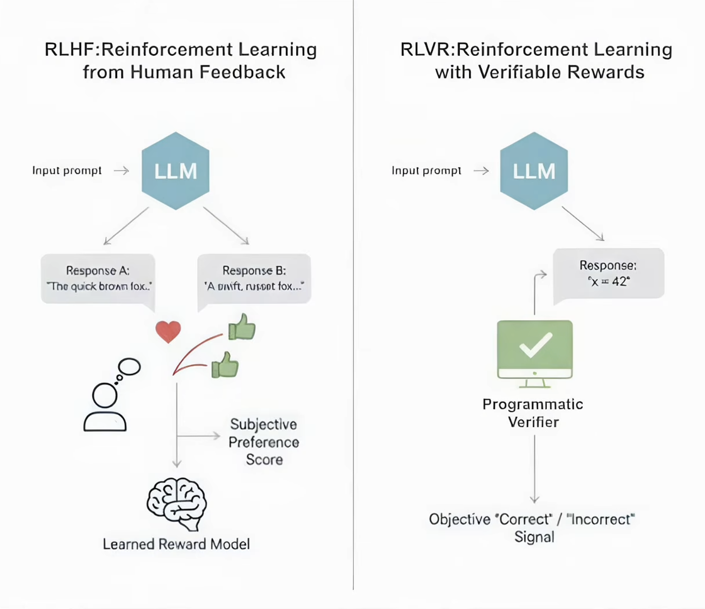

# FinOps 系列 02：数据飞轮与 RSI——三层嵌套循环与一个贯穿指标

> [系列 01](FinOps系列01：从token价格到任务完成花费——指标转向与AI使用边界.md) 给出了任务完成花费的公式，并指出右栏任务（验证贵、错误贵）要迁到左栏，靶子是成功率而不是 token。本篇讨论成功率怎么提升：数据飞轮和 RSI 这两个常被并列使用的概念，实际上是同一个循环的两个视角，而任务完成花费恰好是能同时读这两个视角的刻度。
>
> 术语说明：RSI 是 **Recursive Self-Improvement**（递归自我改进），指系统用改进后的能力再去改进自己。它不是 recurrent，也不指某种"递归超级智能"；"recursively self-improving superintelligence"是 intelligence explosion 讨论里的说法，其中 RSI 仍然指过程而非结果。本文的 RSI 取工程含义，具体机制以 [Dream-RSI 论文初读](../../paper/2026-09-22-Dream-RSI-递归自我改进论文初读.md) 为参照。

---

## 一、为什么会有重叠感

数据飞轮的经典画法是一个圈：使用产生数据，数据改进模型，模型改进带来更多使用。RSI 的画法也是一个圈：agent 执行任务，任务历史被回放，从回放中选出更好的策略，更好的策略执行下一批任务。两个圈都是"用产出改进产出者"，重叠感由此而来。

但两者回答的问题不同。数据飞轮回答"为什么会越转越快"，这是经济学与组织层面的描述，主语是产品或公司。RSI 回答"谁在推轮子，能不能把人拿掉"，这是技术机制层面的描述，主语是一个 agent 系统。重叠的是形状，不重叠的是主语和机制。

## 二、三个能拉开的维度

| 维度 | 数据飞轮 | RSI |
|---|---|---|
| 人在不在环里 | 默认在。标注、评估、决定投资方向都由人完成，人是飞轮的一个部件 | 目标是不在。agent 用自己的历史轨迹当 replay simulator，改进过程不经过人 |
| 积累的是什么 | 数据与资本。数据是资产，资本用来买更多数据和算力 | 能力本身：skill、搜索策略、prompt 配方。数据只是中间产物，用完即可丢 |
| 时间常数 | 以季度计，需要用户规模驱动 | 以小时或天计，一个 agent 系统内部就能闭环 |

第一行是最本质的区别。飞轮里的人做三件事：看数据、改配方、重新评估。RSI 把这三件事变成 agent 对自身历史的 replay 与策略选择。所以可以说，RSI 是数据飞轮去掉人之后的样子，数据飞轮是 RSI 的宏观影子。

第二行解释了为什么 RSI 比飞轮"轻"：飞轮的资产是数据，需要存储、治理、合规；RSI 的资产是一段几百到几千 token 的 skill 文本或一个搜索策略，[SkillOpt](../../wiki/concepts/skillopt.md) 的 `best_skill.md` 就是这种资产的具体形态。

第三行解释了为什么两者可以嵌套而不是替代：转速差两到三个数量级，慢的圈为快的圈提供方向和预算，快的圈为慢的圈提供证据。

## 三、三层嵌套循环

把两个概念放回同一张图，得到三层嵌套的循环：

**外圈是经济飞轮。** 这是 OpenAI [Building abundant intelligence](https://openai.com/index/building-abundant-intelligence) 描述的循环：智能成本下降，更多工作值得开展；采用扩大带来收入、现实反馈与需求洞察；再投入下一代研究与基础设施，成本进一步下降。对使用方而言，外圈决定预算从哪来、往哪投。

**中圈是工程数据飞轮。** 使用洞见与遥测是入口（GitHub Copilot、Copilot Studio、AI Foundry 的 usage insights 都在这一层），经评估（判成功、算成本）进入优化，优化后部署回生产，产生新的使用。这一圈里人还在环中：优化的手段从 prompt 改写到 [APO](../../wiki/concepts/automatic-prompt-optimization.md)、SFT、RL 逐级上升，对应 [Prompt 优化成熟度阶梯](../../wiki/methods/prompt-optimization-maturity-ladder.md) 的 L0 到 L2，每上一级，人的参与从"人改人看"退到"人定评估集、算法闭合回路"。Azure 博客 [Ship agents faster with expanded model choice, voice agents, and continuous optimization](https://azure.microsoft.com/en-us/blog/ship-agents-faster-with-expanded-model-choice-voice-agents-and-continuous-optimization/) 所说的 continuous optimization，指的就是这一圈的平台化。

**内圈是 RSI。** 它是中圈的自动化版本。Dream-RSI 的三阶段循环可以直接映射：探索（rollout，产生历史）、历史变成 replay simulator（不再真跑，离线回放）、dreaming 阶段从回放中选出更好的探索策略。中圈里人做的"看数据、改配方、重评估"，在内圈变成 agent 对自身历史的 replay 与策略选择。它比中圈快两个数量级，因为省掉了人的响应时间和真实 rollout 的开销。

三层的关系不是替代而是供给：外圈给中圈预算和方向，中圈给内圈评估集和 reward 定义，内圈给中圈成功率提升的证据，中圈给外圈"哪些工作已经值得开展"的答案。

## 四、贯穿三层的同一把刻度

三层循环之所以能嵌套而不脱节，是因为有一个刻度在每一层都能读：任务完成花费。

- **外圈读作单位经济学**：每完成一项任务花多少钱，决定这类工作是否值得开展，直接对应 OpenAI 口径里的"让多少有用工作成为可能"。
- **中圈读作评估目标**：reward 定义为成功率除以成本，或成功率与成本的加权。评估环节输出的就是这个数，优化环节朝它改进。
- **内圈读作 RSI 的优化对象**：RSI 需要一个可验证的 reward 才能在 replay 中比较策略优劣，"任务是否完成、花费多少"恰好足够可验证。

这里有一个反直觉的接口。[系列 01](FinOps系列01：从token价格到任务完成花费——指标转向与AI使用边界.md) 的右栏，也就是"Too bad to be useful"那一栏，恰恰是可验证 reward 最充足的领域：报税有 accept/reject，数据录入可以对源单据，QA 有测试结果，保险有理赔结论。左栏的开放式生成（研究报告、代码风格、对话质量）反而没有 ground truth，只能靠 [LLM-as-a-Judge](../../wiki/concepts/llm-as-a-judge.md) 做主观评估，很难驱动 RL 或 RSI。

于是飞轮的路线变得清楚：

1. 先在右栏把人放进环里当验证器。此时任务完成花费的第二项（人工验证）很高，但每一次人工复核都是一条带标签的样本，成熟度阶梯 L1 阶段积累的 bad case 正是 L2 评估集的种子。
2. 样本积累到位后，中圈的优化开始有客观 reward 可用，成功率上升。
3. 成功率越过阈值 (1 − 成功率) × 错误成本 < 人工复核成本 时，去掉人工复核变得划算，任务从右栏迁到左栏。
4. 迁栏后释放的人力转向下一批右栏任务，飞轮继续转。

那张 slide 是一张快照，飞轮讲的是快照怎么随时间变。OpenAI 所说"当实用智能的成本下降，就会有更多工作值得开展"，落到工程上就是这个迁栏过程；只是让它成立的不是 token 降价，而是成功率越过阈值。

## 五、RLHF 与 RLVR：两栏对应两种 reward 来源

上一节说右栏反而有可验证 reward，这个判断在训练侧有现成的名字。RLHF（Reinforcement Learning from Human Feedback）与 RLVR（Reinforcement Learning with Verifiable Rewards）的区别，恰好就是两栏的区别：

| | RLHF | RLVR |
|---|---|---|
| reward 来源 | 人对回复的主观偏好，训练成 learned reward model | 程序化验证器，直接给出 correct / incorrect |
| reward 性质 | 连续、主观、可被投机（reward hacking） | 二值或离散、客观、难以投机但覆盖面有限 |
| 训练出的能力 | 让人满意的回复，即"辅助" | 得到正确答案，即"完成任务" |
| 对应的栏 | 左栏：人当场看一眼、点个赞就是验收 | 右栏：有 ground truth，对错不由人的观感决定 |
| 对应的产品阶段 | Copilot / Cowork，人在环里给偏好 | 迈向 Super App 的前提，人退出逐条验证 |

这张对照解释了两栏分布的来源。本文与 [系列 01](FinOps系列01：从token价格到任务完成花费——指标转向与AI使用边界.md) 引用的几张 slide 来自同一场演讲：TypeSafe AI 创始人（RLHF 早期核心研究者之一）的 [AI: too good to be true, too bad to be useful](https://typesafe.ai/blog/ai-too-good-to-be-true-too-bad-to-be-useful-typesafe-ai)（2026-06-19 发布于公司博客，另有 [文字整理稿](https://mlearning.substack.com/p/ai-too-good-to-be-true-too-bad-to-be-udeful-jev-typesafe-ai-one-model)）。需要说明的是，这场演讲同时是该公司产品 Jev 的预热：Jev 被定位为 System One Model，不生成文本，只对给定选项返回带概率与置信度的类型化决策，主打自动化场景。这不影响前半场对 RLHF 的分析成立，但读者应知道讲者的立场。演讲总结页只有四句话：**we optimized for assistance**；don't have AI make decisions with stakes；there are other paths than RLHF；Automation is coming soon™。第一句是原因：过去几年主流模型用 RLHF 训练，reward 是"这条回复让人满意吗"，这正是左栏任务的验收方式，所以左栏不是 LLM 碰巧擅长的领域，而是训练目标的直接投影。第二句是当前边界：右栏要的是客观对错，learned reward model 从没见过这种信号，所以"不要让 AI 做有 stakes 的决策"是训练目标的边界，而不是智能的边界；本文的阈值条件把 stakes 量化成了错误成本乘以失败率。第三句指向 RLVR：右栏任务有 ground truth，把验证从人工换成程序，reward 就从主观偏好变成客观对错，这也是 [系列 01](FinOps系列01：从token价格到任务完成花费——指标转向与AI使用边界.md) 公式第二项"人工验证成本"能被压到接近零的机制。第四句的 ™ 是自嘲：自动化总在"快来了"，因为它是逐任务跨越阈值的过程而非一个时间点，迁栏条件给了每个任务自己的"何时到来"。

RLVR 在 FinOps 场景里有两个工程限制，正好对应第三节字段表里最难填的两项：

- **覆盖面**：只有能写出验证器的任务才有 RLVR 信号。报税有 accept/reject，数据录入可以对源单据，但"客服回复是否得体"没有验证器，只能退回 LLM-as-a-Judge，也就是 RLHF 的推理时版本。这决定了哪些右栏任务能靠飞轮迁栏，哪些长期停在 Cowork。
- **延迟与稀疏**：真实的验证信号往往滞后（税务结论几个月后才回来）且只在终点给分。工程上需要近端代理：对源单据的规则校验、中间步骤的 [process reward model](../../wiki/concepts/process-reward-model.md)、抽样人工复核。[Reward 设计三份输入与两本账分家](../../wiki/methods/reward-design-three-inputs.md) 里"确定性规则分白送零噪声信号"说的就是在 RLHF 式主观分之外尽可能多接 RLVR 式客观分。

演讲里还有一句直接关于 FinOps 公式的话：如果一个模型在某任务上 95% 正确，却说不出自己什么时候处于那 5%，这个任务就无法自动化。这把 [系列 01](FinOps系列01：从token价格到任务完成花费——指标转向与AI使用边界.md) 公式的第二项再拆了一层：人工验证成本之所以在右栏居高不下，不只是因为成功率不到 100%，更因为模型不提供校准过的置信度，人只能复核全部。若模型能可靠标出低置信的那部分，验证成本就从"复核 100%"降到"复核被标记的 5% 加抽检"，阈值条件随之更容易满足。这是校准（calibration）进入 FinOps 账本的方式，也是评估环节除成功率之外应当追踪的第二个模型侧指标。Jev 是否真正做到这一点属于 [系列 03](FinOps系列03：落地提纲——从使用洞见到优化、监控、评估闭环（活文档）.md) 的待核实项，但"置信度校准降低验证成本"这个机制本身不依赖任何特定产品。

两种 reward 来源与本文三层循环的关系是：中圈的优化阶梯在 L1 用的是 RLHF 式信号（LLM-judge 主观分，人闭合回路），到 L2 才有机会接 RLVR 式信号（客观 reward，算法闭合回路）；内圈 RSI 需要在 replay 中比较策略优劣，几乎只能建立在 RLVR 式信号之上，因为主观分在离线回放里无法重新获得。所以"哪些任务能进内圈"的判据，就是"哪些任务写得出验证器"。

## 六、安全阀：评估门控独立于优化目标

把任务完成花费直接当作内圈的优化目标，会遇到 Goodhart 问题：指标一旦成为目标，就不再是好指标。RLHF 里的 reward hacking 是这个问题最著名的实例，learned reward model 越是被优化，越偏离它本该代理的人类判断；只要 reward 里含有主观分，这个风险就跟着进来。具体到这里，agent 会学到省钱但降质的策略，比如少做验证步骤、缩短输出、对模糊情况直接给出看似完成的结果。从生产方看 cost per task 在下降，从接收方看错误成本在上升，只是错误暴露有延迟。

对策是三条：

- **评估门控独立于优化目标。** 监控和评估不是优化环节的附属，而是内圈的刹车。判分的评估器不能与被优化的策略共享目标函数，这与 [生成-评估分离](../../wiki/concepts/generation-evaluation-separation.md) 是同一条原则。
- **两本账分家。** 接收方的验收分逐字节不动，作为业务口径和历史比较基准；用于优化的 reward 单独设计，可以拆分 judge、约束饱和分量、加入确定性规则。这是 [Reward 设计三份输入与两本账分家](../../wiki/methods/reward-design-three-inputs.md) 的结论，在 FinOps 场景同样适用。
- **先把 reward 做稳，再让轮子转快。** 客户侧 APO 摆动大的经验表明，摆动的主因是评估噪声而非算法。同一个 reward 进入 RL 或 RSI 后，噪声仍然是第一大不稳定源。扩大评估集、同一 prompt 多次采样取均值、拆分 judge 降低分母噪声，这些动作要在加速内圈之前完成。

三条合在一起的意思是：FinOps 的"监控、评估"环节，在这个框架里不是成本中心，而是让内圈可以安全加速的前提。

## 七、金字塔底层：三层循环都压在"做对的任务"上

同一组 slide 里还有一张《How can that be possible?》，右下角画了一个四层金字塔，从顶到底是 algorithms、compute、data、doing the right task，越靠底层杠杆越大。配文举了两个例子：

- **FLAN lesson**：Google 的 FLAN 论文创造了 "instruction tuning" 这个词，六千次引用，但事后看指令微调的最优用量是零。大量投入进了算法层，结果被更底层的变化整体抹掉。
- **Bitterest lesson**：如果 RLHF 这么显然，为什么 GPT-2 时代没有做？答案是模型能力当时已经足够，缺的不是算法也不是算力，而是没有人把"按人类偏好对齐"当作要做的任务。"Doing the right task" 在 LLM 历史上只发生过大约一次半，极其稀少也极其难。

这张金字塔与本文的三层循环可以直接对齐，而且给出一个警告：

| 金字塔层 | 对应本文 | 杠杆 |
|---|---|---|
| algorithms | 内圈 RSI、中圈的 APO → SFT → RL | 最小。在给定任务上把成功率再提几个点 |
| compute | 外圈的算力投资、token 价格 | 次小。传统 FinOps 盯住的那一层 |
| data | 中圈数据飞轮积累的评估集与轨迹 | 较大。决定优化有没有原料 |
| doing the right task | [系列 01](FinOps系列01：从token价格到任务完成花费——指标转向与AI使用边界.md) 的两变量分桶、"成功由接收方定义" | 最大。决定上面三层有没有意义 |

警告在于：三层循环全部运行在"任务已经选定"的前提下。RSI 只能在给定任务上让策略变好，飞轮只能在给定任务上积累数据，它们都不能纠正任务选错。Goodhart 问题在这个视角下就是"任务定义错了"的一个症状：把 cost per task 当目标，是在优化一个错的任务；把接收方判定的完成当目标，才是对的任务。所以系列 01 那张两变量图不只是分类工具，它是金字塔底层的操作界面：先决定哪些任务该做、成功由谁判定，再谈让轮子转。

FinOps 视角下这条排序有两个直接推论。第一，预算分配应与杠杆成正比：花在"选对任务与定义成功"上的时间，不应少于花在 token 压缩和优化算法上的时间，而现实通常反过来。第二，FLAN lesson 是对中圈的提醒：优化手段的沉没成本可能被更底层的变化清零，模型换代后 prompt 配方、skill 文本、微调数据都可能归零，所以中圈的资产要按"可能被清零"来折旧，评估集与接收方判定标准是其中最不容易归零的部分，应优先投资。[Bitter Lesson](../../wiki/concepts/bitter-lesson.md) 的原始表述是"通用方法加算力最终胜过人工注入的领域知识"，这张 slide 把它再推一层：连方法都不是关键，关键是选对要解的问题。

## 八、一句话骨架与待深入

写作或汇报时可以用一句话立骨架：**数据飞轮是 RSI 的宏观影子，RSI 是数据飞轮去掉人之后的样子；任务完成花费是两者共用的刻度；而两者都压在"做对的任务"这一层之上。**

以下问题尚未展开，作为后续更新的入口：

- 中圈到内圈的迁移条件是什么。成熟度阶梯给出了 L1 到 L2 的数据量阈值（30~50 条起步、100+ 条稳定），从 L2 到 RSI 是否有类似阈值，还是取决于 replay 的 coverage。
- 人从环里退出的顺序。标注、评估、决策三个角色哪个先退，退出后由什么替代，与 [持续自我改进 AI](../../wiki/concepts/continual-self-improving-ai.md) 页面的判断需要对照。
- RSI 在 coding agent 之外的落点。Dream-RSI 的三个实验领域之外，右栏任务（报税、数据录入）是否有足够的 replay 可用性。
- 三层之间的预算传递。外圈的投资决策如何转化为中圈的评估集预算和内圈的 rollout 预算，这部分与 [系列 03](FinOps系列03：落地提纲——从使用洞见到优化、监控、评估闭环（活文档）.md) 的落地提纲合并讨论。

---

**相关阅读**

- [系列 01：从 token 价格到任务完成花费](FinOps系列01：从token价格到任务完成花费——指标转向与AI使用边界.md)
- [Dream-RSI 论文初读——探索历史即 replay simulator](../../paper/2026-09-22-Dream-RSI-递归自我改进论文初读.md)：三阶段 RSI 循环、与 SkillOpt 的同构分工、三层学习位置
- [Prompt 优化成熟度阶梯](../AI/agent-lightning/Prompt优化成熟度阶梯——从vibe%20check、LLM-judge到数据闭环：APO与SkillOpt前置篇.md)：L0 → L1 → L2 的评估信号成熟度
- [从 Evaluator 到 Reward Function](../AI/evaluation/从Evaluator到Reward-Function——评估信号如何变成APO与强化学习的训练信号.md)
- wiki：[SkillOpt](../../wiki/concepts/skillopt.md)、[自动提示优化（APO）](../../wiki/concepts/automatic-prompt-optimization.md)、[Reward 设计三份输入与两本账分家](../../wiki/methods/reward-design-three-inputs.md)、[生成-评估分离](../../wiki/concepts/generation-evaluation-separation.md)
