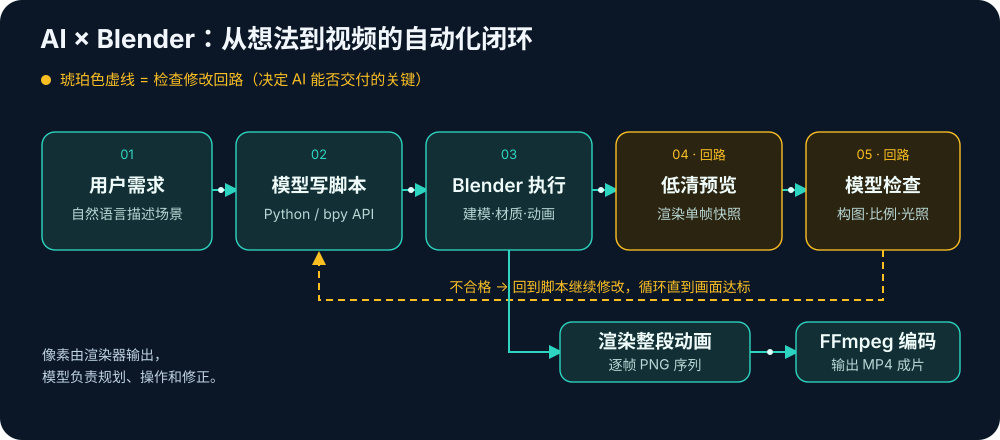

# Blender 系列01：为什么是 Blender——GPT-6-astra 发布演示的 3D 工具选型与 Unreal Engine 对比

> 系列导航：本篇 ｜ [系列02：三种操作入口与官方 MCP 安装](Blender系列02：三种操作入口与官方MCP安装——三组件架构、本地进程原理与SDK版本兼容实录.md) ｜ [系列03：虎式坦克实战](Blender系列03：虎式坦克实战——从一句话需求到8秒开火动画的完整链路与工程解剖.md)
>
> 素材来源：与 Codex（gpt-6-astra）的实际讨论与实操记录（2026-09-07），工具能力部分均有官方文档依据。

## 引子：发布演示里清一色的 Blender

GPT-6-astra 发布后，社区演示视频呈现出一个明显的模式：用 Blender 建模，加上素材和场景，让 AI 生成一段视频。问题随之而来——为什么不是 Unreal Engine，或者其他 3D 工具？

答案不在"哪个软件更强"，而在任务形态本身：**对于"让 AI 从一个想法出发，搭建场景、调整画面，最后交付一段视频"的任务，Blender 很容易形成完整的自动化闭环**。这使它特别适合发布演示和个人创作者快速复现。Unreal Engine 的优势，则更容易在实时预览、大型场景、交互内容，以及已经搭好的生产工程里体现。

## 这类"AI 生成视频"的真实工作流

先把"AI 生成视频"这个说法拆开。在这类工作流中，像素并不是模型直接输出的——**像素由渲染器输出，模型负责规划、操作和修正**：

> 用户描述需求 → AI 编写脚本或操作软件 → 创建、导入并布置三维资产 → 设置动画与镜头 → 渲染画面 → 检查并修改 → 输出视频

Astra 官方强调的跨代码、浏览器和专业软件完成多步骤任务的能力，正好适用于这条流程（参见 [GPT-6-astra 最新模型使用指南](https://developers.openai.com/api/docs/guides/latest-model)）。而工具选型要回答的问题是：这条流程在哪个软件里搭建成本最低、运转最可靠。

## Blender 占优的四个理由

### 1. Python API 把模型的编程能力直接转化成三维操作

Blender 的 Python API 能操作几何体、材质、灯光、摄影机和动画；它还支持后台运行脚本、渲染指定帧和整段动画（参见 [Blender 功能说明](https://www.blender.org/features/) 与 [后台脚本与渲染文档](https://docs.blender.org/manual/en/latest/advanced/command_line/arguments.html)）。对 AI 来说，这意味着一次脚本执行就能完成大量重复操作——排列上百扇窗户、布置路灯、设置一段摄影机运动。

更关键的是上图中琥珀色的那条回路：

> 改场景 → 渲染一张低分辨率预览 → 让模型检查构图、比例和光照 → 再修改

**这类循环的搭建成本和可靠性，会直接影响 AI 最终能否交付结果。** 即使使用 Computer Use 操作界面，能配合脚本批量处理，依然很有价值（入口之间的分工见系列02）。

### 2. 从零做一个短片时，Blender 需要协调的环节更集中

假设需求是："做一个香水瓶，放在岩石上，加入薄雾，让镜头绕行。"

Blender 可以在同一个应用里完成瓶子建模、材质、场景、动画和渲染。对于一次性的短片任务，这种集中程度很有帮助。

UE 也能完成这些内容，但其常见工作流需要管理工程、插件、关卡资产、镜头序列和渲染配置。它们对持续生产很有价值；对于从空白开始的短演示，准备和排错成本可能占据更大比例。

所以选型时真正要比较的是这个总量：

> **从需求到合格成片的总时间 ＝ 准备 ＋ 操作 ＋ 检查修正 ＋ 渲染**

单独比较渲染速度，无法解释为什么大家在演示中选择某个工具。这一点也意味着：**Blender 更容易启动任务，不代表它渲染动画一定更快。**

### 3. "加素材、搭场景"本来就是很有效的制作方法

一个画面看起来精致，往往同时依赖：

- 模型的形状与细节；
- 材质、贴图和环境光；
- 构图、摄影机运动和景深；
- 动画节奏与后期处理。

因此，AI 可以程序化创建需要精确控制的结构，再导入树木、岩石、家具、贴图等现成资产，把精力放在场景组织和镜头设计上，显著减少从零制作所有细节的工作量。

需要说明的是，**这部分收益在 Blender、UE 和其他三维工具里都成立**——它解释的是"素材 + 场景"这个方法为什么有效，而不是 Blender 独有的优势。同时，仅凭成片的视觉效果，无法判断其中多少资产是模型新建的、多少来自素材库，需要看实际工程和操作过程。

### 4. 免费开源属性有利于演示传播

观众可以安装同一个软件，使用公开脚本跟做；创作者也容易分享工程、插件和自动化方法。出现一批成功示例后，后续创作者沿用相同工具，可以减少探索成本。

这能够解释你看到的案例为什么会集中，但有两条边界要守住：目前**没有依据**把它进一步归因于"Astra 专门针对 Blender 训练得更多"；也**不能**从这些发布演示推断整个行业的工具使用比例。

## Unreal Engine 能不能做同样的事？能

对照 Epic 官方文档核实，UE 完全具备承载同一条 AI 工作流的能力：

- **Python 编辑器脚本**支持资产管理和程序化布置场景；
- **Sequencer** 组织镜头与动画；
- **Movie Render Queue / Movie Render Graph** 支持高质量成片和自动化渲染；
- 官方还提供了结合命令行、渲染配置和 Python 执行器的渲染流程。

参见 [Scripting the Unreal Editor Using Python](https://dev.epicgames.com/documentation/unreal-engine/scripting-the-unreal-editor-using-python) 与 [Using Command Line Rendering with Movie Render Queue](https://dev.epicgames.com/documentation/unreal-engine/using-command-line-rendering-with-move-render-queue-in-unreal-engine)。

**如果已经有成熟的 UE 工程、资产库和镜头模板，选型结果完全可能反过来**——前期配置成本可以被摊薄，实时预览又有利于反复调整灯光、材质和运镜。

## 按任务条件的选型表

| 任务条件 | 优先考虑 |
|---|---|
| AI 从零制作产品动画、小型场景、结构讲解短片 | Blender，流程集中，容易通过脚本反复修改 |
| 已有大量 UE 资产，需要大场景运镜和频繁实时预览 | Unreal Engine |
| 需要交互展厅、实时配置器，视频只是其中一种输出 | Unreal Engine |
| 已有成熟的 Houdini 特效、Maya 角色动画或 Cinema 4D 运动图形流程 | 优先接入现有工具，复用资产和团队经验 |

## 结论：分水岭是"从空白开始"还是"在已有系统里持续生产"

对"加素材和场景来生成视频"这个目标，**真正会改变选择的条件，是从空白开始制作，还是在已有场景系统里持续生产**。前者很适合用 Blender 起步；后者如果已经围绕 UE 建好了资产、镜头和渲染模板，AI 驱动 UE 就很有吸引力。

实际生产也可以把二者串起来：Blender 制作或修整资产，UE 负责场景组织、镜头和最终输出。

下一篇（系列02）回答落地的第一个问题：装好 Blender 之后，gpt-6-astra 到底通过哪几条入口"够得着"它——Python API、Computer Use 和 MCP 各自的分工，以及官方 Blender MCP 的安装实录。

## 参考链接

- [GPT-6-astra 模型文档](https://developers.openai.com/api/docs/models/gpt-6-astra)
- [最新模型使用指南](https://developers.openai.com/api/docs/guides/latest-model)
- [Blender 功能概览](https://www.blender.org/features/)
- [Blender 命令行参数（后台脚本与渲染）](https://docs.blender.org/manual/en/latest/advanced/command_line/arguments.html)
- [Scripting the Unreal Editor Using Python](https://dev.epicgames.com/documentation/unreal-engine/scripting-the-unreal-editor-using-python)
- [Unreal Engine Movie Render Pipeline](https://dev.epicgames.com/documentation/unreal-engine/movie-render-pipeline-in-unreal-engine)
- [Using Command Line Rendering with Movie Render Queue](https://dev.epicgames.com/documentation/unreal-engine/using-command-line-rendering-with-move-render-queue-in-unreal-engine)
