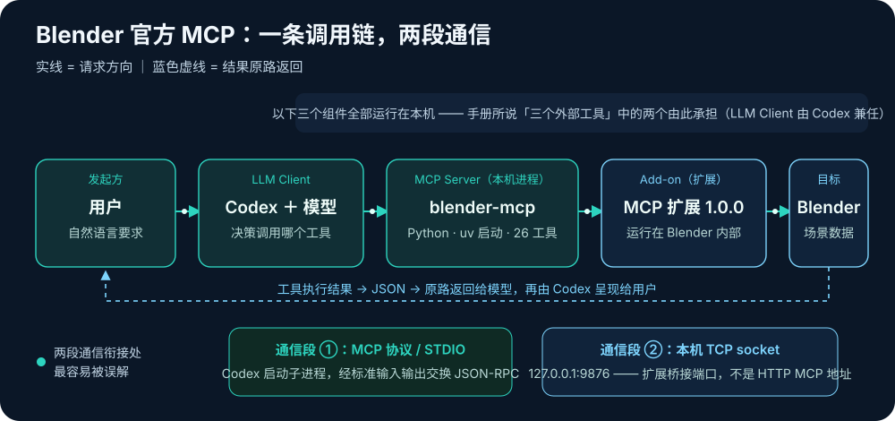

# Blender 系列02：三种操作入口与官方 MCP 安装——三组件架构、本地进程原理与 SDK 版本兼容实录

> 系列导航：[系列01：为什么是 Blender](Blender系列01：为什么是Blender——GPT-6-astra发布演示的3D工具选型与Unreal%20Engine对比.md) ｜ 本篇 ｜ [系列03：虎式坦克实战](Blender系列03：虎式坦克实战——从一句话需求到8秒开火动画的完整链路与工程解剖.md) ｜ [系列04：人物面试动画实战](Blender系列04：人物面试动画实战——47骨骼程序化表演、TTS配音与音量包络口型同步.md)
>
> 素材来源：按 [Blender 官方 MCP 手册](https://www.blender.org/lab/mcp-server/) 在本机完成的一次真实安装与验证（2026-09-07，macOS + Blender 5.2.1 LTS + Codex），含全部踩坑记录。

## 引子：AI 靠什么"够得着"Blender

系列01 说清了为什么选 Blender。落地的第一个问题随之而来：模型不能直接伸手进 3D 视口，它操作 Blender 必须走某条入口。实际可用的入口有三条，各自的性质完全不同：

| 入口 | 本质 | 擅长 | 不擅长 |
|---|---|---|---|
| **Python API（bpy）** | 让模型写脚本，Blender 后台执行 | 批量建模、改参数、设关键帧、渲染——一次脚本执行完成大量重复操作 | 操作"正在打开"的 GUI 会话状态 |
| **Computer Use** | 模型看截图、操作键鼠 | 查看窗口实际状态、打开文件、检查界面里的结果 | 批量精确操作；易受窗口焦点、用户操作干扰 |
| **MCP** | 标准协议连接一个封装了 Blender API 的服务 | 对话式连续修改当前打开的场景，保留选中对象和编辑状态 | 它是连接协议，不会加快渲染或模拟 |

三条入口的效率关系，有一个容易讲错的地方：**"MCP 比 Computer Use 高效"这个说法成立，但效率来自它背后能直接调用的 Blender API——MCP 本身只是连接协议。** 对重复建模、改参数和设关键帧，能直接调用 API 的路径可以一次提交批量操作、读取对象数据和接收错误信息；纯界面操作做不到这些。同样，接入 MCP 也不会直接缩短渲染或烟雾模拟的时间——那由 Blender 设置与硬件决定。

### Computer Use 在实战中的真实表现

系列03 的虎式坦克项目给这张分工表提供了实测注脚。批量制作全部走了 Python API；Computer Use 只用于查看窗口和打开文件，而且在窗口操作时接连遇到真实故障：

```text
Computer Use server error -10005: noWindowsAvailable

Computer Use server error -10005: The user may have conflicted with your paste
operation. Check the app's state to ensure the user's content did not paste
instead of your intended content before continuing.

Ambiguous app identifier 'org.blenderfoundation.blender'. Multiple apps share
this bundle identifier: /Applications/Blender.app, /Volumes/Blender/Blender.app.
Use an app name or full app path instead.
```

第三条的原因很典型：安装 Blender 后没有推出挂载的 `.dmg` 安装镜像，导致两个位置的应用共享同一个 bundle identifier，工具无法定位窗口；按提示改用完整应用路径后可以读取状态，但并非所有窗口操作都因此恢复。这些错误影响的只是桌面界面操作——后台脚本生成和渲染独立验证成功，不能从这些错误推断模型生成失败。

实测结论：**批量制作交给 Blender API，通常比依赖界面输入更稳定；Computer Use 适合做"眼睛"，不适合做"手"。** 而 MCP 的价值，正是把 API 这条路径接到"正在打开的场景"上——这就引出官方 Blender MCP 的安装。

## 官方 MCP 的三组件架构

[Blender 官方手册](https://www.blender.org/lab/mcp-server/) 说，要让 Blender 连接 LLM，需要"三个外部工具"：Add-on、LLM Client、MCP Server。乍看要装三款软件，实际不是——三者分别承担 **Blender 内部执行、与模型对话、连接工具接口**的工作，而 LLM Client 由你正在用的 Codex 直接兼任：

| 组件 | 作用 | 本次安装的对应 |
|---|---|---|
| **Add-on（Blender 扩展）** | 运行在 Blender 内部，接收请求，通过 Blender 的 Python API 读取场景、修改物体、执行渲染 | 官方 MCP 扩展 1.0.0，需安装并启用 |
| **LLM Client（大模型客户端）** | 接收自然语言要求，调用模型，并根据模型的决定调用 MCP 工具、展示结果 | 直接使用 Codex——客户端是 Codex，背后调用的模型才是 LLM |
| **MCP Server（MCP 服务程序）** | 向客户端提供标准的 MCP 工具接口，再把请求传给 Blender 扩展执行，将结果返回 | 官方 blender-mcp 1.0.0，由 Codex 自动启动 |

手册中还提供了 Llama.cpp 作为另一种客户端选择——已有 Codex 时不需要安装它，也不需要另外下载本地模型。

例如你说"列出当前场景中的所有物体"，完整调用链是：



## 本地进程 vs npm 包：运行方式与分发方式是两个层面

一个常见疑问：这个 MCP Server 是本地进程吗？为什么不像其他 MCP 那样是一个 npm 安装包？

**是本地进程**——它由 Codex 在建立 MCP 连接时启动，用 Python 编写，通过标准输入/输出（STDIO）与 Codex 通信，再通过本机端口 `127.0.0.1:9876` 连接 Blender 内部的扩展。注意这是**两段不同的通信**：Codex 与 MCP Server 之间是 MCP/STDIO；MCP Server 与 Add-on 之间是本机 TCP socket。端口 9876 是后者的扩展桥接端口，**不是**供客户端直接填写的 HTTP MCP 地址。

而"本地进程"和"npm 安装包"说的是两个不同层面：**前者是运行方式，后者是软件的分发与安装方式。通过 npm 安装的 MCP Server，启动后通常也是一个本地进程。**

| 你看到的形式 | 如何安装或取得程序 | 启动后实际运行什么 |
|---|---|---|
| `npx 某个-mcp包` | 从 npm 获取 JavaScript／TypeScript 包 | 本机的 Node.js 进程 |
| 本次的 Blender MCP | 从官方仓库获取 Python 项目，用 `uv` 安装依赖 | 本机的 Python 进程 |
| 配置一个 `https://…/mcp` 地址 | 连接已经部署好的服务 | MCP Server 主要运行在远端服务器上 |

**MCP 规定的是客户端与服务端如何通信，不规定服务端必须用什么语言、发布到哪个包仓库。** Python、JavaScript、Go、Rust 都可以实现 MCP Server。Blender 官方这份实现选择了 Python，手册为支持 STDIO 的客户端提供的安装方法是"下载源码，再用 `uv` 启动"。日常使用时启动命令由 Codex 执行，不需要自己开一个终端一直挂着。

## 安装实录：环境、配置与四个坑

### 环境

- macOS（Apple Silicon），Blender 5.2.1 LTS（满足手册要求的 5.1+）
- `uv` 0.7.6，服务运行环境 CPython 3.12.9（项目目录内 `.venv`）
- 工作区：`~/Downloads/blender-ws`，官方源码 `v1.0.0`（提交 `03004fd`）
- 客户端：Codex Desktop（配置解析用 Codex CLI 0.153.4）

### 最终生效的 Codex 配置

写入 `~/.codex/config.toml`：

```toml
[mcp_servers.blender]
command = "/Users/<you>/.local/bin/uv"
args = ["--directory", "/Users/<you>/Downloads/blender-ws/blender_mcp/mcp", "run", "--no-sync", "blender-mcp"]
startup_timeout_sec = 60
tool_timeout_sec = 300

[mcp_servers.blender.env]
BLENDER_MCP_HOST = "127.0.0.1"
BLENDER_MCP_PORT = "9876"
BLENDER_PATH = "/Applications/Blender.app/Contents/MacOS/Blender"
```

两处与官方 [Setup Wiki](https://projects.blender.org/lab/blender_mcp/wiki/Setup) 示例的差异都有明确原因：官方示例用 `$HOME` 变量，但手册自己提醒部分客户端不支持变量替换，所以改用绝对路径；追加 `--no-sync` 让日常启动直接使用已经安装并验证过的依赖环境，不再每次解析依赖。服务通过绝对路径启动，因此 `blender_mcp` 目录不能移动，移动后需同步修改配置。

### 坑 1：官方 v1.0.0 与 MCP Python SDK 2.x 不兼容（最重要的一个）

初次依赖解析装上了 `mcp==2.1.1`，启动直接报错：

```text
ModuleNotFoundError: No module named 'mcp.server.fastmcp'. This is mcp 2.x,
where FastMCP was renamed to MCPServer (from mcp.server.mcpserver import
MCPServer) and other APIs changed; ... or pin 'mcp<2' to keep running v1 code.
```

原因：官方 v1.0.0 的依赖声明写的是 `mcp[cli]>=1.2.0`（允许 2.x），但代码仍导入 1.x 时代的 `mcp.server.fastmcp.FastMCP`——SDK 2.x 把 FastMCP 改名成了 MCPServer。处理方式是把项目 `mcp/pyproject.toml` 中的依赖改为 `mcp[cli]>=1.2.0,<2`，重新同步后安装 SDK 1.29.1，启动成功。值得记录的是中间一次失败尝试：先在本地 `uv.toml` 加 `constraint-dependencies = ["mcp<2"]`，当次同步后实际运行的仍是 2.1.1——约束没有生效，最终靠直接修改项目依赖上限解决。整个过程对源码的改动只有这一行依赖约束，服务实现代码保持官方版本。

一个小细节：装好后 MCP 握手中 `serverInfo.version` 返回 `1.29.1`——那是 FastMCP 默认上报的 SDK 版本，不是服务版本；扩展和服务包的版本都是 1.0.0。

### 坑 2：PyPI 官方源连不上

`files.pythonhosted.org` 返回 `Socket is not connected`（curl 独立诊断也复现）。改用清华 TUNA PyPI 镜像下载依赖，镜像设置只写在本服务的 `mcp/uv.toml`，不动全局软件源。另外系统 Python 访问公开文档时报 `CERTIFICATE_VERIFY_FAILED`，资料读取改用能正常验证证书的 curl，没有禁用 TLS 校验。

### 坑 3：Allow Online Access 必须开启——即使只做 localhost 通信

初始检查发现 Blender 的 Allow Online Access 是关闭的。读官方扩展代码确认：**即使只进行 localhost 通信，扩展也会检查 `bpy.app.online_access`**。因此需要开启该设置，再安装官方 ZIP、启用扩展并保存用户首选项。

顺带一条实操记录：由于 Computer Use 窗口操作不稳定（见上文报错），扩展最终没有走 GUI 安装，而是用 Blender 自身的后台接口 `bpy.ops.extensions.package_install_files` 把官方 ZIP 装进 User Default 仓库，再启动一个新的后台 Blender 验证已保存设置生效。

### 坑 4：`codex mcp add` 会悄悄丢掉原有配置字段

调用 `codex mcp add blender` 写配置后，与备份比对发现它同时省略了原有的三个字段：`mcp_servers.node_repl.args`、`mcp_servers.tavily.enabled`、`mcp_servers.tavily.type`。最终以安装前的配置文本为基础，只追加 Blender 部分，恢复了这些字段。**教训：让工具改配置文件前先备份，改完做文本级 diff。**

## 验证结果与边界

安装验证做到了哪一步，边界记录得很清楚：

| 检查项 | 结论 |
| --- | --- |
| Blender 软件版本 | 实测 5.2.1 LTS，满足手册最低要求 ✅ |
| 扩展落盘和启用设置 | 新启动的后台 Blender 成功加载保存的扩展和参数 ✅ |
| MCP 服务可启动 | 修正 SDK 版本约束后启动成功 ✅ |
| Codex 配置解析 | `codex mcp get blender --json` 显示启用、STDIO、正确命令和环境变量 ✅ |
| MCP 协议与工具清单 | 测试客户端完成握手，枚举 **26 个工具** ✅ |
| 真实 Blender 工具调用 | `get_objects_summary` 从独立后台默认场景返回 Camera、Cube、Light ✅ |
| 当前 GUI 编辑场景 | ⏳ 未验证——当时打开的会话仍需重启加载扩展 |
| Codex Desktop 新任务调用 | ⏳ 未验证——需重新加载 MCP 配置后再检查 |
| 自然语言模型端到端调用 | ⏳ 未进行——协议测试客户端直接调用 MCP 工具，不等于一次 LLM 决策调用 |

最后三行是这份记录最有方法论价值的地方：**协议握手成功、工具枚举成功、后台场景读取成功，加起来仍然不等于"端到端可用"**。剩余步骤是：保存当前 Blender 文件并重启（扩展自动启动）；让 Codex 重新加载 MCP 配置；然后在新任务里用一句只读指令收尾验证：

> 使用 Blender MCP，列出当前场景的物体，先不要修改。

另外要说明：系列03 的虎式坦克初版制作**没有依赖这套 MCP**——当时走的是 Python API + Computer Use。MCP 装好之后的增益，是后续可以对"正在打开的场景"做对话式连续修改。

## 参考链接

- [Blender MCP 手册](https://www.blender.org/lab/mcp-server/)
- [Blender MCP 官方 STDIO 安装步骤（Setup Wiki）](https://projects.blender.org/lab/blender_mcp/wiki/Setup)
- [Blender MCP v1.0.0 发布](https://projects.blender.org/lab/blender_mcp/releases/tag/v1.0.0)
- [Codex MCP 配置说明](https://developers.openai.com/codex/mcp)
- [MCP Python SDK 2.x 迁移指南（FastMCP 改名）](https://py.sdk.modelcontextprotocol.io/v2/migration/#fastmcp-renamed-to-mcpserver)
