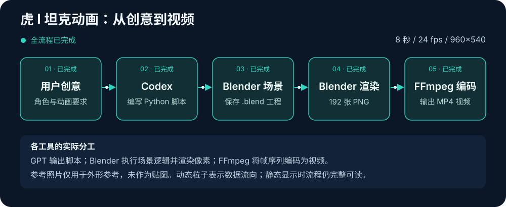

# Blender 系列03：虎式坦克实战——从一句话需求到 8 秒开火动画的完整链路与工程解剖

> 系列导航：[系列01：为什么是 Blender](Blender系列01：为什么是Blender——GPT-6-astra发布演示的3D工具选型与Unreal%20Engine对比.md) ｜ [系列02：三种操作入口与官方 MCP 安装](Blender系列02：三种操作入口与官方MCP安装——三组件架构、本地进程原理与SDK版本兼容实录.md) ｜ 本篇
>
> 素材来源：与 Codex（gpt-6-astra）的一次完整实操（2026-09-07）——从"做一个坦克的建模和开火动作"到交付可编辑工程与 8 秒视频，含全过程问答、脚本源码与工程盘点数据。本次是根据文字需求制作的虎 I 风格化演示，不是对某条视频的逐帧复刻。

## 实战任务：一句话需求，交付什么

需求原文很短："怎么用 Codex 里的 gpt-6-astra 快速完成一个坦克的建模和一些基本动作，包括开火等等？"随后追加了一句原型指定："先用二战时候的虎式坦克作为原型吧。"

最终交付（全部落在本机工作区 `~/Downloads/blender-ws/`）：

| 交付物 | 内容 |
|---|---|
| `output/tiger_i_demo.blend` | 可编辑工程：方正车体、弧形侧壁炮塔、指挥塔、交错负重轮、宽履带、长炮管与炮口制退器 |
| `output/tiger_i_demo.mp4` | 8 秒预览视频：960×540、24 fps、192 帧、H.264、无缺帧、暂无音轨 |
| `output/frames/` | 192 张逐帧 PNG（约 104 MB，MP4 仅约 0.48 MB） |
| `tank_model.py` / `build_scene.py` / `verify_scene.py` | 建模、场景动画、验证三个生成脚本 |

动作内容：前进、履带循环、车轮转动、炮塔转向、炮管抬升，以及**两次开火**（炮管后坐与复位、火光、短暂照明、车体轻微反应、烟雾消散）。完整动画渲染约 2 分 39 秒；交付前在 Blender 里检查了 13 个关键时刻（行进、转向、后坐、火光、镜头范围），全部通过。



这一版定位是"外形可辨认、可编辑"的风格化虎 I 练习：对照了坦克博物馆的 [Tiger 131 实车照片](https://tankmuseum.org/wp-content/uploads/2025/09/Tiger-131-takes-to-the-arena-for-Tiger-Day.jpg)落实车体正面、炮塔轮廓、交错负重轮和炮口制退器，但照片**只作外形参考，没有作为贴图进入工程**，模型也没有做严格的史料尺寸复原。

制作路径上有一点值得先说清：初版**全部通过 Blender Python API 完成**（建模、动画、渲染都是脚本），Computer Use 只用来查看窗口和打开文件，没有依赖系列02 安装的 MCP。过程中 Computer Use 自动打开工程时遇到窗口定位和粘贴冲突，原场景的自动另存也没有成功——这段经历正是系列02"批量制作交给 API，界面操作只做查看"结论的来源。

## 工程解剖一：画面里的东西分别从哪里来

最容易误判的问题：这画面有材质、有地面、有烟雾，用了哪些素材库？实测答案是——**一个都没用**。工程里没有下载的坦克模型、地面贴图、HDRI 或烟雾素材，全部内容由脚本建立：

| 画面中的内容 | 实际制作方式 |
|---|---|
| 车体、炮塔、炮管、制退器 | 长方体、圆柱体和自定义网格，加倒角（Bevel）等处理 |
| 履带 | 创建一个链节网格，多个对象共享它，沿封闭路径排列和运动 |
| 车轮 | 圆柱体、轮毂和螺栓组合，按不同横向层次交错排列 |
| 黄色车漆、金属、橡胶 | 材质的颜色、金属度、粗糙度参数 |
| 地面 | 大型扁平物体 + 程序化噪声凹凸（Noise Texture → Bump） |
| 石头 | 低面数球体随机缩放、旋转 |
| 炮塔上的"131" | Blender 内置字体生成的文字对象 |
| 火光 | 自发光网格，开火时快速放大再缩小，配合点光源 |
| 烟雾和扬尘 | 不规则网格团，通过位移、缩放和透明度动画表现 |
| 光照、摄影机 | 脚本创建并设置参数 |

这张表背后是四个容易混淆的概念，分清它们才能看懂"**有材质 ≠ 用了图片素材**"：

- **模型（Mesh）**决定形状，由顶点、边、面组成；
- **材质（Material）**决定表面怎样响应光线——金属感、粗糙度、透明度、自发光；
- **贴图/纹理（Texture）**给表面增加空间变化——它可以来自图片文件，也可以由数学规则实时生成。本例地面的凹凸就是程序纹理，没有加载任何地面照片；
- **HDRI** 是一类环境图，常用于环境照明、反射和背景。本例的世界背景只是颜色与强度参数。

烟雾同样是轻量网格效果，没有流体模拟、粒子系统或外部缓存——所以工程保存后可以直接播放，不需要烘焙。

## 工程解剖二：.blend 文件里到底存了什么

对保存文件的实际盘点：

| 数据 | 数量或状态 |
| --- | --- |
| 场景对象 | 445 个（412 网格 + 25 空物体 + 2 文字 + 5 灯光 + 1 摄影机） |
| 网格数据块 | 306 份（对象可共享网格数据） |
| 材质数据块 | 23 份（其中 1 份是无人使用的默认材质） |
| 动画数据 | 155 个 Action、800 条曲线、123,404 个关键点 |
| 图片贴图节点 / 外部链接库 / 骨骼 / 音频 | 全部为 0 |

两个数字值得展开：

**445 个对象里有 107 个共享同一份网格**——96 个运动履带链节加 11 个车头备用履带，共用一个链节网格数据块。每个对象有自己的位置和旋转，但形状不必各存一份。这解释了 Blender 里两个常见现象：改共享网格时多个履带链节一起变化；改共享车漆材质（`Tank_Armor_Dunkelgelb`，69 个部件共用）时整车一起变色。只想改其中一个时，要先把它的数据变为独立副本。

**`.blend` 的时间轴并没有预存 192 张成片**。切到某一帧时，Blender 根据动画曲线实时计算物体此刻的位置、旋转和材质透明度；渲染时才把这个状态变成像素。所以保存工程后，**播放动画既不需要再调用 GPT，也不需要重跑 Python**。

在 Blender 界面里对照查看各部分的入口：

| 想查看什么 | 去哪里看 | 本工程的对象 |
|---|---|---|
| 场景部件与父子关系 | 右上角 Outliner | 展开 `Tank_ROOT`，或搜索 `Tiger_Hull_Box` |
| 车漆如何形成 | Shading 工作区 / Shader Editor | 先选中 `Tiger_Hull_Box`，看 `Tank_Armor_Dunkelgelb` |
| 边缘为什么圆润 | Properties → Modifiers | Bevel、Weighted Normal 修改器 |
| 炮塔何时转动、炮管抬升后坐 | Dope Sheet / Graph Editor | `Turret_YAW`、`Gun_PITCH`、`Barrel_RECOIL` |
| 火光和烟雾 | Outliner 搜索 `FX /` | 切到第 96/104/140/148 帧观察 |
| 渲染引擎、分辨率、输出 | Render / Output Properties | EEVEE、960×540、24 fps、第 1–192 帧 |

一个新手常见困惑：选中 `Tank_ROOT` 看不到车漆材质——因为它是带动整车的 Empty 控制器，不是车体网格；查看材质要选实际部件。另外工程中的对象和材质都没有 Mark as Asset，所以 Asset Browser 的 Current File 列表是空的——**不能用资产列表的空白判断场景没有内容**，看场景要看 Outliner。

## 工程解剖三：代码怎样组织一辆会开火的坦克

三个脚本各司其职：`tank_model.py` 负责坦克形状、材质和控制层级；`build_scene.py` 加入地面、灯光、摄影机、动作、特效并保存工程；`verify_scene.py` 在 Blender 里检查关键时刻。以下摘关键片段（全文保存在本机工作区 `~/Downloads/blender-ws/`）。

### 片段一：父子层级代替骨骼

这辆坦克的全部机械动作靠一条空物体（Empty）父子链完成，**没有建骨骼**：

```text
Tank_ROOT              整车移动 + 开火时的车体轻微反应
└─ Turret_YAW           炮塔左右转动（local Z）
   └─ Gun_PITCH         炮管上下抬升（local Y）
      └─ Barrel_RECOIL  炮管前后后坐（local X）
         └─ Muzzle_FX   炮口效果的位置基准
```

整车移动时炮塔跟着走；炮塔转向时炮管跟着转；炮管还能独立抬升和后坐，后坐再叠加到炮管上。**规则明确的机械结构，用父子层级把复杂动作拆成几项独立控制，比骨骼动画更直接。**

### 片段二：履带——一份网格、一条封闭路径、107 个对象

履带的做法是程序化建模的典型样本：先定义一条"两段直线 + 两段半圆"的封闭路径函数 `track_path(fraction)`，输入 0~1 的进度返回链节的位置和角度；再创建一个链节网格，让 96 个链节对象共享这份网格数据，沿路径均匀摆放：

```python
count = 48
for s in (-1, 1):                      # 左右两侧
    for i in range(count):
        ob = bpy.data.objects.new('Tread_%s_%02d' % (s, i), mesh)  # 共享同一 mesh
        bpy.context.collection.objects.link(ob); ob.parent = root
        x, z, ang = track_path(i / count)
        ob.location = (x, s * 1.32, z); ob.rotation_euler.y = ang
```

动画阶段，每一帧把行进距离换算成路径进度偏移，整条履带就"转"起来了。

### 片段三：把机械运动烘焙成普通关键帧

`build_scene.py` 对第 1~192 帧逐帧计算整车位移、车轮转角和每个履带链节的姿态，直接写成关键帧：

```python
for f in range(1, 193):
    travel = 2.4 * smooth((f - 1) / 49)          # 前 50 帧平滑前进
    root.location = (-1.2 + travel, 0, -0.10)
    root.keyframe_insert(data_path='location', frame=f)
    for wheel in tank['wheels']:
        wheel.rotation_euler.y = travel / wheel.get('wheel_radius', 0.474)
        wheel.keyframe_insert(data_path='rotation_euler', frame=f)
    for obj, side_y, offset in tank['track_links']:
        x, z, angle = tank['track_path']((offset + travel / perimeter) % 1)
        obj.location = (x, side_y, z)
        obj.rotation_euler.y = angle
        ...
```

这样做的收益是"可移植的播放"：动画完全存在 `.blend` 里，打开就能播，不依赖任何脚本或插件。而炮塔、炮管这类少量关键姿态，只在关键时刻设值、中间交给 Blender 插值：

```python
for f, yaw in [(1, 0), (50, 0), (84, -25), (154, -25), (192, -8)]:
    set_key(tank['turret'], 'rotation_euler', f, (0, 0, math.radians(yaw)))
```

### 片段四：开火 = 后坐 + 火光 + 车体反应的时间编排

两次开火（第 96、140 帧）本质是围绕 shot 帧的一组偏移关键帧——炮管沿 local X 后坐再复位，车体轻微俯仰作为反作用力：

```python
for shot in [96, 140]:
    for delta, amount in [(-1, 0), (0, -0.19), (2, -0.24), (5, -0.12), (10, 0)]:
        set_key(recoil, 'location', shot + delta, rest + Vector((amount, 0, 0)))
    for delta, pitch in [(-1, 0), (1, 0.014), (4, -0.006), (9, 0)]:
        set_key(root, 'rotation_euler', shot + delta, (0, pitch, 0))
```

火光是挂在 `Muzzle_FX` 下的自发光网格（开火瞬间从 0.0001 放大到 1 再缩回），配合一个能量从 0 冲到 450 的点光源；烟雾是七个随机变形的球体，靠位移、缩放和材质透明度动画在 30 帧内扩散消散。**全部特效都是"网格 + 关键帧"，因此不需要模拟烘焙就能直接播放。**

### 片段五：交付前的自动验证

`verify_scene.py` 是容易被忽略但最能体现"AI 工作流闭环"的一环——它在 Blender 里逐项断言 13 个关键时刻的行为，并检查每一帧坦克都在镜头范围内：

```python
assert by_frame[50]['travel_x'] - by_frame[1]['travel_x'] > 2.3   # 确实前进了
for shot in [96, 140]:
    assert by_frame[shot]['recoil_x'] < -0.15                     # 开火有后坐
    assert by_frame[shot]['flash_scale'] > 0.9                    # 火光出现
    assert by_frame[shot - 1]['flash_scale'] < 0.01               # 前一帧还没出现
```

系列01 讲的"改 → 渲 → 查"循环里，"查"不只靠模型看图，还可以是这样的程序化断言——更快也更硬。

## MP4 是怎么生成的：渲染与编码分两步

**第一步，Blender 渲染图片序列。** 对第 1 到 192 帧分别计算场景状态，用 EEVEE 输出 `frame_0001.png` 到 `frame_0192.png`。

**第二步，FFmpeg 编码视频。** 读取 192 张图片，按每秒 24 张排列，H.264 压缩，封装成 MP4——**192 帧 ÷ 24 fps = 8 秒**。实际命令：

```sh
ffmpeg -hide_banner -loglevel error \
  -framerate 24 -start_number 1 \
  -i ~/Downloads/blender-ws/output/frames/frame_%04d.png \
  -frames:v 192 -c:v libx264 -crf 19 -pix_fmt yuv420p \
  -movflags +faststart \
  ~/Downloads/blender-ws/output/tiger_i_demo.mp4
```

`%04d` 对应四位帧编号；`-crf 19` 是质量参数（更小＝更高质量、更大文件）。概念上注意：**MP4 是容器，H.264 是编码**；FFmpeg 在这一步只处理已有像素，不再计算模型和灯光。

保留图片序列而不是让 Blender 直接出视频，是刻意的工程选择：渲染中断可以续做缺失帧；某几帧出问题可以只重渲染那几帧；改压缩、剪辑、加音轨都不必重算三维画面。本例 192 张 PNG 约 104 MB 压成 0.48 MB 的 MP4——固定摄影机和相似的连续画面让压缩效率极高，这个比例不能推广到所有影片。

## 在 Blender 里查看与播放：操作指南和一次真实排错

### 播放操作

打开工程后，**把鼠标放到三维画面上，按空格播放，再按一次暂停**。按数字小键盘 `0`（或 View → Cameras → Active Camera）切到摄影机视角，构图就和预览视频一致；`Shift + ←` 回第 1 帧；`←`/`→` 逐帧查看。

| 帧数 | 内容 |
|---|---|
| 1–50 | 前进、履带循环、车轮转动、少量扬尘 |
| 52–90 | 炮塔转向、炮管抬升 |
| **96** | 第一次开火：后坐、火光、点光源、车体反应 |
| 97–125 | 炮管复位、烟雾扩散消散 |
| **140** | 第二次开火 |
| 165–192 | 镜头内停留，炮塔部分回转 |

画面没有材质效果时，点三维视图右上角的球形按钮切"材质预览"；想看某帧成片效果，停在该帧按 `F12`（Mac 可能是 `Fn + F12`）渲染单帧。

### 真实排错：为什么按空格不播放了

实操中出现过一次"点了坦克再按空格没反应"。用 Computer Use 查看界面状态，发现两个具体情况：当时处于 **Edit Mode（编辑模式）**，且画面停在约第 185 帧——这一段坦克本来就基本停止运动；底部也没有显示时间轴。切回 Object Mode、回到第 1 帧后播放恢复正常。

这次排查沉淀出几条通用经验：

1. **播放不要求特定视角，也不要求选中对象**——空格播放的是整个场景的动画；
2. **快捷键受鼠标所在区域影响**——鼠标要放在三维画面或时间轴上；正在输入文字或有菜单弹出时，空格会被那个界面接收；
3. **左上角确认 Object Mode**——Edit Mode 用于改顶点和面；在三维画面中按 Tab 切换；
4. **用帧数变化判断是否在播放**——本片只有 1–50 帧在移动车体，后段"车不动"不等于没播放；
5. 找不到播放按钮时，回顶部 `Layout` 工作区，用底部时间轴的 ▶。

值得保留的严谨性：仅凭观察到的现象，**不能断定编辑模式就是空格失效的唯一原因**——排查记录只确认了"切回对象模式并回到第 1 帧后恢复正常"。

## 代码与工程不会双向同步：迭代的正确姿势

这是后续创作最重要的一条工作方式认知：**Python 脚本保存在工程外，`.blend` 保存的是执行脚本后的结果——手工改了模型，脚本不会跟着变；改了脚本，也不会自动更新已打开的场景。** 而且当前生成脚本开头会清场、结尾写固定输出文件名，直接重跑会覆盖手工修改。

所以迭代时应要求 GPT"读取现有工程、只改指定内容、另存新版本"。一段可直接复用的迭代提示词：

> 基于当前虎 I 工程做第二版。先读取现有对象、材质、动画和外部依赖，保留原文件并另存新版本。保留炮塔与炮管的独立控制；把车身做成带磨损的金属涂装，场景改成潮湿泥地，镜头降低并增加轻微移动。新用素材记录来源及许可，并检查贴图依赖。先交付三张关键帧预览供检查，再输出 10 秒、24 fps 的 MP4，同时保留可编辑 `.blend`、本次修改脚本和素材清单。

提要求的要点：明确**复用什么、生成什么、修改什么、交付什么**；分阶段验收（先轮廓比例 → 再材质光照 → 再动作镜头 → 最后提分辨率采样）；先渲染几张代表帧再渲整段，减少因小错误重复等待。

## 延伸：素材从哪里来，资产库怎么建

这次全程序化只是起点。后续创作的合理分工是：规则明确的机械结构交给代码生成；高写实角色、植被、复杂扫描表面复用成熟资产，让 GPT 负责整理、布景和动画。可选素材来源（注意：**这些是后续选项，不是本次坦克已使用的素材**）：

| 来源 | 内容 | 用途 |
|---|---|---|
| [Poly Haven](https://polyhaven.com/) | HDRI、PBR 纹理、模型（公开资产 CC0） | 环境光、岩石、地面 |
| [ambientCG](https://ambientcg.com/) | PBR 材质、HDRI、模型（CC0） | 泥地、沙地、金属与石材表面 |
| [BlenderKit](https://www.blenderkit.com/) | 模型、材质、HDRI、场景（免费+付费） | 网站或 Blender 集成内查找 |

要把这辆坦克变成随时可复用的资产：另存一份整理用工程 → 把部件和控制父级归入独立 Collection → **Mark as Asset** → 保存到资产库文件夹 → 在 **Preferences → Asset Libraries**（Blender 5.2 是独立页面，旧教程写的 File Paths 路径不适用）添加该文件夹 → 新工程的 Asset Browser 里拖入。导入方式的差别：**Append** 复制数据进当前文件、独立可改；**Link** 保持对源文件的引用、适合统一维护但带来外部依赖。

分享工程给别人时，用 File → External Data → **Pack Resources** 打包外部资源再保存——但并非所有依赖类型都能自动打包（参见 [官方 Packed Data 说明](https://docs.blender.org/manual/en/latest/files/blend/packed_data.html)）。长期复用则把"坦克资产"、"镜头工程"、"逐帧输出"、"最终视频"分开存放并做版本命名——改一个镜头的灯光不该动到所有作品共用的坦克模型。

## 参考链接

- [GPT-6-astra 模型文档](https://developers.openai.com/api/docs/models/gpt-6-astra)
- [Blender as a Python Module](https://docs.blender.org/api/current/info_advanced_blender_as_bpy.html)
- [Blender 命令行参数（后台渲染）](https://docs.blender.org/manual/en/latest/advanced/command_line/arguments.html)
- [Blender 5.2 Asset Libraries 偏好设置](https://docs.blender.org/manual/en/5.2/editors/preferences/asset_libraries.html)
- [Blender Asset Browser](https://docs.blender.org/manual/en/latest/editors/asset_browser.html)
- [Blender Packed Data（外部资源打包）](https://docs.blender.org/manual/en/latest/files/blend/packed_data.html)
- [The Tank Museum：Tiger Wheels](https://tankmuseum.org/tiger-wheels)（交错负重轮外形参考）
