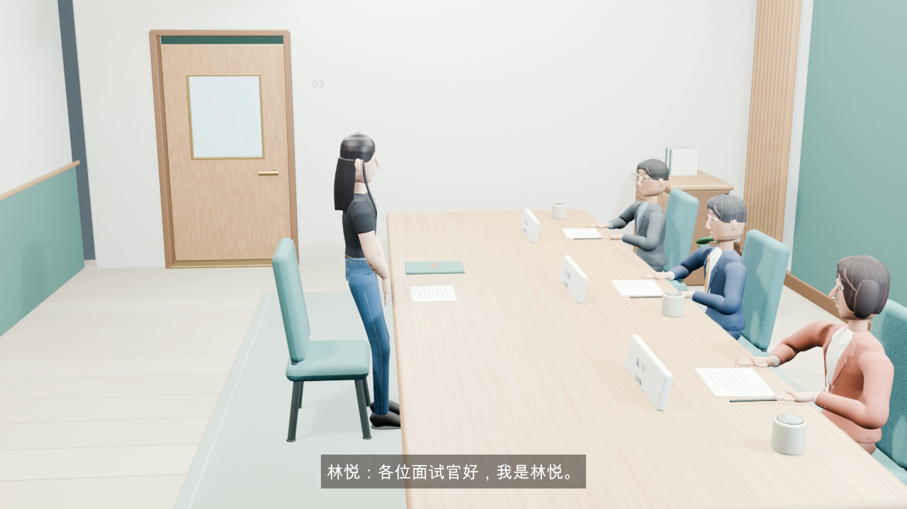
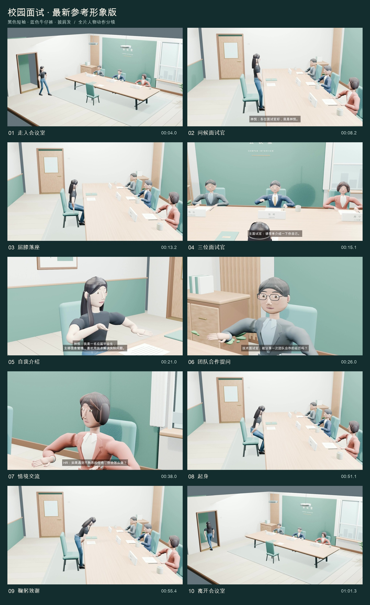
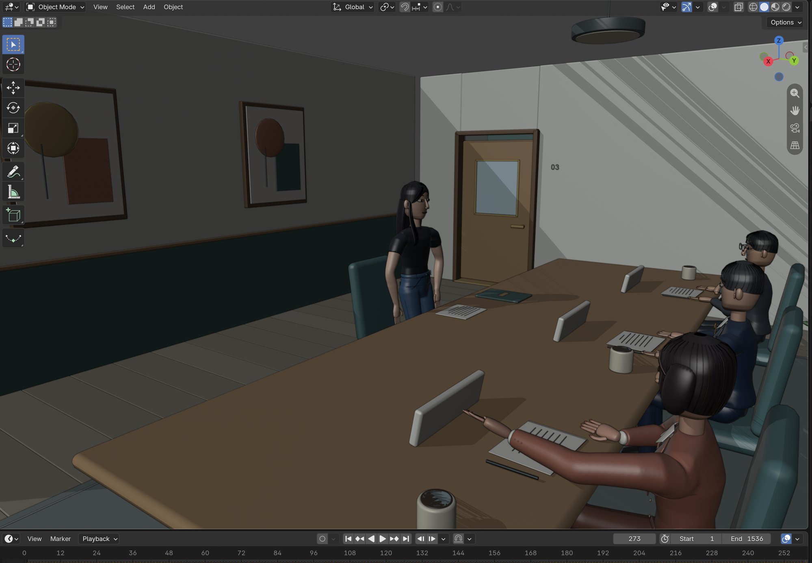
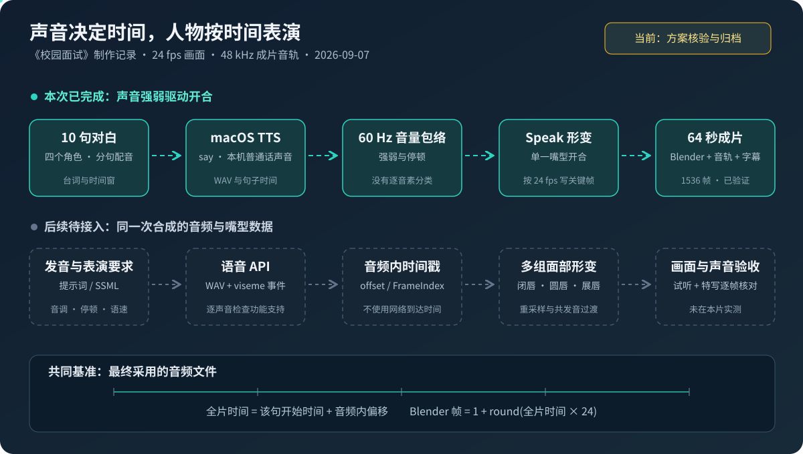
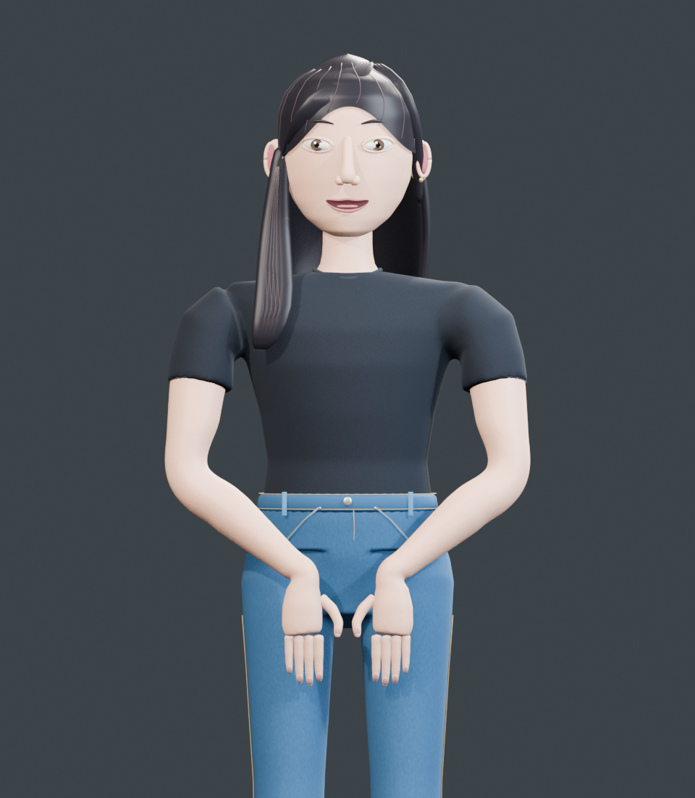

# Blender 系列04：人物面试动画实战——47 骨骼程序化表演、TTS 配音与音量包络口型同步

> 系列导航：[系列01：为什么是 Blender](Blender系列01：为什么是Blender——GPT-6-astra发布演示的3D工具选型与Unreal%20Engine对比.md) ｜ [系列02：三种操作入口与官方 MCP 安装](Blender系列02：三种操作入口与官方MCP安装——三组件架构、本地进程原理与SDK版本兼容实录.md) ｜ [系列03：虎式坦克实战](Blender系列03：虎式坦克实战——从一句话需求到8秒开火动画的完整链路与工程解剖.md) ｜ 本篇
>
> 素材来源：与 Codex（gpt-6-astra）的第二次完整实操（2026-09-07）——从"三个面试官面试一名女大学生"的一句话需求，到 64 秒带中文配音、字幕和口型的人物动画，含两版交付、全部验证报告与语音口型升级方案的官方文档核对。

## 实践二的考察点：从"物体"到"人"

系列03 的虎式坦克考察的是**物体**——刚性部件、父子层级、机械动作。这次的需求刻意换了维度：

> 使用 Blender 来实现三个面试官，面试一个应聘女大学生的视频。在一个会议室里。女大学生进来，坐下，进行交谈，最后鞠躬致谢，离开会议室。这次主要考察**人物的制作和动作**。

人物动画的难度台阶完全不同：关节变形、步态与落脚、坐立转换的重心转移、说话与倾听的表演区分，以及物体动画完全不存在的问题——**口型要跟声音对上**。

最终交付了两版完整视频（64 秒、1280×720、24 fps、1536 帧，中文对白 + 中文字幕，工程与音轨均在本机工作区 `~/Downloads/blender-ws/`）：第一版四人原始造型；用户提供人物形象参考后，重建应聘者角色（黑色短袖、蓝色牛仔裤、披肩发）重新渲染了全部 1536 帧的"参考形象版 V2"。



64 秒里的完整叙事：开门入场（步态）→ 问候（HR 邀请入座）→ 落座（重心转移）→ 三轮问答（36 秒对话表演）→ 起身 → 口头致谢后鞠躬 → 转身离场、门关闭。十个故事节点：



制作路径与坦克一致：**Blender 后台 Python 程序化生成**（制作开始时 MCP 连接失败返回 `127.0.0.1:9876` 不可达，于是直接走了系列02 分工表里的 API 路径——没有把"MCP 调不通"误判成"Blender 做不了动画"）。渲染用 EEVEE、8 次 TAA 采样，1536 帧正式渲染约 11 分 50 秒（仅画面渲染耗时，不含制作全程）。

## 一、人物怎么做：47 根骨骼与三个形态键

四个角色（应聘者林悦 + 主面试官/技术面试官/HR）全部由程序生成网格：头、眼、鼻、唇、耳、发型、躯干、服装、手掌、五指、鞋。每人 **47 根骨骼**：17 根身体骨骼（骨盆、脊柱、胸、颈、头、四肢）+ 30 根手指骨骼（十指各三段），顶点权重分配到相关骨骼。应聘者 172 个网格对象、约 7.5 万基础顶点。

在 Blender 里打开工程（Object Mode）能直接看到这套建模的全部内容——四个程序化人物、会议室、桌椅、门、笔记本电脑与文件等道具，底部时间轴 1–1536 帧就是烘焙好的全片动作：



面部控制只有**三类形态键**：

- `Speak`——嘴部张合（分布在嘴唇、口腔等多个网格上）
- `Blink`——眨眼
- `Smile`——微笑程度

这是理解后文口型局限的关键：模型报告里"5 个 Speak 网格"只是同一控制作用于多个网格，**不等于有 5 种口型**。这一版没有圆唇、展唇、闭唇等逐发音形态，也没有毛发、布料动力学。

素材里反复强调的一条方法论值得单独记下：**顶点数量只能说明模型规模，不能证明写实质量**——7.5 万顶点的角色照样可以看起来像玩偶（后文"积木感"一节展开）。

## 二、动作怎么做：路径、落脚与两个踩过的坑

### 行走不是平移

行走的实现分三层：先规定入口/出口路径，用 Catmull–Rom 曲线生成连续路线并**按弧长采样**（移动速度不依赖控制点间距）；再为左右脚安排**落脚事件**——支撑阶段锁定脚踝目标位置、摆动阶段抬脚前移；膝肘用双节肢体求解（IK），结果全部写成普通骨骼关键帧。属于程序化动作设计，没有用动作捕捉数据。

这里有第一个坑：初版**每隔两帧写一次姿态**，验证在第 1450 帧附近发现着地过渡有约 **2.24 厘米的脚踝偏移**。修正方案是改为**逐帧烘焙**，并保证相邻旋转四元数符号连续——避免插值从错误方向绕过去。最终工程保存第 1–1536 帧普通关键帧，打开 `.blend` 直接播放，与坦克篇同一个"可移植播放"原则。

### 坐下不是把模型往下挪

落座同时处理骨盆高度和前后位置，配合上身前倾、膝盖弯曲、手部支撑，再把手移到桌沿；起身反向做重心转移。第二个坑在这里：手腕目标曾因桌椅距离导致手臂伸得过直——修正靠**缩短人物与桌椅的距离**并重调腕部位置和肘部弯曲，而不是硬掰手臂。

鞠躬的上身倾斜最大 0.66 弧度（约 37.8°），头部配合低下。验证报告里 `bow_angle_degrees = 41.7` 测的是**头部骨骼相对竖直方向的倾角**——不能把它当成髋关节的鞠躬角度写进结论，这是素材里典型的"数字要和它的测量对象绑定"的严谨性。

### 对话表演与镜头

发言者有手势和头部动作，听者有点头、眨眼和视线变化；动作靠预设时间窗口和数学曲线组织，**尚未做到逐词语义驱动**，也没有独立眼球注视骨骼。镜头共 6 台摄影机安排 11 个镜头段落（复用摄影机——"11 次镜头安排"不是"11 台相机"），按对白轮次切换全景、面试官侧、应聘者侧。

自动验证覆盖：四套 47 骨骼、953 个支撑脚踝采样点（最大误差 3.49×10⁻⁷ m，是求解相对目标的数值误差、不是全片零碰撞证明）、坐姿骨盆高度 0.562 m、9 组镜头构图采样、1536 帧逐张解码、成片 64.0 秒无解码错误。

## 三、声音怎么来：本机 TTS 十句对白

这次配音**没有用真人录音、声音克隆或云端语音 API**——全部来自 macOS 系统自带的文字转语音：先写好十句对白，逐句调用 `/usr/bin/say` 用已安装的普通话声音合成：

```python
subprocess.run(
    ["/usr/bin/say", "-v", voice, "-r", str(rate), "-o", str(raw), line],
    check=True,
)
```

四个角色四个系统声音：林悦用 `Tingting`，三位面试官分别用 `Eddy`、`Reed`、`Flo` 的中国大陆普通话版本。每句独立控制语速（rate 190~235），台词太长塞不进时间窗时改台词而不是压缩音频——比如"谢谢你的分享"精简成"谢谢分享"。脚本里保留了 `atempo` 变速分支，但这次所有片段的实际压缩率都是 1.0——**"代码有能力执行"与"本次确实执行了"要分开陈述**。

后期处理成体系：每句 70 Hz 高通、裁静音、按活动语音对齐音量、短淡入淡出，按角色和时间排进 48 kHz 双声道总轨；脚步声和椅子声由噪声 + 滤波 + 衰减合成（没有下载音效），且**重新对齐了动画的实际落脚时间**（入场 12 步、离场 13 步）。成片音轨实测 −18.0 LUFS、真峰值 −2.4 dBTP、无削波。

## 四、口型怎么对上：60 Hz 音量包络驱动

这是本次最值得复用的技术核心。嘴部动画不是手摆的，而是**由音频信号直接驱动**：每句音频按 60 Hz 计算音量包络（48000 Hz 采样率，每窗 800 采样）：

```python
hop = 48000 // 60
rms = np.sqrt(np.mean(windows ** 2, axis=1))
ref = max(float(np.percentile(rms, 88)), 1e-5)
values = np.clip((rms - ref * 0.065) / (ref * 0.935), 0.0, 1.0) ** 0.75
```

拆开看：RMS 求每窗响度；用第 88 百分位做**自适应参考值**（不同声音音量不同，不能用固定阈值）；减去底噪门限后归一到 0–1；`** 0.75` 的幂让小音量也有可见开口。0–1 序列存成 JSON，Blender 在每个视频帧算 `t = (frame - 1) / 24`，找到当前角色的语音片段，在 60 Hz 包络相邻样本间线性插值，乘 0.69 写入 `Speak` 形态键。

效果与局限都很清楚：**说话时张合、停顿时回落、各角色各随自己的台词**——但它只认音量不认发音。"b/p/m"的闭唇、"哦"的圆唇它都不知道；强音不一定张大嘴，轻音也可能需要明确唇形。这就是"简化口型同步"和"精细口型同步"的分界线。



## 五、升级方案：提示词、语音 API 与精细口型（已核对文档、未接入影片）

这一节的所有内容都做过官方文档核对（2026-09-07），但**没有在这部影片中调用云端 API**——方案与实绩的边界必须先立住。

### 先分清四种容易混淆的要求

| 要求 | 例子 | 应使用的控制 |
|---|---|---|
| 发音正确 | 人名"林悦"、多音字、数字 | 发音词典、phoneme / say-as / sub，合成后试听 |
| 声调正确 | 阴阳上去、轻声 | 音素/拼音声调标记（Azure SAPI 记法如 `lin 2 yue 4`） |
| 语气韵律自然 | 礼貌、拘谨、句末收住 | 声音选择、自然语言 instructions 或 SSML prosody/style/break |
| 口型与声音对应 | 闭唇、圆唇、张口、静音 | 与最终音频对应的 viseme / 面部系数，或强制对齐 |

关键认知：**"请让嘴型同步"这句提示词本身不会产生毫秒级时间表**；提高整句 pitch 也不会纠正读错的声调。正确分工是——提示词表达表演意图，语音接口生成声音，声音自带的时间数据驱动嘴型，同一个音频时钟安排镜头、字幕与动作。

### 两条 API 路线

**OpenAI Speech**：`gpt-4o-mini-tts` 用自然语言 `instructions` 控制口音、情绪、语速语气（`tts-1` 系列不支持）；但此接口只返回音频，**没有 phoneme/viseme 时间轴字段**——生成 WAV 后仍需对最终音频做强制对齐或嘴型分析。不能凭空给请求加 `return_visemes=true`，也不能把文本模型猜的音素时间当真实结果。

**Azure Speech**：这条路线能把发音控制和嘴型事件组合起来——`zh-CN` 支持 Viseme ID 和 BlendShapes；`phoneme alphabet="sapi"` 精确控制人名声调；`bookmark` 在音频里锚定动作点（问候结束→点头）。最有工程含量的是 **55 项面部系数按 60 FPS 输出**，进 24 fps 的 Blender 要做时间换算：

```python
t_in_take = (frame_index + row_index) / 60.0
blender_frame_float = 1 + (take_start_seconds + t_in_take) * 24
```

配套的坑也记录在案：Azure 事件时间用 **100 纳秒 tick**（除以 10⁷ 得秒）；**不要用网络回调到达时间当动画时间**（事件在音频数据可用时触发，可能远早于播放）；55 项顺序要按 Azure 官方表而不是想当然套 52 项 ARKit 规范；当前模型只有 Speak/Blink/Smile 三个控制，**把 55 项数值塞进三个形态键不叫精细同步**——要先给角色补形态键或面部骨骼。

### 保持同步的六条工程规则

1. **一次合成是一个完整版本**——台词、参数、WAV、事件、音频 SHA-256 一起存档，防止新声音配旧嘴型；
2. **锁定声音之后再定嘴型**——改语速、停顿、重新合成，波形和事件都会变；
3. **音频剪辑与事件用同一个时间映射**——前加静音 P 秒事件加 P，裁头 C 秒事件减 C；
4. **区分片段起点和发声起点**——本片 `start` 与 `speech_start` 就差 0.01 秒；
5. **统一视频时间基准**——第 1 帧对应 0 秒，不能一处按第 0 帧一处按第 1 帧；
6. **最终合成后再查偏移**——有损编码和播放器同步可能改变呈现，不能只看 Blender 里的曲线。

验收目标定得很务实：24 fps 一帧约 41.7 毫秒，先把关键闭唇与可听辅音的偏移控制在 1–2 帧内，再按嘴部特写试听修正——这是工程验收目标，不是人类感知阈值，也不是 API 精度保证。

## 六、"积木感"解剖：写实的瓶颈是资产，不是像素

制作中用户提供了一张真人照片作参考（照片本身不进入本文——它只在本机工作区作外观参考，且素材明确"照片上的文字不作为身份依据"），希望应聘者换成照片中的形象，并追问了一个非常好的问题：

> Blender 只能用这种矩形、方块之类的简单几何素材吗？

参照照片修改后的样片（黑色短袖、牛仔裤、披肩发）出来后，用户的直觉反馈是"还是积木的感觉，不是真人的感觉——是像素限制？基础素材限制？"：



答案分两层。第一层，**Blender 的能力上限远高于此**：官方支持精细人体雕刻、重拓扑、照片纹理、皮肤材质、毛发、面部绑定和写实渲染（[Blender Animation & Rigging](https://www.blender.org/features/animation/)、[Blender Studio 写实人物工作流](https://studio.blender.org/training/realistic-human-research/design-sculpting/)）。第一版的简化造型是**本次程序化建模方案的结果，不是软件能力上限**。

第二层，逐因素排查确认**主要瓶颈是人物资产、几何结构和材质表达，输出像素不是主因**——样片已有约百万像素、64 次采样，顶点还比原角色多两万，照样不写实：

| 因素 | 样片现状 | 对真人感的影响 |
|---|---|---|
| 头部几何与拓扑 | 横向轮廓环生成的通用头部，五官独立构建 | 缺少眼窝、颧骨、鼻唇、下颌的连续起伏——零件拼装感的主要来源 |
| 照片的使用方式 | 仅作视觉参考：全部角色网格 0 个 UV 图层、0 个图像贴图节点 | 发型服装像了，五官仍是通用角色 |
| 皮肤与眼睛 | 材质底色 + 顶点颜色 + 少量次表面散射；眼球眼睑简化 | 缺少自然的不均匀色彩和微表面变化 |
| 头发 | 发帽 + 发片 + 细管高光，无真实发丝 | 像硬质发块，发际线过于整齐 |
| 面部绑定 | 无下颌骨骼，表情仅 Speak/Blink/Smile | 静帧已见简化，动起来缺肌肉联动 |
| 输出分辨率 | 960×1100 / 720p | 提升清晰度，**不能生成底模中不存在的结构** |

还有一个反直觉的数据：新增顶点里**牛仔裤 + T 恤 + 裸臂手掌合计占 71.4%**，头部主体仍是和原版一样的 2,176 个基础顶点——"加了两万顶点"和"脸更像真人"完全是两回事。素材里那句总结值得当格言记住：**"光滑的通用玩偶仍是通用玩偶。"** 细分和 4K 渲染只会让通用玩偶更清楚。

所以以真人感为目标时，正确路线是换人物制作方案：先取得可动画的人体/面部底模，做好相似度、皮肤、毛发，再把现有的走路、落座、交谈、鞠躬动作迁移过去——场景、故事时间线和音轨都可复用。不是把提示词写得更长、分辨率调得更高。

最终 V2 版是在用户再次明确指定该风格化形象后，把它接入全片重新渲染的：保留三位面试官和全部动作时间线，兼容 47 骨骼接口重建应聘者，独立帧目录渲染（不与第一版混帧），音轨字幕与原版逐字节一致。**全片替换完成不等于照片级写实完成**——风格化定位没有变。

## 七、与实践一（坦克）的对照

两次实战放在一起，正好构成物体动画和人物动画的方法对照：

| 维度 | 坦克（系列03） | 人物面试（本篇） |
|---|---|---|
| 动作骨架 | Empty 父子层级，无骨骼 | 每人 47 根骨骼 + 顶点权重 |
| 动作生成 | 路径函数 + 逐帧烘焙 | 弧长采样路径 + 落脚事件 + IK 求解，逐帧烘焙 |
| 声音 | 无音轨 | 本机 TTS 十句对白 + 合成音效，−18 LUFS |
| "同步"问题 | 不存在 | 音量包络驱动口型（60 Hz → 24 fps） |
| 验证 | 13 关键时刻断言 | 骨架/落脚/坐姿/构图/逐帧解码/响度多层验证 |
| 渲染 | 960×540，2 分 39 秒 | 1280×720×1536 帧，约 11 分 50 秒 |
| 暴露的边界 | 风格化外形，非史料复原 | 简化口型 + 通用人物资产，非写实重建 |

共同的方法内核没变：程序化生成 → 关键帧烘焙进 `.blend`（播放不依赖脚本）→ 自动验证 → 分层交付（工程/中间产物/成片分开），以及贯穿两次实战的叙述纪律——**每个数字绑定它的测量对象，每个"已完成"绑定它的验证范围**。

复现入口（本机工作区 `~/Downloads/blender-ws/interview_film/`）：`characters.py`（人物与骨骼）、`room.py`（会议室）、`build_film.py`（动作与镜头）、`audio/build_audio.py`（TTS 与包络）、`render_film.py` + `finish_film.py`（渲染与合成）。版本管理有一条实用教训：图像序列采用可续渲染配置，**改角色或动作必须换新的帧输出目录**——旧帧新帧混进同一个视频是真实发生过的风险。

## 参考链接

- [OpenAI Text to speech 指南](https://developers.openai.com/api/docs/guides/text-to-speech)
- [OpenAI Create speech 接口](https://developers.openai.com/api/reference/resources/audio/subresources/speech/methods/create)
- [Azure Speech：Get facial position with viseme](https://learn.microsoft.com/en-us/azure/ai-services/speech-service/how-to-speech-synthesis-viseme)（100 ns tick、60 FPS、55 项 BlendShapes）
- [Azure Speech：Language and voice support（visemes）](https://learn.microsoft.com/en-us/azure/ai-services/speech-service/language-support?tabs=tts#visemes)
- [Azure Speech：Pronunciation with SSML](https://learn.microsoft.com/en-us/azure/ai-services/speech-service/speech-synthesis-markup-pronunciation)
- [Azure Speech：Speech phonetic alphabets（中文 SAPI 声调记法）](https://learn.microsoft.com/en-us/azure/ai-services/speech-service/speech-ssml-phonetic-sets)
- [Blender Animation & Rigging](https://www.blender.org/features/animation/)
- [Blender Studio：Realistic Character Workflow](https://studio.blender.org/training/realistic-human-research/design-sculpting/)
